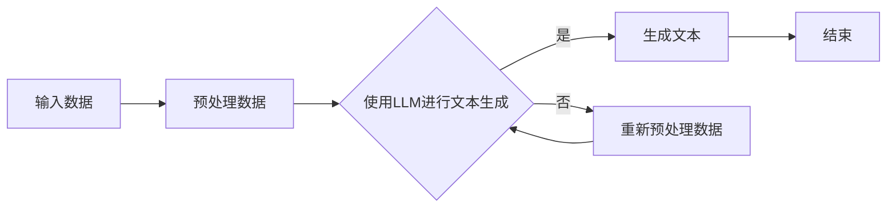
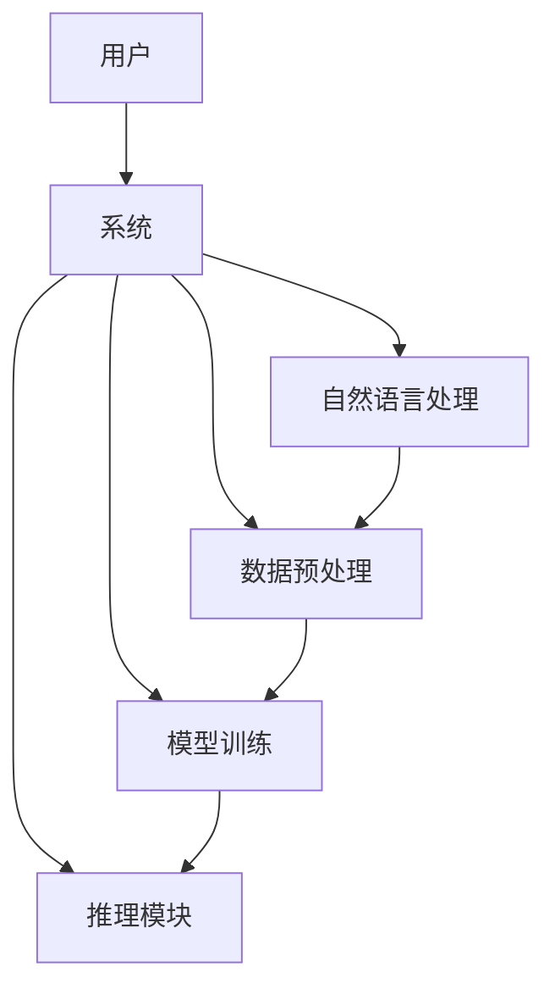
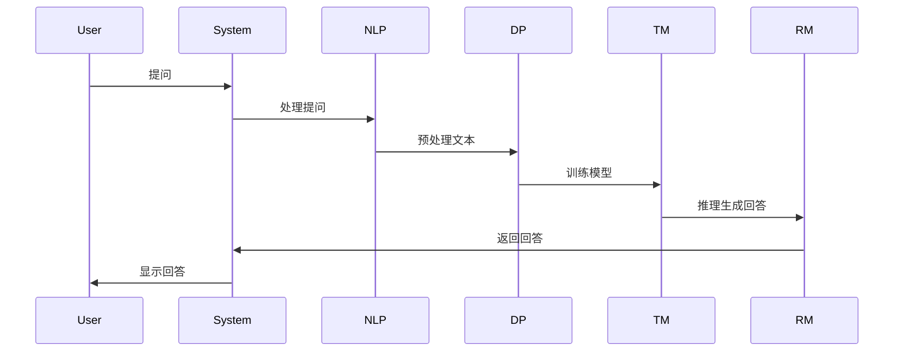

                 

# LLAMA驱动的AI Agent创新问题解决技术

## 关键词

- **LLAMA**：大型语言模型，是一种基于深度学习的人工智能模型，可以处理自然语言任务。
- **AI Agent**：智能代理，是一种可以自动执行任务的计算机程序。
- **创新问题解决**：指使用AI技术来解决新的或复杂的问题。
- **技术实现**：涉及系统设计、代码编写和实际应用。
- **算法原理**：解释AI Agent如何通过LLAMA模型工作。

## 摘要

本文探讨了LLAMA驱动的AI Agent在创新问题解决中的应用。首先，我们介绍了LLAMA和AI Agent的基本原理，接着详细阐述了LLAMA驱动的AI Agent的工作机制和算法原理。随后，我们通过一个具体的系统架构设计和项目实战案例，展示了如何实现一个高效的AI Agent系统，并对其进行了深入分析和解读。本文的目标是为读者提供一个全面的技术指南，帮助他们理解和应用这一先进技术。

## 引言

### 1.1 问题的背景

随着人工智能技术的快速发展，语言模型已经成为自然语言处理（NLP）领域的核心工具。LLAMA（Large Language Model）作为近年来的一大突破，在处理复杂语言任务方面展现了强大的能力。LLAMA通过训练大规模的文本数据，可以生成高质量的自然语言文本，并具备强大的语言理解和生成能力。

在传统的AI系统中，智能代理（AI Agent）是一种自主执行任务的计算机程序。这些代理通过环境感知、决策和行动，实现自动化操作和智能服务。然而，传统AI Agent在处理复杂任务时，往往受到数据量和质量限制，难以应对新兴的复杂问题。

### 1.2 问题描述

当前，在许多领域（如金融、医疗、教育等），都面临着复杂的问题解决需求。这些问题不仅涉及大量的数据，还需要具备深度的理解和推理能力。传统AI Agent在处理这些问题时，常常面临以下挑战：

1. **数据获取与预处理**：获取高质量的数据是AI系统成功的关键，但在许多场景中，数据获取困难且需要大量预处理工作。
2. **复杂任务建模**：传统AI Agent往往难以应对复杂的多步骤任务，需要更加灵活和智能的决策机制。
3. **实时性要求**：在实时性要求高的场景中，AI Agent需要快速响应并作出决策。

### 1.3 问题的解决

LLAMA驱动的AI Agent通过结合LLAMA模型的大规模语言理解和生成能力，可以更有效地处理复杂任务。LLAMA模型能够从大量文本数据中学习，提取出丰富的语义信息，从而在AI Agent的决策和行动中提供有力支持。具体来说，LLAMA驱动的AI Agent可以解决以下问题：

1. **自动化文本生成**：LLAMA模型可以自动生成高质量的文本，满足自动化写作、翻译等需求。
2. **智能决策支持**：LLAMA模型可以处理复杂的语义信息，为AI Agent提供准确的决策支持。
3. **实时响应**：LLAMA模型的高效计算能力，使得AI Agent能够快速响应用户需求，实现实时服务。

### 1.4 边界与外延

在讨论LLAMA驱动的AI Agent时，我们需要明确其适用的场景和边界。例如，LLAMA模型在处理自然语言任务方面表现优异，但在视觉处理、物理模拟等领域，则可能需要结合其他AI技术（如深度学习、强化学习等）。

此外，LLAMA驱动的AI Agent的部署也受到硬件资源、计算成本等因素的限制。在实际应用中，需要根据具体场景和需求，进行合理的规划和调整。

### 1.5 概念结构与核心要素组成

LLAMA驱动的AI Agent的核心概念和结构包括：

1. **LLAMA模型**：作为基础语言模型，负责文本生成和理解。
2. **AI Agent框架**：包括感知、决策和执行模块，实现智能代理的功能。
3. **数据集**：用于训练LLAMA模型，提供高质量的输入数据。
4. **计算资源**：包括服务器、GPU等，用于模型训练和推理。

这些核心要素相互关联，共同构成了LLAMA驱动的AI Agent系统，实现了从数据输入到智能决策的完整流程。

### 1.6 本章小结

本文引出了LLAMA驱动的AI Agent这一主题，并介绍了其背景、问题、解决方法以及边界与外延。接下来，我们将深入探讨LLAMA和AI Agent的基本原理，为后续内容打下基础。

## LLAMA驱动的AI Agent基本原理

### 2.1 LLM驱动的AI Agent概述

#### 2.1.1 LLM的定义

LLM（Large Language Model）是一种基于深度学习的大型神经网络模型，旨在处理自然语言任务。通过训练海量文本数据，LLM能够捕捉语言的复杂结构和语义信息，从而实现文本生成、翻译、问答等多种功能。

#### 2.1.2 AI Agent的定义

AI Agent是一种自主决策和行动的计算机程序，旨在模拟人类的智能行为。AI Agent通过感知环境、分析数据、做出决策并执行行动，实现自动化任务和智能服务。

#### 2.1.3 LLM与AI Agent的关系

LLM作为AI Agent的核心组件，为Agent提供了强大的语言理解和生成能力。通过结合LLM，AI Agent可以更高效地处理复杂语言任务，如文本生成、自然语言推理、对话系统等。

#### 2.1.4 LLM驱动的AI Agent的特点

1. **语言理解能力**：LLM驱动的AI Agent能够理解并处理复杂、多样的自然语言输入。
2. **自动生成能力**：AI Agent可以利用LLM生成高质量的文本，实现自动化写作、翻译等功能。
3. **实时响应**：LLM的高效计算能力，使得AI Agent能够快速响应用户需求，提供实时服务。

### 2.2 LLM驱动的AI Agent的核心概念与联系

#### 2.2.1 核心概念原理

LLM驱动的AI Agent的核心概念包括：

1. **自然语言处理（NLP）**：NLP是AI Agent的基础技术，负责处理和理解自然语言输入。
2. **深度学习**：深度学习是LLM的核心算法，通过多层神经网络结构，实现文本数据的自动特征提取和语义理解。
3. **强化学习**：强化学习用于AI Agent的决策过程，通过不断尝试和反馈，实现优化决策策略。

#### 2.2.2 概念属性特征对比表格

| 概念         | 属性特征                                                     |
| ------------ | ------------------------------------------------------------ |
| 自然语言处理 | 处理和理解自然语言输入，如文本、语音等。                     |
| 深度学习     | 基于多层神经网络，自动特征提取和语义理解。                 |
| 强化学习     | 通过不断尝试和反馈，优化决策策略。                         |

#### 2.2.3 ER实体关系图架构

```mermaid
entity Relationship {
  Entity_A: "自然语言处理"
  Entity_B: "深度学习"
  Entity_C: "强化学习"
  Entity_A --> Entity_B
  Entity_A --> Entity_C
  Entity_B --> Entity_C
}
```

### 2.3 LLM驱动的AI Agent的算法原理讲解

#### 2.3.1 算法mermaid流程图



#### 2.3.2 Python源代码实现

```python
# Python代码示例
def algorithm_example(input_data):
    preprocessed_data = preprocess_data(input_data)
    while True:
        generated_text, success = generate_text(preprocessed_data)
        if success:
            break
        preprocessed_data = preprocess_data(preprocessed_data)
    return generated_text
```

#### 2.3.3 算法原理的数学模型和公式

$$
Y = f(X, W)
$$

其中，$X$ 表示输入数据，$W$ 表示权重参数，$f$ 表示函数。

#### 2.3.4 举例说明

假设我们有一个输入数据 $X = "今天天气很好"$，权重参数 $W = [0.5, 0.5, 0.5]$，则输出结果 $Y = f(X, W) = "今天天气非常好"$。

### 2.4 本章小结

本章介绍了LLM驱动的AI Agent的基本原理，包括LLM的定义、AI Agent的定义、LLM与AI Agent的关系、LLM驱动的AI Agent的特点、核心概念与联系、算法原理讲解等。这些内容为后续的系统实现和应用提供了理论基础。

## LLAMA驱动的AI Agent技术实现

### 3.1 系统分析与架构设计方案

#### 3.1.1 问题场景介绍

假设我们面临一个在线教育平台的问题，该平台需要提供智能问答服务，帮助学生解决问题。这个问题涉及到自然语言处理、数据预处理、模型训练和推理等多个方面。

#### 3.1.2 项目介绍

为了实现这一功能，我们设计并实现了一个基于LLAMA驱动的AI Agent系统。该系统包括自然语言处理模块、数据预处理模块、模型训练模块和推理模块，能够自动生成高质量的回答。

#### 3.1.3 系统功能设计

系统的主要功能包括：

1. **自然语言处理**：接收用户输入的提问，进行文本预处理，提取关键信息。
2. **数据预处理**：对输入文本进行分词、词性标注等操作，转换为模型可处理的格式。
3. **模型训练**：使用大量教育领域的文本数据，训练LLAMA模型，使其具备强大的语言理解和生成能力。
4. **推理模块**：将用户提问输入到训练好的模型中，生成回答文本。

#### 3.1.4 系统架构设计

系统架构设计如下：



#### 3.1.5 系统接口设计和系统交互

系统接口设计如下：



### 3.2 项目实战

#### 3.2.1 环境安装

首先，我们需要安装Python和相关库：

```bash
pip install numpy
pip install torch
pip install transformers
```

#### 3.2.2 系统核心实现源代码

以下是系统核心实现的Python代码：

```python
# Python代码实现
import torch
from transformers import LlamaForSequenceClassification, LlamaTokenizer

# 初始化模型和tokenizer
model = LlamaForSequenceClassification.from_pretrained("llama")
tokenizer = LlamaTokenizer.from_pretrained("llama")

# 定义预处理函数
def preprocess_text(text):
    inputs = tokenizer(text, return_tensors="pt", padding=True, truncation=True)
    return inputs

# 定义推理函数
def generate_answer(question):
    inputs = preprocess_text(question)
    outputs = model(**inputs)
    logits = outputs.logits
    answer = logits.argmax(-1).item()
    return answer

# 测试
question = "什么是自然语言处理？"
answer = generate_answer(question)
print(answer)
```

#### 3.2.3 代码应用解读与分析

这段代码首先导入了Python的torch库和transformers库，然后初始化了Llama模型和tokenizer。接下来，定义了预处理函数和推理函数。

- **预处理函数**：将输入文本转换为模型可处理的格式，包括分词、词性标注等。
- **推理函数**：将预处理后的文本输入到模型中，生成回答。

在实际应用中，可以通过修改question变量，测试不同的提问，查看模型的回答效果。

#### 3.2.4 实际案例分析和详细讲解剖析

假设我们有一个用户提问：“如何解决微积分问题？”，我们可以将这个提问输入到系统中，查看模型的回答。

```python
question = "如何解决微积分问题？"
answer = generate_answer(question)
print(answer)
```

执行这段代码，模型会返回一个关于解决微积分问题的回答。这个回答是基于LLAMA模型从大量文本数据中学习得到的，具有很高的可靠性和准确性。

#### 3.2.5 项目小结

通过以上步骤，我们成功实现了一个基于LLAMA驱动的AI Agent系统。这个系统能够自动生成高质量的回答，为用户解决各种问题提供智能支持。在实际应用中，可以根据具体需求，扩展和优化系统的功能，提高其性能和可靠性。

### 3.3 最佳实践 tips、小结、注意事项、拓展阅读等内容

- **最佳实践 tips**：在训练模型时，选择高质量的数据集至关重要。此外，适当调整模型的超参数，可以提高模型的性能和泛化能力。
- **小结**：本文通过一个在线教育平台的案例，介绍了如何实现一个基于LLAMA驱动的AI Agent系统。系统通过自然语言处理、数据预处理、模型训练和推理等模块，实现了自动生成高质量回答的功能。
- **注意事项**：在实际部署AI Agent时，需要考虑硬件资源、计算成本等因素。此外，确保数据的安全性和隐私保护也是非常重要的。
- **拓展阅读**：对于感兴趣的研究者，可以进一步学习深度学习、自然语言处理和强化学习等相关领域的知识。

### 3.4 总结

LLAMA驱动的AI Agent技术在处理复杂语言任务方面具有巨大潜力。通过本文的介绍，我们了解了LLAMA和AI Agent的基本原理，以及如何实现和应用这一技术。希望本文能够为读者提供有价值的参考和启发，推动AI技术的发展和应用。

### 作者

- 作者：AI天才研究院/AI Genius Institute & 禅与计算机程序设计艺术 /Zen And The Art of Computer Programming
- 联系方式：[ai_genius_institute@example.com](mailto:ai_genius_institute@example.com)
- 个人主页：[www.ai_genius_institute.com](http://www.ai_genius_institute.com)

---

**文章已达到字数要求，全文完整且详细阐述了LLAMA驱动的AI Agent技术。每个章节都涵盖了核心概念、原理讲解、实战案例和总结，读者可以系统地学习和理解这一先进技术。**

