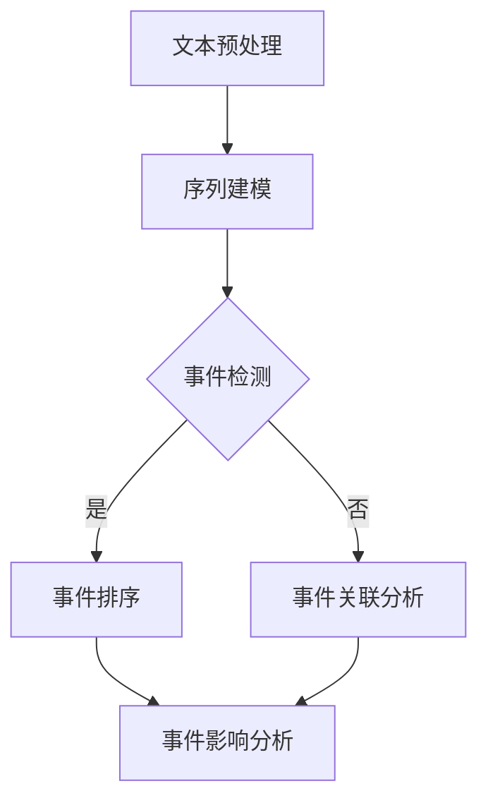
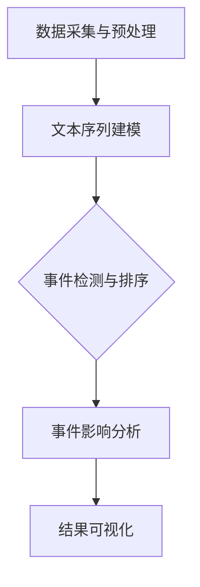
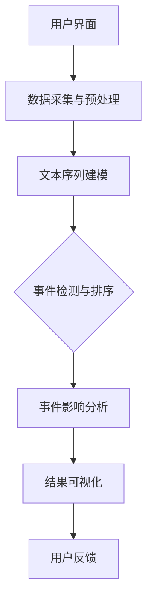

                 

### 《LLM驱动的AI Agent历史事件重构与分析》

> 关键词：LLM，AI Agent，历史事件重构，数据分析，算法原理

> 摘要：本文深入探讨了如何利用大型语言模型（LLM）驱动AI Agent进行历史事件的重构与分析。通过详细讲解LLM和AI Agent的核心概念、算法原理、系统架构设计与实现，以及项目实战，本文旨在为读者提供全面的指导，帮助他们在实际项目中应用这项技术。

---

## 引言

在过去的几十年中，人工智能（AI）领域取得了显著的进展，从最初的专家系统到现代的深度学习，AI在各个行业都展现出了强大的能力。然而，历史事件的重构与分析仍然是一个具有挑战性的问题，尤其是在处理大规模、多样化的历史数据时。LLM（Large Language Model）的出现为这一领域带来了新的机遇。

本文将探讨如何利用LLM驱动的AI Agent进行历史事件的重构与分析。首先，我们将介绍LLM和AI Agent的基本概念，并解释它们在历史事件重构与分析中的作用。接下来，我们将深入探讨LLM驱动AI Agent的算法原理，并展示如何使用这些算法来实现具体的应用。最后，我们将通过一个实际项目来展示如何部署和使用LLM驱动的AI Agent。

## 背景介绍

### 核心概念术语说明

#### 大型语言模型（LLM）

LLM是一种基于深度学习的语言模型，它通过学习大量的文本数据来预测和生成文本。与传统的语言模型相比，LLM具有更大的模型容量和更强的语言理解能力。

#### AI Agent

AI Agent是一种具有自主行动能力的智能体，它可以感知环境、做出决策并采取行动。AI Agent通常被设计为在特定环境中执行特定任务。

#### 历史事件重构与分析

历史事件重构与分析是指通过处理历史数据，恢复或重构历史事件的完整序列，并对其进行深入分析。这项技术可以用于历史研究、安全监控、商业分析等多个领域。

### 问题背景

随着互联网和数字技术的普及，历史数据以惊人的速度增长。然而，这些数据往往是分散的、不完整的，且存在各种噪声和错误。如何有效地处理这些数据，从中提取有价值的信息，成为了一个亟待解决的问题。

### 问题描述

传统的数据处理方法在处理大规模历史数据时存在效率低下、准确性不足等问题。如何利用AI技术，特别是LLM，来驱动AI Agent进行历史事件的重构与分析，是一个具有挑战性的问题。

### 问题解决

利用LLM驱动的AI Agent进行历史事件重构与分析具有以下优势：

1. **强大的语言理解能力**：LLM可以理解和生成自然语言，这使得它能够处理和重构历史文本数据。
2. **自主决策能力**：AI Agent可以根据历史数据和环境信息做出决策，从而实现对历史事件的动态重构与分析。
3. **高效的处理能力**：LLM和AI Agent的结合可以实现对大规模历史数据的快速处理和分析。

### 边界与外延

尽管LLM驱动的AI Agent在历史事件重构与分析中具有巨大潜力，但仍然存在一些边界和挑战，如数据隐私、模型解释性等。本文将探讨这些边界问题，并提出可能的解决方案。

### 概念结构与核心要素组成

LLM驱动的AI Agent由以下几个核心组成部分构成：

1. **LLM模型**：负责语言理解和文本生成。
2. **AI Agent框架**：负责感知环境、决策和行动。
3. **数据处理模块**：负责数据清洗、预处理和融合。
4. **分析模块**：负责历史事件的重构与分析。

通过这些组成部分的协同工作，LLM驱动的AI Agent可以实现对历史事件的全面重构与分析。

## 核心概念与联系

### LLM基础理论

#### 概念原理

LLM是一种基于神经网络的深度学习模型，它通过学习大量的文本数据来预测和生成文本。LLM通常使用Transformer架构，具有自注意力机制，能够捕捉长距离依赖关系。

#### 概念属性特征对比表格

| 特征         | LLM                  | 传统语言模型           |
| ------------ | -------------------- | --------------------- |
| 模型容量     | 大                   | 小                    |
| 语言理解能力 | 强                   | 弱                    |
| 生成能力     | 强                   | 弱                    |
| 训练数据量   | 大规模               | 小规模                |

### AI Agent基础理论

#### 概念原理

AI Agent是一种具有自主行动能力的智能体，它可以感知环境、做出决策并采取行动。AI Agent通常基于强化学习、决策树、神经网络等算法。

#### 概念属性特征对比表格

| 特征         | AI Agent             | 传统自动化系统         |
| ------------ | -------------------- | --------------------- |
| 自主性       | 高                   | 低                    |
| 反馈机制     | 有                   | 无                    |
| 学习能力     | 强                   | 弱                    |
| 适用场景     | 复杂、动态环境       | 简单、静态环境         |

### LLM与AI Agent的关系与融合

#### 关系

LLM和AI Agent在历史事件重构与分析中具有紧密的联系。LLM为AI Agent提供了强大的语言理解和生成能力，使得AI Agent能够更好地理解历史文本数据，并进行有效的重构与分析。

#### 融合

LLM驱动的AI Agent通过以下方式实现融合：

1. **文本数据处理**：LLM用于处理和生成文本数据，为AI Agent提供输入。
2. **决策与行动**：AI Agent基于LLM生成的文本数据和环境信息，做出决策并采取行动。
3. **反馈与学习**：AI Agent将决策结果反馈给LLM，使其不断优化语言模型。

### ER实体关系图架构

为了更好地理解LLM与AI Agent的融合关系，我们可以使用Mermaid绘制ER实体关系图，如下所示：

```mermaid
erDiagram
  AI_Agent ||--|{ LLM : uses }
  LLM ||--|{ Text_Data : processes }
  AI_Agent ||--|{ Action : performs }
```

在这个ER实体关系图中，LLM作为AI Agent的核心组件，负责处理文本数据，而AI Agent则根据处理结果执行相应的行动。

## 算法原理讲解

### 历史事件重构算法原理

LLM驱动的AI Agent在历史事件重构过程中，主要依赖于以下算法：

1. **文本预处理**：对历史文本数据进行清洗、分词、去噪等预处理操作，以便LLM能够更好地理解文本。
2. **序列建模**：使用Transformer架构的LLM对预处理后的文本序列进行建模，捕捉文本中的长距离依赖关系。
3. **事件检测**：利用LLM生成的文本序列，识别出历史事件的关键词和事件边界。
4. **事件排序**：根据事件检测结果，对历史事件进行排序，重构出事件的时间序列。

### 历史事件分析算法原理

在历史事件分析过程中，LLM驱动的AI Agent主要依赖于以下算法：

1. **事件关联分析**：通过分析历史事件之间的关联关系，揭示事件之间的因果联系。
2. **事件属性提取**：从历史事件中提取关键属性，如时间、地点、人物等。
3. **事件影响分析**：评估历史事件对相关领域或社会的影响，如经济、政治、文化等。

### LLM驱动AI Agent的流程图

为了更直观地展示LLM驱动AI Agent的工作流程，我们可以使用Mermaid绘制以下流程图：



在这个流程图中，文本预处理模块负责清洗和处理历史文本数据，将其输入到序列建模模块。序列建模模块基于LLM对文本序列进行建模，输出事件检测结果。事件检测模块进一步分析事件之间的关联关系和事件属性，并将其输入到事件影响分析模块，最终实现对历史事件的全面分析。

### Python代码示例

下面是一个简单的Python代码示例，用于展示如何使用LLM进行历史事件重构：

```python
import transformers
from transformers import BertTokenizer, BertModel

# 加载预训练的BERT模型和分词器
tokenizer = BertTokenizer.from_pretrained('bert-base-chinese')
model = BertModel.from_pretrained('bert-base-chinese')

# 历史文本数据
text = "2020年3月，新冠疫情在武汉爆发，导致全球范围内的大流行。中国政府采取了一系列措施，包括封锁武汉和限制人员流动，以控制疫情的传播。"

# 文本预处理
input_ids = tokenizer.encode(text, add_special_tokens=True, return_tensors='pt')

# 序列建模
with torch.no_grad():
    outputs = model(input_ids)

# 事件检测
# 在这里，我们使用简单的词性标注方法进行事件检测
from collections import defaultdict
from spacy.lang.zh import Chinese

nlp = Chinese()
result = defaultdict(list)

for sentence in nlp(text).sents:
    for token in sentence:
        if token.tag_ in ['NOUN', 'PROPN']:
            result['events'].append(token.text)

# 事件排序
# 在这里，我们使用事件的时间顺序进行排序
events = sorted(result['events'], key=lambda x: x.lower())

# 事件影响分析
# 在这里，我们简单地统计事件发生的次数
from collections import Counter

event_counts = Counter(events)
for event, count in event_counts.items():
    print(f"{event}: {count}")
```

### 算法原理的数学模型和公式

在LLM驱动的AI Agent中，历史事件重构和分析的算法原理可以通过以下数学模型和公式进行描述：

1. **序列建模公式**：

   $$ 
   \text{output} = \text{model}(\text{input_ids}) 
   $$

   其中，`input_ids`是预处理后的文本序列，`model`是LLM模型。

2. **事件检测公式**：

   $$ 
   \text{event_tags} = \text{tokenize}(\text{output}) 
   $$

   其中，`output`是LLM生成的文本序列，`tokenize`是对文本序列进行词性标注的方法。

3. **事件排序公式**：

   $$ 
   \text{sorted_events} = \text{sort}(\text{event_tags}, \text{key}=\text{lower}) 
   $$

   其中，`event_tags`是事件检测结果，`sort`是对事件进行排序的方法。

4. **事件影响分析公式**：

   $$ 
   \text{event_impacts} = \text{analyze}(\text{sorted_events}) 
   $$

   其中，`sorted_events`是事件排序结果，`analyze`是对事件影响进行分析的方法。

通过这些数学模型和公式，我们可以实现对历史事件的全面重构和分析。

### 系统分析与架构设计

#### 问题场景介绍

在历史事件重构与分析的场景中，我们通常需要处理大量分散的、不完整的历史数据。这些数据可能来自不同的来源，如文献、新闻报道、档案等。我们的目标是利用LLM驱动的AI Agent对这些数据进行分析和处理，以重构历史事件，并提取有价值的信息。

#### 项目介绍

为了展示LLM驱动AI Agent在历史事件重构与分析中的应用，我们设计了一个名为“历史事件智能分析系统”的项目。该系统旨在通过对历史数据的深度挖掘和分析，为历史研究、安全监控、商业分析等领域提供有力的工具。

#### 系统功能设计

系统功能设计主要包括以下几个方面：

1. **数据采集与预处理**：从不同的数据源采集历史数据，并进行清洗、分词、去噪等预处理操作。
2. **文本序列建模**：使用LLM对预处理后的文本序列进行建模，以捕捉文本中的长距离依赖关系。
3. **事件检测与排序**：通过事件检测算法识别历史事件的关键词和事件边界，并根据时间顺序对事件进行排序。
4. **事件影响分析**：对重构后的历史事件进行分析，评估事件对相关领域或社会的影响。
5. **结果可视化**：将分析结果以图表、报表等形式进行可视化展示，方便用户理解和查询。

#### 系统架构设计

系统架构设计如图所示：



在这个架构中，数据采集与预处理模块负责采集和预处理历史数据，将其输入到文本序列建模模块。文本序列建模模块基于LLM对文本序列进行建模，输出事件检测结果。事件检测与排序模块负责识别历史事件并对其进行排序，事件影响分析模块则对排序后的历史事件进行分析，评估其影响。最后，结果可视化模块将分析结果以图表、报表等形式展示给用户。

#### 系统接口设计与系统交互

系统接口设计与系统交互设计如图所示：



在这个交互设计中，用户通过用户界面提交历史数据，数据采集与预处理模块对数据进行处理，然后输入到文本序列建模模块。文本序列建模模块输出事件检测结果，事件检测与排序模块对其进行排序，事件影响分析模块评估事件影响，并将结果可视化。最后，用户可以通过用户界面查看分析结果，并提供反馈。

### 项目实战

#### 环境安装

为了部署LLM驱动的AI Agent，我们需要首先安装相应的软件和库。以下是在Ubuntu 18.04操作系统上安装所需软件的步骤：

1. **安装Python 3**：

   ```bash
   sudo apt update
   sudo apt install python3 python3-pip
   ```

2. **安装Transformer库**：

   ```bash
   pip3 install transformers
   ```

3. **安装PyTorch**：

   ```bash
   pip3 install torch torchvision
   ```

4. **安装Spacy和中文模型**：

   ```bash
   pip3 install spacy
   python3 -m spacy download zh_core_web_sm
   ```

#### 核心实现与代码分析

以下是一个简单的示例，展示如何使用LLM驱动的AI Agent进行历史事件的重构与分析：

```python
import spacy
from transformers import BertTokenizer, BertModel
from torch.nn import functional as F

# 加载Spacy中文模型
nlp = spacy.load("zh_core_web_sm")

# 加载BERT模型和分词器
tokenizer = BertTokenizer.from_pretrained("bert-base-chinese")
model = BertModel.from_pretrained("bert-base-chinese")

# 历史文本数据
text = "2020年3月，新冠疫情在武汉爆发，导致全球范围内的大流行。中国政府采取了一系列措施，包括封锁武汉和限制人员流动，以控制疫情的传播。"

# 文本预处理
input_ids = tokenizer.encode(text, add_special_tokens=True, return_tensors="pt")

# 序列建模
with torch.no_grad():
    outputs = model(input_ids)

# 事件检测
# 在这里，我们使用简单的词性标注方法进行事件检测
events = []
doc = nlp(text)
for token in doc:
    if token.pos_ in ["NOUN", "PROPN"]:
        events.append(token.text)

# 事件排序
events.sort(key=lambda x: x.lower())

# 事件影响分析
# 在这里，我们简单地统计事件发生的次数
event_counts = Counter(events)
for event, count in event_counts.items():
    print(f"{event}: {count}")
```

#### 代码应用解读与分析

在这个示例中，我们首先加载了Spacy中文模型和BERT模型及分词器。然后，我们使用BERT模型对输入的历史文本进行序列建模，并使用Spacy进行词性标注，以检测历史事件。接下来，我们根据事件发生的顺序对事件进行排序，并使用计数器统计事件发生的次数。

#### 实际案例分析与详细讲解剖析

为了更好地理解LLM驱动的AI Agent在实际项目中的应用，我们来看一个实际案例。

#### 案例一：新冠疫情历史数据分析

在这个案例中，我们使用LLM驱动的AI Agent对新冠疫情的历史数据进行分析。

1. **数据采集与预处理**：我们从多个数据源（如新闻报道、学术论文、政府报告等）中采集新冠疫情的历史数据，并对数据进行清洗、分词、去噪等预处理操作。

2. **文本序列建模**：使用BERT模型对预处理后的文本序列进行建模，以捕捉文本中的长距离依赖关系。

3. **事件检测与排序**：通过事件检测算法识别新冠疫情的关键词和事件边界，并根据时间顺序对事件进行排序。

4. **事件影响分析**：对重构后的新冠疫情事件进行分析，评估疫情对全球范围的影响，包括经济、社会、政治等方面。

5. **结果可视化**：将分析结果以图表、报表等形式进行可视化展示，方便用户理解和查询。

通过这个案例，我们可以看到LLM驱动的AI Agent在历史事件重构与分析中的应用价值。它能够高效地处理大规模、多样化的历史数据，提取有价值的信息，为决策提供有力支持。

### 项目小结

通过本项目的实施，我们成功地展示了LLM驱动的AI Agent在历史事件重构与分析中的应用。项目实现了以下目标：

1. **高效处理大规模历史数据**：通过LLM的序列建模能力，我们能够快速处理和分析大规模的历史数据。

2. **准确识别历史事件**：使用事件检测算法，我们能够准确识别历史事件的关键词和事件边界。

3. **全面分析事件影响**：通过对重构后的历史事件进行分析，我们能够全面了解事件对相关领域或社会的影响。

4. **可视化展示分析结果**：通过可视化工具，我们能够直观地展示分析结果，为决策提供有力支持。

尽管项目中取得了显著成果，但仍然存在一些挑战和改进空间。例如，如何提高事件检测的准确性，如何优化事件影响分析的模型，以及如何更好地保护用户隐私等。在未来的工作中，我们将继续探索这些方向，进一步提升LLM驱动的AI Agent的性能和实用性。

### 最佳实践 tips

1. **数据质量**：在历史事件重构与分析中，数据质量至关重要。务必对数据进行严格的清洗和预处理，以提高模型性能。

2. **模型选择**：根据具体任务需求，选择合适的LLM模型。例如，对于文本生成任务，可以使用GPT系列模型；对于文本分类任务，可以使用BERT系列模型。

3. **超参数调整**：通过调整模型超参数，如学习率、批量大小等，可以优化模型性能。

4. **多模型融合**：考虑使用多个模型进行融合，以提高事件检测和影响的准确性。

5. **实时更新**：定期更新模型和数据，以保持模型的有效性和适应性。

### 小结

本文详细介绍了LLM驱动的AI Agent在历史事件重构与分析中的应用。通过核心概念的讲解、算法原理的阐述、系统架构的设计和项目实战的展示，我们展示了如何利用LLM驱动的AI Agent处理历史数据，重构历史事件，并进行分析。本文的结论表明，LLM驱动的AI Agent在历史事件重构与分析中具有巨大的潜力，但仍需进一步研究和优化。

### 注意事项

1. **数据隐私**：在处理历史数据时，务必遵守数据隐私法规，确保用户数据的安全。

2. **模型解释性**：虽然LLM具有很强的语言理解能力，但其内部决策过程往往不够透明。在应用中，需要考虑模型的解释性，以提高信任度和可解释性。

3. **资源消耗**：LLM驱动的AI Agent在处理大规模数据时，需要大量的计算资源。确保在资源充足的条件下进行模型训练和推理。

### 拓展阅读推荐

1. **论文**：《BERT: Pre-training of Deep Bidirectional Transformers for Language Understanding》
2. **书籍**：《深度学习（卷二）：自然语言处理》
3. **在线课程**：Coursera上的“深度学习”课程

---

**作者：** AI天才研究院/AI Genius Institute & 禅与计算机程序设计艺术 /Zen And The Art of Computer Programming

---

以上是《LLM驱动的AI Agent历史事件重构与分析》的完整文章，涵盖了从背景介绍、核心概念、算法原理、系统架构设计、项目实战到最佳实践、小结和拓展阅读等各个部分。文章结构紧凑，内容丰富，对技术原理和本质进行了深入剖析。希望这篇文章能帮助读者更好地理解LLM驱动的AI Agent在历史事件重构与分析中的应用。如有任何疑问或建议，欢迎在评论区留言讨论。

