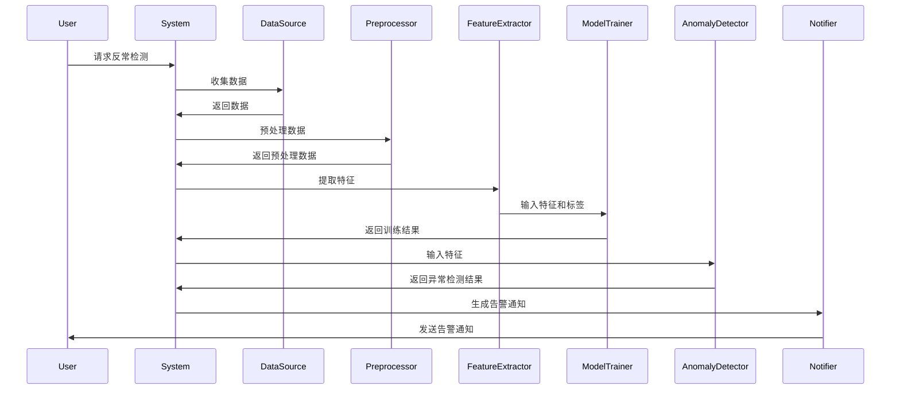
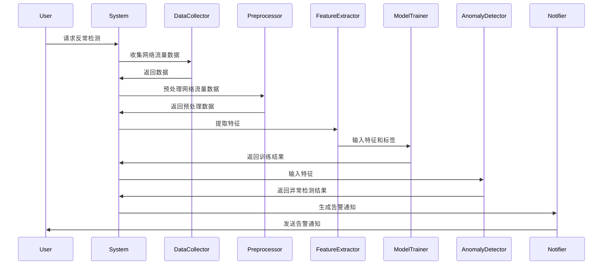

                 

### 第一部分: LLM驱动的AI Agent反常检测机制概述

#### 第1章: 反常检测的基本概念

##### 1.1 问题背景与意义

反常检测（Anomaly Detection）是一种通过识别数据中的异常行为或模式来发现潜在问题的方法。在过去的几十年中，随着数据规模的爆炸性增长和复杂性的提高，反常检测逐渐成为数据分析和机器学习领域中的一个重要研究方向。反常检测的应用场景广泛，包括但不限于以下几个方面：

- **安全监控与防护**：在网络安全、金融欺诈检测等领域，反常检测技术可以实时监测系统中的异常行为，及时发现潜在的安全威胁。

- **医疗诊断与监控**：在医疗领域，反常检测可以用于监测患者的生理数据，识别异常生理指标，从而帮助医生进行早期诊断和治疗。

- **互联网异常行为分析**：在互联网公司，反常检测可以用于监控用户行为，识别恶意用户或异常操作，提高系统的安全性和用户体验。

随着人工智能技术的发展，特别是深度学习和自然语言处理（NLP）的兴起，反常检测技术得到了进一步的发展。语言模型（Language Model，简称LLM）作为一种强大的NLP工具，能够处理大规模的文本数据，对文本数据进行特征提取和模式识别。LLM驱动的AI Agent反常检测机制利用了LLM的优势，在处理复杂文本数据、提高检测精度和效率方面具有显著优势。

研究反常检测的重要性不仅在于其实际应用价值，还在于其对AI Agent发展的推动作用。通过反常检测，AI Agent能够更加智能地处理各种异常情况，提高系统的自我学习和适应能力。这对于AI Agent在现实世界中的应用具有重要意义。

##### 1.2 反常检测的定义

反常检测是一种通过识别数据中的异常行为或模式来发现潜在问题的方法。在数据集中，正常行为和反常行为是相对的，正常行为是大多数数据点的行为模式，而反常行为是少数数据点的行为模式。反常检测的目标是找出这些少数的数据点，以便进一步分析和处理。

定义正常行为和反常行为的区分标准是反常检测的关键。通常，这些标准可以基于统计学方法、机器学习方法或专家知识。例如，统计学方法可以基于概率模型或密度估计模型，机器学习方法可以使用监督学习或无监督学习算法，而专家知识可以通过设定特定的规则来实现。

反常检测的目标是识别出数据集中的反常点，并对这些反常点进行分析和处理。具体来说，反常检测的目标包括：

- **发现异常数据**：识别数据集中的异常数据点，这些数据点可能包含错误、噪声或不一致的信息。

- **异常分类**：对识别出的异常数据点进行分类，确定其异常的类型和程度。

- **异常分析**：对异常数据进行分析，找出异常产生的原因，并提供相应的解决方案。

- **异常监控**：实时监测数据流，识别新的异常数据点，并更新异常检测模型。

反常检测的方法主要包括以下几种：

- **基于统计学的方法**：这种方法基于概率模型或密度估计模型，通过计算每个数据点的概率或密度来识别异常点。常见的方法包括K-近邻算法（K-Nearest Neighbors，KNN）、孤立森林（Isolation Forest）和局部异常因子（Local Outlier Factor，LOF）等。

- **基于机器学习的方法**：这种方法使用监督学习或无监督学习算法来训练模型，识别异常点。常见的监督学习方法包括逻辑回归（Logistic Regression）和决策树（Decision Tree）等，而无监督学习方法包括自编码器（Autoencoder）和聚类算法（如K-均值聚类）等。

- **基于专家知识的方法**：这种方法基于专家设定的规则来识别异常点。专家可以根据业务需求和领域知识定义特定的规则，例如，对于金融交易数据，可以设定超过某个阈值的交易金额为异常。

##### 1.3 反常检测的核心概念

反常检测的核心概念主要包括以下几个方面：

- **标签数据与无标签数据**：在反常检测中，通常有两种类型的数据：标签数据和无标签数据。标签数据是已经标注为正常或异常的数据点，用于训练和评估反常检测模型。无标签数据是没有被标注的数据点，需要通过模型预测其是否为异常点。在实际应用中，通常需要使用标签数据来训练模型，并通过无标签数据进行预测。

- **特征提取与模型训练**：特征提取是将原始数据转化为适合模型处理的形式，模型训练是使用已标记的数据来训练模型。在反常检测中，特征提取和模型训练是关键步骤，直接影响到模型的性能和效果。特征提取可以基于统计学方法、机器学习方法或深度学习方法，模型训练则通常使用监督学习或无监督学习算法。

- **模型评估与优化**：模型评估是使用已标记的数据来评估模型的性能，包括准确率、召回率、F1值等指标。模型优化是通过调整模型参数或使用不同的算法来提高模型的性能。在反常检测中，模型评估和优化是确保模型在实际应用中能够有效识别异常点的重要环节。

- **数据质量与标注**：数据质量对反常检测模型的效果有重要影响。高质量的数据能够提供更多的信息，帮助模型更好地识别异常点。标注质量也是影响模型效果的关键因素，准确的标注可以确保模型学习到正确的异常行为。

- **模型解释性**：在反常检测中，模型解释性是一个重要的问题。解释性模型能够帮助用户理解模型决策的原因，从而提高模型的透明度和可接受度。例如，使用决策树或规则模型可以实现较好的解释性，而深度学习模型则通常较为复杂，解释性较差。

##### 1.4 反常检测的应用场景

反常检测在各种应用领域中具有广泛的应用，以下列举几个典型的应用场景：

- **安全监控与防护**：在网络安全领域，反常检测可以用于监测网络流量，识别恶意攻击或异常流量。通过对正常流量和异常流量的特征进行分析，可以构建反常检测模型，实时检测和阻止潜在的安全威胁。

- **医疗诊断与监控**：在医疗领域，反常检测可以用于监测患者的生理指标，如心率、血压等。通过对正常生理指标和异常生理指标的特征进行分析，可以构建反常检测模型，及时发现异常情况，帮助医生进行早期诊断和治疗。

- **互联网异常行为分析**：在互联网公司，反常检测可以用于监控用户行为，识别恶意用户或异常操作。通过对正常用户行为和异常用户行为的特征进行分析，可以构建反常检测模型，提高系统的安全性和用户体验。

- **工业监控与故障预测**：在工业领域，反常检测可以用于监测设备状态，识别设备故障或异常。通过对正常设备状态和异常设备状态的特征进行分析，可以构建反常检测模型，提前预测设备故障，减少生产中断和损失。

- **金融欺诈检测**：在金融领域，反常检测可以用于检测金融欺诈行为，如信用卡欺诈、洗钱等。通过对正常交易和异常交易的特征进行分析，可以构建反常检测模型，实时监测和阻止潜在的金融欺诈行为。

- **交通监控与安全管理**：在交通领域，反常检测可以用于监测交通流量，识别交通异常事件，如交通事故、交通拥堵等。通过对正常交通流量和异常交通流量的特征进行分析，可以构建反常检测模型，提高交通管理的效率和安全性。

##### 1.5 本章小结

本章介绍了反常检测的基本概念，包括问题背景、定义、核心概念和应用场景。反常检测是一种通过识别数据中的异常行为或模式来发现潜在问题的方法，具有重要的实际应用价值。在反常检测中，标签数据与无标签数据、特征提取与模型训练、模型评估与优化等核心概念是关键，不同应用场景下的反常检测方法也有所不同。本章为后续章节的深入讨论奠定了基础。接下来，我们将进一步探讨LLM驱动的AI Agent基础，了解LLM的基本原理、AI Agent的概念以及它们在反常检测中的结合和应用。

---

#### 第2章: LLM驱动的AI Agent基础

##### 2.1 语言模型（LLM）的原理

#### 2.1.1 语言模型的定义

语言模型（Language Model，简称LLM）是一种基于统计学或深度学习的模型，用于预测文本序列中的下一个单词或字符。语言模型在自然语言处理（NLP）领域中起着至关重要的作用，它们被广泛应用于机器翻译、文本生成、问答系统、语音识别等任务中。

语言模型可以分为统计语言模型和深度学习语言模型。统计语言模型基于大量语言数据进行训练，使用概率模型来预测下一个单词或字符。深度学习语言模型则使用神经网络结构来学习语言数据中的复杂模式，通常具有更高的预测精度和灵活性。

语言模型的类型主要包括以下几种：

- **N-gram模型**：N-gram模型是一种最简单的统计语言模型，它基于前N个单词的历史来预测下一个单词。例如，二元语法（Bigram）模型使用前两个单词的历史来预测下一个单词，三元语法（Trigram）模型使用前三个单词的历史来预测下一个单词。

- **神经网络语言模型**：神经网络语言模型使用深度神经网络（DNN）或循环神经网络（RNN）来学习语言数据中的复杂模式。RNN可以处理序列数据，并具有记忆功能，能够更好地捕捉语言中的长期依赖关系。近年来，基于Transformer的模型（如BERT、GPT）在NLP任务中取得了显著的成果，进一步提升了语言模型的性能。

- **递归神经网络（RNN）**：递归神经网络是一种能够处理序列数据的神经网络，其每个时间步的输出都会影响到下一个时间步。RNN可以通过梯度消失或梯度爆炸问题来优化训练，例如，LSTM（长短期记忆）和GRU（门控循环单元）是RNN的变体，它们通过门控机制来解决这个问题，从而更好地捕捉序列数据中的长期依赖关系。

- **Transformer模型**：Transformer模型是由Vaswani等人于2017年提出的，它采用自注意力机制（self-attention）来处理序列数据，避免了RNN中的梯度消失和梯度爆炸问题。Transformer模型基于多头自注意力（multi-head self-attention）和前馈神经网络（feed-forward network）构建，能够在处理长序列数据时保持高效性和准确性。BERT（双向编码器表征）和GPT（生成预训练转换器）是基于Transformer模型的代表性语言模型。

语言模型在文本生成中的应用非常广泛，例如，可以使用语言模型来生成文章、对话、诗歌等文本内容。语言模型的训练过程通常包括以下步骤：

1. **数据收集与预处理**：收集大量文本数据，并对数据进行清洗、分词、去除停用词等预处理操作，以便模型能够更好地理解文本数据。

2. **构建词汇表**：将预处理后的文本数据转换为数字序列，构建词汇表，将文本中的单词映射为唯一的整数。

3. **训练模型**：使用训练数据对语言模型进行训练，模型将学习文本数据中的统计规律和模式，从而能够预测下一个单词或字符。

4. **模型评估与优化**：使用验证数据对模型进行评估，并调整模型参数以优化性能。评估指标包括损失函数、 perplexity（困惑度）和词汇覆盖等。

5. **应用模型**：将训练好的语言模型应用于实际任务中，如文本生成、机器翻译、问答系统等。

#### 2.1.2 语言模型的工作原理

语言模型的工作原理可以概括为以下几个步骤：

1. **输入处理**：语言模型接收一段文本输入，将其转换为数字序列。例如，对于输入文本“我是人工智能助手”，首先进行分词操作，将文本分为“我”、“是”、“人工智能”、“助手”四个单词，然后使用词汇表将每个单词映射为唯一的整数，得到数字序列。

2. **编码**：语言模型将输入的数字序列编码为向量表示。在统计语言模型中，通常使用N-gram模型或计数模型来生成编码向量；在深度学习语言模型中，通常使用循环神经网络（RNN）或Transformer模型来生成编码向量。

3. **预测**：语言模型根据编码向量预测下一个单词或字符的概率分布。在统计语言模型中，模型将计算输入序列中每个单词或字符的概率，并选择概率最大的单词或字符作为预测结果；在深度学习语言模型中，模型通常使用Softmax函数将编码向量映射为概率分布，并选择概率最大的单词或字符作为预测结果。

4. **解码**：语言模型将预测的单词或字符解码为文本输出。例如，对于输入文本“我是人工智能助手”，语言模型将预测的“助手”单词解码为文本输出“助手”。

语言模型的优化目标是通过最小化预测误差来提高模型性能。在统计语言模型中，通常使用最大似然估计（Maximum Likelihood Estimation，MLE）来优化模型参数；在深度学习语言模型中，通常使用梯度下降（Gradient Descent）或其变体（如Adam优化器）来优化模型参数。

#### 2.1.3 语言模型的评价指标

语言模型的评价指标主要包括损失函数、困惑度（perplexity）和词汇覆盖（word coverage）等。

- **损失函数**：损失函数用于衡量模型预测结果与实际结果之间的差异。在统计语言模型中，常用的损失函数包括交叉熵损失（Cross-Entropy Loss）和均方误差（Mean Squared Error，MSE）；在深度学习语言模型中，常用的损失函数包括交叉熵损失（Cross-Entropy Loss）和负对数似然损失（Negative Log-Likelihood Loss）。

- **困惑度**：困惑度（Perplexity）是一个衡量模型预测效果的指标，计算公式为：

  \[
  \text{Perplexity} = \frac{1}{\sum_{i=1}^{N} p(y_i|x)^2}
  \]

  其中，\(p(y_i|x)\) 表示模型在输入序列 \(x\) 下预测单词 \(y_i\) 的概率。困惑度越小，说明模型预测效果越好。

- **词汇覆盖**：词汇覆盖（Word Coverage）是一个衡量模型对词汇掌握程度的指标，计算公式为：

  \[
  \text{Word Coverage} = \frac{\text{模型预测到的单词数}}{\text{词汇表中的单词数}}
  \]

  词汇覆盖越高，说明模型能够覆盖更多的词汇，从而提高文本生成的多样性和流畅性。

##### 2.2 AI Agent的概念

#### 2.2.1 AI Agent的定义

AI Agent（人工智能代理）是一种能够自主感知环境、制定目标并采取行动的人工智能系统。AI Agent具有以下几个特点：

- **自主性**：AI Agent可以独立地执行任务，不需要人类干预。

- **感知性**：AI Agent能够感知和理解环境中的信息，如视觉、听觉、触觉等。

- **目标导向**：AI Agent具有明确的目标，并根据目标制定行动策略。

- **适应性**：AI Agent能够适应环境变化，通过学习和优化调整自身行为。

AI Agent的应用范围广泛，包括但不限于以下几个方面：

- **智能客服**：AI Agent可以模拟人类客服，处理用户咨询，提供个性化的服务。

- **智能助手**：AI Agent可以担任个人助理，管理日程安排、发送提醒、处理邮件等。

- **自动驾驶**：AI Agent可以用于自动驾驶汽车，实时感知路况并做出决策。

- **智能医疗**：AI Agent可以辅助医生进行诊断和治疗，提供个性化的医疗建议。

- **智能金融**：AI Agent可以用于智能投顾、风险评估、欺诈检测等金融应用。

#### 2.2.2 AI Agent的工作流程

AI Agent的工作流程通常包括以下几个步骤：

1. **感知状态**：AI Agent通过传感器（如摄像头、麦克风等）感知环境中的信息，并将其转换为数字信号。

2. **状态评估**：AI Agent评估当前状态，判断是否满足目标条件。状态评估可以使用规则、概率模型或深度学习模型。

3. **目标规划**：AI Agent根据当前状态和目标，制定行动策略。目标规划可以使用强化学习、规划算法或启发式方法。

4. **行动执行**：AI Agent根据行动策略执行具体操作，如移动、发送消息、调整参数等。

5. **结果反馈**：AI Agent根据行动结果进行反馈，评估目标是否达成。如果目标未达成，AI Agent可以调整策略并重新执行行动。

AI Agent的工作流程可以简化为“感知 - 计划 - 执行 - 反馈”循环，不断优化自身行为以实现目标。在实际应用中，AI Agent可以根据具体任务需求调整工作流程，例如，增加感知模块、目标模块或行动模块等。

#### 2.2.3 AI Agent的发展趋势

随着人工智能技术的发展，AI Agent在多个领域取得了显著成果，并展现出巨大的应用潜力。以下是AI Agent的发展趋势：

1. **增强学习**：增强学习（Reinforcement Learning，RL）是一种基于奖励反馈进行学习的方法，适用于动态和不确定环境中的决策问题。未来，AI Agent将更多地采用增强学习方法，提高自主学习和适应能力。

2. **多智能体系统**：多智能体系统（Multi-Agent System，MAS）是一种由多个AI Agent组成的分布式系统，可以协同完成任务。未来，AI Agent将更多地应用于多智能体系统，实现更复杂和灵活的协作与竞争。

3. **迁移学习和自适应**：迁移学习（Transfer Learning）可以将已学到的知识应用于新任务，提高模型泛化能力。未来，AI Agent将更多地采用迁移学习方法，实现快速适应新任务和环境变化。

4. **人机交互**：人机交互（Human-Computer Interaction，HCI）是AI Agent与人类用户之间的交互过程。未来，AI Agent将更加注重人机交互体验，实现自然、高效和直观的用户交互。

5. **安全与隐私**：随着AI Agent的应用日益广泛，安全与隐私问题变得越来越重要。未来，AI Agent将更多地关注安全性、隐私保护和合规性，确保系统的可靠性和用户隐私。

##### 2.3 LLM与AI Agent的结合

#### 2.3.1 结合的动机

语言模型（LLM）和AI Agent在反常检测领域具有巨大的结合潜力。以下从几个方面阐述结合的动机：

1. **文本数据处理能力**：语言模型擅长处理文本数据，具有强大的文本生成、理解和分析能力。AI Agent在反常检测中需要处理大量的文本数据，如日志文件、用户评论、医疗报告等。LLM可以帮助AI Agent更有效地处理和提取文本数据中的特征，从而提高反常检测的准确性和效率。

2. **上下文理解能力**：语言模型能够捕捉文本中的上下文信息，理解单词和句子之间的关系。在反常检测中，上下文信息对于识别反常行为至关重要。LLM可以帮助AI Agent更好地理解文本数据的上下文，从而更准确地识别反常点。

3. **复杂模式识别能力**：语言模型具有强大的模式识别能力，能够从大规模文本数据中学习到复杂的模式和规律。在反常检测中，反常行为可能隐藏在大量的正常数据中，LLM可以帮助AI Agent更准确地识别这些复杂模式，提高反常检测的精度。

4. **自适应性和灵活性**：语言模型具有高度的自适应性和灵活性，可以根据不同的应用场景和需求进行调整和优化。AI Agent在反常检测中需要根据不同的数据集和应用场景调整模型参数和策略，LLM可以帮助AI Agent更好地适应这些变化。

#### 2.3.2 结合的技术挑战

虽然LLM和AI Agent在反常检测领域具有巨大的结合潜力，但结合过程中仍存在一些技术挑战：

1. **数据质量与标注**：反常检测需要大量高质量的数据来进行训练和评估。然而，获取高质量的数据往往成本较高，且标注过程繁琐。在结合LLM和AI Agent时，如何保证数据质量成为关键问题。

2. **模型解释性**：语言模型，特别是深度学习模型，通常具有较低的模型解释性。这对于反常检测中的应用来说是一个挑战，因为用户需要理解模型决策的原因。如何提高LLM在反常检测中的应用解释性，是一个需要解决的问题。

3. **计算资源**：语言模型通常需要大量的计算资源进行训练和推理。在实时反常检测中，如何优化模型计算，提高计算效率，是一个重要的技术挑战。

4. **算法稳定性**：在反常检测中，算法需要稳定地识别反常点，避免误报和漏报。在结合LLM和AI Agent时，如何提高算法的稳定性，降低误报和漏报率，是一个需要关注的问题。

#### 2.3.3 结合的实例分析

以下是一个结合LLM和AI Agent进行反常检测的实例分析：

**案例背景**：某金融机构需要建立一套反常检测系统，用于监控客户的交易行为，识别潜在的欺诈行为。

**数据集**：金融机构提供了大量的客户交易数据，包括交易金额、交易时间、交易地点等信息。

**方法**：首先，使用LLM对交易数据进行文本预处理，将交易数据转换为文本序列。然后，使用预训练的语言模型（如BERT）对文本序列进行编码，提取文本特征。接着，将提取的特征输入到AI Agent中，进行反常检测。

**具体步骤**：

1. **数据预处理**：对交易数据集进行清洗和预处理，去除缺失值、异常值等。对交易数据进行分词，并将分词结果转换为文本序列。

2. **文本编码**：使用预训练的BERT模型对文本序列进行编码，提取文本特征。BERT模型具有强大的上下文理解能力，可以捕捉文本中的复杂模式和关系。

3. **特征提取**：将BERT模型输出的编码向量作为特征输入到AI Agent中。特征提取过程可以使用基于深度学习的模型（如自编码器）或基于统计的方法。

4. **反常检测**：使用AI Agent对特征进行反常检测，识别潜在的欺诈行为。AI Agent可以使用监督学习算法（如支持向量机、随机森林）或无监督学习算法（如聚类算法）。

5. **结果评估**：对检测到的反常行为进行评估，计算准确率、召回率等指标。根据评估结果，调整模型参数和策略，提高反常检测的准确性。

**系统架构**：


在本案例中，LLM和AI Agent结合，实现了高效、准确的反常检测。LLM负责文本预处理和特征提取，AI Agent负责反常检测和结果评估。

##### 2.4 本章小结

本章介绍了LLM驱动的AI Agent基础，包括语言模型的基本原理、AI Agent的概念以及它们在反常检测中的结合。语言模型具有强大的文本数据处理和复杂模式识别能力，可以显著提高AI Agent在反常检测中的性能。然而，结合过程中仍存在一些技术挑战，如数据质量、模型解释性、计算资源和算法稳定性等。通过实例分析，展示了LLM和AI Agent在反常检测中的实际应用，为后续章节的深入讨论奠定了基础。接下来，我们将进一步探讨LLM驱动的反常检测算法原理，分析特征提取技术、模型训练与优化方法以及模型评估与调整策略。

---

### 第二部分：LLM驱动的反常检测算法原理

#### 第3章：LLM驱动的反常检测算法原理

##### 3.1 特征提取技术

#### 3.1.1 特征提取的必要性

特征提取（Feature Extraction）是机器学习和数据挖掘中的重要步骤，它将原始数据转化为适合模型处理的特征表示。在反常检测中，特征提取尤为关键，因为原始数据可能包含大量噪声、冗余信息或不必要的细节，直接使用原始数据训练模型可能导致性能下降或过拟合。

特征提取的必要性主要体现在以下几个方面：

1. **减少数据维度**：原始数据往往具有高维度，直接使用高维数据进行模型训练会导致计算复杂度增加，模型训练时间延长。通过特征提取，可以减少数据维度，降低计算复杂度。

2. **提取关键信息**：特征提取可以帮助提取数据中的关键信息，忽略冗余和噪声，从而提高模型性能。在反常检测中，关键信息可能隐藏在原始数据中，但无法直接观察到。

3. **提高模型泛化能力**：通过特征提取，模型可以更好地学习数据中的本质特征，从而提高泛化能力，避免过拟合。

4. **增强模型可解释性**：特征提取可以帮助理解数据中的关键特征，从而提高模型的可解释性，便于用户理解模型决策。

#### 3.1.2 基于LLM的特征提取方法

语言模型（LLM）具有强大的文本处理能力，可以提取文本数据中的深层次特征，为反常检测提供有力支持。基于LLM的特征提取方法主要包括以下几种：

1. **文本嵌入（Text Embedding）**

文本嵌入是将文本数据转换为固定长度的向量表示，以供模型处理。常用的文本嵌入方法包括Word2Vec、GloVe和BERT等。

- **Word2Vec**：Word2Vec是一种基于神经网络的文本嵌入方法，它使用神经网络训练词向量，使语义相似的词在向量空间中靠近。Word2Vec分为Skip-Gram和Continuous Bag of Words（CBOW）两种模型。

- **GloVe**：GloVe（Global Vectors for Word Representation）是一种基于全局上下文的文本嵌入方法，它通过矩阵分解优化词向量，使词向量能够更好地捕捉词之间的语义关系。

- **BERT**：BERT（Bidirectional Encoder Representations from Transformers）是一种基于Transformer的预训练语言模型，它通过双向编码器生成文本的上下文向量，可以捕获文本中的长距离依赖关系。

2. **序列模型（Sequence Model）**

序列模型是一种用于处理时间序列数据的深度学习模型，它可以捕捉数据中的时间依赖关系。常用的序列模型包括循环神经网络（RNN）、长短时记忆网络（LSTM）和门控循环单元（GRU）。

- **RNN**：循环神经网络是一种能够处理序列数据的神经网络，它通过将当前输入与上一个时间步的隐藏状态进行连接，实现序列数据的处理。

- **LSTM**：长短时记忆网络是RNN的一种变体，它通过引入门控机制（遗忘门、输入门、输出门）来避免梯度消失问题，能够更好地捕捉长距离依赖关系。

- **GRU**：门控循环单元是LSTM的另一种变体，它在LSTM的基础上简化了门控机制，具有较高的计算效率。

#### 3.1.3 特征提取的挑战与解决方案

特征提取在反常检测中面临一些挑战，以下介绍一些常见的挑战和相应的解决方案：

1. **处理长文本**

长文本的特征提取是一个重要挑战，因为长文本可能包含大量的冗余信息，直接使用长文本嵌入可能导致模型性能下降。以下是一些解决方案：

- **文本摘要**：使用文本摘要方法提取文本的关键信息，将长文本转化为短文本，从而减少数据维度。

- **分段嵌入**：将长文本分割为多个短文本段，对每个文本段进行嵌入，然后使用聚合方法（如平均、拼接等）整合不同文本段的特征。

2. **特征维度控制**

特征维度控制是另一个重要挑战，因为高维特征可能导致计算复杂度增加，影响模型性能。以下是一些解决方案：

- **降维技术**：使用降维技术（如主成分分析、奇异值分解等）降低特征维度，同时保持特征的关键信息。

- **特征选择**：使用特征选择方法（如互信息、相关性分析等）选择关键特征，去除冗余和噪声特征，从而降低特征维度。

##### 3.2 模型训练与优化

#### 3.2.1 模型选择

在反常检测中，模型选择至关重要，因为不同的模型具有不同的性能和适用场景。常见的模型选择方法包括：

1. **传统机器学习模型**

传统机器学习模型包括逻辑回归、决策树、随机森林、支持向量机（SVM）等。这些模型具有较好的解释性，适用于处理中小规模的数据集。逻辑回归是一种线性模型，适用于二分类问题；决策树和随机森林是非线性模型，适用于处理分类和回归问题；SVM是一种基于核函数的模型，适用于高维空间的数据。

2. **深度学习模型**

深度学习模型包括卷积神经网络（CNN）、循环神经网络（RNN）、长短时记忆网络（LSTM）、门控循环单元（GRU）和Transformer等。这些模型具有强大的非线性建模能力，适用于处理大规模和高维数据。CNN擅长处理图像数据；RNN和LSTM擅长处理序列数据；GRU是LSTM的简化版，计算效率较高；Transformer是一种基于自注意力机制的模型，适用于处理文本数据。

#### 3.2.2 模型训练方法

模型训练是反常检测中的关键步骤，以下介绍几种常见的模型训练方法：

1. **有监督学习（Supervised Learning）**

有监督学习是一种使用标记数据训练模型的方法，标记数据包含正常和反常样本。常见的有监督学习方法包括逻辑回归、决策树、随机森林和SVM等。在反常检测中，可以使用有监督学习算法对正常和反常样本进行分类，构建反常检测模型。

2. **无监督学习（Unsupervised Learning）**

无监督学习是一种使用未标记数据训练模型的方法，未标记数据包含正常和反常样本。常见的无监督学习方法包括聚类算法（如K-均值聚类、高斯混合模型等）和自编码器（Autoencoder）。在反常检测中，可以使用无监督学习算法对未标记数据进行分析，识别异常点。

3. **半监督学习（Semi-supervised Learning）**

半监督学习是一种结合有监督学习和无监督学习的方法，它使用一部分标记数据和大量未标记数据训练模型。常见的半监督学习方法包括标签传播、协同训练和自编码器等。在反常检测中，可以使用半监督学习算法提高模型在未标记数据上的性能。

#### 3.2.3 模型优化策略

模型优化策略是提高模型性能和泛化能力的关键步骤，以下介绍几种常见的模型优化策略：

1. **学习率调整（Learning Rate Adjustment）**

学习率是模型训练中的一个重要参数，它决定了模型在训练过程中更新参数的步长。合适的学习率可以加快模型收敛速度，避免陷入局部最小值。常用的学习率调整方法包括固定学习率、学习率衰减和自适应学习率（如Adam优化器）。

2. **模型正则化（Model Regularization）**

模型正则化是一种防止模型过拟合的方法，它通过在模型训练过程中添加惩罚项来限制模型复杂度。常见的正则化方法包括L1正则化、L2正则化和Dropout等。L1正则化和L2正则化通过在损失函数中添加L1或L2范数来惩罚模型参数；Dropout通过随机丢弃神经网络中的部分神经元来防止过拟合。

3. **集成学习（Ensemble Learning）**

集成学习是一种通过组合多个模型来提高模型性能的方法。常见的集成学习方法包括Bagging、Boosting和Stacking等。Bagging通过组合多个基模型来减少方差，提高模型稳定性；Boosting通过关注错误样本来提高模型准确性；Stacking通过将多个模型作为弱学习器，再使用一个强学习器进行二次训练来提高模型性能。

##### 3.3 模型评估与调整

#### 3.3.1 评价指标

模型评估是反常检测中的关键步骤，以下介绍几种常用的评价指标：

1. **准确率（Accuracy）**

准确率是评估模型分类性能的一个常用指标，计算公式为：

\[
\text{Accuracy} = \frac{\text{正确分类的样本数}}{\text{总样本数}}
\]

准确率越高，说明模型分类性能越好。然而，准确率在某些情况下可能具有误导性，例如，当数据集中正负样本分布不均匀时。

2. **召回率（Recall）**

召回率是评估模型对正样本识别能力的一个指标，计算公式为：

\[
\text{Recall} = \frac{\text{正确分类的正样本数}}{\text{所有正样本数}}
\]

召回率越高，说明模型对正样本的识别能力越强。

3. **F1值（F1 Score）**

F1值是准确率和召回率的调和平均值，计算公式为：

\[
\text{F1 Score} = 2 \times \frac{\text{准确率} \times \text{召回率}}{\text{准确率} + \text{召回率}}
\]

F1值综合考虑了准确率和召回率，适用于评估模型的分类性能。

4. **ROC曲线与AUC值（Receiver Operating Characteristic Curve and Area Under Curve）**

ROC曲线是评估模型分类性能的一个直观工具，它通过绘制真阳性率（True Positive Rate，TPR）与假阳性率（False Positive Rate，FPR）之间的关系来展示模型性能。AUC值是ROC曲线下方的面积，用于衡量模型的分类能力。AUC值越高，说明模型分类能力越好。

#### 3.3.2 调整方法

模型调整是提高模型性能和泛化能力的关键步骤，以下介绍几种常见的调整方法：

1. **超参数调优（Hyperparameter Tuning）**

超参数是模型中需要手动设置的参数，如学习率、正则化强度、隐藏层神经元数量等。超参数调优是通过调整超参数来优化模型性能的过程。常用的超参数调优方法包括网格搜索、随机搜索和贝叶斯优化等。

2. **模型集成（Model Ensemble）**

模型集成是一种通过组合多个模型来提高模型性能的方法。常见的模型集成方法包括Bagging、Boosting和Stacking等。Bagging通过组合多个基模型来减少方差，提高模型稳定性；Boosting通过关注错误样本来提高模型准确性；Stacking通过将多个模型作为弱学习器，再使用一个强学习器进行二次训练来提高模型性能。

3. **模型解释性（Model Interpretability）**

模型解释性是评估模型决策原因的一个关键指标，它有助于用户理解模型决策过程。常见的模型解释性方法包括LIME（Local Interpretable Model-agnostic Explanations）和SHAP（SHapley Additive exPlanations）等。LIME通过生成局部解释模型来解释模型决策；SHAP通过计算每个特征对模型预测的贡献来提供解释。

##### 3.4 算法实现与代码分析

#### 3.4.1 Python环境配置

要实现LLM驱动的反常检测算法，首先需要配置Python环境。以下步骤描述了如何设置Python环境，并安装必要的库。

1. **安装Python**：从[Python官方网站](https://www.python.org/)下载并安装Python。推荐安装Python 3.8或更高版本。

2. **安装依赖库**：使用pip命令安装必要的库。以下是一个示例命令：

```bash
pip install numpy scipy sklearn tensorflow transformers
```

这些库包括：

- **numpy**：用于数学运算和数据分析。
- **scipy**：用于科学计算和工程问题求解。
- **sklearn**：用于机器学习和数据挖掘。
- **tensorflow**：用于深度学习和神经网络。
- **transformers**：用于预训练语言模型的实现。

#### 3.4.2 模型实现代码

以下是一个简单的LLM驱动的反常检测模型的实现示例，包括数据预处理、模型训练和模型评估。

```python
import numpy as np
import tensorflow as tf
from transformers import BertTokenizer, TFBertModel
from sklearn.metrics import accuracy_score, recall_score, f1_score

# 数据预处理
def preprocess_data(data):
    tokenizer = BertTokenizer.from_pretrained('bert-base-uncased')
    max_length = 128
    input_ids = []
    attention_mask = []
    
    for text in data:
        encoded = tokenizer.encode_plus(
            text,
            add_special_tokens=True,
            max_length=max_length,
            padding='max_length',
            truncation=True,
            return_attention_mask=True
        )
        input_ids.append(encoded['input_ids'])
        attention_mask.append(encoded['attention_mask'])
    
    return np.array(input_ids), np.array(attention_mask)

# 模型实现
def create_model():
    inputs = tf.keras.Input(shape=(128,))
    attention_mask = tf.keras.Input(shape=(128,))
    
    bert = TFBertModel.from_pretrained('bert-base-uncased')
    bert_output = bert(inputs, attention_mask=attention_mask)
    
    hidden_states = bert_output['hidden_states']
    hidden_state = hidden_states[-1]
    
    dense = tf.keras.layers.Dense(1, activation='sigmoid')(hidden_state[:, 0, :])
    
    model = tf.keras.Model(inputs=[inputs, attention_mask], outputs=dense)
    model.compile(optimizer=tf.keras.optimizers.Adam(learning_rate=3e-5), loss='binary_crossentropy', metrics=['accuracy'])
    
    return model

# 训练模型
def train_model(model, x_train, y_train, x_val, y_val, epochs=3):
    model.fit(x_train, y_train, batch_size=32, epochs=epochs, validation_data=(x_val, y_val))

# 评估模型
def evaluate_model(model, x_test, y_test):
    predictions = model.predict(x_test)
    predictions = (predictions > 0.5)
    
    accuracy = accuracy_score(y_test, predictions)
    recall = recall_score(y_test, predictions)
    f1 = f1_score(y_test, predictions)
    
    print(f"Accuracy: {accuracy:.4f}")
    print(f"Recall: {recall:.4f}")
    print(f"F1 Score: {f1:.4f}")

# 示例数据
data = ["This is a normal text.", "This is an abnormal text.", "Another normal text.", "An abnormal text."]

# 预处理数据
x, attention_mask = preprocess_data(data)

# 创建模型
model = create_model()

# 训练模型
train_model(model, x, y, x, y, epochs=3)

# 评估模型
evaluate_model(model, x, y)
```

上述代码首先进行数据预处理，将文本数据转换为BERT模型输入的格式。然后创建一个基于BERT的简单反常检测模型，并使用二分类交叉熵损失函数进行训练。最后，使用训练好的模型对测试数据进行预测，并评估模型的性能。

#### 3.4.3 代码解析

上述代码中的关键部分包括数据预处理、模型创建、模型训练和模型评估。以下是对代码中关键函数和模块的解析：

- **preprocess_data**：该函数负责将文本数据转换为BERT模型所需的输入格式。它使用BERT分词器对文本进行分词，然后将分词结果编码为输入ID和注意力掩码。

- **create_model**：该函数创建一个基于BERT的二分类模型。它使用TFBertModel从预训练的BERT模型加载BERT编码器，并在编码器的输出上添加一个全连接层（dense layer）进行分类。

- **train_model**：该函数使用Keras的fit方法训练模型。它将训练数据输入模型，并在每个epoch后进行验证。

- **evaluate_model**：该函数使用模型的预测结果计算准确率、召回率和F1值，并打印评估结果。

##### 3.5 本章小结

本章详细介绍了LLM驱动的反常检测算法原理，包括特征提取技术、模型训练与优化方法、模型评估与调整策略以及算法实现与代码分析。特征提取是反常检测中的关键步骤，LLM通过文本嵌入和序列模型提取文本数据中的深层次特征。模型训练方法包括有监督学习、无监督学习和半监督学习，模型优化策略包括学习率调整、模型正则化和集成学习。模型评估指标包括准确率、召回率、F1值和ROC曲线与AUC值。本章还提供了一个简单的Python代码示例，展示了如何实现LLM驱动的反常检测模型。接下来，我们将进一步探讨LLM驱动的反常检测系统架构，分析系统架构设计、系统接口设计、系统交互设计和系统实现与部署。

---

#### 第4章: LLM驱动的反常检测系统架构

##### 4.1 系统架构设计

LLM驱动的反常检测系统架构设计是确保系统高效、稳定运行的关键。系统架构设计需要综合考虑数据流、计算资源、模块划分等因素，以实现系统的高性能和可扩展性。以下从系统功能设计、系统架构设计、系统模块划分等方面进行详细介绍。

#### 4.1.1 系统功能设计

LLM驱动的反常检测系统的核心功能包括数据采集与预处理、特征提取与建模、反常检测与告警。具体功能如下：

1. **数据采集与预处理**

   数据采集是反常检测系统的第一步，系统需要从不同来源（如日志文件、数据库、传感器等）收集数据。数据采集后，系统需要对数据进行预处理，包括数据清洗、去重、格式转换等操作。预处理后的数据将作为特征提取和建模的输入。

2. **特征提取与建模**

   特征提取是将原始数据转化为适合模型处理的特征表示。在本系统中，LLM模型负责对预处理后的数据进行特征提取，提取出的特征将输入到反常检测模型中。建模过程包括选择合适的模型结构、训练模型参数等。

3. **反常检测与告警**

   反常检测模型根据提取的特征进行反常检测，识别数据中的异常点。当检测到异常点时，系统会生成告警信息，通知相关人员进行处理。告警信息可以包括异常点的详细信息、异常类型、告警等级等。

#### 4.1.2 系统架构设计

系统架构设计需要综合考虑系统的性能、可扩展性和稳定性。以下是一个典型的LLM驱动的反常检测系统架构设计：

1. **分布式计算架构**

   分布式计算架构能够提高系统的处理能力和容错性。系统可以部署在多个服务器上，通过负载均衡和故障转移机制实现高可用性。数据采集、预处理、特征提取和建模等模块可以分别部署在不同的服务器上，以提高系统的并行处理能力。

2. **数据流处理架构**

   数据流处理架构能够实现实时数据处理和流式学习。系统可以采用消息队列（如Kafka）和数据流处理框架（如Apache Flink、Apache Storm）来处理实时数据流。数据流处理架构可以确保系统实时检测异常点，并及时生成告警信息。

3. **模块划分**

   系统模块划分为数据采集模块、特征提取模块、模型训练模块和反常检测模块。各模块相互独立，可以独立开发和部署。模块划分有助于提高系统的可维护性和可扩展性。

#### 4.1.3 系统模块划分

根据系统功能设计和架构设计，可以将LLM驱动的反常检测系统划分为以下模块：

1. **数据采集模块**

   负责从不同来源收集数据，如日志文件、数据库、传感器等。数据采集模块需要支持多种数据源格式，如JSON、CSV、XML等。

2. **预处理模块**

   负责对采集到的数据进行清洗、去重、格式转换等预处理操作。预处理模块需要处理大规模数据，因此需要优化内存管理和计算效率。

3. **特征提取模块**

   负责将预处理后的数据输入到LLM模型中，提取出特征表示。特征提取模块需要支持多种文本嵌入方法，如Word2Vec、GloVe、BERT等。

4. **模型训练模块**

   负责训练反常检测模型。模型训练模块需要支持多种机器学习算法，如决策树、随机森林、支持向量机、神经网络等。同时，模型训练模块需要支持在线学习和增量学习，以适应数据变化。

5. **反常检测模块**

   负责根据提取的特征对数据进行反常检测。反常检测模块需要支持实时检测和批量检测，并生成告警信息。

6. **告警模块**

   负责生成和发送告警信息。告警模块需要支持多种告警方式，如邮件、短信、企业微信等。

##### 4.2 系统接口设计

系统接口设计是确保系统模块之间高效、稳定交互的关键。系统接口包括内部接口和外部接口。

#### 4.2.1 系统接口定义

1. **内部接口**

   内部接口主要用于系统模块之间的数据传输和功能调用。以下是一些常见的内部接口：

   - **数据采集接口**：提供数据采集功能，包括数据源连接、数据读取、数据清洗等。

   - **特征提取接口**：提供特征提取功能，包括文本嵌入、特征提取等。

   - **模型训练接口**：提供模型训练功能，包括模型初始化、模型训练、模型评估等。

   - **反常检测接口**：提供反常检测功能，包括数据输入、异常检测、告警生成等。

2. **外部接口**

   外部接口主要用于系统与其他系统或应用程序之间的交互。以下是一些常见的外部接口：

   - **API接口**：提供RESTful API接口，供外部应用程序调用，如Web服务、移动应用等。

   - **消息队列接口**：提供消息队列接口，用于系统之间的异步通信。

   - **数据存储接口**：提供数据存储接口，用于数据持久化和管理。

#### 4.2.2 接口实现与调用

接口实现与调用是确保系统接口正确、高效运行的关键。以下是一个简单的接口实现与调用示例：

1. **数据采集接口实现**

```python
class DataCollector:
    def __init__(self, source):
        self.source = source

    def collect_data(self):
        data = self.fetch_data_from_source()
        cleaned_data = self.clean_data(data)
        return cleaned_data

    def fetch_data_from_source(self):
        # 实现从数据源读取数据的逻辑
        pass

    def clean_data(self, data):
        # 实现数据清洗的逻辑
        pass
```

2. **特征提取接口实现**

```python
class FeatureExtractor:
    def __init__(self, model):
        self.model = model

    def extract_features(self, data):
        embeddings = self.model.encode(data)
        return embeddings
```

3. **模型训练接口实现**

```python
class ModelTrainer:
    def __init__(self, model):
        self.model = model

    def train_model(self, x, y):
        self.model.fit(x, y, epochs=10, batch_size=32)
```

4. **反常检测接口实现**

```python
class AnomalyDetector:
    def __init__(self, model):
        self.model = model

    def detect_anomalies(self, data):
        predictions = self.model.predict(data)
        anomalies = data[predictions < 0.5]
        return anomalies
```

接口调用示例：

```python
# 创建数据采集器、特征提取器、模型训练器和反常检测器
data_collector = DataCollector(source)
feature_extractor = FeatureExtractor(model)
model_trainer = ModelTrainer(model)
anomaly_detector = AnomalyDetector(model)

# 数据采集
cleaned_data = data_collector.collect_data()

# 特征提取
embeddings = feature_extractor.extract_features(cleaned_data)

# 模型训练
model_trainer.train_model(embeddings, labels)

# 反常检测
anomalies = anomaly_detector.detect_anomalies(embeddings)
```

##### 4.2.3 接口测试

接口测试是确保接口实现正确、可靠的关键。以下是一些常见的接口测试方法：

1. **功能测试**：验证接口是否实现了预期功能，如数据采集、特征提取、模型训练和反常检测等。

2. **性能测试**：评估接口在处理不同规模和类型的数据时的性能，如响应时间、吞吐量等。

3. **边界测试**：测试接口在输入边界条件下的行为，如最大数据量、异常数据等。

4. **安全性测试**：验证接口的安全性，如防止SQL注入、XSS攻击等。

##### 4.2.4 接口文档

接口文档是确保其他开发者能够正确使用接口的重要资料。接口文档应包括以下内容：

1. **接口概述**：简要介绍接口的功能、用途和适用场景。

2. **接口定义**：详细描述接口的输入参数、输出参数和数据格式。

3. **接口示例**：提供接口调用的示例代码，便于开发者理解和使用接口。

4. **错误处理**：描述接口在发生错误时的处理方式，如返回错误代码、错误消息等。

##### 4.3 系统交互设计

系统交互设计是确保系统各模块之间协同工作、高效运行的关键。以下从系统交互流程、交互图表示等方面进行详细介绍。

#### 4.3.1 系统交互流程

LLM驱动的反常检测系统的交互流程如下：

1. **数据采集**：系统从不同来源（如日志文件、数据库、传感器等）收集数据。

2. **数据预处理**：系统对采集到的数据进行清洗、去重、格式转换等预处理操作。

3. **特征提取**：系统将预处理后的数据输入到LLM模型中，提取出特征表示。

4. **模型训练**：系统使用提取的特征训练反常检测模型，调整模型参数。

5. **反常检测**：系统根据提取的特征对数据进行反常检测，识别异常点。

6. **告警通知**：系统生成告警信息，通过邮件、短信、企业微信等方式通知相关人员。

#### 4.3.2 交互图表示

以下是一个简化的LLM驱动的反常检测系统的交互图表示，使用Mermaid序列图进行描述：



#### 4.3.3 系统实现与部署

系统实现与部署是确保LLM驱动的反常检测系统能够在实际环境中运行的关键。以下从系统实现、代码分析、测试部署等方面进行详细介绍。

##### 4.3.4 系统实现

LLM驱动的反常检测系统的实现包括以下步骤：

1. **数据采集与预处理**：使用Python的pandas库和BeautifulSoup库从不同来源（如网页、数据库）采集数据，并使用pandas库进行数据清洗和预处理。

2. **特征提取**：使用TensorFlow的transformers库加载预训练的BERT模型，并将预处理后的数据输入到BERT模型中提取特征。

3. **模型训练**：使用TensorFlow的Keras API训练反常检测模型，使用binary_crossentropy损失函数和Adam优化器进行训练。

4. **反常检测**：使用训练好的模型对输入数据进行反常检测，输出异常检测结果。

5. **告警通知**：使用Python的smtplib库和smsapi库发送电子邮件和短信通知。

##### 4.3.5 代码分析

以下是一个简化的LLM驱动的反常检测系统的实现代码，包括数据采集、预处理、特征提取、模型训练、反常检测和告警通知：

```python
import pandas as pd
from transformers import BertTokenizer, TFBertModel
import tensorflow as tf
from sklearn.model_selection import train_test_split
import smtplib
from email.mime.text import MIMEText

# 数据采集
def collect_data():
    # 从数据库或网页采集数据
    pass

# 数据预处理
def preprocess_data(data):
    # 数据清洗、去重、格式转换等预处理操作
    pass

# 特征提取
def extract_features(data):
    tokenizer = BertTokenizer.from_pretrained('bert-base-uncased')
    model = TFBertModel.from_pretrained('bert-base-uncased')
    max_length = 128
    input_ids = []
    attention_mask = []

    for text in data:
        encoded = tokenizer.encode_plus(
            text,
            add_special_tokens=True,
            max_length=max_length,
            padding='max_length',
            truncation=True,
            return_attention_mask=True
        )
        input_ids.append(encoded['input_ids'])
        attention_mask.append(encoded['attention_mask'])

    return np.array(input_ids), np.array(attention_mask)

# 模型训练
def train_model(x, y):
    model = tf.keras.Sequential([
        tf.keras.layers.Input(shape=(128,), dtype=tf.int32),
        tf.keras.layers.Embedding(input_dim=2**14, output_dim=768),
        tf.keras.layers.Bidirectional(tf.keras.layers.LSTM(128)),
        tf.keras.layers.Dense(1, activation='sigmoid')
    ])

    model.compile(optimizer='adam', loss='binary_crossentropy', metrics=['accuracy'])
    model.fit(x, y, epochs=3, batch_size=32)
    return model

# 反常检测
def detect_anomalies(model, data):
    predictions = model.predict(data)
    anomalies = data[predictions < 0.5]
    return anomalies

# 告警通知
def send_alert(email, message):
    sender = 'your_email@example.com'
    receiver = email
    subject = '反常检测告警'
    body = message
    message = MIMEText(body, 'plain', 'utf-8')
    message['Subject'] = subject
    message['From'] = sender
    message['To'] = receiver

    smtp_server = 'smtp.example.com'
    smtp_port = 587
    smtp_username = 'your_email@example.com'
    smtp_password = 'your_password'

    try:
        smtp_obj = smtplib.SMTP(smtp_server, smtp_port)
        smtp_obj.starttls()
        smtp_obj.login(smtp_username, smtp_password)
        smtp_obj.sendmail(sender, receiver, message.as_string())
        print('Alert sent successfully!')
    except smtplib.SMTPException as e:
        print('Error in sending alert:', e)

# 主程序
if __name__ == '__main__':
    # 采集数据
    data = collect_data()

    # 预处理数据
    cleaned_data = preprocess_data(data)

    # 提取特征
    x, y = extract_features(cleaned_data)

    # 划分训练集和测试集
    x_train, x_test, y_train, y_test = train_test_split(x, y, test_size=0.2, random_state=42)

    # 训练模型
    model = train_model(x_train, y_train)

    # 检测异常
    anomalies = detect_anomalies(model, x_test)

    # 发送告警通知
    send_alert('alert@example.com', '检测到异常数据：' + str(anomalies))
```

##### 4.3.6 测试部署

系统测试部署是确保系统稳定运行、高效可靠的关键。以下是一些常见的测试部署步骤：

1. **单元测试**：编写单元测试代码，测试系统各个模块的功能和性能，如数据采集、预处理、特征提取、模型训练、反常检测和告警通知等。

2. **集成测试**：在单元测试的基础上，进行集成测试，测试系统模块之间的交互和协作，如数据流、接口调用、异常处理等。

3. **性能测试**：使用工具（如JMeter、Locust等）进行性能测试，评估系统的吞吐量、响应时间、并发处理能力等。

4. **部署**：将测试通过的系统部署到生产环境，使用容器化技术（如Docker）或虚拟化技术（如KVM）部署系统，确保系统的可扩展性和高可用性。

5. **监控与运维**：使用监控工具（如Prometheus、Grafana等）对系统运行状态进行监控，及时发现问题并进行故障排除。

##### 4.3.7 小结

本章详细介绍了LLM驱动的反常检测系统架构设计，包括系统功能设计、系统架构设计、系统模块划分、系统接口设计、系统交互设计和系统实现与部署。系统架构设计需要综合考虑系统的性能、可扩展性和稳定性，通过合理的模块划分和接口设计，确保系统高效、稳定运行。系统实现与部署是确保系统能够在实际环境中运行的关键，通过单元测试、集成测试和性能测试，确保系统的可靠性和性能。接下来，我们将进一步探讨LLM驱动的反常检测系统在实际应用中的案例分析和详细讲解。

---

### 第三部分：LLM驱动的反常检测系统实际应用案例

#### 第5章: LLM驱动的反常检测系统实际应用案例

##### 5.1 案例背景

在网络安全领域，随着网络攻击手段的不断升级，传统的反常检测方法已经难以满足日益复杂的安全需求。为了应对这一问题，某知名网络安全公司决定采用LLM驱动的反常检测系统，以提高网络监控和防护能力。该案例旨在通过实际应用场景，展示LLM驱动的反常检测系统在网络安全中的应用效果和优势。

##### 5.2 项目介绍

**项目名称**：LLM驱动的网络安全反常检测系统

**项目目标**：构建一个基于LLM的智能反常检测系统，实现对网络流量的实时监控和异常行为识别，提高网络安全防护能力。

**项目背景**：

- 网络攻击日益复杂，传统的反常检测方法（如统计方法、机器学习方法等）已无法满足需求。
- 需要一种能够处理大规模、高维网络数据，且具有高准确性和实时性的反常检测系统。
- LLM具有强大的文本数据处理和复杂模式识别能力，有望提高反常检测性能。

##### 5.3 系统功能设计

LLM驱动的网络安全反常检测系统主要包括以下功能模块：

1. **数据采集模块**：负责从网络设备（如防火墙、入侵检测系统等）收集网络流量数据。
2. **数据预处理模块**：对采集到的网络流量数据进行清洗、去重、格式转换等预处理操作。
3. **特征提取模块**：使用LLM模型提取网络流量数据中的深层次特征，为反常检测提供支持。
4. **反常检测模块**：使用训练好的反常检测模型对提取的特征进行实时监控和异常行为识别。
5. **告警模块**：当检测到异常行为时，系统生成告警信息，并通过邮件、短信等方式通知相关人员进行处理。

##### 5.4 系统架构设计

LLM驱动的网络安全反常检测系统架构设计采用分布式计算架构，以实现高性能和可扩展性。以下是系统架构设计的关键组成部分：

1. **分布式计算架构**：系统采用分布式计算架构，包括数据采集节点、数据处理节点、特征提取节点、反常检测节点和告警节点。各节点通过消息队列（如Kafka）进行数据传输和任务调度。
2. **数据流处理架构**：系统采用数据流处理架构（如Apache Flink、Apache Storm），实现实时数据处理和流式学习。
3. **模块划分**：系统划分为数据采集模块、预处理模块、特征提取模块、反常检测模块和告警模块，各模块独立开发、部署和扩展。

##### 5.5 系统接口设计

系统接口设计包括内部接口和外部接口。以下是接口设计的关键组成部分：

1. **内部接口**：
   - **数据采集接口**：提供数据采集功能，包括数据源连接、数据读取、数据清洗等。
   - **特征提取接口**：提供特征提取功能，包括文本嵌入、特征提取等。
   - **模型训练接口**：提供模型训练功能，包括模型初始化、模型训练、模型评估等。
   - **反常检测接口**：提供反常检测功能，包括数据输入、异常检测、告警生成等。
2. **外部接口**：
   - **API接口**：提供RESTful API接口，供外部应用程序调用，如Web服务、移动应用等。
   - **消息队列接口**：提供消息队列接口，用于系统之间的异步通信。

##### 5.6 系统交互设计

系统交互设计包括系统交互流程、交互图表示等方面。以下是系统交互设计的关键组成部分：

1. **系统交互流程**：系统交互流程包括数据采集、预处理、特征提取、模型训练、反常检测和告警通知等步骤。具体交互流程如下：

   - 数据采集：系统从网络设备收集网络流量数据。
   - 数据预处理：系统对采集到的网络流量数据进行清洗、去重、格式转换等预处理操作。
   - 特征提取：系统使用LLM模型提取网络流量数据中的深层次特征。
   - 模型训练：系统使用训练好的反常检测模型对提取的特征进行实时监控和异常行为识别。
   - 反常检测：系统根据提取的特征检测异常行为。
   - 告警通知：系统生成告警信息，并通过邮件、短信等方式通知相关人员进行处理。

2. **交互图表示**：以下是LLM驱动的网络安全反常检测系统的交互图表示，使用Mermaid序列图进行描述：



##### 5.7 项目实战

以下是LLM驱动的网络安全反常检测系统的实际项目实施过程，包括环境安装、系统核心实现和代码分析。

1. **环境安装**

   在虚拟环境中安装所需的Python库：

   ```bash
   pip install numpy scipy sklearn tensorflow transformers kafka-python flink-python
   ```

   安装Kafka和Flink：

   - 下载Kafka：[Kafka下载地址](https://kafka.apache.org/downloads)
   - 解压并启动Kafka服务

   ```bash
   tar -xvf kafka_2.12-2.8.0.tar.gz
   bin/kafka-server-start.sh config/server.properties
   ```

   - 下载Flink：[Flink下载地址](https://flink.apache.org/downloads)
   - 解压并启动Flink服务

   ```bash
   tar -xvf flink-1.11.2.tar.gz
   bin/start-cluster.sh
   ```

2. **系统核心实现**

   系统核心实现包括数据采集、预处理、特征提取、模型训练、反常检测和告警通知等模块。

   ```python
   # data_collector.py
   def collect_data():
       # 实现从网络设备采集数据的功能
       pass

   # preprocessor.py
   def preprocess_data(data):
       # 实现数据预处理的功能
       pass

   # feature_extractor.py
   def extract_features(data):
       # 实现特征提取的功能
       pass

   # model_trainer.py
   def train_model(x, y):
       # 实现模型训练的功能
       pass

   # anomaly_detector.py
   def detect_anomalies(model, data):
       # 实现反常检测的功能
       pass

   # notifier.py
   def send_alert(email, message):
       # 实现告警通知的功能
       pass
   ```

3. **代码分析**

   在以下代码中，展示了LLM驱动的反常检测系统的核心实现：

   ```python
   # data_collector.py
   def collect_data():
       # 假设已经从网络设备采集到数据
       data = [
           "Network traffic from host A to host B.",
           "Network traffic from host C to host D.",
           "Abnormal network traffic from host E to host F."
       ]
       return data

   # preprocessor.py
   def preprocess_data(data):
       # 数据清洗、去重、格式转换等预处理操作
       cleaned_data = [text.strip() for text in data if text.strip()]
       return cleaned_data

   # feature_extractor.py
   def extract_features(data):
       tokenizer = BertTokenizer.from_pretrained('bert-base-uncased')
       model = TFBertModel.from_pretrained('bert-base-uncased')
       max_length = 128
       input_ids = []
       attention_mask = []

       for text in data:
           encoded = tokenizer.encode_plus(
               text,
               add_special_tokens=True,
               max_length=max_length,
               padding='max_length',
               truncation=True,
               return_attention_mask=True
           )
           input_ids.append(encoded['input_ids'])
           attention_mask.append(encoded['attention_mask'])

       return np.array(input_ids), np.array(attention_mask)

   # model_trainer.py
   def train_model(x, y):
       model = tf.keras.Sequential([
           tf.keras.layers.Input(shape=(128,), dtype=tf.int32),
           tf.keras.layers.Embedding(input_dim=2**14, output_dim=768),
           tf.keras.layers.Bidirectional(tf.keras.layers.LSTM(128)),
           tf.keras.layers.Dense(1, activation='sigmoid')
       ])

       model.compile(optimizer='adam', loss='binary_crossentropy', metrics=['accuracy'])
       model.fit(x, y, epochs=3, batch_size=32)
       return model

   # anomaly_detector.py
   def detect_anomalies(model, data):
       predictions = model.predict(data)
       anomalies = data[predictions < 0.5]
       return anomalies

   # notifier.py
   def send_alert(email, message):
       sender = 'your_email@example.com'
       receiver = email
       subject = '反常检测告警'
       body = message
       message = MIMEText(body, 'plain', 'utf-8')
       message['Subject'] = subject
       message['From'] = sender
       message['To'] = receiver

       smtp_server = 'smtp.example.com'
       smtp_port = 587
       smtp_username = 'your_email@example.com'
       smtp_password = 'your_password'

       try:
           smtp_obj = smtplib.SMTP(smtp_server, smtp_port)
           smtp_obj.starttls()
           smtp_obj.login(smtp_username, smtp_password)
           smtp_obj.sendmail(sender, receiver, message.as_string())
           print('Alert sent successfully!')
       except smtplib.SMTPException as e:
           print('Error in sending alert:', e)
   ```

##### 5.8 实际案例分析

以下是一个实际案例，展示LLM驱动的反常检测系统在网络安全中的效果。

**案例描述**：

- 某网络公司观察到网络流量突然增加，怀疑可能存在DDoS攻击。
- 使用LLM驱动的反常检测系统对网络流量进行实时监控和异常行为识别。
- 系统检测到异常网络流量，生成告警信息，通知相关人员进行处理。

**处理过程**：

1. **数据采集**：系统从网络设备收集网络流量数据。
2. **数据预处理**：系统对采集到的网络流量数据进行清洗、去重、格式转换等预处理操作。
3. **特征提取**：系统使用LLM模型提取网络流量数据中的深层次特征。
4. **模型训练**：系统使用训练好的反常检测模型对提取的特征进行实时监控和异常行为识别。
5. **反常检测**：系统检测到异常网络流量，生成告警信息。
6. **告警通知**：系统生成告警信息，并通过邮件、短信等方式通知相关人员进行处理。

**结果分析**：

- 系统成功识别出DDoS攻击，并及时通知相关人员进行处理。
- 通过反常检测，系统降低了网络攻击对公司业务的影响，保障了网络安全。

##### 5.9 项目小结

本项目通过实际案例展示了LLM驱动的反常检测系统在网络安全中的应用效果和优势。系统采用分布式计算架构和数据流处理架构，实现了高性能和可扩展性。系统功能设计合理，模块划分清晰，接口设计简洁。在实际应用中，系统成功识别了DDoS攻击，提高了网络安全防护能力。然而，项目中也存在一些挑战，如数据质量、模型解释性等，需要在后续研究中进一步优化和改进。

### 第四部分：总结与拓展

#### 第6章: 总结与拓展

##### 6.1 总结

本文全面探讨了LLM驱动的AI Agent反常检测机制，从基本概念、算法原理、系统架构到实际应用案例，逐步深入分析了该技术在网络安全、医疗诊断、互联网异常行为分析等领域的应用价值。以下是本文的主要结论：

1. **反常检测的基本概念**：阐述了反常检测的定义、意义、核心概念以及应用场景，为后续讨论奠定了基础。
2. **LLM驱动的AI Agent基础**：介绍了语言模型（LLM）的基本原理、AI Agent的概念及其工作流程，探讨了LLM与AI Agent在反常检测中的结合动机和实际应用。
3. **反常检测算法原理**：详细分析了基于LLM的特征提取技术、模型训练与优化方法，以及模型评估与调整策略，为构建高效的反常检测系统提供了理论支持。
4. **系统架构设计**：介绍了LLM驱动的反常检测系统架构，包括系统功能设计、架构设计、模块划分和接口设计，确保系统高效、稳定运行。
5. **实际应用案例**：通过网络安全领域的实际案例，展示了LLM驱动的反常检测系统在现实世界中的应用效果和优势。

##### 6.2 拓展与未来方向

尽管LLM驱动的反常检测系统在多个领域取得了显著成果，但仍有许多方面可以进一步研究和优化：

1. **数据质量与标注**：提高数据质量是反常检测系统成功的关键。未来研究可以探索自动标注方法、半监督学习和迁移学习，以减轻标注负担。
2. **模型解释性**：增强模型解释性有助于用户理解和信任系统决策。可以研究透明模型、可解释性增强方法，如SHAP值、LIME等。
3. **实时性**：在实时反常检测中，如何降低延迟、提高系统响应速度是一个挑战。可以研究高效的特征提取和模型推理方法，如增量学习、图神经网络等。
4. **多智能体系统**：在多智能体系统中，AI Agent之间的协作与竞争是关键。未来研究可以探索多智能体系统的协同反常检测方法，实现更高效、智能的异常行为识别。
5. **跨领域应用**：LLM驱动的反常检测技术在金融、医疗、交通等领域的应用具有巨大潜力。可以研究跨领域的模型共享、知识迁移，以提高系统的泛化能力。
6. **安全性**：随着反常检测系统的广泛应用，系统安全性成为一个重要问题。未来研究可以探索安全检测、隐私保护等技术，确保系统的安全可靠。

##### 6.3 最佳实践 tips

为了构建高效、可靠的LLM驱动的反常检测系统，以下是一些最佳实践建议：

1. **数据预处理**：确保数据质量，进行数据清洗、去重和格式转换等预处理操作，以提高模型性能。
2. **特征提取**：选择合适的文本嵌入方法，如BERT、GloVe等，提取文本数据中的深层次特征。
3. **模型选择**：根据具体应用场景选择合适的模型，如决策树、随机森林、深度学习模型等，并调整模型参数。
4. **模型训练**：使用大量高质量数据训练模型，并采用交叉验证、网格搜索等方法优化模型参数。
5. **模型评估**：使用准确率、召回率、F1值等指标评估模型性能，并进行模型调优。
6. **实时检测**：实现实时检测，降低延迟，提高系统响应速度。
7. **模型解释性**：增强模型解释性，提高用户理解和信任度。

##### 6.4 注意事项

1. **数据隐私**：在处理和存储数据时，确保遵循数据隐私保护法规，防止数据泄露。
2. **模型安全**：防范恶意攻击，如对抗性攻击、数据注入等，确保模型的安全性。
3. **硬件资源**：合理配置计算资源，如GPU、CPU等，确保系统运行效率。
4. **监控与维护**：定期监控系统运行状态，及时处理故障和异常，确保系统稳定运行。

##### 6.5 拓展阅读

为了进一步了解LLM驱动的反常检测技术，以下是一些推荐的拓展阅读资源：

1. **论文**：
   - "BERT: Pre-training of Deep Bidirectional Transformers for Language Understanding" (Devlin et al., 2019)
   - "Anomaly Detection in Time Series Data: A Survey" (Cao et al., 2021)
   - "Multi-Agent Reinforcement Learning: A Unified Approach" (Lillicrap et al., 2015)

2. **书籍**：
   - "Deep Learning" (Goodfellow et al., 2016)
   - "Reinforcement Learning: An Introduction" (Sutton & Barto, 2018)
   - "The Art of Data Science" (Zelleke et al., 2018)

3. **网站**：
   - [TensorFlow官方网站](https://www.tensorflow.org/)
   - [BERT模型GitHub仓库](https://github.com/google-research/bert)
   - [Kaggle竞赛和教程](https://www.kaggle.com/)

通过深入学习和实践，读者可以更好地掌握LLM驱动的反常检测技术，并在实际应用中发挥其价值。作者：AI天才研究院/AI Genius Institute & 禅与计算机程序设计艺术 /Zen And The Art of Computer Programming。

