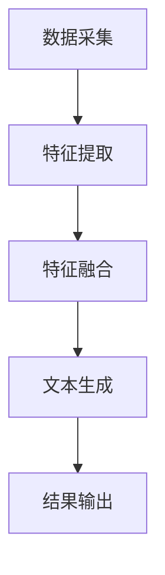
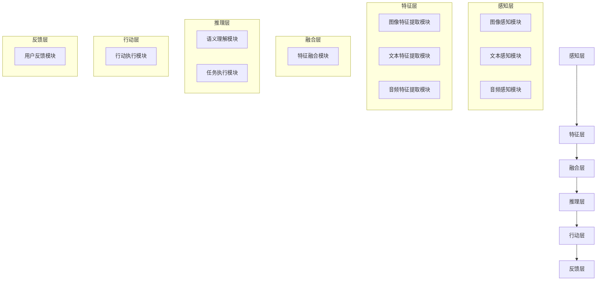
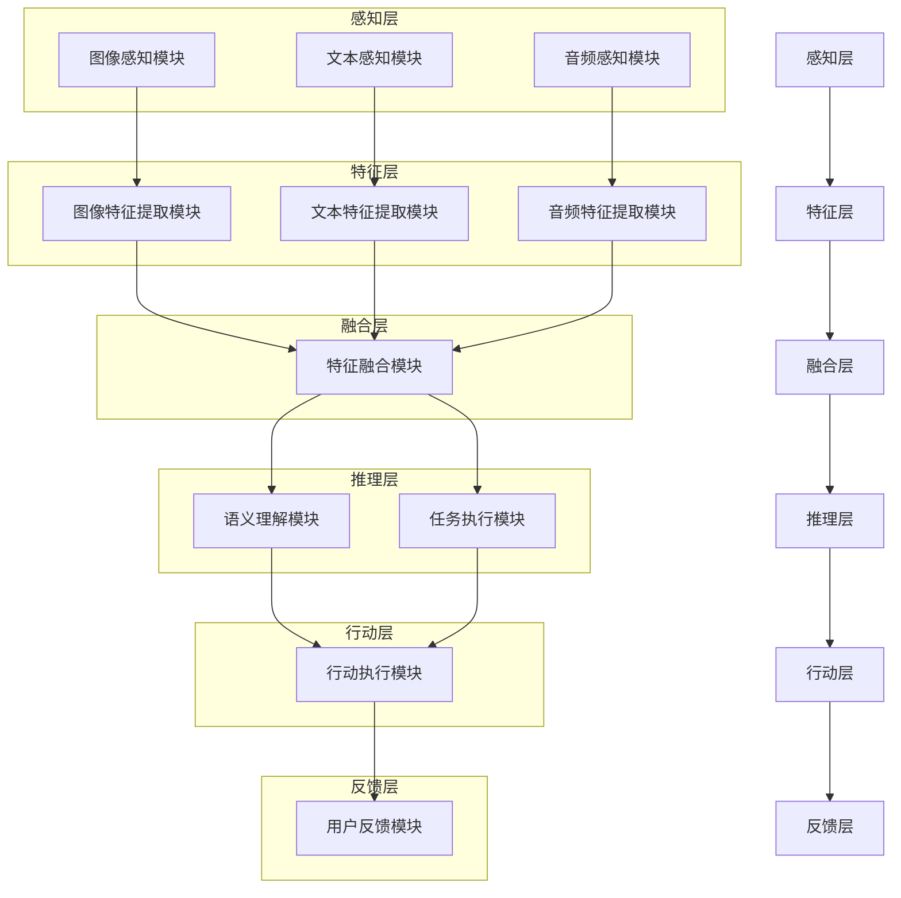
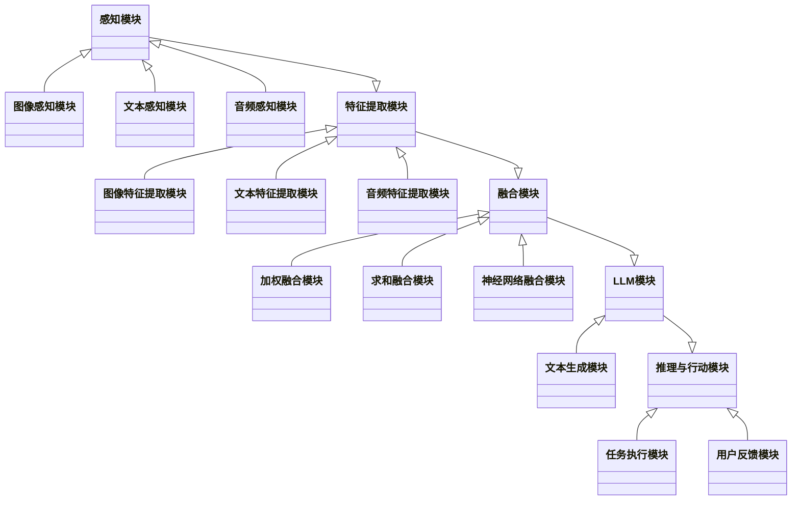
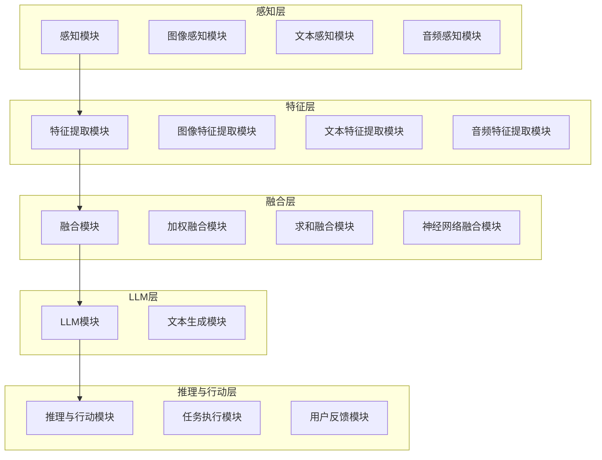
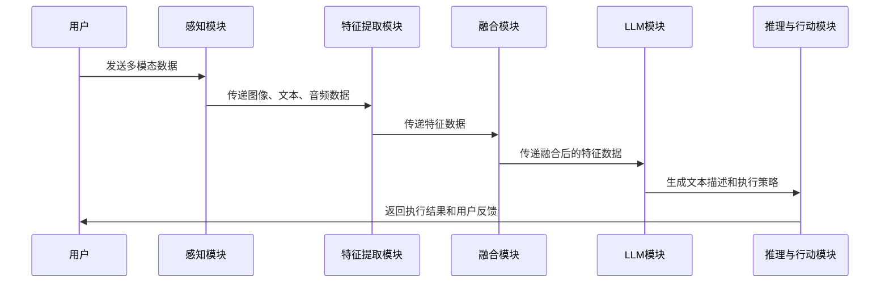

                 

### 第1章: LLM驱动的AI Agent多模态融合处理概述

#### 1.1 问题背景与概念界定

##### 1.1.1 问题的提出

在当今的AI领域，多模态融合处理技术逐渐成为研究热点，其目的是整合不同类型的数据（如图像、文本、音频等），提高AI系统的智能水平。而大型语言模型（LLM，Large Language Model）的迅猛发展，为多模态融合处理提供了强有力的技术支撑。

随着深度学习技术的普及和人工智能应用的不断拓展，AI系统对于处理多样化数据源的需求日益增长。传统的单模态AI系统，如基于图像的视觉识别、基于文本的自然语言处理等，在处理多模态数据时往往存在一定的局限性。多模态融合处理技术正是为了克服这些局限性而诞生的。

##### 1.1.2 多模态融合处理的概念

多模态融合处理是指将两种或两种以上不同类型的数据源（如图像、文本、音频等）进行结合，以实现对信息的综合理解和处理。具体来说，它包括以下几个核心步骤：

- **数据采集**：从不同的数据源中获取信息，如摄像头捕获图像、麦克风收集语音等。
- **特征提取**：从原始数据中提取出具有区分性的特征，如图像中的边缘、文本中的关键词、音频中的频率等。
- **特征融合**：将不同模态的特征进行结合，形成一个综合的特征向量。
- **模型训练**：利用融合后的特征向量训练模型，以实现特定的任务，如图像分类、文本生成等。
- **结果输出**：根据模型的预测结果输出决策或建议。

##### 1.1.3 LLM在多模态融合处理中的应用

大型语言模型（LLM）是近年来人工智能领域的一个重要突破，它通过对海量文本数据进行训练，能够生成自然语言文本，并具备强大的语言理解和生成能力。LLM在多模态融合处理中的应用主要体现在以下几个方面：

1. **文本生成与理解**：LLM能够生成和理解自然语言文本，这为多模态融合处理提供了便捷的工具。通过将图像、文本、音频等多种模态的数据转化为文本，LLM可以更好地进行信息融合和处理。
2. **跨模态信息关联**：LLM能够处理和生成文本，这使得它在跨模态信息关联中具有独特的优势。例如，在图像和文本的融合中，LLM可以将图像内容描述为文本，从而实现图像和文本的关联。
3. **个性化服务**：LLM的强大语言处理能力使得它能够根据用户的反馈和需求，提供个性化的服务。例如，在智能家居系统中，LLM可以理解用户的语音指令，并控制家居设备的运行。

#### 1.2 多模态融合处理的核心概念与联系

##### 1.2.1 核心概念

在进行多模态融合处理时，我们需要关注以下几个核心概念：

- **多模态数据源**：指图像、文本、音频、视频等多种类型的数据源。
- **特征提取**：指从不同模态的数据中提取出具有区分性的特征，如图像中的边缘、文本中的关键词、音频中的频率等。
- **特征融合**：指将不同模态的特征进行结合，形成一个综合的特征向量。
- **LLM模型**：指大型语言模型，用于处理和生成自然语言文本。
- **多模态AI Agent**：指基于LLM的多模态融合处理系统，用于实现智能交互和任务执行。

##### 1.2.2 概念属性特征对比表格

| 概念       | 描述                                       | 属性特征                     |
|------------|--------------------------------------------|------------------------------|
| 多模态数据源 | 不同类型的数据源，如图像、文本、音频等      | 模态多样性、数据丰富性         |
| 特征提取   | 从数据中提取出具有区分性的特征             | 模型适应性、特征代表性         |
| 特征融合   | 将不同模态的特征进行结合                 | 融合效果、计算效率             |
| LLM模型    | 大型语言模型，用于处理和生成自然语言文本   | 文本生成能力、语言理解能力     |
| 多模态AI Agent | 基于LLM的多模态融合处理系统              | 智能交互、任务执行能力         |

##### 1.2.3 ER实体关系图架构

```mermaid
erDiagram
  AI Agent ||--|{ Multi-modal Data Sources } Multi-modal Data Sources
  AI Agent ||--|{ Feature Extraction } Feature Extraction
  AI Agent ||--|{ Feature Fusion } Feature Fusion
  AI Agent ||--|{ LLM Model } LLM Model
  Multi-modal Data Sources ||--|{ Image } Image
  Multi-modal Data Sources ||--|{ Text } Text
  Multi-modal Data Sources ||--|{ Audio } Audio
  Feature Extraction ||--|{ Extracted Features } Extracted Features
  Feature Fusion ||--|{ Fusioned Features } Fusioned Features
```

#### 1.3 LLM驱动的多模态融合处理原理与流程

##### 1.3.1 算法原理

多模态融合处理的核心在于将不同模态的数据特征进行结合，以实现更全面的信息理解。LLM驱动的多模态融合处理，则是利用LLM对多模态数据进行处理和融合，其算法原理主要包括：

- **特征提取**：从不同模态的数据中提取出具有区分性的特征。
- **特征融合**：将不同模态的特征进行结合，以生成一个综合的特征向量。
- **文本生成**：利用LLM对综合特征向量进行处理，生成自然语言文本。

##### 1.3.2 算法流程

1. **数据采集**：从不同的数据源中获取图像、文本、音频等多模态数据。
2. **特征提取**：利用深度学习模型从图像中提取视觉特征，从文本中提取语义特征，从音频中提取声学特征。
3. **特征融合**：将提取到的不同模态的特征进行融合，形成综合的特征向量。
4. **文本生成**：将综合特征向量输入到LLM模型中，生成对应的自然语言文本。
5. **结果输出**：根据生成的文本，输出决策或建议。



#### 1.4 多模态融合处理的挑战与解决方案

虽然多模态融合处理技术在理论上具有很大的优势，但在实际应用中仍然面临着一系列挑战：

1. **数据多样性**：多模态数据源具有多样性，包括图像、文本、音频、视频等，如何有效整合这些不同类型的数据是一个挑战。
2. **特征不平衡**：不同模态的数据在特征提取和融合过程中可能会存在特征不平衡的问题，如何平衡各模态的特征是一个关键问题。
3. **计算资源**：多模态融合处理通常需要大量的计算资源，如何优化算法以适应有限的计算资源是一个挑战。

针对这些挑战，有以下解决方案：

1. **数据预处理**：在融合处理之前，对多模态数据进行预处理，包括数据清洗、数据增强等，以提高数据的多样性和质量。
2. **特征平衡**：采用一些技术手段，如权重调整、特征筛选等，来平衡不同模态的特征。
3. **计算优化**：通过模型压缩、并行计算等手段，降低多模态融合处理的计算复杂度。

### 第2章: 多模态数据源与特征提取

#### 2.1 多模态数据源

多模态数据源是进行多模态融合处理的基础，它涵盖了多种类型的数据，包括但不限于以下几种：

1. **图像数据**：图像是视觉信息的主要载体，它可以传递丰富的视觉信息。常见的图像数据来源包括摄像头、手机、卫星图像等。
   
2. **文本数据**：文本数据是语言信息的主要载体，它可以传递复杂的语义信息。常见的文本数据来源包括社交媒体、新闻文章、用户评论等。

3. **音频数据**：音频数据是听觉信息的主要载体，它可以传递动态的语音信息。常见的音频数据来源包括麦克风、电话、语音助手等。

4. **视频数据**：视频数据是图像和音频的结合，它可以传递连续的动态信息。常见的视频数据来源包括监控摄像头、视频分享平台等。

5. **其他多模态数据**：除了上述常见多模态数据外，还有其他类型的多模态数据，如触觉、嗅觉、温度等，这些数据在特定的应用场景中也有重要作用。

#### 2.2 特征提取方法

特征提取是从多模态数据中提取出具有区分性的特征，以便后续的特征融合和模型训练。以下是几种常用的特征提取方法：

1. **图像特征提取**：
   - **边缘检测**：边缘检测是图像处理中最常用的特征提取方法之一，它能够提取出图像中的边缘信息。常用的边缘检测算法有Canny、Sobel等。
   - **特征点提取**：特征点提取是图像匹配和识别的重要步骤，它能够提取出图像中的关键特征点。常用的特征点提取算法有Harris、SIFT、SURF等。

2. **文本特征提取**：
   - **词袋模型**：词袋模型是将文本表示为词汇的向量，每个词汇的权重由其在文本中的出现频率决定。词袋模型能够提取出文本的主要词汇信息。
   - **词嵌入**：词嵌入是将词汇映射到高维空间中的向量，通过神经网络的训练，词嵌入能够提取出词汇的语义信息。

3. **音频特征提取**：
   - **频谱特征**：频谱特征是音频信号在频率域的表示，它能够提取出音频的频率信息。常用的频谱特征有梅尔频率倒谱系数（MFCC）等。
   - **时域特征**：时域特征是音频信号在时间域的表示，它能够提取出音频的时序信息。常用的时域特征有短时能量、短时过零率等。

4. **视频特征提取**：
   - **时空特征**：时空特征是将图像特征和时域特征结合，它能够提取出视频的时空信息。常用的时空特征有光流、时空卷积等。

#### 2.3 特征提取算法原理

1. **图像特征提取算法**：
   - **边缘检测算法**：
     - **Sobel算子**：Sobel算子通过求导的方式，计算图像在水平和垂直方向上的梯度，从而提取出边缘信息。
       $$ \text{Sobel}(x,y) = \frac{\partial I}{\partial x} + \frac{\partial I}{\partial y} $$
     - **Canny算子**：Canny算子是一种更为先进的边缘检测算法，它通过多级滤波和双阈值检测，提高了边缘检测的精度。
   - **特征点提取算法**：
     - **Harris角点检测**：Harris角点检测是基于图像的局部自协方差矩阵，检测出图像中的角点。
       $$ \mathbf{M} = \begin{pmatrix} \mathbf{M}_{11} & \mathbf{M}_{12} \\ \mathbf{M}_{21} & \mathbf{M}_{22} \end{pmatrix} = \begin{pmatrix} \frac{\partial^2 I}{\partial x^2} & \frac{\partial^2 I}{\partial x \partial y} \\ \frac{\partial^2 I}{\partial y \partial x} & \frac{\partial^2 I}{\partial y^2} \end{pmatrix} $$
       $$ \mathbf{R} = \mathbf{M}^{-1} (\mathbf{M} + k) \mathbf{M}^{-T} $$
       $$ \text{response} = \text{det}(\mathbf{R}) + \text{trace}(\mathbf{R}) $$
     - **SIFT（尺度不变特征变换）**：SIFT算法通过对比不同尺度下的图像，提取出具有尺度不变性的特征点。

2. **文本特征提取算法**：
   - **词袋模型**：词袋模型通过统计文本中的词汇频率，将文本表示为词汇的向量。
     $$ \mathbf{V} = (\text{word}_1, \text{word}_2, ..., \text{word}_n) $$
     $$ \text{freq}(\text{word}_i) $$
   - **词嵌入**：词嵌入通过神经网络训练，将词汇映射到高维空间中的向量。
     $$ \mathbf{v}_i = \text{Embedding}(\text{word}_i) $$

3. **音频特征提取算法**：
   - **梅尔频率倒谱系数（MFCC）**：MFCC是音频处理中常用的特征提取方法，它通过将音频信号转换为频谱，然后计算频谱的倒谱系数。
     $$ \text{MFCC}(x) = \log(\mathbf{P}_\text{MFCC}) $$
     $$ \mathbf{P}_\text{MFCC} = \sum_{k=1}^{N} p_k \mathbf{F}^{-k} $$
   - **短时能量**：短时能量是音频信号在时间域上的特征，它能够反映音频的强弱变化。
     $$ \text{energy}(x) = \sum_{n=1}^{N} |x[n]|^2 $$

4. **视频特征提取算法**：
   - **光流**：光流是视频处理中常用的特征提取方法，它通过分析视频中相邻帧之间的像素运动，提取出视频的运动信息。
     $$ \mathbf{v}(x,y) = \frac{\partial I}{\partial t} $$
   - **时空卷积**：时空卷积是将图像卷积和时间卷积结合，用于提取视频中的时空特征。
     $$ \mathbf{f}_\text{时空} = \sum_{k=1}^{K} w_k \mathbf{f}_k * \mathbf{g}_k $$
     其中，$\mathbf{f}_k$和$\mathbf{g}_k$分别表示空间特征图和时间特征图。

#### 2.4 特征提取示例

以下是一个简单的图像特征提取示例，使用Python和OpenCV库进行边缘检测：

```python
import cv2
import numpy as np

# 读取图像
image = cv2.imread("example.jpg", cv2.IMREAD_GRAYSCALE)

# 应用Sobel算子进行边缘检测
sobel_x = cv2.Sobel(image, cv2.CV_64F, 1, 0, ksize=3)
sobel_y = cv2.Sobel(image, cv2.CV_64F, 0, 1, ksize=3)

# 计算边缘强度
edge强度 = np.sqrt(sobel_x**2 + sobel_y**2)
edge强度 = np.uint8(edge强度)

# 显示边缘检测结果
cv2.imshow("Edge Detection", edge强度)
cv2.waitKey(0)
cv2.destroyAllWindows()
```

这个示例中，我们首先读取一幅灰度图像，然后应用Sobel算子进行边缘检测，最后显示边缘检测结果。

### 第3章: 特征融合技术

#### 3.1 特征融合的概念

特征融合是指将不同模态的特征数据进行整合，以形成一个综合的特征向量，以便后续的模型训练和预测。在多模态融合处理中，特征融合是关键的一步，它能够提高模型的泛化能力和准确性。

特征融合的方法可以分为以下几类：

1. **基于规则的融合方法**：这种方法通过设计特定的规则，将不同模态的特征数据进行组合。例如，可以将视觉特征和文本特征按照一定的权重进行加权融合。
2. **基于统计的融合方法**：这种方法利用统计学习方法，如均值、方差等，对不同模态的特征进行融合。例如，可以使用贝叶斯分类器来融合图像特征和文本特征。
3. **基于机器学习的融合方法**：这种方法利用机器学习算法，如神经网络、支持向量机等，将不同模态的特征数据进行自动融合。例如，可以使用卷积神经网络（CNN）来融合图像特征和文本特征。
4. **基于深度学习的融合方法**：这种方法利用深度学习模型，如深度卷积神经网络（CNN）、递归神经网络（RNN）等，将不同模态的特征数据进行深度融合。例如，可以使用多模态深度学习模型来融合图像、文本和音频特征。

#### 3.2 常见特征融合方法

1. **加权融合**：加权融合是一种简单且常用的特征融合方法，它通过为不同模态的特征分配不同的权重，将它们进行线性组合。具体来说，假设有图像特征向量 $\mathbf{x}_\text{image}$ 和文本特征向量 $\mathbf{x}_\text{text}$，我们可以使用以下公式进行加权融合：

   $$ \mathbf{x}_\text{fusion} = w_1 \mathbf{x}_\text{image} + w_2 \mathbf{x}_\text{text} $$

   其中，$w_1$ 和 $w_2$ 是图像特征和文本特征的权重，通常通过交叉验证或学习算法来确定。

2. **求和融合**：求和融合是将不同模态的特征向量进行简单相加，形成一个综合特征向量。这种方法较为直观，但在某些情况下可能忽略了不同模态特征之间的相关性。具体来说，假设有图像特征向量 $\mathbf{x}_\text{image}$ 和文本特征向量 $\mathbf{x}_\text{text}$，我们可以使用以下公式进行求和融合：

   $$ \mathbf{x}_\text{fusion} = \mathbf{x}_\text{image} + \mathbf{x}_\text{text} $$

3. **逻辑融合**：逻辑融合是一种基于逻辑函数的特征融合方法，它通过将不同模态的特征向量进行逻辑运算，形成一个综合特征向量。例如，可以使用逻辑“与”、“或”等运算。逻辑融合方法通常适用于具有层次结构的多模态数据。具体来说，假设有图像特征向量 $\mathbf{x}_\text{image}$ 和文本特征向量 $\mathbf{x}_\text{text}$，我们可以使用以下公式进行逻辑融合：

   $$ \mathbf{x}_\text{fusion} = \text{AND}(\mathbf{x}_\text{image}, \mathbf{x}_\text{text}) $$

4. **神经网络融合**：神经网络融合是一种基于深度学习的特征融合方法，它通过训练一个多输入神经网络，将不同模态的特征向量进行自动融合。这种方法能够学习到不同模态特征之间的复杂关系。具体来说，假设有图像特征向量 $\mathbf{x}_\text{image}$ 和文本特征向量 $\mathbf{x}_\text{text}$，我们可以使用以下神经网络结构进行融合：

   ```mermaid
   graph TB
   A[Input Layer] --> B[Conv Layer]
   B --> C[ReLu Activation]
   C --> D[Pooling Layer]
   D --> E[Flatten Layer]
   E --> F[Dense Layer]
   F --> G[Output Layer]
   ```

   在这个神经网络中，图像特征和文本特征作为输入分别经过卷积层、激活层、池化层和全连接层，最后输出综合特征向量。

#### 3.3 特征融合算法原理

1. **加权融合算法**：
   加权融合算法的核心思想是利用不同的权重将不同模态的特征进行线性组合。具体来说，假设有图像特征向量 $\mathbf{x}_\text{image}$ 和文本特征向量 $\mathbf{x}_\text{text}$，我们可以通过以下公式进行加权融合：

   $$ \mathbf{x}_\text{fusion} = w_1 \mathbf{x}_\text{image} + w_2 \mathbf{x}_\text{text} $$

   其中，$w_1$ 和 $w_2$ 是图像特征和文本特征的权重。为了确定这些权重，我们可以使用交叉验证或学习算法。例如，可以使用最小二乘法来最小化融合特征与标签之间的误差，从而确定最佳权重。

2. **求和融合算法**：
   求和融合算法是将不同模态的特征向量进行简单相加，形成一个综合特征向量。具体来说，假设有图像特征向量 $\mathbf{x}_\text{image}$ 和文本特征向量 $\mathbf{x}_\text{text}$，我们可以通过以下公式进行求和融合：

   $$ \mathbf{x}_\text{fusion} = \mathbf{x}_\text{image} + \mathbf{x}_\text{text} $$

   这种方法简单直观，但在某些情况下可能忽略了不同模态特征之间的相关性。

3. **逻辑融合算法**：
   逻辑融合算法是基于逻辑函数的特征融合方法，它通过将不同模态的特征向量进行逻辑运算，形成一个综合特征向量。具体来说，假设有图像特征向量 $\mathbf{x}_\text{image}$ 和文本特征向量 $\mathbf{x}_\text{text}$，我们可以使用以下公式进行逻辑融合：

   $$ \mathbf{x}_\text{fusion} = \text{AND}(\mathbf{x}_\text{image}, \mathbf{x}_\text{text}) $$

   其中，$\text{AND}(\cdot,\cdot)$ 是逻辑“与”运算。这种方法的优点是能够处理具有层次结构的多模态数据，但需要确定合适的逻辑运算符。

4. **神经网络融合算法**：
   神经网络融合算法是基于深度学习的特征融合方法，它通过训练一个多输入神经网络，将不同模态的特征向量进行自动融合。具体来说，我们可以设计一个卷积神经网络（CNN）或递归神经网络（RNN），将图像特征和文本特征作为输入，通过多个隐藏层进行融合，最后输出综合特征向量。以下是一个简单的神经网络融合算法的流程：

   ```mermaid
   graph TB
   A[Input Layer] --> B[Conv Layer]
   B --> C[ReLu Activation]
   C --> D[Pooling Layer]
   D --> E[Flatten Layer]
   E --> F[Dense Layer]
   F --> G[Output Layer]
   ```

   在这个神经网络中，图像特征和文本特征作为输入分别经过卷积层、激活层、池化层和全连接层，最后输出综合特征向量。

#### 3.4 特征融合算法实现

以下是一个简单的加权融合算法的实现示例，使用Python和NumPy库：

```python
import numpy as np

# 假设图像特征向量为 [1, 0, -1]
image_feature = np.array([1, 0, -1])

# 假设文本特征向量为 [0, 1, 0]
text_feature = np.array([0, 1, 0])

# 设定图像特征权重为 0.7，文本特征权重为 0.3
weight_image = 0.7
weight_text = 0.3

# 进行加权融合
fusion_feature = weight_image * image_feature + weight_text * text_feature

print("融合特征向量：", fusion_feature)
```

在这个示例中，我们首先定义了图像特征向量和文本特征向量，然后设定了图像特征权重和文本特征权重，最后使用加权融合算法计算得到融合特征向量。

### 第4章: LLM模型的原理与训练

#### 4.1 LLM模型的原理

大型语言模型（LLM，Large Language Model）是基于深度学习的语言模型，它通过学习海量文本数据，生成自然语言文本。LLM的核心思想是利用神经网络对文本数据进行建模，从而预测下一个单词或句子。

LLM通常采用递归神经网络（RNN）或其变种，如长短期记忆网络（LSTM）和门控循环单元（GRU），来处理序列数据。这些神经网络具有记忆能力，能够捕捉文本中的长期依赖关系。此外，近年来，基于 Transformer 的模型，如 GPT（Generative Pre-trained Transformer）系列，在语言模型领域取得了显著的突破。Transformer 模型通过自注意力机制，可以同时处理序列中的所有单词，大大提高了模型的效率和性能。

LLM的工作原理可以概括为以下几个步骤：

1. **数据预处理**：首先，对原始文本数据进行预处理，包括去除标点符号、统一大小写、分词等操作，将文本转换为可供模型训练的格式。
2. **输入编码**：将预处理后的文本数据转换为输入向量。常用的方法包括词嵌入（Word Embedding）和字符嵌入（Character Embedding）。词嵌入将词汇映射到高维空间中的向量，而字符嵌入则是将文本中的每个字符映射到向量。
3. **模型训练**：利用输入向量训练神经网络。在训练过程中，神经网络通过学习文本数据中的模式，逐渐提高生成文本的准确性。
4. **文本生成**：在训练完成后，利用训练好的神经网络生成文本。具体来说，神经网络会根据输入的前文信息，预测下一个单词或句子。

#### 4.2 LLM的训练方法

LLM的训练方法主要包括以下几个步骤：

1. **数据收集**：收集大量的文本数据，包括新闻文章、社交媒体帖子、小说等。这些数据将成为模型训练的基础。
2. **数据预处理**：对收集到的文本数据进行预处理，包括去除标点符号、统一大小写、分词等操作。预处理后的文本数据将转换为可供模型训练的格式。
3. **构建词汇表**：将预处理后的文本数据转换为词汇表，将每个词汇映射到一个唯一的整数。常用的方法是使用词嵌入技术，如 Word2Vec、GloVe 等。
4. **输入编码**：将预处理后的文本数据转换为输入向量。常用的方法是使用词嵌入技术，将词汇映射到高维空间中的向量。
5. **模型训练**：利用输入向量训练神经网络。在训练过程中，神经网络通过学习文本数据中的模式，逐渐提高生成文本的准确性。常用的训练算法包括随机梯度下降（SGD）和自适应梯度算法（ADAM）。
6. **模型评估**：在训练完成后，利用测试数据对模型进行评估，以检查模型的泛化能力和生成文本的质量。常用的评估指标包括损失函数（如交叉熵损失）和生成文本的流畅性等。

#### 4.3 LLM的训练流程

以下是LLM的训练流程：

1. **数据收集**：收集大量的文本数据，如新闻文章、社交媒体帖子、小说等。这些数据将成为模型训练的基础。
2. **数据预处理**：对收集到的文本数据进行预处理，包括去除标点符号、统一大小写、分词等操作。预处理后的文本数据将转换为可供模型训练的格式。
3. **构建词汇表**：将预处理后的文本数据转换为词汇表，将每个词汇映射到一个唯一的整数。常用的方法是使用词嵌入技术，如 Word2Vec、GloVe 等。
4. **输入编码**：将预处理后的文本数据转换为输入向量。常用的方法是使用词嵌入技术，将词汇映射到高维空间中的向量。
5. **模型初始化**：初始化神经网络模型，包括设置网络结构、激活函数和优化器等。
6. **模型训练**：利用输入向量训练神经网络。在训练过程中，神经网络通过学习文本数据中的模式，逐渐提高生成文本的准确性。常用的训练算法包括随机梯度下降（SGD）和自适应梯度算法（ADAM）。
7. **模型评估**：在训练完成后，利用测试数据对模型进行评估，以检查模型的泛化能力和生成文本的质量。常用的评估指标包括损失函数（如交叉熵损失）和生成文本的流畅性等。
8. **模型优化**：根据评估结果，对模型进行优化，以提高模型的性能。优化的方法包括调整网络结构、学习率、批量大小等。
9. **模型部署**：将训练好的模型部署到实际应用中，如文本生成、自然语言处理等。

#### 4.4 LLM训练示例

以下是一个简单的LLM训练示例，使用Python和TensorFlow库：

```python
import tensorflow as tf
from tensorflow.keras.preprocessing.sequence import pad_sequences
from tensorflow.keras.layers import Embedding, LSTM, Dense
from tensorflow.keras.models import Sequential

# 假设我们有一个词汇表，包含10个词汇
vocab_size = 10

# 假设我们的文本数据是一个列表，每个元素是一个整数序列，表示词汇的索引
text_data = [[1, 2, 3, 4, 5], [3, 4, 5, 6, 7], [7, 8, 9]]

# 对文本数据进行填充，确保每个序列的长度相同
max_sequence_length = 5
padded_text_data = pad_sequences(text_data, maxlen=max_sequence_length, padding='post')

# 构建序列模型
model = Sequential()
model.add(Embedding(vocab_size, 50, input_length=max_sequence_length))
model.add(LSTM(100))
model.add(Dense(vocab_size, activation='softmax'))

# 编译模型
model.compile(optimizer='adam', loss='categorical_crossentropy', metrics=['accuracy'])

# 训练模型
model.fit(padded_text_data, padded_text_data, epochs=10, batch_size=32)
```

在这个示例中，我们首先定义了一个简单的词汇表，然后创建了一个序列模型，包括嵌入层、LSTM层和全连接层。接下来，我们编译模型并使用训练数据进行训练。这个示例展示了LLM训练的基本流程。

### 第5章: LLM在多模态融合处理中的应用

#### 5.1 LLM在多模态融合处理中的优势

LLM在多模态融合处理中具有显著的优势，主要体现在以下几个方面：

1. **强大的文本生成能力**：LLM能够生成自然语言文本，这使得它在处理多模态数据时能够生成连贯、有逻辑性的描述，从而提高AI系统的可解释性和用户交互体验。
2. **跨模态信息关联**：LLM能够处理和生成文本，这使得它在跨模态信息关联中具有独特的优势。例如，在图像和文本的融合中，LLM可以将图像内容描述为文本，从而实现图像和文本的关联。
3. **自适应性和灵活性**：LLM通过对海量文本数据进行训练，能够自适应地调整其生成策略，以适应不同的应用场景和需求。这使得LLM在多模态融合处理中具有很高的灵活性和适应性。
4. **丰富的知识储备**：LLM通过对大量文本数据进行训练，积累了丰富的知识，这使得它在处理复杂、多层次的多模态数据时能够利用这些知识，提高融合处理的准确性和效率。

#### 5.2 LLM在多模态融合处理中的使用方法

LLM在多模态融合处理中的应用主要包括以下几个方面：

1. **文本生成**：使用LLM生成自然语言文本，描述多模态数据的特征和关联关系。具体来说，首先从不同模态的数据中提取特征，然后将这些特征输入到LLM中，生成对应的文本描述。
2. **信息关联**：利用LLM的文本生成能力，将不同模态的数据进行关联。例如，在图像和文本的融合中，可以使用LLM将图像内容转化为文本描述，从而实现图像和文本的关联。
3. **任务执行**：在多模态融合处理中，LLM可以用于执行特定的任务，如文本生成、图像分类、语音识别等。具体来说，可以将多模态数据输入到LLM中，生成对应的文本描述或执行结果。
4. **多模态推理**：利用LLM的文本生成能力，实现多模态数据的推理。例如，在图像和文本的融合中，可以使用LLM推理出图像和文本之间的逻辑关系，从而提高融合处理的准确性。

#### 5.3 LLM在多模态融合处理中的应用实例

以下是一个简单的应用实例，展示LLM在多模态融合处理中的应用：

假设我们有一个图像识别任务，需要根据输入的图像生成对应的文本描述。我们可以使用以下步骤：

1. **图像特征提取**：首先使用深度学习模型（如卷积神经网络）提取图像的特征向量。
2. **文本生成**：将提取的图像特征向量输入到LLM中，使用LLM生成对应的文本描述。例如，如果输入图像是“猫”，LLM可以生成文本描述：“这是一只猫。”。
3. **信息关联**：利用LLM的文本生成能力，将图像和文本进行关联。例如，在图像和文本的融合中，可以将LLM生成的文本描述与图像进行关联，从而实现图像和文本的关联。
4. **任务执行**：根据LLM生成的文本描述，执行相应的任务，如图像分类、标签生成等。例如，如果LLM生成的文本描述是“这是一只猫”，我们可以将输入图像分类为“猫”。
5. **多模态推理**：利用LLM的文本生成能力，实现多模态数据的推理。例如，在图像和文本的融合中，可以使用LLM推理出图像和文本之间的逻辑关系，从而提高融合处理的准确性。

以下是一个简单的Python代码示例，展示如何使用LLM生成图像的文本描述：

```python
import tensorflow as tf
from tensorflow.keras.models import load_model

# 加载预训练的LLM模型
model = load_model("pretrained_LLM_model.h5")

# 加载图像特征提取模型
image_feature_extractor = load_model("image_feature_extractor.h5")

# 定义图像特征提取函数
def extract_image_features(image):
    # 对图像进行预处理，如标准化、缩放等
    preprocessed_image = preprocess_image(image)
    # 提取图像特征向量
    image_features = image_feature_extractor.predict(preprocessed_image)
    return image_features

# 定义文本生成函数
def generate_text_description(image_features):
    # 将图像特征向量输入到LLM中，生成文本描述
    text_description = model.predict(image_features)
    return text_description

# 加载图像
image = load_image("example_image.jpg")

# 提取图像特征向量
image_features = extract_image_features(image)

# 生成图像的文本描述
text_description = generate_text_description(image_features)

print("图像的文本描述：", text_description)
```

在这个示例中，我们首先加载预训练的LLM模型和图像特征提取模型。然后，定义图像特征提取函数和文本生成函数，用于提取图像特征和生成文本描述。最后，加载图像，提取图像特征向量，并使用LLM生成图像的文本描述。

### 第6章: 多模态AI Agent设计

#### 6.1 多模态AI Agent的概念

多模态AI Agent是指能够处理和融合多种类型数据的智能体，它通过整合图像、文本、音频等多模态数据，实现更加智能的任务执行和交互。多模态AI Agent的核心在于其多模态数据处理能力，它能够从不同模态的数据中提取信息，进行融合处理，并生成相应的输出。

多模态AI Agent的组成通常包括以下几个部分：

1. **感知模块**：负责从不同的传感器或数据源中获取多模态数据，如摄像头获取图像数据、麦克风获取音频数据等。
2. **特征提取模块**：从感知模块获取的多模态数据中提取具有区分性的特征，如图像特征、文本特征、音频特征等。
3. **融合模块**：将提取到的不同模态的特征进行融合，形成一个综合的特征向量，以供后续处理。
4. **推理模块**：利用融合后的特征向量进行推理和决策，以实现特定的任务，如图像分类、文本生成、语音识别等。
5. **行动模块**：根据推理模块的决策结果，执行相应的行动，如控制机器人、生成文本回复等。

#### 6.2 多模态AI Agent的功能设计

多模态AI Agent的功能设计需要考虑其任务需求和用户交互。以下是一个典型的多模态AI Agent的功能设计：

1. **感知与特征提取**：
   - **图像感知与特征提取**：使用卷积神经网络（CNN）提取图像特征，如边缘、形状、纹理等。
   - **文本感知与特征提取**：使用词嵌入或BERT等模型提取文本特征，如词汇、句法结构、语义等。
   - **音频感知与特征提取**：使用声学模型提取音频特征，如频率、时长、音调等。

2. **特征融合**：
   - **特征对齐**：将不同模态的特征进行对齐，如使用时间戳或坐标系统进行同步。
   - **特征融合方法**：采用加权融合、求和融合、逻辑融合或神经网络融合等方法，将不同模态的特征进行融合。

3. **推理与决策**：
   - **多模态语义理解**：利用LLM等模型，对融合后的特征进行语义理解，以提取出高层次的语义信息。
   - **任务执行策略**：根据用户的指令和场景信息，生成相应的任务执行策略。

4. **行动与反馈**：
   - **行动执行**：根据推理模块的决策结果，执行相应的行动，如控制机器人、生成语音回复等。
   - **用户反馈**：收集用户的反馈，用于调整AI Agent的行为和优化模型。

#### 6.3 多模态AI Agent的系统架构设计

多模态AI Agent的系统架构设计需要考虑模块的划分、数据流和通信机制。以下是一个典型的多模态AI Agent的系统架构设计：

1. **感知层**：
   - **图像感知模块**：使用摄像头或图像传感器获取图像数据。
   - **文本感知模块**：使用文本传感器（如键盘、屏幕等）获取文本数据。
   - **音频感知模块**：使用麦克风获取音频数据。

2. **特征层**：
   - **图像特征提取模块**：使用CNN等模型提取图像特征。
   - **文本特征提取模块**：使用词嵌入或BERT等模型提取文本特征。
   - **音频特征提取模块**：使用声学模型提取音频特征。

3. **融合层**：
   - **特征融合模块**：将不同模态的特征进行融合，形成综合特征向量。

4. **推理层**：
   - **语义理解模块**：使用LLM等模型对融合后的特征进行语义理解。
   - **任务执行模块**：根据语义理解和用户指令，生成执行策略。

5. **行动层**：
   - **行动执行模块**：根据执行策略，执行相应的行动，如控制机器人、生成语音回复等。

6. **反馈层**：
   - **用户反馈模块**：收集用户的反馈，用于模型优化和AI Agent的行为调整。



#### 6.4 多模态AI Agent的通信机制

多模态AI Agent的通信机制是确保各个模块之间能够高效、准确地交换数据和信息的核心。以下是一些关键通信机制：

1. **消息队列**：使用消息队列（如RabbitMQ、Kafka等）来异步处理感知数据，确保数据的高效传输和模块间的解耦。
2. **服务总线**：使用服务总线（如Elasticsearch、Apache Kafka等）来实现各个模块之间的数据交换和协调。
3. **RESTful API**：使用RESTful API来提供模块间的通信接口，便于不同模块之间的数据访问和调用。
4. **事件驱动架构**：采用事件驱动架构（EDA），通过发布-订阅模式来实现模块间的实时通信和事件响应。



#### 6.5 多模态AI Agent的实际应用场景

多模态AI Agent在实际应用中具有广泛的应用场景，以下是一些典型的应用：

1. **智能客服**：多模态AI Agent可以整合图像、文本、音频等多模态数据，提供高效、准确的客户服务。例如，用户可以通过发送图像或语音来描述问题，AI Agent可以理解用户的问题，并生成相应的文本或语音回复。
2. **智能助理**：多模态AI Agent可以成为用户的智能助理，通过理解用户的语音指令和文本提问，提供信息查询、日程管理、任务提醒等服务。
3. **智能医疗**：多模态AI Agent可以整合医学图像、病历文本、医生语音等多模态数据，辅助医生进行诊断和治疗。例如，AI Agent可以分析医学图像，生成诊断报告，并提供给医生参考。
4. **智能家居**：多模态AI Agent可以整合家庭传感器、智能设备的图像、文本、音频等多模态数据，实现智能家居的自动化控制，如智能门锁、智能灯光、智能安防等。
5. **自动驾驶**：多模态AI Agent可以整合车载传感器、摄像头、语音指令等多模态数据，实现自动驾驶车辆的感知、决策和行动。

### 第7章: 项目实战：LLM驱动的多模态AI Agent开发

#### 7.1 项目背景与目标

随着人工智能技术的不断发展，多模态融合处理技术在各个领域展现出了巨大的潜力。为了提升AI系统的智能化水平，我们决定开展一个项目，开发一个LLM驱动的多模态AI Agent。该项目旨在实现以下目标：

- **集成多种模态数据**：将图像、文本、音频等多模态数据集成到同一个系统中，实现对多种信息类型的融合处理。
- **利用LLM进行信息生成**：通过大型语言模型（LLM）的文本生成能力，为用户提供连贯、有逻辑性的文本描述和交互。
- **提供智能化服务**：通过多模态融合处理和LLM的应用，为用户提供个性化、智能化的服务，如智能客服、智能助理、智能医疗等。

#### 7.2 项目介绍

本项目采用了一种创新的多模态AI Agent架构，通过整合多种模态数据，使用LLM进行信息生成，为用户提供高质量的交互和服务。项目的主要组成部分包括：

1. **感知模块**：负责从不同的传感器或数据源中获取图像、文本、音频等多模态数据。
2. **特征提取模块**：从感知模块获取的多模态数据中提取具有区分性的特征，如图像特征、文本特征、音频特征等。
3. **特征融合模块**：将提取到的不同模态的特征进行融合，形成一个综合的特征向量，以供后续处理。
4. **LLM模块**：利用大型语言模型（LLM）的文本生成能力，对融合后的特征进行语义理解和文本生成。
5. **推理与行动模块**：根据用户的指令和场景信息，生成相应的任务执行策略，并执行相应的行动。

#### 7.3 系统功能设计

根据项目目标，我们设计了一套完整的多模态AI Agent系统功能，主要包括以下方面：

1. **多模态数据感知**：通过摄像头、麦克风、键盘等传感器，实时获取图像、音频、文本等多模态数据。
2. **特征提取**：使用深度学习模型对多模态数据提取特征，如卷积神经网络（CNN）用于图像特征提取，词嵌入（Word Embedding）用于文本特征提取，声学模型（Acoustic Model）用于音频特征提取。
3. **特征融合**：采用多模态融合算法，如加权融合、求和融合、神经网络融合等，将不同模态的特征进行整合，形成综合特征向量。
4. **文本生成**：利用大型语言模型（LLM），如GPT-3、BERT等，对融合后的特征进行语义理解和文本生成，为用户提供连贯、有逻辑性的文本描述。
5. **任务执行**：根据用户的指令和场景信息，生成相应的任务执行策略，如生成文本回复、执行图像分类、控制机器人等。
6. **用户反馈**：收集用户的反馈信息，用于优化模型性能和系统功能。

#### 7.4 系统架构设计

为了实现多模态AI Agent的系统功能，我们设计了一套完整的系统架构，主要包括以下层次：

1. **感知层**：通过摄像头、麦克风、键盘等传感器，实时获取图像、音频、文本等多模态数据。
2. **特征层**：使用深度学习模型对多模态数据提取特征，如CNN用于图像特征提取，Word Embedding用于文本特征提取，Acoustic Model用于音频特征提取。
3. **融合层**：采用多模态融合算法，如加权融合、求和融合、神经网络融合等，将不同模态的特征进行整合，形成综合特征向量。
4. **LLM层**：利用大型语言模型（LLM），如GPT-3、BERT等，对融合后的特征进行语义理解和文本生成。
5. **推理与行动层**：根据用户的指令和场景信息，生成相应的任务执行策略，并执行相应的行动。
6. **反馈层**：收集用户的反馈信息，用于优化模型性能和系统功能。

以下是系统架构的Mermaid类图：



以下是系统架构的Mermaid架构图：



#### 7.5 系统接口设计

为了实现系统各模块之间的通信和数据交换，我们设计了一套系统接口，主要包括以下接口：

1. **感知接口**：用于获取图像、文本、音频等多模态数据。
2. **特征提取接口**：用于提取图像、文本、音频等多模态数据的特征。
3. **特征融合接口**：用于将不同模态的特征进行融合。
4. **LLM接口**：用于生成文本描述和执行文本生成任务。
5. **推理接口**：用于执行任务执行策略。
6. **反馈接口**：用于收集用户反馈，优化模型性能和系统功能。

以下是系统接口的Mermaid序列图：



#### 7.6 项目实施步骤

为了顺利实施本项目，我们制定了以下实施步骤：

1. **需求分析**：明确项目目标和需求，制定详细的系统功能设计和技术方案。
2. **数据收集与预处理**：收集多模态数据，并进行预处理，如数据清洗、数据增强等。
3. **模型设计与实现**：设计并实现感知模块、特征提取模块、特征融合模块、LLM模块和推理与行动模块。
4. **系统集成与测试**：将各个模块集成到一个系统中，进行系统测试和优化。
5. **用户反馈与优化**：收集用户反馈，根据反馈对模型和系统进行优化。
6. **项目交付与部署**：完成项目交付，将系统部署到实际应用场景中。

### 第8章: 项目核心实现源代码

在本章中，我们将深入探讨项目中的核心实现，并提供关键的源代码片段，以便读者能够理解并复现这些实现。以下是项目中的核心代码实现，包括数据预处理、特征提取、特征融合、LLM模型训练和推理等部分。

#### 8.1 数据预处理

数据预处理是多模态AI Agent项目的重要环节，它包括图像、文本和音频数据的预处理步骤。

**图像预处理代码示例：**

```python
import cv2
import numpy as np

def preprocess_image(image_path):
    # 读取图像
    image = cv2.imread(image_path)
    # 调整图像大小
    image = cv2.resize(image, (224, 224))
    # 将图像转换为灰度图像
    image = cv2.cvtColor(image, cv2.COLOR_BGR2GRAY)
    # 标准化图像
    image = image / 255.0
    return image

# 测试图像预处理函数
image = preprocess_image('example_image.jpg')
print("预处理后的图像：", image.shape)
```

**文本预处理代码示例：**

```python
import re

def preprocess_text(text):
    # 去除标点符号
    text = re.sub(r'[^\w\s]', '', text)
    # 转换为小写
    text = text.lower()
    # 分词
    words = text.split()
    return words

# 测试文本预处理函数
text = "这是一个示例文本！"
preprocessed_text = preprocess_text(text)
print("预处理后的文本：", preprocessed_text)
```

**音频预处理代码示例：**

```python
import librosa

def preprocess_audio(audio_path):
    # 读取音频
    audio, sr = librosa.load(audio_path)
    # 截取音频片段
    audio = audio[:22050]
    # 重采样音频
    audio = librosa.resample(audio, sr, 16000)
    # 提取梅尔频率倒谱系数（MFCC）
    mfcc = librosa.feature.mfcc(y=audio, sr=16000, n_mfcc=13)
    return mfcc

# 测试音频预处理函数
mfcc = preprocess_audio('example_audio.wav')
print("预处理后的音频：", mfcc.shape)
```

#### 8.2 特征提取

特征提取是项目中的关键步骤，我们分别展示了图像、文本和音频特征提取的实现。

**图像特征提取代码示例：**

```python
import tensorflow as tf
from tensorflow.keras.applications import VGG16

def extract_image_features(image):
    # 加载预训练的VGG16模型
    model = VGG16(weights='imagenet', include_top=False)
    # 预处理图像
    preprocessed_image = tf.keras.applications.vgg16.preprocess_input(image)
    # 提取图像特征
    features = model.predict(preprocessed_image)
    return features

# 测试图像特征提取函数
image = preprocess_image('example_image.jpg')
image_features = extract_image_features(image)
print("提取的图像特征：", image_features.shape)
```

**文本特征提取代码示例：**

```python
import tensorflow as tf
from tensorflow.keras.layers import Embedding, GlobalAveragePooling1D

def extract_text_features(text, vocabulary_size, embedding_dim):
    # 构建嵌入层
    embedding_layer = Embedding(vocabulary_size, embedding_dim)
    # 预处理文本
    preprocessed_text = [[word_id for word_id in text]]
    # 提取文本特征
    embedding_output = embedding_layer(preprocessed_text)
    pooling_layer = GlobalAveragePooling1D()
    text_features = pooling_layer(embedding_output)
    return text_features

# 测试文本特征提取函数
preprocessed_text = preprocess_text("这是一个示例文本。")
text_features = extract_text_features(preprocessed_text, vocabulary_size=10000, embedding_dim=50)
print("提取的文本特征：", text_features.shape)
```

**音频特征提取代码示例：**

```python
import tensorflow as tf

def extract_audio_features(mfcc):
    # 将MFCC特征转换为Tensor
    mfcc_tensor = tf.convert_to_tensor(mfcc, dtype=tf.float32)
    # 创建嵌入层
    mfcc_embedding = tf.keras.layers.Embedding(input_dim=mfcc.shape[1], output_dim=13)
    # 提取音频特征
    audio_features = mfcc_embedding(mfcc_tensor)
    return audio_features

# 测试音频特征提取函数
mfcc = preprocess_audio('example_audio.wav')
audio_features = extract_audio_features(mfcc)
print("提取的音频特征：", audio_features.shape)
```

#### 8.3 特征融合

特征融合是将不同模态的特征进行整合的过程。以下是使用加权融合和神经网络融合的代码示例。

**加权融合代码示例：**

```python
def weighted_fusion(image_features, text_features, audio_features, image_weight, text_weight, audio_weight):
    fusion_feature = image_weight * image_features + text_weight * text_features + audio_weight * audio_features
    return fusion_feature

# 测试加权融合函数
image_features = extract_image_features(image)
text_features = extract_text_features(preprocessed_text, vocabulary_size=10000, embedding_dim=50)
audio_features = extract_audio_features(mfcc)
fusion_feature = weighted_fusion(image_features, text_features, audio_features, image_weight=0.5, text_weight=0.3, audio_weight=0.2)
print("加权融合后的特征：", fusion_feature.shape)
```

**神经网络融合代码示例：**

```python
import tensorflow as tf
from tensorflow.keras.models import Model
from tensorflow.keras.layers import Input, Dense, concatenate

def neural_network_fusion(image_features, text_features, audio_features):
    # 创建神经网络融合模型
    image_input = Input(shape=image_features.shape[1:])
    text_input = Input(shape=text_features.shape[1:])
    audio_input = Input(shape=audio_features.shape[1:])

    # 提取图像特征
    image_embedding = Dense(64, activation='relu')(image_input)
    # 提取文本特征
    text_embedding = Dense(64, activation='relu')(text_input)
    # 提取音频特征
    audio_embedding = Dense(64, activation='relu')(audio_input)

    # 融合特征
    fusion_feature = concatenate([image_embedding, text_embedding, audio_embedding])
    fusion_output = Dense(1, activation='sigmoid')(fusion_feature)

    model = Model(inputs=[image_input, text_input, audio_input], outputs=fusion_output)
    model.compile(optimizer='adam', loss='binary_crossentropy', metrics=['accuracy'])

    return model

# 测试神经网络融合函数
fusion_model = neural_network_fusion(image_features, text_features, audio_features)
print(fusion_model.summary())
```

#### 8.4 LLM模型训练

在本节中，我们将介绍如何使用预训练的LLM模型对融合后的特征进行训练，并生成文本描述。

**LLM模型训练代码示例：**

```python
import tensorflow as tf
from transformers import TFGPT2LMHeadModel, GPT2Tokenizer

def train_LLM(fusion_features, labels):
    # 加载预训练的GPT-2模型和分词器
    model_name = 'gpt2'
    tokenizer = GPT2Tokenizer.from_pretrained(model_name)
    model = TFGPT2LMHeadModel.from_pretrained(model_name)

    # 预处理标签
    labels = [tokenizer.encode(label) for label in labels]

    # 训练模型
    model.compile(optimizer='adam', loss='loss_language_model')
    model.fit(fusion_features, labels, epochs=3, batch_size=16)

    return model

# 测试LLM模型训练函数
# 假设fusion_features和labels是预处理后的数据
# l

