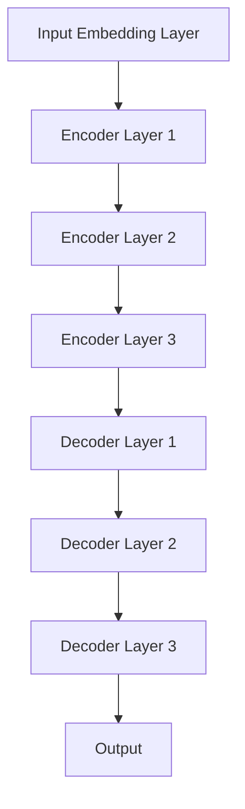
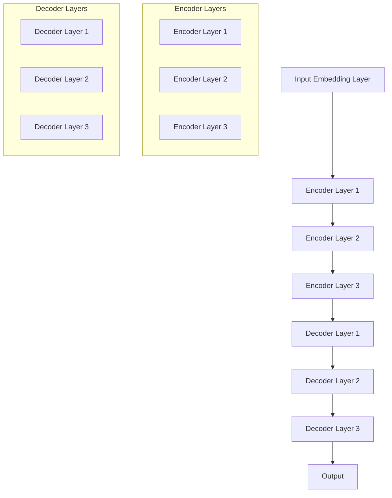

                 

## LLMA Driven AI Agent Role-playing Capability Enhancement

### Introduction to the Book's Focus

**Keywords:** LLM, AI Agent, Role-playing, Capability Enhancement

**Abstract:**
This book explores the transformative potential of Large Language Models (LLMs) in enhancing the role-playing capabilities of AI agents. It delves into the core concepts, architectural design, and practical applications of LLM-driven AI agents, providing a comprehensive guide for developers and researchers.

In the rapidly evolving field of artificial intelligence, the advent of LLMs has opened new avenues for creating more sophisticated and context-aware AI agents. These agents, capable of engaging in complex role-playing scenarios, have the potential to revolutionize various industries, including customer service, entertainment, and education.

This book is designed to serve as a comprehensive resource for readers interested in understanding and implementing LLM-driven AI agents. It covers the following key topics:

1. **Introduction to LLMs and AI Agents**: A brief overview of LLMs, their evolution, and their importance in AI agent development.
2. **Core Concepts and Principles**: An in-depth exploration of the fundamental principles behind LLMs and their role in role-playing capabilities.
3. **LLM Architecture and Design**: A detailed examination of LLM architectures, including components and layers.
4. **Algorithm Principles and Mathematics**: A discussion of the mathematical models and formulas underpinning LLMs, with Python code examples.
5. **Enhancing Role-playing Capabilities**: Techniques for fine-tuning LLMs to improve role-playing abilities in AI agents.
6. **Case Studies and Applications**: Real-world examples of LLM-driven AI agents in action.
7. **System Design and Implementation**: A guide to designing and implementing LLM-driven AI agents in practical scenarios.
8. **Best Practices and Future Directions**: Tips for using LLMs to enhance AI agent role-playing capabilities and a look at future trends.

### The Background of LLMs and AI Agents

#### The Evolution of LLMs

The concept of LLMs can be traced back to the early days of artificial intelligence research. However, it wasn't until the 21st century that significant advancements in computational power and data availability made LLMs a reality. The development of neural networks, particularly deep learning models, played a crucial role in this evolution.

One of the pioneering works in LLMs was the introduction of the Transformer architecture by Vaswani et al. in 2017. The Transformer model, which employs self-attention mechanisms, revolutionized the field of natural language processing (NLP). It outperformed previous models in various tasks, including machine translation and question-answering, setting a new benchmark for LLM performance.

Following the success of the Transformer, researchers have proposed numerous variations and improvements, such as BERT (Bidirectional Encoder Representations from Transformers), GPT (Generative Pre-trained Transformer), and T5 (Text-To-Text Transfer Transformer). These models have demonstrated superior performance on a wide range of NLP tasks, solidifying the role of LLMs in modern AI.

#### The Role of AI Agents in Role-playing

AI agents have been a subject of interest in AI research for several decades. The primary goal of AI agents is to interact with humans or other agents in a dynamic environment, making decisions and taking actions based on sensory inputs and predefined objectives.

In the context of role-playing, AI agents can simulate human-like interactions, making them valuable in various applications. For example, in customer service, AI agents can provide personalized responses to customer inquiries, improving the overall customer experience. In entertainment, AI agents can generate interactive narratives, offering new forms of storytelling. In education, AI agents can act as virtual tutors, providing personalized learning experiences to students.

The ability of AI agents to engage in role-playing is a critical factor in their effectiveness. To achieve this, AI agents must possess several capabilities:

1. **Natural Language Understanding (NLU)**: AI agents need to understand the meaning and context of natural language inputs, enabling them to interpret user queries accurately.
2. **Dialogue Management**: AI agents must be able to manage conversations, ensuring that the dialogue remains coherent and relevant.
3. **Contextual Awareness**: AI agents should be able to maintain context over multiple interactions, allowing them to remember past conversations and use this information to improve future interactions.
4. **Decision Making**: AI agents must be capable of making decisions based on available information and predefined objectives.

#### The Intersection of LLMs and AI Agents

The emergence of LLMs has greatly enhanced the capabilities of AI agents in role-playing scenarios. LLMs are particularly well-suited for tasks that involve natural language understanding, dialogue management, and contextual awareness.

By leveraging LLMs, AI agents can achieve higher levels of performance in role-playing tasks. LLMs can process and generate natural language text with remarkable accuracy, enabling AI agents to engage in more natural and human-like interactions.

Moreover, LLMs can be fine-tuned for specific role-playing tasks, allowing AI agents to adapt to different contexts and scenarios. This fine-tuning process involves training the LLM on large datasets that are relevant to the target application, improving its ability to perform well in specific domains.

#### Challenges and Opportunities

While the integration of LLMs and AI agents offers exciting opportunities, it also presents several challenges. Some of these challenges include:

1. **Data Privacy and Security**: LLMs require large amounts of data for training, which raises concerns about data privacy and security.
2. **Ethical Considerations**: AI agents that engage in role-playing must be designed to avoid unethical behaviors, such as biased or offensive responses.
3. **Scalability**: Deploying LLM-driven AI agents at scale requires significant computational resources and infrastructure.

Despite these challenges, the potential benefits of LLM-driven AI agents in role-playing are significant. By addressing these challenges, researchers and developers can unlock the full potential of LLMs in creating more sophisticated and context-aware AI agents.

### Core Concepts and Principles

#### Large Language Models (LLMs)

**Definition and Characteristics**

Large Language Models (LLMs) are artificial neural networks designed to understand and generate human language. These models are trained on vast amounts of text data, enabling them to learn the patterns and structures of natural language.

One of the key characteristics of LLMs is their ability to handle variable-length input sequences. Unlike traditional machine learning models, which require fixed-size input vectors, LLMs can process input text of any length. This flexibility makes them well-suited for tasks involving natural language understanding and generation.

**Training and Pre-training**

LLMs are typically trained in two stages: pre-training and fine-tuning.

- **Pre-training**: In the pre-training stage, the LLM is trained on a large corpus of text data. This training process involves optimizing the model's parameters to predict the next word in a given sequence. The goal is to learn the underlying patterns and structures of natural language.
- **Fine-tuning**: After pre-training, the LLM is fine-tuned on a specific task or domain. Fine-tuning involves training the model on a smaller dataset that is more relevant to the target application. This process helps the model adapt to the specific requirements of the task.

**Key Architectural Components**

LLMs consist of several key architectural components, including:

- **Embedding Layer**: The embedding layer is responsible for converting input text into numerical vectors. Each word or token in the input sequence is mapped to a unique vector, capturing its semantic meaning.
- **Encoder**: The encoder is a stack of multiple layers that processes the input sequence. It uses self-attention mechanisms to generate context-aware representations of the input text.
- **Decoder**: The decoder is another stack of layers that generates the output sequence. It also employs self-attention mechanisms to ensure coherence and relevance in the generated text.

**Popular LLM Architectures**

Several popular LLM architectures have emerged in recent years, each with its own unique characteristics and applications. Some of the key architectures include:

- **Transformer**: The Transformer architecture, introduced by Vaswani et al. in 2017, is a key milestone in LLM research. It employs self-attention mechanisms and has been widely adopted for various NLP tasks.
- **BERT**: BERT (Bidirectional Encoder Representations from Transformers) is a pre-trained LLM that uses a bidirectional encoder to generate context-aware representations of input text. It has been successfully applied to tasks such as text classification and question-answering.
- **GPT**: GPT (Generative Pre-trained Transformer) is a series of LLMs developed by OpenAI, including GPT-2 and GPT-3. GPT models are known for their ability to generate coherent and contextually appropriate text, making them valuable for tasks such as text generation and dialogue systems.

#### Role-playing in AI Agents

**Definition and Requirements**

Role-playing in AI agents refers to their ability to simulate human-like interactions and engage in conversations that mimic human conversations. To excel in role-playing, AI agents must possess several key capabilities:

- **Natural Language Understanding (NLU)**: AI agents need to understand the meaning and context of natural language inputs, enabling them to interpret user queries accurately.
- **Dialogue Management**: AI agents must be able to manage conversations, ensuring that the dialogue remains coherent and relevant.
- **Contextual Awareness**: AI agents should be able to maintain context over multiple interactions, allowing them to remember past conversations and use this information to improve future interactions.
- **Decision Making**: AI agents must be capable of making decisions based on available information and predefined objectives.

**The Role of LLMs in Enhancing Role-playing Capabilities**

LLMs can significantly enhance the role-playing capabilities of AI agents by providing them with advanced natural language understanding and generation capabilities. Some key ways in which LLMs contribute to role-playing include:

- **Natural Language Generation (NLG)**: LLMs can generate natural-sounding responses to user inputs, enabling AI agents to engage in more natural and human-like conversations.
- **Contextual Understanding**: LLMs can maintain context over multiple interactions, allowing AI agents to remember past conversations and use this information to improve future interactions.
- **Dialogue Management**: LLMs can manage conversations by selecting appropriate responses based on the context and ensuring that the dialogue remains coherent and relevant.

**Enhancing Role-playing with Fine-tuning**

Fine-tuning is a crucial step in leveraging LLMs to enhance the role-playing capabilities of AI agents. Fine-tuning involves training the LLM on a specific task or domain, adapting it to the requirements of the target application.

Fine-tuning can be performed using the following approaches:

- **Supervised Fine-tuning**: In supervised fine-tuning, the LLM is trained on a dataset of labeled examples, where each example consists of an input sequence and the desired output sequence. This approach is commonly used for tasks such as text classification and question-answering.
- **Unsupervised Fine-tuning**: In unsupervised fine-tuning, the LLM is trained on unlabeled data, where the goal is to improve its ability to generate coherent and contextually appropriate text. This approach is particularly useful for tasks such as text generation and dialogue systems.

### LLMA Architecture and Design

#### Core Components of LLM Architecture

The architecture of a Large Language Model (LLM) consists of several key components that work together to enable the model to understand and generate natural language. These components include:

1. **Embedding Layer**:
   - The embedding layer is responsible for converting input text into numerical vectors. Each word or token in the input sequence is mapped to a unique vector, capturing its semantic meaning.
   - The embedding layer typically uses word embeddings, such as Word2Vec or GloVe, to represent words as dense vectors in a high-dimensional space.

2. **Encoder**:
   - The encoder is a stack of multiple layers that processes the input sequence. It uses self-attention mechanisms to generate context-aware representations of the input text.
   - The encoder's primary function is to understand the context and meaning of the input sequence by attending to different parts of the text and capturing relationships between words.

3. **Decoder**:
   - The decoder is another stack of layers that generates the output sequence. It also employs self-attention mechanisms to ensure coherence and relevance in the generated text.
   - The decoder's primary function is to generate a sequence of output tokens, based on the context provided by the encoder, and produce coherent and meaningful responses.

#### Mermaid Diagram of LLM Architecture

To visualize the architecture of an LLM, we can use a Mermaid diagram. Here's an example of how the LLM architecture can be represented using Mermaid:

In this diagram, the LLM architecture consists of an embedding layer (A), three encoder layers (B, C, D), and three decoder layers (E, F, G), with the output layer (H) generating the final response.

#### Detailed Explanation of Encoder and Decoder Layers

1. **Encoder Layers**:
   - The encoder layers process the input sequence and generate context-aware representations. Each encoder layer consists of multiple feedforward neural networks, followed by residual connections and layer normalization.
   - The feedforward neural networks typically have a large number of neurons and use activation functions, such as ReLU, to introduce non-linearities.
   - Residual connections allow the encoder layers to propagate information effectively through the stack of layers, improving the model's ability to capture long-term dependencies in the input sequence.
   - Layer normalization helps stabilize the training process and improve convergence by normalizing the activations of each layer.

2. **Decoder Layers**:
   - The decoder layers generate the output sequence based on the context provided by the encoder. Similar to the encoder layers, the decoder layers consist of multiple feedforward neural networks, followed by residual connections and layer normalization.
   - The decoder layers also employ attention mechanisms, such as self-attention or scaled dot-product attention, to allow the model to focus on different parts of the input sequence and generate coherent and meaningful responses.
   - The attention mechanisms help the decoder layer maintain coherence and relevance in the generated text by considering the relationships between the input tokens and the previous output tokens.

#### Mermaid Diagram of Encoder and Decoder Layers

To provide a clearer understanding of the encoder and decoder layers, we can extend the Mermaid diagram with more details:

In this diagram, the encoder layers (B1, C1, D1) and decoder layers (E1, F1, G1) are represented separately, highlighting the structure and components of each layer.

### Algorithm Principles and Mathematics

#### Overview of LLM Algorithms

Large Language Models (LLMs) are based on advanced machine learning algorithms that enable them to understand and generate human language. The core algorithms employed by LLMs include deep learning, neural networks, and attention mechanisms. These algorithms are designed to process and analyze vast amounts of textual data, learning patterns, structures, and semantics to generate coherent and contextually appropriate responses.

#### Deep Learning and Neural Networks

1. **Basic Concepts**:
   - **Deep Learning**: Deep learning is a subfield of machine learning that uses neural networks with multiple layers to learn complex representations from data. These models are known as deep neural networks (DNNs).
   - **Neural Networks**: A neural network is a series of layers of interconnected nodes (neurons) that process input data and produce an output. Each neuron performs a simple computation using the input values and generates an output based on a weighted sum of the inputs and an activation function.

2. **Key Components**:
   - **Input Layer**: The input layer receives the input data, which in the case of LLMs, is usually text represented as numerical vectors (embeddings).
   - **Hidden Layers**: Hidden layers perform the core computation in a neural network. Each hidden layer consists of multiple neurons, and the output of one layer serves as the input for the next layer.
   - **Output Layer**: The output layer produces the final output of the neural network, which in LLMs, is a sequence of words or tokens.

3. **Activation Functions**:
   - **ReLU (Rectified Linear Unit)**: ReLU is a popular activation function used in deep learning. It sets negative inputs to zero and preserves positive inputs, introducing non-linearities while being computationally efficient.
   - **Sigmoid and Tangh**

