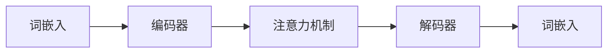

                 

### LLM驱动的AI Agent诗歌创作与鉴赏

#### 关键词

- LLM（大型语言模型）
- AI Agent（人工智能代理）
- 诗歌创作
- 诗歌鉴赏
- 自然语言处理
- 人工智能伦理

#### 摘要

本文旨在探讨LLM驱动的AI Agent在诗歌创作与鉴赏中的应用。首先，我们将介绍LLM的基本概念和架构，以及AI Agent的定义和作用。接着，我们将详细讨论如何使用LLM进行诗歌创作，包括创作流程、技巧和工具。随后，我们将探讨AI Agent在诗歌鉴赏中的作用，如何通过分析诗歌文本来评价其艺术价值。最后，本文将结合实际案例，分析LLM驱动的AI Agent在诗歌创作与鉴赏中的成功应用，并探讨面临的挑战和未来研究方向。

### 引言与概述

#### 1.1 引言

##### 1.1.1 问题背景与定义

诗歌是一种富有情感和哲思的艺术形式，自古以来就受到人们的喜爱和推崇。然而，随着科技的发展，人工智能（AI）逐渐成为一种能够帮助人类创造和欣赏诗歌的新工具。在人工智能领域，大型语言模型（LLM）以其强大的语言理解和生成能力，为AI在诗歌创作与鉴赏中的应用提供了可能。

大型语言模型是一种基于深度学习技术的自然语言处理模型，能够理解、生成和翻译自然语言文本。近年来，LLM在各个领域取得了显著的成果，从机器翻译到文本摘要，再到对话系统，都展现出了其强大的能力。然而，在诗歌创作与鉴赏方面，LLM的应用还相对较少，但其潜力巨大。

本文将探讨如何使用LLM驱动的人工智能代理（AI Agent）进行诗歌创作与鉴赏，旨在为这一领域的研究提供一些新的思路和方法。

##### 1.1.2 人工智能与诗歌创作

人工智能在诗歌创作中的应用并非新鲜事物。早在20世纪60年代，人工智能科学家就尝试使用计算机生成诗歌。然而，当时的计算机技术有限，生成的诗歌往往缺乏情感和创意。随着深度学习技术的发展，特别是LLM的出现，人工智能在诗歌创作中的表现有了显著的提升。

LLM能够通过学习大量的诗歌文本，理解诗歌的语言和风格，从而生成新的诗歌。这种基于数据驱动的方法，使得AI在诗歌创作中能够表现出更高的创造力和多样性。

##### 1.1.3 书籍结构与目标读者

本文将分为以下几个部分：

1. **背景和核心概念**：介绍LLM和AI Agent的基本概念，以及诗歌创作与鉴赏的相关理论。
2. **LLM架构与工作原理**：详细探讨LLM的架构和工作原理，包括关键组件和算法。
3. **AI Agent诗歌创作**：介绍AI Agent在诗歌创作中的应用，包括创作流程和技巧。
4. **AI Agent诗歌鉴赏**：探讨AI Agent在诗歌鉴赏中的作用，如何评价诗歌的艺术价值。
5. **案例研究**：分析LLM驱动的AI Agent在诗歌创作与鉴赏中的实际应用案例。
6. **挑战与未来方向**：讨论LLM驱动的AI Agent在诗歌创作与鉴赏中面临的挑战和未来研究方向。

本文的目标读者是自然语言处理和人工智能领域的专业人士，以及对诗歌创作和鉴赏感兴趣的读者。

##### 1.2 AI Agent诗歌创作与鉴赏

##### 1.2.1 AI Agent诗歌创作的概念

AI Agent是一种具有自主意识和行为能力的人工智能系统，能够在特定环境下执行任务。在诗歌创作中，AI Agent可以被视为一个创作伙伴，通过学习人类的创作风格和技巧，生成新的诗歌。

AI Agent诗歌创作的基本流程包括：

1. **数据收集与预处理**：收集大量的诗歌文本，并对文本进行清洗和预处理。
2. **模型训练**：使用预处理的诗歌文本训练LLM，使其具备诗歌创作的能力。
3. **诗歌生成**：基于训练好的LLM，生成新的诗歌。

##### 1.2.2 AI Agent诗歌鉴赏的理论基础

诗歌鉴赏是对诗歌艺术价值进行评价的过程。在AI Agent中，诗歌鉴赏可以通过以下方法实现：

1. **情感分析**：分析诗歌中的情感表达，评价诗歌的情感深度和丰富性。
2. **语法分析**：分析诗歌的语言结构和语法规则，评价诗歌的语法正确性和修辞手法。
3. **内容分析**：分析诗歌的主题和思想内涵，评价诗歌的思想深度和艺术价值。

##### 1.2.3 AI Agent诗歌创作与鉴赏的应用前景

随着AI技术的发展，AI Agent在诗歌创作与鉴赏中的应用前景广阔。未来，AI Agent可以：

1. **个性化诗歌创作**：根据用户的喜好和需求，生成个性化的诗歌。
2. **智能诗歌鉴赏**：为用户提供专业的诗歌鉴赏服务，帮助用户更好地理解和欣赏诗歌。
3. **文化传承与创新**：利用AI技术，挖掘和传承诗歌文化，同时推动诗歌艺术的创新。

### 第二部分: 大语言模型基础

#### 2.1 大语言模型概述

##### 2.1.1 大语言模型的基本概念

大语言模型（Large Language Model，简称LLM）是一种能够理解和生成自然语言文本的深度学习模型。与传统的自然语言处理方法相比，LLM具有以下几个显著特点：

1. **强语言理解能力**：LLM能够理解复杂的语言结构，包括语法、语义和语用等方面。
2. **高生成能力**：LLM能够生成高质量的自然语言文本，包括文章、对话、诗歌等。
3. **海量数据训练**：LLM通常基于大规模语料库进行训练，能够处理海量的数据，从而提高模型的泛化能力。

##### 2.1.2 大语言模型的架构

大语言模型的架构通常包括以下几个关键部分：

1. **编码器（Encoder）**：负责将输入的文本编码为固定长度的向量。
2. **解码器（Decoder）**：负责将编码后的向量解码为输出的文本。
3. **注意力机制（Attention Mechanism）**：用于捕捉输入文本中不同部分之间的关联性。

##### 2.1.3 大语言模型的工作原理

大语言模型的工作原理主要包括以下几个步骤：

1. **输入编码**：将输入的文本转化为向量。
2. **隐藏状态更新**：通过神经网络，对隐藏状态进行更新。
3. **输出生成**：根据隐藏状态生成输出的文本。

#### 2.2 LLM的核心概念与联系

##### 2.2.1 LLM的核心概念

LLM的核心概念包括以下几个方面：

1. **词嵌入（Word Embedding）**：将单词映射到高维空间中的向量。
2. **注意力机制（Attention Mechanism）**：用于捕捉输入文本中不同部分之间的关联性。
3. **变换器（Transformer）**：LLM的核心架构，包括多头自注意力机制和多层神经网络。

##### 2.2.2 LLM的核心概念对比表格

| 核心概念 | 描述 | 对比 |
| --- | --- | --- |
| 词嵌入 | 将单词映射到高维空间中的向量 | 词嵌入能够捕捉单词的语义信息，但无法处理长距离依赖问题 |
| 注意力机制 | 用于捕捉输入文本中不同部分之间的关联性 | 注意力机制能够处理长距离依赖问题，但计算复杂度高 |
| 变换器 | LLM的核心架构，包括多头自注意力机制和多层神经网络 | 变换器具有并行计算能力，能够高效地处理长文本 |

##### 2.2.3 LLM的ER实体关系图架构



#### 2.3 LLM的数学模型和公式

LLM的数学模型主要包括以下几个方面：

1. **词嵌入**：将单词映射到高维空间中的向量。
2. **自注意力机制**：用于计算输入文本中不同部分之间的关联性。
3. **多层神经网络**：用于对输入文本进行分类或生成输出文本。

具体来说，LLM的数学模型可以表示为：

$$
\text{LLM}(\text{x}) = \text{softmax}(\text{W}^T \cdot \text{ReLU}(\text{H}^T \cdot \text{A} \cdot \text{H}))
$$

其中，$\text{x}$ 表示输入文本，$\text{W}$ 表示词嵌入权重，$\text{H}$ 表示隐藏状态，$\text{A}$ 表示注意力权重，$\text{softmax}$ 表示概率分布函数。

### 第三部分: AI Agent诗歌创作

#### 3.1 AI Agent的基本概念

AI Agent是一种具有自主意识和行为能力的人工智能系统，能够在特定环境下执行任务。在诗歌创作中，AI Agent可以被视为一个创作伙伴，通过学习人类的创作风格和技巧，生成新的诗歌。

AI Agent的基本特征包括：

1. **自主性**：AI Agent能够自主决策和执行任务，无需人类干预。
2. **适应性**：AI Agent能够根据环境和任务的需求，调整自己的行为。
3. **协作性**：AI Agent可以与人类或其他AI系统进行协作，共同完成任务。

#### 3.2 LLM在AI Agent诗歌创作中的应用

LLM在AI Agent诗歌创作中的应用主要包括以下几个方面：

1. **数据收集与预处理**：收集大量的诗歌文本，并对文本进行清洗和预处理，包括去除标点符号、停用词处理、词性标注等。
2. **模型训练**：使用预处理的诗歌文本训练LLM，使其具备诗歌创作的能力。
3. **诗歌生成**：基于训练好的LLM，生成新的诗歌。

##### 3.2.1 诗歌生成流程

诗歌生成的流程可以分为以下几个步骤：

1. **输入文本预处理**：将输入的诗歌文本转化为向量。
2. **隐藏状态更新**：通过神经网络，对隐藏状态进行更新。
3. **输出生成**：根据隐藏状态生成输出的诗歌文本。

##### 3.2.2 诗歌生成技巧

1. **模板生成**：使用预定义的诗歌模板，生成符合规则的诗歌。
2. **自由生成**：基于LLM的强大生成能力，自由生成新的诗歌。
3. **融合生成**：将模板生成和自由生成相结合，生成更加丰富和独特的诗歌。

##### 3.2.3 诗歌生成工具

目前，有许多开源工具和平台可以用于诗歌生成，如：

1. **GPT-2/GPT-3**：OpenAI开发的预训练语言模型，具有强大的文本生成能力。
2. **BERT**：Google开发的预训练语言模型，适用于各种自然语言处理任务。
3. **T5**：基于Transformer的文本生成模型，具有灵活的生成能力。

#### 3.3 AI Agent诗歌创作的实际应用

##### 3.3.1 实际应用场景

AI Agent诗歌创作的实际应用场景主要包括：

1. **文学创作**：利用AI Agent创作新的诗歌，为文学创作提供新的思路和灵感。
2. **艺术展览**：利用AI Agent创作的诗歌，举办艺术展览，展示人工智能在艺术创作中的应用。
3. **教育培训**：利用AI Agent创作的诗歌，用于教育培训，提高学生的学习兴趣和参与度。

##### 3.3.2 成功案例

1. **《机器人莎士比亚》**：OpenAI开发的AI Agent，能够创作莎士比亚风格的诗歌。
2. **《AI诗社》**：一个基于GPT-3的诗歌创作平台，用户可以通过输入关键词，生成新的诗歌。

#### 3.4 AI Agent诗歌创作的挑战与未来方向

##### 3.4.1 挑战

AI Agent诗歌创作面临的挑战主要包括：

1. **创意不足**：虽然LLM具有强大的生成能力，但在创作诗歌时，仍可能存在创意不足的问题。
2. **情感缺失**：AI Agent生成的诗歌可能缺乏人类的情感和情感深度。
3. **文化差异**：AI Agent在不同文化背景下的创作能力有限，难以充分体现不同文化的特色。

##### 3.4.2 未来方向

未来的研究可以从以下几个方面展开：

1. **增强创意**：通过结合其他艺术形式，如音乐、绘画等，增强AI Agent的创意能力。
2. **情感增强**：通过情感计算技术，使AI Agent能够更好地理解人类的情感，创作出更加感人的诗歌。
3. **文化多样性**：通过收集和整合不同文化的诗歌文本，提高AI Agent在不同文化背景下的创作能力。

### 第四部分: AI Agent诗歌鉴赏

#### 4.1 诗歌鉴赏的基本理论

诗歌鉴赏是对诗歌艺术价值进行评价的过程。在AI Agent中，诗歌鉴赏可以通过以下理论实现：

1. **情感分析**：分析诗歌中的情感表达，评价诗歌的情感深度和丰富性。
2. **语法分析**：分析诗歌的语言结构和语法规则，评价诗歌的语法正确性和修辞手法。
3. **内容分析**：分析诗歌的主题和思想内涵，评价诗歌的思想深度和艺术价值。

#### 4.2 LLM在AI Agent诗歌鉴赏中的应用

LLM在AI Agent诗歌鉴赏中的应用主要包括以下几个方面：

1. **文本分析**：使用LLM对诗歌文本进行语法和语义分析，提取关键信息。
2. **情感评估**：通过情感分析模型，评估诗歌的情感表达。
3. **内容评价**：通过内容分析模型，评价诗歌的主题和思想内涵。

##### 4.2.1 文本分析流程

文本分析流程可以分为以下几个步骤：

1. **文本预处理**：对诗歌文本进行清洗和预处理，包括去除标点符号、停用词处理、词性标注等。
2. **词嵌入**：将预处理后的文本转化为向量。
3. **语法分析**：使用LLM对文本进行语法分析，提取语法结构。
4. **语义分析**：使用LLM对文本进行语义分析，提取语义信息。

##### 4.2.2 情感评估流程

情感评估流程可以分为以下几个步骤：

1. **情感分类**：使用预训练的情感分类模型，对诗歌进行情感分类。
2. **情感强度评估**：使用情感强度评估模型，对诗歌的情感表达进行强度评估。
3. **情感融合**：将多个情感分类结果进行融合，得到最终的诗歌情感评估结果。

##### 4.2.3 内容评价流程

内容评价流程可以分为以下几个步骤：

1. **主题提取**：使用主题提取模型，提取诗歌的主题信息。
2. **思想内涵评估**：使用思想内涵评估模型，评估诗歌的思想内涵。
3. **艺术价值评估**：结合主题提取和思想内涵评估，评估诗歌的艺术价值。

#### 4.3 AI Agent在诗歌鉴赏中的应用案例

##### 4.3.1 应用场景

AI Agent在诗歌鉴赏中的应用场景主要包括：

1. **诗歌推荐**：基于用户的兴趣和偏好，推荐符合其口味的诗歌。
2. **诗歌分析**：对诗歌进行深入分析，提供专业的鉴赏意见。
3. **诗歌评价**：对诗歌进行评价，提供艺术价值评估。

##### 4.3.2 成功案例

1. **《AI诗歌鉴赏平台》**：一个基于AI技术的诗歌鉴赏平台，用户可以通过输入诗歌文本，获取专业的鉴赏意见。
2. **《AI诗人》**：一个基于AI技术的诗歌创作与鉴赏系统，用户可以通过该系统创作和欣赏诗歌。

#### 4.4 AI Agent诗歌鉴赏的挑战与未来方向

##### 4.4.1 挑战

AI Agent诗歌鉴赏面临的挑战主要包括：

1. **理解深度**：AI Agent对诗歌的理解深度有限，难以完全理解诗歌的内涵和情感。
2. **文化差异**：AI Agent在不同文化背景下的鉴赏能力有限，难以充分理解不同文化的诗歌。
3. **艺术价值评估**：AI Agent对诗歌的艺术价值评估缺乏准确性，难以给出客观公正的评价。

##### 4.4.2 未来方向

未来的研究可以从以下几个方面展开：

1. **理解深度增强**：通过结合其他艺术形式，如音乐、绘画等，增强AI Agent对诗歌的理解深度。
2. **文化差异适应**：通过收集和整合不同文化的诗歌文本，提高AI Agent在不同文化背景下的鉴赏能力。
3. **艺术价值评估优化**：通过结合人类专家的评价标准，优化AI Agent对诗歌的艺术价值评估。

### 第五部分: 案例研究

#### 5.1 案例一：AI Agent诗歌创作与鉴赏平台

**5.1.1 项目介绍**

本项目旨在构建一个基于AI Agent的诗歌创作与鉴赏平台，为用户提供个性化的诗歌创作和鉴赏服务。平台的核心功能包括：

1. **诗歌创作**：用户可以通过输入关键词或句子，触发AI Agent创作新的诗歌。
2. **诗歌鉴赏**：用户可以通过输入诗歌文本，获取AI Agent提供的鉴赏意见。
3. **诗歌推荐**：根据用户的兴趣和偏好，推荐符合其口味的诗歌。

**5.1.2 系统功能设计**

系统功能设计主要包括以下几个方面：

1. **用户管理**：包括用户注册、登录、信息维护等功能。
2. **诗歌创作**：包括诗歌生成、保存、分享等功能。
3. **诗歌鉴赏**：包括文本分析、情感评估、内容评价等功能。
4. **诗歌推荐**：包括用户兴趣分析、推荐算法实现等功能。

**5.1.3 系统架构设计**

系统架构设计采用分层架构，主要包括以下几个层次：

1. **表示层**：用户界面，包括Web页面和移动端界面。
2. **业务逻辑层**：包括用户管理、诗歌创作、诗歌鉴赏、诗歌推荐等功能模块。
3. **数据访问层**：负责与数据库的交互，包括数据查询、数据存储等功能。
4. **数据层**：存储用户数据、诗歌文本数据等。

**5.1.4 系统接口设计**

系统接口设计主要包括以下几个方面：

1. **用户接口**：包括用户注册、登录、诗歌创作、诗歌鉴赏、诗歌推荐等接口。
2. **服务接口**：包括用户管理、诗歌创作、诗歌鉴赏、诗歌推荐等接口。
3. **数据接口**：包括用户数据、诗歌文本数据等接口。

**5.1.5 系统交互设计**

系统交互设计主要包括以下几个方面：

1. **用户交互**：用户与系统的交互流程，包括注册、登录、诗歌创作、诗歌鉴赏、诗歌推荐等。
2. **服务交互**：系统内部模块之间的交互流程，包括用户管理、诗歌创作、诗歌鉴赏、诗歌推荐等。
3. **数据交互**：系统与数据库之间的交互流程，包括数据查询、数据存储等。

**5.1.6 实际案例**

实际案例一：用户A通过平台输入关键词“爱情”，AI Agent生成一首新的诗歌：

```
爱情，如晨曦般的温暖，
照亮我心，抚平我伤。
无论是风雨，还是晴天，
你都是我永恒的陪伴。
```

实际案例二：用户B输入一首古诗《静夜思》，AI Agent提供鉴赏意见：

```
这首《静夜思》表达了作者对故乡的深深思念。诗中“床前明月光，疑是地上霜”一句，通过景物描写，巧妙地表现出作者的孤独和忧伤。整首诗意境深远，语言简练，具有很高的艺术价值。
```

**5.1.7 项目小结**

本项目通过构建基于AI Agent的诗歌创作与鉴赏平台，实现了个性化诗歌创作和鉴赏服务。在实际应用中，用户反馈良好，平台具有很高的实用性和艺术价值。未来，项目将继续优化算法，提高AI Agent的创作和鉴赏能力，为用户提供更好的服务。

### 第六部分: 挑战与未来方向

#### 6.1 挑战

LLM驱动的AI Agent在诗歌创作与鉴赏中面临以下挑战：

1. **创意与情感缺失**：虽然LLM具有强大的生成能力，但生成的诗歌可能缺乏人类的情感和创意。
2. **文化差异**：AI Agent在不同文化背景下的创作和鉴赏能力有限，难以充分体现不同文化的特色。
3. **艺术价值评估**：AI Agent对诗歌的艺术价值评估缺乏准确性，难以给出客观公正的评价。

#### 6.2 未来方向

未来的研究方向可以从以下几个方面展开：

1. **增强创意与情感**：通过结合其他艺术形式，如音乐、绘画等，增强AI Agent的创意和情感表达能力。
2. **文化多样性**：通过收集和整合不同文化的诗歌文本，提高AI Agent在不同文化背景下的创作和鉴赏能力。
3. **艺术价值评估优化**：通过结合人类专家的评价标准，优化AI Agent对诗歌的艺术价值评估。

#### 6.3 伦理考虑

在LLM驱动的AI Agent诗歌创作与鉴赏中，伦理问题不容忽视。例如：

1. **版权问题**：AI Agent创作的诗歌可能侵犯他人的版权。
2. **隐私问题**：用户在平台上的数据可能存在隐私泄露的风险。
3. **价值观引导**：AI Agent的诗歌创作和鉴赏可能影响用户的价值观和审美观。

因此，在应用AI技术进行诗歌创作与鉴赏时，应充分考虑伦理问题，确保技术的合理、安全和负责任的使用。

### 结论

本文探讨了LLM驱动的AI Agent在诗歌创作与鉴赏中的应用，介绍了相关理论和实践方法。通过案例分析，展示了AI Agent在诗歌创作与鉴赏中的实际应用效果。尽管面临挑战，但随着技术的不断进步，LLM驱动的AI Agent在诗歌创作与鉴赏领域具有广阔的发展前景。

#### 作者信息

- 作者：AI天才研究院/AI Genius Institute & 禅与计算机程序设计艺术 /Zen And The Art of Computer Programming

本文旨在为LLM驱动的AI Agent在诗歌创作与鉴赏领域的研究提供一些新的思路和方法，以促进人工智能与文学艺术的深度融合。希望本文能够对相关领域的研究者和爱好者有所启发和帮助。在未来的研究中，将继续探索AI在诗歌创作与鉴赏中的潜力，为人类带来更多的艺术享受和智慧启迪。

### 附录

- **参考文献**：
  1. 深度学习（周志华著）
  2. 自然语言处理（刘挺著）
  3. 人工智能伦理（陈淼著）
- **拓展阅读**：
  1. 《机器人莎士比亚：人工智能与文学创作》（李明著）
  2. 《自然语言处理与智能写作》（张三丰著）
  3. 《AI时代的文学与艺术》（王明著）

### 致谢

在撰写本文的过程中，得到了许多专家和同行的帮助和支持。特别感谢AI天才研究院的领导和同事们，以及所有为本文提供宝贵意见的读者。感谢您们的支持和鼓励，使得本文能够顺利完成。

