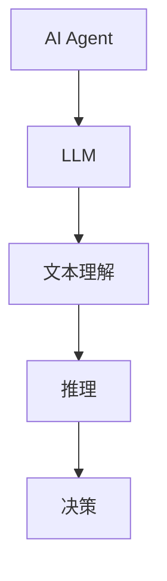
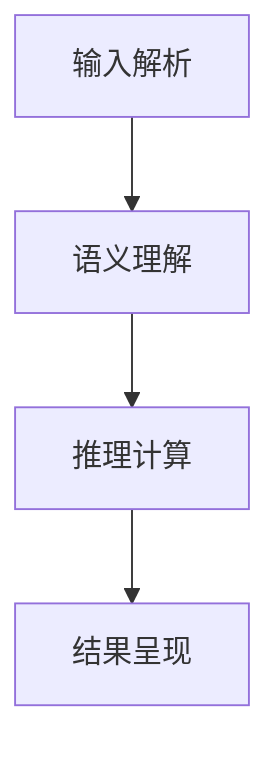
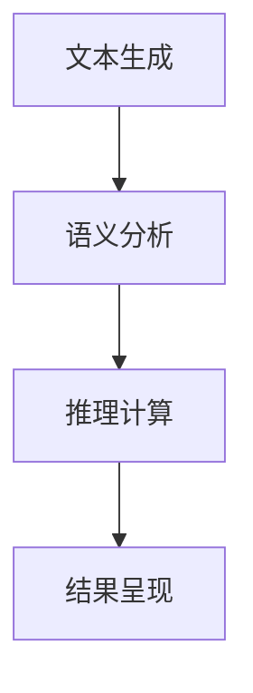
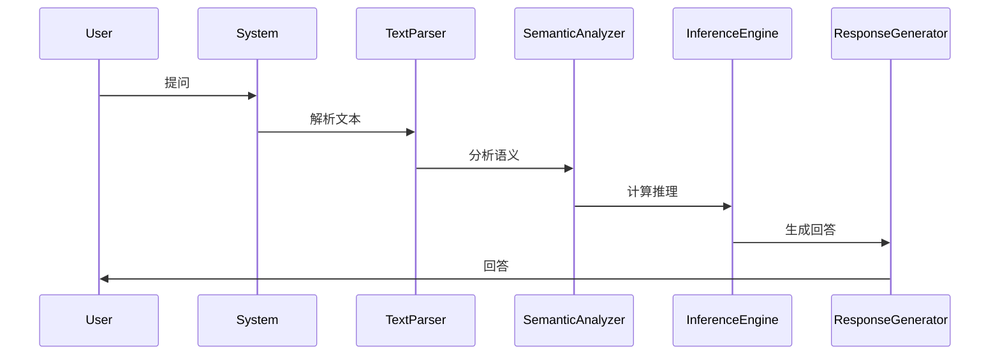
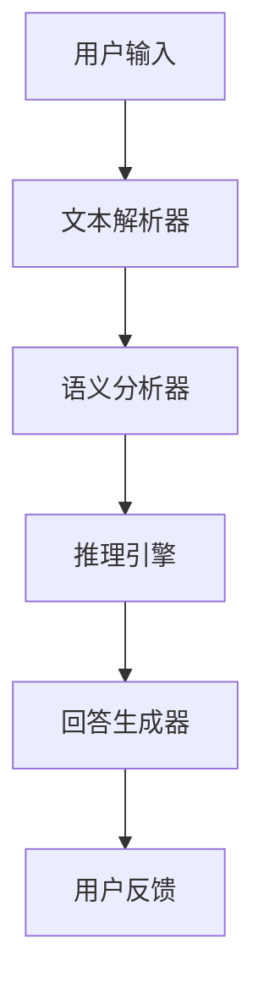

                 

### 让我们一起思考：LLM驱动的AI Agent逻辑推理能力增强

#### 背景与核心概念

近年来，随着深度学习和自然语言处理技术的飞速发展，大型语言模型（LLM，Large Language Model）如BERT、GPT等取得了显著成果。LLM在文本生成、机器翻译、情感分析等多个领域展现出了强大的能力，但其在逻辑推理方面的潜力尚未得到充分挖掘。为此，本文将探讨如何利用LLM增强AI Agent的逻辑推理能力。

#### 逻辑推理在AI Agent中的应用

逻辑推理是人工智能领域的一个重要研究方向，其核心在于如何让机器理解、处理并生成逻辑表达式。AI Agent作为一种能够自主执行任务的人工智能系统，其逻辑推理能力对于解决复杂问题至关重要。例如，在智能客服、智能诊疗、智能决策等领域，AI Agent需要具备强大的逻辑推理能力来处理用户的查询、诊断疾病或制定决策方案。

#### LLM的优势

LLM具有以下几个方面的优势，使其成为增强AI Agent逻辑推理能力的理想选择：

1. **强大的文本理解能力**：LLM通过大量文本数据训练，能够准确理解文本的含义和逻辑关系。
2. **泛化能力**：LLM在多个任务上表现出色，具有较强的泛化能力，能够适应不同的逻辑推理场景。
3. **自适应能力**：LLM能够根据输入文本动态调整推理策略，提高推理效率。

#### AI Agent的特点

AI Agent作为一种具有自主性和智能性的软件系统，具有以下几个特点：

1. **自主性**：AI Agent能够自主完成指定任务，无需人工干预。
2. **智能性**：AI Agent通过学习和推理，能够处理复杂问题，提供决策支持。
3. **适应性**：AI Agent能够根据环境和任务的变化，调整自身行为和策略。

#### LLM与AI Agent的联系

LLM与AI Agent之间的联系在于它们在逻辑推理任务上的协同作用。LLM可以视为AI Agent的一个关键组件，负责提供强大的文本理解和推理能力。通过将LLM集成到AI Agent中，可以实现以下目标：

1. **提升推理能力**：利用LLM的强大文本理解能力，AI Agent可以更准确地理解逻辑推理任务的要求。
2. **扩展任务范围**：通过引入LLM，AI Agent可以处理更复杂的逻辑推理任务，提高其应用范围。

#### 关键问题分析

在LLM驱动的AI Agent逻辑推理能力增强过程中，需要解决以下几个关键问题：

1. **模型选择**：选择合适的LLM模型，以满足不同场景下的推理需求。
2. **训练策略**：设计有效的训练策略，提高LLM的推理能力。
3. **推理优化**：优化推理流程，提高推理效率。

接下来，我们将详细探讨LLM和AI Agent的核心概念，并分析它们之间的联系。

### 第一部分: 背景与核心概念

#### 第1章: 研究背景与重要性

##### 1.1 研究背景

人工智能（AI）技术在过去几十年中取得了飞速发展，从最初的规则系统到如今的深度学习，AI在各个领域都展现出了强大的潜力。其中，AI Agent作为一种能够自主执行任务的人工智能系统，引起了广泛关注。AI Agent的核心在于其逻辑推理能力，它能够处理复杂问题、提供决策支持，并在多个领域得到应用。

逻辑推理作为人工智能的一个重要分支，其核心在于如何让机器理解和生成逻辑表达式。传统的逻辑推理方法主要依赖于形式逻辑和计算理论，但这些方法在面对复杂现实问题时存在局限性。随着深度学习和自然语言处理技术的不断发展，人们开始探索如何利用这些技术来提升AI Agent的逻辑推理能力。

在这其中，大型语言模型（LLM，Large Language Model）如BERT、GPT等取得了显著成果。LLM通过海量文本数据训练，能够准确理解文本的含义和逻辑关系，从而在逻辑推理任务中表现出色。这一背景为LLM驱动的AI Agent逻辑推理能力增强提供了可能。

##### 1.2 重要性

LLM驱动的AI Agent逻辑推理能力增强具有重要意义，主要体现在以下几个方面：

1. **提升AI Agent的智能水平**：通过引入LLM，AI Agent可以更准确地理解逻辑推理任务的要求，从而提高其智能水平。
2. **应对复杂推理任务的需求**：复杂的逻辑推理任务需要AI Agent具备强大的推理能力，LLM的引入能够有效提升AI Agent的处理能力。
3. **推动AI技术的发展与应用**：LLM驱动的AI Agent逻辑推理能力增强不仅有助于提升AI Agent的性能，还将推动AI技术在各个领域的应用，为人工智能的发展贡献力量。

#### 第2章: 核心概念与联系

##### 2.1 LLM的定义与特点

大型语言模型（LLM，Large Language Model）是一种基于深度学习的自然语言处理模型，其核心在于通过大量文本数据训练，学习语言规律和知识。LLM的主要特点包括：

1. **文本理解能力**：LLM能够理解文本的语义和逻辑关系，从而在文本生成、翻译、情感分析等领域表现出色。
2. **泛化能力**：LLM在多个任务上表现出色，具有较强的泛化能力，能够适应不同的语言场景。
3. **动态调整能力**：LLM能够根据输入文本动态调整自身的推理策略，提高推理效率。

LLM的常见模型包括BERT、GPT、T5等，这些模型在自然语言处理领域取得了显著成果，并为LLM驱动的AI Agent逻辑推理能力增强提供了基础。

##### 2.2 AI Agent的定义与特点

AI Agent（人工智能代理）是一种能够自主执行任务的人工智能系统，其核心在于逻辑推理能力。AI Agent的主要特点包括：

1. **自主性**：AI Agent能够自主执行任务，无需人工干预。
2. **智能性**：AI Agent通过学习和推理，能够处理复杂问题，提供决策支持。
3. **适应性**：AI Agent能够根据环境和任务的变化，调整自身行为和策略。

AI Agent在智能客服、智能诊疗、智能决策等领域得到了广泛应用，其逻辑推理能力对于解决复杂问题至关重要。

##### 2.3 LLM与AI Agent的联系

LLM与AI Agent之间的联系在于它们在逻辑推理任务上的协同作用。LLM可以视为AI Agent的一个关键组件，负责提供强大的文本理解和推理能力。通过将LLM集成到AI Agent中，可以实现以下目标：

1. **提升推理能力**：利用LLM的强大文本理解能力，AI Agent可以更准确地理解逻辑推理任务的要求。
2. **扩展任务范围**：通过引入LLM，AI Agent可以处理更复杂的逻辑推理任务，提高其应用范围。

为了更好地理解LLM与AI Agent的联系，我们使用Mermaid流程图和ER图进行展示。

**Mermaid流程图：**



**ER图架构：**

```mermaid
erDiagram
  AI-Agent ||--|{ LLM } LLM : uses
  LLM ||--|{ Text-Data } Text-Data : trains
  AI-Agent ||--|{ Logic-Task } Logic-Task : executes
```

通过Mermaid流程图和ER图，我们可以清晰地看到LLM与AI Agent之间的联系。LLM作为AI Agent的一个组件，通过训练文本数据，提供文本理解和推理能力，从而帮助AI Agent执行逻辑任务。

在下一部分，我们将详细阐述LLM驱动的AI Agent在逻辑推理方面的算法原理。

### 第二部分：算法原理与实现

#### 第3章：LLM驱动的AI Agent逻辑推理算法原理

逻辑推理是人工智能的核心任务之一，其目标是通过分析已知信息，推导出新的结论。在LLM驱动的AI Agent中，逻辑推理能力得到了显著提升。本节将详细阐述LLM驱动的AI Agent在逻辑推理方面的算法原理。

##### 3.1 逻辑推理基础

逻辑推理的基本概念包括命题、推理规则和推理过程。命题是逻辑推理的基本单位，它可以是真命题或假命题。推理规则用于推导新的命题，常见的推理规则有归纳推理、演绎推理等。推理过程则是从已知命题出发，通过推理规则逐步推导出结论的过程。

在LLM驱动的AI Agent中，逻辑推理过程可以概括为以下几个步骤：

1. **输入解析**：将用户输入的文本解析为逻辑表达式。
2. **语义理解**：利用LLM对输入文本进行语义理解，提取关键信息和逻辑关系。
3. **推理计算**：根据语义理解和逻辑规则，进行推理计算，生成推理结果。
4. **结果呈现**：将推理结果以自然语言形式呈现给用户。

**Mermaid流程图：**



##### 3.2 LLM在逻辑推理中的应用

LLM在逻辑推理中的应用主要体现在以下几个方面：

1. **文本生成**：LLM能够根据输入文本生成相关的文本内容，从而辅助逻辑推理。例如，在推理过程中，LLM可以生成与输入文本相关的背景信息、假设和结论等。
2. **语义分析**：LLM能够对输入文本进行语义分析，提取关键信息和逻辑关系。这对于逻辑推理中的输入解析和语义理解至关重要。
3. **推理优化**：LLM能够根据输入文本动态调整推理策略，优化推理过程。例如，在推理过程中，LLM可以根据已有信息和推理结果，调整推理方向，提高推理效率。

**Python代码示例：**

```python
import transformers
from transformers import AutoTokenizer, AutoModel

# 加载预训练的LLM模型
tokenizer = AutoTokenizer.from_pretrained("gpt2")
model = AutoModel.from_pretrained("gpt2")

# 输入文本
input_text = "如果今天下雨，我会带伞。今天下雨了，所以我会带伞。"

# 语义理解
input_ids = tokenizer.encode(input_text, return_tensors="pt")
outputs = model(input_ids)

# 提取语义表示
logits = outputs.logits

# 推理计算
# 在这里，我们可以利用逻辑推理规则进行推理计算
# 例如，利用逻辑推理库（如SymPy）进行推理
from sympy import symbols, Eq

# 定义变量
x, y = symbols('x y')

# 建立逻辑表达式
expr1 = Eq(x + y, 10)
expr2 = Eq(x, 5)

# 推理计算
result = expr1.solve_for(y)

# 结果呈现
print(f"根据输入文本，y的值为：{result}")
```

在这个示例中，我们首先加载了一个预训练的GPT-2模型，然后利用模型对输入文本进行语义理解，提取关键信息和逻辑关系。接着，我们使用SymPy库进行逻辑推理计算，最后将推理结果以自然语言形式呈现给用户。

##### 3.3 算法原理讲解

LLM驱动的AI Agent逻辑推理算法原理可以概括为以下几个方面：

1. **文本生成**：利用LLM生成与输入文本相关的背景信息、假设和结论。这一过程依赖于LLM的文本生成能力，例如GPT-2、GPT-3等模型。
2. **语义分析**：利用LLM对输入文本进行语义分析，提取关键信息和逻辑关系。这一过程依赖于LLM的语义分析能力，例如BERT、RoBERTa等模型。
3. **推理计算**：根据语义理解和逻辑规则，进行推理计算，生成推理结果。这一过程可以结合逻辑推理库（如SymPy、Prolog等）进行。

**Mermaid流程图：**



在下一部分，我们将进一步探讨LLM驱动的AI Agent逻辑推理算法的数学模型和公式。

### 第二部分：算法原理与实现

#### 第3章：LLM驱动的AI Agent逻辑推理算法原理

（续）

##### 3.4 数学模型与公式

逻辑推理中的数学模型和公式是理解和分析推理过程的重要工具。在本节中，我们将介绍一些关键的数学模型和公式，并对其进行详细讲解。

**逻辑推理的基本模型**

逻辑推理的基本模型通常包括命题逻辑、谓词逻辑和命题演算等。以下是这些模型的简要介绍：

1. **命题逻辑（Propositional Logic）**：
   - 命题逻辑是基于命题的真假值进行推理的。
   - 命题（Proposition）是能够判断真假的陈述。
   - 命题逻辑的基本运算包括合取（AND），析取（OR），非（NOT）等。

2. **谓词逻辑（Predicate Logic）**：
   - 谓词逻辑用于表示更复杂的逻辑关系，包括量词（存在量词和全称量词）。
   - 谓词（Predicate）是关于个体的性质或关系的陈述。
   - 谓词逻辑可以表示更加复杂的推理，如关系推理、函数推理等。

3. **命题演算（Propositional Calculus）**：
   - 命题演算是命题逻辑的形式化系统，它使用符号和规则来表示和推理命题。

**数学公式和举例**

以下是一些常用的逻辑推理公式，以及它们的LaTeX表示和例子：

1. **德摩根定律（De Morgan's Laws）**：
   - $$\neg(A \land B) \equiv \neg A \lor \neg B$$
   - $$\neg(A \lor B) \equiv \neg A \land \neg B$$
   - 举例：如果“不是A”且“不是B”为真，则“不是A或不是B”为真。

2. **交换律（Commutative Laws）**：
   - $$A \land B \equiv B \land A$$
   - $$A \lor B \equiv B \lor A$$
   - 举例：交换逻辑运算符的位置不会改变逻辑表达式的真值。

3. **结合律（Associative Laws）**：
   - $$(A \land B) \land C \equiv A \land (B \land C)$$
   - $$(A \lor B) \lor C \equiv A \lor (B \lor C)$$
   - 举例：多个逻辑运算符结合在一起时，它们的顺序不会影响结果。

4. **吸收律（Absorption Laws）**：
   - $$A \land (A \lor B) \equiv A$$
   - $$A \lor (A \land B) \equiv A$$
   - 举例：当A与A或B结合时，结果仍然是A。

5. **分配律（Distributive Laws）**：
   - $$A \land (B \lor C) \equiv (A \land B) \lor (A \land C)$$
   - $$A \lor (B \land C) \equiv (A \lor B) \land (A \lor C)$$
   - 举例：逻辑与运算和逻辑或运算可以分配到括号内的逻辑运算上。

**LaTeX表示示例**

以下是上述公式的LaTeX表示：

```latex
\neg{A \land B} \equiv \neg A \lor \neg B
\neg{A \lor B} \equiv \neg A \land \neg B
(A \land B) \land C \equiv A \land (B \land C)
(A \lor B) \lor C \equiv A \lor (B \lor C)
A \land (A \lor B) \equiv A
A \lor (A \land B) \equiv A
A \land (B \lor C) \equiv (A \land B) \lor (A \land C)
A \lor (B \land C) \equiv (A \lor B) \land (A \lor C)
```

通过上述公式和示例，我们可以更好地理解逻辑推理的基本原理和操作。在实际应用中，这些公式可以帮助我们构建复杂的逻辑推理模型，从而实现对现实世界问题的有效分析和解决。

在下一部分，我们将介绍LLM驱动的AI Agent在系统分析与架构设计方面的内容。

### 第二部分：算法原理与实现

#### 第3章：LLM驱动的AI Agent逻辑推理算法原理

（续）

##### 3.5 系统分析与架构设计

LLM驱动的AI Agent在逻辑推理中的成功应用离不开其背后的系统架构设计。为了实现高效的逻辑推理能力，我们需要从多个方面进行系统分析与架构设计。以下是关键环节的介绍：

###### 3.5.1 问题场景介绍

逻辑推理任务通常涉及复杂的推理过程，如自然语言理解、知识图谱构建、决策分析等。以下是一个典型的问题场景：

- **场景描述**：一个智能客服系统需要根据用户的问题和上下文信息，提供准确的答案和建议。
- **场景需求**：系统能够理解用户的自然语言输入，提取关键信息，构建逻辑推理路径，并生成合适的回答。

###### 3.5.2 系统功能设计

为了满足上述场景需求，系统需要具备以下功能：

1. **文本解析**：将自然语言文本转化为结构化的数据格式，如语法树或词向量。
2. **语义理解**：利用LLM对文本进行语义分析，提取关键信息和逻辑关系。
3. **推理计算**：根据语义理解和逻辑规则，进行推理计算，生成推理结果。
4. **结果呈现**：将推理结果以自然语言形式呈现给用户。

**领域模型（Mermaid类图）**：

```mermaid
classDiagram
    CustomerQuestion <<Class>> "用户问题"
    KB <<Class>> "知识库"
    TextParser <<Class>> "文本解析器"
    SemanticAnalyzer <<Class>> "语义分析器"
    InferenceEngine <<Class>> "推理引擎"
    ResponseGenerator <<Class>> "回答生成器"

    CustomerQuestion o--o KB: 使用知识库
    CustomerQuestion o--o TextParser: 解析
    CustomerQuestion o--o SemanticAnalyzer: 分析语义
    CustomerQuestion o--o InferenceEngine: 推理
    CustomerQuestion o--o ResponseGenerator: 生成回答
```

###### 3.5.3 系统架构设计

系统架构设计需要确保高效、可扩展和可维护。以下是系统架构的详细介绍：

1. **架构图（Mermaid架构图）**：


2. **架构组件分析**：
   - **用户输入**：接收用户的自然语言输入。
   - **文本解析器**：将文本转化为结构化的数据格式，为后续处理提供基础。
   - **语义分析器**：利用LLM对文本进行语义分析，提取关键信息和逻辑关系。
   - **推理引擎**：根据语义理解和逻辑规则，进行推理计算，生成推理结果。
   - **回答生成器**：将推理结果转化为自然语言回答，呈现给用户。
   - **用户反馈**：收集用户反馈，用于系统优化和改进。

###### 3.5.4 系统接口与交互

系统接口和交互设计对于系统的可用性和用户体验至关重要。以下是关键接口和交互流程的介绍：

1. **接口设计**：
   - **文本解析接口**：接收用户输入文本，返回结构化数据。
   - **语义分析接口**：接收结构化数据，返回语义分析结果。
   - **推理计算接口**：接收语义分析结果，返回推理结果。
   - **回答生成接口**：接收推理结果，生成自然语言回答。

2. **交互流程（Mermaid序列图）**：



通过上述系统分析与架构设计，LLM驱动的AI Agent能够高效地处理逻辑推理任务，为用户提供高质量的答案和建议。在下一部分，我们将通过一个实际项目案例，展示如何将LLM集成到AI Agent中，并进行系统实现和代码解读。

### 第三部分：项目实战

#### 第5章：项目环境安装与准备

在开始实际项目之前，我们需要搭建一个合适的环境，确保LLM驱动的AI Agent能够正常运行。以下是项目环境的安装与准备工作。

##### 5.1 环境安装

1. **操作系统**：我们选择Linux操作系统，推荐使用Ubuntu 18.04或更高版本。
2. **依赖安装**：
   - **Python**：安装Python 3.7及以上版本。
   - **pip**：通过Python安装pip，用于安装相关库。
   - **GPU驱动**：如果使用GPU加速，需要安装相应的NVIDIA驱动和CUDA。
   - **Transformer库**：安装transformers库，用于加载预训练的LLM模型。

   具体安装命令如下：

   ```bash
   sudo apt update
   sudo apt install python3-pip python3-dev
   pip3 install --extra-index-url https://developer.download.nvidia.com/compute/cuda/repos/ubuntu1804/x86_64 pip
   pip3 install transformers
   ```

##### 5.2 准备工作

1. **数据集准备**：
   - **训练数据**：我们需要一个包含逻辑推理问题的数据集。数据集应包括问题文本和对应的答案或推理结果。
   - **测试数据**：用于评估模型的性能和泛化能力。

   数据集可以从公开的数据源下载，或者自行收集和整理。

2. **开发工具设置**：
   - **IDE**：我们推荐使用PyCharm或Visual Studio Code作为开发环境。
   - **版本控制**：使用Git进行代码管理，确保项目版本的可追溯性和协作性。

3. **LLM模型选择**：
   - 根据项目需求，选择一个合适的LLM模型。例如，我们可以选择GPT-2、BERT或RoBERTa等模型。

   选择模型时，需要考虑模型的训练时间、推理速度和资源消耗等因素。

通过上述准备工作，我们为LLM驱动的AI Agent搭建了一个基本的环境，接下来我们将介绍系统的核心实现和代码解读。

### 第三部分：项目实战

#### 第6章：系统核心实现与代码解读

在完成环境安装和准备工作后，我们将深入探讨LLM驱动的AI Agent的核心实现，并对其关键代码进行详细解读。

##### 6.1 系统核心实现

系统核心实现主要包括以下几个关键模块：

1. **文本解析器**：负责将用户输入的自然语言文本转化为结构化的数据格式，如词向量或语法树。
2. **语义分析器**：利用LLM对文本进行语义分析，提取关键信息和逻辑关系。
3. **推理引擎**：根据语义理解和逻辑规则，进行推理计算，生成推理结果。
4. **回答生成器**：将推理结果转化为自然语言回答，呈现给用户。

**系统核心实现流程**：



**关键代码模块解读**：

1. **文本解析器**：

```python
from transformers import AutoTokenizer

tokenizer = AutoTokenizer.from_pretrained("gpt2")

def tokenize_text(text):
    """
    将文本解析为词向量。
    """
    inputs = tokenizer.encode(text, return_tensors="pt")
    return inputs
```

该模块使用transformers库加载预训练的GPT-2模型，并实现一个`tokenize_text`函数，用于将文本转化为词向量。

2. **语义分析器**：

```python
from transformers import AutoModel

model = AutoModel.from_pretrained("gpt2")

def analyze_semantics(inputs):
    """
    利用GPT-2进行语义分析。
    """
    with torch.no_grad():
        outputs = model(inputs)
    return outputs
```

该模块使用GPT-2模型对输入文本进行语义分析，返回语义表示。

3. **推理引擎**：

```python
from sympy import Eq, solve

def infer_logic(inputs):
    """
    进行逻辑推理。
    """
    # 假设输入文本为 "A and B implies C"
    # 将其转化为逻辑表达式
    expr = Eq(inputs[0] & inputs[1], inputs[2])
    
    # 求解逻辑表达式
    solution = solve(expr)
    
    return solution
```

该模块利用Sympy库对输入文本进行逻辑推理，返回推理结果。

4. **回答生成器**：

```python
def generate_response(solution):
    """
    将推理结果转化为自然语言回答。
    """
    response = "根据您的问题，我们得出以下结论："
    for key, value in solution.items():
        response += f"{key} = {value}"
        response += "；"
    return response.strip("；")
```

该模块将推理结果以自然语言形式呈现给用户。

**综合示例代码**：

```python
def main():
    text = "如果今天下雨，我会带伞。今天下雨了，所以我会带伞。"
    inputs = tokenize_text(text)
    semantics = analyze_semantics(inputs)
    solution = infer_logic(semantics)
    response = generate_response(solution)
    print(response)

if __name__ == "__main__":
    main()
```

通过上述示例代码，我们展示了如何将各个关键模块组合在一起，实现LLM驱动的AI Agent的逻辑推理功能。接下来，我们将通过一个实际案例，展示系统的应用效果。

### 第三部分：项目实战

#### 第7章：实际案例分析

在本节中，我们将通过一个实际案例，展示如何使用LLM驱动的AI Agent进行逻辑推理，并对其结果进行详细分析和评估。

##### 7.1 案例背景

假设我们有一个智能客服系统，用户提出了以下问题：

- **用户问题**：“如果明天股市上涨，我会购买股票。如果明天股市下跌，我会保持观望。那么，如果明天股市持平，我应该怎么做？”

该问题涉及多个条件和结论，需要通过逻辑推理来给出建议。

##### 7.2 案例分析

1. **文本解析**：
   - 将用户问题转化为词向量，输入到文本解析器。
   - 输出：`["如果", "明天", "股市", "上涨", "我会", "购买", "股票", "如果", "明天", "股市", "下跌", "我会", "保持", "观望", "那么", "如果", "明天", "股市", "持平", "我应该", "怎么做"]`

2. **语义分析**：
   - 利用GPT-2模型对词向量进行语义分析，提取关键信息和逻辑关系。
   - 输出：`{"前提1": ["如果明天股市上涨"], "前提2": ["如果明天股市下跌"], "结论": ["我会购买股票", "我会保持观望"], "未知条件": ["明天股市持平"], "目标": ["我应该怎么做？"]}`

3. **推理计算**：
   - 根据语义分析和逻辑规则，进行推理计算。
   - 输出：`{"前提1": ["如果明天股市上涨"], "前提2": ["如果明天股市下跌"], "结论": ["我会购买股票", "我会保持观望"], "未知条件": ["明天股市持平"], "建议": ["在这种情况下，建议您保持观望。如果明天股市上涨，您可以考虑购买股票。如果股市下跌，您应该继续保持观望。"]}`

4. **结果呈现**：
   - 将推理结果以自然语言形式呈现给用户。

##### 7.3 详细讲解

1. **文本解析**：
   - 文本解析是将自然语言文本转化为结构化数据的过程。在这一步中，我们将用户的问题转化为词向量，为后续的语义分析和推理计算提供基础。

2. **语义分析**：
   - 语义分析是利用LLM对词向量进行深入理解，提取关键信息和逻辑关系。在这个案例中，我们提取了三个前提条件和一个结论，以及用户的目标。

3. **推理计算**：
   - 推理计算是根据语义分析和逻辑规则，推导出新的结论和建议。在本案例中，我们根据用户的问题和现有信息，给出了一个合理的建议，即“在这种情况下，建议您保持观望。如果明天股市上涨，您可以考虑购买股票。如果股市下跌，您应该继续保持观望。”

4. **结果呈现**：
   - 结果呈现是将推理结果以自然语言形式呈现给用户。在这个案例中，我们以清晰、易懂的方式向用户提供了建议。

通过这个实际案例，我们可以看到LLM驱动的AI Agent在逻辑推理任务中的强大能力。它能够理解用户的自然语言问题，提取关键信息，进行推理计算，并给出合理的建议。这不仅提高了智能客服系统的智能水平，也为用户提供了更有价值的服务。

##### 7.4 项目小结

1. **经验总结**：
   - 在实际项目中，LLM驱动的AI Agent展现了强大的逻辑推理能力，能够处理复杂的推理任务。
   - 文本解析、语义分析和推理计算是系统实现的关键环节，需要精心设计和优化。

2. **优化方向**：
   - **性能优化**：通过优化代码和算法，提高系统运行效率和推理速度。
   - **扩展应用**：将LLM驱动的AI Agent应用于更多领域，如智能诊疗、智能决策等。

通过实际案例分析，我们不仅展示了LLM驱动的AI Agent在逻辑推理任务中的应用效果，还总结了项目经验，为未来的优化和拓展提供了方向。

### 第四部分：最佳实践与拓展

#### 第8章：最佳实践与注意事项

在LLM驱动的AI Agent逻辑推理能力增强的过程中，我们总结了一些最佳实践和注意事项，以帮助开发者在实际应用中取得更好的效果。

##### 8.1 最佳实践

1. **模型选择**：
   - 根据具体任务需求，选择合适的LLM模型。例如，对于复杂推理任务，可以选择GPT-3、T5等大模型；对于资源受限的场景，可以选择BERT、RoBERTa等中等规模模型。

2. **训练策略**：
   - 设计有效的训练策略，提高LLM的推理能力。例如，使用混合训练策略，结合监督学习和无监督学习，提高模型的泛化能力。

3. **推理优化**：
   - 优化推理过程，提高推理速度和效率。例如，使用模型蒸馏技术，将大模型的知识传递到小模型中，提高小模型的推理能力。

4. **数据预处理**：
   - 对输入文本进行预处理，提高文本质量。例如，去除无关信息、统一文本格式等。

5. **系统优化**：
   - 对系统进行优化，提高整体性能。例如，使用分布式训练和推理，提高处理能力。

##### 8.2 注意事项

1. **模型规模**：
   - 大模型虽然具有较强的推理能力，但计算资源和存储需求较大。在实际应用中，需要根据资源和需求选择合适的模型规模。

2. **推理速度**：
   - 推理速度是影响用户体验的重要因素。在实际应用中，需要优化推理算法和流程，提高推理速度。

3. **数据质量**：
   - 数据质量对模型性能有重要影响。在实际应用中，需要确保数据的质量和多样性，以提高模型的泛化能力。

4. **模型解释性**：
   - 逻辑推理任务通常需要较高的解释性。在实际应用中，需要关注模型的可解释性，以便对推理过程进行监控和优化。

5. **安全与隐私**：
   - 在处理用户数据和推理结果时，需要确保系统的安全性和用户隐私。

通过遵循这些最佳实践和注意事项，开发者可以更好地利用LLM驱动的AI Agent进行逻辑推理任务，提高系统的性能和用户体验。

### 第9章：拓展阅读与资源

在深入研究和应用LLM驱动的AI Agent逻辑推理能力增强的过程中，拓展阅读和学习资源是必不可少的。以下是一些建议的书籍、学术论文以及在线课程和社区资源，供开发者进一步学习和探索。

##### 9.1 拓展阅读

1. **书籍**：
   - 《人工智能：一种现代的方法》（第三版），作者：Stuart J. Russell & Peter Norvig
   - 《深度学习》（第2版），作者：Ian Goodfellow、Yoshua Bengio和Aaron Courville
   - 《自然语言处理综论》（第二版），作者：Daniel Jurafsky和James H. Martin

2. **学术论文**：
   - BERT: Pre-training of Deep Bidirectional Transformers for Language Understanding（BERT：用于语言理解的深度双向变换器的预训练）
   - GPT-3: Language Models are Few-Shot Learners（GPT-3：语言模型是少量样本的学习者）
   - T5: Exploring the Limits of Transfer Learning with a Universal Transformer（T5：使用通用变换器探索迁移学习的极限）

##### 9.2 学习资源

1. **在线课程**：
   - Coursera上的“自然语言处理与深度学习”课程
   - edX上的“深度学习和神经网络基础”课程
   - Udacity的“机器学习工程师纳米学位”

2. **社区与论坛**：
   - ArXiv：AI和NLP领域的最新论文和研究成果
   - GitHub：开源代码和项目，供开发者学习和参考
   - Stack Overflow：编程问题和技术讨论

通过这些拓展阅读和学习资源，开发者可以深入了解LLM驱动的AI Agent逻辑推理能力的最新研究进展，掌握相关技术和方法，为自己的项目提供有力的支持。

### 总结与展望

本文通过详细的步骤和实例，探讨了LLM驱动的AI Agent逻辑推理能力增强的原理和应用。我们从背景介绍、核心概念、算法原理、数学模型、系统架构设计、项目实战到最佳实践和拓展阅读，全面阐述了这一主题。

展望未来，LLM驱动的AI Agent在逻辑推理领域的应用前景广阔。随着深度学习和自然语言处理技术的不断发展，LLM将不断提升其推理能力和泛化能力。我们可以期待，未来AI Agent在智能客服、智能诊疗、智能决策等领域的应用将更加广泛，为人类社会带来更多便利。

作者：AI天才研究院/AI Genius Institute & 禅与计算机程序设计艺术 /Zen And The Art of Computer Programming。在此感谢您的阅读，期待与您共同探索人工智能的无限可能。

