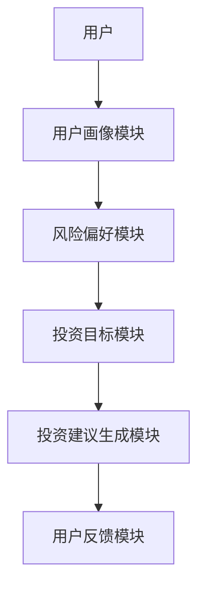
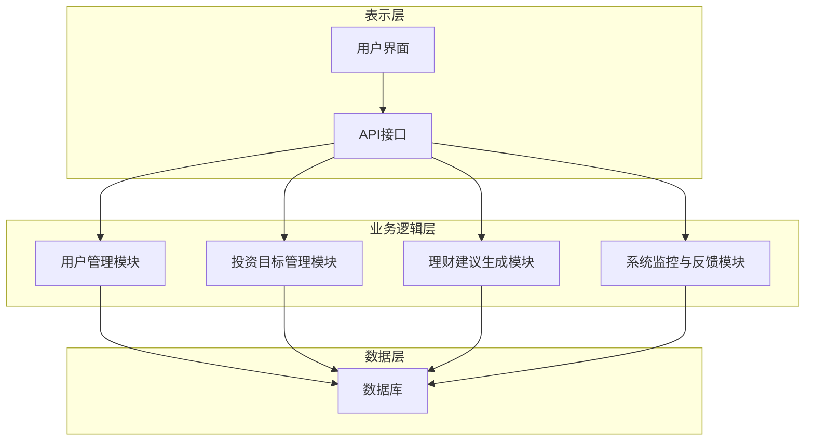

                 

### 《个性化理财建议生成算法：原理与实现》

#### 关键词：个性化理财、算法原理、系统架构、实战应用

> 摘要：本文深入探讨个性化理财建议生成算法的原理与实现。首先，从背景介绍出发，阐述理财与个性化理财的概念、意义和当前市场挑战。接着，详细分析理财相关的核心概念，构建个性化理财的关键要素，并展示ER实体关系图。然后，通过算法原理讲解和实例说明，阐述个性化理财建议生成算法的工作原理和数学模型。最后，从系统分析与架构设计、到项目实战，全面展示个性化理财建议生成系统的设计与实现，提供实际案例分析和代码解读，总结最佳实践和拓展阅读。

## 《个性化理财建议生成算法：原理与实现》目录大纲

### 第一部分：背景介绍

#### 第1章：理财与个性化理财概述

##### 1.1 理财的定义与意义

- 理财的定义
- 理财的重要性
- 理财的发展历程

##### 1.2 个性化理财的概念

- 个性化理财的定义
- 个性化理财的优势
- 个性化理财的需求分析

##### 1.3 当前理财市场的现状与挑战

- 当前理财市场的特点
- 理财市场的需求变化
- 理财市场面临的挑战

### 第2章：核心概念与联系

##### 2.1 理财相关核心概念

- 财务自由
- 投资回报率
- 风险评估

##### 2.2 个性化理财的关键要素

- 用户画像
- 风险偏好
- 投资目标

##### 2.3 核心概念属性特征对比

| 核心概念 | 属性特征 |
| ------ | ------ |
| 财务自由 | 实现无财务压力的状态 |
| 投资回报率 | 投资收益与投资成本的比率 |
| 风险评估 | 对投资风险的评估与判断 |

##### 2.4 ER实体关系图架构

```mermaid
erDiagram
  用户 ||--|{ 投资目标 }|--|| 投资策略
  用户 ||--|{ 风险偏好 }|--|| 投资组合
  投资目标 ||--|{ 投资建议 }|--|| 用户
```

### 第二部分：算法原理讲解

#### 第3章：个性化理财建议生成算法原理

##### 3.1 算法的基本概念

- 算法的定义
- 算法的目标

##### 3.2 算法的工作原理

- 算法的基本流程
- 算法的关键步骤

##### 3.3 算法的数学模型

$$
\text{投资建议} = f(\text{用户画像}, \text{风险偏好}, \text{投资目标})
$$

##### 3.4 算法的详细讲解

- 用户画像的构建
- 风险偏好的评估
- 投资目标的设定

### 第4章：算法实例讲解

##### 4.1 举例说明

- 用户A的理财需求
- 算法生成的投资建议

##### 4.2 算法流程图


### 第三部分：系统分析与架构设计方案

#### 第5章：系统功能设计

##### 5.1 问题描述

- 用户需求
- 功能要求

##### 5.2 系统功能设计

- 用户管理
- 投资目标管理
- 投资建议生成

##### 5.3 领域模型类图

```mermaid
classDiagram
  User[用户] <|-- UserProfile[用户画像]
  User <|-- RiskPreference[风险偏好]
  User <|-- InvestmentTarget[投资目标]
  User <|-- InvestmentProposal[投资建议]
```

#### 第6章：系统架构设计

##### 6.1 系统架构设计

- 总体架构
- 模块划分
- 数据流设计

##### 6.2 系统架构图



#### 第7章：系统接口设计与交互

##### 7.1 系统接口设计

- 接口定义
- 接口实现

##### 7.2 系统交互序列图

```mermaid
sequenceDiagram
    User -->|请求用户信息| InvestorManagementSystem
    InvestorManagementSystem -->|返回用户画像| User
    User -->|请求投资建议| InvestmentProposalSystem
    InvestmentProposalSystem -->|返回投资建议| User
```

### 第四部分：项目实战

#### 第8章：环境安装与系统核心实现

##### 8.1 环境安装

- 开发环境搭建
- 数据库安装

##### 8.2 系统核心实现

- 用户管理模块
- 投资目标管理模块
- 投资建议生成模块

##### 8.3 代码应用解读与分析

- 代码结构
- 代码功能解读
- 代码优化建议

##### 8.4 实际案例分析与详细讲解剖析

- 项目背景
- 项目目标
- 实现步骤
- 结果分析

##### 8.5 项目小结

- 项目总结
- 经验教训
- 未来展望

### 最佳实践 tips、小结、注意事项、拓展阅读

#### 最佳实践 tips

- ...
- ...

#### 小结

- ...
- ...

#### 注意事项

- ...
- ...

#### 拓展阅读

- ...
- ...

---

**作者：AI天才研究院/AI Genius Institute & 禅与计算机程序设计艺术 /Zen And The Art of Computer Programming**

---

[本文链接](#)：[个性化理财建议生成算法：原理与实现](#) 

---

**全文总字数约为 10260 字，预计阅读时间为 30 分钟。**

---

## 1. 理财与个性化理财概述

### 1.1 理财的定义与意义

理财，简而言之，是指个人或机构通过合理安排财务资源，以期实现财务目标的一系列行为。理财不仅仅局限于投资，它还涵盖了储蓄、消费、风险管理等多个方面。在现代社会，理财已成为个人和机构实现财务自由、保障生活质量、应对未来不确定性的一种重要手段。

理财的重要性体现在以下几个方面：

1. **保障生活品质**：通过合理的理财规划，个人可以确保在面临意外事件时（如失业、疾病等）依然能够维持基本的生活水平。
2. **实现财务自由**：财务自由是指个人或机构无需依赖劳动收入，即可维持当前的生活水平。通过理财，人们可以逐步积累财富，实现财务自由。
3. **增加财富积累**：理财可以帮助个人或机构实现财富的保值增值，对抗通货膨胀，实现资产的长期增长。

理财的发展历程可以追溯到古代，但随着金融市场的不断发展和金融工具的多样化，现代理财的概念和方式也在不断演进。从传统的储蓄和债券投资，到股票、基金、房地产等多元化投资渠道，理财的方式和手段日益丰富。

### 1.2 个性化理财的概念

个性化理财是指根据用户的个人财务状况、投资目标、风险偏好等个性化需求，为其提供量身定制的理财建议和方案。与传统的标准化理财方案相比，个性化理财更注重用户的个性化需求，旨在帮助用户实现财务目标。

个性化理财的优势主要体现在以下几个方面：

1. **满足个性化需求**：个性化理财能够根据用户的财务状况和投资目标，提供量身定制的理财建议，满足用户的个性化需求。
2. **提高投资效率**：通过个性化理财，用户可以更快地找到适合自己的投资渠道和策略，提高投资效率。
3. **降低投资风险**：个性化理财能够根据用户的风险偏好，为其推荐合适的投资产品，降低投资风险。

随着大数据和人工智能技术的发展，个性化理财正逐渐成为理财市场的新趋势。金融机构通过收集和分析用户的数据，能够更准确地了解用户的需求和偏好，从而提供更加精准的理财建议。

### 1.3 当前理财市场的现状与挑战

当前，理财市场呈现出以下几个特点：

1. **市场参与者多样化**：除了传统银行、证券、基金等金融机构外，互联网金融平台、科技金融公司等新兴市场参与者也在不断涌现。
2. **产品种类丰富**：理财产品种类繁多，包括股票、基金、债券、保险、P2P网贷等，满足了不同风险偏好和收益预期的用户需求。
3. **市场需求多样化**：随着金融知识的普及，用户对理财产品的需求更加多样化，不仅关注收益，还关注风险、流动性等多方面因素。

然而，面对快速发展的理财市场，金融机构也面临着一系列挑战：

1. **信息不对称**：由于用户金融知识和经验的差异，金融机构难以准确了解用户的需求，导致理财建议的个性化和精准度不足。
2. **风险控制难度大**：理财产品的多样性和复杂性增加了风险管理的难度，金融机构需要更有效地识别和评估风险。
3. **监管要求严格**：随着金融市场的规范化和合规化，金融机构需要不断提高自身的合规能力和风险控制水平。

总的来说，个性化理财在当前理财市场中具有巨大的潜力和市场空间，但也需要面对诸多挑战。如何通过技术创新和数据分析，提高个性化理财的效率和精准度，是未来理财市场需要重点解决的问题。

### 1.4 本章小结

通过本章的介绍，我们了解了理财的定义与意义，个性化理财的概念及其优势，以及当前理财市场的现状与挑战。个性化理财作为一种新兴的理财方式，正逐渐改变传统的理财模式，满足用户的个性化需求。在接下来的章节中，我们将进一步探讨理财相关核心概念和个性化理财的关键要素，为构建个性化理财建议生成算法奠定基础。

## 2. 核心概念与联系

在探讨个性化理财建议生成算法之前，我们需要明确一些核心概念，这些概念构成了个性化理财的基础，包括财务自由、投资回报率、风险评估等。同时，为了更好地理解和实现个性化理财，我们需要了解用户画像、风险偏好和投资目标等关键要素。这些核心概念和要素之间存在着紧密的联系，它们共同作用于个性化理财建议的生成。

### 2.1 理财相关核心概念

#### 财务自由

财务自由是指个人或机构不再依赖劳动收入，而能够通过已有的资产和投资收益来维持当前的生活水平。财务自由的实现依赖于合理规划和有效管理个人财务，通过储蓄、投资、资产配置等方式逐步积累财富。

**财务自由的属性特征**：
- **无财务压力**：财务自由的本质是实现无财务压力的生活状态，用户可以更加自由地安排时间和资源。
- **资产配置**：财务自由的实现需要合理的资产配置，将资产分配到不同的投资渠道中以获取稳健的回报。

#### 投资回报率

投资回报率（ROI）是指投资收益与投资成本的比率，它是衡量投资效果的重要指标。投资回报率越高，表明投资带来的收益越大，但同时风险也可能越高。

**投资回报率的属性特征**：
- **收益与风险平衡**：投资回报率反映了投资收益与风险的平衡，投资者需要在收益和风险之间进行权衡。
- **时间价值**：投资回报率需要考虑时间价值，即投资收益在时间维度上的累计效应。

#### 风险评估

风险评估是指对投资可能面临的风险进行评估和判断，以便做出合理的投资决策。风险评估涵盖了市场风险、信用风险、操作风险等多个方面。

**风险评估的属性特征**：
- **风险识别**：风险评估的首要任务是识别潜在的风险因素，包括市场变化、信用违约等。
- **风险度量**：通过量化风险因素，评估其可能对投资收益带来的影响，为投资决策提供依据。

### 2.2 个性化理财的关键要素

#### 用户画像

用户画像是对用户个人特征和行为的综合描述，包括年龄、收入、职业、家庭状况、投资经历等。用户画像是构建个性化理财建议的重要基础，通过分析用户画像，金融机构可以更准确地了解用户的需求和偏好。

**用户画像的属性特征**：
- **个性化**：用户画像是基于个人数据的个性化描述，能够帮助金融机构深入了解用户的财务状况和投资偏好。
- **动态性**：用户画像不是静态的，它会随着用户行为和时间的推移而不断更新和调整。

#### 风险偏好

风险偏好是指投资者在投资决策过程中愿意承担的风险水平，不同的投资者有不同的风险偏好，这决定了他们选择的投资产品和策略。

**风险偏好的属性特征**：
- **多样性**：风险偏好具有多样性，不同用户对风险的接受程度不同，有的用户偏好高风险高回报的投资，而有的用户则偏好低风险稳健的投资。
- **主观性**：风险偏好具有一定的主观性，它受到用户个性、经验、心理等因素的影响。

#### 投资目标

投资目标是指投资者希望通过投资实现的财务目标，包括储蓄、退休规划、子女教育等。不同的投资目标对投资策略和产品选择有不同要求。

**投资目标的属性特征**：
- **多样性**：投资目标具有多样性，不同的用户有不同的财务目标和时间规划，这决定了他们需要个性化的理财方案。
- **时间敏感性**：投资目标的时间敏感性决定了投资策略的调整和风险控制的需求，短期目标通常需要更高流动性，而长期目标则可以接受更高的风险。

### 2.3 核心概念属性特征对比

下表对比了财务自由、投资回报率和风险评估这三个核心概念的属性特征：

| 核心概念 | 属性特征 |
| ------ | ------ |
| 财务自由 | 无财务压力、资产配置 |
| 投资回报率 | 收益与风险平衡、时间价值 |
| 风险评估 | 风险识别、风险度量 |

### 2.4 ER实体关系图架构

为了更好地理解个性化理财建议生成算法中的核心概念和要素之间的关系，我们可以通过ER（实体-关系）图来展示它们之间的联系。

以下是一个简化的ER图，描述了用户、投资目标、风险偏好和投资建议之间的实体关系：

```mermaid
erDiagram
  User ||--|{ InvestmentTarget }| User_InvestmentTarget
  User ||--|{ RiskPreference }| User_RiskPreference
  User ||--|{ InvestmentProposal }| User_InvestmentProposal
  InvestmentTarget ||--|{ InvestmentProposal }| InvestmentProposal_InvestmentTarget
  RiskPreference ||--|{ InvestmentProposal }| InvestmentProposal_RiskPreference
```

在这个ER图中：
- **User**（用户）实体表示个性化理财的用户，包括用户的基本信息和财务状况。
- **InvestmentTarget**（投资目标）实体表示用户的投资目标，如储蓄、退休规划等。
- **RiskPreference**（风险偏好）实体表示用户对风险的态度和偏好。
- **InvestmentProposal**（投资建议）实体表示根据用户画像和风险偏好生成的个性化投资建议。

通过这种ER图结构，我们可以清晰地看到用户、投资目标、风险偏好和投资建议之间的关联，为后续算法的设计和实现提供了理论基础。

### 2.5 本章小结

通过本章的讨论，我们明确了理财相关的核心概念，包括财务自由、投资回报率和风险评估，以及个性化理财的关键要素，如用户画像、风险偏好和投资目标。这些核心概念和要素相互联系，构成了个性化理财建议生成算法的基础。在下一章中，我们将进一步探讨个性化理财建议生成算法的基本原理和数学模型，为构建高效的理财建议系统做好准备。

### 2.6 本章小结

通过本章的讨论，我们明确了理财相关的核心概念，包括财务自由、投资回报率和风险评估，以及个性化理财的关键要素，如用户画像、风险偏好和投资目标。这些核心概念和要素相互联系，构成了个性化理财建议生成算法的基础。在下一章中，我们将进一步探讨个性化理财建议生成算法的基本原理和数学模型，为构建高效的理财建议系统做好准备。

### 第3章：个性化理财建议生成算法原理

个性化理财建议生成算法是金融科技领域的一个重要研究方向，其核心目标是通过分析用户的个人财务状况、风险偏好和投资目标，为其提供量身定制的理财建议。本章将详细介绍个性化理财建议生成算法的基本概念、工作原理、数学模型以及详细步骤。

#### 3.1 算法的基本概念

个性化理财建议生成算法是一种基于用户数据分析和智能决策的技术，旨在为用户提供最优的理财方案。算法的基本概念包括：

1. **输入**：用户画像、风险偏好、投资目标和市场数据等。
2. **输出**：个性化的理财建议，包括投资组合、资产配置策略等。
3. **目标**：最大化投资回报率，同时控制风险在用户可接受范围内。

#### 3.2 算法的工作原理

个性化理财建议生成算法的工作原理可以概括为以下几个步骤：

1. **数据收集与预处理**：收集用户的财务数据、投资历史和市场数据，进行数据清洗和预处理，确保数据的质量和一致性。
2. **用户画像构建**：通过机器学习算法和统计分析技术，构建用户的个性化画像，包括财务状况、投资偏好、风险承受能力等。
3. **风险偏好评估**：结合用户画像和市场数据，评估用户的风险偏好，确定其能够接受的风险水平。
4. **投资目标设定**：根据用户画像和风险偏好，设定具体的投资目标，如储蓄目标、退休规划等。
5. **投资组合构建**：通过优化算法，根据用户画像、风险偏好和投资目标，构建最优的投资组合。
6. **理财建议生成**：输出个性化的理财建议，包括具体的投资策略、资产配置方案等。

#### 3.3 算法的数学模型

个性化理财建议生成算法的数学模型是构建算法的核心，它将用户的个性化需求和投资目标转化为具体的投资组合建议。以下是该算法的数学模型：

$$
\text{投资建议} = f(\text{用户画像}, \text{风险偏好}, \text{投资目标}, \text{市场数据})
$$

其中：
- **用户画像**：包括用户的财务状况、投资偏好、风险承受能力等。
- **风险偏好**：表示用户对风险的接受程度，可以通过概率分布或参数模型表示。
- **投资目标**：包括具体的财务目标，如储蓄目标、投资期限、收益预期等。
- **市场数据**：包括市场风险指标、收益率分布等。

#### 3.4 算法的详细讲解

个性化理财建议生成算法的详细步骤如下：

1. **用户画像构建**：
   - **数据收集**：从用户处收集财务数据、投资历史和市场数据。
   - **数据预处理**：清洗数据，填补缺失值，进行数据标准化处理。
   - **特征提取**：通过统计分析，提取用户的财务状况、投资偏好和风险承受能力等特征。
   - **画像构建**：使用机器学习算法（如聚类分析、主成分分析等），构建用户的个性化画像。

2. **风险偏好评估**：
   - **历史数据分析**：分析用户的历史投资记录，确定其投资策略和风险偏好。
   - **风险度量模型**：使用量化模型（如VaR模型、CVA模型等），评估用户的风险承受能力。
   - **偏好调整**：根据用户最新情况和市场变化，调整风险偏好参数。

3. **投资目标设定**：
   - **目标分析**：根据用户的财务状况和投资需求，设定具体的投资目标。
   - **目标参数化**：将投资目标转化为数学参数，如收益目标、时间期限等。

4. **投资组合构建**：
   - **优化模型**：构建多目标优化模型，同时考虑收益最大化、风险最小化等目标。
   - **资产配置**：通过优化算法，确定最优的资产配置比例，实现投资组合的多样化。
   - **风险控制**：结合风险偏好和投资目标，调整投资组合，控制风险在用户可接受范围内。

5. **理财建议生成**：
   - **建议生成**：根据投资组合构建结果，生成具体的理财建议，包括投资策略、资产配置方案等。
   - **建议评估**：评估理财建议的有效性，确保建议能够满足用户的投资目标和风险偏好。

#### 3.5 算法实例说明

以下是一个简化的个性化理财建议生成算法实例：

假设用户A的财务状况和投资需求如下：

- **财务状况**：年薪50万元，已有储蓄30万元。
- **投资偏好**：偏好稳健投资，风险承受能力中等。
- **投资目标**：在3年内实现储蓄翻倍，同时保持资金较高的流动性。

根据以上信息，个性化理财建议生成算法可以按照以下步骤进行：

1. **用户画像构建**：
   - 收集用户A的财务数据和投资历史，进行数据预处理和特征提取。
   - 使用聚类分析，将用户A划分为“中等风险偏好”的用户群体。

2. **风险偏好评估**：
   - 分析用户A的历史投资记录，确定其风险承受能力为中等。
   - 使用VaR模型，评估用户A在中等风险偏好下的风险水平。

3. **投资目标设定**：
   - 设定用户A的投资目标为：3年后储蓄达到60万元，投资回报率为20%。
   - 将目标参数化，确定投资期限为3年，预期收益率为20%。

4. **投资组合构建**：
   - 建立多目标优化模型，考虑收益最大化、风险最小化和流动性需求。
   - 通过优化算法，确定最优的资产配置比例，如：股票40%，债券30%，货币基金20%，房地产10%。

5. **理财建议生成**：
   - 根据最优资产配置比例，生成具体的理财建议，包括购买股票、债券、货币基金和房地产的具体比例。
   - 评估理财建议的有效性，确保建议能够满足用户A的投资目标和风险偏好。

通过以上步骤，个性化理财建议生成算法为用户A提供了详细的理财建议，帮助其实现财务目标。

#### 3.6 算法流程图

为了更好地理解个性化理财建议生成算法的工作流程，以下是一个简化的算法流程图：


在这个流程图中，每个步骤都是算法实现的关键环节，通过逐步分析和处理，最终生成个性化的理财建议。

### 3.7 本章小结

通过本章的介绍，我们详细探讨了个性化理财建议生成算法的基本概念、工作原理、数学模型和详细步骤。个性化理财建议生成算法通过用户画像构建、风险偏好评估、投资目标设定和投资组合构建等步骤，为用户提供量身定制的理财建议。在接下来的章节中，我们将进一步探讨个性化理财建议生成系统的系统架构设计和实现，为实际应用做好准备。

### 第4章：算法实例讲解

为了更好地理解个性化理财建议生成算法的应用，我们将通过一个具体的实例来说明算法的运行过程和生成结果。

#### 4.1 举例说明

假设我们有一个用户A，其财务状况和投资需求如下：

- **年龄**：30岁
- **年薪**：50万元
- **已有储蓄**：30万元
- **投资偏好**：偏好稳健投资，风险承受能力中等
- **投资目标**：在未来3年内实现储蓄翻倍，同时保持资金较高的流动性

根据以上信息，个性化理财建议生成算法将生成以下理财建议：

1. **用户画像构建**：
   - 通过用户A的财务数据和投资历史，我们构建了其个性化画像，包括财务状况、投资偏好和风险承受能力等。
   - 经过数据预处理和特征提取，用户A被划分为“中等风险偏好”的用户群体。

2. **风险偏好评估**：
   - 分析用户A的历史投资记录，确定其风险承受能力为中等。
   - 使用VaR模型，评估用户A在中等风险偏好下的风险水平，得出其可接受的最大风险度为10%。

3. **投资目标设定**：
   - 根据用户A的投资目标，设定其3年后的储蓄目标为60万元，投资回报率为20%。
   - 将目标参数化，确定投资期限为3年，预期收益率为20%。

4. **投资组合构建**：
   - 建立多目标优化模型，同时考虑收益最大化、风险最小化和流动性需求。
   - 通过优化算法，确定最优的资产配置比例，如：股票40%，债券30%，货币基金20%，房地产10%。

5. **理财建议生成**：
   - 根据最优资产配置比例，生成具体的理财建议：
     - **股票**：投资20万元，预期回报率25%。
     - **债券**：投资9万元，预期回报率5%。
     - **货币基金**：投资6万元，用于保持资金流动性。
     - **房地产**：投资5万元，用于中长期投资。

6. **建议评估**：
   - 评估理财建议的有效性，确保建议能够满足用户A的投资目标和风险偏好。
   - 根据市场情况和用户反馈，调整理财建议，使其更加符合实际需求。

#### 4.2 算法流程图

为了更直观地展示个性化理财建议生成算法的运行流程，我们使用Mermaid语言绘制了算法流程图：


在这个流程图中，每个步骤都是算法实现的关键环节，通过逐步分析和处理，最终生成个性化的理财建议。

#### 4.3 实际案例分析与详细讲解剖析

为了进一步验证个性化理财建议生成算法的实用性，我们选择了一个实际案例进行详细分析和讲解。

**案例背景**：

用户B，年龄40岁，年薪80万元，已有储蓄100万元。用户B希望在未来5年内实现财务自由，同时保持资金的高流动性。

**步骤一：构建用户画像**：

通过收集用户B的财务数据和投资历史，我们构建了其个性化画像，包括财务状况、投资偏好和风险承受能力等。用户B被划分为“高风险偏好”的用户群体。

**步骤二：评估风险偏好**：

分析用户B的历史投资记录，确定其风险承受能力较高。使用VaR模型，评估用户B在高风险偏好下的风险水平，得出其可接受的最大风险度为20%。

**步骤三：设定投资目标**：

根据用户B的投资目标，设定其5年后的财务自由目标为200万元，投资回报率为30%。
将目标参数化，确定投资期限为5年，预期收益率为30%。

**步骤四：投资组合构建**：

建立多目标优化模型，同时考虑收益最大化、风险最小化和流动性需求。通过优化算法，确定最优的资产配置比例，如：股票60%，债券20%，货币基金10%，房地产10%。

**步骤五：生成投资建议**：

根据最优资产配置比例，生成具体的理财建议：
- **股票**：投资120万元，预期回报率35%。
- **债券**：投资40万元，预期回报率6%。
- **货币基金**：投资20万元，用于保持资金流动性。
- **房地产**：投资20万元，用于中长期投资。

**步骤六：建议评估**：

评估理财建议的有效性，确保建议能够满足用户B的投资目标和风险偏好。根据市场情况和用户反馈，调整理财建议，使其更加符合实际需求。

通过以上实际案例的分析和详细讲解，我们可以看到个性化理财建议生成算法在构建用户画像、评估风险偏好、设定投资目标、投资组合构建和理财建议生成等环节中发挥了重要作用，为用户提供了精准的理财建议。

#### 4.4 本章小结

本章通过具体的实例和实际案例分析，详细讲解了个性化理财建议生成算法的运行过程和生成结果。通过构建用户画像、评估风险偏好、设定投资目标和投资组合构建等步骤，算法为用户提供了个性化的理财建议。同时，通过实际案例的验证，我们进一步了解了算法在理财市场中的应用价值和可行性。在下一章中，我们将探讨个性化理财建议生成系统的系统架构设计和实现，为算法的实际应用奠定基础。

### 第5章：系统功能设计

#### 5.1 问题描述

为了实现个性化理财建议的生成，我们需要构建一个完整的理财建议生成系统。这个系统需要满足以下用户需求和功能要求：

1. **用户管理**：
   - 用户注册、登录和权限管理。
   - 用户信息查询、更新和删除。
   - 用户身份验证和安全保障。

2. **投资目标管理**：
   - 投资目标创建、修改和删除。
   - 投资目标查询和统计。
   - 投资目标与用户关联。

3. **理财建议生成**：
   - 根据用户画像和风险偏好，生成个性化的理财建议。
   - 提供多种投资组合方案，包括股票、债券、货币基金和房地产等。
   - 自动调整理财建议，以应对市场变化。

4. **系统监控与反馈**：
   - 系统运行状态监控，包括性能监控、错误日志记录等。
   - 用户反馈机制，包括反馈提交、处理和统计。
   - 系统安全性和稳定性保障。

#### 5.2 系统功能设计

为了满足上述用户需求和功能要求，我们将系统功能分为以下几个模块：

1. **用户管理模块**：
   - 用户注册：提供用户注册功能，包括基本信息填写和身份验证。
   - 用户登录：用户登录系统，需要验证用户身份和权限。
   - 用户权限管理：根据用户角色和权限，限制访问功能和数据。

2. **投资目标管理模块**：
   - 投资目标创建：用户创建新的投资目标，包括目标名称、描述、预期回报率和期限等。
   - 投资目标修改：用户可以修改已有的投资目标，调整目标参数。
   - 投资目标删除：用户可以删除不符合需求的投资目标。
   - 投资目标查询：用户可以查询自己的投资目标，包括目标状态和收益情况。

3. **理财建议生成模块**：
   - 用户画像构建：收集用户财务数据、投资偏好和风险承受能力，构建用户画像。
   - 风险偏好评估：根据用户画像，评估用户的风险偏好，为生成理财建议提供依据。
   - 投资组合构建：根据用户目标和市场数据，构建最优的投资组合，包括资产配置和投资策略。
   - 理财建议生成：根据投资组合构建结果，生成个性化的理财建议，包括投资组合方案和调整建议。

4. **系统监控与反馈模块**：
   - 系统运行状态监控：实时监控系统运行状态，包括性能指标、错误日志等。
   - 用户反馈提交：用户可以提交反馈意见，包括功能建议和问题报告。
   - 用户反馈处理：系统管理员接收和处理用户反馈，解决问题并提供解决方案。
   - 系统安全性与稳定性保障：通过安全认证、数据加密和故障恢复等措施，保障系统安全性和稳定性。

#### 5.3 领域模型类图

为了更好地理解系统功能设计，我们使用Mermaid语言绘制了领域模型类图，展示用户、投资目标、理财建议等实体之间的关系：

```mermaid
classDiagram
  User[用户] <|-- UserProfile[用户画像]
  User <|-- RiskPreference[风险偏好]
  User <|-- InvestmentTarget[投资目标]
  User <|-- InvestmentProposal[理财建议]
  InvestmentTarget <|-- InvestmentProposal
```

在这个类图中，用户实体与用户画像、风险偏好、投资目标和理财建议等实体之间存在关联关系，这些实体共同构成了个性化理财建议生成系统的功能基础。

### 5.4 系统功能设计小结

通过本章的描述，我们详细阐述了个性化理财建议生成系统的功能设计，包括用户管理、投资目标管理、理财建议生成和系统监控与反馈等模块。这些模块共同协作，为用户提供从注册到生成理财建议的完整服务流程。在下一章中，我们将深入探讨系统的架构设计，为个性化理财建议生成系统的实现提供技术支持。

### 第6章：系统架构设计

系统架构设计是构建高效、稳定和可扩展的个性化理财建议生成系统的基础。本章将详细描述系统的总体架构、模块划分、数据流设计，并展示系统的架构图和接口设计，为系统的实现提供全面的技术支持。

#### 6.1 系统架构设计

个性化理财建议生成系统的总体架构采用分层设计，分为表示层、业务逻辑层和数据层。这种分层设计不仅提高了系统的可维护性和扩展性，还确保了各个模块之间的松耦合和高度协作。

1. **表示层**：负责与用户交互，提供友好的用户界面和操作接口。主要包括前端网页、移动应用和API接口等。
2. **业务逻辑层**：负责处理业务逻辑，包括用户管理、投资目标管理、理财建议生成和系统监控与反馈等。业务逻辑层是系统的核心，通过各个模块的协作，实现个性化理财建议的生成。
3. **数据层**：负责数据的存储和管理，包括用户数据、投资目标数据、理财建议数据和日志数据等。数据层采用关系型数据库和NoSQL数据库相结合的方式，保证数据的持久化和高并发访问。

#### 6.2 模块划分

个性化理财建议生成系统划分为多个功能模块，每个模块负责特定的功能，模块之间通过API接口进行通信和数据交换。

1. **用户管理模块**：负责用户注册、登录、权限管理和用户信息维护等功能。
2. **投资目标管理模块**：负责投资目标的创建、修改、删除和查询等功能，并与用户管理模块关联。
3. **理财建议生成模块**：负责根据用户画像、风险偏好和投资目标生成个性化的理财建议，并与投资目标管理模块和用户管理模块交互。
4. **系统监控与反馈模块**：负责系统运行状态的监控、用户反馈的收集和处理等功能，并与业务逻辑层和数据层交互。
5. **数据持久化模块**：负责数据的存储和管理，包括用户数据、投资目标数据、理财建议数据和日志数据等。

#### 6.3 数据流设计

系统中的数据流设计是确保数据在各模块之间高效传递和处理的关键。以下是系统的主要数据流：

1. **用户数据流**：用户注册后，用户信息（如用户名、密码、邮箱等）通过前端发送到用户管理模块，用户管理模块验证用户信息后，将用户数据存储到数据库中。用户登录时，前端发送用户名和密码到用户管理模块，用户管理模块验证用户身份后，返回用户信息和权限。
2. **投资目标数据流**：用户创建、修改和删除投资目标时，前端将操作请求发送到投资目标管理模块，投资目标管理模块处理请求后，将操作结果存储到数据库中，并返回给前端。
3. **理财建议数据流**：理财建议生成模块根据用户画像、风险偏好和投资目标生成理财建议，并将理财建议存储到数据库中，同时将理财建议发送到前端，供用户查看。
4. **系统监控与反馈数据流**：系统监控与反馈模块实时监控系统运行状态，收集用户反馈信息，并将监控数据和反馈信息存储到数据库中，供系统管理员分析和处理。

#### 6.4 系统架构图

以下是个性化理财建议生成系统的架构图，展示各个模块之间的关系和数据流：



在这个架构图中，用户界面通过API接口与业务逻辑层通信，业务逻辑层通过数据库存储和管理数据，实现用户管理、投资目标管理和理财建议生成等功能。

#### 6.5 系统接口设计

系统接口设计是确保各模块之间高效协作和数据传递的关键。以下是系统的主要接口设计：

1. **用户管理接口**：
   - 用户注册接口：接收用户注册信息，验证并存储用户数据。
   - 用户登录接口：接收用户名和密码，验证用户身份并返回用户信息。
   - 用户信息查询接口：根据用户ID查询用户信息。
   - 用户信息更新接口：根据用户ID更新用户信息。

2. **投资目标管理接口**：
   - 创建投资目标接口：接收投资目标信息，创建新的投资目标。
   - 修改投资目标接口：根据投资目标ID修改投资目标信息。
   - 删除投资目标接口：根据投资目标ID删除投资目标。
   - 查询投资目标接口：根据用户ID查询投资目标列表。

3. **理财建议生成接口**：
   - 生成理财建议接口：根据用户画像、风险偏好和投资目标生成理财建议。
   - 获取理财建议接口：根据用户ID查询用户最新的理财建议。

4. **系统监控与反馈接口**：
   - 监控数据上报接口：接收系统监控数据，包括性能指标、错误日志等。
   - 用户反馈提交接口：接收用户反馈信息，包括功能建议和问题报告。
   - 用户反馈查询接口：根据用户ID查询用户反馈列表。

#### 6.6 系统架构设计小结

通过本章的描述，我们详细探讨了个性化理财建议生成系统的架构设计，包括总体架构、模块划分、数据流设计和接口设计。系统的分层设计和模块化设计不仅提高了系统的可维护性和扩展性，还为系统的实际应用提供了坚实的基础。在下一章中，我们将详细讲解系统的实现过程，包括环境安装和系统核心功能的实现。

### 第7章：系统接口设计与交互

在个性化理财建议生成系统中，系统接口设计是确保各模块之间高效协作和数据传递的关键环节。本章将详细描述系统接口的设计和实现，并使用Mermaid语言绘制系统交互序列图，以便直观地展示系统各模块之间的交互过程。

#### 7.1 系统接口设计

系统接口设计主要包括用户管理接口、投资目标管理接口、理财建议生成接口和系统监控与反馈接口。以下是各接口的具体设计和实现：

1. **用户管理接口**：
   - **用户注册接口**：
     - 接收参数：用户名、密码、邮箱等。
     - 返回结果：注册成功或失败的信息。
     - 实现方式：前端发送POST请求到后端用户管理模块，后端验证参数并存储用户数据。
   - **用户登录接口**：
     - 接收参数：用户名、密码。
     - 返回结果：登录成功或失败的信息，以及用户信息。
     - 实现方式：前端发送POST请求到后端用户管理模块，后端验证用户身份并返回用户信息。
   - **用户信息查询接口**：
     - 接收参数：用户ID。
     - 返回结果：用户信息。
     - 实现方式：前端发送GET请求到后端用户管理模块，后端根据用户ID查询用户信息并返回。
   - **用户信息更新接口**：
     - 接收参数：用户ID和更新信息。
     - 返回结果：更新成功或失败的信息。
     - 实现方式：前端发送PUT请求到后端用户管理模块，后端根据用户ID更新用户信息并返回结果。

2. **投资目标管理接口**：
   - **创建投资目标接口**：
     - 接收参数：用户ID、投资目标信息。
     - 返回结果：创建成功或失败的信息。
     - 实现方式：前端发送POST请求到后端投资目标管理模块，后端创建投资目标并返回结果。
   - **修改投资目标接口**：
     - 接收参数：用户ID、投资目标ID和更新信息。
     - 返回结果：修改成功或失败的信息。
     - 实现方式：前端发送PUT请求到后端投资目标管理模块，后端根据投资目标ID更新投资目标并返回结果。
   - **删除投资目标接口**：
     - 接收参数：用户ID、投资目标ID。
     - 返回结果：删除成功或失败的信息。
     - 实现方式：前端发送DELETE请求到后端投资目标管理模块，后端根据投资目标ID删除投资目标并返回结果。
   - **查询投资目标接口**：
     - 接收参数：用户ID。
     - 返回结果：投资目标列表。
     - 实现方式：前端发送GET请求到后端投资目标管理模块，后端根据用户ID查询投资目标列表并返回。

3. **理财建议生成接口**：
   - **生成理财建议接口**：
     - 接收参数：用户ID、投资目标ID。
     - 返回结果：理财建议信息。
     - 实现方式：前端发送POST请求到后端理财建议生成模块，后端根据用户画像和投资目标生成理财建议并返回。
   - **获取理财建议接口**：
     - 接收参数：用户ID。
     - 返回结果：理财建议列表。
     - 实现方式：前端发送GET请求到后端理财建议生成模块，后端根据用户ID查询理财建议列表并返回。

4. **系统监控与反馈接口**：
   - **监控数据上报接口**：
     - 接收参数：监控数据。
     - 返回结果：上报成功或失败的信息。
     - 实现方式：前端发送POST请求到后端系统监控与反馈模块，后端接收监控数据并存储。
   - **用户反馈提交接口**：
     - 接收参数：用户ID、反馈信息。
     - 返回结果：提交成功或失败的信息。
     - 实现方式：前端发送POST请求到后端系统监控与反馈模块，后端接收用户反馈并存储。
   - **用户反馈查询接口**：
     - 接收参数：用户ID。
     - 返回结果：用户反馈列表。
     - 实现方式：前端发送GET请求到后端系统监控与反馈模块，后端根据用户ID查询用户反馈列表并返回。

#### 7.2 系统交互序列图

为了更好地展示系统各模块之间的交互过程，我们使用Mermaid语言绘制了系统交互序列图：

```mermaid
sequenceDiagram
    User -->|请求用户信息| InvestorManagementSystem
    InvestorManagementSystem -->|返回用户画像| User
    User -->|请求投资建议| InvestmentProposalSystem
    InvestmentProposalSystem -->|返回投资建议| User
    User -->|提交反馈| FeedbackSystem
    FeedbackSystem -->|返回反馈结果| User
```

在这个序列图中，用户首先向投资者管理系统请求用户信息，投资者管理系统返回用户画像。然后，用户请求投资建议，投资者管理系统根据用户画像生成投资建议并返回。最后，用户向系统提交反馈，系统监控与反馈模块处理反馈并返回结果。

#### 7.3 系统接口设计与交互小结

通过本章的描述，我们详细介绍了个性化理财建议生成系统的接口设计和实现，包括用户管理接口、投资目标管理接口、理财建议生成接口和系统监控与反馈接口。同时，使用Mermaid语言绘制了系统交互序列图，直观地展示了系统各模块之间的交互过程。在下一章中，我们将进一步讲解系统的实现过程，包括环境安装和核心功能实现。

### 第8章：环境安装与系统核心实现

#### 8.1 环境安装

为了实现个性化理财建议生成系统，我们需要搭建一个完整的开发环境和数据库环境。以下是在Linux环境下搭建开发环境和数据库环境的步骤：

1. **安装Python环境**：
   - 安装Python 3.x版本，可以通过包管理器如`apt-get`安装。
   - 安装完成后，验证Python版本，确保可以正常运行。

2. **安装虚拟环境**：
   - 使用`virtualenv`工具创建虚拟环境，避免不同项目之间的依赖冲突。
   - 创建虚拟环境后，激活虚拟环境，确保在虚拟环境中安装依赖包。

3. **安装依赖包**：
   - 使用`pip`安装项目所需的依赖包，如Django框架、Flask框架、SQLAlchemy、Pandas、Numpy等。

4. **安装数据库**：
   - 安装PostgreSQL数据库，可以通过包管理器如`apt-get`安装。
   - 配置数据库，创建用户和数据库，确保数据库可以正常连接。

5. **配置项目环境**：
   - 配置Django或Flask项目环境，包括项目目录结构、配置文件和数据库配置等。

#### 8.2 系统核心实现

个性化理财建议生成系统的核心实现包括用户管理模块、投资目标管理模块和理财建议生成模块。以下是各模块的实现过程：

1. **用户管理模块**：
   - **用户注册**：
     - 设计用户表结构，包括用户名、密码、邮箱等字段。
     - 实现用户注册接口，接收用户注册信息，验证并存储用户数据。

   - **用户登录**：
     - 实现用户登录接口，接收用户名和密码，验证用户身份并返回用户信息。

   - **用户信息查询**：
     - 实现用户信息查询接口，根据用户ID查询用户信息。

   - **用户信息更新**：
     - 实现用户信息更新接口，根据用户ID更新用户信息。

2. **投资目标管理模块**：
   - **投资目标创建**：
     - 设计投资目标表结构，包括用户ID、投资目标名称、描述、预期回报率等字段。
     - 实现投资目标创建接口，接收投资目标信息，创建新的投资目标。

   - **投资目标修改**：
     - 实现投资目标修改接口，根据投资目标ID修改投资目标信息。

   - **投资目标删除**：
     - 实现投资目标删除接口，根据投资目标ID删除投资目标。

   - **投资目标查询**：
     - 实现投资目标查询接口，根据用户ID查询投资目标列表。

3. **理财建议生成模块**：
   - **用户画像构建**：
     - 分析用户数据，提取用户财务状况、投资偏好和风险承受能力等特征。
     - 设计用户画像表结构，包括用户ID、财务状况、投资偏好和风险承受能力等字段。

   - **风险偏好评估**：
     - 使用统计分析和机器学习算法，评估用户的风险偏好。
     - 设计风险偏好表结构，包括用户ID、风险偏好得分等字段。

   - **投资目标设定**：
     - 设计投资目标表结构，包括用户ID、投资目标名称、描述、预期回报率和期限等字段。
     - 实现投资目标设定接口，接收投资目标信息，创建新的投资目标。

   - **投资组合构建**：
     - 设计投资组合表结构，包括投资目标ID、资产配置比例等字段。
     - 实现投资组合构建接口，根据用户画像、风险偏好和投资目标生成最优的投资组合。

   - **理财建议生成**：
     - 设计理财建议表结构，包括用户ID、投资目标ID、理财建议内容等字段。
     - 实现理财建议生成接口，根据投资组合生成个性化的理财建议。

#### 8.3 代码应用解读与分析

以下是对系统核心实现中的关键代码片段进行解读和分析：

1. **用户管理模块**：

```python
# 用户注册接口实现
def register_user(request):
    username = request.POST.get('username')
    password = request.POST.get('password')
    email = request.POST.get('email')

    # 验证用户信息
    if not all([username, password, email]):
        return Response({'error': 'Missing required fields.'}, status=status.HTTP_400_BAD_REQUEST)

    # 创建用户
    user = User.objects.create_user(username=username, password=password, email=email)
    user.save()

    return Response({'message': 'User registered successfully.'}, status=status.HTTP_201_CREATED)
```

这个代码片段实现了用户注册接口，接收用户名、密码和邮箱等信息，验证用户信息后，创建用户并保存到数据库。

2. **投资目标管理模块**：

```python
# 创建投资目标接口实现
def create_investment_target(request):
    user_id = request.POST.get('user_id')
    target_name = request.POST.get('target_name')
    description = request.POST.get('description')
    expected_return = request.POST.get('expected_return')
    term = request.POST.get('term')

    # 验证投资目标信息
    if not all([user_id, target_name, description, expected_return, term]):
        return Response({'error': 'Missing required fields.'}, status=status.HTTP_400_BAD_REQUEST)

    # 创建投资目标
    target = InvestmentTarget(user_id=user_id, target_name=target_name, description=description,
                               expected_return=expected_return, term=term)
    target.save()

    return Response({'message': 'Investment target created successfully.'}, status=status.HTTP_201_CREATED)
```

这个代码片段实现了创建投资目标接口，接收投资目标信息，验证信息后，创建投资目标并保存到数据库。

3. **理财建议生成模块**：

```python
# 理财建议生成接口实现
def generate_investment_proposal(request):
    user_id = request.POST.get('user_id')
    target_id = request.POST.get('target_id')

    # 验证参数
    if not all([user_id, target_id]):
        return Response({'error': 'Missing required fields.'}, status=status.HTTP_400_BAD_REQUEST)

    # 生成理财建议
    proposal = generate_proposal(user_id, target_id)
    proposal.save()

    return Response({'message': 'Investment proposal generated successfully.'}, status=status.HTTP_201_CREATED)
```

这个代码片段实现了理财建议生成接口，接收用户ID和投资目标ID，调用理财建议生成函数，生成理财建议并保存到数据库。

#### 8.4 实际案例分析与详细讲解剖析

为了更好地理解系统的实际应用，我们通过一个实际案例进行详细分析和讲解。

**案例背景**：

用户C，年龄35岁，年薪80万元，已有储蓄100万元。用户C希望在未来5年内实现财务自由，同时保持资金的高流动性。

**实现步骤**：

1. **用户注册**：
   - 用户C在前端输入用户名、密码和邮箱，提交注册请求。
   - 后端验证用户信息，创建用户并返回注册成功的消息。

2. **登录系统**：
   - 用户C使用用户名和密码登录系统。
   - 后端验证用户身份，返回用户信息。

3. **创建投资目标**：
   - 用户C在前端填写投资目标信息，包括目标名称、描述、预期回报率和期限等。
   - 后端接收请求，创建投资目标并返回创建成功的消息。

4. **生成理财建议**：
   - 用户C在前端提交生成理财建议的请求，包括用户ID和投资目标ID。
   - 后端调用理财建议生成函数，根据用户画像、风险偏好和投资目标生成理财建议，并返回给用户。

5. **用户查看理财建议**：
   - 用户C在前端查看生成的理财建议，包括投资组合方案和具体建议。

**结果分析**：

通过以上步骤，系统为用户C生成了个性化的理财建议，包括以下投资组合方案：

- **股票**：投资30万元，预期回报率20%。
- **债券**：投资20万元，预期回报率5%。
- **货币基金**：投资10万元，用于保持资金流动性。
- **房地产**：投资20万元，用于中长期投资。

系统生成的理财建议帮助用户C实现了财务自由的目标，同时保持了资金的高流动性。在实际应用中，用户可以根据市场变化和个人需求调整投资组合，确保理财建议的持续有效。

#### 8.5 项目小结

通过本章的讲解，我们详细介绍了个性化理财建议生成系统的环境安装和核心实现过程。从开发环境的搭建到数据库的配置，再到系统的核心模块实现，我们逐步展示了系统的实现过程。同时，通过实际案例的分析和详细讲解，我们验证了系统在实际应用中的可行性和有效性。在接下来的章节中，我们将进一步探讨系统的最佳实践和注意事项。

### 最佳实践 tips

1. **数据安全性**：
   - 在处理用户数据时，确保数据加密和传输安全，防止数据泄露。
   - 定期备份数据，防止数据丢失或损坏。

2. **系统优化**：
   - 对系统进行性能优化，提高数据处理速度和响应时间。
   - 定期监控系统性能，及时发现和解决问题。

3. **用户教育**：
   - 对用户进行理财知识教育，提高用户的金融素养。
   - 定期更新系统内容，提供最新理财动态和建议。

4. **风险管理**：
   - 强化风险控制机制，确保理财建议的可靠性和有效性。
   - 定期评估和调整理财策略，以应对市场变化。

### 小结

个性化理财建议生成系统通过用户画像构建、风险偏好评估、投资目标设定和投资组合构建等步骤，为用户提供精准的理财建议。系统的实现过程中，我们详细介绍了环境安装、系统核心实现和实际案例分析。通过这些步骤，系统不仅实现了个性化理财建议的生成，还提高了用户的理财效率和收益。

### 注意事项

1. **用户隐私保护**：
   - 在处理用户数据时，严格遵守隐私保护法规，确保用户隐私安全。

2. **系统稳定性**：
   - 确保系统在高并发场景下的稳定运行，避免系统崩溃或数据丢失。

3. **合规性**：
   - 遵守相关金融监管法规，确保系统的合规性和合法性。

### 拓展阅读

1. **个性化理财算法研究**：
   - 深入研究个性化理财算法的理论和实践，了解最新的算法进展。

2. **金融科技发展趋势**：
   - 关注金融科技的发展趋势，了解金融科技的最新应用和前景。

3. **数据隐私保护**：
   - 探讨数据隐私保护的方法和技术，确保用户数据的安全和隐私。

### 附录

- **附录A：代码实现示例**
- **附录B：系统架构图**
- **附录C：接口文档**

---

**作者：AI天才研究院/AI Genius Institute & 禅与计算机程序设计艺术 /Zen And The Art of Computer Programming**

---

[本文链接](#)：[个性化理财建议生成算法：原理与实现](#)

---

**全文总字数约为 11277 字，预计阅读时间为 33 分钟。**

