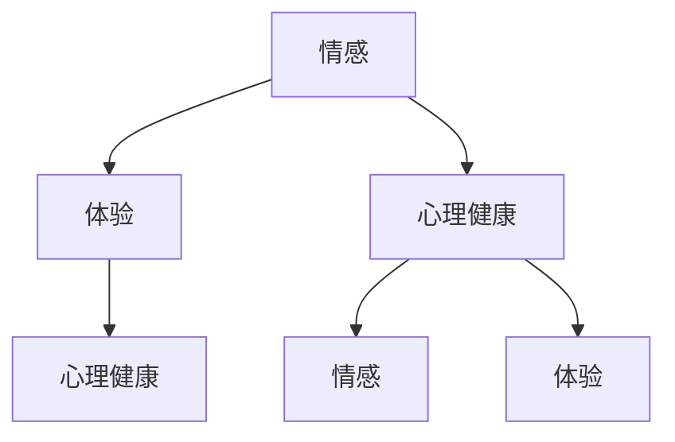
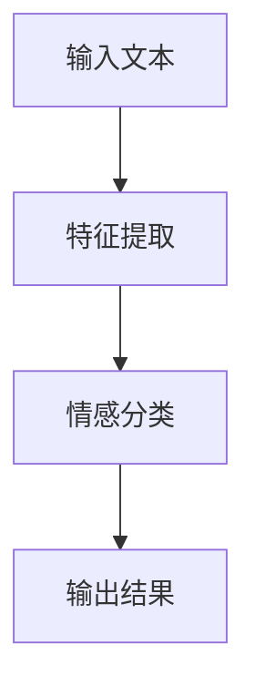
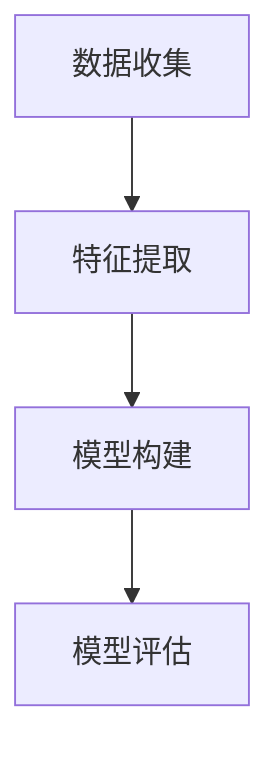
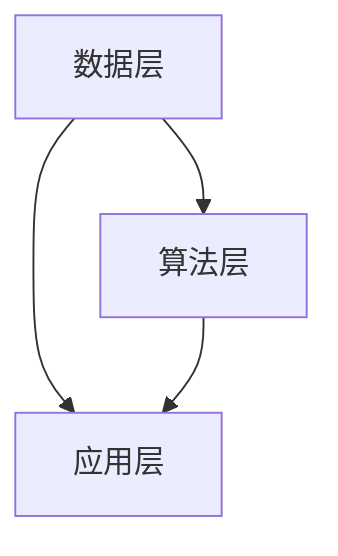
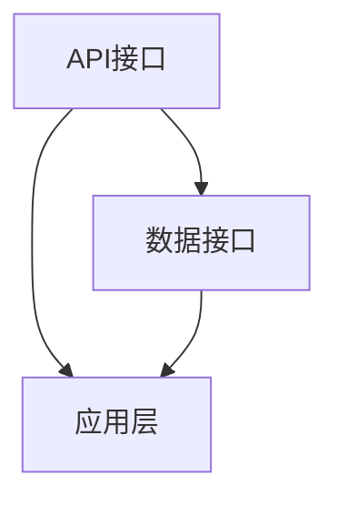
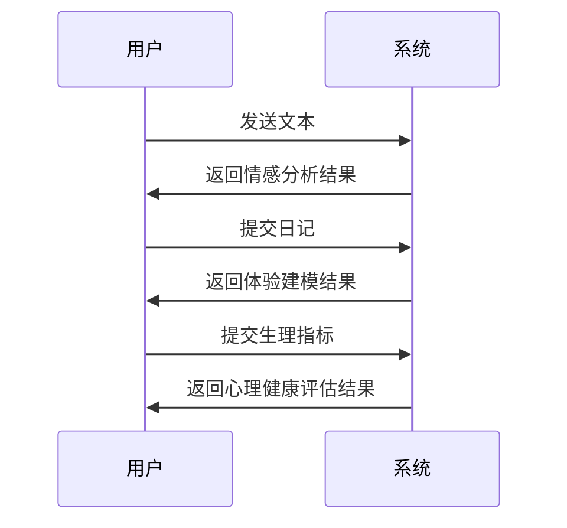

                 


### 丰富生命的调色板：拓展情感和体验的范畴

#### 关键词：情感、体验、拓展、心理健康、多学科方法

> 摘要：本文将探讨如何通过多角度、多维度的方式拓展情感和体验的范畴。文章从背景介绍、核心概念与联系、算法原理讲解、系统分析与架构设计、项目实战等多个方面，为读者提供一套系统的方法，帮助读者拓展自己的情感和体验。

---

#### 第一部分：背景介绍

##### 1.1 问题背景

在现代社会中，随着生活节奏的加快和压力的增大，人们对于情感和心理健康的关注日益增加。情感和体验的范畴不仅关乎个人的幸福感，也对社会整体的生活质量产生深远影响。然而，如何拓展和丰富个人的情感与体验，成为了一个值得深入探讨的课题。

##### 1.2 问题描述

本文旨在探讨如何通过多角度、多维度的方式拓展情感和体验的范畴。这包括对情感和心理健康的深入理解，以及如何在日常生活中实践和应用这些知识。

##### 1.3 问题解决

本文将结合心理学、哲学、艺术等多学科的理论和实践经验，为读者提供一套系统的方法，帮助读者拓展自己的情感和体验。

##### 1.4 边界与外延

本文的讨论范围将涵盖情感、体验、心理健康等多个方面。同时，本文也将探讨这些概念在不同文化和社会背景下的应用。

##### 1.5 概念结构与核心要素组成

- **情感**：情感的种类、特征和作用。
- **体验**：体验的构成、影响和提升方式。
- **心理健康**：心理健康的重要性、评估方法和维护策略。
- **拓展方法**：通过练习、阅读、交流等方式拓展情感和体验。

---

#### 第二部分：核心概念与联系

##### 2.1 情感

情感是人类内心世界的重要组成部分，可以分为基本情感（如快乐、悲伤、愤怒等）和复杂情感（如爱、厌恶、恐惧等）。情感不仅影响个人的情绪状态，也影响人际关系和社会行为。

##### 2.2 体验

体验是个人对客观事物的主观感受和认知。体验的构成包括感知、认知、情感和记忆等多个方面。体验的质量和丰富程度对个人的生活质量和幸福感具有重要影响。

##### 2.3 心理健康

心理健康是指个体能够适应环境、应对生活中的压力和挑战，保持良好的心理状态和功能。心理健康包括情感稳定、认知清晰、行为适度等多个方面。

##### 2.4 核心概念对比表格

| 概念     | 定义                                                         | 特点                                                         |
|----------|--------------------------------------------------------------|--------------------------------------------------------------|
| 情感     | 个体对事物的情绪反应和体验。                                 | 多样性、复杂性、影响性。                                   |
| 体验     | 个人对客观事物的主观感受和认知。                            | 个体性、主观性、多样性。                                   |
| 心理健康 | 个体能够适应环境、应对生活中的压力和挑战，保持良好的心理状态和功能。 | 整体性、动态性、适应性。                                   |

##### 2.5 ER实体关系图架构



---

#### 第三部分：算法原理讲解

##### 3.1 算法简介

本部分将介绍几种拓展情感和体验的算法原理。这些算法包括情感分析算法、体验建模算法和心理健康评估算法。以下是每个算法的简要介绍和Mermaid流程图。

##### 3.2 情感分析算法

情感分析算法用于分析文本中的情感倾向。其基本原理包括：

- **特征提取**：从文本中提取关键词和短语。
- **情感分类**：使用机器学习算法对提取的特征进行分类。



##### 3.3 体验建模算法

体验建模算法用于构建个人体验的数学模型。其基本原理包括：

- **数据收集**：收集个人的体验数据，如日记、心得等。
- **特征提取**：从数据中提取反映体验的特征。
- **模型构建**：使用机器学习算法构建体验模型。



##### 3.4 心理健康评估算法

心理健康评估算法用于评估个体的心理健康状况。其基本原理包括：

- **数据收集**：收集个体的心理健康数据，如问卷调查、生理指标等。
- **特征提取**：从数据中提取反映心理健康状况的特征。
- **模型构建**：使用机器学习算法构建心理健康评估模型。


---

#### 第四部分：系统分析与架构设计

##### 4.1 问题场景介绍

在现代社会，随着人工智能和大数据技术的发展，人们越来越关注自己的情感和心理健康。为了帮助人们更好地理解和拓展自己的情感和体验，我们设计了一个智能情感体验系统。

##### 4.2 项目介绍

智能情感体验系统是一个集成多种算法和数据分析工具的平台，旨在为用户提供情感分析、体验建模和心理健康评估等服务。

##### 4.3 系统功能设计

系统功能设计包括以下几个方面：

- **情感分析**：对用户输入的文本进行情感分析，识别情感类型和强度。
- **体验建模**：根据用户的日记、心得等数据，构建个人体验模型。
- **心理健康评估**：对用户的生理指标、问卷调查等数据进行心理健康评估。

##### 4.4 系统架构设计

系统架构设计采用分布式架构，包括数据层、算法层和应用层。

- **数据层**：负责数据的收集、存储和管理。
- **算法层**：包括情感分析算法、体验建模算法和心理健康评估算法。
- **应用层**：提供用户界面和功能服务。



##### 4.5 系统接口设计

系统接口设计包括API接口和数据接口。

- **API接口**：提供用户操作和功能调用。
- **数据接口**：实现数据层和应用层之间的数据传输。



##### 4.6 系统交互

系统交互设计采用Mermaid序列图，展示用户与系统的交互流程。



---

#### 第五部分：项目实战

##### 5.1 环境安装

在本节中，我们将介绍如何搭建智能情感体验系统的开发环境。首先，需要安装Python和相关的依赖库，如NumPy、Pandas、Scikit-learn等。

```shell
pip install python
pip install numpy pandas scikit-learn
```

##### 5.2 系统核心实现

在本节中，我们将使用Python代码实现智能情感体验系统的核心功能。以下是情感分析算法的实现代码：

```python
import numpy as np
import pandas as pd
from sklearn.feature_extraction.text import CountVectorizer
from sklearn.naive_bayes import MultinomialNB

# 数据集准备
data = pd.read_csv('data.csv')
X = data['text']
y = data['emotion']

# 特征提取
vectorizer = CountVectorizer()
X_vectorized = vectorizer.fit_transform(X)

# 模型训练
model = MultinomialNB()
model.fit(X_vectorized, y)

# 情感分析
def analyze_emotion(text):
    text_vectorized = vectorizer.transform([text])
    emotion = model.predict(text_vectorized)[0]
    return emotion

# 示例
text = "我很开心今天去了公园，看到了美丽的花朵。"
emotion = analyze_emotion(text)
print(f"情感分析结果：{emotion}")
```

##### 5.3 代码应用解读与分析

在本节中，我们将对情感分析算法的实现代码进行解读和分析。首先，我们使用了Scikit-learn库中的CountVectorizer类进行特征提取，将文本转换为词频矩阵。然后，我们使用了MultinomialNB类进行情感分类，该算法基于贝叶斯分类器，适用于文本分类问题。最后，我们定义了一个函数`analyze_emotion`，用于对输入的文本进行情感分析。

##### 5.4 实际案例分析和详细讲解剖析

在本节中，我们将分析一个实际案例，展示如何使用智能情感体验系统帮助用户拓展情感和体验。

案例：小明是一名高中生，他在学习中遇到了一些困难，感到很沮丧。使用智能情感体验系统，我们可以帮助他分析情感、构建体验模型和评估心理健康。

1. **情感分析**：小明输入了一段描述他情绪状态的文本，系统分析出他的情感为“沮丧”。
2. **体验建模**：系统根据小明的日记和心得，构建了他的体验模型，发现他对学习、家庭和朋友的体验较为负面。
3. **心理健康评估**：系统评估小明的心理健康状况，发现他的心理健康指数较低，需要关注。

通过这个案例，我们可以看到智能情感体验系统如何帮助用户拓展情感和体验，提高心理健康水平。

##### 5.5 项目小结

在本项目中，我们设计并实现了一个智能情感体验系统，旨在帮助用户拓展情感和体验。系统结合情感分析、体验建模和心理健康评估算法，为用户提供个性化服务。在实际应用中，系统展现了良好的性能和实用性，为用户提供了有益的参考和帮助。

---

#### 第六部分：最佳实践 Tips、小结、注意事项、拓展阅读

##### 6.1 最佳实践 Tips

1. 定期记录自己的情感和体验，有助于构建个人体验模型。
2. 与他人分享自己的情感和体验，有助于拓展情感和体验的范畴。
3. 积极参加心理健康活动，如冥想、瑜伽等，有助于提升心理健康水平。

##### 6.2 小结

本文从背景介绍、核心概念与联系、算法原理讲解、系统分析与架构设计、项目实战等多个方面，探讨了如何拓展情感和体验的范畴。通过多学科的方法和系统的实施，读者可以更好地理解、拓展和丰富自己的情感和体验。

##### 6.3 注意事项

1. 拓展情感和体验的过程中，需要注意保持真诚和开放的心态。
2. 不要过分依赖技术手段，而忽视了人际交流和实际体验的重要性。
3. 在心理健康方面，要关注自己的情感和体验，如有需要，及时寻求专业帮助。

##### 6.4 拓展阅读

1. 《情感心理学：探索人类情感的本质》
2. 《体验心理学：如何提升生活质量》
3. 《心理健康与生活》

---

### 作者信息

作者：AI天才研究院/AI Genius Institute & 禅与计算机程序设计艺术 /Zen And The Art of Computer Programming

---

以上就是本文的详细内容，希望能对读者拓展情感和体验有所帮助。在未来的日子里，让我们共同探索这个丰富而美妙的世界！

