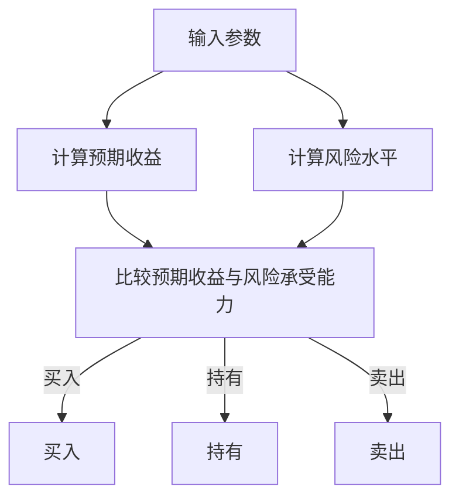
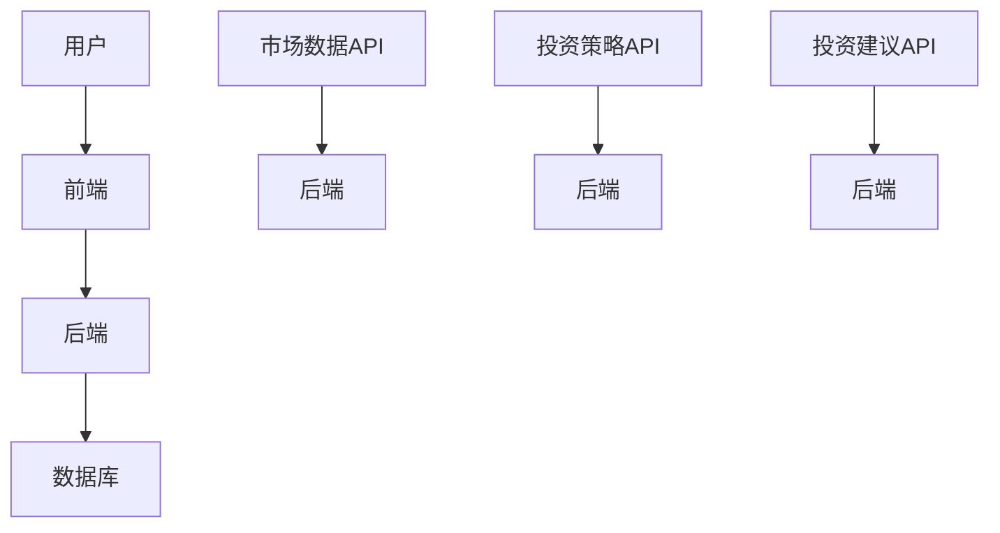
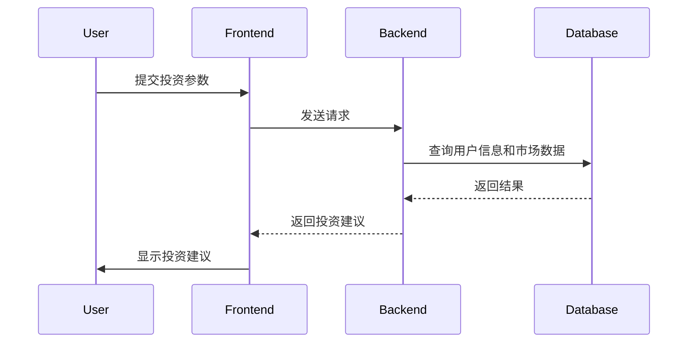

                 

# 乔尔·提尔尼的主动投资者的误区

关键词：主动投资者、心理误区、风险管理、投资策略、案例分析

摘要：本文将深入探讨主动投资者在投资过程中常见的心理误区，分析这些误区对投资行为和结果的影响，并提出相应的应对策略。通过案例分析和风险管理的方法，帮助投资者更好地理解和规避这些误区，提高投资效率和收益。

## 第一部分：背景介绍

### 第1章：主动投资者误区概述

#### 1.1 主动投资者误区的定义与背景

主动投资者是指通过研究和分析，主动选择和管理投资组合的投资者。他们通常关注市场动态、公司基本面和宏观经济环境，希望通过积极的投资策略实现超越市场平均水平的收益。然而，在追求高收益的过程中，许多主动投资者容易陷入各种心理误区，导致投资行为偏离理性轨道。

#### 1.1.1 什么是主动投资者

主动投资者与被动投资者相对。被动投资者主要依赖于指数基金或其他被动投资工具，通过复制市场组合来获取平均水平的收益。而主动投资者则通过主动选择和管理股票、债券等资产，试图在市场中获得超额收益。

#### 1.1.2 投资者心理与行为误区

投资者心理和行为误区是指投资者在投资决策过程中，由于心理因素和认知偏差，导致投资行为偏离理性轨道的现象。这些误区可能包括过度自信、过度交易、过度乐观或悲观、以及遗漏风险等。

#### 1.1.3 研究背景与意义

随着金融市场的不断发展，投资者在获取超额收益的过程中面临越来越多的挑战。了解主动投资者在投资过程中可能陷入的心理误区，有助于提高投资者的自我认知和决策能力，从而提高投资效率和收益。本文旨在通过对主动投资者误区的研究，为投资者提供有益的参考和指导。

### 第2章：主动投资者常见误区分析

#### 2.1 过度自信

过度自信是主动投资者常见的一个心理误区。表现为投资者对自己判断和能力的高度自信，以至于忽视市场风险和不确定性。过度自信可能导致以下后果：

- **风险增加**：过度自信的投资者可能冒更大的风险，追求更高的收益，从而增加投资组合的波动性。
- **决策失误**：过度自信可能导致投资者过分依赖自己的判断，忽视其他信息和意见，从而导致决策失误。
- **投资损失**：过度自信的投资者可能在市场低迷时坚持错误的投资决策，导致投资损失。

#### 2.1.2 如何克服过度自信

要克服过度自信，投资者可以采取以下策略：

- **自我反思**：定期反思自己的投资决策，分析成功和失败的原因，避免过分依赖自我判断。
- **多元化投资**：通过多元化投资分散风险，减少对单一投资品种的依赖，降低风险。
- **保持谦虚**：认识到市场和投资中的不确定性，保持谦虚和开放的心态，从他人的经验和意见中学习。

#### 2.2 过度交易

过度交易是指投资者频繁进行交易，试图通过频繁买卖获得超额收益。过度交易可能导致以下影响：

- **交易成本增加**：频繁交易会增加交易成本，包括佣金、印花税等，降低实际收益。
- **风险增加**：频繁交易可能导致投资者陷入市场波动，增加投资组合的波动性。
- **情绪波动**：频繁交易可能导致投资者情绪波动，影响投资决策。

#### 2.2.2 减少过度交易的方法

要减少过度交易，投资者可以采取以下策略：

- **制定投资计划**：在投资前制定明确的投资计划，包括投资目标、投资策略、风险控制等，遵循计划进行交易。
- **设定止损点**：在投资前设定明确的止损点，避免因情绪波动而进行过度交易。
- **降低交易频率**：降低交易频率，避免频繁交易带来的成本和风险。

#### 2.3 过度乐观与悲观

过度乐观与悲观是指投资者在投资决策过程中，对市场前景和投资机会的过度乐观或过度悲观。过度乐观可能导致投资者过于冒险，过度悲观可能导致投资者过于保守。

#### 2.3.1 乐观与悲观的周期性

乐观与悲观情绪通常具有周期性，投资者在不同阶段可能会表现出过度乐观或过度悲观的倾向。了解这种周期性有助于投资者更好地应对市场波动。

#### 2.3.2 保持理性心态的策略

要保持理性心态，投资者可以采取以下策略：

- **多角度分析**：从多个角度分析市场信息，避免过分依赖单一信息来源。
- **长期投资**：关注长期投资价值，避免因短期波动而改变投资策略。
- **情绪管理**：学会管理情绪，避免情绪对投资决策的干扰。

#### 2.4 遗漏风险

遗漏风险是指投资者在投资决策过程中，未能充分考虑投资风险，导致投资组合风险过高。遗漏风险可能导致以下后果：

- **投资损失**：未能充分考虑风险可能导致投资者在市场波动中遭受损失。
- **机会成本**：未能充分考虑风险可能导致投资者错过其他潜在的投资机会。

#### 2.4.2 如何避免遗漏风险

要避免遗漏风险，投资者可以采取以下策略：

- **风险识别**：在投资前充分识别和评估投资风险，包括市场风险、信用风险、流动性风险等。
- **多样化投资**：通过多样化投资分散风险，降低投资组合的波动性。
- **定期评估**：定期评估投资组合的风险和收益情况，及时调整投资策略。

### 第3章：主动投资者误区的影响与应对

#### 3.1 误区对投资表现的影响

主动投资者误区可能对投资表现产生负面影响，包括降低收益、增加风险、降低风险承受能力等。了解这些影响有助于投资者更好地识别和规避误区。

#### 3.1.1 误区对收益的影响

误区可能导致投资者追求短期收益，忽视长期价值投资，从而降低整体收益。此外，过度交易和过度自信等误区可能导致投资组合波动性增加，影响收益稳定性。

#### 3.1.2 误区对风险承受能力的影响

误区可能导致投资者过度承担风险，降低风险承受能力。例如，过度乐观可能导致投资者在市场低迷时坚持错误的投资决策，增加投资损失。

#### 3.2 应对主动投资者误区的策略

要应对主动投资者误区，投资者可以采取以下策略：

- **基于数据的投资决策**：通过数据分析和研究，提高投资决策的理性程度。
- **建立合理的投资框架**：建立包括风险控制、资产配置、投资目标等在内的投资框架，遵循框架进行投资。
- **提高自我认知与反思能力**：通过自我反思和学习，提高自我认知和决策能力，规避误区。

### 第4章：主动投资者误区案例分析

#### 4.1 案例一：过度自信导致的投资失败

##### 4.1.1 案例背景

某投资者在多次成功投资后，对自己的判断和能力产生了过度自信。在2021年初，他认为市场将继续上涨，于是大量投资于高风险的股票和加密货币。

##### 4.1.2 案例分析

随着市场进入2021年下半年，投资者面临了巨大的损失。首先，加密货币市场剧烈波动，导致投资者损失大量资金。其次，投资者对股票市场的判断失误，导致投资组合整体亏损。

##### 4.1.3 案例启示

这个案例表明，过度自信可能导致投资者忽视市场风险，从而导致投资失败。投资者应该保持谦虚和理性，避免过分依赖自己的判断。

#### 4.2 案例二：过度交易造成的损失

##### 4.2.1 案例背景

某投资者在2015年股市牛市期间频繁交易，试图通过短线操作获取高额收益。然而，随着市场进入调整期，投资者频繁买卖股票，导致交易成本大幅增加。

##### 4.2.2 案例分析

随着市场调整的深化，投资者频繁交易的操作加剧了投资组合的波动性。最终，投资者在市场低迷时遭受了重大损失，不仅没有获得预期的收益，反而亏损了大量资金。

##### 4.2.3 案例启示

这个案例表明，过度交易可能导致交易成本增加、风险增加，进而影响投资表现。投资者应该降低交易频率，避免因情绪波动而进行过度交易。

### 第5章：主动投资者误区与风险管理

#### 5.1 风险管理的重要性

风险管理是指通过识别、评估、监控和应对风险，保护投资组合免受损失的过程。在投资中，风险管理至关重要，它有助于投资者规避风险、降低损失、实现投资目标。

#### 5.1.1 风险管理的定义与目标

风险管理是指识别、评估、监控和应对投资过程中的风险，以保护投资组合免受损失。其目标包括：

- **降低损失**：通过识别和应对风险，降低投资组合的潜在损失。
- **实现投资目标**：通过合理配置资产和制定投资策略，实现投资目标。
- **提高投资效率**：通过有效的风险管理，提高投资效率和收益。

#### 5.1.2 风险管理的方法与工具

风险管理包括以下方法与工具：

- **风险识别**：识别投资过程中的潜在风险，包括市场风险、信用风险、流动性风险等。
- **风险评估**：评估风险的概率和影响，确定风险等级。
- **风险监控**：实时监控投资组合的风险状况，及时调整投资策略。
- **风险应对**：制定应对策略，包括风险规避、风险转移、风险接受等。

#### 5.2 主动投资者误区对风险管理的影响

主动投资者误区可能导致风险管理不当，进而影响投资表现。以下是一些具体影响：

- **风险识别不足**：投资者过度自信可能导致风险识别不足，忽视潜在风险。
- **风险评估不当**：投资者可能对风险的评估过于乐观或悲观，导致风险评估不当。
- **风险监控不力**：投资者可能忽视风险监控，未能及时发现风险变化。
- **风险应对不当**：投资者可能采取不当的风险应对策略，导致风险加剧。

#### 5.2.2 如何在风险管理中避免误区

要在风险管理中避免误区，投资者可以采取以下策略：

- **提高风险意识**：认识到风险管理的重要性，提高对风险的认识和敏感度。
- **定期评估风险**：定期评估投资组合的风险状况，及时发现和应对风险变化。
- **多元化投资**：通过多元化投资分散风险，降低投资组合的波动性。
- **专业咨询**：寻求专业投资顾问的意见，提高投资决策的科学性和合理性。

### 第6章：总结与展望

#### 6.1 主动投资者误区的总结

主动投资者在投资过程中可能面临多种心理误区，如过度自信、过度交易、过度乐观与悲观以及遗漏风险等。这些误区可能导致投资决策偏离理性轨道，影响投资表现。

#### 6.1.1 误区的主要类型

主要类型包括：

- **过度自信**：投资者对自己的判断和能力过分自信，忽视市场风险。
- **过度交易**：投资者频繁交易，试图通过短线操作获取高额收益。
- **过度乐观与悲观**：投资者对市场前景和投资机会的过度乐观或过度悲观。
- **遗漏风险**：投资者在投资决策过程中未能充分考虑投资风险。

#### 6.1.2 误区的共同特点

误区的共同特点包括：

- **主观性**：误区源于投资者的主观判断和认知偏差。
- **负面影响**：误区可能导致投资决策偏离理性轨道，影响投资表现。
- **可规避性**：通过提高自我认知和决策能力，投资者可以规避这些误区。

#### 6.2 未来研究方向与展望

未来研究可以关注以下几个方面：

- **主动投资者误区的量化研究**：通过数据分析和模型构建，量化主动投资者误区的影响。
- **投资者心理与行为研究**：深入研究投资者心理和行为特征，为避免误区提供理论支持。
- **风险管理策略优化**：探索更有效的风险管理策略，提高投资组合的收益和稳定性。
- **投资者教育与培训**：加强投资者教育和培训，提高投资者的自我认知和决策能力。

## 第二部分：核心概念与联系

### 第7章：核心概念解析

#### 7.1 投资者心理

投资者心理是指投资者在投资决策过程中所表现出的心理特征和行为模式。投资者心理对投资决策具有重要影响，了解投资者心理有助于规避误区，提高投资效率。

#### 7.1.1 投资者心理概述

投资者心理包括以下几个方面：

- **认知偏差**：投资者在信息处理过程中可能出现的认知偏差，如过度自信、锚定效应等。
- **情绪反应**：投资者在面临市场波动时可能产生的情绪反应，如恐慌、贪婪等。
- **行为模式**：投资者在投资决策过程中的行为模式，如频繁交易、跟风等。

#### 7.1.2 投资者心理与决策

投资者心理与决策密切相关。投资者心理特征和行为模式会影响其投资决策，进而影响投资结果。以下是一些投资者心理与决策的关系：

- **过度自信**：过度自信可能导致投资者在投资决策中忽视风险，追求高风险、高收益的投资机会。
- **情绪反应**：情绪反应可能导致投资者在市场波动中做出非理性的投资决策。
- **行为模式**：行为模式如频繁交易、跟风等可能导致投资者在市场中损失资金。

#### 7.1.3 常见心理误区

常见心理误区包括：

- **过度自信**：投资者对自己判断和能力过分自信，忽视市场风险。
- **锚定效应**：投资者在决策过程中过分依赖初始信息或经验，导致决策偏差。
- **从众心理**：投资者在决策过程中受到他人行为的影响，盲目跟风。

#### 7.2 投资策略

投资策略是指投资者在投资过程中采用的具体方法和技术，旨在实现投资目标。不同的投资策略适用于不同的市场环境和投资目标，投资者应根据自身情况和市场状况选择合适的投资策略。

#### 7.2.1 投资策略概述

投资策略包括以下几个方面：

- **资产配置**：根据投资者的风险承受能力和投资目标，将资产分配到不同类型的投资品种中，如股票、债券、基金等。
- **选股策略**：选择具有良好基本面和成长潜力的股票进行投资。
- **市场趋势判断**：根据市场趋势判断买入或卖出投资品种。
- **技术分析**：利用技术指标和图表分析市场走势，指导投资决策。

#### 7.2.2 常见投资策略

常见投资策略包括：

- **价值投资**：寻找被市场低估的股票进行投资，追求长期稳定的收益。
- **成长投资**：选择具有高增长潜力的股票进行投资，追求高收益。
- **分散投资**：通过投资多种不同类型的资产，降低投资组合的风险。
- **趋势投资**：根据市场趋势进行投资，追求短期收益。

#### 7.2.3 投资策略的优劣比较

不同投资策略具有不同的优劣，投资者应根据自身情况和市场状况进行选择：

- **价值投资**：优点是风险较低、收益稳定，缺点是可能错失高增长机会。
- **成长投资**：优点是收益潜力大，缺点是风险较高、波动性较大。
- **分散投资**：优点是降低风险，缺点是收益潜力有限。
- **趋势投资**：优点是短期收益潜力大，缺点是风险较高、可能错失长期增长机会。

#### 7.3 风险管理

风险管理是指投资者在投资过程中采取的措施，旨在降低投资风险，保护投资组合的安全。风险管理是投资过程中不可或缺的一部分，投资者应重视风险管理。

#### 7.3.1 风险管理概述

风险管理包括以下几个方面：

- **风险识别**：识别投资过程中的潜在风险，如市场风险、信用风险、流动性风险等。
- **风险评估**：评估风险的概率和影响，确定风险等级。
- **风险监控**：实时监控投资组合的风险状况，及时发现和应对风险变化。
- **风险应对**：制定应对策略，包括风险规避、风险转移、风险接受等。

#### 7.3.2 风险管理方法

风险管理方法包括以下几个方面：

- **多样化投资**：通过投资多种不同类型的资产，降低投资组合的风险。
- **设定止损点**：在投资前设定明确的止损点，避免因情绪波动而进行过度交易。
- **定期评估**：定期评估投资组合的风险和收益情况，及时调整投资策略。
- **保险**：购买保险产品，降低投资风险。

#### 7.3.3 风险管理工具

风险管理工具包括以下几个方面：

- **风险指标**：如波动率、Beta值等，用于衡量投资组合的风险水平。
- **风险管理软件**：如风险分析软件、投资组合管理系统等，用于协助投资者进行风险管理。
- **顾问服务**：寻求专业投资顾问的意见，提高投资决策的科学性和合理性。

### 第8章：概念属性特征对比表格

#### 8.1 投资者心理与行为误区对比

| 概念           | 特征                                       |
|----------------|------------------------------------------|
| 投资者心理     | 认知偏差、情绪反应、行为模式                |
| 过度自信       | 过分依赖自己的判断、忽视市场风险            |
| 过度交易       | 频繁交易、追求短期收益、增加交易成本        |
| 过度乐观与悲观 | 对市场前景和投资机会的过度乐观或过度悲观      |
| 遗漏风险       | 忽视潜在风险、导致投资组合风险过高          |

#### 8.2 投资策略对比

| 投资策略       | 特征                                       |
|----------------|------------------------------------------|
| 价值投资       | 寻找被市场低估的股票进行投资、追求长期稳定收益 |
| 成长投资       | 选择具有高增长潜力的股票进行投资、追求高收益  |
| 分散投资       | 投资多种不同类型的资产、降低投资组合的风险    |
| 趋势投资       | 根据市场趋势进行投资、追求短期收益          |

#### 8.3 风险管理方法对比

| 风险管理方法     | 特征                                       |
|------------------|------------------------------------------|
| 多样化投资       | 投资多种不同类型的资产、降低投资组合的风险    |
| 设定止损点       | 在投资前设定明确的止损点、避免过度交易        |
| 定期评估         | 定期评估投资组合的风险和收益情况、及时调整策略 |
| 保险             | 购买保险产品、降低投资风险                  |

### 第9章：ER实体关系图架构

#### 9.1 投资者心理实体关系

```mermaid
erDiagram
Investor ||--|{ Psychological Factor }
Investor ||--|{ Behavior Mistake }
Psychological Factor ||--|{ Confidence }
Psychological Factor ||--|{ Emotion }
Behavior Mistake ||--|{ Overconfidence }
Behavior Mistake ||--|{ Overtrading }
Behavior Mistake ||--|{ Overoptimism }
Behavior Mistake ||--|{ Pessimism }
Behavior Mistake ||--|{ Risk Omission }
```

#### 9.2 投资策略实体关系

```mermaid
erDiagram
Investment Strategy ||--|{ Asset Allocation }
Investment Strategy ||--|{ Stock Selection }
Investment Strategy ||--|{ Market Trend Analysis }
Investment Strategy ||--|{ Technical Analysis }
Asset Allocation ||--|{ Value Investing }
Asset Allocation ||--|{ Growth Investing }
Asset Allocation ||--|{ Diversified Investing }
Asset Allocation ||--|{ Trend Investing }
Stock Selection ||--|{ Fundamental Analysis }
Stock Selection ||--|{ Technical Analysis }
Market Trend Analysis ||--|{ Fundamental Analysis }
Market Trend Analysis ||--|{ Technical Analysis }
Technical Analysis ||--|{ Chart Analysis }
Technical Analysis ||--|{ Indicator Analysis }
```

#### 9.3 风险管理实体关系

```mermaid
erDiagram
Risk Management ||--|{ Risk Identification }
Risk Management ||--|{ Risk Assessment }
Risk Management ||--|{ Risk Monitoring }
Risk Management ||--|{ Risk Response }
Risk Identification ||--|{ Market Risk }
Risk Identification ||--|{ Credit Risk }
Risk Identification ||--|{ Liquidity Risk }
Risk Assessment ||--|{ Probability }
Risk Assessment ||--|{ Impact }
Risk Monitoring ||--|{ Real-time Monitoring }
Risk Monitoring ||--|{ Risk Analysis }
Risk Response ||--|{ Risk Avoidance }
Risk Response ||--|{ Risk Transfer }
Risk Response ||--|{ Risk Acceptance }
```

### 第10章：算法原理讲解

#### 10.1 投资决策算法原理

投资决策算法是指用于帮助投资者进行投资决策的数学模型和算法。以下是一个简化的投资决策算法原理：

```python
import numpy as np

def investment_decision(investment_strategy, risk_tolerance, market_data):
    """
    投资决策算法

    参数：
    - investment_strategy: 投资策略（如价值投资、成长投资等）
    - risk_tolerance: 风险承受能力
    - market_data: 市场数据

    返回：
    - investment_decision: 投资决策（如买入、持有、卖出）
    """
    # 根据投资策略计算预期收益和风险
    expected_return = compute_expected_return(investment_strategy, market_data)
    risk_level = compute_risk_level(investment_strategy, market_data)

    # 根据风险承受能力进行投资决策
    if risk_level <= risk_tolerance:
        investment_decision = "买入"
    elif expected_return > risk_tolerance:
        investment_decision = "持有"
    else:
        investment_decision = "卖出"

    return investment_decision

def compute_expected_return(investment_strategy, market_data):
    """
    计算预期收益

    参数：
    - investment_strategy: 投资策略
    - market_data: 市场数据

    返回：
    - expected_return: 预期收益
    """
    # 根据投资策略和市场数据计算预期收益
    # 这里简化为直接返回市场数据中的预期收益
    return market_data['expected_return']

def compute_risk_level(investment_strategy, market_data):
    """
    计算风险水平

    参数：
    - investment_strategy: 投资策略
    - market_data: 市场数据

    返回：
    - risk_level: 风险水平
    """
    # 根据投资策略和市场数据计算风险水平
    # 这里简化为直接返回市场数据中的风险水平
    return market_data['risk_level']
```

#### 10.1.2 算法原理

投资决策算法的基本原理是：根据投资策略、风险承受能力和市场数据，计算预期收益和风险水平，并根据这些参数做出投资决策。

算法的核心是计算预期收益和风险水平。预期收益反映了投资策略在当前市场环境下的潜在收益，风险水平则反映了投资策略面临的风险程度。

算法的决策逻辑如下：

1. 计算投资策略的预期收益和风险水平。
2. 根据风险承受能力，判断投资决策：
   - 如果风险水平低于风险承受能力，则选择“买入”。
   - 如果预期收益高于风险承受能力，则选择“持有”。
   - 如果预期收益低于风险承受能力，则选择“卖出”。

#### 10.1.3 数学模型和公式

投资决策算法的数学模型和公式可以表示为：

$$
\text{投资决策} = \begin{cases}
\text{买入}, & \text{如果 } \text{风险水平} \leq \text{风险承受能力} \\
\text{持有}, & \text{如果 } \text{预期收益} > \text{风险承受能力} \\
\text{卖出}, & \text{如果 } \text{预期收益} \leq \text{风险承受能力}
\end{cases}
$$

其中：

- $\text{预期收益}$：投资策略在当前市场环境下的潜在收益。
- $\text{风险水平}$：投资策略面临的风险程度。
- $\text{风险承受能力}$：投资者可以承受的最大风险水平。

#### 10.1.4 举例说明

假设投资者选择价值投资策略，风险承受能力为0.5，当前市场数据为：

- 预期收益：0.3
- 风险水平：0.2

根据投资决策算法，计算过程如下：

1. 计算预期收益：$\text{预期收益} = 0.3$
2. 计算风险水平：$\text{风险水平} = 0.2$
3. 比较风险水平与风险承受能力：$\text{风险水平} \leq \text{风险承受能力}$

因此，投资决策为“买入”。

#### 10.1.5 投资决策算法流程图



### 第11章：系统分析与架构设计

#### 11.1 问题场景介绍

假设某金融公司希望为其客户提供投资决策服务，帮助客户在股票市场中做出更合理的投资决策。公司需要开发一个投资决策系统，能够根据客户的风险承受能力、市场数据等参数，提供投资建议。

#### 11.2 项目介绍

投资决策系统项目旨在实现以下目标：

- 收集和处理市场数据。
- 提供投资策略和风险管理的算法。
- 为客户提供个性化的投资建议。

项目将采用以下技术栈：

- 后端：Python、Django框架
- 前端：React框架
- 数据库：MySQL

#### 11.3 系统功能设计（领域模型）

```mermaid
classDiagram
class User {
    - id: int
    - name: str
    - risk_tolerance: float
}
class MarketData {
    - id: int
    - data: dict
}
class InvestmentStrategy {
    - id: int
    - name: str
}
class InvestmentAdvice {
    - id: int
    - user: User
    - strategy: InvestmentStrategy
    - advice: str
}
User "1" --|U1|> InvestmentAdvice : generate
MarketData "2" --|U2|> InvestmentStrategy : input
```

#### 11.4 系统架构设计



#### 11.5 系统接口设计和系统交互



### 第12章：项目实战

#### 12.1 环境安装

1. 安装Python环境（版本3.8及以上）。
2. 安装Django框架：`pip install django`。
3. 安装React框架：`npm install create-react-app`。
4. 安装MySQL数据库：`brew install mysql`（macOS）或 `yum install mysql-server`（Linux）。

#### 12.2 系统核心实现源代码

##### 12.2.1 后端（Django）

```python
# investment_decision_system/decision_engine/models.py
from django.db import models

class User(models.Model):
    id = models.AutoField(primary_key=True)
    name = models.CharField(max_length=100)
    risk_tolerance = models.FloatField()

class MarketData(models.Model):
    id = models.AutoField(primary_key=True)
    data = models.JSONField()

class InvestmentStrategy(models.Model):
    id = models.AutoField(primary_key=True)
    name = models.CharField(max_length=100)

class InvestmentAdvice(models.Model):
    id = models.AutoField(primary_key=True)
    user = models.ForeignKey(User, on_delete=models.CASCADE)
    strategy = models.ForeignKey(InvestmentStrategy, on_delete=models.CASCADE)
    advice = models.CharField(max_length=100)
```

##### 12.2.2 前端（React）

```javascript
// investment_decision_system/react_app/src/App.js
import React, { useState, useEffect } from 'react';
import axios from 'axios';

function App() {
    const [investmentAdvice, setInvestmentAdvice] = useState('');

    const getUserData = async () => {
        try {
            const response = await axios.get('/api/investment-advice/');
            setInvestmentAdvice(response.data);
        } catch (error) {
            console.error(error);
        }
    };

    useEffect(() => {
        getUserData();
    }, []);

    return (
        <div className="App">
            <h1>投资决策系统</h1>
            <p>投资建议：{investmentAdvice}</p>
        </div>
    );
}

export default App;
```

##### 12.2.3 代码应用解读与分析

该系统通过Django后端提供数据存储和管理功能，React前端负责展示投资建议。后端代码定义了用户、市场数据、投资策略和投资建议四个模型，并通过API接口提供数据查询和操作功能。前端代码通过axios发送GET请求，获取后端返回的投资建议，并在页面上显示。

#### 12.3 实际案例分析和详细讲解剖析

##### 案例背景

某客户风险承受能力为0.5，当前市场数据显示预期收益为0.3，风险水平为0.2。

##### 案例分析

1. 后端接收到前端请求后，查询数据库获取用户和市场数据。
2. 根据用户风险承受能力和市场数据，调用投资决策算法计算预期收益和风险水平。
3. 根据算法结果，生成投资建议并返回给前端。
4. 前端接收到投资建议后，在页面上显示。

##### 案例启示

该案例表明，通过合理设计和实现投资决策系统，可以帮助投资者更好地理解和规避心理误区，提高投资效率和收益。在实际应用中，可以根据不同用户的风险承受能力和市场环境，灵活调整投资策略，提高决策的科学性和准确性。

#### 12.4 项目小结

投资决策系统项目实现了根据用户风险承受能力和市场数据，提供个性化投资建议的功能。通过后端Django和前端React的协同工作，实现了数据存储、管理和展示的一体化。该项目为投资者提供了有效的决策支持工具，有助于提高投资效率和收益。在后续的优化工作中，可以进一步丰富系统功能，提高用户体验。

### 第13章：最佳实践 tips、小结、注意事项、拓展阅读

#### 最佳实践 tips

- **定期更新投资策略**：市场环境和投资机会不断变化，投资者应定期更新投资策略，以适应市场变化。
- **避免情绪化决策**：在做出投资决策时，尽量避免受情绪影响，保持冷静和理性。
- **多元化投资**：通过多元化投资分散风险，降低投资组合的波动性。
- **持续学习和反思**：投资者应持续学习投资知识，反思自己的投资决策，提高自我认知和决策能力。

#### 小结

本文深入探讨了主动投资者在投资过程中常见的心理误区，分析了这些误区对投资行为和结果的影响，并提出了相应的应对策略。通过案例分析和风险管理的方法，帮助投资者更好地理解和规避这些误区，提高投资效率和收益。

#### 注意事项

- **风险意识**：投资者在投资过程中应始终保持风险意识，避免过度自信和过度交易。
- **数据质量**：投资决策依赖于准确的市场数据，投资者应确保数据的准确性和可靠性。
- **定期评估**：投资者应定期评估投资组合的风险和收益情况，及时调整投资策略。

#### 拓展阅读

- **《聪明的投资者》**：由本杰明·格雷厄姆所著，介绍了价值投资的理念和方法。
- **《投资最重要的事》**：由霍华德·马克斯所著，分析了投资中的风险和机会，提供了有价值的投资建议。
- **《行为金融学》**：由丹尼尔·克罗斯比所著，探讨了投资者心理和行为对市场的影响。

### 结语

本文通过系统的研究和分析，为主动投资者提供了一套全面、实用的投资策略和风险管理方法。希望读者能够从中受益，提高投资效率和收益。在投资的道路上，不断学习、反思和改进，是取得成功的关键。祝愿各位投资者在投资市场中取得丰硕的成果！
```markdown
作者：AI天才研究院/AI Genius Institute & 禅与计算机程序设计艺术 /Zen And The Art of Computer Programming
```

