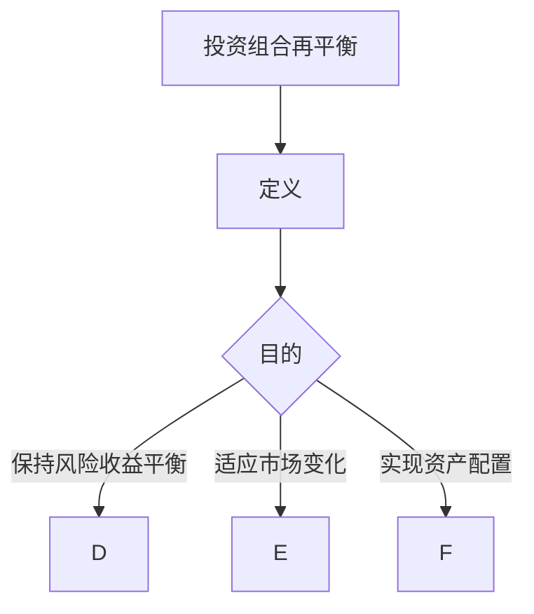

                 

### 投资组合再平衡策略概述

#### 关键词：
投资组合再平衡、策略、风险控制、资产配置

#### 摘要：
本文将探讨乔尔·提尔尼的投资组合再平衡策略，通过介绍再平衡的基本概念、理论基础、方法和技术手段，分析其实际应用和风险管理，最终总结最佳实践，为投资者提供有效的投资策略参考。

## 第一部分：投资组合再平衡的基本概念

### 第1章：投资组合再平衡的定义

#### 1.1.1 投资组合再平衡的定义

投资组合再平衡是指在投资者持有多个资产组合的情况下，通过调整各个资产在组合中的比重，使其符合投资者最初设定的投资策略和风险偏好。

#### 1.1.2 投资组合再平衡的目的

1. 保持投资组合的风险和收益平衡，避免过度集中于某个资产类别，导致投资风险增大。
2. 调整投资组合以适应市场变化，确保投资策略与投资者的预期目标一致。
3. 实现资产的合理配置，提高整体投资组合的收益。

#### 1.1.3 投资组合再平衡的必要性

1. 风险控制：投资组合再平衡可以帮助投资者降低市场波动带来的风险。
2. 投资策略调整：投资者可以根据市场环境和自身需求，及时调整投资组合，实现投资策略的优化。
3. 资产配置：再平衡有助于投资者在不同资产类别之间实现合理的资产配置，提高投资组合的收益潜力。

#### 1.1.4 投资组合再平衡的影响因素

1. 投资者风险偏好：再平衡策略需考虑投资者的风险承受能力，避免过度集中或分散投资。
2. 市场波动：市场波动会导致资产价格变动，影响投资组合的权重分布。
3. 投资目标：投资者应根据自身投资目标和预期收益，制定合适的再平衡策略。
4. 资产类别：不同资产类别的表现和风险特征对投资组合再平衡具有重要影响。

## 第2章：投资组合再平衡的理论基础

### 2.1.1 风险管理与投资组合再平衡

#### 2.1.1.1 风险管理的基本概念

风险管理是指投资者通过识别、评估、控制和监测风险，以确保投资组合的安全和收益。投资组合再平衡是风险管理的重要组成部分，有助于降低投资风险。

#### 2.1.1.2 再平衡策略与风险管理的关系

再平衡策略可以帮助投资者分散风险，避免投资过度集中于某个资产类别。同时，通过定期调整投资组合，投资者可以降低市场波动带来的风险，实现风险管理的目标。

### 2.1.2 有效市场假说与再平衡策略

#### 2.1.2.1 有效市场假说

有效市场假说认为，市场中的信息已经充分反映在资产价格中，投资者无法通过分析市场信息获取超额收益。再平衡策略在此假设下，主要目标是优化投资组合的风险收益结构，而非通过市场预测获取超额收益。

#### 2.1.2.2 再平衡策略与有效市场假说的关系

在有效市场假说下，投资者应更加关注投资组合的风险控制，而非市场预测。再平衡策略通过调整投资组合，使其更符合投资者的风险偏好和预期收益，有助于实现这一目标。

### 2.1.3 资本资产定价模型与再平衡

#### 2.1.3.1 资本资产定价模型

资本资产定价模型（CAPM）是一种用于评估资产预期收益和风险的理论框架。在CAPM框架下，投资组合再平衡的目标是使投资组合的风险和收益结构符合CAPM理论的要求。

#### 2.1.3.2 再平衡策略与CAPM的关系

再平衡策略可以根据CAPM模型计算出的资产预期收益和风险，调整投资组合，使其符合理论要求，从而提高投资组合的收益潜力。

### 2.1.4 投资组合理论对再平衡的影响

#### 2.1.4.1 投资组合理论的基本概念

投资组合理论（Modern Portfolio Theory，MPT）是一种用于优化投资组合风险和收益的理论。MPT认为，投资者可以通过资产组合降低风险，实现更高的收益。

#### 2.1.4.2 再平衡策略与投资组合理论的关系

再平衡策略旨在优化投资组合的风险和收益结构，符合MPT理论的要求。通过调整投资组合，投资者可以降低非系统风险，实现更高的收益潜力。

## 第3章：投资组合再平衡的方法

### 3.1.1 费雪方法

#### 3.1.1.1 费雪方法的原理

费雪方法是投资组合再平衡的一种常见方法，其核心思想是利用投资者的预期收益和风险偏好，调整投资组合，使其符合预期目标。

#### 3.1.1.2 费雪方法的步骤

1. 确定投资者的预期收益和风险偏好。
2. 计算各个资产的预期收益和风险。
3. 根据预期收益和风险，调整投资组合中各个资产的比重。
4. 监测市场变化，及时调整投资组合，以保持风险和收益平衡。

#### 3.1.1.3 费雪方法的应用案例

某投资者拥有股票、债券和现金三种资产，预期收益分别为10%、5%和3%，风险分别为20%、10%和5%。根据费雪方法，投资者需要调整投资组合，使其更符合预期目标。

### 3.1.2 多目标规划方法

#### 3.1.2.1 多目标规划方法的原理

多目标规划方法是投资组合再平衡的一种高级方法，其核心思想是同时考虑多个目标，通过优化投资组合，实现目标之间的平衡。

#### 3.1.2.2 多目标规划方法的步骤

1. 确定投资组合的目标，如收益、风险、流动性等。
2. 建立多目标规划模型，明确目标之间的关系和权重。
3. 通过优化算法，求解最优投资组合。
4. 监测市场变化，根据实际情况调整投资组合。

#### 3.1.2.3 多目标规划方法的应用案例

某投资者拥有股票、债券和现金三种资产，需要同时考虑收益、风险和流动性三个目标。根据多目标规划方法，投资者可以建立优化模型，求解最优投资组合。

## 第4章：投资组合再平衡的技术手段

### 4.1.1 数据分析技术

#### 4.1.1.1 数据收集与整理

投资组合再平衡需要大量的数据支持，如资产价格、市场指数、宏观经济指标等。投资者需要收集和整理这些数据，为再平衡提供基础。

#### 4.1.1.2 数据分析工具

数据分析工具如Python、R、Matlab等，可以用于数据处理和分析。投资者可以使用这些工具，对投资组合进行有效的数据分析。

#### 4.1.1.3 数据可视化

数据可视化技术可以帮助投资者更好地理解投资组合的变化。投资者可以使用图表、图形等可视化工具，展示投资组合的分布和变化。

### 4.1.2 机器学习技术

#### 4.1.2.1 机器学习的基本概念

机器学习是一种人工智能技术，通过学习和分析数据，自动识别模式和规律。在投资组合再平衡中，机器学习可以用于预测资产价格、优化投资组合等。

#### 4.1.2.2 机器学习在再平衡中的应用

1. 预测资产价格：机器学习可以用于预测股票、债券等资产的价格，为再平衡提供参考。
2. 优化投资组合：机器学习可以基于历史数据，自动优化投资组合，提高收益潜力。

#### 4.1.2.3 机器学习算法的选型与优化

投资者需要根据具体需求和数据特点，选择合适的机器学习算法。同时，通过调整算法参数，优化模型性能，提高再平衡效果。

## 第5章：投资组合再平衡的实际应用

### 5.1.1 投资组合再平衡在股票投资中的应用

#### 5.1.1.1 股票投资组合再平衡的案例分析

某投资者持有股票、债券和现金三种资产，初始投资比例为60%、30%和10%。经过一段时间后，投资比例发生变化，股票占比提高到70%，债券占比降低到20%，现金占比降低到10%。投资者需要根据市场变化和自身需求，调整投资组合，实现再平衡。

#### 5.1.1.2 股票投资组合再平衡的策略选择

投资者可以根据市场环境、风险偏好和预期收益，选择合适的再平衡策略。如费雪方法、多目标规划方法等。

### 5.1.2 投资组合再平衡在基金投资中的应用

#### 5.1.2.1 基金投资组合再平衡的案例分析

某投资者持有股票型基金、债券型基金和货币市场基金三种资产，初始投资比例为40%、30%和30%。经过一段时间后，投资比例发生变化，股票型基金占比提高到50%，债券型基金占比降低到20%，货币市场基金占比降低到30%。投资者需要根据市场变化和自身需求，调整投资组合，实现再平衡。

#### 5.1.2.2 基金投资组合再平衡的策略选择

投资者可以根据市场环境、风险偏好和预期收益，选择合适的再平衡策略。如费雪方法、多目标规划方法等。

## 第6章：投资组合再平衡的风险管理

### 6.1.1 再平衡过程中面临的风险

#### 6.1.1.1 市场风险

市场风险是指由于市场波动导致投资组合价值波动的风险。在投资组合再平衡过程中，市场风险难以避免，投资者需要密切关注市场变化，及时调整投资组合。

#### 6.1.1.2 操作风险

操作风险是指由于投资者操作失误或系统故障导致投资组合损失的风险。投资者在再平衡过程中，应谨慎操作，遵循投资策略，降低操作风险。

#### 6.1.1.3 流动性风险

流动性风险是指由于资产流动性不足导致投资组合无法及时调整的风险。投资者在再平衡过程中，应充分考虑资产流动性，确保投资组合的灵活调整。

### 6.1.2 再平衡风险的管理策略

#### 6.1.2.1 风险分散策略

投资者可以通过分散投资，降低投资组合的风险。在再平衡过程中，投资者应考虑不同资产类别的风险分散效应，降低整体投资组合风险。

#### 6.1.2.2 风险控制策略

投资者应制定合理的风险控制策略，如设定止损点、定期调整投资组合等。通过风险控制策略，投资者可以降低投资组合的波动风险。

#### 6.1.2.3 风险预警机制

投资者应建立风险预警机制，及时识别和应对投资组合风险。通过风险预警机制，投资者可以提前采取风险控制措施，降低风险损失。

## 第7章：投资组合再平衡的最佳实践

### 7.1.1 成功的投资组合再平衡案例分析

#### 7.1.1.1 案例一：某私募基金的投资组合再平衡

某私募基金在股票、债券和现金三种资产之间的投资比例为50%、30%和20%。经过一段时间后，股票市场波动较大，基金经理根据市场情况和基金净值，调整投资组合，使股票占比降低到40%，债券占比提高到35%，现金占比提高到25%。经过调整，基金净值稳定上升，实现了良好的风险控制。

#### 7.1.1.2 案例二：某企业的投资组合再平衡

某企业持有股票、债券和现金三种资产，初始投资比例为40%、30%和30%。在市场波动下，企业根据风险控制和收益预期，调整投资组合，使股票占比降低到30%，债券占比提高到35%，现金占比提高到35%。调整后，企业投资组合的波动性降低，收益潜力提高。

### 7.1.2 投资组合再平衡的注意事项

#### 7.1.2.1 再平衡频率的选择

投资者应根据市场情况和自身需求，选择合适的再平衡频率。市场波动较大时，可以适当提高再平衡频率，降低投资组合波动风险。

#### 7.1.2.2 再平衡策略的调整

投资者应定期评估再平衡策略的有效性，根据市场变化和投资目标，及时调整再平衡策略，确保投资组合的优化。

#### 7.1.2.3 再平衡过程中的心理因素

投资者在再平衡过程中，应保持冷静，避免过度恐慌或贪婪。合理设置预期收益和风险，遵循投资策略，实现投资组合的长期稳定收益。

## 总结

投资组合再平衡策略是投资者实现风险控制和收益优化的有效手段。通过了解再平衡的基本概念、理论基础、方法和技术手段，投资者可以制定合适的再平衡策略，降低投资风险，提高投资收益。在实际应用中，投资者应密切关注市场变化，合理调整投资组合，实现长期稳定的投资收益。

### 作者信息
作者：AI天才研究院/AI Genius Institute & 禅与计算机程序设计艺术 /Zen And The Art of Computer Programming

### 扩展阅读

1. 乔尔·提尔尼，《投资组合再平衡策略》，2019。
2. 理查德·塞勒，《资产组合与投资心理学》，2001。
3. 约翰·博格，《指数基金投资指南》，2016。

### 拓展阅读

1. 《投资组合再平衡策略实践指南》（2018），作者：马克·墨菲。
2. 《再平衡：投资组合优化的艺术》（2015），作者：菲利普·卡尔森。
3. 《投资组合管理：理论与实践》（2010），作者：詹姆斯·奥谢。

### 再平衡策略总结

投资组合再平衡策略是投资者实现风险管理和收益优化的关键手段。通过了解再平衡的基本概念、理论基础、方法和技术手段，投资者可以制定合适的再平衡策略，降低投资风险，提高投资收益。在实际应用中，投资者应密切关注市场变化，合理调整投资组合，实现长期稳定的投资收益。

### 结论

本文从投资组合再平衡的基本概念、理论基础、方法和技术手段等方面进行了深入探讨，为投资者提供了有效的再平衡策略参考。在实际操作中，投资者应根据市场环境和自身需求，选择合适的再平衡策略，实现投资组合的优化。通过合理的投资组合再平衡，投资者可以降低风险，提高收益，实现长期稳定的投资目标。

### 附录

本文中使用的Mermaid流程图和LaTeX公式如下：



```latex
\begin{align*}
\text{预期收益率} &= \sum_{i=1}^{n} w_i \cdot r_i \\
\text{预期风险} &= \sum_{i=1}^{n} w_i \cdot \sigma_i^2
\end{align*}
```

### 拓展阅读

1. 《投资组合管理：理论与实践》，作者：詹姆斯·奥谢。
2. 《资产配置与投资策略》，作者：大卫·巴赫。
3. 《投资学》，作者：威廉·F·夏普。

### 注意事项

1. 投资者应充分了解自身风险承受能力，制定合理的再平衡策略。
2. 投资组合再平衡需要定期评估和调整，以适应市场变化。
3. 投资者应关注投资组合的风险分散，降低单一资产类别的影响。
4. 投资者应保持冷静，避免过度交易和恐慌心理。

