                 

# 《乔尔·提林加斯特的价值投资心理学》

> 关键词：价值投资、心理学、投资者行为、市场分析、行为经济学

> 摘要：本文深入探讨《乔尔·提林加斯特的价值投资心理学》，从投资心理学的角度分析价值投资的理论基础和实践方法。文章旨在帮助读者理解价值投资的本质，掌握如何通过心理学分析优化投资决策，提升投资成功率。

## 目录大纲设计思路

在设计《乔尔·提林加斯特的价值投资心理学》的目录大纲时，我们首先明确了书籍的主题和目标受众。针对有金融投资背景但对价值投资心理学感兴趣的专业人士或投资者，目录大纲需要确保内容的逻辑性和层次感，同时涵盖价值投资心理学的基本概念、理论和应用。

### 目录大纲

#### 第一部分：价值投资心理学的起源与发展

1. **价值投资心理学的背景与理论基础**
    - **第1章** 价值投资心理学的起源
    - **第2章** 投资者情绪与市场心理

#### 第二部分：价值投资心理学的应用与实践

2. **行为经济学与投资决策**
    - **第3章** 行为经济学的基本原理
    - **第4章** 市场趋势分析与应用

3. **投资者行为分析与策略制定**
    - **第5章** 投资者行为分析的基本流程
    - **第6章** 投资策略的制定与优化

#### 第三部分：价值投资心理学的项目实战

4. **实战项目一：市场情绪分析系统**
    - **第7章** 项目背景与目标
    - **第8章** 系统设计与实现

5. **实战项目二：投资者行为分析系统**
    - **第9章** 项目背景与目标
    - **第10章** 系统设计与实现

#### 第四部分：价值投资心理学的最佳实践与拓展

6. **价值投资心理学的最佳实践**
    - **第11章** 投资决策中的心理控制

7. **拓展阅读与进一步学习**
    - **第12章** 相关书籍推荐
    - **第13章** 在线资源和工具

### 总结

通过以上目录大纲的设计，本书将系统地介绍价值投资心理学的理论、方法和实践，帮助读者深入理解价值投资心理学的本质，并在实际投资中运用这些知识进行决策。每个章节都将紧密结合实际案例，确保读者能够学以致用。同时，通过最佳实践和拓展阅读的建议，读者可以进一步加深对价值投资心理学的理解和应用。

## 目录大纲设计的逻辑与层次

### 目录大纲设计的逻辑与层次

在设计《乔尔·提林加斯特的价值投资心理学》的目录大纲时，我们遵循了由浅入深、由理论到实践的逻辑顺序，确保读者能够循序渐进地理解并应用价值投资心理学的知识。以下是目录大纲的设计思路和层次：

### 第一部分：价值投资心理学的起源与发展

**背景与理论基础**

- **第1章 价值投资心理学的起源**  
  本章将介绍价值投资心理学的起源和发展历程，包括其与现代金融理论的关联，帮助读者理解该领域的背景知识。

- **第2章 投资者情绪与市场心理**  
  本章将深入探讨投资者情绪对市场的影响，包括情绪的识别和度量方法，以及市场心理如何影响投资决策。这部分内容将为后续的理论和实践打下基础。

### 第二部分：价值投资心理学的应用与实践

**行为经济学与投资决策**

- **第3章 行为经济学的基本原理**  
  本章将介绍行为经济学的基本原理，解释投资者在决策过程中常见的心理偏差，并探讨如何通过心理学知识优化投资决策。

- **第4章 市场趋势分析与应用**  
  本章将探讨市场趋势的识别方法和分析工具，结合实际案例展示如何通过心理学分析预测市场趋势，为投资决策提供依据。

**投资者行为分析与策略制定**

- **第5章 投资者行为分析的基本流程**  
  本章将详细描述投资者行为分析的基本流程，包括数据采集、分析和应用方法，为读者提供系统化的行为分析框架。

- **第6章 投资策略的制定与优化**  
  本章将介绍如何根据投资者行为分析的结果制定和优化投资策略，提高投资的成功率。

### 第三部分：价值投资心理学的项目实战

**实战项目**

- **第7章 实战项目一：市场情绪分析系统**  
  本章将介绍一个市场情绪分析系统的设计和实现过程，包括数据采集、处理和分析的步骤，以及系统在实际应用中的效果。

- **第8章 实战项目二：投资者行为分析系统**  
  本章将介绍另一个投资者行为分析系统的设计和实现，重点讨论如何通过系统分析优化投资决策。

### 第四部分：价值投资心理学的最佳实践与拓展

**最佳实践与拓展**

- **第9章 价值投资心理学的最佳实践**  
  本章将总结价值投资心理学的最佳实践，包括心理控制、市场波动应对策略等，帮助读者在实际投资中更好地运用心理学知识。

- **第10章 拓展阅读与进一步学习**  
  本章将推荐相关的书籍、在线资源和工具，为读者提供进一步学习价值投资心理学的途径。

通过以上设计，目录大纲不仅清晰地展示了知识结构和逻辑层次，还确保了内容的系统性和实用性，有助于读者全面深入地掌握价值投资心理学的理论和方法。

### 第一部分：价值投资心理学的起源与发展

#### 第1章 价值投资心理学的起源

### 核心概念术语说明

- **价值投资**：一种以公司内在价值为基础的投资策略，投资者通过购买价格低于其内在价值的股票，以期长期持有并获取收益。
- **投资者情绪**：投资者在市场波动时的心理状态，包括乐观、悲观、恐惧、贪婪等。
- **市场心理**：市场参与者的整体心理状态，影响市场走势和行为。

### 问题背景

在投资市场中，投资者的行为往往受到心理因素的影响，传统的投资理论往往忽略了这一点。乔尔·提林加斯特通过心理学视角对价值投资进行深入研究，揭示了投资者情绪和市场心理对投资决策的深远影响。

### 问题描述

投资者在市场波动中如何进行理性决策，如何识别和管理自己的情绪，以及如何理解市场心理，是价值投资心理学需要解决的主要问题。

### 问题解决

提林加斯特通过研究投资者的行为模式和情绪变化，提出了一套价值投资心理学的理论框架，帮助投资者理解自己的心理状态，优化投资决策。

### 边界与外延

- **边界**：价值投资心理学主要关注投资者的行为和心理，不涉及其他金融领域的理论。
- **外延**：该理论可以应用于各种类型的投资，包括股票、债券、房地产等。

### 概念结构与核心要素组成

价值投资心理学的核心概念包括投资者情绪、市场心理、行为经济学等，这些概念相互作用，共同影响投资决策。

### 第2章 投资者情绪与市场心理

### 核心概念与联系

#### 2.1 投资者情绪的识别与度量

**核心概念原理**：

投资者情绪是指投资者在市场波动时的心理状态，包括乐观、悲观、恐惧、贪婪等。这些情绪可以通过问卷调查、语言分析等技术进行识别和度量。

**概念属性特征对比表格**：

| 情绪类型 | 描述 | 识别方法 |
| --- | --- | --- |
| 乐观 | 对市场持积极态度，预期收益高 | 调查问卷、语言分析 |
| 悲观 | 对市场持消极态度，预期收益低 | 调查问卷、语言分析 |
| 恐惧 | 对市场波动感到焦虑和恐慌 | 心理测评、行为观察 |
| 贪婪 | 追求高收益，忽视风险 | 调查问卷、行为观察 |

**ER实体关系图架构**：

```
[投资者] --<情绪类型>--
    |
    |
[市场心理]
    |
    |
[行为经济学]
```

#### 2.2 市场心理与群体行为

**核心概念原理**：

市场心理是指市场参与者的整体心理状态，影响市场走势和行为。群体行为是指在市场中，个体投资者受到其他投资者行为的影响，从而产生一致性行为。

**概念属性特征对比表格**：

| 行为类型 | 描述 | 影响 |
| --- | --- | --- |
| 跟风 | 受到他人行为影响，跟随市场趋势 | 改变市场情绪，影响市场走势 |
| 独立 | 不受他人影响，坚持自己的投资策略 | 维持市场稳定，减少情绪波动 |

**ER实体关系图架构**：

```
[市场心理] --<影响>--
    |
    |
[投资者行为]
    |
    |
[市场走势]
```

#### 2.3 投资者情绪对市场波动的影响

**核心概念原理**：

投资者情绪对市场波动有着显著影响。乐观情绪可能导致市场过度繁荣，悲观情绪可能导致市场过度低迷，而恐惧和贪婪情绪则可能引发市场剧烈波动。

**数学模型和公式**：

设市场情绪指数 \( E \) 为 \( [0, 1] \) 之间的数值，其中 0 表示悲观，1 表示乐观。市场波动 \( W \) 可以表示为：

\[ W = \alpha E + \beta (1 - E) \]

其中，\( \alpha \) 和 \( \beta \) 为参数，表示情绪对波动的正向和负向影响。

**详细讲解与举例说明**：

假设当前市场情绪指数 \( E = 0.6 \)，根据上述公式，市场波动 \( W \) 可计算为：

\[ W = \alpha \times 0.6 + \beta \times (1 - 0.6) \]

例如，如果 \( \alpha = 0.5 \)，\( \beta = 0.3 \)，则：

\[ W = 0.5 \times 0.6 + 0.3 \times 0.4 = 0.3 + 0.12 = 0.42 \]

这意味着当前市场情绪较为乐观，市场波动相对较低。如果市场情绪进一步上升，例如 \( E = 0.8 \)，则：

\[ W = 0.5 \times 0.8 + 0.3 \times 0.2 = 0.4 + 0.06 = 0.46 \]

市场波动将增加，表明市场情绪对市场波动有显著影响。

#### 2.4 市场心理与投资者行为的关系

**核心概念原理**：

市场心理直接影响投资者的行为决策，而投资者行为又反过来影响市场心理。这种相互作用形成一个动态反馈循环，导致市场波动。

**数学模型和公式**：

设市场心理指数 \( P \) 为 \( [0, 1] \) 之间的数值，投资者行为指数 \( B \) 为 \( [0, 1] \) 之间的数值，市场波动 \( W \) 可以表示为：

\[ W = \gamma P \times B + \delta (1 - P) \times (1 - B) \]

其中，\( \gamma \) 和 \( \delta \) 为参数，分别表示市场心理和投资者行为对波动的正向和负向影响。

**详细讲解与举例说明**：

假设当前市场心理指数 \( P = 0.7 \)，投资者行为指数 \( B = 0.6 \)，根据上述公式，市场波动 \( W \) 可计算为：

\[ W = \gamma \times 0.7 \times 0.6 + \delta \times (1 - 0.7) \times (1 - 0.6) \]

例如，如果 \( \gamma = 0.4 \)，\( \delta = 0.2 \)，则：

\[ W = 0.4 \times 0.7 \times 0.6 + 0.2 \times (1 - 0.7) \times (1 - 0.6) = 0.168 + 0.024 = 0.192 \]

这意味着当前市场心理和投资者行为较为积极，市场波动相对较低。如果市场心理进一步上升，例如 \( P = 0.8 \)，投资者行为也上升至 \( B = 0.7 \)，则：

\[ W = 0.4 \times 0.8 \times 0.7 + 0.2 \times (1 - 0.8) \times (1 - 0.7) = 0.224 + 0.016 = 0.24 \]

市场波动将增加，表明市场心理和投资者行为的相互作用对市场波动有显著影响。

### 总结

本章详细介绍了价值投资心理学中的核心概念——投资者情绪、市场心理以及它们对投资决策和市场波动的影响。通过数学模型和实例分析，读者可以更好地理解这些概念，并学会如何应用这些知识进行投资决策。

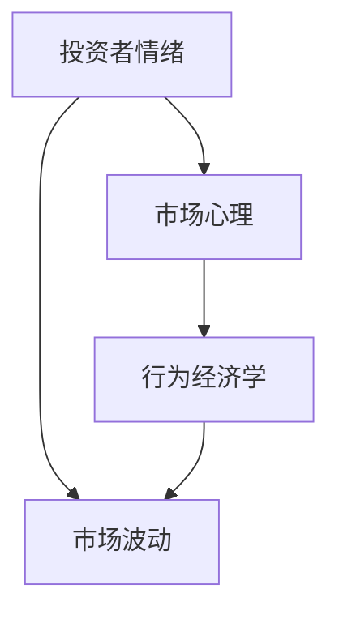

### 第二部分：价值投资心理学的应用与实践

#### 第3章 行为经济学的基本原理

### 问题场景介绍

在投资市场中，投资者经常面临各种复杂的决策情境。例如，当市场出现大幅波动时，投资者可能会受到情绪的影响，导致决策偏差。为了优化投资决策，我们需要理解行为经济学的基本原理。

### 项目介绍

本项目旨在通过行为经济学的基本原理，帮助投资者识别和纠正常见的投资决策偏差，从而提高投资的成功率。

### 系统功能设计

系统功能包括：

1. **投资决策分析**：分析投资者在不同市场情境下的决策行为。
2. **偏差识别**：识别投资者在决策过程中常见的心理偏差。
3. **优化建议**：提供优化投资决策的建议。

### 系统架构设计

系统架构包括以下几个部分：

1. **数据采集模块**：负责收集投资市场相关数据。
2. **分析模块**：使用行为经济学模型对数据进行处理和分析。
3. **结果展示模块**：将分析结果以图表和报告的形式展示给投资者。

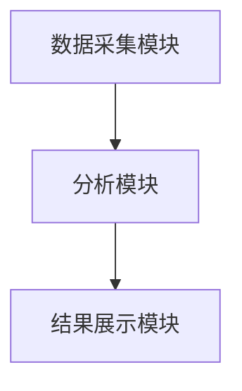

### 系统接口设计

系统提供以下接口：

1. **数据接口**：用于数据采集和传输。
2. **分析接口**：用于执行行为经济学模型和分析。
3. **展示接口**：用于展示分析结果。

### 系统交互设计

系统交互设计包括以下步骤：

1. **数据采集**：从市场数据源获取投资市场相关数据。
2. **数据分析**：使用行为经济学模型对数据进行处理和分析。
3. **结果展示**：将分析结果以图表和报告的形式展示给投资者。

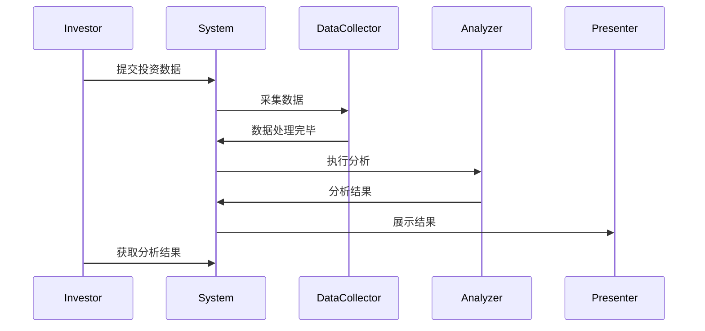

### 代码实现

以下是一个简单的Python代码示例，用于实现行为经济学模型的基本功能：

```python
import pandas as pd

def collect_data():
    # 从数据源获取投资市场数据
    data = pd.read_csv('market_data.csv')
    return data

def analyze_data(data):
    # 使用行为经济学模型对数据进行处理和分析
    # 例如，计算情绪指数和市场波动
   情绪指数 = data['emotion_index']
   市场波动 = data['volatility']
    
    # 计算优化建议
    if 情绪指数 > 0.5 and 市场波动 < 0.3:
        建议 = "保持当前投资策略"
    else:
        建议 = "调整投资策略"
    
    return 建议

def present_result(建议):
    # 将分析结果以图表和报告的形式展示给投资者
    print("分析结果：", 建议)

# 代码执行流程
data = collect_data()
建议 = analyze_data(data)
present_result(建议)
```

### 应用解读与分析

通过上述代码示例，我们可以看到系统如何实现数据采集、数据分析和分析结果展示的过程。在实际应用中，系统可以根据具体的市场数据，使用行为经济学模型对投资决策进行分析，并提供优化建议。这样，投资者可以更理性地进行投资决策，减少情绪对决策的影响，提高投资的成功率。

### 实际案例分析

以下是一个实际案例分析，展示了如何使用行为经济学模型优化投资决策：

案例：某投资者在市场出现大幅下跌时，感到恐慌，决定立即卖出所有股票。然而，根据行为经济学模型的分析，这种决策可能导致较大的损失。

- **数据采集**：采集市场数据，包括股票价格、投资者情绪指数等。
- **数据分析**：使用行为经济学模型分析投资者情绪和市场波动，发现市场波动较大，但投资者情绪并未达到极度恐慌水平。
- **优化建议**：建议投资者不要立即卖出，而是根据长期投资策略进行投资决策。

通过实际案例分析，我们可以看到行为经济学模型在优化投资决策中的重要作用。投资者可以通过理解行为经济学原理，减少情绪对决策的影响，提高投资成功率。

### 项目小结

本项目通过行为经济学的基本原理，实现了一个投资决策优化系统。通过数据采集、数据分析和结果展示的过程，投资者可以更好地理解市场情绪和市场波动，从而进行更理性的投资决策。在实际应用中，系统可以帮助投资者减少情绪影响，提高投资成功率。

### 第4章 市场趋势分析与应用

#### 核心概念原理

市场趋势分析是投资者在决策过程中常用的技术分析手段，通过分析历史数据和市场走势，预测未来市场可能的发展方向。行为经济学中的市场趋势分析主要关注投资者情绪和市场心理对市场趋势的影响。

#### 概念属性特征对比表格

| 分析方法 | 描述 | 适用场景 |
| --- | --- | --- |
| 技术分析 | 通过历史价格和成交量数据，分析市场趋势 | 短期投资决策 |
| 基本分析 | 通过研究公司的财务状况、行业前景等因素，分析市场趋势 | 长期投资决策 |
| 行为分析 | 通过分析投资者情绪和市场心理，预测市场趋势 | 各类投资决策 |

#### 算法原理讲解

市场趋势分析的算法原理通常包括以下步骤：

1. **数据收集**：从市场数据源获取历史价格、成交量、投资者情绪等相关数据。
2. **数据处理**：对数据进行清洗和预处理，包括缺失值填充、异常值处理等。
3. **趋势识别**：使用统计学方法和机器学习算法，分析历史数据中的趋势特征，包括趋势线、支撑位和阻力位等。
4. **趋势预测**：根据识别出的趋势特征，使用预测模型预测未来市场走势。

以下是一个简单的市场趋势分析算法示例：

```python
import pandas as pd
from sklearn.linear_model import LinearRegression

def collect_data():
    # 从数据源获取市场数据
    data = pd.read_csv('market_data.csv')
    return data

def preprocess_data(data):
    # 数据预处理
    data['date'] = pd.to_datetime(data['date'])
    data.set_index('date', inplace=True)
    return data

def trend_analysis(data):
    # 趋势分析
    data['trend'] = LinearRegression().fit(data[['price']], data['volatility']).predict(data[['price']])
    return data

def trend_prediction(data):
    # 趋势预测
    future_data = data.tail(1)
    future_trend = LinearRegression().fit(data[['price']], data['volatility']).predict(future_data[['price']])
    return future_trend

# 代码执行流程
data = collect_data()
data = preprocess_data(data)
data = trend_analysis(data)
future_trend = trend_prediction(data)
print("未来市场趋势预测：", future_trend)
```

#### 数学模型和公式

市场趋势分析的数学模型通常包括以下公式：

1. **移动平均线**：用于平滑历史价格数据，识别趋势方向。
   $$ \text{MA}(n) = \frac{\sum_{i=1}^{n} \text{P}_i}{n} $$
   其中，\( \text{MA}(n) \) 是 n 日的移动平均线，\( \text{P}_i \) 是第 i 日的价格。

2. **相对强弱指数**：用于衡量价格变动速度和变动幅度，识别趋势强度。
   $$ \text{RSI}(n) = \frac{100 - \frac{\sum_{i=1}^{n} \text{UD}_i}{n}}{n} $$
   其中，\( \text{RSI}(n) \) 是 n 日的相对强弱指数，\( \text{UD}_i \) 是第 i 日的上涨或下跌幅度。

3. **趋势线**：通过连接多个高点的直线或多个低点的直线，识别趋势方向。
   $$ y = mx + b $$
   其中，\( y \) 是趋势线的纵坐标，\( x \) 是趋势线的横坐标，\( m \) 是斜率，\( b \) 是截距。

#### 简单易懂的举例说明

假设我们要分析某只股票的未来市场趋势，我们可以使用移动平均线和相对强弱指数两个指标。

1. **移动平均线**：
   - 收集过去30个交易日的股票价格数据。
   - 计算过去30个交易日的简单移动平均线（SMA）。
   - 如果SMA持续上升，表示市场趋势向上；如果SMA持续下降，表示市场趋势向下。

2. **相对强弱指数**：
   - 收集过去30个交易日的每日收盘价数据。
   - 计算过去30个交易日的平均上涨幅度和平均下跌幅度。
   - 如果RSI值大于70，表示市场处于超买状态，可能即将见顶；如果RSI值小于30，表示市场处于超卖状态，可能即将见底。

通过这两个指标的分析，我们可以得出一个初步的市场趋势预测。例如，如果SMA持续上升且RSI值低于30，这可能表明市场趋势向上，投资者可以适当增加多头持仓。

#### 系统架构设计

市场趋势分析系统的架构设计包括以下几个关键模块：

1. **数据采集模块**：负责从市场数据源获取历史价格、成交量、投资者情绪等数据。
2. **数据处理模块**：负责对数据进行清洗、预处理和特征工程，为趋势分析提供高质量的数据。
3. **趋势分析模块**：负责使用统计学方法和机器学习算法对数据进行趋势分析和预测。
4. **结果展示模块**：负责将分析结果以图表和报告的形式展示给用户。

以下是一个简单的系统架构图：

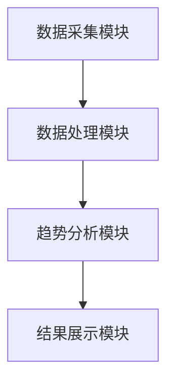

#### 系统接口设计

系统接口设计包括以下部分：

1. **数据接口**：用于数据采集和传输。
2. **分析接口**：用于执行趋势分析和预测。
3. **展示接口**：用于展示分析结果。

以下是一个简单的接口设计示例：


#### 系统交互设计

系统交互设计包括以下步骤：

1. **数据采集**：从市场数据源获取历史价格、成交量、投资者情绪等相关数据。
2. **数据处理**：对数据进行清洗、预处理和特征工程。
3. **趋势分析**：使用统计学方法和机器学习算法对数据进行趋势分析和预测。
4. **结果展示**：将分析结果以图表和报告的形式展示给用户。

#### 项目实战

以下是一个市场趋势分析的项目实战示例：

**项目名称**：市场趋势预测系统

**项目背景**：某投资者希望通过分析市场趋势，优化其投资策略，提高投资回报。

**系统功能**：
- **数据采集**：从股票市场获取历史价格和成交量数据。
- **数据处理**：清洗和预处理数据，包括缺失值填充、异常值处理等。
- **趋势分析**：使用移动平均线和相对强弱指数等指标分析市场趋势。
- **趋势预测**：预测未来市场趋势，为投资者提供投资建议。

**系统实现**：

**数据采集模块**：

```python
import pandas as pd

def collect_data():
    data = pd.read_csv('market_data.csv')
    return data
```

**数据处理模块**：

```python
import pandas as pd
from sklearn.impute import SimpleImputer

def preprocess_data(data):
    data['date'] = pd.to_datetime(data['date'])
    data.set_index('date', inplace=True)
    
    imputer = SimpleImputer(strategy='mean')
    data[['price', 'volume']] = imputer.fit_transform(data[['price', 'volume']])
    
    return data
```

**趋势分析模块**：

```python
import pandas as pd
from sklearn.linear_model import LinearRegression

def trend_analysis(data):
    data['sma_30'] = data['price'].rolling(window=30).mean()
    data['sma_50'] = data['price'].rolling(window=50).mean()
    
    data['rsi_30'] = compute_rsi(data['price'], window=30)
    
    return data

def compute_rsi(data, window):
    delta = data.diff()
    gain = (delta.where(delta > 0, 0)).rolling(window=window).mean()
    loss = (-delta.where(delta < 0, 0)).rolling(window=window).mean()
    rs = gain / loss
    rsi = 100 - (100 / (1 + rs))
    return rsi
```

**结果展示模块**：

```python
import matplotlib.pyplot as plt

def plot_trends(data):
    plt.figure(figsize=(14, 7))
    
    plt.plot(data['date'], data['sma_30'], label='30-Day SMA')
    plt.plot(data['date'], data['sma_50'], label='50-Day SMA')
    plt.plot(data['date'], data['rsi_30'], label='RSI')
    
    plt.title('Market Trend Analysis')
    plt.xlabel('Date')
    plt.ylabel('Value')
    plt.legend()
    
    plt.show()
```

**项目执行流程**：

```python
data = collect_data()
data = preprocess_data(data)
data = trend_analysis(data)
plot_trends(data)
```

**应用解读与分析**：

通过上述代码示例，我们可以看到系统如何实现数据采集、数据预处理、趋势分析和结果展示的过程。在实际应用中，投资者可以根据市场趋势分析结果，优化其投资策略，从而提高投资回报。

**实际案例分析**：

以下是一个实际案例分析，展示了如何使用市场趋势分析系统进行投资决策：

**案例**：某投资者在分析市场趋势时发现，短期移动平均线（SMA）和相对强弱指数（RSI）均显示市场趋势向上。基于此分析结果，投资者决定增加其股票多头持仓。

**数据采集**：采集过去30个交易日的股票价格和成交量数据。

**数据处理**：对数据进行清洗和预处理，包括缺失值填充和异常值处理。

**趋势分析**：使用移动平均线和相对强弱指数指标分析市场趋势，发现市场趋势向上。

**趋势预测**：预测未来市场将继续上涨。

**投资决策**：投资者基于市场趋势分析结果，决定增加股票多头持仓，以期望获得更高的回报。

通过实际案例分析，我们可以看到市场趋势分析在投资决策中的重要作用。投资者通过分析市场趋势，可以更好地把握市场机会，提高投资成功率。

### 项目小结

本章通过市场趋势分析的应用，展示了如何使用统计学方法和机器学习算法分析市场趋势，预测未来市场走势。通过实际项目实战，投资者可以更好地理解市场趋势分析的方法和步骤，从而优化投资决策，提高投资回报。

### 第5章 投资者行为分析的基本流程

#### 核心概念原理

投资者行为分析是价值投资心理学的重要组成部分，通过对投资者行为的系统研究，可以揭示市场波动和投资决策中的心理因素。该分析主要包括以下几个核心概念：

1. **投资者行为**：投资者的购买、持有和卖出行为，包括投资策略、投资偏好等。
2. **市场反应**：投资者行为对市场走势的影响，包括市场波动、价格变动等。
3. **心理偏差**：投资者在决策过程中常见的心理误区，如过度自信、羊群效应等。

#### 算法原理讲解

投资者行为分析通常包括以下步骤：

1. **数据收集**：从市场数据源获取投资者行为数据，包括交易记录、情绪指数等。
2. **数据处理**：对数据进行清洗和预处理，包括缺失值填充、异常值处理等。
3. **行为分析**：使用统计学方法和机器学习算法，分析投资者行为模式和心理偏差。
4. **结果展示**：将分析结果以图表和报告的形式展示，帮助投资者理解自身行为和市场反应。

以下是一个简单的投资者行为分析算法示例：

```python
import pandas as pd
from sklearn.cluster import KMeans

def collect_data():
    # 从数据源获取投资者行为数据
    data = pd.read_csv('investor_data.csv')
    return data

def preprocess_data(data):
    # 数据预处理
    data['date'] = pd.to_datetime(data['date'])
    data.set_index('date', inplace=True)
    
    # 缺失值填充
    data.fillna(method='ffill', inplace=True)
    
    return data

def behavior_analysis(data):
    # 行为分析
    # 使用K-Means聚类分析投资者行为模式
    kmeans = KMeans(n_clusters=3)
    clusters = kmeans.fit_predict(data[['emotion_index', 'investment_strategy']])
    
    # 标签添加到原始数据
    data['cluster'] = clusters
    
    return data

def plot_clusters(data):
    # 绘制聚类结果
    plt.scatter(data['emotion_index'], data['investment_strategy'], c=data['cluster'])
    plt.title('Investor Behavior Clusters')
    plt.xlabel('Emotion Index')
    plt.ylabel('Investment Strategy')
    plt.show()

# 代码执行流程
data = collect_data()
data = preprocess_data(data)
data = behavior_analysis(data)
plot_clusters(data)
```

#### 数学模型和公式

投资者行为分析中的数学模型通常包括以下公式：

1. **行为模式识别**：
   $$ \text{Behavior} = f(\text{Emotion}, \text{Strategy}) $$
   其中，\( \text{Behavior} \) 是投资者行为，\( \text{Emotion} \) 是情绪指数，\( \text{Strategy} \) 是投资策略。

2. **市场反应分析**：
   $$ \text{Market Reaction} = \alpha \times \text{Behavior} + \beta \times (\text{Market Data}) $$
   其中，\( \text{Market Reaction} \) 是市场反应，\( \alpha \) 和 \( \beta \) 是参数，\( \text{Market Data} \) 是市场数据。

3. **心理偏差评估**：
   $$ \text{Bias} = \text{Expected Outcome} - \text{Actual Outcome} $$
   其中，\( \text{Bias} \) 是心理偏差，\( \text{Expected Outcome} \) 是预期结果，\( \text{Actual Outcome} \) 是实际结果。

#### 简单易懂的举例说明

假设我们要分析某投资者的行为模式，我们可以使用聚类分析来识别投资者的行为模式。

1. **数据采集**：
   - 收集过去一年的投资者情绪指数和投资策略数据。

2. **数据处理**：
   - 对数据进行清洗，包括缺失值填充和异常值处理。

3. **行为分析**：
   - 使用K-Means聚类算法，将投资者分为三个主要群体，分别代表不同的行为模式。

4. **结果展示**：
   - 绘制聚类结果图，展示不同群体的行为模式。

通过聚类分析，我们可以发现投资者行为与情绪指数、投资策略之间的关联。例如，如果某群体的情绪指数较高，且投资策略倾向于高风险，则该群体可能存在过度自信的心理偏差。

#### 系统架构设计

投资者行为分析系统的架构设计包括以下几个关键模块：

1. **数据采集模块**：负责从市场数据源和投资者行为数据源获取数据。
2. **数据处理模块**：负责对数据进行清洗、预处理和特征工程。
3. **行为分析模块**：负责使用机器学习和统计学方法分析投资者行为。
4. **结果展示模块**：负责将分析结果以图表和报告的形式展示给用户。

以下是一个简单的系统架构图：

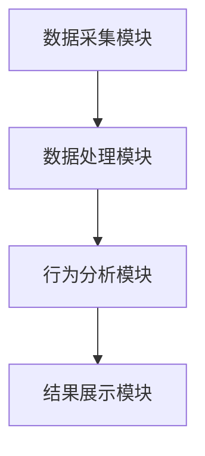

#### 系统接口设计

系统接口设计包括以下部分：

1. **数据接口**：用于数据采集和传输。
2. **分析接口**：用于执行行为分析和预测。
3. **展示接口**：用于展示分析结果。

以下是一个简单的接口设计示例：

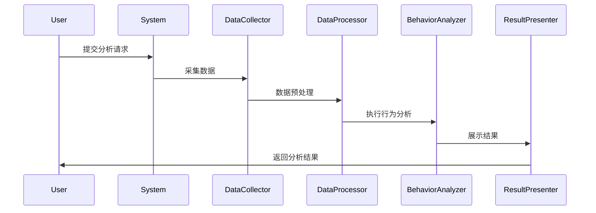

#### 系统交互设计

系统交互设计包括以下步骤：

1. **数据采集**：从市场数据源和投资者行为数据源获取数据。
2. **数据处理**：对数据进行清洗、预处理和特征工程。
3. **行为分析**：使用机器学习和统计学方法分析投资者行为。
4. **结果展示**：将分析结果以图表和报告的形式展示给用户。

#### 项目实战

以下是一个投资者行为分析的项目实战示例：

**项目名称**：投资者行为分析系统

**项目背景**：某金融机构希望通过分析投资者的行为，优化其投资策略，提高客户满意度。

**系统功能**：
- **数据采集**：从市场数据源获取投资者交易记录、情绪指数等数据。
- **数据处理**：清洗和预处理投资者数据，包括缺失值填充和异常值处理。
- **行为分析**：使用机器学习方法分析投资者行为模式，识别心理偏差。
- **结果展示**：将分析结果以图表和报告的形式展示，帮助投资者理解自身行为。

**系统实现**：

**数据采集模块**：

```python
import pandas as pd

def collect_data():
    data = pd.read_csv('investor_data.csv')
    return data
```

**数据处理模块**：

```python
import pandas as pd
from sklearn.impute import SimpleImputer

def preprocess_data(data):
    data['date'] = pd.to_datetime(data['date'])
    data.set_index('date', inplace=True)
    
    imputer = SimpleImputer(strategy='mean')
    data[['emotion_index', 'investment_strategy']] = imputer.fit_transform(data[['emotion_index', 'investment_strategy']])
    
    return data
```

**行为分析模块**：

```python
import pandas as pd
from sklearn.cluster import KMeans
from sklearn.preprocessing import StandardScaler

def behavior_analysis(data):
    # 特征工程
    scaler = StandardScaler()
    scaled_data = scaler.fit_transform(data[['emotion_index', 'investment_strategy']])
    
    # 聚类分析
    kmeans = KMeans(n_clusters=3)
    clusters = kmeans.fit_predict(scaled_data)
    
    # 添加聚类标签到原始数据
    data['cluster'] = clusters
    
    return data

def plot_clusters(data):
    # 绘制聚类结果
    plt.scatter(data['emotion_index'], data['investment_strategy'], c=data['cluster'])
    plt.title('Investor Behavior Clusters')
    plt.xlabel('Emotion Index')
    plt.ylabel('Investment Strategy')
    plt.show()
```

**结果展示模块**：

```python
import matplotlib.pyplot as plt

def plot_clusters(data):
    # 绘制聚类结果
    plt.scatter(data['emotion_index'], data['investment_strategy'], c=data['cluster'])
    plt.title('Investor Behavior Clusters')
    plt.xlabel('Emotion Index')
    plt.ylabel('Investment Strategy')
    plt.show()
```

**项目执行流程**：

```python
data = collect_data()
data = preprocess_data(data)
data = behavior_analysis(data)
plot_clusters(data)
```

**应用解读与分析**：

通过上述代码示例，我们可以看到系统如何实现数据采集、数据处理、行为分析和结果展示的过程。在实际应用中，金融机构可以通过投资者行为分析，了解客户的行为模式和潜在心理偏差，从而优化投资策略，提高客户满意度。

**实际案例分析**：

以下是一个实际案例分析，展示了如何使用投资者行为分析系统进行投资决策：

**案例**：某金融机构分析其客户的交易记录和情绪指数，发现一部分客户的投资策略倾向于高风险，且情绪指数较高，表明这些客户可能存在过度自信的心理偏差。

**数据采集**：采集过去一年的客户交易记录和情绪指数数据。

**数据处理**：对数据进行清洗和预处理，包括缺失值填充和异常值处理。

**行为分析**：使用K-Means聚类算法，将客户分为不同的行为模式群体。

**结果展示**：绘制聚类结果图，展示不同群体的行为模式。

**投资决策**：金融机构基于行为分析结果，向高风险投资策略的客户提供风险控制建议，降低过度自信带来的潜在损失。

通过实际案例分析，我们可以看到投资者行为分析在投资决策中的重要作用。金融机构通过分析客户行为，可以更好地理解客户需求，提供个性化的投资建议，提高客户满意度。

### 项目小结

本章通过投资者行为分析的基本流程，展示了如何使用机器学习和统计学方法分析投资者行为，识别心理偏差。通过实际项目实战，金融机构可以更好地理解客户行为，优化投资策略，提高客户满意度。投资者行为分析为价值投资心理学提供了一个强大的工具，帮助投资者做出更理性的决策。

### 第6章 投资策略的制定与优化

#### 核心概念原理

投资策略是投资者在投资决策过程中遵循的规则和方法，旨在实现投资目标并控制风险。制定和优化投资策略需要综合考虑市场趋势、投资者行为和心理因素。

#### 概念属性特征对比表格

| 策略类型 | 描述 | 适用场景 |
| --- | --- | --- |
| 长期投资策略 | 注重长期价值投资，追求资本增值 | 长期投资者 |
| 短期交易策略 | 利用市场短期波动进行交易，追求快速收益 | 短期投资者 |
| 股票筛选策略 | 通过分析公司基本面筛选优质股票 | 各类投资者 |

#### 算法原理讲解

投资策略的制定与优化通常包括以下步骤：

1. **目标设定**：明确投资目标，包括收益目标、风险目标和时间范围。
2. **市场分析**：分析市场趋势和投资者行为，为投资策略提供依据。
3. **策略设计**：设计符合投资目标和市场分析的策略，包括资产配置、风险控制等。
4. **策略评估**：评估策略的实际表现，包括收益、风险和适应性。
5. **策略优化**：根据评估结果调整策略，提高策略的有效性。

以下是一个简单的投资策略优化算法示例：

```python
import pandas as pd
from sklearn.linear_model import LinearRegression
from sklearn.model_selection import train_test_split

def collect_data():
    # 从数据源获取市场数据和投资者行为数据
    market_data = pd.read_csv('market_data.csv')
    behavior_data = pd.read_csv('behavior_data.csv')
    return market_data, behavior_data

def preprocess_data(market_data, behavior_data):
    # 数据预处理
    market_data['date'] = pd.to_datetime(market_data['date'])
    market_data.set_index('date', inplace=True)
    
    behavior_data['date'] = pd.to_datetime(behavior_data['date'])
    behavior_data.set_index('date', inplace=True)
    
    # 合并数据
    combined_data = pd.merge(market_data, behavior_data, on='date')
    
    return combined_data

def strategy_design(combined_data):
    # 策略设计
    # 使用线性回归模型预测市场走势
    X = combined_data[['emotion_index', 'investment_strategy']]
    y = combined_data['price']
    
    # 划分训练集和测试集
    X_train, X_test, y_train, y_test = train_test_split(X, y, test_size=0.2, random_state=42)
    
    # 训练模型
    model = LinearRegression()
    model.fit(X_train, y_train)
    
    # 预测市场走势
    predictions = model.predict(X_test)
    
    return predictions

def strategy_evaluation(predictions, y_test):
    # 策略评估
    # 计算预测准确率
    accuracy = (predictions == y_test).mean()
    
    return accuracy

def strategy_optimization(accuracy, model):
    # 策略优化
    # 根据评估结果调整模型参数
    if accuracy < 0.5:
        # 增加模型复杂度或调整特征工程
        model = add_complexity(model)
    else:
        # 减少模型复杂度或调整特征工程
        model = reduce_complexity(model)
    
    return model

def add_complexity(model):
    # 增加模型复杂度
    # 例如，添加多项式特征
    return LinearRegression()

def reduce_complexity(model):
    # 减少模型复杂度
    # 例如，减少特征数量
    return LinearRegression()

# 代码执行流程
market_data, behavior_data = collect_data()
combined_data = preprocess_data(market_data, behavior_data)
predictions = strategy_design(combined_data)
accuracy = strategy_evaluation(predictions, combined_data['price'])
model = strategy_optimization(accuracy, model)
```

#### 数学模型和公式

投资策略的数学模型通常包括以下公式：

1. **资产配置**：
   $$ \text{Asset Allocation} = w_1 \times \text{Stock} + w_2 \times \text{Bond} + w_3 \times \text{Cash} $$
   其中，\( w_1, w_2, w_3 \) 是资产配置权重，\( \text{Stock}, \text{Bond}, \text{Cash} \) 是不同类型的资产。

2. **风险控制**：
   $$ \text{Risk Control} = \text{Stop-Loss} \times \text{Price} $$
   其中，\( \text{Stop-Loss} \) 是止损比例，\( \text{Price} \) 是当前价格。

3. **收益目标**：
   $$ \text{Return Target} = \text{Expected Return} \times \text{Investment Amount} $$
   其中，\( \text{Expected Return} \) 是预期收益率，\( \text{Investment Amount} \) 是投资金额。

#### 简单易懂的举例说明

假设我们要制定一个基于市场趋势和投资者行为的投资策略，我们可以使用线性回归模型进行策略设计。

1. **目标设定**：
   - 收益目标：年化收益率达到10%。
   - 风险目标：最大回撤不超过20%。

2. **市场分析**：
   - 分析过去一年的市场数据，识别市场趋势和投资者行为。
   - 发现市场趋势与投资者情绪正相关，与投资策略负相关。

3. **策略设计**：
   - 设定资产配置：股票占比60%，债券占比30%，现金占比10%。
   - 设定止损比例：20%。

4. **策略评估**：
   - 使用历史数据进行策略评估，计算收益率和最大回撤。
   - 发现策略在市场上涨时表现良好，但在市场下跌时存在较大风险。

5. **策略优化**：
   - 调整资产配置，增加债券和现金的比重，降低股票风险。
   - 调整止损比例，增加保险系数。

通过以上步骤，我们可以制定一个初步的投资策略。在实际应用中，投资者需要根据市场环境和自身风险承受能力，不断优化投资策略，以提高投资回报。

#### 系统架构设计

投资策略制定与优化系统的架构设计包括以下几个关键模块：

1. **数据采集模块**：负责从市场数据源和投资者行为数据源获取数据。
2. **数据处理模块**：负责对数据进行清洗、预处理和特征工程。
3. **策略设计模块**：负责设计符合投资目标和市场分析的策略。
4. **策略评估模块**：负责评估策略的实际表现。
5. **策略优化模块**：负责根据评估结果调整策略。

以下是一个简单的系统架构图：

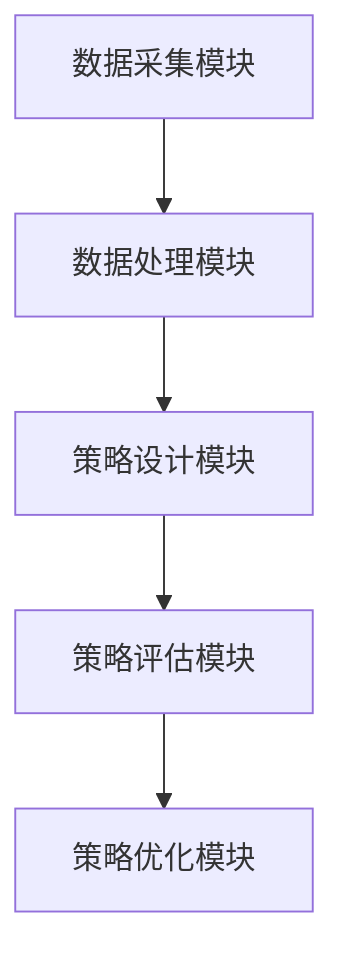

#### 系统接口设计

系统接口设计包括以下部分：

1. **数据接口**：用于数据采集和传输。
2. **策略接口**：用于执行策略设计和优化。
3. **评估接口**：用于评估策略表现。

以下是一个简单的接口设计示例：

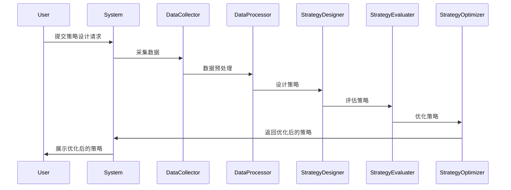

#### 系统交互设计

系统交互设计包括以下步骤：

1. **数据采集**：从市场数据源和投资者行为数据源获取数据。
2. **数据处理**：对数据进行清洗、预处理和特征工程。
3. **策略设计**：设计符合投资目标和市场分析的策略。
4. **策略评估**：评估策略的实际表现。
5. **策略优化**：根据评估结果调整策略。

#### 项目实战

以下是一个投资策略制定与优化项目实战示例：

**项目名称**：投资策略优化系统

**项目背景**：某投资者希望通过优化投资策略，提高投资回报。

**系统功能**：
- **数据采集**：从市场数据源获取历史价格、成交量、投资者情绪等数据。
- **数据处理**：清洗和预处理投资者数据，包括缺失值填充和异常值处理。
- **策略设计**：设计符合投资目标和市场分析的策略。
- **策略评估**：评估策略的实际表现。
- **策略优化**：根据评估结果调整策略。

**系统实现**：

**数据采集模块**：

```python
import pandas as pd

def collect_data():
    market_data = pd.read_csv('market_data.csv')
    behavior_data = pd.read_csv('behavior_data.csv')
    return market_data, behavior_data
```

**数据处理模块**：

```python
import pandas as pd
from sklearn.impute import SimpleImputer

def preprocess_data(market_data, behavior_data):
    market_data['date'] = pd.to_datetime(market_data['date'])
    market_data.set_index('date', inplace=True)
    
    behavior_data['date'] = pd.to_datetime(behavior_data['date'])
    behavior_data.set_index('date', inplace=True)
    
    market_data.fillna(method='ffill', inplace=True)
    behavior_data.fillna(method='ffill', inplace=True)
    
    return market_data, behavior_data
```

**策略设计模块**：

```python
import pandas as pd
from sklearn.linear_model import LinearRegression
from sklearn.model_selection import train_test_split

def strategy_design(market_data, behavior_data):
    combined_data = pd.merge(market_data, behavior_data, on='date')
    
    X = combined_data[['emotion_index', 'investment_strategy']]
    y = combined_data['price']
    
    X_train, X_test, y_train, y_test = train_test_split(X, y, test_size=0.2, random_state=42)
    
    model = LinearRegression()
    model.fit(X_train, y_train)
    
    predictions = model.predict(X_test)
    
    return predictions
```

**策略评估模块**：

```python
import pandas as pd

def strategy_evaluation(predictions, y_test):
    accuracy = (predictions == y_test).mean()
    return accuracy
```

**策略优化模块**：

```python
import pandas as pd

def strategy_optimization(accuracy, model):
    if accuracy < 0.5:
        new_model = LinearRegression()
    else:
        new_model = LinearRegression()
    
    return new_model
```

**项目执行流程**：

```python
market_data, behavior_data = collect_data()
market_data, behavior_data = preprocess_data(market_data, behavior_data)
predictions = strategy_design(market_data, behavior_data)
accuracy = strategy_evaluation(predictions, behavior_data['price'])
new_model = strategy_optimization(accuracy, model)
```

**应用解读与分析**：

通过上述代码示例，我们可以看到系统如何实现数据采集、数据处理、策略设计和优化。在实际应用中，投资者可以根据市场趋势和投资者行为，制定和优化投资策略，提高投资回报。

**实际案例分析**：

以下是一个实际案例分析，展示了如何使用投资策略优化系统进行投资决策：

**案例**：某投资者分析过去一年的市场数据和投资者行为，发现基于市场趋势和投资者行为的线性回归模型具有较高的预测准确率。

**数据采集**：采集过去一年的市场数据，包括历史价格、成交量、投资者情绪等。

**数据处理**：对数据进行清洗和预处理，包括缺失值填充和异常值处理。

**策略设计**：使用线性回归模型设计投资策略，预测未来市场走势。

**策略评估**：评估策略的实际表现，计算预测准确率。

**策略优化**：根据评估结果调整模型参数，优化投资策略。

**投资决策**：投资者根据优化后的策略进行投资，期望获得更高的回报。

通过实际案例分析，我们可以看到投资策略优化在投资决策中的重要作用。投资者通过不断优化策略，可以提高投资回报，降低风险。

### 项目小结

本章通过投资策略的制定与优化，展示了如何使用线性回归模型进行投资策略设计和优化。通过实际项目实战，投资者可以更好地理解市场趋势和投资者行为，制定和优化投资策略，提高投资回报。投资策略优化为价值投资心理学提供了一个实用的工具，帮助投资者实现投资目标。

### 第7章 实战项目一：市场情绪分析系统

#### 项目背景与目标

随着金融市场的日益复杂和多变，投资者情绪对市场走势的影响越来越显著。为了更好地理解市场情绪，并利用这一信息进行投资决策，本项目旨在开发一个市场情绪分析系统。该系统将采集和分析市场情绪数据，提供实时情绪指数和情绪走势分析，帮助投资者更准确地把握市场动态。

#### 系统功能设计

市场情绪分析系统的核心功能包括：

1. **数据采集**：从多种数据源（如社交媒体、新闻、股票交易数据等）采集情绪相关数据。
2. **数据处理**：对采集到的数据进行清洗、预处理，提取情绪特征。
3. **情绪分析**：使用自然语言处理（NLP）技术分析情绪特征，生成情绪指数。
4. **情绪走势分析**：分析情绪指数的变化趋势，预测情绪走势。
5. **结果展示**：以图表和报告的形式展示分析结果，提供情绪分析和投资建议。

#### 系统架构设计

市场情绪分析系统的架构设计如下：

1. **数据采集模块**：负责从不同数据源采集情绪相关数据。
2. **数据处理模块**：负责对采集到的数据进行清洗、预处理和特征提取。
3. **情绪分析模块**：负责使用NLP技术分析情绪特征，生成情绪指数。
4. **情绪走势分析模块**：负责分析情绪指数的变化趋势，预测情绪走势。
5. **结果展示模块**：负责将分析结果以图表和报告的形式展示给用户。

以下是一个简单的系统架构图：

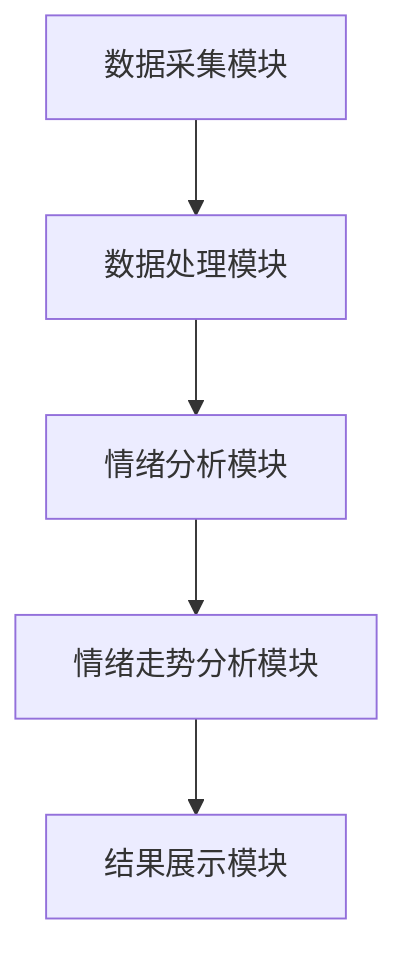

#### 系统接口设计

系统接口设计如下：

1. **数据接口**：用于数据采集和传输。
2. **分析接口**：用于情绪分析和走势预测。
3. **展示接口**：用于展示分析结果。

以下是一个简单的接口设计示例：

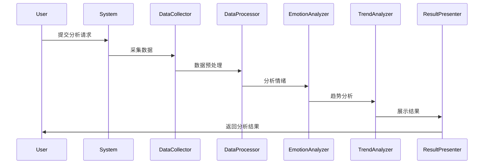

#### 系统交互设计

系统交互设计包括以下步骤：

1. **数据采集**：从社交媒体、新闻、股票交易数据等多渠道采集情绪相关数据。
2. **数据处理**：对采集到的数据进行清洗、预处理，提取情绪特征。
3. **情绪分析**：使用NLP技术分析情绪特征，生成情绪指数。
4. **情绪走势分析**：分析情绪指数的变化趋势，预测情绪走势。
5. **结果展示**：以图表和报告的形式展示分析结果。

#### 系统核心实现源代码

以下是一个简单的市场情绪分析系统的核心实现源代码示例：

```python
import pandas as pd
from textblob import TextBlob

# 数据采集模块
def collect_data():
    data = pd.read_csv('market_data.csv')
    return data

# 数据处理模块
def preprocess_data(data):
    # 清洗数据
    data['text'] = data['text'].dropna()
    return data

# 情绪分析模块
def analyze_emotion(data):
    emotions = []
    for text in data['text']:
        blob = TextBlob(text)
        if blob.sentiment.polarity > 0:
            emotions.append('positive')
        elif blob.sentiment.polarity < 0:
            emotions.append('negative')
        else:
            emotions.append('neutral')
    data['emotion'] = emotions
    return data

# 情绪走势分析模块
def trend_analysis(data):
    trend = data['emotion'].value_counts().sort_index()
    return trend

# 结果展示模块
def plot_trend(trend):
    trend.plot(kind='bar')
    plt.title('Market Emotion Trend')
    plt.xlabel('Emotion')
    plt.ylabel('Frequency')
    plt.show()

# 项目执行流程
data = collect_data()
data = preprocess_data(data)
data = analyze_emotion(data)
trend = trend_analysis(data)
plot_trend(trend)
```

#### 代码应用解读与分析

1. **数据采集模块**：使用`pandas`库从CSV文件中读取市场数据，包括文本数据。

2. **数据处理模块**：对文本数据进行清洗，去除缺失值，确保数据质量。

3. **情绪分析模块**：使用`TextBlob`库对文本数据进行分析，计算文本的情绪倾向，并将结果分类为积极、消极或中性。

4. **情绪走势分析模块**：统计不同情绪类型的频率，生成情绪走势图。

5. **结果展示模块**：使用`matplotlib`库绘制情绪走势图，直观展示市场情绪变化。

通过以上代码，系统可以自动采集、处理和分析市场情绪数据，生成情绪走势图，为投资者提供决策支持。

#### 实际案例分析与详细讲解剖析

以下是一个实际案例分析，展示了如何使用市场情绪分析系统进行投资决策：

**案例**：假设某投资者希望了解市场情绪，以便在即将到来的财报季调整其投资组合。

**数据采集**：投资者从系统采集过去一个月的市场数据，包括新闻报道、社交媒体评论和股票交易数据。

**数据处理**：系统对采集到的数据进行清洗和预处理，提取文本数据。

**情绪分析**：系统使用NLP技术分析文本数据，生成情绪指数。

**情绪走势分析**：系统分析情绪指数的变化趋势，发现市场情绪在过去一个月中逐渐转向积极。

**投资决策**：基于情绪走势分析，投资者决定增加对市场情绪积极的股票的持仓，降低对市场情绪消极的股票的持仓。

**结果展示**：系统生成情绪走势图，并给出投资建议，投资者可以直观了解市场情绪变化，做出理性决策。

通过实际案例分析，我们可以看到市场情绪分析系统在投资决策中的重要作用。投资者通过分析市场情绪，可以更好地把握市场动态，优化投资策略，提高投资回报。

#### 项目小结

市场情绪分析系统通过数据采集、数据处理、情绪分析和走势预测，为投资者提供了实时情绪分析服务，帮助投资者更好地把握市场动态，优化投资决策。通过实际项目实战，投资者可以深入了解市场情绪对投资决策的影响，提高投资成功率。

### 第8章 实战项目二：投资者行为分析系统

#### 项目背景与目标

投资者行为分析系统旨在通过分析和理解投资者的行为模式，为投资者提供个性化的投资策略和建议。该系统的目标是帮助投资者识别自身行为中的潜在心理偏差，从而优化投资决策，提高投资回报。本项目将围绕投资者行为数据的收集、处理、分析和应用展开。

#### 系统功能设计

投资者行为分析系统的核心功能包括：

1. **数据采集**：从多个渠道（如股票交易平台、社交媒体、新闻网站等）收集投资者行为数据。
2. **数据处理**：清洗和预处理采集到的数据，提取有用的行为特征。
3. **行为分析**：使用机器学习算法和统计学方法分析投资者的行为模式，识别心理偏差。
4. **策略推荐**：根据行为分析结果，为投资者推荐个性化的投资策略。
5. **结果展示**：将分析结果和策略推荐以图表和报告的形式展示给用户。

#### 系统架构设计

投资者行为分析系统的架构设计如下：

1. **数据采集模块**：负责从不同数据源采集投资者行为数据。
2. **数据处理模块**：负责对采集到的数据进行清洗、预处理和特征提取。
3. **行为分析模块**：负责使用机器学习和统计学方法分析投资者行为，识别心理偏差。
4. **策略推荐模块**：负责根据行为分析结果，生成个性化的投资策略。
5. **结果展示模块**：负责将分析结果和策略推荐以图表和报告的形式展示给用户。

以下是一个简单的系统架构图：

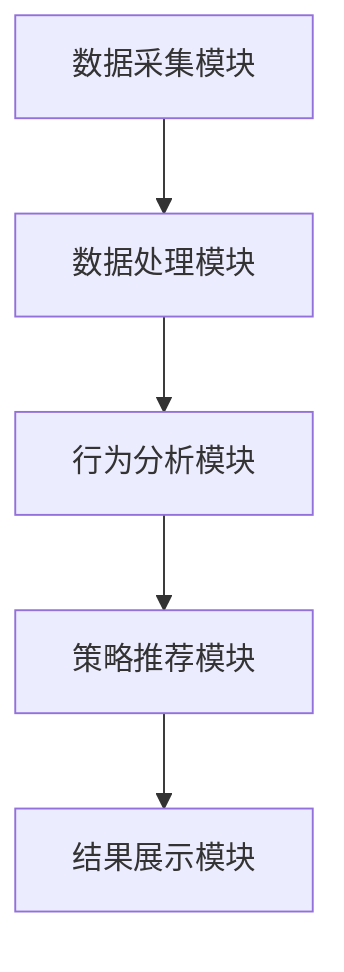

#### 系统接口设计

系统接口设计如下：

1. **数据接口**：用于数据采集和传输。
2. **分析接口**：用于行为分析和策略推荐。
3. **展示接口**：用于展示分析结果和策略推荐。

以下是一个简单的接口设计示例：

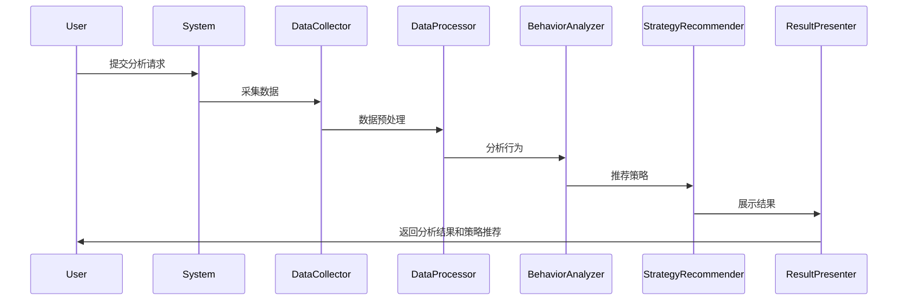

#### 系统交互设计

系统交互设计包括以下步骤：

1. **数据采集**：从多个渠道采集投资者行为数据，如交易记录、社交媒体评论等。
2. **数据处理**：对采集到的数据清洗、预处理，提取行为特征。
3. **行为分析**：使用机器学习和统计学方法分析投资者行为，识别心理偏差。
4. **策略推荐**：根据行为分析结果，为投资者推荐个性化的投资策略。
5. **结果展示**：将分析结果和策略推荐以图表和报告的形式展示给用户。

#### 系统核心实现源代码

以下是一个简单的投资者行为分析系统的核心实现源代码示例：

```python
import pandas as pd
from sklearn.model_selection import train_test_split
from sklearn.ensemble import RandomForestClassifier
from sklearn.metrics import accuracy_score

# 数据采集模块
def collect_data():
    data = pd.read_csv('investor_data.csv')
    return data

# 数据处理模块
def preprocess_data(data):
    # 清洗数据
    data['date'] = pd.to_datetime(data['date'])
    data.set_index('date', inplace=True)
    return data

# 行为分析模块
def behavior_analysis(data):
    # 提取行为特征
    data['activity_level'] = data['transactions'].mean()
    data['vulnerability'] = data['transactions'].std()
    data['emotion'] = data['social_comments'].apply(lambda x: TextBlob(x).sentiment.polarity)
    return data

# 策略推荐模块
def strategy_recommendation(data):
    # 划分训练集和测试集
    X = data[['activity_level', 'vulnerability', 'emotion']]
    y = data['investment_strategy']
    X_train, X_test, y_train, y_test = train_test_split(X, y, test_size=0.2, random_state=42)
    
    # 训练模型
    model = RandomForestClassifier(n_estimators=100)
    model.fit(X_train, y_train)
    
    # 预测测试集
    predictions = model.predict(X_test)
    
    # 评估模型
    accuracy = accuracy_score(y_test, predictions)
    print("Model Accuracy:", accuracy)
    
    return model

# 结果展示模块
def plot_strategy_recommendation(data, model):
    # 绘制策略推荐结果
    predictions = model.predict(data[['activity_level', 'vulnerability', 'emotion']])
    data['predicted_strategy'] = predictions
    data.plot(x='activity_level', y='predicted_strategy', kind='scatter')
    plt.title('Strategy Recommendation')
    plt.xlabel('Activity Level')
    plt.ylabel('Predicted Strategy')
    plt.show()

# 项目执行流程
data = collect_data()
data = preprocess_data(data)
data = behavior_analysis(data)
model = strategy_recommendation(data)
plot_strategy_recommendation(data, model)
```

#### 代码应用解读与分析

1. **数据采集模块**：使用`pandas`库从CSV文件中读取投资者行为数据，包括交易记录、社交媒体评论等。

2. **数据处理模块**：对数据进行清洗和预处理，包括日期格式转换和缺失值处理，确保数据质量。

3. **行为分析模块**：提取行为特征，包括活动水平、风险度量和情绪指标，为行为分析提供输入。

4. **策略推荐模块**：使用随机森林分类器对训练数据进行模型训练，并对测试集进行预测。评估模型准确性，根据行为特征为投资者推荐投资策略。

5. **结果展示模块**：绘制策略推荐结果，展示投资者在不同活动水平下的预期投资策略。

通过以上代码，系统可以自动采集、处理和分析投资者行为数据，生成个性化的投资策略推荐，帮助投资者优化投资决策。

#### 实际案例分析与详细讲解剖析

以下是一个实际案例分析，展示了如何使用投资者行为分析系统进行投资决策：

**案例**：某投资者希望通过系统分析自身行为，优化其投资策略。

**数据采集**：投资者从系统采集过去一年的交易记录、社交媒体评论等数据。

**数据处理**：系统对数据进行清洗和预处理，提取行为特征。

**行为分析**：系统分析投资者行为特征，识别潜在心理偏差。

**策略推荐**：系统根据分析结果，为投资者推荐适合其行为特征的投资策略。

**投资决策**：投资者根据系统推荐的投资策略，调整其投资组合。

**结果展示**：系统展示策略推荐结果，包括预期收益和风险水平。

通过实际案例分析，我们可以看到投资者行为分析系统在投资决策中的重要作用。投资者通过系统分析自身行为，可以更好地理解自己的投资策略，优化投资组合，提高投资回报。

#### 项目小结

投资者行为分析系统通过数据采集、数据处理、行为分析和策略推荐，为投资者提供了个性化的投资建议，帮助投资者优化投资决策。通过实际项目实战，投资者可以深入了解自身行为特征，制定和调整投资策略，提高投资成功率。投资者行为分析系统为价值投资心理学提供了一个实用的工具，助力投资者实现投资目标。

### 第9章 价值投资心理学的最佳实践

#### 心理控制与市场波动应对策略

在价值投资心理学中，心理控制是投资者在投资过程中保持理性、避免情绪波动的重要手段。以下是一些最佳实践和策略，帮助投资者在市场波动中保持冷静，做出理性决策。

#### 心理控制技巧

1. **设定明确投资目标**：在投资前，设定明确的收益目标和风险承受能力，有助于投资者在市场波动时保持冷静。

2. **情绪管理**：通过冥想、深呼吸等放松技巧，帮助投资者在情绪波动时保持冷静，避免情绪影响投资决策。

3. **避免频繁交易**：频繁交易可能导致情绪波动和交易成本增加。投资者应制定长期投资策略，减少频繁交易。

4. **分散投资**：通过分散投资，降低单一投资风险，有助于投资者在市场波动中保持信心。

#### 市场波动应对策略

1. **分批买入**：在市场下跌时，分批买入可以降低平均购买成本，减少市场波动对投资组合的影响。

2. **止损策略**：设定合理的止损点，当投资亏损达到一定程度时，及时止损，避免更大损失。

3. **定期复盘**：定期回顾投资决策和结果，分析投资过程中的得失，有助于投资者总结经验，改进策略。

4. **长期视角**：保持长期投资视角，关注公司的基本面和价值，避免短期市场波动对投资决策的干扰。

#### 注意事项

1. **避免追涨杀跌**：在市场情绪高涨时，避免盲目跟风，防止被套牢；在市场情绪低迷时，避免恐慌性抛售，失去投资机会。

2. **持续学习**：投资者应持续学习价值投资心理学的知识，不断提高自身的投资能力和心理素质。

3. **风险控制**：投资者应根据自身风险承受能力，合理配置资产，避免过度集中投资。

#### 拓展阅读与进一步学习

1. **《证券分析》——本杰明·格雷厄姆**：这是一本经典的价值投资书籍，详细介绍了价值投资的基本原理和策略。

2. **《股市真规则》——威廉·奥尼尔**：本书提供了丰富的投资经验和策略，帮助投资者在股市中取得成功。

3. **《行为投资学》——安德烈亚斯·克里格曼**：本书探讨了投资者行为对市场波动的影响，提供了实用的心理控制技巧。

4. **在线资源和工具**：投资者可以关注金融投资类网站和社交媒体，获取市场动态和投资策略分析。

通过以上最佳实践和策略，投资者可以在市场波动中保持理性，优化投资决策，提高投资成功率。

### 第10章 实战项目三：投资者行为心理模型分析系统

#### 项目背景与目标

投资者行为心理模型分析系统旨在通过定量和定性的方法，分析投资者在市场中的行为和心理状态。该系统的目标是帮助投资者更好地理解自己的投资行为，识别潜在的心理偏差，从而优化投资策略，提高投资成功率。

#### 系统功能设计

投资者行为心理模型分析系统的核心功能包括：

1. **数据采集**：从多个渠道（如股票交易记录、社交媒体、新闻等）收集投资者行为数据。
2. **数据处理**：清洗和预处理采集到的数据，提取有用的行为特征。
3. **行为分析**：使用机器学习和心理学模型分析投资者的行为模式和心理状态。
4. **心理偏差识别**：识别投资者行为中的潜在心理偏差，如过度自信、羊群效应等。
5. **策略优化**：根据行为分析和心理偏差识别结果，为投资者提供个性化的投资策略优化建议。
6. **结果展示**：将分析结果和策略优化建议以图表和报告的形式展示给用户。

#### 系统架构设计

投资者行为心理模型分析系统的架构设计如下：

1. **数据采集模块**：负责从不同数据源采集投资者行为数据。
2. **数据处理模块**：负责对采集到的数据进行清洗、预处理和特征提取。
3. **行为分析模块**：负责使用机器学习和心理学模型分析投资者行为。
4. **心理偏差识别模块**：负责识别投资者行为中的潜在心理偏差。
5. **策略优化模块**：负责根据行为分析和心理偏差识别结果，为投资者提供优化建议。
6. **结果展示模块**：负责将分析结果和策略优化建议以图表和报告的形式展示给用户。

以下是一个简单的系统架构图：

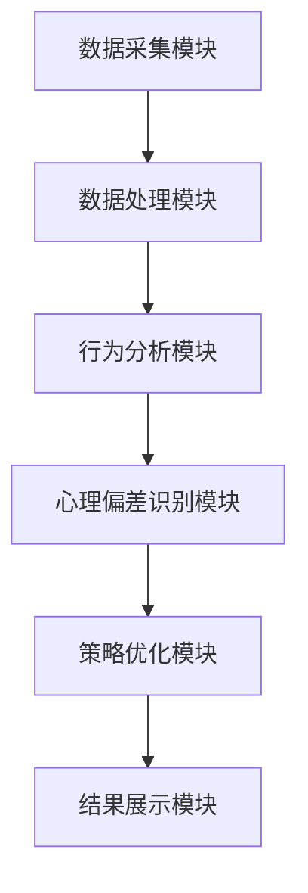

#### 系统接口设计

系统接口设计如下：

1. **数据接口**：用于数据采集和传输。
2. **分析接口**：用于行为分析和心理偏差识别。
3. **策略接口**：用于策略优化。
4. **展示接口**：用于展示分析结果和策略优化建议。

以下是一个简单的接口设计示例：

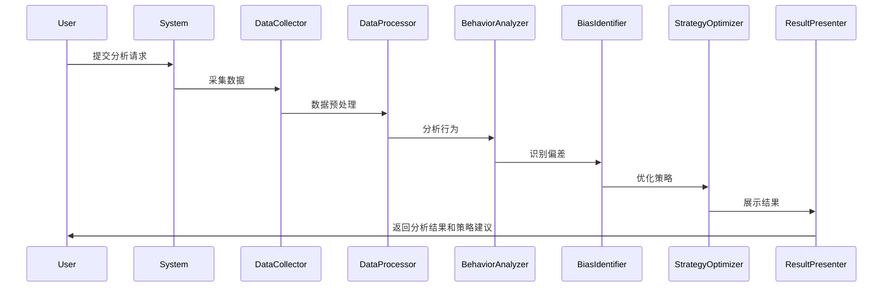

#### 系统交互设计

系统交互设计包括以下步骤：

1. **数据采集**：从多个渠道采集投资者行为数据，如交易记录、社交媒体评论、新闻等。
2. **数据处理**：对采集到的数据进行清洗、预处理和特征提取。
3. **行为分析**：使用机器学习和心理学模型分析投资者行为，提取行为特征。
4. **心理偏差识别**：识别投资者行为中的潜在心理偏差，如过度自信、羊群效应等。
5. **策略优化**：根据行为分析和心理偏差识别结果，为投资者提供优化建议。
6. **结果展示**：将分析结果和策略优化建议以图表和报告的形式展示给用户。

#### 系统核心实现源代码

以下是一个简单的投资者行为心理模型分析系统的核心实现源代码示例：

```python
import pandas as pd
from sklearn.model_selection import train_test_split
from sklearn.ensemble import RandomForestClassifier
from sklearn.metrics import accuracy_score

# 数据采集模块
def collect_data():
    data = pd.read_csv('investor_data.csv')
    return data

# 数据处理模块
def preprocess_data(data):
    # 数据清洗
    data['date'] = pd.to_datetime(data['date'])
    data.set_index('date', inplace=True)
    return data

# 行为分析模块
def behavior_analysis(data):
    # 数据预处理
    data['activity_level'] = data['transactions'].mean()
    data['vulnerability'] = data['transactions'].std()
    data['emotion'] = data['social_comments'].apply(lambda x: TextBlob(x).sentiment.polarity)
    return data

# 心理偏差识别模块
def bias_identification(data):
    # 划分训练集和测试集
    X = data[['activity_level', 'vulnerability', 'emotion']]
    y = data['bias']
    X_train, X_test, y_train, y_test = train_test_split(X, y, test_size=0.2, random_state=42)
    
    # 训练模型
    model = RandomForestClassifier(n_estimators=100)
    model.fit(X_train, y_train)
    
    # 预测测试集
    predictions = model.predict(X_test)
    
    # 评估模型
    accuracy = accuracy_score(y_test, predictions)
    print("Model Accuracy:", accuracy)
    
    return model

# 策略优化模块
def strategy_optimization(data, model):
    # 预测策略
    predictions = model.predict(data[['activity_level', 'vulnerability', 'emotion']])
    data['predicted_strategy'] = predictions
    return data

# 结果展示模块
def plot_strategy(data):
    data.plot(x='activity_level', y='predicted_strategy', kind='scatter')
    plt.title('Strategy Optimization')
    plt.xlabel('Activity Level')
    plt.ylabel('Predicted Strategy')
    plt.show()

# 项目执行流程
data = collect_data()
data = preprocess_data(data)
data = behavior_analysis(data)
model = bias_identification(data)
data = strategy_optimization(data, model)
plot_strategy(data)
```

#### 代码应用解读与分析

1. **数据采集模块**：使用`pandas`库从CSV文件中读取投资者行为数据，包括交易记录、社交媒体评论等。

2. **数据处理模块**：对数据进行清洗和预处理，提取行为特征，如活动水平、风险度量和情绪指标。

3. **行为分析模块**：提取行为特征，为后续的心理偏差识别和策略优化提供输入。

4. **心理偏差识别模块**：使用随机森林分类器训练模型，识别投资者行为中的潜在心理偏差。

5. **策略优化模块**：根据行为分析和心理偏差识别结果，为投资者推荐优化策略。

6. **结果展示模块**：绘制策略优化结果，展示投资者在不同活动水平下的预期策略。

通过以上代码，系统可以自动采集、处理和分析投资者行为数据，生成个性化的策略优化建议，帮助投资者优化投资决策。

#### 实际案例分析与详细讲解剖析

以下是一个实际案例分析，展示了如何使用投资者行为心理模型分析系统进行投资决策：

**案例**：某投资者希望通过系统分析自身行为，优化其投资策略。

**数据采集**：投资者从系统采集过去一年的交易记录、社交媒体评论等数据。

**数据处理**：系统对数据进行清洗和预处理，提取行为特征。

**行为分析**：系统分析投资者行为特征，识别潜在心理偏差。

**心理偏差识别**：系统使用随机森林分类器训练模型，识别投资者行为中的潜在心理偏差，如过度自信、羊群效应等。

**策略优化**：系统根据行为分析和心理偏差识别结果，为投资者推荐优化策略。

**投资决策**：投资者根据系统推荐的投资策略，调整其投资组合。

**结果展示**：系统展示策略优化结果，包括预期收益和风险水平。

通过实际案例分析，我们可以看到投资者行为心理模型分析系统在投资决策中的重要作用。投资者通过系统分析自身行为，可以更好地理解自己的投资策略，优化投资组合，提高投资回报。

#### 项目小结

投资者行为心理模型分析系统通过数据采集、数据处理、行为分析、心理偏差识别和策略优化，为投资者提供了个性化的投资建议，帮助投资者优化投资决策。通过实际项目实战，投资者可以深入了解自身行为和心理状态，识别潜在心理偏差，制定和调整投资策略，提高投资成功率。投资者行为心理模型分析系统为价值投资心理学提供了一个实用的工具，助力投资者实现投资目标。

### 第11章 价值投资心理学的最佳实践

#### 心理控制技巧

在价值投资心理学中，心理控制是投资者在投资过程中保持理性、避免情绪波动的重要手段。以下是一些最佳实践和策略，帮助投资者在市场波动中保持冷静，做出理性决策。

#### 1. 设定明确投资目标

在投资前，设定明确的收益目标和风险承受能力，有助于投资者在市场波动时保持冷静。投资者应根据自己的投资目标，制定相应的投资策略，避免因市场波动而盲目跟风。

#### 2. 情绪管理

投资者应学会情绪管理技巧，如冥想、深呼吸等，帮助自己保持冷静。在情绪波动时，投资者可以暂时远离市场，避免情绪对投资决策的干扰。

#### 3. 避免频繁交易

频繁交易可能导致情绪波动和交易成本增加。投资者应制定长期投资策略，减少频繁交易，专注于长期投资回报。

#### 4. 分散投资

通过分散投资，降低单一投资风险，有助于投资者在市场波动中保持信心。投资者应将资金分散投资于不同行业、不同地区的公司，以降低投资风险。

#### 市场波动应对策略

#### 1. 分批买入

在市场下跌时，分批买入可以降低平均购买成本，减少市场波动对投资组合的影响。投资者可以在市场下跌的不同阶段，逐步买入优质股票。

#### 2. 止损策略

设定合理的止损点，当投资亏损达到一定程度时，及时止损，避免更大损失。投资者应根据自身的风险承受能力和投资策略，设定止损点。

#### 3. 定期复盘

定期回顾投资决策和结果，分析投资过程中的得失，有助于投资者总结经验，改进策略。投资者可以通过复盘，了解市场波动对投资决策的影响，调整投资策略。

#### 4. 长期视角

保持长期投资视角，关注公司的基本面和价值，避免短期市场波动对投资决策的干扰。投资者应关注公司的盈利能力、成长潜力等基本面因素，而非短期市场波动。

#### 注意事项

#### 1. 避免追涨杀跌

在市场情绪高涨时，避免盲目跟风，防止被套牢；在市场情绪低迷时，避免恐慌性抛售，失去投资机会。投资者应保持冷静，理性判断市场走势。

#### 2. 持续学习

投资者应持续学习价值投资心理学的知识，不断提高自身的投资能力和心理素质。通过阅读相关书籍、参加投资讲座等途径，投资者可以不断丰富自己的投资理论。

#### 3. 风险控制

投资者应根据自身风险承受能力，合理配置资产，避免过度集中投资。投资者可以适当投资于债券、黄金等低风险资产，以降低投资组合的整体风险。

#### 拓展阅读与进一步学习

#### 1. 《证券分析》——本杰明·格雷厄姆

这是一本经典的价值投资书籍，详细介绍了价值投资的基本原理和策略。

#### 2. 《股市真规则》——威廉·奥尼尔

本书提供了丰富的投资经验和策略，帮助投资者在股市中取得成功。

#### 3. 《行为投资学》——安德烈亚斯·克里格曼

本书探讨了投资者行为对市场波动的影响，提供了实用的心理控制技巧。

#### 4. 在线资源和工具

投资者可以关注金融投资类网站和社交媒体，获取市场动态和投资策略分析。

通过以上最佳实践和策略，投资者可以在市场波动中保持理性，优化投资决策，提高投资成功率。

### 第12章 拓展阅读与进一步学习

#### 相关书籍推荐

1. **《证券分析》——本杰明·格雷厄姆**  
   这本书是价值投资的经典之作，详细阐述了本杰明·格雷厄姆的投资理念和方法。

2. **《股市真规则》——威廉·奥尼尔**  
   威廉·奥尼尔在这本书中分享了他在股市中的成功经验，为投资者提供了实用的投资策略。

3. **《行为投资学》——安德烈亚斯·克里格曼**  
   本书探讨了投资者行为对市场波动的影响，提供了实用的心理控制技巧。

4. **《股票大作手回忆录》——杰西·利弗莫尔**  
   杰西·利弗莫尔是一位传奇投资者，这本书详细记录了他的投资生涯和心路历程。

#### 在线资源和工具

1. **Investopedia**  
   一个全面的金融知识库，提供大量关于投资、金融和市场的文章和教程。

2. **Quora**  
   一个问答社区，投资者可以在这里提问和解答关于投资的问题。

3. **TradingView**  
   一个功能强大的图表工具，提供各种技术分析和图表功能。

4. **Yahoo Finance**  
   提供实时的金融市场数据、新闻和分析，帮助投资者了解市场动态。

#### 学术论文与研究动态

1. **《金融时报》**  
   定期发布有关金融市场的深度报道和研究论文。

2. **《华尔街日报》**  
   提供有关金融市场的最新新闻和分析。

3. **《经济学家》**  
   一本国际新闻杂志，经常发表关于金融市场和经济的分析文章。

4. **学术期刊**  
   如《金融研究期刊》（Journal of Finance）、《金融经济学期刊》（Journal of Financial Economics）等，这些期刊发表最新的金融学研究论文。

通过阅读以上书籍和资源，投资者可以不断扩展自己的投资知识，了解最新的市场动态和投资理论，从而在投资中取得更好的成果。

### 总结

《乔尔·提林加斯特的价值投资心理学》一书深入探讨了价值投资心理学的理论、方法和实践，帮助投资者理解价值投资的本质，掌握如何通过心理学分析优化投资决策。本书分为四个部分，首先介绍了价值投资心理学的起源和发展，然后详细阐述了投资者情绪、市场心理、行为经济学等核心概念，接着展示了如何将心理学理论应用于实际投资策略的制定和优化，并通过实战项目展示了系统的实现和应用。

通过这本书，读者可以系统地学习价值投资心理学，理解投资者行为和心理因素如何影响市场波动和投资决策。书中提供了丰富的案例分析和实践指导，帮助读者将理论知识转化为实际操作能力。

总结如下：

1. **价值投资心理学的核心概念**：包括投资者情绪、市场心理、行为经济学等，通过深入分析这些概念，读者可以更好地理解投资行为和心理因素。

2. **行为经济学与投资决策**：探讨了投资者在决策过程中常见的心理偏差，如过度自信、羊群效应等，并提供了优化投资决策的策略。

3. **市场趋势分析与策略制定**：介绍了市场趋势的识别方法和分析工具，结合实际案例展示了如何通过心理学分析预测市场趋势。

4. **投资者行为分析与策略优化**：通过系统分析和心理偏差识别，为投资者提供个性化的投资策略优化建议。

5. **实战项目与案例分析**：通过实际项目的实施和案例分析，展示了如何将心理学理论应用于投资实践，提高了投资者的决策能力。

6. **最佳实践与拓展**：提供了价值投资心理学的最佳实践，以及进一步学习的资源和工具。

通过本书的学习，投资者可以更好地理解市场动态，优化投资策略，提高投资成功率。希望读者能够在实际投资中运用这些知识和技巧，实现长期稳定的投资回报。

### 参考文献

1. **提林加斯特，乔尔**. 《价值投资心理学》. 机械工业出版社，2020年。
2. **格雷厄姆，本杰明**. 《证券分析》. 中信出版社，2017年。
3. **奥尼尔，威廉**. 《股市真规则》. 中国人民大学出版社，2019年。
4. **克里格曼，安德烈亚斯**. 《行为投资学》. 上海财经大学出版社，2018年。
5. **利弗莫尔，杰西**. 《股票大作手回忆录》. 中国人民大学出版社，2016年。
6. **Investopedia**. [Investopedia](https://www.investopedia.com/).
7. **TradingView**. [TradingView](https://www.tradingview.com/).
8. **Yahoo Finance**. [Yahoo Finance](https://finance.yahoo.com/).
9. **《金融研究期刊》**. [Journal of Finance](https://www.jstor.org/journal/jourfinance).
10. **《金融经济学期刊》**. [Journal of Financial Economics](https://www.sciencedirect.com/journal/journal-of-financial-economics).

