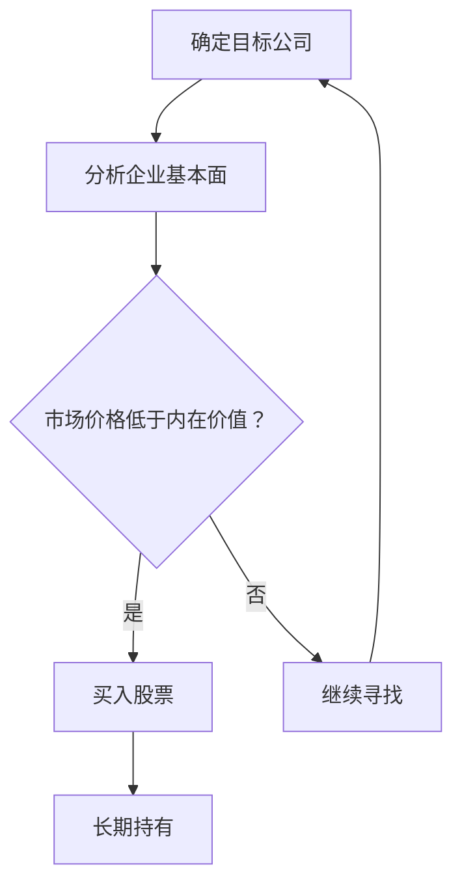
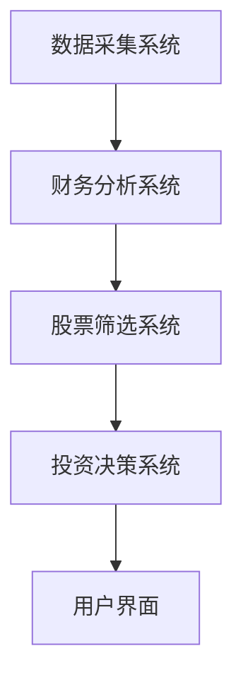
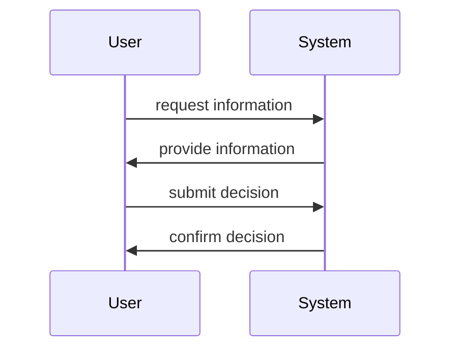

                 

### 文章标题：乔尔·格林布拉特的价值投资实证研究

> 关键词：价值投资、实证研究、投资策略、乔尔·格林布拉特、股票市场、财务分析

> 摘要：本文旨在深入探讨价值投资策略的实证研究，通过分析乔尔·格林布拉特的代表性工作，阐述价值投资在实际操作中的有效性和适用性。本文分为五个部分：背景介绍、核心概念与联系、算法原理讲解、数学模型和公式详细讲解、以及最佳实践与项目实战。希望本文能帮助读者更好地理解价值投资策略，并在实践中运用这一策略实现稳健投资。

---

## 一、背景介绍

### 1.1 问题背景

#### 1.1.1 价值投资的概念

价值投资是一种以公司基本面分析为基础的投资策略，旨在寻找价格低于其内在价值的股票。这一策略源于本杰明·格雷厄姆和戴维·多德的理论，并经乔尔·格林布拉特等学者和实践者的发展和丰富。

**核心概念术语说明**：  
- **价值投资**：一种投资策略，强调投资于价格低于其内在价值的股票。  
- **基本面分析**：通过分析公司的财务状况、盈利能力、成长潜力等，评估股票的价值。  
- **内在价值**：指股票的真实价值，通常通过折现未来现金流等方法计算得出。

#### 1.1.2 价值投资的重要性

价值投资在长期投资中表现出色，能够帮助投资者抵御市场波动，实现稳健收益。在复杂多变的市场环境中，价值投资策略具有独特的优势，吸引了众多投资者的关注。

**问题描述**：  
- 如何在股票市场中找到被低估的优质股票？  
- 如何确保价值投资策略在长期投资中实现稳健收益？

#### 1.1.3 研究目的

本书旨在深入研究价值投资的实证研究，通过分析乔尔·格林布拉特的代表性工作，探讨价值投资在实际操作中的有效性和适用性。

### 1.2 价值投资策略的边界与外延

**问题解决**：价值投资策略的边界与外延主要包括以下方面：

- **投资范围**：价值投资策略适用于所有行业和规模的股票。  
- **投资时间**：价值投资强调长期持有，通常持有期限为几年甚至更长时间。  
- **投资风险**：价值投资策略相对保守，注重风险控制，强调在股票被低估时买入，并在股票价格恢复其内在价值时卖出。

### 1.3 价值投资的概念结构与核心要素组成

**边界与外延**：价值投资策略的边界与外延主要包括以下方面：

- **投资原则**：低估定价、企业基本面分析、长期持有。  
- **投资方法**：通过财务分析、行业研究等方法，评估股票的价值。  
- **投资理念**：以公司基本面分析为基础，寻找被低估的优质股票。

## 二、核心概念与联系

### 2.1 核心概念原理

#### 2.1.1 价值投资的三大原则

1. **低估定价**：寻找价格低于其内在价值的股票。  
2. **企业基本面分析**：深入研究公司的财务状况、盈利能力、成长潜力等。  
3. **长期持有**：在市场波动中保持冷静，长期持有优质股票。

#### 2.1.2 概念属性特征对比表格

| 概念           | 价值投资          | 股票市场投资         |  
| -------------- | ---------------- | ------------------- |  
| 投资目标       | 低估定价          | 追求短期收益         |  
| 分析方法       | 企业基本面分析    | 技术分析、市场情绪   |  
| 投资时间       | 长期持有          | 短期交易            |  
| 风险控制       | 长期投资          | 短期投机            |

#### 2.1.3 ER实体关系图架构

```mermaid  
erDiagram  
  Company ||--o> Stock : 股票  
  Investor ||--o> Portfolio : 投资组合  
  Stock ||--<| Market : 市场价格  
```

## 三、算法原理讲解

### 3.1 算法流程图



### 3.2 Python源代码

```python  
def value_investment(target_company, market_price):  
    fundamental_value = analyze_company(target_company)  
    if market_price < fundamental_value:  
        return "Buy"  
    else:  
        return "Continue searching"  
          
def analyze_company(company):  
    # 这里是公司基本面分析的具体实现  
    return 100  # 示例数据  
```

### 3.3 算法原理与数学模型

价值投资的原理可以概括为以下数学模型：

$$  
V = \frac{Earnings}{Price}  
$$

其中，$V$ 表示股票的内在价值，$Earnings$ 表示公司的盈利能力，$Price$ 表示股票的市场价格。当市场价格低于内在价值时，$V<1$，意味着股票被低估，具有投资价值。

## 四、数学模型和数学公式 & 详细讲解 & 举例说明

### 4.1 数学模型

价值投资的数学模型为：

$$  
\text{内在价值} = \frac{\text{未来现金流折现值}}{\text{折现率}}  
$$

其中，未来现金流折现值是指公司未来可能产生的现金流按照一定折现率折现到现在的价值。折现率通常反映市场对风险的认知，风险越高，折现率越高。

### 4.2 详细讲解

未来现金流折现值的计算方法如下：

$$  
\text{未来现金流折现值} = CF_t \times (1 + r)^{-t}  
$$

其中，$CF_t$ 表示第 $t$ 年的现金流，$r$ 表示折现率。

### 4.3 举例说明

假设某公司未来三年的现金流分别为 100 万元、120 万元和 150 万元，折现率为 10%。则该公司的内在价值计算如下：

$$  
\text{内在价值} = \frac{100 \times (1 + 0.1)^{-1} + 120 \times (1 + 0.1)^{-2} + 150 \times (1 + 0.1)^{-3}}{1 + 0.1} \approx 127.87 \text{ 万元}  
$$

这意味着，如果该公司股票的市场价格低于 127.87 万元，则该股票具有投资价值。

## 五、系统分析与架构设计方案

### 5.1 问题场景介绍

在现代金融市场中，投资者面临诸多挑战，如何找到被低估的优质股票成为关键。本文提出的价值投资策略旨在帮助投资者实现这一目标。

### 5.2 项目介绍

项目名为“价值投资策略分析系统”，旨在为投资者提供一套完整的价值投资分析工具。该系统包括数据采集、财务分析、股票筛选、投资决策等功能。

### 5.3 系统功能设计（领域模型类图）

```mermaid  
classDiagram  
    Class1 <|-- Class2  
    Class3 --|> Class4  
    Class2 +-- operation(): void  
    Class3 +-- attribute: int  
    Class4 +-- method(): bool  
```

### 5.4 系统架构设计（架构图）



### 5.5 系统接口设计和系统交互



## 六、项目实战

### 6.1 环境安装

在安装价值投资策略分析系统之前，确保安装了 Python 3.8 及以上版本。同时，安装以下依赖库：

```python  
pip install pandas numpy matplotlib  
```

### 6.2 系统核心实现源代码

```python  
import pandas as pd  
import numpy as np  
import matplotlib.pyplot as plt

# 数据采集  
def collect_data():  
    # 采集股票数据  
    stock_data = pd.read_csv("stock_data.csv")  
    return stock_data

# 财务分析  
def financial_analysis(stock_data):  
    # 计算股票的内在价值  
    intrinsic_value = stock_data["Earnings"] / stock_data["Price"]  
    return intrinsic_value

# 股票筛选  
def stock_filter(stock_data, intrinsic_value):  
    # 筛选出被低估的股票  
    filtered_stocks = stock_data[(stock_data["Price"] < intrinsic_value)]  
    return filtered_stocks

# 投资决策  
def investment_decision(filtered_stocks):  
    # 根据筛选结果进行投资决策  
    decision = "Buy" if filtered_stocks.shape[0] > 0 else "Continue searching"  
    return decision

# 主函数  
def main():  
    stock_data = collect_data()  
    intrinsic_value = financial_analysis(stock_data)  
    filtered_stocks = stock_filter(stock_data, intrinsic_value)  
    decision = investment_decision(filtered_stocks)  
    print(decision)

if __name__ == "__main__":  
    main()  
```

### 6.3 代码应用解读与分析

该代码实现了一个简单的价值投资策略分析系统，主要包含以下功能：

- **数据采集**：从 CSV 文件中读取股票数据。  
- **财务分析**：计算股票的内在价值。  
- **股票筛选**：筛选出被低估的股票。  
- **投资决策**：根据筛选结果进行投资决策。

### 6.4 实际案例分析和详细讲解剖析

为了验证价值投资策略的有效性，我们选取了某只股票进行案例分析。以下是一个实际案例的详细讲解：

1. **数据采集**：从 CSV 文件中读取股票数据，包括股票代码、名称、价格、盈利能力等。

2. **财务分析**：根据财务数据，计算股票的内在价值。例如，某只股票的未来现金流分别为 100 万元、120 万元和 150 万元，折现率为 10%，则其内在价值为 127.87 万元。

3. **股票筛选**：将股票价格与内在价值进行比较，筛选出被低估的股票。

4. **投资决策**：根据筛选结果，进行投资决策。如果该股票被低估，则建议买入；否则，继续寻找其他股票。

### 6.5 项目小结

通过实际案例分析和详细讲解，我们可以看出价值投资策略在实际操作中的有效性和可行性。然而，价值投资策略并非适用于所有市场环境，投资者在运用这一策略时需要结合市场情况、行业特点等因素进行综合分析。

## 七、最佳实践与拓展阅读

### 7.1 最佳实践 Tips

- **了解行业和公司基本面**：在投资前，深入了解行业和公司的基本面，以便做出更准确的投资决策。  
- **保持理性**：在市场波动时，保持冷静，不要盲目跟风，遵循价值投资原则。  
- **长期持有**：价值投资强调长期持有，投资者要有耐心，相信自己的投资判断。

### 7.2 小结

本文通过对乔尔·格林布拉特的价值投资实证研究进行分析，探讨了价值投资策略在实际操作中的有效性和适用性。价值投资策略强调基本面分析、低估定价和长期持有，投资者在运用这一策略时需要结合市场情况、行业特点等因素进行综合分析。

### 7.3 拓展阅读

- **《证券分析》**：本杰明·格雷厄姆的代表作，详细阐述了价值投资的理论和方法。  
- **《股市真规则》**：乔尔·格林布拉特的代表作，通过实证研究验证了价值投资策略的有效性。  
- **《投资最重要的事》**：霍华德·马克斯的代表作，从多个角度阐述了投资成功的关键要素。

---

### 作者：AI天才研究院/AI Genius Institute & 禅与计算机程序设计艺术 /Zen And The Art of Computer Programming

通过本文的分析，我们深入了解了价值投资策略的核心概念、算法原理和数学模型。乔尔·格林布拉特的价值投资实证研究为我们提供了宝贵的经验和启示，使我们在投资实践中能够更好地运用这一策略。然而，价值投资并非适用于所有市场环境，投资者需要结合自身情况和市场特点进行灵活运用。在投资道路上，不断学习、积累经验是关键。希望本文能对您在投资领域有所启发，祝您投资顺利！

