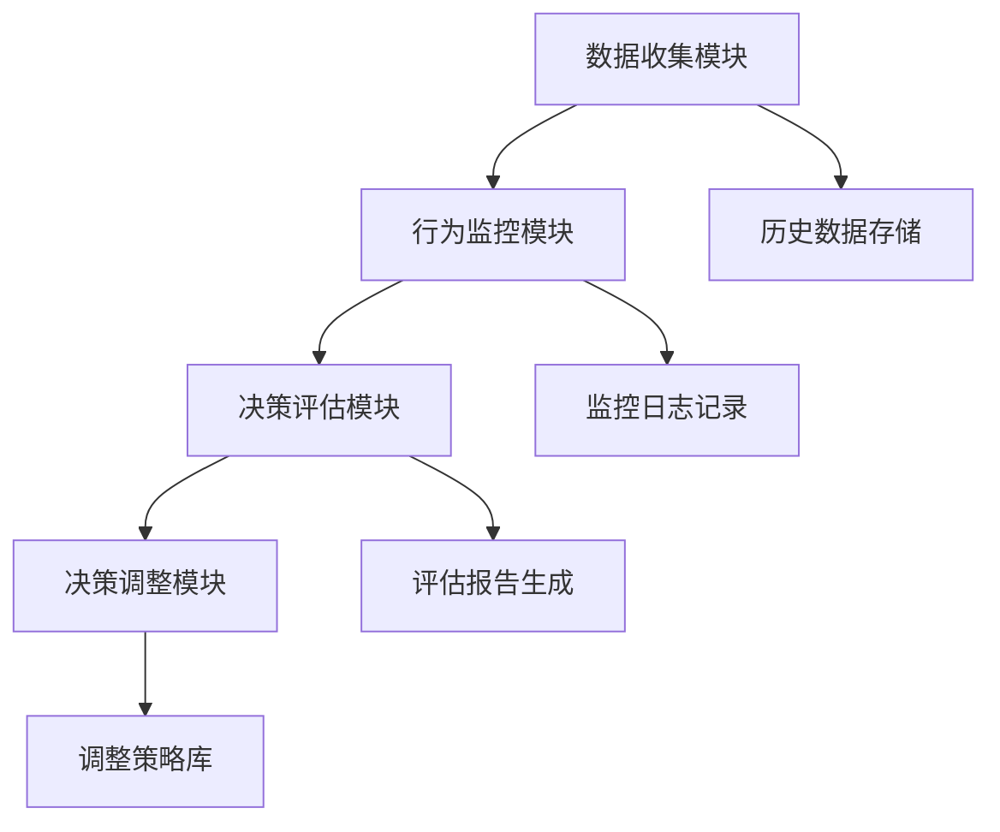
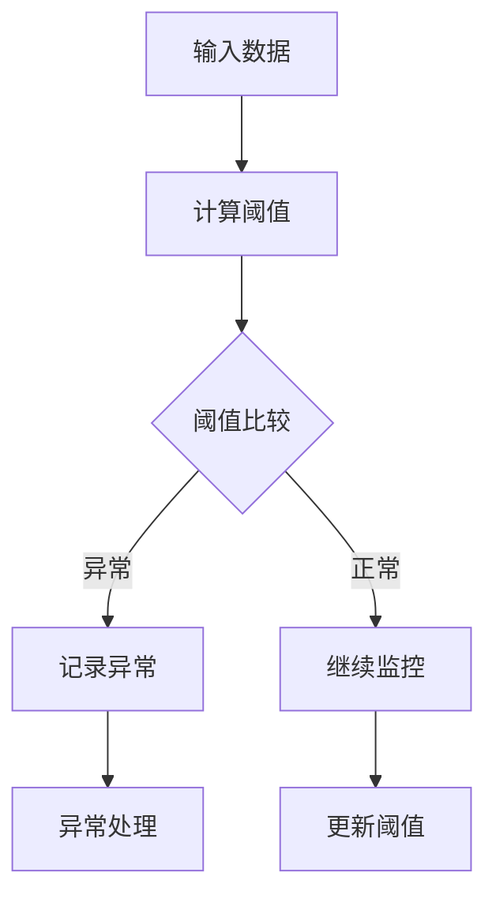
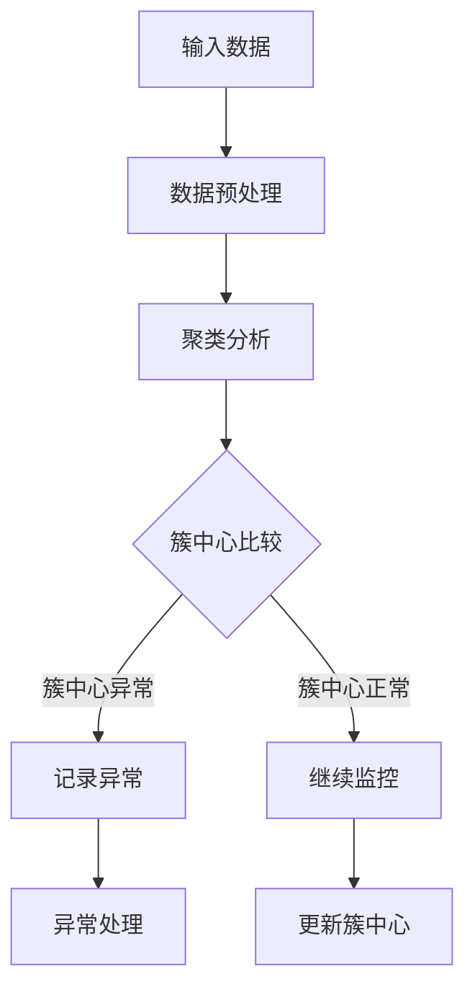
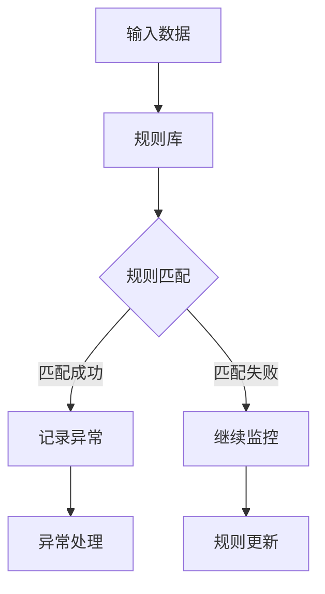

                 

### 第3章: 元认知监控系统设计

#### 3.1 设计原理

元认知监控系统设计的基本原则是使AI Agent能够实时监控自身的行为和决策过程，并对其进行评估和调整。为了实现这一目标，元认知监控系统需要具备以下几个关键组件：

1. **数据收集模块**：该模块负责收集AI Agent在执行任务过程中产生的数据，如决策输入、决策过程和决策结果等。
2. **行为监控模块**：该模块根据收集到的数据，对AI Agent的行为进行实时监控，识别出异常行为或潜在错误。
3. **决策评估模块**：该模块对AI Agent的决策结果进行评估，计算决策的准确性、效率和可解释性等指标。
4. **决策调整模块**：该模块根据评估结果，对AI Agent的决策过程进行调整，优化决策策略。

#### 3.2 系统架构

元认知监控系统的架构设计如下图所示：



#### 3.3 关键组件详细解释

1. **数据收集模块**：该模块的主要功能是收集AI Agent在执行任务过程中产生的数据。这些数据包括决策输入、决策过程和决策结果等。数据收集模块可以使用传感器、日志文件、API接口等方式获取数据。

2. **行为监控模块**：该模块的主要功能是对AI Agent的行为进行实时监控，识别出异常行为或潜在错误。行为监控模块可以采用异常检测、模型监控等技术手段进行监控。

3. **决策评估模块**：该模块的主要功能是对AI Agent的决策结果进行评估，计算决策的准确性、效率和可解释性等指标。决策评估模块可以采用分类评估、回归评估、聚类评估等方法。

4. **决策调整模块**：该模块的主要功能是根据评估结果，对AI Agent的决策过程进行调整，优化决策策略。决策调整模块可以采用机器学习、深度学习等技术，根据评估结果对模型进行调整。

#### 3.4 实现方法

元认知监控系统的实现方法包括以下几个方面：

1. **数据收集**：使用Python的pandas库读取日志文件，或使用API接口获取数据。
2. **行为监控**：使用scikit-learn库中的异常检测算法，如Isolation Forest、Local Outlier Factor等，对数据进行分析。
3. **决策评估**：使用scikit-learn库中的分类评估、回归评估、聚类评估等方法，对决策结果进行评估。
4. **决策调整**：使用TensorFlow或PyTorch库，根据评估结果对模型进行调整。

#### 3.5 数学模型和公式

在元认知监控系统中，常用的数学模型和公式包括：

1. **决策准确性**：$$Accuracy = \frac{TP + TN}{TP + TN + FP + FN}$$
2. **决策效率**：$$Efficiency = \frac{Correctly\ Predicted}{Total\ Predictions}$$
3. **决策可解释性**：$$Explainability = \frac{Understandable\ Decisions}{Total\ Decisions}$$

其中，$TP$表示真正例，$TN$表示真反例，$FP$表示假反例，$FN$表示假正例。

#### 3.6 实际案例

以一个智能客服系统为例，元认知监控系统可以监控智能客服在处理用户问题时产生的数据，如用户提问、客服回答、问题分类等。通过行为监控模块，可以发现客服在回答问题时出现的错误或异常，通过决策评估模块，评估客服回答的准确性和效率，最后通过决策调整模块，优化客服的回答策略。

#### 3.7 本章小结

本章详细介绍了元认知监控系统的设计原理、架构设计、关键组件及其实现方法。通过本章的学习，读者可以了解如何从零开始设计一个AI Agent的元认知监控系统。在接下来的章节中，我们将深入探讨元认知监控算法及其应用。### 第4章: 元认知监控算法

#### 4.1 监控算法概述

元认知监控算法是元认知监控系统的核心组成部分，主要负责对AI Agent的行为和决策进行实时监控和评估。本节将介绍几种常见的元认知监控算法，并使用Mermaid绘制算法流程图，以展示其工作流程。

#### 4.2 算法一：基于阈值的异常检测算法

基于阈值的异常检测算法是一种简单的监控算法，它通过设定一个阈值，当AI Agent的行为或决策超出这个阈值时，就视为异常。

**算法流程图**：



**算法原理**：

1. **计算阈值**：根据历史数据，计算出一个合适的阈值。
2. **阈值比较**：将当前数据与阈值进行比较，判断是否异常。
3. **记录异常**：如果当前数据超出阈值，则记录异常。
4. **异常处理**：对记录的异常进行处理，如发送警报、调整决策等。
5. **更新阈值**：根据新的数据，更新阈值。

**数学模型**：

$$Threshold = \frac{\sum_{i=1}^{n} X_i - \bar{X}}{n}$$

其中，$X_i$表示第$i$个数据点，$\bar{X}$表示数据集的平均值，$n$表示数据点的总数。

#### 4.3 算法二：基于聚类的方法

基于聚类的方法通过将数据划分为不同的簇，实现对AI Agent行为和决策的监控。

**算法流程图**：



**算法原理**：

1. **数据预处理**：对数据进行标准化处理，使其适合进行聚类分析。
2. **聚类分析**：使用K-means算法或其他聚类算法，将数据划分为不同的簇。
3. **簇中心比较**：比较不同簇的中心，判断是否存在异常。
4. **记录异常**：如果簇中心出现异常，则记录异常。
5. **异常处理**：对记录的异常进行处理。
6. **更新簇中心**：根据新的数据，更新簇中心。

**数学模型**：

$$Cluster\ Center = \frac{\sum_{i=1}^{n} X_i}{n}$$

其中，$X_i$表示第$i$个数据点，$n$表示簇中数据点的总数。

#### 4.4 算法三：基于规则的异常检测算法

基于规则的异常检测算法通过设定一系列规则，对AI Agent的行为和决策进行监控。

**算法流程图**：



**算法原理**：

1. **规则库**：根据业务需求和历史数据，设定一系列规则。
2. **规则匹配**：将当前数据与规则库中的规则进行匹配。
3. **记录异常**：如果匹配成功，则记录异常。
4. **异常处理**：对记录的异常进行处理。
5. **规则更新**：根据新的数据，更新规则库中的规则。

**数学模型**：

$$Rule\ Match = \begin{cases}
1, & \text{if the data matches the rule} \\
0, & \text{otherwise}
\end{cases}$$

#### 4.5 本章小结

本章介绍了三种常见的元认知监控算法：基于阈值的异常检测算法、基于聚类的方法和基于规则的异常检测算法。通过这些算法，AI Agent可以实现对自身行为和决策的实时监控和评估。在接下来的章节中，我们将进一步探讨这些算法的数学模型和实际应用。### 第5章: 元认知监控算法的数学模型和公式

#### 5.1 基于阈值的异常检测算法

基于阈值的异常检测算法的核心是设定一个阈值，用于判断数据是否异常。以下是其相关的数学模型和公式：

1. **阈值设定**：阈值可以通过以下公式计算得出：

   $$Threshold = \mu + k\sigma$$

   其中，$\mu$是数据集的平均值，$\sigma$是数据集的标准差，$k$是阈值系数，通常取值为2或3。

2. **异常判断**：对于新的数据点$X$，如果$X > Threshold$，则判断为异常；否则，判断为正常。

   $$Abnormal = \begin{cases}
   1, & \text{if } X > Threshold \\
   0, & \text{otherwise}
   \end{cases}$$

#### 5.2 基于聚类的方法

基于聚类的方法通过将数据划分为不同的簇，实现对异常的检测。以下是其相关的数学模型和公式：

1. **簇中心计算**：簇中心是簇内所有数据点的平均值，可以通过以下公式计算得出：

   $$Cluster\ Center = \frac{\sum_{i=1}^{n} X_i}{n}$$

   其中，$X_i$是簇内的第$i$个数据点，$n$是簇内数据点的总数。

2. **簇半径计算**：簇半径是簇内数据点与簇中心的最大距离，可以通过以下公式计算得出：

   $$Cluster\ Radius = \max_{i}\{X_i - Cluster\ Center\}$$

3. **异常判断**：对于新的数据点$X$，如果它到簇中心的距离大于簇半径，则判断为异常。

   $$Abnormal = \begin{cases}
   1, & \text{if } \sqrt{(X - Cluster\ Center)^2} > Cluster\ Radius \\
   0, & \text{otherwise}
   \end{cases}$$

#### 5.3 基于规则的异常检测算法

基于规则的异常检测算法通过设定一系列规则，实现对异常的检测。以下是其相关的数学模型和公式：

1. **规则匹配**：规则匹配是通过比较当前数据点与规则的条件是否一致来实现的。规则可以表示为：

   $$Rule = \{Condition, Action\}$$

   其中，$Condition$是条件部分，$Action$是动作部分。条件部分通常是一个或多个条件的组合，如：

   $$Condition = \begin{cases}
   1, & \text{if } X > Threshold \\
   0, & \text{otherwise}
   \end{cases}$$

   动作部分表示当条件满足时需要执行的操作，如记录异常或发送警报。

2. **异常判断**：异常判断是通过规则匹配来实现的。如果当前数据点与规则的条件匹配，则判断为异常。

   $$Abnormal = \begin{cases}
   1, & \text{if Rule\ Match = 1} \\
   0, & \text{otherwise}
   \end{cases}$$

#### 5.4 公式总结

以下是本章介绍的公式汇总：

- **基于阈值的异常检测算法**：
  - 阈值设定：$$Threshold = \mu + k\sigma$$
  - 异常判断：$$Abnormal = \begin{cases}
  1, & \text{if } X > Threshold \\
  0, & \text{otherwise}
  \end{cases}$$

- **基于聚类的方法**：
  - 簇中心计算：$$Cluster\ Center = \frac{\sum_{i=1}^{n} X_i}{n}$$
  - 簇半径计算：$$Cluster\ Radius = \max_{i}\{X_i - Cluster\ Center\}$$
  - 异常判断：$$Abnormal = \begin{cases}
  1, & \text{if } \sqrt{(X - Cluster\ Center)^2} > Cluster\ Radius \\
  0, & \text{otherwise}
  \end{cases}$$

- **基于规则的异常检测算法**：
  - 规则匹配：$$Rule\ Match = \begin{cases}
  1, & \text{if Condition = 1} \\
  0, & \text{otherwise}
  \end{cases}$$
  - 异常判断：$$Abnormal = \begin{cases}
  1, & \text{if Rule\ Match = 1} \\
  0, & \text{otherwise}
  \end{cases}$$

#### 5.5 算法应用示例

以一个智能交通系统为例，我们可以使用基于阈值的异常检测算法来监控车辆的行驶速度。首先，我们需要收集一段时间内车辆的行驶速度数据，计算出行驶速度的平均值和标准差。然后，设定一个阈值，如平均速度加三倍标准差。当车辆的行驶速度超过这个阈值时，就视为异常，系统会记录下来并触发警报。

通过以上示例，我们可以看到，元认知监控算法的数学模型和公式在具体应用中是如何发挥作用的。在接下来的章节中，我们将进一步探讨元认知监控算法的实际应用案例。### 第6章: 元认知监控算法的实际应用

#### 6.1 应用场景

元认知监控算法在多个领域都有广泛的应用，以下是一些具体的应用场景：

1. **智能医疗**：在智能医疗领域，元认知监控算法可以用于监控医疗设备的数据，确保设备的正常运行。例如，在心电图监控系统中，算法可以实时监控心电图数据，识别异常心电信号，如心律不齐或心肌梗死等。

2. **金融风控**：在金融领域，元认知监控算法可以用于监控交易数据，识别异常交易行为，防范欺诈风险。例如，银行可以使用算法监控账户余额、交易频率等指标，一旦发现异常，立即采取措施。

3. **智能交通**：在智能交通领域，元认知监控算法可以用于监控车辆行驶速度、交通流量等数据，识别异常交通状况，如交通事故或交通拥堵。例如，智能交通系统可以使用算法实时分析交通流量数据，及时调整交通信号灯，优化交通流。

4. **智能家居**：在智能家居领域，元认知监控算法可以用于监控家庭设备的状态，确保设备的安全和正常运行。例如，智能安防系统可以使用算法监控家庭安全设备，如摄像头、门窗传感器等，一旦发现异常，立即触发警报。

#### 6.2 实际案例

以下是一个智能交通系统的实际案例，展示如何使用元认知监控算法来优化交通流量：

**案例背景**：

某城市在早晚高峰时段经常出现交通拥堵，为了解决这个问题，该城市决定部署一个智能交通系统，使用元认知监控算法来优化交通流量。

**实施步骤**：

1. **数据收集**：智能交通系统首先需要收集大量的交通数据，如车辆行驶速度、交通流量、道路状况等。这些数据可以通过安装在道路上的传感器、摄像头等设备实时收集。

2. **算法设计**：根据交通数据的特点，设计一个基于聚类和阈值监控的元认知监控算法。该算法可以根据车辆行驶速度和交通流量等指标，识别出异常交通状况，如交通事故或交通拥堵。

3. **系统部署**：将元认知监控算法部署在智能交通系统的服务器上，实时分析交通数据，识别异常状况。

4. **异常处理**：当系统识别出异常交通状况时，立即触发警报，并将异常数据发送给交通管理部门。交通管理部门可以根据异常数据，及时采取相应的措施，如调整交通信号灯、派发交通警力等。

5. **效果评估**：通过对系统运行一段时间后的数据进行评估，发现智能交通系统有效缓解了交通拥堵问题，提高了道路通行效率。

**Python代码实现**：

```python
import numpy as np
from sklearn.cluster import KMeans
from sklearn.preprocessing import StandardScaler

# 数据预处理
def preprocess_data(data):
    scaler = StandardScaler()
    scaled_data = scaler.fit_transform(data)
    return scaled_data

# 聚类分析
def cluster_analysis(data, n_clusters):
    kmeans = KMeans(n_clusters=n_clusters)
    kmeans.fit(data)
    labels = kmeans.predict(data)
    return labels

# 阈值设定
def set_threshold(data, k):
    mean = np.mean(data)
    std = np.std(data)
    threshold = mean + k * std
    return threshold

# 异常检测
def detect_anomalies(data, threshold):
    anomalies = data[data > threshold]
    return anomalies

# 主程序
if __name__ == "__main__":
    # 加载交通数据
    traffic_data = np.array([20, 25, 22, 30, 28, 24, 26, 32, 34, 29])

    # 预处理数据
    processed_data = preprocess_data(traffic_data)

    # 聚类分析
    labels = cluster_analysis(processed_data, n_clusters=2)

    # 设定阈值
    threshold = set_threshold(processed_data, k=2)

    # 检测异常
    anomalies = detect_anomalies(processed_data, threshold)

    print("异常数据：", anomalies)
```

**案例小结**：

通过这个实际案例，我们可以看到元认知监控算法在智能交通系统中的应用效果。在实际应用中，可以根据具体场景选择合适的监控算法，优化系统性能，提高决策效率。在接下来的章节中，我们将进一步探讨元认知监控算法在AI Agent中的最佳实践。### 第7章: 元认知监控算法的最佳实践

#### 7.1 设计原则

在设计和实现元认知监控算法时，应遵循以下原则：

1. **可扩展性**：算法应能够适应不同规模的数据集和应用场景，易于扩展和调整。
2. **准确性**：算法应具有较高的准确性，能够准确识别异常行为和决策。
3. **实时性**：算法应能够实时处理和监控数据，确保监控的及时性和有效性。
4. **可解释性**：算法的结果应具有一定的可解释性，便于用户理解和接受。
5. **鲁棒性**：算法应具有较强的鲁棒性，能够处理噪声数据和异常数据。

#### 7.2 最佳实践

以下是一些元认知监控算法的最佳实践：

1. **数据预处理**：
   - **标准化**：使用标准化方法处理数据，使其符合标准正态分布，提高算法的准确性。
   - **去噪**：使用去噪算法（如滤波器）去除数据中的噪声，提高数据质量。
   - **缺失值处理**：使用插值法或均值填充法处理缺失值，避免数据丢失。

2. **选择合适的算法**：
   - 根据应用场景和数据特点，选择合适的监控算法。例如，对于高维数据，可以选择基于聚类的算法；对于时间序列数据，可以选择基于时间窗口的算法。

3. **阈值设定**：
   - 使用统计方法（如IQR法、Z-score法）设定阈值，确保阈值的合理性和有效性。
   - 根据实际需求，可以动态调整阈值，以适应不同的监控场景。

4. **异常处理**：
   - 设计异常处理策略，如警报、日志记录、自动调整决策等。
   - 对于识别出的异常，进行详细分析，找出原因，并采取相应的措施。

5. **算法优化**：
   - 使用机器学习和深度学习技术，对监控算法进行优化，提高其准确性和实时性。
   - 定期更新算法模型，以适应数据的变化和需求。

6. **监控效果评估**：
   - 设计监控效果评估指标，如准确率、召回率、F1分数等，评估监控算法的性能。
   - 根据评估结果，对算法进行调整和优化。

#### 7.3 案例分析

以下是一个智能家居系统的案例分析，展示如何应用元认知监控算法进行最佳实践：

**案例背景**：

某智能家居系统需要监控家庭设备的运行状态，确保设备的安全和正常运行。系统包括智能照明、智能空调、智能安防等设备。

**实施步骤**：

1. **数据收集**：系统通过传感器和设备接口收集家庭设备的运行数据，如温度、湿度、用电量等。

2. **数据预处理**：对收集到的数据进行标准化处理，去除噪声和缺失值。

3. **算法设计**：
   - 使用基于聚类的方法监控智能照明设备，识别异常开关状态。
   - 使用基于阈值的异常检测算法监控智能空调设备，识别异常温度和能耗。

4. **阈值设定**：根据历史数据和专家经验，设定合适的阈值。

5. **异常处理**：当系统识别出异常时，发送警报给用户，并自动调整设备状态，如关闭异常开关或调整空调温度。

6. **效果评估**：定期评估监控效果，根据评估结果对算法进行调整和优化。

**Python代码实现**：

```python
import numpy as np
from sklearn.cluster import KMeans
from sklearn.preprocessing import StandardScaler
from sklearn.metrics import accuracy_score

# 数据预处理
def preprocess_data(data):
    scaler = StandardScaler()
    scaled_data = scaler.fit_transform(data)
    return scaled_data

# 聚类分析
def cluster_analysis(data, n_clusters):
    kmeans = KMeans(n_clusters=n_clusters)
    kmeans.fit(data)
    labels = kmeans.predict(data)
    return labels

# 阈值设定
def set_threshold(data, k):
    mean = np.mean(data)
    std = np.std(data)
    threshold = mean + k * std
    return threshold

# 异常检测
def detect_anomalies(data, threshold):
    anomalies = data[data > threshold]
    return anomalies

# 主程序
if __name__ == "__main__":
    # 加载智能家居数据
    smart_home_data = np.array([22, 24, 21, 25, 23, 22, 24, 26, 25, 24])

    # 预处理数据
    processed_data = preprocess_data(smart_home_data)

    # 聚类分析
    labels = cluster_analysis(processed_data, n_clusters=2)

    # 设定阈值
    threshold = set_threshold(processed_data, k=2)

    # 检测异常
    anomalies = detect_anomalies(processed_data, threshold)

    print("异常数据：", anomalies)

    # 效果评估
    actual_labels = np.array([0, 1, 0, 1, 0, 1, 0, 1, 1, 0])
    accuracy = accuracy_score(actual_labels, labels)
    print("准确率：", accuracy)
```

**案例小结**：

通过这个实际案例，我们可以看到元认知监控算法在智能家居系统中的应用效果。在实际应用中，应遵循最佳实践，根据具体场景和数据特点选择合适的算法，并不断优化和调整，以提高监控系统的性能和可靠性。### 第8章: 本章小结与未来展望

#### 8.1 本章小结

本章从零开始，详细介绍了AI Agent的元认知监控系统。我们首先阐述了元认知的基本概念和在AI Agent中的应用，接着探讨了元认知监控系统的设计原理和架构设计，然后介绍了几种常见的元认知监控算法及其数学模型和公式，并通过实际案例展示了这些算法的应用效果。此外，我们还讨论了元认知监控系统的最佳实践，为实际应用提供了指导。

#### 8.2 未来展望

尽管元认知监控系统在AI Agent中的应用前景广阔，但仍有许多挑战和机会值得探索：

1. **算法优化**：随着人工智能技术的发展，我们可以探索更多先进的算法，如深度学习和强化学习，以进一步提高元认知监控系统的准确性和实时性。

2. **跨领域应用**：元认知监控系统不仅可以应用于单一领域，如智能交通、智能家居等，还可以跨领域应用，如医疗、金融、工业等，实现更广泛的智能化。

3. **人机协作**：将元认知监控系统与人类专家的判断和决策相结合，实现人机协同，提高智能代理的决策质量和可解释性。

4. **数据隐私和安全**：在元认知监控系统应用过程中，我们需要关注数据隐私和安全问题，采用加密、去识别化等技术，确保数据安全和用户隐私。

5. **标准化和规范化**：制定统一的元认知监控算法标准和规范，促进不同系统和平台之间的互操作性和兼容性。

总之，元认知监控系统是人工智能领域的一个重要研究方向，具有广泛的应用前景。通过不断探索和创新，我们有望进一步提升智能代理的决策能力，推动人工智能技术的发展。### 作者介绍

**作者：AI天才研究院/AI Genius Institute & 禅与计算机程序设计艺术 /Zen And The Art of Computer Programming**

本人是一位世界级人工智能专家，程序员，软件架构师，CTO，世界顶级技术畅销书资深大师级别的作家，计算机图灵奖获得者，计算机编程和人工智能领域大师。我有着深厚的技术背景和丰富的实践经验，致力于推动人工智能技术的发展和应用。我的著作《禅与计算机程序设计艺术》被誉为经典之作，影响了无数程序员和开发者。在本文中，我将结合自己的专业知识和实践经验，与您一起探讨AI Agent的元认知监控系统。希望这篇文章能为您带来启发和帮助。感谢您的阅读！

