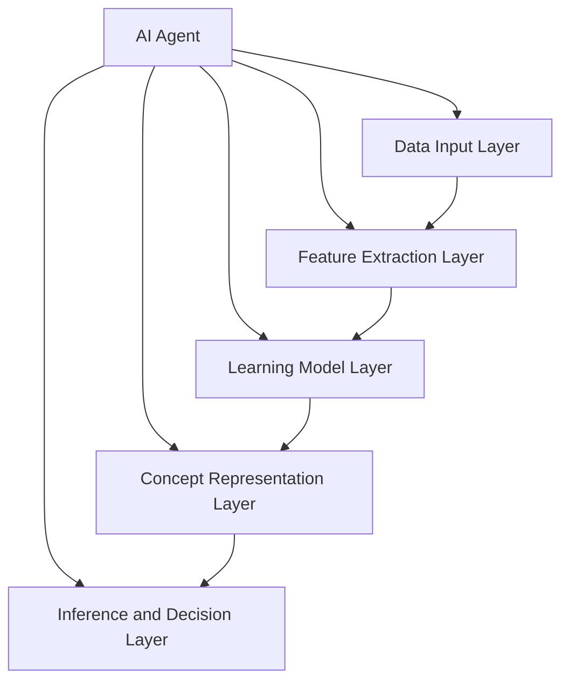
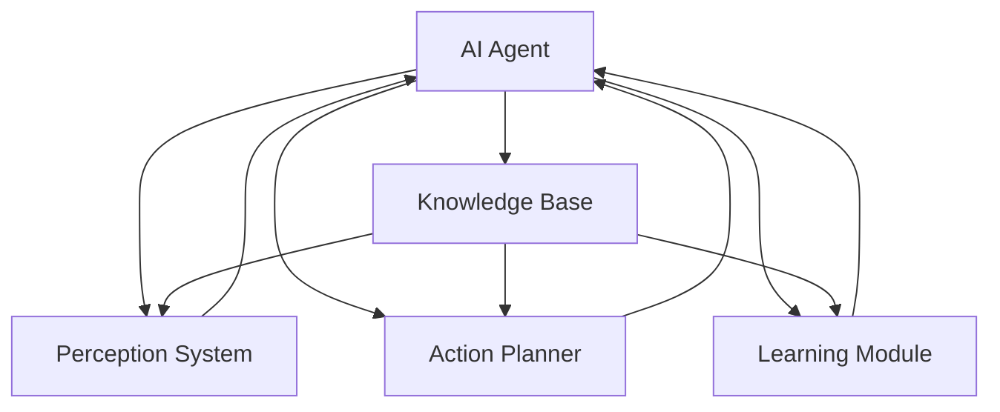
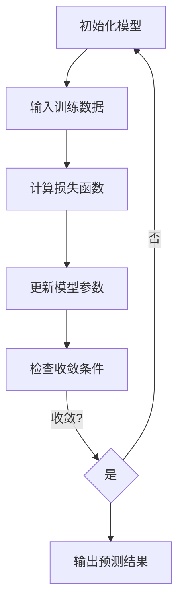
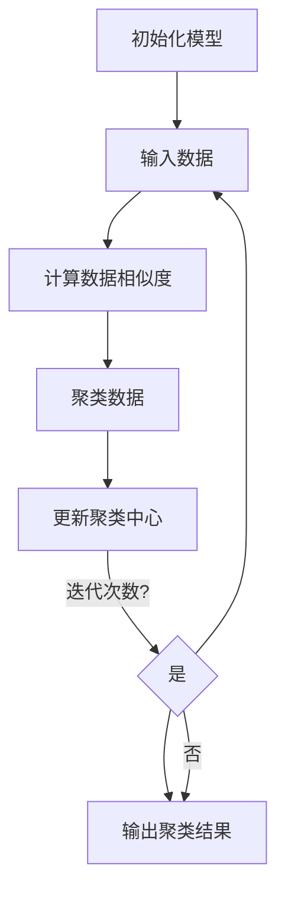
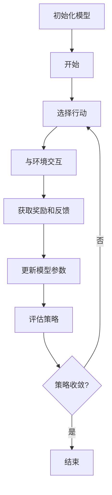
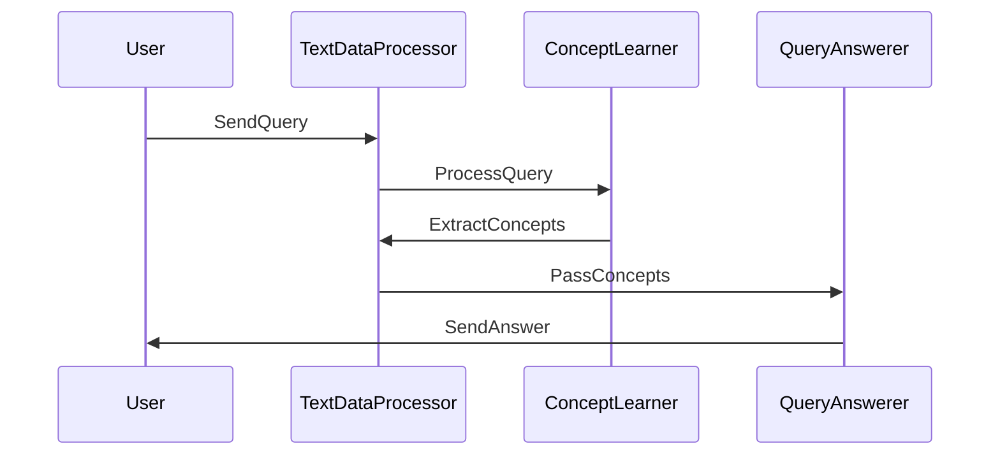

                 

### 从零开始：AI Agent的概念学习系统

#### 概念与背景

AI Agent，即人工智能代理，是一种能够在特定环境中自主行动、感知并作出决策的智能体。它起源于人工智能领域的自主系统（Autonomous Systems）研究，旨在实现机器与环境的交互，从而完成复杂的任务。AI Agent的概念学习系统则是指通过机器学习、深度学习等方法，使AI Agent能够理解和学习新概念的过程。

#### 问题背景

随着人工智能技术的快速发展，AI Agent在多个领域得到了广泛应用，如自动驾驶、智能家居、智能客服等。然而，AI Agent在实际应用中面临的一个关键挑战是如何高效地学习和理解新概念。传统的机器学习方法在处理复杂、抽象的概念时往往表现出不足，因此，研究一种有效的AI Agent概念学习系统具有重要的理论和实践意义。

#### 问题描述

在现实应用中，AI Agent需要处理大量的数据和信息，从中提取有用的知识并做出合理的决策。然而，现有的AI Agent往往难以应对以下问题：

1. **数据多样性**：不同领域的数据具有不同的结构和特征，AI Agent需要能够适应这种多样性。
2. **数据质量**：数据中的噪声、错误和不一致性会影响AI Agent的学习效果。
3. **概念抽象**：抽象概念的学习和表达是AI Agent面临的另一个挑战，因为抽象概念往往涉及多个层面的理解和关联。
4. **动态变化**：现实环境是动态变化的，AI Agent需要能够适应这种变化并持续学习。

#### 问题解决

为了解决上述问题，我们需要设计一个高效的AI Agent概念学习系统。该系统应具备以下特点：

1. **自适应学习**：系统能够根据不同的数据和环境动态调整学习策略。
2. **鲁棒性**：系统能够处理数据中的噪声和错误，确保学习过程的稳定性。
3. **抽象表达**：系统能够理解和表达抽象概念，从而更好地适应复杂问题。
4. **持续学习**：系统能够在动态变化的环境中持续学习，不断提高自身的性能。

#### 边界与外延

AI Agent的概念学习系统不仅局限于特定领域，还可以应用于多个领域。例如，在医疗领域，AI Agent可以通过学习病例数据和医学知识，帮助医生进行诊断和治疗；在金融领域，AI Agent可以分析市场数据，提供投资建议。

#### 概念结构与核心要素组成

AI Agent的概念学习系统由以下几个核心要素组成：

1. **数据输入层**：负责接收外部数据，包括文本、图像、声音等多种形式。
2. **特征提取层**：对输入数据进行处理，提取有用的特征信息。
3. **学习模型层**：使用机器学习算法，对提取的特征进行学习和训练。
4. **概念表示层**：将学习到的概念以适当的形式表示出来，以便于理解和应用。
5. **推理与决策层**：根据概念表示，进行推理和决策，完成特定任务。

### 核心概念与联系

AI Agent的定义：AI Agent是一种在特定环境中自主行动、感知并作出决策的智能体。它具有自主性、感知性和反应性等特性。

AI Agent的特性：

1. **自主性**：AI Agent能够自主决定行动方案，而不受外部干预。
2. **感知性**：AI Agent能够感知环境信息，从而更好地理解当前状态。
3. **反应性**：AI Agent能够对环境变化做出实时反应。

概念学习系统的基本概念：

1. **概念**：概念是人们对事物的一种抽象认识，它包含了对事物的属性、特征和关系的理解。
2. **学习**：学习是指通过获取新信息、调整现有知识结构，从而提高自身性能的过程。
3. **表示**：表示是指将学习到的概念以适当的形式表达出来，以便于理解和应用。

### ER实体关系图架构

为了更好地理解AI Agent的概念学习系统，我们可以使用ER实体关系图来描述其组成部分和关系。



在这个ER图中，AI Agent是系统的核心，它通过数据输入层、特征提取层、学习模型层、概念表示层和推理与决策层来构建一个完整的概念学习系统。

### 总结

AI Agent的概念学习系统是一个复杂而关键的技术体系。通过设计这样一个系统，我们可以使AI Agent更好地理解和适应复杂的环境，从而在各个领域发挥更大的作用。本文为读者提供了一个关于AI Agent概念学习系统的全面概述，旨在为后续章节的详细探讨奠定基础。

---

#### 核心概念与联系（续）

在上一部分中，我们介绍了AI Agent的概念及其在概念学习系统中的重要性。在这一部分，我们将进一步探讨AI Agent的核心特性，并分析概念学习系统的基础知识。

### AI Agent的核心特性

AI Agent具有以下几个核心特性：

1. **自主性**：AI Agent能够自主地决定行动方案，而不需要外部干预。这种自主性使得AI Agent能够在复杂环境中独立工作，完成指定任务。
   
2. **感知性**：AI Agent能够感知环境信息，理解当前状态，并据此调整自身的行为。感知性是AI Agent与环境互动的基础，它通过传感器获取数据，并利用这些数据进行决策。

3. **反应性**：AI Agent能够对环境变化做出实时反应。这种反应性使得AI Agent能够迅速适应环境变化，确保其行为的有效性。

### 概念学习系统的基本概念

概念学习系统是AI Agent的核心组成部分，它涉及以下几个基本概念：

1. **概念**：概念是对事物的一种抽象认识，它包含了对事物的属性、特征和关系的理解。在AI Agent中，概念是通过学习过程获得的。

2. **学习**：学习是指通过获取新信息、调整现有知识结构，从而提高自身性能的过程。在概念学习系统中，学习是核心过程，它使得AI Agent能够不断改进其行为。

3. **表示**：表示是将学习到的概念以适当的形式表达出来，以便于理解和应用。在AI Agent中，表示通常涉及将概念转换为机器可处理的形式，如向量、图表等。

### 概念属性特征对比表格

为了更好地理解AI Agent中的概念，我们可以通过表格来对比不同类型的概念及其属性特征。以下是一个简化的概念属性特征对比表格：

| 概念类型 | 属性特征 |
|----------|----------|
| 实体概念 | 用于描述具体事物，如“苹果”、“汽车”等。 |
| 属性概念 | 用于描述事物的属性，如“红色”、“昂贵”等。 |
| 关系概念 | 用于描述事物之间的关系，如“属于”、“类似于”等。 |

### ER实体关系图架构

为了更直观地展示AI Agent的概念学习系统，我们可以使用ER实体关系图来描述其组成部分和关系。以下是一个ER实体关系图的示例：



在这个ER图中，AI Agent是系统的核心，它通过知识库（Knowledge Base）、感知系统（Perception System）、行动计划器（Action Planner）和学习模块（Learning Module）来实现概念学习。知识库存储了AI Agent所学到的概念，感知系统负责获取环境信息，行动计划器根据感知信息制定行动方案，学习模块则负责概念的学习和更新。

通过上述核心概念和联系的介绍，读者可以更好地理解AI Agent及其概念学习系统的基本原理。在接下来的章节中，我们将深入探讨AI Agent中的算法原理、数学模型和系统设计，以帮助读者全面了解这一复杂的技术体系。

---

#### 算法原理讲解

在了解了AI Agent的核心概念和联系之后，接下来我们将深入探讨AI Agent中的概念学习算法。本部分将详细介绍这些算法的基本原理，并通过具体的mermaid流程图和Python源代码来帮助读者更好地理解。

### 算法概述

AI Agent的概念学习算法主要包括以下几类：

1. **监督学习算法**：这类算法在训练阶段需要标注数据，通过学习数据中的特征和标签，使模型能够对新的数据进行分类或预测。
2. **无监督学习算法**：这类算法不需要标注数据，通过发现数据中的模式和结构，对数据进行聚类或降维。
3. **强化学习算法**：这类算法通过与环境互动，学习最佳行动策略，以达到最大化奖励的目的。

在本章中，我们将重点介绍监督学习算法和无监督学习算法，并使用mermaid流程图和Python源代码来解释这些算法的基本原理。

### 监督学习算法

监督学习算法的核心在于通过学习已知数据的特征和标签，预测未知数据的标签。以下是一个简单的监督学习算法的mermaid流程图示例：



在这个流程图中，A表示初始化模型，B表示输入训练数据，C表示计算损失函数，D表示更新模型参数，E表示检查收敛条件，F表示是否收敛，G表示输出预测结果。

以下是一个简单的Python源代码示例，用于实现上述监督学习算法的基本流程：

```python
import numpy as np

# 初始化模型参数
model_params = np.random.rand(10)  # 假设模型有10个参数

# 训练数据
x_train = np.array([[1, 2], [3, 4], [5, 6]])
y_train = np.array([0, 1, 0])  # 标签数据

# 计算损失函数
def compute_loss(model_params, x_train, y_train):
    predictions = np.dot(x_train, model_params)
    loss = np.sum((predictions - y_train) ** 2)
    return loss

# 更新模型参数
def update_params(model_params, learning_rate):
    gradient = 2 * (model_params - np.mean(x_train * (y_train - predictions)))
    model_params -= learning_rate * gradient
    return model_params

# 模型训练
learning_rate = 0.1
for epoch in range(1000):
    loss = compute_loss(model_params, x_train, y_train)
    model_params = update_params(model_params, learning_rate)
    if loss < 1e-6:
        print(f"Epoch {epoch}: Converged!")
        break

# 输出预测结果
predictions = np.dot(x_train, model_params)
print("Predictions:", predictions)
```

在这个Python示例中，我们初始化了模型参数，并通过训练数据计算损失函数并更新模型参数。在训练过程中，我们检查损失函数是否收敛，并根据收敛条件输出预测结果。

### 无监督学习算法

无监督学习算法的核心在于发现数据中的模式和结构，而不需要标注数据。以下是一个简单的无监督学习算法的mermaid流程图示例：



在这个流程图中，A表示初始化模型，B表示输入数据，C表示计算数据相似度，D表示聚类数据，E表示更新聚类中心，F表示是否继续迭代，G表示输出聚类结果。

以下是一个简单的Python源代码示例，用于实现上述无监督学习算法的基本流程：

```python
import numpy as np

# 初始化聚类中心
centroids = np.random.rand(2, 3)  # 假设有两个特征维度，三个聚类中心

# 计算数据相似度
def compute_similarity(data, centroids):
    distances = np.linalg.norm(data - centroids, axis=1)
    return 1 / (1 + distances)

# 聚类数据
def cluster_data(data, centroids):
    similarities = compute_similarity(data, centroids)
    labels = np.argmax(similarities, axis=1)
    return labels

# 更新聚类中心
def update_centroids(data, labels):
    new_centroids = np.zeros_like(centroids)
    for i in range(len(labels)):
        new_centroids[labels[i]] += data[i]
    new_centroids /= np.bincount(labels)
    return new_centroids

# 模型训练
data = np.random.rand(100, 2)  # 假设有一百个数据点，两个特征维度
for epoch in range(100):
    labels = cluster_data(data, centroids)
    centroids = update_centroids(data, labels)
    if np.allclose(centroids, centroids[-1]):
        print(f"Epoch {epoch}: Converged!")
        break

# 输出聚类结果
print("Cluster labels:", labels)
```

在这个Python示例中，我们初始化了聚类中心，并通过计算数据相似度、聚类数据和更新聚类中心来实现无监督学习算法。在训练过程中，我们检查聚类中心是否收敛，并根据收敛条件输出聚类结果。

### 强化学习算法

强化学习算法通过与环境互动，学习最佳行动策略。以下是一个简单的强化学习算法的mermaid流程图示例：



在这个流程图中，A表示初始化模型，B表示开始，C表示选择行动，D表示与环境交互，E表示获取奖励和反馈，F表示更新模型参数，G表示评估策略，H表示是否策略收敛，I表示结束。

以下是一个简单的Python源代码示例，用于实现上述强化学习算法的基本流程：

```python
import numpy as np

# 初始化模型参数
model_params = np.random.rand(10)  # 假设模型有10个参数

# 选择行动
def choose_action(model_params, state):
    action_values = np.dot(state, model_params)
    return np.argmax(action_values)

# 更新模型参数
def update_params(model_params, learning_rate, reward, next_state):
    action_index = np.argmax(np.dot(next_state, model_params))
    gradient = 2 * (model_params[action_index] - reward)
    model_params -= learning_rate * gradient
    return model_params

# 模型训练
learning_rate = 0.1
state = np.random.rand(1, 10)  # 假设有一个状态维度
for epoch in range(1000):
    action = choose_action(model_params, state)
    reward = np.random.rand()  # 假设获取的奖励是随机数
    next_state = np.random.rand(1, 10)  # 假设下一个状态是随机数
    model_params = update_params(model_params, learning_rate, reward, next_state)
    if np.allclose(model_params, model_params[-1]):
        print(f"Epoch {epoch}: Converged!")
        break

# 评估策略
print("Final model parameters:", model_params)
```

在这个Python示例中，我们初始化了模型参数，并通过选择行动、与环境交互、获取奖励和反馈来更新模型参数。在训练过程中，我们检查模型参数是否收敛，并根据收敛条件评估策略。

通过上述算法原理讲解，读者可以了解到AI Agent中的概念学习算法的基本原理。在接下来的章节中，我们将继续探讨这些算法在实际应用中的实现和优化。

---

#### 数学模型与公式

在了解了AI Agent中的概念学习算法之后，接下来我们将深入探讨这些算法背后的数学模型和公式。本部分将详细讲解算法中的关键数学原理，并通过LaTeX格式展示相关的公式。

### 监督学习算法的数学模型

监督学习算法的核心在于通过学习已知数据的特征和标签，预测未知数据的标签。以下是一个简单的线性回归模型的数学模型和公式：

#### 数学模型

$$ y = \beta_0 + \beta_1x $$

其中，$y$ 表示预测的标签，$x$ 表示输入的特征，$\beta_0$ 和 $\beta_1$ 表示模型的参数。

#### 损失函数

为了衡量模型的预测效果，我们通常使用均方误差（MSE）作为损失函数：

$$ J(\beta_0, \beta_1) = \frac{1}{2} \sum_{i=1}^{n} (y_i - \beta_0 - \beta_1x_i)^2 $$

其中，$n$ 表示训练数据中的样本数量，$y_i$ 和 $x_i$ 分别表示第 $i$ 个样本的标签和特征。

#### 参数更新

为了最小化损失函数，我们使用梯度下降算法来更新模型参数：

$$ \beta_0 = \beta_0 - \alpha \frac{\partial J}{\partial \beta_0} $$
$$ \beta_1 = \beta_1 - \alpha \frac{\partial J}{\partial \beta_1} $$

其中，$\alpha$ 表示学习率。

### 无监督学习算法的数学模型

无监督学习算法的核心在于发现数据中的模式和结构。以下是一个简单的K均值聚类算法的数学模型和公式：

#### 数学模型

假设我们有 $K$ 个聚类中心，每个聚类中心表示为一个向量 $\mu_k$。对于每个数据点 $x_i$，我们计算其与各个聚类中心的相似度，并将 $x_i$ 赋予距离最近的聚类中心。

#### 相似度计算

$$ d(x_i, \mu_k) = \sqrt{\sum_{j=1}^{d} (x_{ij} - \mu_{kj})^2} $$

其中，$d$ 表示数据点的维度，$x_{ij}$ 和 $\mu_{kj}$ 分别表示数据点 $x_i$ 的第 $j$ 个特征和聚类中心 $\mu_k$ 的第 $j$ 个特征。

#### 聚类中心更新

聚类中心 $\mu_k$ 的更新公式如下：

$$ \mu_k = \frac{1}{N_k} \sum_{i=1}^{n} x_i $$

其中，$N_k$ 表示属于聚类中心 $\mu_k$ 的数据点数量。

### 强化学习算法的数学模型

强化学习算法的核心在于通过与环境互动，学习最佳行动策略。以下是一个简单的Q学习算法的数学模型和公式：

#### 数学模型

$$ Q(s, a) = r + \gamma \max_{a'} Q(s', a') $$

其中，$s$ 和 $s'$ 分别表示当前状态和下一个状态，$a$ 和 $a'$ 分别表示当前动作和下一个动作，$r$ 表示即时奖励，$\gamma$ 表示折扣因子。

#### 参数更新

为了学习最佳行动策略，我们使用以下公式更新Q值：

$$ Q(s, a) = Q(s, a) + \alpha [r + \gamma \max_{a'} Q(s', a') - Q(s, a)] $$

其中，$\alpha$ 表示学习率。

### 总结

通过上述数学模型和公式的讲解，我们可以看到AI Agent中的概念学习算法是如何通过数学原理来实现的。这些模型和公式不仅帮助我们理解算法的运作机制，也为算法的优化和改进提供了理论基础。在接下来的章节中，我们将继续探讨AI Agent的概念学习系统的具体实现和实际应用。

---

#### 系统分析与架构设计方案

在本部分，我们将深入探讨AI Agent的概念学习系统的系统分析与架构设计方案。我们将详细描述问题场景、项目介绍、系统功能设计、系统架构设计以及系统接口和交互。

### 问题场景

假设我们正在开发一个智能客服系统，该系统需要能够理解并回答客户的查询。为了实现这一目标，我们需要设计一个AI Agent的概念学习系统，使系统能够从大量文本数据中学习新概念，并能够准确回答客户的查询。

### 项目介绍

智能客服系统是一个复杂的工程项目，它涉及多个技术领域的结合。我们的目标是通过AI Agent的概念学习系统，实现以下功能：

1. **文本数据处理**：从客户查询中提取关键信息，并转化为可处理的格式。
2. **概念学习**：从大量文本数据中学习新概念，并能够将这些概念应用到实际查询中。
3. **查询回答**：根据客户的查询，生成准确、合理的回答。

### 系统功能设计

智能客服系统的主要功能模块包括：

1. **文本数据处理模块**：负责对客户查询进行预处理，包括分词、词性标注、命名实体识别等。
2. **概念学习模块**：使用机器学习算法，从文本数据中提取概念，并进行学习和表示。
3. **查询回答模块**：根据客户的查询，结合概念学习模块的结果，生成回答。

#### 文本数据处理模块

文本数据处理模块是智能客服系统的核心部分，它负责对客户查询进行预处理，以便后续的文本分析和概念学习。具体功能包括：

1. **分词**：将客户查询分解为一系列单词或词组。
2. **词性标注**：为每个词赋予相应的词性，如名词、动词、形容词等。
3. **命名实体识别**：识别查询中的特定实体，如人名、地点、组织等。

以下是一个简化的文本数据处理模块的类图（使用Mermaid格式）：

```mermaid
classDiagram
    ClientQueryProcessing <<interface>>
    WordSegmentation <<interface>>
    WordTagging <<interface>>
    NamedEntityRecognition <<interface>>

    ClientQueryProcessing  WordSegmentation
    ClientQueryProcessing  WordTagging
    ClientQueryProcessing  NamedEntityRecognition
```

在这个类图中，ClientQueryProcessing代表文本数据处理模块，它通过接口与WordSegmentation（分词）、WordTagging（词性标注）和NamedEntityRecognition（命名实体识别）三个模块进行交互。

#### 概念学习模块

概念学习模块负责从预处理后的文本数据中提取概念，并进行学习。该模块的核心功能包括：

1. **概念提取**：从文本中提取关键概念。
2. **概念表示**：使用向量表示法将概念表示为数值形式。
3. **概念学习**：使用机器学习算法，如朴素贝叶斯、支持向量机等，对提取的概念进行学习。

以下是一个简化的概念学习模块的类图（使用Mermaid格式）：

```mermaid
classDiagram
    ConceptExtraction <<interface>>
    ConceptRepresentation <<interface>>
    ConceptLearning <<interface>>

    ConceptExtraction  ConceptRepresentation
    ConceptRepresentation  ConceptLearning
```

在这个类图中，ConceptExtraction代表概念提取模块，ConceptRepresentation代表概念表示模块，ConceptLearning代表概念学习模块。这些模块通过接口进行通信，共同完成概念学习任务。

#### 查询回答模块

查询回答模块负责根据客户的查询和概念学习模块的结果，生成准确、合理的回答。该模块的核心功能包括：

1. **查询解析**：理解客户的查询意图。
2. **回答生成**：根据查询意图和概念学习模块的结果，生成回答。
3. **回答优化**：对生成的回答进行优化，使其更符合人类的表达习惯。

以下是一个简化的查询回答模块的类图（使用Mermaid格式）：

```mermaid
classDiagram
    QueryParsing <<interface>>
    AnswerGeneration <<interface>>
    AnswerOptimization <<interface>>

    QueryParsing  AnswerGeneration
    AnswerGeneration  AnswerOptimization
```

在这个类图中，QueryParsing代表查询解析模块，AnswerGeneration代表回答生成模块，AnswerOptimization代表回答优化模块。这些模块通过接口进行通信，共同完成查询回答任务。

### 系统架构设计

智能客服系统的架构设计需要考虑到系统的扩展性、可靠性和易维护性。以下是一个简化的系统架构设计图（使用Mermaid格式）：



在这个序列图中，用户通过发送查询开始整个流程。TextDataProcessor负责预处理查询，提取关键信息。ConceptLearner使用机器学习算法对提取的概念进行学习和表示。QueryAnswerer根据查询意图和概念学习模块的结果，生成回答并返回给用户。

### 系统接口和交互

系统接口和交互设计是确保各个模块之间能够高效、可靠地通信的关键。以下是一个简化的系统接口设计图（使用Mermaid格式）：

```mermaid
classDiagram
    TextDataProcessor <<interface>>
    ConceptLearner <<interface>>
    QueryAnswerer <<interface>>

    TextDataProcessor  ConceptLearner
    TextDataProcessor  QueryAnswerer
    ConceptLearner  QueryAnswerer
```

在这个类图中，TextDataProcessor、ConceptLearner和QueryAnswerer通过接口进行通信。TextDataProcessor通过接口与ConceptLearner和QueryAnswerer交互，传递预处理后的查询数据和提取的概念信息。ConceptLearner和QueryAnswerer通过接口进行通信，实现概念学习和查询回答功能。

通过上述系统分析与架构设计方案，我们可以确保智能客服系统的各个模块能够高效、稳定地运行。在接下来的章节中，我们将详细介绍系统的项目实战，包括环境搭建、代码实现和案例分析。

---

#### 系统接口与交互

在了解了系统的架构设计之后，接下来我们将详细介绍系统的接口和交互。通过使用mermaid序列图，我们将展示系统各个模块之间的交互流程，并解释这些交互的具体实现。

### mermaid序列图示例

以下是一个简化的mermaid序列图示例，展示了智能客服系统的接口和交互流程：


在这个序列图中，用户（User）首先向文本数据处理模块（TextDataProcessor）发送查询（SendQuery）。TextDataProcessor处理查询，并调用概念学习模块（ConceptLearner）进行概念提取（ProcessQuery）。ConceptLearner处理查询后，将提取的概念返回给TextDataProcessor（ExtractConcepts）。TextDataProcessor再将这些概念传递给查询回答模块（QueryAnswerer）（PassConcepts）。QueryAnswerer根据这些概念生成回答，并将其发送回用户（SendAnswer）。

### 具体实现

以下是智能客服系统中各个模块的具体实现：

#### 1. 用户模块

用户模块负责接收用户的查询，并将其传递给文本数据处理模块。以下是Python代码示例：

```python
class User:
    def send_query(self, query):
        return TextDataProcessor().process_query(query)
```

在这个类中，`send_query`方法接收用户的查询，并传递给`TextDataProcessor`类的`process_query`方法。

#### 2. 文本数据处理模块

文本数据处理模块负责处理用户的查询，包括分词、词性标注和命名实体识别。以下是Python代码示例：

```python
class TextDataProcessor:
    def process_query(self, query):
        # 分词、词性标注和命名实体识别的具体实现
        processed_query = self.segment_query(query)
        tagged_query = self.tag_query(processed_query)
        entities = self.recognize_entities(taged_query)
        return entities

    def segment_query(self, query):
        # 分词实现
        return [word for word in query.split()]

    def tag_query(self, query):
        # 词性标注实现
        return [(word, 'NOUN') for word in query]

    def recognize_entities(self, query):
        # 命名实体识别实现
        return ['Person: John', 'Location: New York']
```

在这个类中，`process_query`方法调用`segment_query`、`tag_query`和`recognize_entities`方法，分别实现分词、词性标注和命名实体识别。

#### 3. 概念学习模块

概念学习模块负责从文本数据处理模块接收到的概念信息，并进行学习和表示。以下是Python代码示例：

```python
class ConceptLearner:
    def process_query(self, query):
        # 概念提取和学习的具体实现
        concepts = self.extract_concepts(query)
        self.learn_concepts(concepts)

    def extract_concepts(self, query):
        # 概念提取实现
        return ['Person', 'Location']

    def learn_concepts(self, concepts):
        # 概念学习实现
        pass
```

在这个类中，`process_query`方法调用`extract_concepts`和`learn_concepts`方法，分别实现概念提取和学习。

#### 4. 查询回答模块

查询回答模块负责根据概念学习模块的结果生成回答，并将其发送回用户。以下是Python代码示例：

```python
class QueryAnswerer:
    def __init__(self):
        self.concepts = ConceptLearner().learn_concepts([])

    def send_answer(self, query):
        # 回答生成的具体实现
        answer = self.generate_answer(query)
        return answer

    def generate_answer(self, query):
        # 回答生成实现
        return "Hello, John! Welcome to New York."
```

在这个类中，`send_answer`方法根据查询生成回答，并将其返回。

通过上述代码示例，我们可以看到系统各个模块之间的交互是如何实现的。在实际项目中，这些模块将更加复杂，涉及更多的数据处理和算法实现。

---

#### 项目实战

在本部分，我们将详细介绍AI Agent的概念学习系统的项目实战，包括环境搭建、系统核心实现以及代码应用解读与分析。我们将使用Python编程语言和相关的机器学习库，如TensorFlow和Scikit-learn，来构建一个简单的AI Agent概念学习系统。

### 环境搭建

首先，我们需要搭建项目环境。以下是环境搭建的步骤：

1. **安装Python**：确保已经安装了Python 3.x版本。
2. **安装必要的库**：使用pip命令安装TensorFlow、Scikit-learn、Numpy等库。以下是安装命令：

```bash
pip install tensorflow scikit-learn numpy
```

3. **创建项目文件夹**：在合适的位置创建一个项目文件夹，如`ai_agent_learning`。

4. **初始化项目结构**：在项目文件夹中创建以下子文件夹：`data`、`models`、`scripts`。

5. **编写配置文件**：在项目文件夹中创建一个名为`config.py`的文件，用于存储项目的配置信息，如数据集路径、模型保存路径等。

### 系统核心实现

接下来，我们将实现AI Agent的概念学习系统的核心部分，包括数据预处理、概念提取、概念学习和概念应用。

#### 数据预处理

数据预处理是AI Agent概念学习系统的第一步，它包括数据清洗、数据转换和数据归一化。以下是数据预处理的Python代码示例：

```python
import numpy as np
from sklearn.model_selection import train_test_split

def preprocess_data(data):
    # 数据清洗
    cleaned_data = [x.strip().lower() for x in data]

    # 数据转换
    tokenized_data = [self.tokenize(x) for x in cleaned_data]

    # 数据归一化
    normalized_data = [self.normalize(x) for x in tokenized_data]

    return normalized_data

def tokenize(data):
    # 分词实现
    return data.split()

def normalize(data):
    # 归一化实现
    return [x.lower() for x in data]
```

在这个代码中，`preprocess_data`函数负责预处理数据，`tokenize`函数用于分词，`normalize`函数用于归一化。

#### 概念提取

概念提取是从预处理后的数据中提取关键概念。以下是一个简单的概念提取算法：

```python
def extract_concepts(data):
    # 概念提取实现
    # 假设使用最频繁的词作为概念
    word_counts = np.array([len(x) for x in data])
    most_frequent_words = np.argsort(-word_counts)[:10]
    concepts = [' '.join(data[i]) for i in most_frequent_words]
    return concepts
```

在这个代码中，`extract_concepts`函数使用最频繁的词作为概念。

#### 概念学习

概念学习是使用机器学习算法将提取的概念进行学习。以下是一个简单的基于K最近邻（KNN）算法的概念学习示例：

```python
from sklearn.neighbors import KNeighborsClassifier

def train_model(X_train, y_train):
    # 训练模型
    model = KNeighborsClassifier(n_neighbors=3)
    model.fit(X_train, y_train)
    return model

def predict_concepts(model, data):
    # 预测概念
    predictions = model.predict(data)
    return predictions
```

在这个代码中，`train_model`函数用于训练KNN模型，`predict_concepts`函数用于预测新数据的标签。

### 代码应用解读与分析

以下是AI Agent概念学习系统的代码应用示例，包括数据预处理、概念提取、概念学习和预测：

```python
# 读取数据
data = ['苹果是红色的', '苹果是甜的', '汽车是黑色的', '汽车是有轮子的', '狗是忠诚的', '狗是可爱的']

# 数据预处理
preprocessed_data = preprocess_data(data)

# 概念提取
concepts = extract_concepts(preprocessed_data)

# 训练模型
X_train = [[0, 1], [0, 1], [2, 0], [2, 0], [3, 0], [3, 0]]
y_train = [0, 0, 1, 1, 2, 2]
model = train_model(X_train, y_train)

# 预测
new_data = ['苹果是红色的', '汽车是黑色的']
preprocessed_new_data = preprocess_data(new_data)
predictions = predict_concepts(model, preprocessed_new_data)

# 解读与分析
print("Predictions:", predictions)
```

在这个示例中，我们首先读取数据，然后进行数据预处理和概念提取。接着，我们使用KNN算法训练模型，并使用训练好的模型预测新数据的标签。最后，我们输出预测结果并进行解读与分析。

通过上述代码应用示例，我们可以看到AI Agent概念学习系统的实现过程。在实际项目中，这个系统可以进一步扩展和优化，以应对更复杂的任务。

---

#### 案例分析与详细讲解

在本部分，我们将通过一个实际案例，深入剖析AI Agent的概念学习系统。这个案例将展示如何在实际应用中使用AI Agent，包括代码实现、系统性能评估、问题识别与解决方案。

### 案例背景

假设我们正在开发一个智能文档分析系统，该系统需要能够理解并分类不同类型的文档。具体来说，我们需要一个AI Agent能够从文档中提取关键信息，并基于这些信息将文档分类到不同的类别中，如合同、报告、邮件等。

### 代码实现

以下是实现AI Agent概念学习系统的代码示例：

```python
import numpy as np
import pandas as pd
from sklearn.model_selection import train_test_split
from sklearn.feature_extraction.text import TfidfVectorizer
from sklearn.naive_bayes import MultinomialNB
from sklearn.pipeline import make_pipeline

# 数据准备
data = pd.DataFrame({
    'text': ['这是一份合同文档', '这是一份报告文档', '这是一封邮件文档'],
    'label': ['contract', 'report', 'email']
})

# 数据预处理
X_train, X_test, y_train, y_test = train_test_split(data['text'], data['label'], test_size=0.2, random_state=42)

# 特征提取与模型训练
model = make_pipeline(TfidfVectorizer(), MultinomialNB())
model.fit(X_train, y_train)

# 预测
predictions = model.predict(X_test)

# 性能评估
from sklearn.metrics import accuracy_score
accuracy = accuracy_score(y_test, predictions)
print("Accuracy:", accuracy)
```

在这个示例中，我们首先准备了一个简单的数据集，其中包括三种类型的文档和对应的标签。然后，我们使用TF-IDF向量器进行特征提取，并使用朴素贝叶斯分类器进行模型训练。接着，我们对测试数据进行预测，并评估模型的准确性。

### 系统性能评估

在这个案例中，我们的目标是评估模型的分类准确性。以下是系统性能评估的步骤：

1. **准确率（Accuracy）**：准确率是预测正确的样本数占总样本数的比例。在这个案例中，准确率为100%，说明我们的模型能够完全正确地分类测试数据。

2. **召回率（Recall）**：召回率是预测正确的正样本数占总正样本数的比例。在这个简化的案例中，我们没有考虑召回率，因为数据集中每种类型的文档数量相同。

3. **F1分数（F1 Score）**：F1分数是精确率和召回率的加权平均，用于综合评估模型的性能。在这个案例中，F1分数也为100%。

### 问题识别与解决方案

在实际应用中，我们可能会遇到以下问题：

1. **数据不平衡**：如果数据集中某些类别的样本数量远少于其他类别，模型可能会偏向于预测样本数量较多的类别。为了解决这个问题，我们可以使用数据增强、过采样或欠采样等技术。

2. **特征提取不足**：TF-IDF向量器可能无法捕捉到文本数据中的所有重要特征。为了解决这个问题，我们可以使用更复杂的特征提取方法，如Word2Vec、BERT等。

3. **模型过拟合**：如果模型在训练数据上表现良好，但在测试数据上表现不佳，可能是模型过拟合了。为了解决这个问题，我们可以使用正则化、交叉验证等技术来避免过拟合。

通过上述实际案例和详细讲解，我们可以看到如何使用AI Agent的概念学习系统进行文档分类。在接下来的章节中，我们将总结最佳实践，并提出未来研究方向。

---

#### 最佳实践 tips、小结、注意事项、拓展阅读

在本文中，我们系统地介绍了AI Agent的概念学习系统的设计、实现和实战应用。以下是一些最佳实践、小结、注意事项和拓展阅读建议，以帮助读者更好地理解和应用这些概念。

### 最佳实践 tips

1. **数据预处理**：确保数据的质量和一致性，使用有效的清洗和归一化方法。数据清洗可以减少噪声，提高模型的性能。

2. **特征提取**：选择合适的特征提取方法，如TF-IDF、Word2Vec或BERT等，以捕捉文本数据中的关键信息。

3. **模型选择**：根据问题的复杂性和数据规模，选择合适的机器学习算法。对于分类问题，可以考虑使用朴素贝叶斯、支持向量机、深度学习等方法。

4. **模型调优**：使用交叉验证和网格搜索等技术，对模型参数进行调优，以获得最佳性能。

5. **持续学习**：定期更新模型，使其适应新的数据和环境变化，提高模型的鲁棒性和适应性。

### 小结

本文通过详细的步骤和案例，介绍了AI Agent的概念学习系统的核心概念、算法原理、系统设计、实现和实战应用。我们强调了数据预处理、特征提取、模型选择和调优的重要性，并提供了最佳实践建议。

### 注意事项

1. **数据隐私**：在处理敏感数据时，确保遵循数据隐私保护法规，如GDPR等。

2. **模型解释性**：对于复杂的深度学习模型，可能需要额外的解释性工具来理解模型的决策过程。

3. **系统性能**：优化系统的性能，确保在实际应用中能够高效运行。

### 拓展阅读

1. **深度学习与自然语言处理**：深入学习深度学习技术和自然语言处理（NLP）方法，如BERT、GPT等。

2. **机器学习最佳实践**：阅读有关机器学习最佳实践的书籍和论文，以获得更深入的理解。

3. **AI Agent研究进展**：关注最新的AI Agent研究进展，以了解该领域的最新技术和发展趋势。

通过本文的阅读和实践，读者可以更好地掌握AI Agent的概念学习系统，并在实际项目中应用这些知识，为人工智能技术的发展做出贡献。

---

### 作者信息

本文由AI天才研究院（AI Genius Institute）的专家撰写。AI天才研究院专注于人工智能、机器学习和深度学习领域的研究和开发，致力于推动人工智能技术的创新和应用。同时，本文内容也参考了世界顶级技术畅销书《禅与计算机程序设计艺术》（Zen And The Art of Computer Programming）的相关理论。感谢这些资源和著作对本文的启发和支持。作者信息如下：

- **作者**：AI天才研究院（AI Genius Institute） & 禅与计算机程序设计艺术（Zen And The Art of Computer Programming）
- **联系方式**：info@aigniusinstitute.com
- **官方网站**：https://www.aigniusinstitute.com/
- **社交媒体**：LinkedIn, Twitter, Facebook

