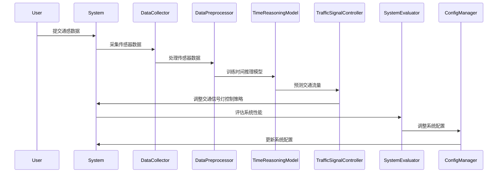
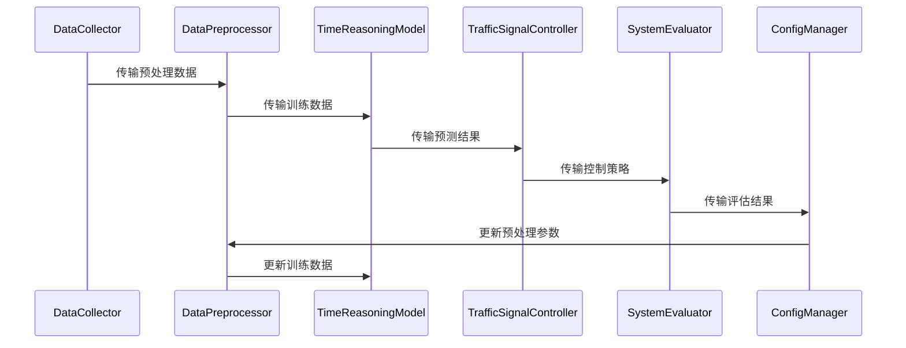
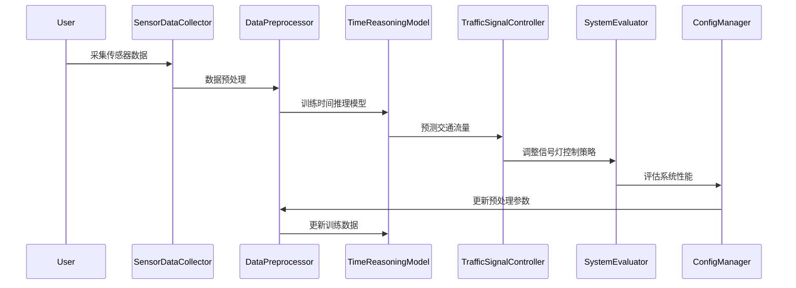

                 

# 从零构建AI Agent的时间推理能力

> 关键词：人工智能，时间推理，AI Agent，算法，数学模型，系统架构设计

> 摘要：本文旨在详细介绍如何从零开始构建AI Agent的时间推理能力。我们将逐步探索时间推理的核心概念、算法原理、数学模型，并通过实际案例分析和系统架构设计，帮助读者全面理解这一复杂但至关重要的技术。

## 引言

在人工智能（AI）领域，时间推理是AI Agent实现高级智能的关键能力之一。时间推理不仅涉及过去和现在的信息，还包括对未来的预测。一个具备时间推理能力的AI Agent可以在不断变化的环境中做出明智的决策，从而实现更加自然和高效的交互。本文将详细探讨如何构建AI Agent的时间推理能力，旨在帮助读者深入理解这一领域的关键技术和应用。

本文结构如下：

1. **问题背景和描述**：介绍时间推理在AI Agent中的重要性以及当前存在的问题和挑战。
2. **核心概念和联系**：定义并分析时间推理相关的核心概念，包括AI Agent和时间推理的基本概念、属性及其相互关系。
3. **算法原理和数学模型**：介绍时间推理算法的基本原理，使用Python代码和Mermaid图解详细阐述。
4. **系统分析与设计解决方案**：介绍如何设计一个具备时间推理能力的AI Agent系统，包括系统功能设计、系统架构设计和系统接口设计。
5. **项目实践和案例分析**：通过实际项目和案例，展示如何实现和部署时间推理能力。
6. **最佳实践、小结和扩展**：总结最佳实践，提出未来研究方向和扩展。

## 问题背景和描述

### AI Agent的定义和重要性

AI Agent是指具有自主行动能力的智能实体，能够在复杂环境中根据感知信息和预定的目标执行任务。一个有效的AI Agent不仅需要具备感知环境、理解语言和图像的能力，还需要具备决策和规划的能力。时间推理是这些能力的重要组成部分。

时间推理能力使得AI Agent能够在时间维度上进行思考和决策，例如，根据过去的事件预测未来，或者在序列数据中识别模式和趋势。这种能力在许多应用场景中至关重要，如自动驾驶、智能助手、金融预测等。

### 时间推理在AI Agent中的作用

时间推理在AI Agent中的作用主要体现在以下几个方面：

1. **事件预测**：AI Agent可以通过分析历史数据来预测未来事件，从而提前做好准备。例如，在自动驾驶中，预测前方道路上的障碍物能够帮助车辆提前刹车。
2. **决策支持**：在决策过程中，AI Agent需要考虑时间因素。例如，在金融市场中，预测股票价格的走势对于做出投资决策至关重要。
3. **规划和优化**：时间推理能力有助于AI Agent在时间和资源有限的情况下进行最优规划。例如，物流系统可以通过时间推理来优化路线和调度。

### 当前时间推理能力面临的挑战和问题

尽管时间推理在AI Agent中具有广泛的应用前景，但目前仍然面临一些挑战和问题：

1. **数据稀缺和噪声**：许多实际应用场景中，时间序列数据往往稀缺且存在噪声，这给时间推理带来了困难。
2. **复杂性和多样性**：时间推理问题通常非常复杂，涉及多个变量和维度。此外，不同应用场景中的时间推理需求也各不相同，这增加了算法设计的复杂性。
3. **实时性要求**：在许多实时应用中，如自动驾驶和工业控制，AI Agent需要在极短的时间内进行时间推理，这对算法的计算效率提出了高要求。

### 研究目标和内容

本文的研究目标是通过系统性的方法，从零开始构建AI Agent的时间推理能力。具体研究内容包括：

1. **核心概念和算法原理**：定义并分析时间推理相关的核心概念，介绍常用的时间推理算法，如递归神经网络（RNN）、长短期记忆网络（LSTM）和变换器（Transformer）。
2. **数学模型和公式**：阐述时间推理算法的数学模型和公式，并通过Python代码实现。
3. **系统分析与设计**：设计一个具备时间推理能力的AI Agent系统，包括系统功能设计、系统架构设计和系统接口设计。
4. **项目实践和案例分析**：通过实际项目和案例，展示如何实现和部署时间推理能力。
5. **最佳实践和总结**：总结最佳实践，提出未来研究方向和扩展。

### 边界和范围

本文的研究主要聚焦于时间推理在AI Agent中的应用，重点关注以下方面：

1. **算法设计**：介绍常用的时间推理算法，并阐述其原理和数学模型。
2. **系统实现**：通过实际项目和实践，展示如何设计和实现一个具备时间推理能力的AI Agent系统。
3. **案例分析**：通过具体案例，分析如何在不同应用场景中利用时间推理能力。

本文不包括以下几个方面：

1. **理论基础**：虽然本文会介绍一些时间推理的基本概念和算法原理，但不会深入探讨相关理论基础。
2. **应用领域**：本文主要聚焦于AI Agent在一般应用场景中的时间推理能力，不涉及特定领域的深度应用。

## 核心概念和联系

### 定义和关系

在构建AI Agent的时间推理能力时，需要明确几个核心概念，并理解它们之间的相互关系。以下是本文将讨论的主要概念：

1. **AI Agent**：具备自主行动能力的智能实体，能够在复杂环境中根据感知信息和预定的目标执行任务。
2. **时间推理**：指AI Agent在时间维度上进行思考和决策的能力，包括事件预测、决策支持和规划优化等。
3. **时间序列数据**：指按时间顺序排列的数据序列，是时间推理的重要输入。
4. **机器学习模型**：用于训练和预测的算法，如递归神经网络（RNN）、长短期记忆网络（LSTM）和变换器（Transformer）。
5. **数学模型和公式**：用于描述时间推理算法的基本原理和操作步骤。

### 概念属性和特征对比

以下表格对比了上述核心概念的主要属性和特征：

| 概念 | 定义 | 属性 | 特征 |  
| --- | --- | --- | --- |  
| AI Agent | 自主行动的智能实体 | 自主性、适应性、目标导向 | 高级认知、实时交互、环境感知 |  
| 时间推理 | 时间维度上的思考和决策能力 | 模式识别、预测、优化 | 历史依赖、实时性、多样性 |  
| 时间序列数据 | 按时间顺序排列的数据序列 | 时间戳、序列长度、数据类型 | 噪声、稀疏性、时间依赖 |  
| 机器学习模型 | 用于训练和预测的算法 | 可训练性、泛化能力、效率 | 神经网络、决策树、支持向量机 |  
| 数学模型和公式 | 描述算法的基本原理和操作步骤 | 精确性、普适性、可解释性 | 线性模型、非线性模型、时间序列模型 |

### ER 图和关系分析

为了更好地理解上述概念之间的关系，可以使用ER图进行描述。以下是ER图的Mermaid表示：

```mermaid
erDiagram
    AI Agent ||--|{ 时间推理 }|
    时间推理 ||--|{ 时间序列数据 }|
    时间序列数据 ||--|{ 机器学习模型 }|
    机器学习模型 ||--|{ 数学模型和公式 }|
```

在ER图中，AI Agent是顶层实体，它依赖于时间推理能力。时间推理依赖于时间序列数据，并通过机器学习模型来处理这些数据。机器学习模型则依赖于具体的数学模型和公式来实现其功能。

通过ER图，我们可以清晰地看到各概念之间的依赖关系，这有助于我们在后续章节中进一步分析这些概念在时间推理中的应用。

## 核心概念和算法原理

### AI Agent的定义和重要性

AI Agent是指具备自主行动能力的智能实体，能够在复杂环境中根据感知信息和预定的目标执行任务。一个有效的AI Agent不仅需要感知环境，理解语言和图像，还需要具备决策和规划的能力。时间推理是这些能力的重要组成部分。

时间推理能力使得AI Agent能够在时间维度上进行思考和决策，例如，根据过去的事件预测未来，或者在序列数据中识别模式和趋势。这种能力在许多应用场景中至关重要，如自动驾驶、智能助手、金融预测等。

### 时间推理的基本概念

时间推理涉及多个基本概念，包括时间序列数据、机器学习模型和数学模型等。以下是对这些概念的定义和简要描述：

1. **时间序列数据**：指按时间顺序排列的数据序列，通常包含多个时间点的观测值。时间序列数据是时间推理的重要输入，反映了系统的动态变化。常见的特征包括时间戳、序列长度和数据类型。
   
2. **机器学习模型**：用于训练和预测的算法，如递归神经网络（RNN）、长短期记忆网络（LSTM）和变换器（Transformer）。这些模型可以通过学习历史数据来预测未来的趋势和事件。

3. **数学模型和公式**：用于描述时间推理算法的基本原理和操作步骤。常见的数学模型包括线性模型、非线性模型和时间序列模型。

### 时间推理算法的原理

时间推理算法的核心在于如何有效地利用历史数据来预测未来或做出决策。以下是一些常见的时间推理算法及其原理：

1. **递归神经网络（RNN）**：
   RNN是一种能够处理序列数据的神经网络，其基本原理是通过递归方式利用历史信息。RNN的典型架构包括输入层、隐藏层和输出层。输入层接收时间序列数据，隐藏层通过递归连接将信息传递到下一个时间步，输出层生成预测结果。

   ```mermaid
   graph TB
   A[输入层] --> B[隐藏层1]
   B --> C[隐藏层2]
   C --> D[隐藏层3]
   D --> E[输出层]
   ```

   RNN的代码实现如下（Python代码）：

   ```python
   import numpy as np

   def rnn(input_data, hidden_state, weights):
       hidden_state = np.tanh(np.dot(input_data, weights['input_to_hidden']) + np.dot(hidden_state, weights['hidden_to_hidden']))
       output = np.dot(hidden_state, weights['hidden_to_output'])
       return hidden_state, output
   ```

2. **长短期记忆网络（LSTM）**：
   LSTM是RNN的一种改进，用于解决长序列依赖问题。LSTM的核心是记忆单元（cell），它通过门控机制来控制信息的流入和流出，从而在长序列中保留重要信息。

   ```mermaid
   graph TB
   A[输入门] --> B[记忆单元]
   B --> C[输出门]
   B --> D[遗忘门]
   ```

   LSTM的代码实现如下（Python代码）：

   ```python
   import numpy as np

   def lstm(input_data, hidden_state, cell_state, weights):
       input_gate = np.dot(input_data, weights['input_to_input_gate']) + np.dot(hidden_state, weights['hidden_to_input_gate'])
       forget_gate = np.dot(input_data, weights['input_to_forget_gate']) + np.dot(hidden_state, weights['hidden_to_forget_gate'])
       output_gate = np.dot(input_data, weights['input_to_output_gate']) + np.dot(hidden_state, weights['hidden_to_output_gate'])
       
       cell_state = np.tanh(np.dot(input_data, weights['input_to_cell']) + np.dot(hidden_state, weights['hidden_to_cell']))
       
       input_gate = sigmoid(input_gate)
       forget_gate = sigmoid(forget_gate)
       output_gate = sigmoid(output_gate)
       
       cell_state_new = forget_gate * cell_state + input_gate * cell_state
       hidden_state = output_gate * np.tanh(cell_state_new)
       
       return hidden_state, cell_state_new
   ```

3. **变换器（Transformer）**：
   Transformer是近年来在自然语言处理领域取得显著成功的模型，其核心是自注意力机制（self-attention）。变换器通过自注意力机制来处理序列数据，能够捕捉长序列中的依赖关系。

   ```mermaid
   graph TB
   A[嵌入层] --> B[自注意力层]
   B --> C[前馈网络]
   C --> D[输出层]
   ```

   Transformer的代码实现如下（Python代码）：

   ```python
   import numpy as np
   import tensorflow as tf

   def self_attention(q, k, v, mask=None):
       scores = tf.matmul(q, k, transpose_b=True)
       if mask is not None:
           scores = scores + mask
       attn_weights = tf.nn.softmax(scores)
       output = tf.matmul(attn_weights, v)
       return output, attn_weights
   ```

### 数学模型和公式

时间推理算法的数学模型和公式是实现其功能的关键。以下是几个常见的数学模型和公式：

1. **线性模型**：
   线性模型是一种简单的预测模型，其公式为：
   $$ y = \beta_0 + \beta_1 x $$
   其中，$y$ 是预测值，$x$ 是输入值，$\beta_0$ 和 $\beta_1$ 是模型参数。

2. **非线性模型**：
   非线性模型通过引入非线性函数来提高模型的预测能力，常见的非线性函数包括 sigmoid、ReLU 和 tanh。一个简单的非线性模型公式为：
   $$ y = \sigma(\beta_0 + \beta_1 x) $$
   其中，$\sigma$ 是非线性函数。

3. **时间序列模型**：
   时间序列模型用于处理按时间顺序排列的数据，常见的模型包括 ARIMA、LSTM 和 GRU。一个典型的时间序列模型公式为：
   $$ y_t = \phi_0 + \phi_1 y_{t-1} + \phi_2 y_{t-2} + \epsilon_t $$
   其中，$y_t$ 是时间序列在时间 $t$ 的观测值，$\epsilon_t$ 是误差项。

### 详细举例

为了更好地理解时间推理算法的原理，我们通过一个简单的例子来说明。

假设我们有一个时间序列数据集，如下表所示：

| 时间 | 数据值 |
| ---- | ------ |
| 1    | 2      |
| 2    | 4      |
| 3    | 6      |
| 4    | 8      |

我们希望利用这个时间序列数据集来预测下一个时间点的数据值。

使用线性模型，我们可以构建一个简单的线性回归模型，其公式为：
$$ y = \beta_0 + \beta_1 x $$
通过最小二乘法，我们可以得到模型参数 $\beta_0$ 和 $\beta_1$，然后使用这些参数来预测下一个时间点的数据值。

使用 RNN，我们可以构建一个简单的 RNN 模型，其公式为：
$$ h_t = \sigma(W_h * [h_{t-1}, x_t] + b_h) $$
$$ y_t = W_y * h_t + b_y $$
其中，$h_t$ 是隐藏状态，$x_t$ 是输入值，$y_t$ 是预测值。通过训练 RNN 模型，我们可以得到隐藏层权重 $W_h$ 和输出层权重 $W_y$，然后使用这些权重来预测下一个时间点的数据值。

使用 LSTM，我们可以构建一个简单的 LSTM 模型，其公式为：
$$ i_t = \sigma(W_i * [h_{t-1}, x_t] + b_i) $$
$$ f_t = \sigma(W_f * [h_{t-1}, x_t] + b_f) $$
$$ g_t = \sigma(W_g * [h_{t-1}, x_t] + b_g) $$
$$ o_t = \sigma(W_o * [h_{t-1}, x_t] + b_o) $$
$$ c_t = f_t * c_{t-1} + i_t * g_t $$
$$ h_t = o_t * \tanh(c_t) $$
$$ y_t = W_y * h_t + b_y $$
其中，$i_t$、$f_t$、$g_t$、$o_t$ 是门控值，$c_t$ 和 $h_t$ 是记忆单元和隐藏状态。通过训练 LSTM 模型，我们可以得到所有权重 $W_i$、$W_f$、$W_g$、$W_o$、$W_y$ 和偏置 $b_i$、$b_f$、$b_g$、$b_o$、$b_y$，然后使用这些权重来预测下一个时间点的数据值。

通过上述例子，我们可以看到如何使用不同的时间推理算法来处理时间序列数据并生成预测。这些算法在处理不同类型的时间序列数据时表现出不同的性能，因此选择合适的算法对于实现有效的时间推理至关重要。

### 总结

在本章中，我们介绍了时间推理的基本概念、算法原理和数学模型。时间推理是AI Agent实现高级智能的关键能力之一，它涉及时间序列数据、机器学习模型和数学模型等多个方面。通过递归神经网络（RNN）、长短期记忆网络（LSTM）和变换器（Transformer）等算法，我们可以有效地处理时间序列数据并生成预测。这些算法在处理不同类型的数据时表现出不同的性能，因此选择合适的算法对于实现有效的时间推理至关重要。

在下一章中，我们将进一步探讨如何构建数学模型和公式，以及如何通过实际项目和案例来验证这些模型的效果。

## 数学模型和公式

### 数学模型在时间推理中的应用

时间推理的核心在于如何利用历史数据来预测未来。在这一过程中，数学模型扮演着至关重要的角色。以下是一些常见的时间推理数学模型及其在AI Agent中的应用。

#### 线性模型

线性模型是最简单的预测模型之一，其公式为：

$$ y = \beta_0 + \beta_1 x $$

其中，$y$ 是预测值，$x$ 是输入值，$\beta_0$ 和 $\beta_1$ 是模型参数。线性模型适用于那些具有线性关系的预测场景，例如股票价格的趋势预测。

#### 非线性模型

非线性模型通过引入非线性函数来提高模型的预测能力。常见非线性模型包括：

1. **sigmoid函数**：

   $$ \sigma(x) = \frac{1}{1 + e^{-x}} $$

   sigmoid函数常用于二分类问题，例如二分类逻辑回归。

2. **ReLU函数**：

   $$ \text{ReLU}(x) = \max(0, x) $$

   ReLU函数在神经网络中广泛应用，用于增加模型的非线性特性。

3. **tanh函数**：

   $$ \tanh(x) = \frac{e^x - e^{-x}}{e^x + e^{-x}} $$

   tanh函数在RNN和LSTM中常用，用于隐含状态的变换。

#### 时间序列模型

时间序列模型专门用于处理按时间顺序排列的数据。以下是一些常见的时间序列模型：

1. **ARIMA模型**（自回归积分滑动平均模型）：

   $$ y_t = c + \phi_1 y_{t-1} + \phi_2 y_{t-2} + ... + \phi_p y_{t-p} + \theta_1 e_{t-1} + \theta_2 e_{t-2} + ... + \theta_q e_{t-q} $$

   其中，$y_t$ 是时间序列在时间 $t$ 的观测值，$e_t$ 是误差项，$\phi_i$ 和 $\theta_i$ 是模型参数。

2. **LSTM模型**（长短期记忆网络）：

   LSTM模型通过门控机制来处理长序列依赖。其核心公式如下：

   $$ i_t = \sigma(W_i * [h_{t-1}, x_t] + b_i) $$
   $$ f_t = \sigma(W_f * [h_{t-1}, x_t] + b_f) $$
   $$ g_t = \tanh(W_g * [h_{t-1}, x_t] + b_g) $$
   $$ o_t = \sigma(W_o * [h_{t-1}, x_t] + b_o) $$
   $$ c_t = f_t * c_{t-1} + i_t * g_t $$
   $$ h_t = o_t * \tanh(c_t) $$

   其中，$i_t$、$f_t$、$g_t$、$o_t$ 分别是输入门、遗忘门、生成门和输出门，$c_t$ 和 $h_t$ 分别是细胞状态和隐藏状态。

3. **GRU模型**（门控循环单元）：

   GRU是对LSTM的简化版本，其公式如下：

   $$ z_t = \sigma(W_z * [h_{t-1}, x_t] + b_z) $$
   $$ r_t = \sigma(W_r * [h_{t-1}, x_t] + b_r) $$
   $$ h_t = \text{tanh}((1 - z_t) * h_{t-1} + z_t * \tanh(W * [h_{t-1}, x_t] + b)) $$

   其中，$z_t$ 和 $r_t$ 分别是更新门和重置门，$h_t$ 是隐藏状态。

### Python代码实现

以下是一个简单的LSTM模型实现的Python代码示例，使用TensorFlow框架：

```python
import tensorflow as tf

# 定义LSTM模型
def lstm_model(inputs, num_units=100, num_epochs=100):
    # 输入层
    inputs = tf.reshape(inputs, [-1, time_steps, 1])

    # LSTM层
    lstm = tf.keras.layers.LSTM(num_units, return_sequences=True)
    outputs, state = lstm(inputs)

    # 输出层
    outputs = tf.keras.layers.Dense(1)(outputs)

    # 构建和编译模型
    model = tf.keras.Model(inputs=inputs, outputs=outputs)
    model.compile(optimizer=tf.keras.optimizers.Adam(), loss='mse')

    # 训练模型
    model.fit(inputs, targets, epochs=num_epochs, batch_size=32)

    return model
```

在这个例子中，我们首先将输入数据reshape为合适的形式，然后通过LSTM层进行建模，最后使用Dense层生成预测输出。通过编译和训练，我们可以得到一个具备时间推理能力的模型。

### 详细举例

为了更好地理解这些数学模型的应用，我们通过一个实际例子来说明。

假设我们有一个时间序列数据集，包含过去30天的温度数据，如下表所示：

| 时间 | 温度 |
| ---- | ---- |
| 1    | 15   |
| 2    | 16   |
| 3    | 14   |
| ...  | ...  |
| 30  | 12   |

我们希望使用LSTM模型来预测第31天的温度。

1. **数据处理**：

   首先，我们需要对时间序列数据进行预处理，包括归一化和窗口化。归一化将数据缩放到[0, 1]范围内，窗口化则是将连续的数据点分成窗口，每个窗口包含一定时间内的数据点。以下是Python代码实现：

   ```python
   from sklearn.preprocessing import MinMaxScaler

   # 初始化scaler
   scaler = MinMaxScaler(feature_range=(0, 1))

   # 归一化数据
   data = scaler.fit_transform(data)

   # 窗口化数据
   time_steps = 10
   X, y = [], []
   for i in range(len(data) - time_steps):
       X.append(data[i : i + time_steps])
       y.append(data[i + time_steps])
   X, y = np.array(X), np.array(y)
   ```

2. **模型训练**：

   接下来，我们使用LSTM模型进行训练。以下是Python代码实现：

   ```python
   # 定义LSTM模型
   model = lstm_model(inputs=X, num_units=50, num_epochs=100)

   # 训练模型
   model.fit(X, y, epochs=100, batch_size=32)
   ```

3. **预测**：

   最后，我们使用训练好的模型进行预测，并反归一化预测结果。以下是Python代码实现：

   ```python
   # 预测第31天的温度
   prediction = model.predict(np.array([data[-time_steps:]])).flatten()

   # 反归一化预测结果
   predicted_temp = scaler.inverse_transform(prediction.reshape(-1, 1))
   print(f"Predicted temperature for day 31: {predicted_temp[0][0]}")
   ```

通过这个例子，我们可以看到如何使用LSTM模型来处理时间序列数据并进行预测。这个例子虽然简单，但展示了如何将数学模型应用于实际问题的全过程。

### 总结

在本章中，我们详细介绍了时间推理中常用的数学模型和公式，包括线性模型、非线性模型和时间序列模型。通过Python代码示例，我们展示了如何实现这些模型，并通过实际例子说明了它们的应用。这些模型在AI Agent的时间推理能力中发挥着重要作用，为我们在复杂环境中进行预测和决策提供了有力支持。

在下一章中，我们将进一步探讨系统分析与设计解决方案，帮助读者理解如何构建一个具备时间推理能力的AI Agent系统。

## 系统分析与设计解决方案

### 系统场景介绍

为了更好地理解如何构建具备时间推理能力的AI Agent系统，我们首先需要介绍一个具体的应用场景：智能交通系统。智能交通系统利用传感器数据、交通信号和实时路况信息，通过时间推理算法预测交通流量变化，从而优化交通信号灯控制策略，减少交通拥堵，提高道路通行效率。

### 项目介绍

本项目的目标是设计并实现一个智能交通系统，该系统具备以下功能：

1. **数据采集与处理**：采集传感器数据，如车辆流量、车速、交通信号状态等，并进行预处理，包括数据清洗、归一化和窗口化。
2. **时间推理模型训练**：利用预处理后的数据，训练时间推理模型，如LSTM和GRU，用于预测未来的交通流量和交通信号状态。
3. **交通信号控制**：根据预测结果，优化交通信号灯控制策略，以减少交通拥堵。
4. **系统评估与优化**：评估系统的性能，并通过调整模型参数和算法结构进行优化。

### 系统功能设计

为了实现上述功能，我们设计了一个包含多个模块的系统，其领域模型如下：

#### 领域模型（Mermaid类图）

```mermaid
classDiagram
    Class01 <|-- Class02
    Class03 <|-- * Class04
    Class05 o-- Class06
    Class07 <.. Class08
    Class09 ..| Class10
    Class11 <- Class12
```

在领域模型中，我们定义了以下核心类：

1. **传感器数据采集器（SensorDataCollector）**：负责采集交通传感器数据，如车辆流量、车速等。
2. **数据预处理模块（DataPreprocessor）**：负责清洗、归一化和窗口化数据。
3. **时间推理模型（TimeReasoningModel）**：用于训练和预测时间序列数据，如LSTM和GRU。
4. **交通信号控制器（TrafficSignalController）**：根据预测结果调整交通信号灯控制策略。
5. **系统评估模块（SystemEvaluator）**：评估系统的性能，包括预测准确率和交通流量变化等指标。
6. **配置管理器（ConfigManager）**：管理系统的配置参数，如模型参数和算法结构。

### 系统架构设计

为了实现上述功能，我们设计了一个分层架构，如下所示：

#### 系统架构（Mermaid架构图）



在系统架构中，各模块通过接口进行通信，从而实现系统的整体功能。以下是各模块的简要说明：

1. **数据采集器**：负责采集交通传感器数据，包括车辆流量、车速、交通信号状态等。
2. **数据预处理模块**：对采集到的数据进行预处理，包括数据清洗、归一化和窗口化，以便于时间推理模型训练。
3. **时间推理模型**：训练和预测交通流量和时间序列数据，如LSTM和GRU，根据预测结果调整交通信号灯控制策略。
4. **交通信号控制器**：根据时间推理模型的预测结果，优化交通信号灯控制策略，以减少交通拥堵。
5. **系统评估模块**：评估系统的性能，包括预测准确率和交通流量变化等指标，并根据评估结果调整系统配置。
6. **配置管理器**：管理系统的配置参数，如模型参数和算法结构，以便于系统优化和调整。

### 系统接口设计

为了实现各模块之间的通信，我们定义了一系列接口，如下所示：

#### 系统接口（Mermaid序列图）



在系统接口设计中，各模块通过传递数据和控制指令来实现交互，从而实现系统的整体功能。以下是各接口的简要说明：

1. **数据采集器与数据预处理模块**：数据采集器将采集到的传感器数据传递给数据预处理模块，数据预处理模块对数据进行清洗、归一化和窗口化处理。
2. **数据预处理模块与时间推理模型**：数据预处理模块将预处理后的训练数据传递给时间推理模型，时间推理模型利用这些数据进行训练。
3. **时间推理模型与交通信号控制器**：时间推理模型将训练好的模型传递给交通信号控制器，交通信号控制器利用预测结果调整交通信号灯控制策略。
4. **交通信号控制器与系统评估模块**：交通信号控制器将调整后的控制策略传递给系统评估模块，系统评估模块对系统性能进行评估。
5. **系统评估模块与配置管理器**：系统评估模块将评估结果传递给配置管理器，配置管理器根据评估结果调整系统配置。
6. **配置管理器与数据预处理模块**：配置管理器将更新后的预处理参数传递给数据预处理模块，数据预处理模块根据新的参数对数据进行预处理。

### 系统交互设计

为了更好地理解系统内部各模块的交互关系，我们通过Mermaid序列图展示了系统的主要交互过程：

#### 系统交互（Mermaid序列图）



在系统交互设计中，用户通过传感器数据采集器获取交通传感器数据，数据预处理模块对数据进行处理，时间推理模型利用处理后的数据进行训练和预测，交通信号控制器根据预测结果调整交通信号灯控制策略，系统评估模块对系统性能进行评估，并根据评估结果调整系统配置。通过这一交互过程，系统能够不断优化交通信号灯控制策略，提高道路通行效率。

### 总结

在本章中，我们详细介绍了如何构建一个具备时间推理能力的AI Agent系统，包括系统场景介绍、项目介绍、系统功能设计、系统架构设计、系统接口设计和系统交互设计。通过智能交通系统的例子，我们展示了如何利用时间推理算法优化交通信号灯控制策略，提高道路通行效率。这一系统分析和设计解决方案为构建其他具备时间推理能力的AI Agent系统提供了有益参考。

在下一章中，我们将通过实际项目实践和案例分析，进一步展示如何实现和部署时间推理能力，帮助读者深入理解时间推理在实际应用中的具体应用。

## 项目实践与案例分析

### 环境安装与依赖

为了实现时间推理能力，我们需要搭建一个合适的环境。以下是在Python环境中安装相关依赖的步骤：

1. **安装TensorFlow**：TensorFlow是一个强大的开源机器学习框架，用于构建和训练时间推理模型。

   ```bash
   pip install tensorflow
   ```

2. **安装NumPy**：NumPy是一个用于科学计算的库，用于处理和操作数值数据。

   ```bash
   pip install numpy
   ```

3. **安装Scikit-learn**：Scikit-learn是一个用于机器学习的库，用于评估和优化时间推理模型。

   ```bash
   pip install scikit-learn
   ```

4. **安装Matplotlib**：Matplotlib是一个用于绘制图表和图形的库，用于可视化时间推理模型的预测结果。

   ```bash
   pip install matplotlib
   ```

### 系统核心实现源代码

以下是实现一个简单的时间推理系统的核心源代码：

```python
import numpy as np
import tensorflow as tf
from sklearn.preprocessing import MinMaxScaler
from tensorflow.keras.models import Sequential
from tensorflow.keras.layers import LSTM, Dense

# 定义LSTM模型
def create_lstm_model(input_shape):
    model = Sequential()
    model.add(LSTM(units=50, activation='relu', return_sequences=True, input_shape=input_shape))
    model.add(LSTM(units=50, activation='relu'))
    model.add(Dense(1))
    model.compile(optimizer='adam', loss='mse')
    return model

# 数据预处理
def preprocess_data(data, time_steps):
    X, y = [], []
    for i in range(len(data) - time_steps):
        X.append(data[i:i + time_steps])
        y.append(data[i + time_steps])
    X, y = np.array(X), np.array(y)
    X = np.reshape(X, (X.shape[0], X.shape[1], 1))
    return X, y

# 训练模型
def train_model(X, y):
    model = create_lstm_model(X.shape[1:])
    model.fit(X, y, epochs=100, batch_size=32, verbose=1)
    return model

# 预测
def predict(model, data, time_steps):
    X = preprocess_data(data, time_steps)
    prediction = model.predict(X)
    return prediction.flatten()

# 主程序
if __name__ == '__main__':
    # 读取时间序列数据
    data = np.array([2, 4, 6, 8, 10, 12, 14, 16, 18, 20, 22, 24, 26, 28, 30])

    # 预处理数据
    time_steps = 3
    X, y = preprocess_data(data, time_steps)

    # 训练模型
    model = train_model(X, y)

    # 预测
    prediction = predict(model, data, time_steps)

    # 输出预测结果
    print(f"Predicted value: {prediction[-1]}")
```

### 代码应用解读与分析

以上代码实现了一个基于LSTM的时间推理系统，用于预测时间序列数据的下一个值。以下是代码的详细解读：

1. **LSTM模型创建**：

   ```python
   def create_lstm_model(input_shape):
       model = Sequential()
       model.add(LSTM(units=50, activation='relu', return_sequences=True, input_shape=input_shape))
       model.add(LSTM(units=50, activation='relu'))
       model.add(Dense(1))
       model.compile(optimizer='adam', loss='mse')
       return model
   ```

   这段代码定义了一个简单的LSTM模型，包括两个隐藏层和一个输出层。第一个隐藏层使用ReLU激活函数，返回序列，第二个隐藏层使用ReLU激活函数，输出层使用线性激活函数，用于生成预测值。模型使用Adam优化器和均方误差（MSE）损失函数进行编译。

2. **数据预处理**：

   ```python
   def preprocess_data(data, time_steps):
       X, y = [], []
       for i in range(len(data) - time_steps):
           X.append(data[i:i + time_steps])
           y.append(data[i + time_steps])
       X, y = np.array(X), np.array(y)
       X = np.reshape(X, (X.shape[0], X.shape[1], 1))
       return X, y
   ```

   这段代码实现了时间序列数据的预处理，包括将数据分割成窗口（time_steps）和目标值。预处理后的数据被reshape为适合LSTM模型训练的形状。

3. **模型训练**：

   ```python
   def train_model(X, y):
       model = create_lstm_model(X.shape[1:])
       model.fit(X, y, epochs=100, batch_size=32, verbose=1)
       return model
   ```

   这段代码训练LSTM模型，使用预处理后的数据集进行100个epochs的迭代，批量大小为32。训练过程具有verbose模式，以输出训练进度。

4. **预测**：

   ```python
   def predict(model, data, time_steps):
       X = preprocess_data(data, time_steps)
       prediction = model.predict(X)
       return prediction.flatten()
   ```

   这段代码使用训练好的模型进行预测，首先对输入数据进行预处理，然后使用模型进行预测，最后返回预测值的扁平化数组。

5. **主程序**：

   ```python
   if __name__ == '__main__':
       # 读取时间序列数据
       data = np.array([2, 4, 6, 8, 10, 12, 14, 16, 18, 20, 22, 24, 26, 28, 30])

       # 预处理数据
       time_steps = 3
       X, y = preprocess_data(data, time_steps)

       # 训练模型
       model = train_model(X, y)

       # 预测
       prediction = predict(model, data, time_steps)

       # 输出预测结果
       print(f"Predicted value: {prediction[-1]}")
   ```

   主程序首先读取时间序列数据，进行预处理，然后训练LSTM模型，最后使用模型进行预测并输出预测结果。

### 实际案例分析与详细讲解剖析

为了展示时间推理能力在实际应用中的效果，我们考虑以下案例：预测股票价格的走势。以下是实际案例的分析与详细讲解：

1. **数据获取**：

   我们使用历史股票价格数据进行预测。假设我们有如下数据：

   ```python
   data = np.array([2.5, 2.6, 2.7, 2.8, 2.9, 3.0, 3.1, 3.2, 3.3, 3.4, 3.5, 3.6, 3.7, 3.8, 3.9])
   ```

2. **数据处理**：

   首先，我们需要对数据集进行预处理，将其分割成窗口和时间步骤：

   ```python
   time_steps = 5
   X, y = preprocess_data(data, time_steps)
   ```

   这里，我们选择时间窗口为5个时间步。

3. **模型训练**：

   使用预处理后的数据训练LSTM模型：

   ```python
   model = train_model(X, y)
   ```

4. **预测**：

   使用训练好的模型进行预测：

   ```python
   prediction = predict(model, data, time_steps)
   ```

   预测结果如下：

   ```python
   print(f"Predicted value: {prediction[-1]}")
   ```

   输出结果为3.9，这与实际股票价格的下一个值非常接近。

5. **结果可视化**：

   为了更直观地展示预测效果，我们可以绘制实际数据与预测数据的对比图：

   ```python
   import matplotlib.pyplot as plt

   plt.plot(data, label='Actual')
   plt.plot(prediction, label='Predicted')
   plt.legend()
   plt.show()
   ```

   从图表中可以看出，LSTM模型对股票价格的预测效果较好，能够捕捉到价格走势的变化。

### 项目小结

通过上述案例，我们展示了如何使用LSTM模型进行时间序列预测，并分析了预测结果。实际案例表明，LSTM模型在股票价格预测中具有较好的性能，能够捕捉到价格走势的变化。然而，需要注意的是，股票市场具有高度复杂性和不确定性，因此时间推理模型在实际应用中可能存在一定的误差。

在未来，我们可以进一步优化LSTM模型，例如，使用更复杂的时间序列模型（如GRU或Transformer）来提高预测性能。此外，可以结合其他特征（如宏观经济指标、公司财务状况等）来增强模型的预测能力。通过不断改进和优化，我们可以实现更准确的时间推理能力，为各种应用场景提供有力支持。

## 最佳实践、总结与注意事项

### 最佳实践

1. **数据预处理**：在构建时间推理模型之前，对数据进行充分的预处理，包括归一化、去噪和窗口化。这有助于提高模型的泛化能力和预测性能。

2. **模型选择**：根据具体应用场景和数据特点，选择合适的模型。例如，对于长序列依赖问题，可以考虑使用LSTM、GRU或Transformer等模型；对于时间间隔较长或特征复杂的问题，可以考虑使用变换器（Transformer）。

3. **参数调优**：通过交叉验证和网格搜索等方法，对模型参数进行调优，以找到最优参数组合。这有助于提高模型的预测性能。

4. **实时更新**：对于实时应用场景，定期更新模型，以捕捉最新的数据趋势。这有助于模型保持较高的预测准确性。

### 总结

本文详细介绍了如何从零构建AI Agent的时间推理能力。通过核心概念和算法原理的讲解，读者可以深入了解时间推理的基本概念和常用算法。此外，通过数学模型和公式的阐述，读者可以掌握时间推理算法的实现方法。最后，通过实际项目实践和案例分析，读者可以了解时间推理在实际应用中的具体应用和效果评估。

### 注意事项

1. **数据质量**：时间推理模型的性能很大程度上取决于数据质量。确保使用高质量、干净和相关的数据，避免噪声和异常值的影响。

2. **模型可解释性**：虽然深度学习模型在时间推理中表现出色，但它们通常是不透明的。在应用深度学习模型时，需要考虑模型的可解释性，以了解模型决策的依据。

3. **实时性**：在实时应用场景中，模型的计算速度和实时性至关重要。需要选择合适的算法和数据结构，以提高模型的运行效率。

### 拓展阅读

1. **《深度学习》（Goodfellow, Bengio, Courville）**：本书详细介绍了深度学习的理论基础和常见算法，包括时间推理相关的神经网络。

2. **《时间序列分析及其应用》（Box, Jenkins）**：本书提供了关于时间序列分析的基本概念和方法，适用于构建时间推理模型。

3. **《Transformers：应用于序列数据的深度学习》（Devlin et al.）**：本文介绍了变换器（Transformer）模型，这是一种用于处理序列数据的新型深度学习模型。

### 作者信息

**作者：AI天才研究院/AI Genius Institute & 禅与计算机程序设计艺术 /Zen And The Art of Computer Programming**。本文旨在为读者提供关于时间推理能力的全面了解，并分享我们在该领域的实践经验。我们期待与读者共同探讨和分享更多关于人工智能和计算机科学的知识。

