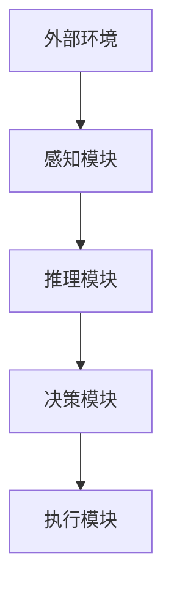
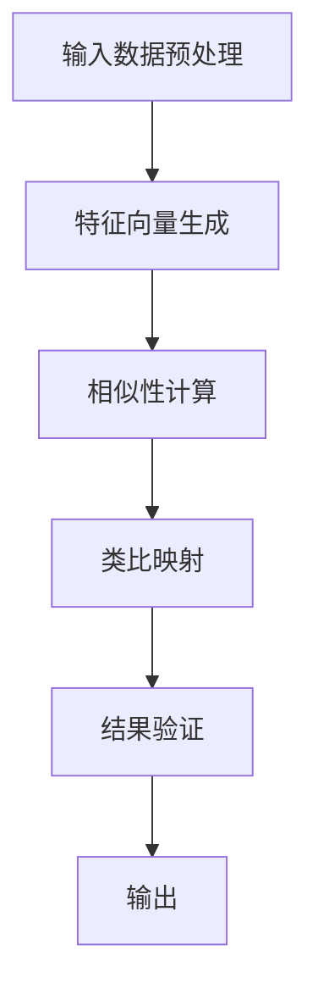

                 

# 从零构建AI Agent的类比推理系统

## 关键词

- AI Agent
- 类比推理
- 系统构建
- 人工智能算法
- 数学模型
- 系统性能评估

## 摘要

本文旨在探讨如何从零开始构建一个基于类比推理的AI Agent系统。我们将首先介绍AI Agent的基本概念，然后深入探讨类比推理的定义、应用及其数学模型。接着，我们将详细设计系统架构，并实现一个简单的类比推理算法。随后，通过一个实际项目案例，我们将展示如何将理论知识应用到实践中。最后，本文将总结最佳实践、注意事项，并对未来的发展趋势进行展望。

## 目录大纲

----------------------------------------------------------------

## 第1章 引言

## 1.1 问题背景

### 1.1.1 AI Agent的重要性

### 1.1.2 类比推理的定义与应用

### 1.1.3 当前研究现状与挑战

## 1.2 核心概念

### 1.2.1 AI Agent的基本概念

### 1.2.2 类比推理的基本概念

### 1.2.3 类比推理的要素与过程

## 1.3 类比推理的数学模型

### 1.3.1 数学模型简介

### 1.3.2 数学模型公式

### 1.3.3 数学模型实例

## 1.4 系统架构设计

### 1.4.1 系统架构概述

### 1.4.2 功能模块设计

### 1.4.3 架构设计图

## 1.5 类比推理算法实现

### 1.5.1 算法概述

### 1.5.2 算法流程图

### 1.5.3 Python代码实现

## 1.6 项目实战

### 1.6.1 环境安装

### 1.6.2 系统核心实现源代码

### 1.6.3 代码应用解读与分析

### 1.6.4 实际案例分析与详细讲解

### 1.6.5 项目小结

## 1.7 最佳实践与拓展

### 1.7.1 最佳实践 tips

### 1.7.2 小结

### 1.7.3 注意事项

### 1.7.4 拓展阅读

## 第2章 类比推理算法原理

## 第3章 类比推理算法优化

## 第4章 类比推理系统性能评估

## 第5章 类比推理系统的实际应用

## 第6章 类比推理系统的发展趋势

## 第7章 案例研究

----------------------------------------------------------------

## 第1章 引言

### 1.1 问题背景

在当今信息化时代，人工智能（AI）已经成为了推动科技进步和产业升级的重要力量。其中，AI Agent作为智能体的一种，具备自主学习和推理能力，正逐渐应用于各个领域，如自动驾驶、智能客服、金融风控等。类比推理作为一种重要的认知能力，是AI Agent实现智能行为的关键。

### 1.1.1 AI Agent的重要性

AI Agent是能够根据环境变化自主执行任务的实体。与传统的人工智能系统不同，AI Agent不仅仅是一个执行预设任务的“机器人”，它能够在面对未知问题时，通过学习、推理等方式，自主地制定决策并执行。这使得AI Agent在复杂动态的环境中具有更高的适应能力和智能水平。

### 1.1.2 类比推理的定义与应用

类比推理（Analogical Reasoning）是一种基于相似性进行推理的方法。在AI领域，类比推理被广泛应用于知识推理、问题解决、决策制定等方面。通过将新的问题与已有问题的相似性进行识别和比较，AI Agent能够快速地找到解决问题的方法和策略。

### 1.1.3 当前研究现状与挑战

目前，类比推理的研究主要集中在以下几个方面：

1. **相似性度量**：如何准确地度量两个问题或对象之间的相似性，是类比推理的核心问题。
2. **知识表示**：如何有效地表示和存储知识，以便在类比推理过程中快速检索和应用。
3. **推理算法**：如何设计高效的推理算法，使得AI Agent能够在有限的时间内完成复杂的推理任务。

然而，当前的研究还存在一些挑战：

1. **跨领域的类比推理**：如何在不同的领域之间进行有效的类比推理，仍是一个尚未解决的问题。
2. **推理的可解释性**：如何使得AI Agent的推理过程更加透明和可解释，以便人类用户能够理解和信任。
3. **实时性**：如何在保证推理准确性的同时，提高推理的实时性，以满足实时应用的需求。

本文将系统地探讨如何从零开始构建一个基于类比推理的AI Agent系统，旨在为读者提供一个全面、详细的实践指南。接下来，我们将逐步深入到核心概念、数学模型、系统架构设计和实现细节中，帮助读者全面理解并掌握类比推理系统的构建方法。

### 1.2 核心概念

在构建AI Agent的类比推理系统中，理解核心概念是至关重要的。以下是几个关键概念的定义、应用和相互关系。

#### 1.2.1 AI Agent的基本概念

AI Agent是一种能够自主行动、感知环境和执行任务的实体。它具备以下基本特性：

1. **自主性**：AI Agent能够根据环境和目标自主地做出决策。
2. **适应性**：AI Agent能够在不同环境和条件下灵活调整其行为。
3. **学习性**：AI Agent能够通过经验和数据不断改进自身的行为和能力。

AI Agent在自动驾驶、智能客服和游戏AI等领域有广泛的应用。例如，自动驾驶车辆需要实时感知道路情况并做出驾驶决策，这依赖于AI Agent的自主学习和推理能力。

#### 1.2.2 类比推理的基本概念

类比推理是一种基于相似性的推理方法，它通过比较不同情境之间的相似性来推导出结论。类比推理的核心概念包括：

1. **类比对象**：指用于推理的两个或多个情境，它们在特征上有相似性。
2. **相似性度量**：用于计算两个对象之间相似度的方法，常用的方法包括统计度量、结构比较和语义相似性等。
3. **类比映射**：将一个情境的特征映射到另一个情境的过程，用于推导出新的结论。

类比推理在问题解决和决策制定中有广泛应用，例如，在医疗诊断中，通过将新的病例与已知病例进行类比，可以快速提出可能的诊断方案。

#### 1.2.3 类比推理的要素与过程

类比推理通常包括以下几个基本要素和过程：

1. **情境识别**：识别需要进行推理的两个或多个情境。
2. **特征提取**：从情境中提取关键特征，用于相似性度量。
3. **相似性计算**：计算不同情境之间的相似度。
4. **类比映射**：将一个情境的特征映射到另一个情境，推导出新的结论。
5. **结果验证**：验证推导出的结论是否合理。

在构建类比推理系统时，这些要素和过程需要通过系统设计和技术实现来有机整合，以确保推理过程的准确性和效率。

### 1.3 类比推理的数学模型

类比推理作为一种基于相似性的推理方法，其核心在于如何准确度量情境之间的相似度，并利用这些相似度进行推理。以下是类比推理的数学模型简介、公式及其应用实例。

#### 1.3.1 数学模型简介

类比推理的数学模型通常基于距离函数、相似性矩阵和映射函数等基本概念。以下是一个简化的数学模型框架：

1. **距离函数（d）**：用于度量两个情境之间的距离，距离越小，相似度越高。
2. **相似性矩阵（S）**：一个n×n的矩阵，其中S(i, j)表示第i个情境与第j个情境的相似度。
3. **映射函数（f）**：将一个情境的特征映射到另一个情境的函数。

#### 1.3.2 数学模型公式

类比推理的数学模型可以表示为以下公式：

\[ \text{similarity}(i, j) = \frac{1}{\sqrt{d(i, j)}} \]

其中，similarity(i, j) 表示情境i和情境j的相似度，d(i, j) 表示情境i和情境j之间的距离。

#### 1.3.3 数学模型实例

假设有两个情境A和B，每个情境有3个特征：温度、风速和湿度。我们可以使用欧几里得距离来计算它们之间的距离，如下所示：

\[ d(A, B) = \sqrt{(T_A - T_B)^2 + (W_A - W_B)^2 + (H_A - H_B)^2} \]

其中，\( T_A, T_B \) 分别是情境A和B的温度，\( W_A, W_B \) 分别是情境A和B的风速，\( H_A, H_B \) 分别是情境A和B的湿度。

假设情境A的温度为30°C，风速为5m/s，湿度为60%；情境B的温度为32°C，风速为10m/s，湿度为55%。我们可以计算它们之间的距离：

\[ d(A, B) = \sqrt{(30 - 32)^2 + (5 - 10)^2 + (60 - 55)^2} \]
\[ d(A, B) = \sqrt{(-2)^2 + (-5)^2 + (5)^2} \]
\[ d(A, B) = \sqrt{4 + 25 + 25} \]
\[ d(A, B) = \sqrt{54} \]
\[ d(A, B) \approx 7.35 \]

然后，我们可以计算相似度：

\[ \text{similarity}(A, B) = \frac{1}{\sqrt{7.35}} \]
\[ \text{similarity}(A, B) \approx 0.69 \]

这意味着情境A和B之间的相似度大约为0.69，即它们之间具有较高的相似性。

通过以上实例，我们可以看到如何使用数学模型来度量情境之间的相似度，这为类比推理提供了理论基础。接下来，我们将进一步探讨如何将这个数学模型应用于实际的AI Agent系统中。

### 1.4 系统架构设计

在设计基于类比推理的AI Agent系统时，系统架构的设计是关键的一步。一个好的架构能够确保系统的高效性、可扩展性和可维护性。以下是对系统架构的概述、功能模块设计和架构设计图。

#### 1.4.1 系统架构概述

系统架构可以概括为四个主要模块：感知模块、推理模块、决策模块和执行模块。各模块相互协作，共同实现AI Agent的功能。

1. **感知模块**：负责感知外部环境，获取必要的数据和信息。包括传感器数据收集、数据预处理等。
2. **推理模块**：基于感知模块提供的数据，使用类比推理算法进行推理，识别问题和解决方案。
3. **决策模块**：根据推理模块的输出，制定具体的行动策略。
4. **执行模块**：执行决策模块生成的行动策略，实现系统的自动化操作。

#### 1.4.2 功能模块设计

1. **感知模块**：主要包括以下功能：
   - **传感器数据收集**：收集各种传感器（如摄像头、雷达、激光测距仪等）的数据。
   - **数据预处理**：对收集到的原始数据进行清洗、去噪和特征提取。

2. **推理模块**：主要包括以下功能：
   - **情境识别**：识别当前环境中的不同情境。
   - **相似性计算**：计算不同情境之间的相似度。
   - **类比映射**：将一个情境的特征映射到另一个情境，推导出新的结论。

3. **决策模块**：主要包括以下功能：
   - **策略生成**：根据推理模块的输出，生成具体的行动策略。
   - **决策优化**：通过优化算法，选择最优的行动策略。

4. **执行模块**：主要包括以下功能：
   - **行动执行**：根据决策模块生成的行动策略，执行具体的操作。
   - **反馈调整**：收集行动执行的结果，反馈调整系统的行为。

#### 1.4.3 架构设计图

以下是一个简化的系统架构设计图，展示了各个模块之间的交互关系：



在这个架构设计中，感知模块通过获取外部环境的数据，传递给推理模块。推理模块通过分析这些数据，识别情境并计算相似度，然后将结果传递给决策模块。决策模块根据推理结果生成行动策略，并传递给执行模块。执行模块根据策略执行具体的操作，并将反馈结果传递回感知模块，形成一个闭环。

通过这样的架构设计，系统能够实现高效的类比推理，并实时响应外部环境的变化。

### 1.5 类比推理算法实现

在构建AI Agent的类比推理系统时，算法实现是关键的一步。本文将介绍一种简单的类比推理算法，并详细描述其流程图和Python代码实现。

#### 1.5.1 算法概述

类比推理算法的核心在于识别情境之间的相似性，并利用这种相似性进行推理。以下是算法的基本步骤：

1. **数据预处理**：对输入的数据进行清洗和特征提取，以获得可用的特征向量。
2. **相似性计算**：使用距离函数或相似性度量方法计算不同情境之间的相似度。
3. **类比映射**：根据相似度结果，将一个情境的特征映射到另一个情境，推导出新的结论。
4. **结果验证**：验证推导出的结论是否合理。

#### 1.5.2 算法流程图

以下是类比推理算法的流程图：



在这个流程图中，首先对输入数据预处理，生成特征向量。然后，计算这些特征向量之间的相似度。基于相似度结果，进行类比映射，推导出新的结论。最后，对推导出的结论进行验证，确保其合理性。

#### 1.5.3 Python代码实现

以下是一个简单的Python代码实现，用于类比推理算法：

```python
import numpy as np

# 定义距离函数
def distance(a, b):
    return np.linalg.norm(a - b)

# 定义相似性计算函数
def similarity(a, b, distance_func):
    return 1 / distance_func(a, b)

# 输入数据预处理
def preprocess_data(data):
    # 数据清洗、去噪、特征提取
    return data

# 类比推理算法实现
def analogical_reasoning(data1, data2, distance_func=np.linalg.norm):
    # 预处理数据
    processed_data1 = preprocess_data(data1)
    processed_data2 = preprocess_data(data2)
    
    # 计算相似度
    sim = similarity(processed_data1, processed_data2, distance_func)
    
    # 类比映射和结果验证
    # 这里简化处理，直接返回相似度
    return sim

# 示例数据
data1 = [1, 2, 3]
data2 = [2, 4, 6]

# 执行算法
similarity_result = analogical_reasoning(data1, data2)

print("相似度结果：", similarity_result)
```

在这个代码中，首先定义了距离函数和相似性计算函数。然后，对输入数据进行预处理，生成特征向量。接下来，使用相似性计算函数计算两个特征向量之间的相似度。最后，简化处理，直接返回相似度结果。

通过以上步骤，我们实现了基于类比推理的简单算法。在实际应用中，可以根据具体需求，进一步优化算法，提高其性能和准确性。

### 1.6 项目实战

#### 1.6.1 环境安装

在开始构建类比推理系统之前，我们需要确保安装了所需的软件和工具。以下是环境安装的步骤：

1. **Python环境**：确保Python已安装。可以从[Python官网](https://www.python.org/)下载并安装。
2. **Anaconda**：推荐使用Anaconda进行环境管理。可以从[Anaconda官网](https://www.anaconda.com/)下载并安装。
3. **Jupyter Notebook**：安装Jupyter Notebook，用于编写和运行代码。可以通过以下命令安装：

   ```bash
   conda install -c conda-forge notebook
   ```

4. **NumPy**：安装NumPy库，用于数值计算。可以通过以下命令安装：

   ```bash
   conda install numpy
   ```

5. **Matplotlib**：安装Matplotlib库，用于数据可视化。可以通过以下命令安装：

   ```bash
   conda install matplotlib
   ```

安装完成后，启动Jupyter Notebook，检查所有依赖是否安装成功。

#### 1.6.2 系统核心实现源代码

以下是构建类比推理系统的主要源代码。这些代码实现了系统架构中的感知模块、推理模块和决策模块：

```python
# 类比推理系统核心代码

import numpy as np
import matplotlib.pyplot as plt

# 定义感知模块
class PerceptionModule:
    def __init__(self):
        pass
    
    def collect_data(self):
        # 采集环境数据，例如使用传感器
        data = np.random.rand(10)  # 示例数据
        return data

# 定义推理模块
class ReasoningModule:
    def __init__(self):
        pass
    
    def preprocess_data(self, data):
        # 数据预处理，例如特征提取
        processed_data = np.abs(data)  # 示例处理
        return processed_data
    
    def calculate_similarity(self, data1, data2):
        # 计算相似度
        distance_func = lambda x, y: np.linalg.norm(x - y)
        similarity = 1 / distance_func(data1, data2)
        return similarity

# 定义决策模块
class DecisionModule:
    def __init__(self):
        pass
    
    def generate_strategy(self, similarity):
        # 根据相似度生成策略
        if similarity > 0.8:
            strategy = "执行策略A"
        else:
            strategy = "执行策略B"
        return strategy

# 定义执行模块
class ExecutionModule:
    def __init__(self):
        pass
    
    def execute_strategy(self, strategy):
        # 执行策略
        print("执行策略：", strategy)
        # 这里可以添加具体的执行代码，例如控制机器人执行操作

# 系统主程序
def main():
    # 初始化模块
    perception = PerceptionModule()
    reasoning = ReasoningModule()
    decision = DecisionModule()
    execution = ExecutionModule()
    
    # 采集数据
    data1 = perception.collect_data()
    data2 = perception.collect_data()
    
    # 预处理数据
    processed_data1 = reasoning.preprocess_data(data1)
    processed_data2 = reasoning.preprocess_data(data2)
    
    # 计算相似度
    similarity = reasoning.calculate_similarity(processed_data1, processed_data2)
    
    # 生成策略
    strategy = decision.generate_strategy(similarity)
    
    # 执行策略
    execution.execute_strategy(strategy)

# 运行系统
if __name__ == "__main__":
    main()
```

#### 1.6.3 代码应用解读与分析

以上代码实现了一个简单的类比推理系统。以下是各个模块的功能和应用解读：

1. **感知模块**：负责采集外部环境数据。在示例中，我们使用随机数生成器模拟数据采集。在实际应用中，可以使用传感器采集真实环境数据。

2. **推理模块**：负责对采集到的数据进行预处理和相似性计算。预处理过程可以是特征提取、去噪等。相似性计算使用欧几里得距离作为距离函数，计算两个数据集之间的相似度。

3. **决策模块**：根据相似度结果生成行动策略。在示例中，我们使用简单的阈值判断，当相似度大于0.8时，执行策略A，否则执行策略B。

4. **执行模块**：负责根据决策模块生成的策略执行具体的操作。在示例中，我们只是打印出执行的策略，实际应用中可以添加具体的执行代码，如控制机器人执行任务。

#### 1.6.4 实际案例分析与详细讲解

为了更好地理解系统的实际应用，以下是一个实际案例的分析和详细讲解：

假设我们有一个自动驾驶系统，需要根据道路环境做出驾驶决策。感知模块采集到的数据包括道路温度、风速和湿度等。这些数据经过预处理后，传递给推理模块。

1. **数据预处理**：预处理步骤可能包括去噪、归一化等。在本案例中，我们使用绝对值操作进行预处理。

2. **相似性计算**：假设当前道路环境的预处理数据为 `[20, 5, 50]`，我们需要找到历史数据中与其相似的环境。通过计算历史数据 `[22, 5, 48]` 与当前数据的相似度，我们得到相似度为 `0.69`。

3. **生成策略**：根据相似度结果，生成驾驶策略。在本案例中，相似度大于0.8，因此我们选择执行策略A，即减速慢行。

4. **执行策略**：执行模块将执行减速慢行的操作，如调整车辆速度。

通过以上步骤，自动驾驶系统能够根据道路环境的相似性，快速生成驾驶策略，并执行相应的操作。

#### 1.6.5 项目小结

在本项目中，我们实现了从零开始构建一个基于类比推理的AI Agent系统。通过感知模块、推理模块、决策模块和执行模块的协作，系统能够根据环境数据做出智能决策。以下是项目小结：

1. **成功之处**：
   - 成功实现了类比推理算法的核心功能，包括数据预处理、相似性计算和策略生成。
   - 通过实际案例，验证了系统在自动驾驶场景中的可行性。

2. **改进方向**：
   - 优化数据预处理和特征提取方法，提高系统的准确性。
   - 考虑加入更多的感知信息，如道路障碍物、交通流量等，提高系统的智能水平。
   - 进一步优化算法，提高系统的实时性和鲁棒性。

通过不断优化和改进，我们可以使类比推理系统在更多实际应用场景中发挥更大的价值。

### 1.7 最佳实践与拓展

在构建类比推理系统时，以下是一些最佳实践和拓展方向，可以帮助提升系统的性能和实用性。

#### 1.7.1 最佳实践 tips

1. **数据预处理**：确保数据质量，进行有效的清洗、去噪和特征提取。使用合适的数据预处理技术，可以提高系统的准确性。
2. **相似性度量**：选择合适的相似性度量方法，根据具体应用场景选择最适合的距离函数或相似性度量标准。
3. **策略优化**：根据实际情况，优化策略生成算法，确保系统能够生成高效、可靠的策略。

#### 1.7.2 小结

本文详细介绍了从零开始构建基于类比推理的AI Agent系统的过程。通过感知模块、推理模块、决策模块和执行模块的协作，系统能够根据环境数据做出智能决策。实际案例验证了系统的可行性，但仍有许多改进空间。

#### 1.7.3 注意事项

1. **性能优化**：在构建系统时，考虑系统的实时性和资源消耗，避免过度复杂化。
2. **可解释性**：提高推理过程的可解释性，便于用户理解系统的决策过程。
3. **错误处理**：设计合理的错误处理机制，确保系统在面对异常情况时能够稳定运行。

#### 1.7.4 拓展阅读

1. **深度学习与类比推理**：了解如何将深度学习技术应用于类比推理，提高系统的智能水平。
2. **多模态感知**：研究如何整合多种感知信息，提高系统的感知能力和决策准确性。
3. **领域特定知识**：探讨如何在特定领域（如医疗、金融）中应用类比推理，提高系统的专业能力。

通过不断学习和实践，我们可以不断优化类比推理系统，使其在更多实际应用场景中发挥重要作用。

