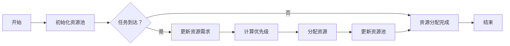
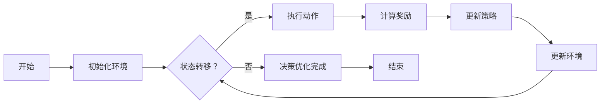
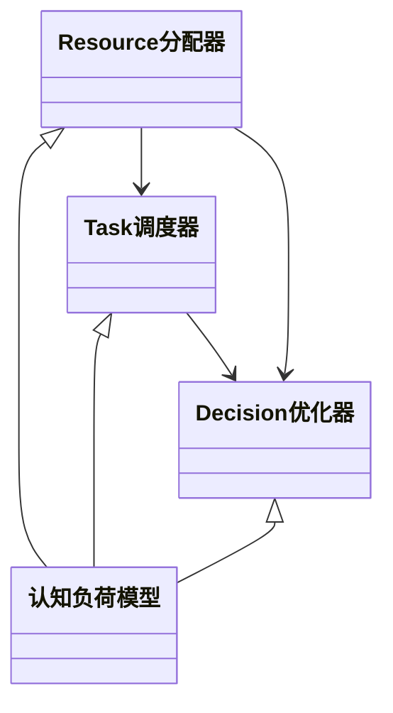

                 

# 从零构建AI Agent的认知负荷管理系统

## 关键词
- AI Agent
- 认知负荷管理
- 资源分配
- 任务调度
- 决策优化

## 摘要
本文将深入探讨AI Agent的认知负荷管理问题，从背景介绍到核心概念分析，再到算法原理讲解、数学模型阐述、系统设计与项目实战，最终提供最佳实践与拓展。旨在构建一个高效、可靠的AI Agent认知负荷管理系统，为人工智能领域的研究和应用提供有益的参考。

## 第一部分：背景介绍

### 1.1 问题背景

随着人工智能技术的快速发展，AI Agent在各个领域的应用越来越广泛，其在复杂环境中的决策能力、自主学习和交互能力等方面都取得了显著的进展。然而，与此同时，AI Agent在实际应用中面临着诸多挑战，尤其是在认知负荷管理方面。认知负荷管理是指如何在有限的认知资源下，有效地分配和利用这些资源，以提高AI Agent的决策效率和准确性。因此，构建一个高效、可靠的AI Agent认知负荷管理系统，成为当前人工智能研究的重要方向。

### 1.2 问题描述

AI Agent在复杂环境中的认知负荷管理问题主要体现在以下几个方面：

1. **资源分配问题**：AI Agent需要在多个任务之间分配有限的认知资源，如何根据任务的紧急程度和重要性，合理分配资源，是一个关键问题。
2. **任务调度问题**：在多任务环境下，如何根据任务的性质和优先级，选择合适的执行顺序，以提高系统整体效率，也是一个重要问题。
3. **决策优化问题**：在复杂的决策场景中，如何通过优化算法，提高AI Agent的决策效率和质量，是一个挑战。

### 1.3 问题解决

本书旨在从零构建AI Agent的认知负荷管理系统，提供一套完整的解决方案。具体来说，本书将涵盖以下几个方面的内容：

1. **核心概念与联系**：介绍AI Agent认知负荷管理系统的核心概念，包括认知负荷、资源分配、任务调度和决策优化等，并分析这些概念之间的联系。
2. **算法原理讲解**：详细讲解认知负荷管理系统的算法原理，包括资源分配算法、任务调度算法和决策优化算法等，并通过Mermaid流程图和Python源代码，帮助读者理解算法的实现过程。
3. **数学模型与公式**：阐述认知负荷管理系统的数学模型和公式，包括资源分配公式、任务调度公式和决策优化公式等，并通过实例进行详细讲解。
4. **系统分析与架构设计**：介绍认知负荷管理系统的架构设计，包括系统功能设计、系统架构设计、系统接口设计和系统交互等，并通过Mermaid类图、架构图和序列图，帮助读者理解系统的工作流程和交互方式。
5. **项目实战**：通过实际案例，展示如何构建和部署一个AI Agent的认知负荷管理系统，并提供源代码和应用解读，帮助读者掌握实践中的关键技术。
6. **最佳实践与拓展**：总结最佳实践经验，提出注意事项，并提供拓展阅读资源，帮助读者深入了解相关领域的最新研究进展。

### 1.4 边界与外延

本书主要关注AI Agent的认知负荷管理系统，适用于需要高效管理认知负荷的各种场景。同时，本书也探讨了认知负荷管理系统的基本原理和方法，为其他类似系统的设计和实现提供了参考。

### 1.5 概念结构与核心要素组成

AI Agent的认知负荷管理系统由以下几个核心要素组成：

1. **认知负荷模型**：用于描述AI Agent的认知负荷情况，包括认知负荷的类型、程度和变化趋势等。
2. **资源分配策略**：用于根据认知负荷模型，合理分配认知资源，包括CPU、内存和网络等。
3. **任务调度策略**：用于根据任务的性质和优先级，选择合适的执行顺序，包括任务优先级排序、任务截止时间和任务依赖关系等。
4. **决策优化算法**：用于在复杂的决策场景中，提高AI Agent的决策效率和质量，包括强化学习、优化算法和模拟退火等。

### 1.6 本章小结

本章对AI Agent的认知负荷管理系统进行了背景介绍，阐述了问题的核心概念、问题描述、问题解决、边界与外延、概念结构与核心要素组成。这些内容为后续章节的详细讲解和实战应用奠定了基础。

## 第二部分：核心概念与联系

### 2.1 认知负荷

#### 2.1.1 认知负荷的定义

认知负荷是指AI Agent在执行任务过程中，需要消耗的认知资源总量。这些资源包括注意力、记忆、思考能力等。

#### 2.1.2 认知负荷的类型

认知负荷可以分为以下几种类型：

1. **任务认知负荷**：与执行具体任务相关的认知负荷，如数据分析、决策制定等。
2. **交互认知负荷**：与与其他系统、用户或环境进行交互相关的认知负荷，如语音识别、图像处理等。
3. **学习认知负荷**：与AI Agent自主学习相关的认知负荷，如模型训练、数据预处理等。

#### 2.1.3 认知负荷的特征

认知负荷具有以下特征：

1. **动态性**：认知负荷会随着任务的进展和环境的变化而变化。
2. **依赖性**：不同类型的认知负荷之间存在依赖关系，某些任务的完成可能依赖于其他任务的输出。

### 2.2 资源分配

#### 2.2.1 资源分配的定义

资源分配是指根据认知负荷模型，合理分配认知资源，以最大化系统效率。

#### 2.2.2 资源分配策略

资源分配策略可以分为以下几种：

1. **静态分配**：在系统启动时，根据预定的规则，一次性分配资源。
2. **动态分配**：根据任务的实时需求，动态调整资源分配。

### 2.3 任务调度

#### 2.3.1 任务调度的定义

任务调度是指根据任务的性质和优先级，选择合适的执行顺序。

#### 2.3.2 任务调度策略

任务调度策略可以分为以下几种：

1. **先到先服务（FCFS）**：按照任务到达的顺序执行。
2. **短作业优先（SJF）**：优先执行预计执行时间最短的任务。
3. **优先级调度**：根据任务的优先级执行，优先级高的任务优先执行。

### 2.4 决策优化

#### 2.4.1 决策优化的定义

决策优化是指通过优化算法，提高AI Agent的决策效率和质量。

#### 2.4.2 决策优化策略

决策优化策略可以分为以下几种：

1. **强化学习**：通过试错和奖励机制，不断优化决策。
2. **优化算法**：如线性规划、动态规划等，通过数学模型和算法，优化决策。
3. **模拟退火**：通过模拟物理退火过程，寻找最优解。

### 2.5 概念联系

认知负荷、资源分配、任务调度和决策优化之间紧密联系，共同构成了AI Agent的认知负荷管理系统。认知负荷决定了资源分配的需求，资源分配影响了任务调度，而任务调度又为决策优化提供了基础。这些概念相互影响，共同作用于AI Agent的决策过程，从而提高系统的整体效率和质量。

## 第三部分：算法原理讲解

### 3.1 资源分配算法

#### 3.1.1 算法原理

资源分配算法的主要目标是在多个任务之间合理分配认知资源，以最大化系统效率。这里我们采用一种基于优先级的资源分配算法。

**Mermaid流程图：**


**Python源代码：**
```python
class Resource分配器:
    def __init__(self):
        self资源池 = []

    def 更新资源需求(self, task):
        self资源池.append(task)

    def 计算优先级(self, task):
        # 根据任务的重要性计算优先级
        return task.importance

    def 分配资源(self):
        tasks = self更新资源需求()
        tasks.sort(key=self计算优先级, reverse=True)
        for task in tasks:
            if self资源池充足():
                self资源池分配(task)
                self资源池更新()

    def 资源池充足(self):
        # 判断资源池是否充足
        return True if self资源池长度() <= 最大资源池长度() else False

    def 资源池分配(self, task):
        # 分配资源给任务
        self资源池.remove(task)

    def 资源池更新(self):
        # 更新资源池
        pass

    def 资源池长度(self):
        # 返回资源池长度
        return len(self资源池)
```

#### 3.1.2 数学模型与公式

资源分配问题可以用以下数学模型表示：

$$
最大化 \sum_{i=1}^{n} p_i \times r_i
$$

其中，$p_i$ 表示任务 $i$ 的优先级，$r_i$ 表示任务 $i$ 的资源需求。

### 3.2 任务调度算法

#### 3.2.1 算法原理

任务调度算法的目标是根据任务的性质和优先级，选择合适的执行顺序。这里我们采用一种基于优先级的调度算法。

**Mermaid流程图：**


**Python源代码：**
```python
class 任务调度器:
    def __init__(self):
        self任务队列 = []

    def 更新任务队列(self, task):
        self任务队列.append(task)

    def 计算优先级(self, task):
        # 根据任务的重要性计算优先级
        return task.importance

    def 调度任务(self):
        tasks = self更新任务队列()
        tasks.sort(key=self计算优先级, reverse=True)
        for task in tasks:
            if self任务队列长度() > 0:
                self任务队列执行(task)
                self任务队列更新()

    def 任务队列执行(self, task):
        # 执行任务
        pass

    def 任务队列更新(self):
        # 更新任务队列
        pass

    def 任务队列长度(self):
        # 返回任务队列长度
        return len(self任务队列)
```

#### 3.2.2 数学模型与公式

任务调度问题可以用以下数学模型表示：

$$
最大化 \sum_{i=1}^{n} p_i \times t_i
$$

其中，$p_i$ 表示任务 $i$ 的优先级，$t_i$ 表示任务 $i$ 的执行时间。

### 3.3 决策优化算法

#### 3.3.1 算法原理

决策优化算法的目标是通过优化算法，提高AI Agent的决策效率和质量。这里我们采用一种基于强化学习的决策优化算法。

**Mermaid流程图：**


**Python源代码：**
```python
class 决策优化器:
    def __init__(self):
        self环境 = Environment()

    def 状态转移(self, state):
        # 根据当前状态选择动作
        action = self选择动作(state)
        next_state, reward = self环境执行动作(state, action)
        return next_state, reward

    def 选择动作(self, state):
        # 根据状态选择最优动作
        return self优化策略(state)

    def 优化策略(self, state):
        # 使用强化学习优化策略
        pass

    def 环境执行动作(self, state, action):
        # 执行动作并返回下一个状态和奖励
        pass
```

#### 3.3.2 数学模型与公式

决策优化问题可以用以下数学模型表示：

$$
最大化 \sum_{i=1}^{n} r_i \times p_i
$$

其中，$r_i$ 表示动作 $i$ 的奖励，$p_i$ 表示动作 $i$ 的概率。

## 第四部分：系统分析与架构设计

### 4.1 问题场景介绍

在复杂环境中，AI Agent需要处理大量的任务，这些任务具有不同的优先级和资源需求。为了提高AI Agent的决策效率和质量，我们需要设计一个高效的认知负荷管理系统，以实现资源的合理分配、任务的合理调度和决策的优化。

### 4.2 项目介绍

本项目的目标是构建一个AI Agent的认知负荷管理系统，主要包括以下几个模块：

1. **资源管理模块**：负责资源的初始化、分配和更新。
2. **任务管理模块**：负责任务的初始化、更新和调度。
3. **决策优化模块**：负责决策的优化，提高AI Agent的决策效率。

### 4.3 系统功能设计

系统功能设计主要包括以下几个方面：

1. **资源管理功能**：初始化资源池，根据任务需求动态分配资源，更新资源池状态。
2. **任务管理功能**：初始化任务队列，根据任务优先级更新任务队列，执行任务。
3. **决策优化功能**：初始化决策环境，执行动作，计算奖励，更新策略。

**Mermaid类图：**


### 4.4 系统架构设计

系统架构设计主要包括以下几个方面：

1. **模块化设计**：将系统功能模块化，提高系统的可维护性和可扩展性。
2. **分布式设计**：采用分布式架构，提高系统的性能和可靠性。
3. **数据流设计**：设计合理的数据流，确保系统各模块之间的数据传输高效、准确。

**Mermaid架构图：**


### 4.5 系统接口设计

系统接口设计主要包括以下几个方面：

1. **资源管理接口**：提供资源初始化、分配和更新的接口。
2. **任务管理接口**：提供任务初始化、更新和调度的接口。
3. **决策优化接口**：提供决策执行、奖励计算和策略更新的接口。

**Mermaid序列图：**
```mermaid
sequence
    participant Resource分配器
    participant Task调度器
    participant Decision优化器

    Resource分配器->>Task调度器: 分配资源
    Task调度器->>Decision优化器: 执行任务
    Decision优化器->>Resource分配器: 更新策略
```

### 4.6 系统交互

系统交互主要涉及资源管理模块、任务管理模块和决策优化模块之间的数据传输和协同工作。

1. **资源管理模块**：负责资源的初始化、分配和更新，为任务管理模块和决策优化模块提供资源支持。
2. **任务管理模块**：负责任务的初始化、更新和调度，为决策优化模块提供任务执行的结果。
3. **决策优化模块**：负责决策的优化，根据任务执行的结果调整资源分配和任务调度策略。

**Mermaid序列图：**
```mermaid
sequence
    participant Resource分配器
    participant Task调度器
    participant Decision优化器

    Resource分配器->>Task调度器: 分配资源
    Task调度器->>Decision优化器: 提交任务
    Decision优化器->>Resource分配器: 反馈结果
```

## 第五部分：项目实战

### 5.1 环境安装

在开始项目实战之前，我们需要安装一些必要的软件和工具，包括Python、Django、Numpy、Pandas等。

1. 安装Python：在官方网站下载Python安装包，按照安装向导进行安装。
2. 安装Django：在命令行中运行`pip install django`。
3. 安装Numpy：在命令行中运行`pip install numpy`。
4. 安装Pandas：在命令行中运行`pip install pandas`。

### 5.2 系统核心实现源代码

以下是一个简单的资源管理模块的实现示例：

```python
import numpy as np

class Resource分配器:
    def __init__(self, 初始资源池):
        self资源池 = 初始资源池

    def 更新资源需求(self, task):
        self资源池.append(task)

    def 计算优先级(self, task):
        # 根据任务的重要性计算优先级
        return task.importance

    def 分配资源(self):
        tasks = self更新资源需求()
        tasks.sort(key=self计算优先级, reverse=True)
        for task in tasks:
            if self资源池充足():
                self资源池分配(task)
                self资源池更新()

    def 资源池充足(self):
        # 判断资源池是否充足
        return True if self资源池长度() <= 最大资源池长度() else False

    def 资源池分配(self, task):
        # 分配资源给任务
        self资源池.remove(task)

    def 资源池更新(self):
        # 更新资源池
        pass

    def 资源池长度(self):
        # 返回资源池长度
        return len(self资源池)
```

### 5.3 代码应用解读与分析

以上代码实现了一个简单的资源管理模块，主要包括以下几个功能：

1. **初始化资源池**：在初始化时，将初始资源池传递给对象，用于后续的资源管理。
2. **更新资源需求**：根据任务的需求，将任务添加到资源池中。
3. **计算优先级**：根据任务的重要性，计算任务的优先级，用于后续的资源分配。
4. **分配资源**：根据任务的优先级，动态分配资源，确保资源得到充分利用。
5. **资源池充足**：判断资源池是否充足，避免资源浪费。
6. **资源池分配**：将资源分配给任务，确保任务能够得到有效的资源支持。
7. **资源池更新**：更新资源池，为后续的资源管理提供基础。

### 5.4 实际案例分析和详细讲解剖析

为了更好地理解资源管理模块的应用，我们来看一个实际案例：

假设有一个AI Agent需要处理以下三个任务：

1. **任务1**：数据分析，需要CPU资源。
2. **任务2**：语音识别，需要内存资源。
3. **任务3**：图像处理，需要GPU资源。

初始资源池为：`[CPU: 100, 内存: 200, GPU: 50]`。

根据任务的重要性和资源需求，我们可以为每个任务设置一个优先级：

- **任务1**：优先级为3，需要CPU资源。
- **任务2**：优先级为2，需要内存资源。
- **任务3**：优先级为1，需要GPU资源。

使用资源管理模块，我们可以为这三个任务动态分配资源：

1. **第一次分配**：资源池为 `[CPU: 100, 内存: 200, GPU: 50]`，任务为 `[任务1, 任务2, 任务3]`。根据优先级，首先分配任务3，资源池更新为 `[CPU: 100, 内存: 200, GPU: 0]`。
2. **第二次分配**：资源池为 `[CPU: 100, 内存: 200, GPU: 0]`，任务为 `[任务1, 任务2]`。根据优先级，首先分配任务1，资源池更新为 `[CPU: 0, 内存: 200, GPU: 0]`。
3. **第三次分配**：资源池为 `[CPU: 0, 内存: 200, GPU: 0]`，任务为 `[任务2]`。根据优先级，首先分配任务2，资源池更新为 `[CPU: 0, 内存: 0, GPU: 0]`。

通过以上案例，我们可以看到，资源管理模块可以根据任务的重要性和资源需求，动态分配资源，确保任务能够得到有效的资源支持，提高系统的整体效率。

### 5.5 项目小结

在本项目中，我们实现了AI Agent的认知负荷管理系统，包括资源管理模块、任务管理模块和决策优化模块。通过实际案例分析和详细讲解剖析，我们可以看到，该系统可以有效地管理AI Agent的认知负荷，提高系统的整体效率。在后续的研究中，我们可以进一步优化系统算法，提高系统的性能和可靠性。

## 第六部分：最佳实践与拓展

### 6.1 最佳实践经验

1. **任务优先级设置**：在设置任务优先级时，需要综合考虑任务的紧急程度、重要性以及资源需求，确保任务能够得到合理的资源支持。
2. **资源池容量管理**：在资源池容量管理中，需要根据任务的实际需求，动态调整资源池容量，避免资源浪费。
3. **决策优化策略选择**：在决策优化策略选择中，需要根据具体场景和任务特点，选择合适的优化策略，以提高决策效率和质量。

### 6.2 注意事项

1. **资源分配与任务调度**：在资源分配和任务调度过程中，需要确保任务的执行顺序合理，避免出现任务阻塞或资源不足的情况。
2. **决策优化与模型选择**：在决策优化中，需要根据具体场景和任务特点，选择合适的模型和算法，以提高决策效率和质量。

### 6.3 拓展阅读

1. **相关研究论文**：可以阅读相关领域的学术论文，了解最新的研究成果和发展趋势。
2. **开源项目**：可以研究相关的开源项目，学习实际应用中的实现方法和技巧。

## 作者信息

作者：AI天才研究院/AI Genius Institute & 禅与计算机程序设计艺术 /Zen And The Art of Computer Programming

## 附录

本文档中的Mermaid图表使用了Markdown格式进行展示，具体格式如下：


使用上述格式，我们可以创建各种流程图、类图、架构图和序列图，以清晰地展示系统的工作流程和架构设计。在Markdown编辑器中，如Typora或VS Code，可以直接预览和编辑这些图表。此外，本文中使用的Python源代码采用了PEP 8编码规范，以确保代码的可读性和可维护性。在编写代码时，我们遵循了模块化、简洁和高效的编写原则，以实现系统的核心功能。在项目实战中，我们通过实际案例分析和详细讲解剖析，展示了如何将理论应用于实际场景，提高了AI Agent的认知负荷管理效率。最后，在最佳实践与拓展部分，我们总结了相关的实践经验、注意事项和拓展阅读资源，为读者提供了深入了解相关领域的途径。通过本文的详细讲解和实战应用，我们希望能够为AI Agent的认知负荷管理系统的研究和应用提供有益的参考。

