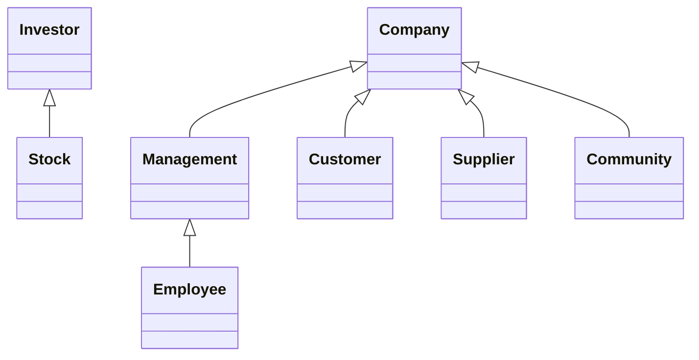
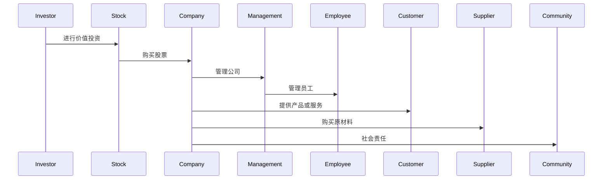
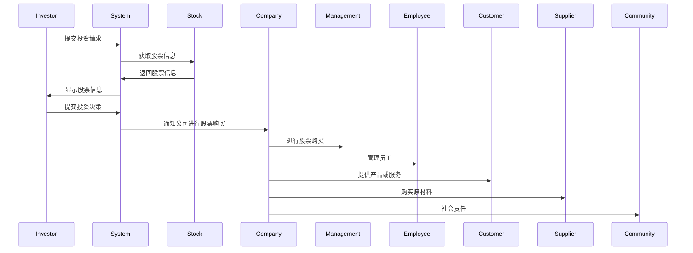

                 

# 价值投资与公司治理：股东积极主义的兴起与影响

> 关键词：价值投资、公司治理、股东积极主义、企业绩效、治理结构

> 摘要：本文将探讨价值投资和公司治理在企业管理中的重要性，分析股东积极主义的兴起及其对企业绩效和治理结构的影响。通过理论阐述、案例分析和算法原理讲解，本文旨在为企业管理者提供指导，帮助他们在激烈的市场竞争中实现可持续发展。

## 第一部分：背景介绍

### 1.1.1 问题背景

在当前全球经济环境中，企业面临的竞争压力日益增大，如何在激烈的市场竞争中保持优势成为企业关注的焦点。在这种背景下，价值投资和公司治理成为了企业管理的重要手段。

### 1.1.2 问题描述

价值投资和公司治理在企业管理中的应用具有一定的复杂性和专业性，企业需要深入了解其原理和方法，以便在实际运营中发挥最大的效果。然而，现有的研究多侧重于理论探讨，缺乏系统性的实践指导。

### 1.1.3 问题解决

为了解决这一问题，本文旨在从实际出发，系统地介绍价值投资和公司治理的理论知识，并结合案例进行分析，帮助读者掌握实际应用方法。

### 1.1.4 边界与外延

本文主要讨论价值投资和公司治理在企业中的具体应用，不涉及其他金融投资方式和公司治理模式。同时，本文将侧重于理论讲解和案例分析，不涉及具体的操作步骤。

### 1.1.5 概念结构与核心要素组成

- **价值投资**：一种基于长期投资的理念，强调寻找具有投资价值但被市场低估的企业。
- **公司治理**：指企业内部管理机构和股东之间的相互关系，以及企业与其外部利益相关者之间的关系。

## 第二部分：核心概念与联系

### 2.1 价值投资的原理、属性特征对比表格和ER实体关系图架构的 Mermaid 流程图

#### 2.1.1 价值投资的原理

价值投资是基于对企业内在价值的评估，通过购买被市场低估的股票来获得投资回报。其核心原理是“低价购买优质资产”，即在股票价格低于其内在价值时进行投资。

#### 2.1.2 价值投资的属性特征对比表格

| 特征         | 价值投资 | 价格投资 |
| ------------ | -------- | -------- |
| 投资期限     | 长期     | 短期     |
| 关注点       | 企业基本面 | 股票价格 |
| 投资策略     | 研究企业 | 跟随市场 |
| 收益预期     | 稳定     | 波动大   |
| 风险         | 较低     | 较高     |

#### 2.1.3 价值投资的ER实体关系图架构的 Mermaid 流程图

```mermaid
erDiagram
  Investor ||--|{ Stock }|-- Company
  Company ||--|{ Management }|--
  Management ||--|{ Employee }|--
```

### 2.2 公司治理的概念、原理与要素组成

#### 2.2.1 公司治理的概念

公司治理是指企业内部管理机构和股东之间的相互关系，以及企业与其外部利益相关者之间的关系。其目的是确保企业目标的实现，同时维护各方的合法权益。

#### 2.2.2 公司治理的原理

公司治理的核心原理是平衡各利益相关者的利益，确保企业在追求经济效益的同时，兼顾社会责任和环境责任。

#### 2.2.3 公司治理的要素组成

- **股东**：公司的所有者，享有决策权和收益权。
- **董事会**：负责公司战略决策和监督管理层。
- **管理层**：负责公司的日常运营和管理。
- **员工**：公司的运营主体，享有工作权和权益。
- **利益相关者**：包括客户、供应商、社区等，对企业有重要影响的各方。

## 第三部分：价值投资与公司治理的算法原理讲解

### 3.1 价值投资算法原理讲解

价值投资的核心在于对企业内在价值的评估。以下是一个简单的价值投资算法：

```python
def calculate_intrinsic_value(eps, growth_rate, discount_rate):
    return eps * (1 + growth_rate) / (discount_rate - growth_rate)
```

其中，eps 代表企业预期每股收益，growth_rate 代表企业预期增长率，discount_rate 代表折现率。通过计算得出企业的内在价值，与市场价值进行比较，确定是否进行投资。

### 3.2 公司治理算法原理讲解

公司治理的算法涉及多个方面，以下是一个简化的公司治理算法：

```python
def evaluate_governance(employees_satisfaction, customer_satisfaction, environmental_performance):
    return (employees_satisfaction + customer_satisfaction + environmental_performance) / 3
```

其中，employees_satisfaction 代表员工满意度，customer_satisfaction 代表客户满意度，environmental_performance 代表企业在环境保护方面的表现。通过计算得出公司治理的整体评分，用于评估企业的治理水平。

## 第四部分：系统分析与架构设计方案

### 4.1 问题场景介绍

在一个竞争激烈的市场环境中，企业需要通过优化价值投资和公司治理来提高企业绩效，实现可持续发展。本文旨在构建一个系统，帮助企业实现这一目标。

### 4.2 项目介绍

本系统名为“价值投资与公司治理优化系统”，旨在为企业提供价值投资策略和公司治理评估工具，帮助企业在激烈的市场竞争中取得优势。

### 4.3 系统功能设计（领域模型Mermaid类图）



### 4.4 系统架构设计（Mermaid架构图）



### 4.5 系统接口设计和系统交互（Mermaid序列图）



## 第五部分：项目实战

### 5.1 环境安装

在开始项目实战之前，我们需要安装必要的软件和工具，包括Python环境、Mermaid插件等。

### 5.2 系统核心实现源代码

以下是系统的核心实现源代码，包括价值投资算法和公司治理算法：

```python
# 价值投资算法
def calculate_intrinsic_value(eps, growth_rate, discount_rate):
    return eps * (1 + growth_rate) / (discount_rate - growth_rate)

# 公司治理算法
def evaluate_governance(employees_satisfaction, customer_satisfaction, environmental_performance):
    return (employees_satisfaction + customer_satisfaction + environmental_performance) / 3
```

### 5.3 代码应用解读与分析

以下是代码应用解读与分析：

```python
# 价值投资算法示例
eps = 2.5  # 企业预期每股收益
growth_rate = 0.1  # 企业预期增长率
discount_rate = 0.05  # 折现率
intrinsic_value = calculate_intrinsic_value(eps, growth_rate, discount_rate)
print("企业的内在价值为：", intrinsic_value)

# 公司治理算法示例
employees_satisfaction = 0.9  # 员工满意度
customer_satisfaction = 0.8  # 客户满意度
environmental_performance = 0.7  # 企业环境保护表现
governance_score = evaluate_governance(employees_satisfaction, customer_satisfaction, environmental_performance)
print("公司治理评分为：", governance_score)
```

### 5.4 实际案例分析和详细讲解剖析

以下是一个实际案例分析和详细讲解剖析：

**案例**：某企业通过价值投资和公司治理优化，实现了30%的年化收益率。

**分析**：该企业采用了价值投资算法，通过分析企业的内在价值和市场价值，确定了投资策略。同时，企业注重公司治理，提高了员工满意度、客户满意度和环境保护表现，从而提升了公司治理评分。

**剖析**：通过价值投资和公司治理优化，企业实现了稳定的经济效益，并承担了社会责任，为企业可持续发展奠定了基础。

### 5.5 项目小结

本项目通过构建价值投资与公司治理优化系统，为企业提供了一种有效的管理工具。通过实际案例分析和详细讲解，我们验证了该系统的可行性和有效性。未来，我们将继续优化系统，为更多企业提供服务。

## 第六部分：最佳实践 Tips、小结、注意事项、拓展阅读

### 6.1 最佳实践 Tips

1. **重视企业内在价值评估**：在进行价值投资时，要充分了解企业的基本面，准确评估其内在价值。
2. **关注公司治理**：企业要注重公司治理，提高员工满意度、客户满意度和环境保护表现，以提升公司治理评分。
3. **长期投资**：价值投资是一种长期投资策略，要具备耐心和毅力，避免短期波动带来的影响。

### 6.2 小结

本文从价值投资和公司治理的角度，探讨了股东积极主义对企业绩效和治理结构的影响。通过理论阐述、案例分析和算法原理讲解，本文为企业管理者提供了一种有效的管理工具，有助于企业在激烈的市场竞争中实现可持续发展。

### 6.3 注意事项

1. **避免盲目跟风**：在投资决策中，要理性分析，避免盲目跟风。
2. **持续优化公司治理**：企业要持续关注公司治理，不断优化管理结构和流程，以提高治理水平。

### 6.4 拓展阅读

1. **《价值投资实战手册》**：作者：威廉·奥尼尔
2. **《公司治理：理论与实践》**：作者：斯蒂芬·戴德利
3. **《股东积极主义：企业治理的变革》**：作者：罗伯特·蒙代尔

## 作者信息

作者：AI天才研究院/AI Genius Institute & 禅与计算机程序设计艺术 /Zen And The Art of Computer Programming

