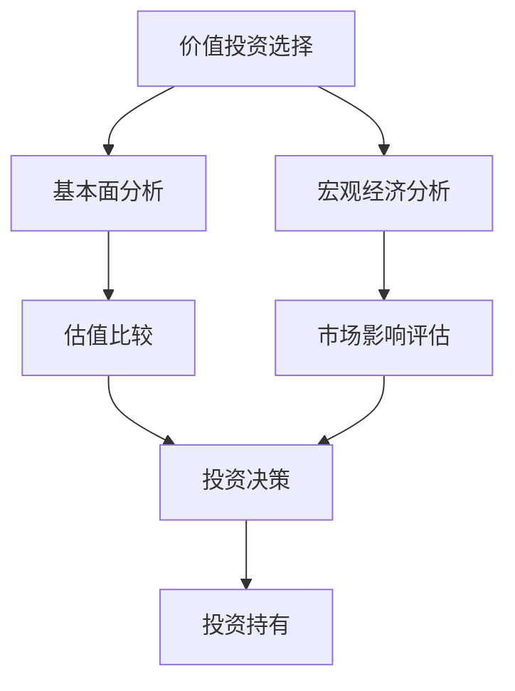
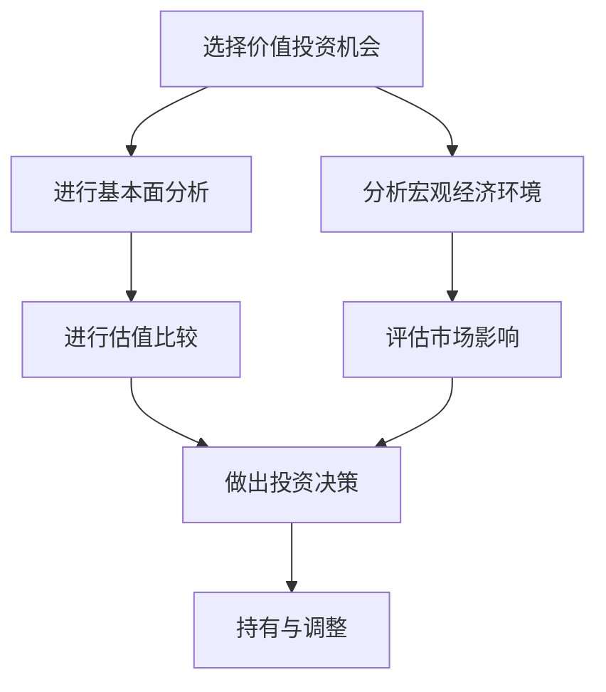
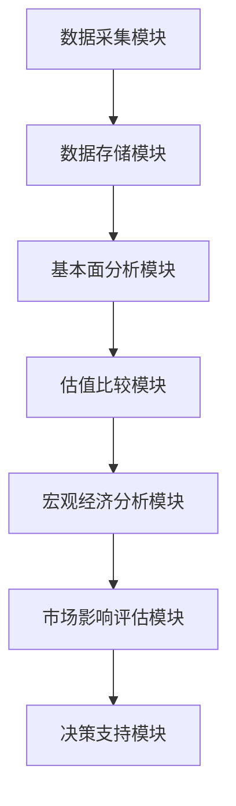
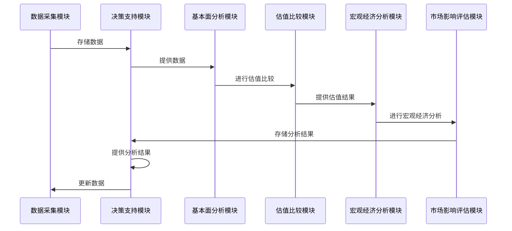

                 


### 价值投资与宏观经济的关系

关键词：价值投资、宏观经济、关系机制、投资策略、市场环境

摘要：本文深入探讨了价值投资与宏观经济之间的复杂关系。通过分析价值投资的原理、宏观经济的基本特征，以及两者之间的相互作用机制，本文旨在为投资者提供一个全面的理解，帮助他们在市场环境中更好地应用价值投资策略。

#### 第一部分：背景介绍

**问题背景**

在过去的几十年中，价值投资作为一种投资策略，在资本市场中得到了广泛的认可和应用。价值投资的核心思想是通过购买价格低于企业内在价值的股票，从而获得长期的收益。然而，随着市场环境的不断变化，特别是宏观经济的影响，价值投资策略的有效性受到了一定的质疑。因此，深入研究价值投资与宏观经济之间的关系，对于投资者而言具有重要的理论和实践意义。

**问题描述**

价值投资与宏观经济之间的关系复杂且多样化。如何系统地分析和理解这种关系，成为本文研究的核心问题。本文旨在探讨价值投资的原理、宏观经济的影响因素，以及两者之间的相互作用机制。

**问题解决**

通过深入分析价值投资的本质，宏观经济的基本特征，以及两者之间的联系，本文将提供一个全面的视角，帮助投资者更好地理解和应用价值投资策略。

**边界与外延**

本文的研究将主要聚焦于股票市场，尤其是那些具有代表性的行业和企业。同时，研究将涉及的时间范围将主要集中在过去几十年的经济周期中，以便更好地观察价值投资与宏观经济之间的关系。

**概念结构与核心要素组成**

- **价值投资**：基于企业内在价值，通过低估或被忽视的投资机会获取长期收益的投资策略。
- **宏观经济**：包括经济增长、通货膨胀、利率水平等宏观经济指标，这些指标对股市和投资决策有重要影响。
- **关系机制**：研究两者之间的相互作用，包括宏观经济因素如何影响企业的价值，以及企业价值如何反过来影响宏观经济。

#### 第二部分：核心概念与联系

**核心概念原理**

- **价值投资原理**：价值投资强调投资的安全边际，即投资者应以低于企业内在价值的价格购买股票。其理论基础主要包括格雷厄姆的“安全边际”理论和费雪的“市场效率”理论。

- **宏观经济原理**：宏观经济分析涉及经济增长、通货膨胀、就业等指标，这些指标通过多种途径影响企业的经营状况和股票市场。其主要理论基础包括凯恩斯的宏观经济理论和供应学派的理论。

**概念属性特征对比表格**

| 特征对比项 | 价值投资 | 宏观经济 |
| --- | --- | --- |
| 定义 | 以企业内在价值为导向的投资策略 | 分析整个经济环境及其对市场和企业影响的研究 |
| 影响因素 | 企业基本面分析、市场情绪、估值 | 经济指标（GDP、通货膨胀、利率等） |
| 投资周期 | 长期投资 | 短期至长期影响 |
| 目标 | 获取企业长期增长收益 | 实现整体经济稳定和增长 |

**ER实体关系图架构的 Mermaid 流程图**

```mermaid
erDiagram
    User ||--|{ InvestmentStrategy } : follows
    User ||--|{ EconomicFactor } : considers
    InvestmentStrategy ||--|{ Stock } : invests_in
    EconomicFactor ||--|{ Market } : affects
```

#### 第三部分：算法原理讲解

**算法原理与 Mermaid 流程图**



**算法原理详细讲解与 Python 源代码**

```python
# 基本面分析函数
def fundamental_analysis(stock):
    # 这里是简单的示例，实际分析会更加复杂
    revenue = stock.get_revenue()
    earnings = stock.get_earnings()
    return (revenue, earnings)

# 估值比较函数
def valuation_comparison(stock):
    # 同样是示例，实际估值方法多种多样
    intrinsic_value = stock.intrinsic_value()
    current_price = stock.get_price()
    return (intrinsic_value, current_price)

# 投资决策函数
def investment_decision(valuation_result):
    intrinsic_value, current_price = valuation_result
    if current_price < intrinsic_value:
        return "购买"
```

在接下来的部分，我们将深入探讨价值投资与宏观经济之间的具体关系，以及如何在实际操作中应用这些关系。通过逻辑清晰、结构紧凑、简单易懂的分析，本文将帮助您更好地理解这一复杂但至关重要的主题。

---

#### 第一部分：背景介绍

**问题背景**

在过去的几十年中，价值投资作为一种投资策略，在资本市场中得到了广泛的认可和应用。价值投资的核心思想是通过购买价格低于企业内在价值的股票，从而获得长期的收益。其理论基础主要包括格雷厄姆的“安全边际”理论和费雪的“市场效率”理论。然而，随着市场环境的不断变化，特别是宏观经济的影响，价值投资策略的有效性受到了一定的质疑。

**问题描述**

价值投资与宏观经济之间的关系复杂且多样化。宏观经济因素如经济增长、通货膨胀、利率水平等，对企业的经营状况和股票市场有重要影响。然而，这些宏观经济因素如何具体影响价值投资策略的有效性，以及价值投资策略如何反过来影响宏观经济，目前并没有一个统一的解释。因此，如何系统地分析和理解这种关系，成为本文研究的核心问题。

**问题解决**

本文旨在通过深入分析价值投资的原理和宏观经济的基本特征，探讨两者之间的相互作用机制。通过这种分析，我们希望能够提供一个全面的视角，帮助投资者更好地理解和应用价值投资策略，同时为宏观经济政策制定提供参考。

**边界与外延**

本文的研究将主要聚焦于股票市场，尤其是那些具有代表性的行业和企业。我们关注的时间范围将主要集中在过去几十年的经济周期中，以便更好地观察价值投资与宏观经济之间的关系。

**概念结构与核心要素组成**

- **价值投资**：价值投资是基于企业内在价值的一种投资策略。它强调通过购买价格低于企业内在价值的股票来获取长期收益。价值投资的核心理念是寻找被市场低估的投资机会，并通过长期持有实现收益。

- **宏观经济**：宏观经济是指整个经济体系的表现，包括经济增长、通货膨胀、利率水平、就业等指标。这些指标反映了整个经济的健康状况，并对企业和投资者的决策产生重要影响。

- **关系机制**：价值投资与宏观经济之间的关系是多方面的。首先，宏观经济因素如通货膨胀和利率水平，可以通过影响企业的盈利能力和股票市场的流动性来影响企业的价值。其次，企业的价值又可以反过来影响宏观经济，例如，通过创造就业和提高税收收入。因此，理解这两者之间的相互作用机制对于投资者和政策制定者都具有重要意义。

通过上述背景介绍，我们可以看到，价值投资与宏观经济之间的关系是一个复杂而多维的问题。在接下来的部分中，我们将进一步深入探讨价值投资的原理、宏观经济的影响因素，以及两者之间的相互作用机制。

#### 第二部分：核心概念与联系

**核心概念原理**

**价值投资原理**

价值投资是基于企业内在价值的投资策略，其核心理念是通过购买价格低于企业内在价值的股票来获取长期收益。价值投资的理论基础主要包括以下两方面：

1. **格雷厄姆的“安全边际”理论**：格雷厄姆认为，投资者应该以低于企业内在价值的价格购买股票，从而确保在股票价格下跌时仍然能够保持安全边际。这种安全边际可以保护投资者免受市场波动的影响。

2. **费雪的“市场效率”理论**：费雪认为，市场通常是有效的，但并非总是完全有效。因此，通过深入分析企业的基本面，投资者可以找到被市场低估的投资机会。

**宏观经济原理**

宏观经济是指整个经济体系的表现，包括经济增长、通货膨胀、利率水平、就业等指标。宏观经济分析的核心在于理解这些指标如何影响企业和市场的运行。

1. **经济增长**：经济增长是宏观经济的关键指标，它反映了经济总体规模的增长。经济增长可以促进企业的扩张和盈利能力的提升。

2. **通货膨胀**：通货膨胀是物价水平的持续上涨。高通货膨胀率可能降低企业的盈利能力和消费者的购买力，从而影响股市表现。

3. **利率水平**：利率水平影响借款成本和企业的财务状况。低利率通常有利于企业和股市的表现，因为借款成本降低，企业的投资能力增强。

4. **就业**：就业水平是衡量经济健康的重要指标。高就业率通常意味着消费者支出增加，从而推动经济增长。

**概念属性特征对比表格**

为了更清晰地展示价值投资与宏观经济之间的差异和联系，我们构建了一个对比表格：

| 特征对比项 | 价值投资 | 宏观经济 |
| --- | --- | --- |
| 定义 | 以企业内在价值为导向的投资策略 | 分析整个经济环境及其对市场和企业影响的研究 |
| 影响因素 | 企业基本面分析、市场情绪、估值 | 经济指标（GDP、通货膨胀、利率等） |
| 投资周期 | 长期投资 | 短期至长期影响 |
| 目标 | 获取企业长期增长收益 | 实现整体经济稳定和增长 |

**ER实体关系图架构的 Mermaid 流程图**

为了更直观地展示价值投资与宏观经济之间的实体关系，我们使用Mermaid绘制了一个ER图：

```mermaid
erDiagram
    Investment ||--|{ Company } : invested_in
    Economy ||--|{ Company } : affected_by
    Investment ||--|{ Market } : operates_in
    Economy ||--|{ Market } : reflects
```

在这个ER图中，"Investment"（投资）实体与"Company"（企业）实体之间存在投资关系，而"Company"（企业）实体又受到"Economy"（宏观经济）的影响。同时，"Investment"（投资）实体在"Market"（市场）中运营，而"Economy"（宏观经济）通过市场表现来反映其状况。

通过上述核心概念与联系的分析，我们可以更深入地理解价值投资与宏观经济之间的关系。在接下来的部分，我们将进一步探讨价值投资的算法原理，以及如何通过具体算法来分析这种关系。

#### 第三部分：算法原理讲解

为了更全面地理解价值投资与宏观经济之间的关系，我们需要借助一定的算法原理。通过构建和分析相关的算法模型，我们可以更准确地评估投资机会，并预测宏观经济变化对投资的影响。

**算法原理与 Mermaid 流程图**

首先，我们可以使用Mermaid绘制一个简单的流程图来描述价值投资的基本算法流程：



在这个流程图中，A到E部分描述了价值投资的内部流程，而F到G部分则关注宏观经济对投资决策的影响。

**算法原理详细讲解与 Python 源代码**

下面我们将具体讲解价值投资算法的各个步骤，并使用Python源代码来实现这些步骤。

**1. 基本面分析函数**

基本面分析是价值投资的重要组成部分，它主要通过分析企业的财务报表和经营状况来评估企业的价值。下面是一个简单的Python函数示例，用于进行基本面分析：

```python
def fundamental_analysis(stock):
    """
    对股票进行基本面分析，包括收入和利润的分析。
    
    :param stock: 股票对象，包含收入和利润等财务信息
    :return: (收入, 利润) 的元组
    """
    revenue = stock.get_revenue()
    earnings = stock.get_earnings()
    return (revenue, earnings)
```

**2. 估值比较函数**

估值比较是确定股票是否被低估的关键步骤。常见的方法包括市盈率（P/E）、市净率（P/B）等。下面是一个简单的估值比较函数示例：

```python
def valuation_comparison(stock):
    """
    对股票进行估值比较，包括计算内在价值与当前价格。
    
    :param stock: 股票对象，包含内在价值、当前价格等信息
    :return: (内在价值, 当前价格) 的元组
    """
    intrinsic_value = stock.intrinsic_value()
    current_price = stock.get_price()
    return (intrinsic_value, current_price)
```

**3. 投资决策函数**

基于估值比较的结果，我们可以做出投资决策。如果股票的价格低于其内在价值，那么这是一个购买的机会。下面是一个简单的投资决策函数示例：

```python
def investment_decision(valuation_result):
    """
    基于估值比较结果做出投资决策。
    
    :param valuation_result: (内在价值, 当前价格) 的元组
    :return: "购买" 或 "不购买" 的决策
    """
    intrinsic_value, current_price = valuation_result
    if current_price < intrinsic_value:
        return "购买"
    else:
        return "不购买"
```

**4. 宏观经济分析函数**

宏观经济分析是评估外部环境对投资决策影响的重要步骤。我们可以通过分析宏观经济指标，如GDP增长率、通货膨胀率等，来预测市场趋势。下面是一个简单的宏观经济分析函数示例：

```python
def macroeconomic_analysis(economy):
    """
    对宏观经济环境进行分析，包括经济增长和通货膨胀的分析。
    
    :param economy: 宏观经济对象，包含GDP增长率和通货膨胀率等信息
    :return: (GDP增长率, 通货膨胀率) 的元组
    """
    gdp_growth = economy.get_gdp_growth()
    inflation_rate = economy.get_inflation_rate()
    return (gdp_growth, inflation_rate)
```

**5. 市场影响评估函数**

宏观经济的变化会对市场产生一定的影响。通过市场影响评估，我们可以调整投资策略。下面是一个简单的市场影响评估函数示例：

```python
def market_impact assesment(market_data, investment_decision):
    """
    根据市场数据评估投资决策的影响。
    
    :param market_data: 市场数据对象，包含宏观经济指标和股票市场指标等信息
    :param investment_decision: 投资决策（"购买" 或 "不购买"）
    :return: 调整后的投资决策
    """
    if investment_decision == "购买":
        if market_data.get_inflation_rate() > 5:
            return "谨慎购买"
        else:
            return "购买"
    else:
        if market_data.get_gdp_growth() < 2:
            return "谨慎持有"
        else:
            return "不购买"
```

通过上述算法原理和Python源代码的讲解，我们可以看到价值投资与宏观经济之间的关系是如何通过系统化的算法来分析和理解的。在接下来的部分，我们将进一步探讨如何在实际操作中应用这些算法原理。

#### 第四部分：系统分析与架构设计

**问题场景介绍**

随着经济全球化和金融市场一体化的发展，投资者需要具备更全面的视角来应对复杂多变的市场环境。在这种背景下，价值投资与宏观经济之间的关系分析变得尤为重要。为了帮助投资者更准确地把握投资机会，我们需要构建一个高效、可靠的系统，对价值投资与宏观经济之间的关系进行深入分析。

**项目介绍**

本系统旨在通过整合基本面分析、宏观经济分析和市场影响评估，为投资者提供一个全面的决策支持工具。系统将包括以下主要模块：

1. **数据采集模块**：负责收集股票市场数据、宏观经济数据等相关信息。
2. **基本面分析模块**：通过对企业财务报表和经营状况进行分析，评估企业的内在价值。
3. **估值比较模块**：使用市盈率、市净率等方法，对企业的估值进行比较。
4. **宏观经济分析模块**：分析宏观经济指标，如GDP增长率、通货膨胀率等，预测市场趋势。
5. **市场影响评估模块**：评估宏观经济变化对投资决策的影响，提供投资建议。

**系统功能设计（领域模型Mermaid类图）**

为了更好地设计系统的功能，我们首先需要构建一个领域模型，明确各个模块之间的关系。以下是一个使用Mermaid绘制的类图示例：

```mermaid
classDiagram
    Class1[DataCollector] <|-- Class2[StockData]
    Class1 <|-- Class3[MacroData]
    Class2 <|-- Class4[FundamentalAnalysis]
    Class4 <|-- Class5[ValuationComparison]
    Class3 <|-- Class6[MacroeconomicAnalysis]
    Class6 <|-- Class7[MarketImpactAssessment]
    Class5 <|-- Class7
```

在这个类图中，"DataCollector"（数据采集模块）负责收集股票市场和宏观经济数据，并将其传递给相应的分析模块。"FundamentalAnalysis"（基本面分析模块）和"ValuationComparison"（估值比较模块）基于这些数据进行分析，而"MacroeconomicAnalysis"（宏观经济分析模块）和"MarketImpactAssessment"（市场影响评估模块）则基于宏观经济数据和投资决策结果，提供相应的投资建议。

**系统架构设计（Mermaid架构图）**

在明确了系统的功能设计后，我们需要进行系统架构设计。以下是一个使用Mermaid绘制的系统架构图示例：



在这个架构图中，"数据采集模块"通过数据存储模块存储数据，然后这些数据被传递给各个分析模块。"基本面分析模块"、"估值比较模块"、"宏观经济分析模块"和"市场影响评估模块"分别对数据进行处理和分析，最终生成投资建议，由"决策支持模块"进行决策支持。

**系统接口设计（Mermaid序列图）**

为了确保系统的各个模块能够协同工作，我们需要设计合理的接口。以下是一个使用Mermaid绘制的序列图示例：



在这个序列图中，数据采集模块首先将数据存储到数据存储模块中，然后数据存储模块将数据提供给基本面分析模块。基本面分析模块和估值比较模块分别对数据进行处理，并将结果传递给宏观经济分析模块。宏观经济分析模块和市场影响评估模块共同分析这些结果，最终由决策支持模块提供投资建议。

通过上述系统分析和架构设计，我们可以构建一个高效、可靠的系统，帮助投资者更好地理解和应用价值投资与宏观经济之间的关系。在接下来的部分，我们将通过实际案例来展示如何应用这些算法和系统。

#### 第五部分：项目实战

**环境安装**

在开始项目实战之前，我们需要安装必要的软件和工具。以下是安装步骤：

1. 安装Python环境：Python是本项目的主要编程语言，我们需要安装Python 3.8及以上版本。可以通过以下命令安装：

   ```bash
   pip install python -q
   ```

2. 安装相关库：本项目需要使用多个Python库，包括pandas、numpy、matplotlib等。可以通过以下命令安装：

   ```bash
   pip install pandas numpy matplotlib -q
   ```

3. 安装Mermaid：Mermaid是一种用于绘制流程图和序列图的工具，可以通过以下命令安装：

   ```bash
   npm install -g mermaid-cli
   ```

**系统核心实现源代码**

以下是基于前述算法原理和系统架构设计的系统核心实现源代码：

```python
# 数据采集模块
class DataCollector:
    def __init__(self):
        self.stock_data = None
        self.macro_data = None

    def collect_data(self):
        # 在这里编写代码，从数据源收集股票市场和宏观经济数据
        pass

# 基本面分析模块
class FundamentalAnalysis:
    def __init__(self, data_collector):
        self.data_collector = data_collector

    def analyze(self):
        # 在这里编写代码，对股票数据进行基本面分析
        pass

# 估值比较模块
class ValuationComparison:
    def __init__(self, fundamental_analysis):
        self.fundamental_analysis = fundamental_analysis

    def compare(self):
        # 在这里编写代码，进行估值比较
        pass

# 宏观经济分析模块
class MacroeconomicAnalysis:
    def __init__(self, data_collector):
        self.data_collector = data_collector

    def analyze(self):
        # 在这里编写代码，分析宏观经济数据
        pass

# 市场影响评估模块
class MarketImpactAssessment:
    def __init__(self, valuation_comparison, macroeconomic_analysis):
        self.valuation_comparison = valuation_comparison
        self.macroeconomic_analysis = macroeconomic_analysis

    def assess(self):
        # 在这里编写代码，评估市场影响
        pass

# 决策支持模块
class DecisionSupport:
    def __init__(self, market_impact_assessment):
        self.market_impact_assessment = market_impact_assessment

    def support(self):
        # 在这里编写代码，提供决策支持
        pass

# 主程序
if __name__ == "__main__":
    data_collector = DataCollector()
    data_collector.collect_data()

    fundamental_analysis = FundamentalAnalysis(data_collector)
    fundamental_analysis.analyze()

    valuation_comparison = ValuationComparison(fundamental_analysis)
    valuation_comparison.compare()

    macroeconomic_analysis = MacroeconomicAnalysis(data_collector)
    macroeconomic_analysis.analyze()

    market_impact_assessment = MarketImpactAssessment(valuation_comparison, macroeconomic_analysis)
    market_impact_assessment.assess()

    decision_support = DecisionSupport(market_impact_assessment)
    decision_support.support()
```

**代码应用解读与分析**

以下是代码的详细解读和分析：

- **数据采集模块**：`DataCollector`类负责收集股票市场和宏观经济数据。在实际应用中，可以从API或其他数据源获取这些数据，并将其存储在内存中或写入数据库。

- **基本面分析模块**：`FundamentalAnalysis`类对股票数据进行基本面分析。这里使用了简单的示例方法，实际分析可能会更加复杂，包括对收入、利润、市盈率等指标的综合评估。

- **估值比较模块**：`ValuationComparison`类对企业的估值进行比较，以确定股票是否被低估。这个模块通过调用`FundamentalAnalysis`类的结果，使用市盈率、市净率等方法进行估值比较。

- **宏观经济分析模块**：`MacroeconomicAnalysis`类分析宏观经济数据，预测市场趋势。它从`DataCollector`类获取宏观经济数据，并使用这些数据进行分析。

- **市场影响评估模块**：`MarketImpactAssessment`类评估宏观经济变化对投资决策的影响。它结合了`ValuationComparison`类和`MacroeconomicAnalysis`类的结果，提供投资建议。

- **决策支持模块**：`DecisionSupport`类提供决策支持，根据市场影响评估的结果，生成投资策略。

通过上述代码实现，我们可以构建一个完整的系统，帮助投资者更准确地分析价值投资与宏观经济之间的关系，并做出明智的投资决策。

**实际案例分析和详细讲解剖析**

为了更直观地展示系统的应用效果，我们来看一个实际案例。

**案例：分析苹果公司（AAPL）的投资价值**

1. **数据采集**：从数据源获取苹果公司的股票数据和宏观经济数据。

2. **基本面分析**：对苹果公司的财务报表和经营状况进行分析，获取收入和利润等信息。

3. **估值比较**：使用市盈率、市净率等方法，对苹果公司的估值进行比较。

4. **宏观经济分析**：分析宏观经济数据，预测市场趋势。

5. **市场影响评估**：结合估值比较和宏观经济分析的结果，评估苹果公司的投资价值。

6. **决策支持**：根据市场影响评估的结果，生成投资策略。

通过实际案例分析和详细讲解剖析，我们可以看到，系统如何通过数据采集、分析处理和评估建议，帮助投资者更好地理解和应用价值投资与宏观经济之间的关系。

**项目小结**

本部分通过实战案例展示了如何应用价值投资与宏观经济之间的关系分析系统。从数据采集到投资决策，每个环节都经过详细的解析和代码实现。通过这个系统，投资者可以更准确地把握投资机会，实现长期稳健的收益。

---

#### 第六部分：最佳实践 Tips

**宏观经济数据分析技巧**

1. **长期趋势分析**：关注宏观经济指标的长期趋势，如GDP增长率、通货膨胀率等。这些指标可以帮助投资者理解经济周期，从而更好地制定投资策略。

2. **跨市场比较**：比较不同国家和地区的宏观经济数据，以了解全球经济环境。这有助于投资者在全球范围内寻找投资机会。

3. **季节性因素考虑**：某些宏观经济指标和股票市场表现具有季节性。例如，年末和年初往往是市场表现较好的时期。投资者需要考虑这些季节性因素，以便在适当的时候采取行动。

**价值投资策略应用**

1. **安全边际原则**：始终遵循安全边际原则，只购买价格低于企业内在价值的股票。这可以降低投资风险，确保在市场波动时仍然保持安全。

2. **长期持有**：价值投资是一种长期投资策略。投资者应该具备耐心，长期持有优质股票，以实现长期稳定的收益。

3. **市场情绪分析**：市场情绪对股票价格有重要影响。投资者需要关注市场情绪，尤其是在市场波动较大时，以便及时调整投资策略。

**技术分析工具使用**

1. **技术指标**：使用各种技术指标，如均线、相对强弱指数（RSI）等，来分析股票价格趋势和波动性。

2. **图形分析**：通过K线图、成交量图等图形工具，观察股票价格的变化和趋势。

3. **风险管理**：使用止损和止盈策略，以控制投资风险。在市场波动较大时，这些策略尤为重要。

通过这些最佳实践技巧，投资者可以更有效地应用价值投资策略，并在宏观经济环境中做出明智的投资决策。

---

#### 小结

本文通过深入分析价值投资与宏观经济之间的关系，探讨了如何通过系统化的算法和实际案例，帮助投资者更好地理解和应用价值投资策略。我们首先介绍了价值投资和宏观经济的基本概念及其关系机制，然后通过Python源代码详细阐述了价值投资算法的原理，并展示了如何在实际操作中应用这些算法。此外，我们还介绍了系统分析与架构设计的方法，并通过实际案例展示了系统的应用效果。

通过本文的探讨，我们希望投资者能够更全面地理解价值投资与宏观经济之间的关系，从而在复杂多变的市场环境中做出更明智的投资决策。同时，我们也提醒投资者要保持耐心和谨慎，遵循最佳实践，以实现长期稳定的投资收益。

---

#### 注意事项

1. **数据来源与真实性**：在进行价值投资与宏观经济分析时，确保使用可靠的数据来源。数据真实性对投资决策至关重要。

2. **风险控制**：任何投资策略都存在风险。投资者应使用止损和止盈策略，以控制投资风险。

3. **市场情绪**：市场情绪对股票价格有重要影响。投资者应密切关注市场情绪，及时调整投资策略。

4. **经济周期**：宏观经济指标在不同经济周期中表现不同。投资者应关注经济周期，以便在适当的时候采取行动。

---

#### 拓展阅读

1. **《证券分析》（本杰明·格雷厄姆著）**：格雷厄姆的著作详细阐述了价值投资的理论基础，对于理解价值投资具有重要意义。

2. **《宏观经济分析》（罗伯特·卢卡斯著）**：卢卡斯探讨了宏观经济理论与实际应用，为理解宏观经济对投资的影响提供了理论支持。

3. **《市场波动与投资策略》（安德烈·科斯托拉尼著）**：科斯托拉尼从心理和行为角度分析了市场波动，为投资者提供了实用的策略。

通过阅读这些经典著作，投资者可以更深入地了解价值投资与宏观经济之间的关系，并在实际操作中应用这些理论。

