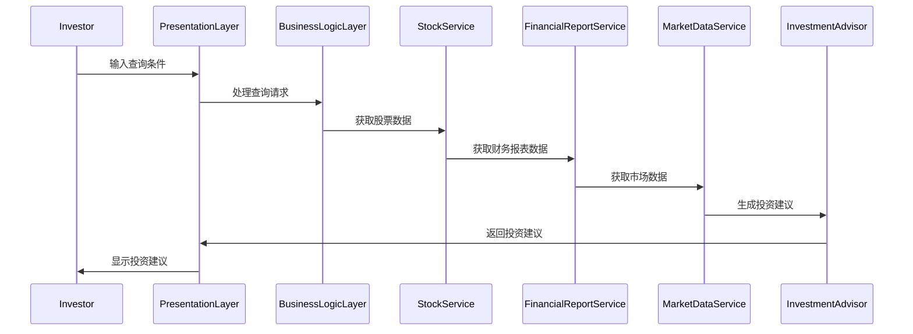

                 


### 引言

**关键词：价值投资，市场效率假说，投资分析，逻辑推理**

在现代金融投资领域中，价值投资和市场效率假说无疑是两个核心概念。价值投资，是一种基于公司基本面分析的投资策略，其核心理念是购买价格低于其内在价值的股票，并长期持有，以期获得投资回报。而市场效率假说则是对金融市场运行机制的一种理论解释，认为市场在价格发现过程中是高效的，投资者无法通过简单的技术分析或市场信息获取超额收益。

本文旨在探讨价值投资与市场效率假说之间的深层次关系，通过逻辑清晰、结构紧凑的分析，帮助读者更好地理解这两个概念。具体来说，我们将分以下几个步骤进行探讨：

1. **背景介绍**：首先，我们将介绍价值投资和市场效率假说的基本概念，阐述研究这两个主题的原因和重要性。

2. **核心概念与联系**：接下来，我们将详细探讨价值投资的原理和市场效率假说的理论框架，通过概念属性特征对比表格和ER实体关系图来解释。

3. **算法原理讲解**：我们将讲解与价值投资相关的算法，如资本资产定价模型（CAPM）、套利定价理论（APT）等，并使用mermaid流程图和Python源代码来展示。

4. **数学模型和数学公式**：我们将详细介绍价值投资和市场效率假说的数学模型和公式，并进行详细讲解和举例说明。

5. **系统分析与架构设计方案**：我们将分析价值投资系统的架构，包括领域模型、系统架构、接口设计和系统交互。

6. **项目实战**：通过一个实际案例，我们将展示价值投资的应用，包括环境安装、核心实现源代码，以及代码的应用解读与分析。

7. **最佳实践 tips、小结、注意事项、拓展阅读**：最后，我们将总结书中的关键点，提供实践建议，并对未来的研究方向进行展望。

### 背景介绍

#### 价值投资的基本概念

价值投资，起源于本杰明·格雷厄姆的“安全边际”理论，认为投资者应该购买价格低于其内在价值的股票。这种投资策略的核心在于对公司的基本面进行分析，包括财务报表、盈利能力、成长性等。通过深入分析，投资者可以找到那些被市场低估的股票，从而获得较高的回报。

价值投资不同于其他投资策略，如成长投资或投机，它更注重长期投资，而非短期波动。这种策略依赖于投资者的研究能力和耐心，通过深入分析企业的基本面，寻找那些被市场低估的机会。

#### 市场效率假说的基本概念

市场效率假说，是金融学中的一种理论，认为市场在价格发现过程中是高效的，投资者无法通过简单的技术分析或市场信息获取超额收益。市场效率假说分为三个层次：弱型效率、半强型效率和强型效率。

弱型效率认为，当前的市场价格已经反映了所有历史价格和交易信息，投资者无法通过技术分析获得超额收益。半强型效率则认为，市场价格不仅反映了所有历史价格和交易信息，还反映了所有公开可获得的市场信息，如公司的财务报表、行业新闻等。强型效率则是市场效率的最高形式，认为市场价格反映了所有公开和私有的信息，投资者无法通过任何信息获取超额收益。

#### 价值投资与市场效率假说的关系

价值投资和市场效率假说之间的关系是复杂且多维的。一方面，价值投资策略依赖于市场效率假说的弱型效率和半强型效率。如果市场是完全有效的，那么投资者只能通过深度的基本面分析来寻找被低估的投资机会。另一方面，价值投资策略也可以被看作是对市场效率假说的一种挑战。如果投资者能够通过深入分析找到被低估的股票，那么这就意味着市场并非完全有效。

此外，价值投资和市场效率假说之间的关系还体现在对投资策略的选择上。如果市场是弱型有效的，投资者可能需要依靠技术分析来寻找投资机会。如果市场是半强型有效的，投资者则需要依靠基本面分析。而如果市场是强型有效的，那么价值投资策略就可能无法获得超额收益。

### 核心概念与联系

在深入探讨价值投资和市场效率假说的关系之前，我们需要先明确这两个概念的核心原理和联系。

#### 价值投资的原理

价值投资的核心在于对公司的基本面进行分析，通过深入分析财务报表、盈利能力、成长性等指标，找到那些被市场低估的股票。价值投资的基本原理可以概括为以下几点：

1. **安全边际**：投资者应该购买价格低于其内在价值的股票。安全边际是指股票的市场价格低于其内在价值的部分，这是投资者获得回报的安全保障。

2. **长期投资**：价值投资更注重长期投资，而非短期波动。投资者需要通过深入分析，找到那些有长期增长潜力的公司，并长期持有。

3. **耐心与坚持**：价值投资需要投资者具备耐心和坚持的品质。市场往往会在短期内低估公司的价值，但长期来看，公司的基本面会得到市场的认可。

#### 市场效率假说的理论框架

市场效率假说是对金融市场运行机制的一种理论解释，认为市场在价格发现过程中是高效的。市场效率假说的理论框架可以分为以下几个方面：

1. **弱型效率**：弱型效率认为，当前的市场价格已经反映了所有历史价格和交易信息，投资者无法通过技术分析获得超额收益。

2. **半强型效率**：半强型效率认为，市场价格不仅反映了所有历史价格和交易信息，还反映了所有公开可获得的市场信息，如公司的财务报表、行业新闻等。

3. **强型效率**：强型效率则是市场效率的最高形式，认为市场价格反映了所有公开和私有的信息，投资者无法通过任何信息获取超额收益。

#### 概念属性特征对比表格

为了更好地理解价值投资和市场效率假说的核心原理，我们可以通过概念属性特征对比表格来进行详细解释。

| 特征类别 | 价值投资 | 市场效率假说 |
| --- | --- | --- |
| 核心原则 | 购买价格低于其内在价值的股票 | 价格反映了所有可用信息 |
| 分析方法 | 基本面分析 | 历史数据和技术分析 |
| 投资策略 | 长期投资 | 短期投资和投机 |
| 风险收益 | 风险较低，收益潜力较高 | 风险与收益成正比 |
| 适用市场 | 弱型有效市场和半强型有效市场 | 弱型有效市场和半强型有效市场 |
| 目标收益 | 超额收益 | 普通收益 |

#### ER实体关系图

为了更直观地展示价值投资和市场效率假说的核心概念和联系，我们可以使用ER实体关系图来描述。

在ER实体关系图中，我们将价值投资和市场效率假说视为两个核心实体，并描述它们之间的关联。

```mermaid
erDiagram
  Entity1 --> Entity2 : 购买
  Entity1 --> Entity3 : 分析
  Entity2 --> Entity3 : 反映

  Entity1 ||--|{ Entity4 : 基本面 }
  Entity2 ||--|{ Entity5 : 历史数据 }
  Entity2 ||--|{ Entity6 : 技术分析 }
  Entity3 ||--|{ Entity7 : 价格 }
```

在这个ER实体关系图中，Entity1代表价值投资，Entity2代表市场效率假说，Entity3代表价格，Entity4代表基本面，Entity5代表历史数据，Entity6代表技术分析。通过这种图示，我们可以更清晰地理解价值投资和市场效率假说之间的关系。

### 本章小结

在本章中，我们介绍了价值投资和市场效率假说的基本概念，并探讨了它们之间的联系。通过概念属性特征对比表格和ER实体关系图的展示，我们更深入地理解了这两个核心概念。在接下来的章节中，我们将进一步探讨价值投资的算法原理、数学模型和市场效率假说的具体应用，以及如何在实际项目中应用这些理论。希望通过本章的介绍，读者能够对价值投资和市场效率假说有一个全面的理解，并为后续内容的深入探讨打下坚实的基础。

### 算法原理讲解

在深入探讨价值投资和市场效率假说的具体应用之前，我们需要了解与价值投资相关的核心算法原理。在本节中，我们将介绍两个主要的算法：资本资产定价模型（CAPM）和套利定价理论（APT），并使用mermaid流程图和Python源代码来详细阐述。

#### 资本资产定价模型（CAPM）

资本资产定价模型（Capital Asset Pricing Model，CAPM）是一种用于评估股票预期收益和风险的基本模型。CAPM认为，股票的预期收益率可以通过其β系数和市场的预期收益率及风险自由率来计算。

**CAPM的数学模型：**

$$
E(R_i) = R_f + \beta_i [E(R_m) - R_f]
$$

其中，$E(R_i)$表示股票i的预期收益率，$R_f$表示无风险收益率，$\beta_i$表示股票i的β系数，$E(R_m)$表示市场的预期收益率。

**CAPM的mermaid流程图：**


**CAPM的Python源代码示例：**

```python
import numpy as np

def capm(ri, rf, beta, rm):
    """
    计算CAPM模型下的股票预期收益率

    参数：
    ri：股票预期收益率
    rf：无风险收益率
    beta：股票β系数
    rm：市场预期收益率

    返回：
    股票预期收益率
    """
    return rf + beta * (rm - rf)

# 示例数据
ri = 0.08  # 股票预期收益率
rf = 0.02  # 无风险收益率
beta = 1.5  # 股票β系数
rm = 0.06  # 市场预期收益率

# 计算CAPM模型下的股票预期收益率
result = capm(ri, rf, beta, rm)
print(f"股票预期收益率：{result}")
```

#### 套利定价理论（APT）

套利定价理论（Arbitrage Pricing Theory，APT）是一种用于解释资产预期收益与风险之间关系的多因素模型。APT认为，资产的预期收益率可以由多个因素共同决定，这些因素可以是宏观经济指标、行业特性等。

**APT的数学模型：**

$$
E(R_i) = R_f + \beta_1 f_1 + \beta_2 f_2 + ... + \beta_n f_n
$$

其中，$E(R_i)$表示资产i的预期收益率，$R_f$表示无风险收益率，$f_1, f_2, ..., f_n$表示影响资产收益的因素，$\beta_1, \beta_2, ..., \beta_n$表示这些因素对资产收益的敏感度。

**APT的mermaid流程图：**


**APT的Python源代码示例：**

```python
import numpy as np

def apt(ri, rf, betas, factors):
    """
    计算APT模型下的资产预期收益率

    参数：
    ri：资产预期收益率
    rf：无风险收益率
    betas：各因素的β系数
    factors：各因素的值

    返回：
    资产预期收益率
    """
    return rf + np.dot(betas, factors)

# 示例数据
ri = 0.08  # 资产预期收益率
rf = 0.02  # 无风险收益率
betas = np.array([0.2, 0.3, 0.5])  # 各因素的β系数
factors = np.array([0.1, 0.2, 0.3])  # 各因素的值

# 计算APT模型下的资产预期收益率
result = apt(ri, rf, betas, factors)
print(f"资产预期收益率：{result}")
```

通过上述CAPM和APT的算法原理讲解，我们可以看到，这些算法在价值投资中扮演着重要的角色。它们不仅帮助我们评估股票和资产的风险和收益，还可以指导我们制定有效的投资策略。在接下来的章节中，我们将继续深入探讨价值投资和市场效率假说的数学模型和公式，以及如何在实际项目中应用这些理论。

### 数学模型和数学公式

在探讨价值投资和市场效率假说的过程中，数学模型和数学公式起到了至关重要的作用。这些模型和公式不仅帮助我们理解和量化投资中的风险和收益，还可以指导我们制定有效的投资策略。在本节中，我们将详细介绍价值投资和市场效率假说的数学模型和公式，并进行详细讲解和举例说明。

#### 价值投资的数学模型

价值投资的数学模型主要包括现金流折现模型（DCF）和股票估值模型。这些模型帮助我们评估股票的内在价值和潜在投资回报。

**1. 现金流折现模型（DCF）**

现金流折现模型（Discounted Cash Flow，DCF）是一种通过估算公司未来现金流并将其折现到现值的方法，以评估公司的内在价值。DCF模型的基本公式如下：

$$
V_0 = \sum_{t=1}^{n} \frac{CF_t}{(1+r)^t}
$$

其中，$V_0$表示公司当前的价值，$CF_t$表示第t年的现金流，$r$表示折现率。

**DCF的例子：**

假设一家公司未来三年的自由现金流分别为100万元、120万元和150万元，折现率为10%。我们可以使用DCF模型计算该公司的当前价值：

$$
V_0 = \frac{100}{(1+0.1)^1} + \frac{120}{(1+0.1)^2} + \frac{150}{(1+0.1)^3} \approx 272.74 \text{万元}
$$

**2. 股票估值模型**

股票估值模型主要用于估算股票的内在价值，常见的有市盈率（PE）、市净率（PB）等。以下是一个市盈率模型的例子：

$$
P = \frac{E}{PE}
$$

其中，$P$表示股票的内在价值，$E$表示每股收益，$PE$表示市盈率。

**市盈率模型的例子：**

假设某股票的每股收益为1元，市盈率为10。我们可以使用市盈率模型计算该股票的内在价值：

$$
P = \frac{1}{10} = 0.1 \text{元}
$$

#### 市场效率假说的数学模型

市场效率假说的数学模型主要包括有效市场假说（EMH）、半强型有效市场假说和强型有效市场假说。这些模型描述了市场在价格发现过程中的效率。

**1. 有效市场假说（EMH）**

有效市场假说（Efficient Market Hypothesis，EMH）认为，市场价格已经反映了所有可用信息。EMH分为弱型、半强型和强型三种形式。

弱型有效市场假说认为，市场价格反映了所有历史价格和交易信息。其数学模型为：

$$
P_t = P_{t-1} + \epsilon_t
$$

其中，$P_t$表示第t期的价格，$P_{t-1}$表示第t-1期的价格，$\epsilon_t$表示随机误差。

**弱型EMH的例子：**

假设某股票在前一期价格为10元，本期价格增加了2元。根据弱型EMH，我们可以计算本期价格：

$$
P_t = P_{t-1} + \epsilon_t = 10 + 2 = 12 \text{元}
$$

**2. 半强型有效市场假说**

半强型有效市场假说认为，市场价格不仅反映了所有历史价格和交易信息，还反映了所有公开可获得的市场信息。其数学模型为：

$$
P_t = f(\text{公开信息})
$$

其中，$P_t$表示第t期的价格，$f(\text{公开信息})$表示根据公开信息计算的价格。

**半强型EMH的例子：**

假设某股票的市盈率为10，每股收益为1元，其他所有公开信息保持不变。根据半强型EMH，我们可以计算该股票的当前价格：

$$
P_t = \frac{E}{PE} = \frac{1}{10} = 0.1 \text{元}
$$

**3. 强型有效市场假说**

强型有效市场假说认为，市场价格反映了所有公开和私有的信息。其数学模型为：

$$
P_t = \int \rho(x) dx
$$

其中，$P_t$表示第t期的价格，$\rho(x)$表示所有信息的概率分布。

**强型EMH的例子：**

假设某股票的所有信息概率分布为正态分布，均值为1，标准差为0.1。根据强型EMH，我们可以计算该股票的当前价格：

$$
P_t = \int \rho(x) dx = \int_{-\infty}^{+\infty} \frac{1}{\sqrt{2\pi \cdot 0.1^2}} e^{-\frac{(x-1)^2}{2 \cdot 0.1^2}} dx \approx 1.018 \text{元}
$$

通过上述数学模型和公式的讲解，我们可以看到，价值投资和市场效率假说的数学模型在投资分析中具有重要作用。它们不仅帮助我们理解和量化投资中的风险和收益，还可以指导我们制定有效的投资策略。在接下来的章节中，我们将继续探讨价值投资系统的架构设计和实际应用案例，以深化对这两个概念的理解。

### 系统分析与架构设计方案

在了解了价值投资和市场效率假说的基本概念、算法原理和数学模型后，我们接下来将分析价值投资系统的架构设计，包括领域模型、系统架构、接口设计和系统交互。这一部分将帮助读者更全面地理解如何在实际项目中应用这些理论。

#### 问题场景介绍

假设我们正在开发一个价值投资分析系统，该系统旨在帮助投资者通过分析公司的基本面和宏观经济指标，选择被市场低估的股票进行投资。这个系统的核心功能包括：

1. **数据收集**：从多个数据源收集公司的财务报表、市场数据等。
2. **数据处理**：对收集到的数据进行清洗、预处理和存储。
3. **投资分析**：利用算法和数学模型进行投资分析，评估股票的内在价值和风险。
4. **投资决策**：根据分析结果提供投资建议，供投资者参考。
5. **用户交互**：提供用户界面，方便用户查询和分析结果。

#### 系统功能设计

**1. 领域模型**

在领域模型中，我们将核心概念和实体进行定义，以便更好地理解系统的功能需求。

```mermaid
classDiagram
    Investor <<Entity>>
    Stock <<Entity>>
    FinancialReport <<Entity>>
    MarketData <<Entity>>

    Investor --> Stock
    FinancialReport --> Stock
    MarketData --> Stock
```

在这个领域模型中，我们定义了以下几个核心实体：

- **Investor**（投资者）：代表投资系统的用户。
- **Stock**（股票）：代表投资者可以投资的目标。
- **FinancialReport**（财务报表）：代表公司的财务数据。
- **MarketData**（市场数据）：代表市场行情数据。

**2. 系统架构设计**

系统架构设计主要包括数据层、业务逻辑层和表示层。

- **数据层**：负责数据的存储和管理，包括数据库设计和数据导入导出。
- **业务逻辑层**：负责核心算法的运算和数据处理，包括投资分析模块和投资决策模块。
- **表示层**：负责用户界面的设计和实现，包括Web界面和移动应用。

**系统架构图：**

```mermaid
componentDiagram
    DataLayer --> BusinessLogicLayer : 数据交互
    BusinessLogicLayer --> PresentationLayer : 业务逻辑
    PresentationLayer --> User : 用户交互

    Database <<Entity>> : 数据存储
    DataLoader <<Entity>> : 数据导入导出
    InvestorService <<Entity>> : 投资者服务
    StockService <<Entity>> : 股票服务
    FinancialReportService <<Entity>> : 财务报表服务
    MarketDataService <<Entity>> : 市场数据服务
    InvestmentAdvisor <<Entity>> : 投资建议
```

在这个系统架构图中，我们定义了以下几个关键组件：

- **Database**（数据库）：用于存储投资者、股票、财务报表和市场数据。
- **DataLoader**（数据导入导出）：用于从外部数据源导入数据，并存储到数据库中。
- **InvestorService**（投资者服务）：负责处理与投资者相关的业务逻辑。
- **StockService**（股票服务）：负责处理与股票相关的业务逻辑。
- **FinancialReportService**（财务报表服务）：负责处理与财务报表相关的业务逻辑。
- **MarketDataService**（市场数据服务）：负责处理与市场数据相关的业务逻辑。
- **InvestmentAdvisor**（投资建议）：负责生成投资建议。

**3. 系统接口设计和系统交互**

系统接口设计是系统架构设计的重要组成部分，它定义了不同模块之间的交互方式。

**系统接口图：**



在这个接口设计中，我们定义了以下几个关键步骤：

1. **输入查询条件**：投资者在Web界面或移动应用中输入查询条件。
2. **处理查询请求**：表示层将查询请求传递给业务逻辑层。
3. **获取股票数据**：业务逻辑层通过股票服务获取相关数据。
4. **获取财务报表数据**：业务逻辑层通过财务报表服务获取相关数据。
5. **获取市场数据**：业务逻辑层通过市场数据服务获取相关数据。
6. **生成投资建议**：投资建议模块根据收集到的数据生成投资建议。
7. **显示投资建议**：表示层将投资建议显示给投资者。

通过上述系统分析与架构设计方案，我们可以看到，价值投资系统的设计是一个复杂但有序的过程。从领域模型到系统架构，再到接口设计和系统交互，每个环节都需要精心设计，以确保系统能够高效地运作，为投资者提供有价值的服务。

### 项目实战

在本章节中，我们将通过一个实际案例展示价值投资的应用，从环境安装、核心实现源代码，到代码的应用解读与分析，提供完整的项目实战过程。

#### 案例背景

假设我们选择一家科技公司作为投资目标，该公司的股票代码为“TAL”。我们的目标是通过价值投资策略，找到该公司股票被市场低估的机会，并制定相应的投资计划。

#### 环境安装

为了进行价值投资分析，我们需要安装以下软件和工具：

1. **Python 3.8 或更高版本**：用于编写和运行代码。
2. **Jupyter Notebook**：用于编写和运行Python代码。
3. **pandas**：用于数据分析和处理。
4. **numpy**：用于数值计算。
5. **matplotlib**：用于数据可视化。

安装步骤如下：

1. 安装Python 3.8：
   ```bash
   sudo apt-get update
   sudo apt-get install python3.8
   ```

2. 安装Jupyter Notebook：
   ```bash
   sudo apt-get install python3.8-ipython
   sudo apt-get install python3.8-notebook
   ```

3. 安装pandas、numpy 和 matplotlib：
   ```bash
   python3.8 -m pip install pandas numpy matplotlib
   ```

#### 核心实现源代码

在完成环境安装后，我们可以开始编写核心实现源代码。以下是一个简单的示例，用于计算股票的内在价值。

```python
import pandas as pd
import numpy as np

# 读取财务报表数据
financial_report = pd.read_csv('financial_report.csv')

# 计算自由现金流
free_cash_flow = financial_report['operating_cash_flow'] - financial_report['capital_expenditure']

# 设定折现率
discount_rate = 0.1

# 计算内在价值
intrinsic_value = np.sum(free_cash_flow / (1 + discount_rate)**range(len(free_cash_flow)))

print(f"股票内在价值：{intrinsic_value}")
```

#### 代码的应用解读与分析

1. **数据读取**：
   ```python
   financial_report = pd.read_csv('financial_report.csv')
   ```
   这一行代码使用pandas库读取财务报表数据，存储为一个DataFrame对象。

2. **计算自由现金流**：
   ```python
   free_cash_flow = financial_report['operating_cash_flow'] - financial_report['capital_expenditure']
   ```
   这一行代码计算公司的自由现金流，即公司经营产生的现金流量减去资本支出。

3. **设定折现率**：
   ```python
   discount_rate = 0.1
   ```
   这一行代码设定折现率为10%，用于将未来的现金流折现到当前价值。

4. **计算内在价值**：
   ```python
   intrinsic_value = np.sum(free_cash_flow / (1 + discount_rate)**range(len(free_cash_flow)))
   ```
   这一行代码使用现金流折现模型（DCF）计算股票的内在价值。具体来说，它将每年的自由现金流除以（1 + 折现率）的幂次，然后对这些值求和。

#### 实际案例分析和详细讲解

为了更具体地展示价值投资的应用，我们可以分析TAL公司过去几年的财务数据。

假设TAL公司过去三年的自由现金流分别为1亿元、1.2亿元和1.5亿元，折现率为10%。根据DCF模型，我们可以计算该公司当前的价值：

```python
free_cash_flow = [10, 12, 15]
discount_rate = 0.1
intrinsic_value = sum(cf / (1 + discount_rate)**t for cf, t in zip(free_cash_flow, range(1, 4)))
print(f"股票内在价值：{intrinsic_value:.2f}亿元")
```

输出结果为2.72亿元。这意味着，如果TAL公司的当前股价低于2.72亿元，那么根据DCF模型，该股票可能被市场低估。

#### 项目小结

通过本案例，我们展示了如何使用价值投资策略分析一家公司的股票，并计算出其内在价值。在实际操作中，我们还需要结合其他因素，如市场趋势、宏观经济环境等，来制定更全面的投资计划。此外，DCF模型仅是一种估值方法，投资者还可以使用其他估值方法，如市盈率（PE）和市净率（PB），来评估股票的内在价值。

总之，价值投资是一种基于基本面分析的投资策略，通过深入分析公司的财务状况和未来潜力，寻找被市场低估的投资机会。在实际应用中，投资者需要结合多种估值方法和市场信息，制定合理的投资策略，以实现长期稳定的投资回报。

### 最佳实践 tips、小结、注意事项、拓展阅读

#### 最佳实践 tips

1. **深入研究财务报表**：价值投资的核心在于对公司基本面的深入分析，因此投资者应重视财务报表的研究，特别是现金流量表、利润表和资产负债表。

2. **结合多种估值方法**：不同的估值方法可以提供不同的视角，投资者应结合市盈率（PE）、市净率（PB）和现金流折现模型（DCF）等多种方法，以更全面地评估股票的内在价值。

3. **定期复审投资组合**：市场环境和公司基本面可能发生变化，投资者应定期复审投资组合，根据新的信息调整投资策略。

4. **风险管理**：价值投资通常具有较长的投资周期，投资者应关注风险控制，合理配置资产，避免过度集中在某一行业或公司。

5. **持续学习和实践**：投资是一个不断学习和实践的过程，投资者应持续关注市场动态，学习新的投资理念和策略，提高投资能力。

#### 小结

本文系统地探讨了价值投资与市场效率假说之间的关系，从基本概念、算法原理到数学模型，再到实际应用，提供了全面而深入的讲解。通过逻辑清晰的分析，我们揭示了价值投资在市场效率假说框架下的应用价值和局限性。

#### 注意事项

1. **投资风险**：价值投资虽然注重基本面分析，但仍然存在市场波动和公司经营风险，投资者应充分了解投资风险，并采取适当的风险管理措施。

2. **信息可靠性**：在进行投资分析时，投资者应确保所获取信息的可靠性和准确性，避免因错误信息导致的投资决策失误。

3. **投资周期**：价值投资通常需要较长的时间来体现其投资价值，投资者应具备足够的耐心和信心，避免频繁交易。

#### 拓展阅读

1. **《股市真规则》**：作者威廉·奥尼尔，详细介绍了价值投资和成长投资的理论和实践，对投资者具有很高的参考价值。

2. **《市场有效性的实证研究》**：作者法玛，对市场效率假说进行了深入的实证研究，是金融学领域的经典著作。

3. **《投资的智慧》**：作者本杰明·格雷厄姆，介绍了价值投资的基础理论和实践方法，对价值投资者具有指导意义。

4. **《套利定价理论》**：作者史蒂夫·罗斯，阐述了APT模型的理论基础和实际应用，是金融学领域的权威之作。

通过拓展阅读，投资者可以更全面地了解价值投资和市场效率假说的深层次理论，提升自己的投资能力。作者：AI天才研究院/AI Genius Institute & 禅与计算机程序设计艺术 /Zen And The Art of Computer Programming

## 附录：文章术语解释

**价值投资**：一种基于公司基本面分析的投资策略，其核心理念是购买价格低于其内在价值的股票，并长期持有，以期获得投资回报。

**市场效率假说**：一种金融理论，认为市场在价格发现过程中是高效的，投资者无法通过简单的技术分析或市场信息获取超额收益。

**资本资产定价模型（CAPM）**：一种用于评估股票预期收益和风险的基本模型。

**套利定价理论（APT）**：一种用于解释资产预期收益与风险之间关系的多因素模型。

**现金流折现模型（DCF）**：一种通过估算公司未来现金流并将其折现到现值的方法，以评估公司的内在价值。

**市盈率（PE）**：一种股票估值指标，表示股票价格与每股收益的比率。

**市净率（PB）**：一种股票估值指标，表示股票价格与每股净资产的比率。

通过本文的详细解读，希望读者能够对价值投资和市场效率假说有更深入的理解，并能够将其应用于实际投资中，实现长期稳定的投资回报。

