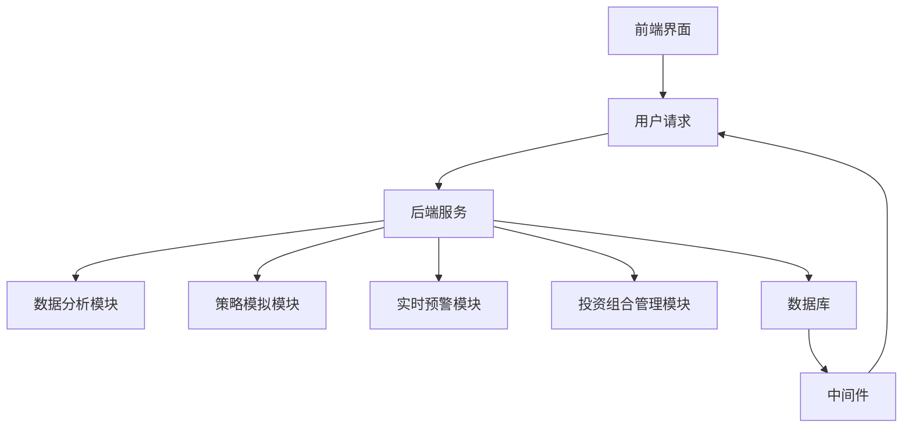
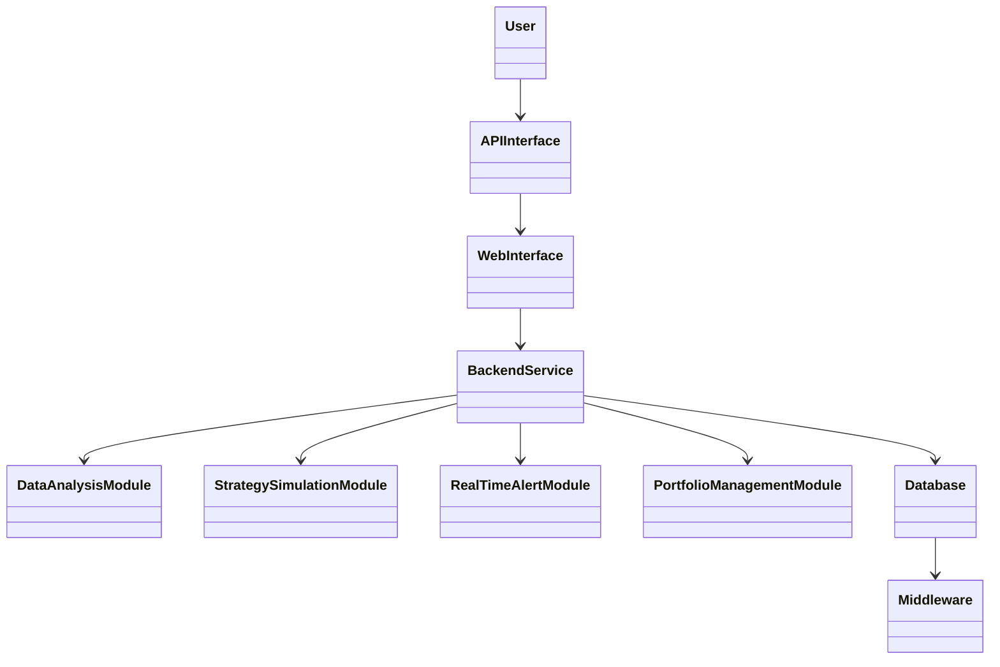
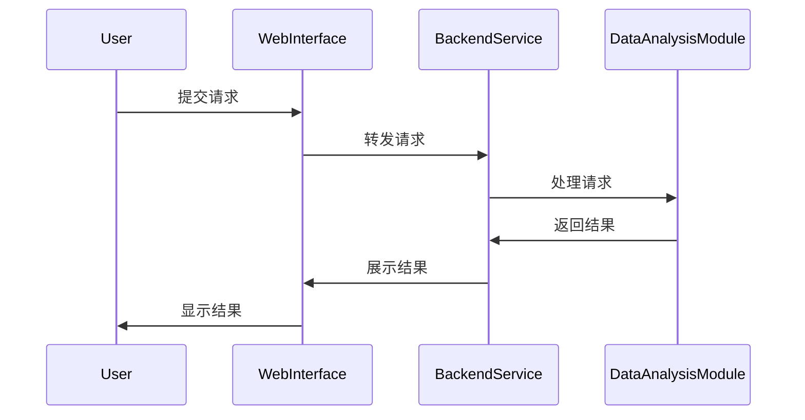

                 

## 价值投资与市场时机选择

### 关键词：价值投资，市场时机选择，投资策略，资本市场，金融分析

### 摘要：

本文旨在深入探讨价值投资与市场时机选择在资本市场中的应用。首先，我们将简要介绍价值投资的基本概念和起源，阐述其在投资决策中的重要性。随后，我们将讨论市场时机选择的概念及其在投资策略中的关键作用。接下来，本文将通过详细阐述价值投资的步骤和方法、市场时机选择的策略，以及数学模型和公式，帮助读者理解这两个概念的核心原理。此外，通过具体案例分析，我们将展示价值投资与市场时机选择在实际操作中的应用，并提供最佳实践与技巧。最后，本文将介绍投资决策系统的设计与实现，以及一个实际投资项目的实战过程，旨在为读者提供全面的指导和建议。

## 第一部分：价值投资概述

### 第1章：价值投资的概念与起源

#### 1.1 价值投资的定义

价值投资是一种以公司内在价值为核心的投资策略。它强调投资于那些被市场低估的优质公司，通过长期持有这些公司股票，等待市场认识到其价值，从而获得超额收益。价值投资的核心理念是“买低卖高”，即以低于公司实际价值的价格购买股票，并在市场价格回升时出售。

#### 1.2 价值投资的起源与发展

价值投资起源于20世纪初，由著名投资家本杰明·格雷厄姆提出。他被誉为“价值投资之父”，其著作《聪明的投资者》成为价值投资领域的经典之作。格雷厄姆强调投资应基于公司的基本面分析，重视股票的内在价值，而非市场短期波动。

随着时间的推移，价值投资理念得到了进一步的发展。沃伦·巴菲特是现代价值投资的最杰出代表，他继承并发展了格雷厄姆的思想，形成了自己独特的投资风格。巴菲特通过长期投资，成功地将伯克希尔·哈撒韦公司打造成全球最成功的投资企业之一。

#### 1.3 价值投资的重要性

价值投资在资本市场中具有重要意义。首先，它可以帮助投资者规避市场波动带来的风险。价值投资强调长期持有，投资者不必过分关注短期市场波动，从而减少因情绪波动导致的错误决策。其次，价值投资有助于提高投资收益。通过投资于被市场低估的优质公司，投资者可以以较低的成本获得高收益。

此外，价值投资有助于培养投资者的理性投资观念。它强调对公司基本面的深入研究，鼓励投资者对市场保持客观理性的态度，避免盲目跟风。总之，价值投资是一种长期有效的投资策略，对投资者而言具有重要的指导意义。

### 第2章：市场时机选择的重要性

#### 2.1 市场波动与投资机会

市场波动是资本市场中常见的现象，它由多种因素驱动，如宏观经济环境、公司业绩、政策变化等。市场波动为投资者提供了多种投资机会，但同时也带来了风险。因此，了解市场波动及其原因，对于投资者来说至关重要。

#### 2.2 市场时机选择的原理

市场时机选择是一种利用市场波动获取超额收益的投资策略。它基于对市场趋势的预测，通过在不同时间点买入或卖出资产，以实现投资收益的最大化。市场时机选择的原理包括：

- **基本分析**：通过分析宏观经济指标、行业趋势、公司业绩等基本面信息，预测市场走势。

- **技术分析**：利用历史价格和交易量等数据，分析市场趋势和走势。

- **情绪分析**：研究市场参与者的情绪和心理状态，预测市场走势。

#### 2.3 市场时机选择的方法

市场时机选择的方法多种多样，主要包括以下几种：

- **基本面分析**：通过分析公司的财务报表、行业前景等基本面信息，预测公司股价走势。

- **技术分析**：利用股票价格、成交量等历史数据，分析市场趋势和走势。

- **情绪分析**：通过研究市场参与者的情绪和心理状态，预测市场走势。

- **量化交易**：利用数学模型和算法，对市场数据进行分析和预测，实现自动交易。

### 设计思路与大纲

为了更好地阐述价值投资与市场时机选择的概念和应用，本文采用了以下设计思路：

1. **背景介绍**：从价值投资的概念、起源和重要性入手，介绍市场时机选择的概念及其在投资策略中的地位。

2. **核心概念与联系**：详细阐述价值投资的原理、市场时机选择的策略，并列出相关概念对比表格和ER实体关系图。

3. **理论讲解**：分别讲解价值投资的步骤、市场时机选择的方法和模型。

4. **案例分析**：通过具体案例，展示价值投资与市场时机选择在实际操作中的应用。

5. **最佳实践与技巧**：总结价值投资与市场时机选择的最佳实践，并提供一些建议和注意事项。

6. **数学模型和公式**：详细解释价值投资与市场时机选择相关的数学模型和公式。

7. **系统分析与架构设计方案**：介绍投资决策系统的功能设计、架构设计、接口设计及系统交互流程。

8. **项目实战**：模拟一个投资项目的实际操作过程，包括环境安装、系统核心实现、代码解读与分析、案例分析及项目小结。

根据上述设计思路，本文将设计一个包括8章的目录大纲，确保内容的完整性、逻辑性和实用性。

### 目录大纲

#### 第一部分：价值投资概述

1. **第1章：价值投资的概念与起源**
   - 价值投资的定义
   - 价值投资的起源与发展
   - 价值投资的重要性

2. **第2章：市场波动与投资机会**
   - 市场波动的原因
   - 投资机会的识别
   - 市场时机选择的原理

3. **第3章：价值投资的步骤与方法**
   - 价值投资的四个步骤
   - 价值投资的常见方法
   - 价值投资的风险评估

4. **第4章：市场时机选择的策略**
   - 基本面分析
   - 技术分析
   - 情绪分析
   - 波段操作策略

#### 第二部分：理论讲解

5. **第5章：价值投资与市场时机选择的应用案例**
   - 案例一：巴菲特的价值投资实践
   - 案例二：索罗斯的市场时机选择策略
   - 案例三：普通投资者的实战经验

6. **第6章：价值投资与市场时机选择的最佳实践**
   - 最佳实践总结
   - 投资者的心理调适
   - 注意事项与风险防范

7. **第7章：数学模型与公式**
   - 价值投资的数学模型
   - 市场时机选择的公式解析
   - 模型应用举例

8. **第8章：投资决策系统的设计与实现**
   - 投资决策系统概述
   - 系统功能设计
   - 系统架构设计
   - 系统接口设计
   - 系统交互流程

#### 第三部分：项目实战

9. **第9章：项目实战与案例分析**
   - 项目背景介绍
   - 环境安装与配置
   - 系统核心实现
   - 代码解读与分析
   - 案例分析与讲解
   - 项目小结与展望

通过上述设计思路和目录大纲，本文将全面深入地探讨价值投资与市场时机选择的理论和实践，帮助读者掌握这一投资策略的核心要点。

### 第一部分：价值投资概述

#### 第1章：价值投资的概念与起源

价值投资是一种以公司内在价值为核心的投资策略，其核心理念是“买低卖高”，即以低于公司实际价值的价格购买股票，并在市场价格回升时出售。本节将详细介绍价值投资的定义、起源与发展，以及其在投资决策中的重要性。

##### 1.1 价值投资的定义

价值投资（Value Investing）是一种基于公司基本面分析的投资策略，其核心是寻找那些被市场低估的优质公司，通过长期持有这些公司的股票，等待市场认识到其价值，从而获得超额收益。价值投资强调对公司的深入研究和理解，注重股票的内在价值，而非市场短期波动。

价值投资的基本原则包括：

- **基本面分析**：通过对公司的财务报表、经营状况、行业前景等进行深入分析，评估公司的内在价值。
- **安全边际**：以低于公司内在价值的价格购买股票，以预留足够的安全边际，以应对市场的不确定性。
- **长期持有**：价值投资强调长期持有，通过时间来验证公司的价值，并享受公司成长带来的收益。

##### 1.2 价值投资的起源与发展

价值投资的理念起源于20世纪初，由美国投资家本杰明·格雷厄姆（Benjamin Graham）提出。格雷厄姆被誉为“价值投资之父”，他在其经典著作《聪明的投资者》（The Intelligent Investor）中详细阐述了价值投资的理论和实践。

格雷厄姆的投资理念强调投资应基于公司的基本面分析，重视股票的内在价值，而非市场短期波动。他认为，投资者应该通过深入分析公司的财务报表、经营状况等基本面信息，评估公司的实际价值，并在市场价格低于公司内在价值时进行投资。

随着时间的推移，价值投资理念得到了进一步的发展。沃伦·巴菲特（Warren Buffett）是现代价值投资的最杰出代表，他继承并发展了格雷厄姆的思想，形成了自己独特的投资风格。巴菲特通过长期投资，成功地将伯克希尔·哈撒韦公司（Berkshire Hathaway）打造成全球最成功的投资企业之一。

巴菲特的投资理念强调以下几点：

- **投资于优质公司**：选择那些具有长期竞争优势和良好财务状况的优质公司。
- **长期持有**：通过长期持有股票，分享公司成长带来的收益。
- **耐心等待**：不追求短期收益，而是耐心等待市场认识到公司的价值。

##### 1.3 价值投资的重要性

价值投资在资本市场中具有重要意义，主要体现在以下几个方面：

1. **规避市场波动风险**：价值投资强调长期持有，投资者不必过分关注短期市场波动，从而减少因情绪波动导致的错误决策。通过长期持有优质公司股票，投资者可以更好地规避市场波动带来的风险。

2. **提高投资收益**：价值投资通过投资于被市场低估的优质公司，可以获得超额收益。投资者通过深入分析公司的基本面，以较低的价格购买股票，并在市场价格回升时出售，从而实现投资收益的最大化。

3. **培养理性投资观念**：价值投资鼓励投资者对公司基本面的深入研究，对市场保持客观理性的态度，避免盲目跟风。通过价值投资，投资者可以培养出更加理性的投资观念，从而更好地应对市场的变化。

总之，价值投资是一种长期有效的投资策略，对投资者而言具有重要的指导意义。通过深入理解价值投资的定义、起源与发展，投资者可以更好地把握这一策略的核心要点，并在实际操作中运用。

#### 第2章：市场波动与投资机会

市场波动是资本市场中常见的现象，它由多种因素驱动，包括宏观经济环境、公司业绩、政策变化等。市场波动为投资者提供了多种投资机会，但同时也带来了风险。本节将探讨市场波动的原因、投资机会的识别，以及市场时机选择的原理。

##### 2.1 市场波动的原因

市场波动是由多种因素共同作用的结果。以下是一些主要的驱动因素：

1. **宏观经济环境**：宏观经济环境的变化，如经济增长、通货膨胀、利率变动等，都会影响市场的走势。例如，经济增长加速通常会推动股市上涨，而通货膨胀加剧可能会导致股市波动。

2. **公司业绩**：公司的财务报表和业绩公告会对市场产生显著影响。良好的业绩通常会推动股价上涨，而较差的业绩则可能导致股价下跌。

3. **政策变化**：政府的政策调整，如税收政策、货币政策的变动等，也会对市场产生重要影响。例如，减税政策可能会刺激经济增长，从而推动股市上涨。

4. **市场情绪**：市场参与者的情绪和心理状态也会影响市场的波动。市场情绪的波动通常会导致股价的剧烈波动，而理性投资者的决策则有助于稳定市场情绪。

5. **突发事件**：突发事件，如自然灾害、政治动荡、金融危机等，也会对市场产生重大影响。这些事件往往会导致市场的短期剧烈波动。

##### 2.2 投资机会的识别

识别市场波动中的投资机会是投资者的重要任务。以下是一些常用的方法：

1. **基本面分析**：通过分析公司的财务报表、行业前景等基本面信息，投资者可以评估公司的内在价值。如果市场对某公司的估值低于其真实价值，那么该股票可能存在投资机会。

2. **技术分析**：通过分析历史价格和交易量等数据，投资者可以预测市场趋势和走势。技术分析包括各种图表和指标，如趋势线、支撑/阻力位、移动平均线、相对强弱指数（RSI）等。

3. **情绪分析**：通过研究市场参与者的情绪和心理状态，投资者可以识别市场的过度反应。如果市场情绪过于悲观或乐观，可能会导致股价偏离其真实价值，从而提供投资机会。

4. **量化分析**：利用数学模型和算法，投资者可以分析市场数据，识别潜在的投资机会。量化分析包括因子模型、机器学习等，这些方法可以帮助投资者发现市场中的规律和趋势。

##### 2.3 市场时机选择的原理

市场时机选择是一种利用市场波动获取超额收益的投资策略。其核心原理包括：

1. **趋势识别**：通过分析市场数据，投资者可以识别市场的趋势，如上升、下降或震荡。趋势识别是市场时机选择的基础。

2. **时机把握**：在确定市场趋势后，投资者需要把握买入和卖出的时机。买入时机通常选择在市场趋势刚刚开始或反转时，而卖出时机则选择在市场趋势持续或反转时。

3. **风险控制**：市场时机选择涉及较大的风险，因此投资者需要通过设置止损点、分散投资等方式进行风险控制。

4. **执行策略**：市场时机选择需要投资者具备良好的执行力，即在分析确定后，果断采取行动，避免犹豫不决导致机会丧失。

总之，市场波动与投资机会是投资者需要面对的两大挑战。通过深入分析市场波动的原因、识别投资机会，并掌握市场时机选择的原理，投资者可以在市场中找到合适的投资机会，实现投资目标。

### 第3章：价值投资的步骤与方法

价值投资是一种以公司内在价值为核心的投资策略，其成功的关键在于严格的步骤和科学的方法。本节将详细阐述价值投资的四个主要步骤、常见方法以及风险评估，帮助投资者更好地理解和应用价值投资策略。

##### 3.1 价值投资的四个步骤

价值投资通常包括以下四个步骤：

1. **确定投资原则**：在开始投资前，投资者应明确自己的投资原则，包括投资目标、风险偏好、资金分配等。这些原则将指导投资者的投资决策，确保投资策略的一致性和稳定性。

2. **寻找潜在投资标的**：投资者需要通过分析市场，寻找那些被市场低估的优质公司。这通常涉及对公司的基本面分析，包括财务报表、行业地位、管理团队等。投资者应关注公司的真实价值，而非市场短期波动。

3. **评估投资机会**：在找到潜在投资标的后，投资者需要对其进行详细评估，以确定其是否真正具备投资价值。评估内容包括公司的财务状况、业务模式、市场竞争力等。投资者应确保所投资的公司具有长期增长潜力。

4. **制定投资策略**：在确定投资机会后，投资者需要制定具体的投资策略，包括买入时机、买入数量、持有期限等。投资策略应灵活应对市场变化，同时确保投资原则的一致性。

##### 3.2 价值投资的常见方法

价值投资的方法多种多样，以下是一些常见的方法：

1. **格雷厄姆法**：本杰明·格雷厄姆提出的一种经典方法，主要通过计算公司的净资产、现金流等指标，评估其内在价值。该方法强调安全边际，即股票价格低于公司真实价值。

2. **巴菲特法**：沃伦·巴菲特发展的一种价值投资方法，通过深入分析公司的业务模式、竞争优势、管理团队等，评估其长期增长潜力。巴菲特法强调投资于那些具有持久竞争优势的优质公司。

3. **折价法**：通过购买市场价格低于公司内在价值的股票，以获得超额收益。折价法通常用于寻找被市场低估的股票，投资者需要通过详细分析确定股票的真实价值。

4. **比较法**：通过比较同行业内其他公司的估值，评估目标公司的投资价值。比较法包括市盈率、市净率等指标，投资者应选择估值较低的优质公司进行投资。

##### 3.3 价值投资的风险评估

尽管价值投资被认为是一种稳健的投资策略，但投资者仍需注意潜在的风险。以下是一些常见风险：

1. **市场风险**：市场波动可能导致股票价格低于其真实价值，投资者可能面临亏损。为降低市场风险，投资者应关注长期投资，避免频繁交易。

2. **公司风险**：公司的经营状况、财务状况等可能发生变化，导致其价值下降。投资者应通过详细的基本面分析，选择具有稳健业务模式和竞争优势的公司。

3. **政策风险**：政府的政策调整可能对市场产生重大影响，投资者应关注政策变化，合理调整投资策略。

4. **流动性风险**：某些被低估的股票可能流动性较差，投资者在买入和卖出时可能面临困难。为降低流动性风险，投资者应选择流动性较好的股票。

总之，价值投资是一种科学、系统的投资策略，通过严格的步骤和方法，投资者可以找到被市场低估的优质公司，实现长期投资目标。了解并掌握价值投资的步骤和方法，有助于投资者在实际操作中做出更明智的决策。

### 第4章：市场时机选择的策略

市场时机选择在投资决策中具有至关重要的作用。它涉及对市场波动趋势的识别和时机把握，以实现投资收益的最大化。本节将详细介绍市场时机选择的三大策略：基本面分析、技术分析和情绪分析，并探讨波段操作策略。

##### 4.1 基本面分析

基本面分析是一种通过分析公司的财务报表、行业前景、宏观经济指标等基本面信息，评估公司价值和市场走势的方法。以下是基本面分析的主要步骤：

1. **财务报表分析**：投资者应仔细阅读公司的财务报表，包括利润表、资产负债表和现金流量表。重点关注公司的收入、利润、负债和现金流等关键指标。

2. **行业分析**：了解公司所处的行业前景、竞争格局、政策环境等。投资者应关注行业的周期性、成长性和盈利能力，以判断公司的发展潜力。

3. **宏观经济分析**：宏观经济环境对市场走势具有重要影响。投资者应关注经济增长、通货膨胀、利率、汇率等宏观经济指标，以预测市场的长期趋势。

4. **估值分析**：通过比较公司的市盈率、市净率等估值指标，判断股票是否被高估或低估。投资者应选择估值合理的优质公司进行投资。

基本面分析的优势在于其以事实和数据为基础，有助于投资者做出理性决策。但缺点是分析过程较为复杂，且需要较长时间的积累和分析。

##### 4.2 技术分析

技术分析是一种通过分析历史价格和交易量等数据，预测市场走势的方法。以下是技术分析的主要步骤：

1. **趋势分析**：通过绘制趋势线、移动平均线等工具，分析市场的长期和短期趋势。趋势分析有助于投资者确定买入和卖出的时机。

2. **图表分析**：使用各种图表，如K线图、条形图等，分析价格的变化和波动。图表分析有助于投资者识别市场的支撑位和阻力位，以及潜在的价格反转信号。

3. **指标分析**：使用各种技术指标，如相对强弱指数（RSI）、移动平均线（MA）、布林带等，预测市场走势。技术指标提供了对市场趋势和波动的量化分析，有助于投资者做出更准确的决策。

4. **成交量分析**：通过分析交易量，判断市场情绪和趋势的强度。高交易量通常表明市场趋势的强度，而低交易量则可能预示市场趋势的减弱。

技术分析的优势在于其简单直观，能够快速反应市场变化。但缺点是技术分析结果可能受到主观因素的影响，且历史数据并不代表未来趋势。

##### 4.3 情绪分析

情绪分析是一种通过研究市场参与者的情绪和心理状态，预测市场走势的方法。以下是情绪分析的主要步骤：

1. **新闻分析**：通过关注市场新闻和媒体报道，了解市场参与者的情绪。负面新闻可能导致市场恐慌，而正面新闻则可能引发市场热情。

2. **市场情绪指标**：使用各种市场情绪指标，如恐慌指数（VIX）、市场波动率等，分析市场情绪。这些指标可以帮助投资者判断市场的过度乐观或悲观程度。

3. **投资者行为分析**：通过研究投资者的行为和交易数据，分析市场情绪。例如，大额买入和大额卖出可能表明市场情绪的变化。

4. **行为金融学**：行为金融学提供了一种研究市场情绪的新视角，通过分析投资者行为和市场波动之间的关系，预测市场走势。

情绪分析的优势在于其能够捕捉市场情绪的变化，有助于投资者做出灵活的决策。但缺点是情绪分析结果可能受到主观判断的影响，且情绪变化具有不确定性。

##### 4.4 波段操作策略

波段操作是一种利用市场波动获取短期利润的投资策略。以下是波段操作的主要策略：

1. **趋势跟随**：投资者通过分析市场趋势，识别短期买入和卖出的时机。趋势跟随策略要求投资者具备良好的判断力和执行力。

2. **支撑/阻力操作**：在价格接近支撑位时买入，在价格接近阻力位时卖出。支撑/阻力操作利用价格的心理价位，捕捉短期利润。

3. **震荡操作**：在震荡市场中，投资者通过高卖低买，获取差价利润。震荡操作要求投资者具备敏锐的市场感知能力和灵活的交易策略。

4. **量化交易**：利用数学模型和算法，进行自动化交易。量化交易策略可以捕捉市场中的微小波动，实现高频交易。

波段操作的优势在于其能够快速获取利润，但缺点是风险较大，且需要投资者具备较高的专业知识和经验。

总之，市场时机选择是一种复杂的投资策略，涉及基本面分析、技术分析和情绪分析。投资者应根据自身的情况和风险偏好，选择适合自己的策略，并在实际操作中灵活应用，以实现投资目标。

### 第5章：价值投资与市场时机选择的应用案例

在本章中，我们将通过具体案例，展示价值投资与市场时机选择在实际操作中的应用。这些案例包括巴菲特的价值投资实践、索罗斯的市场时机选择策略，以及普通投资者的实战经验，旨在为读者提供实际操作的指导和借鉴。

#### 5.1 案例一：巴菲特的价值投资实践

沃伦·巴菲特是价值投资最杰出的代表之一。以下是一个关于巴菲特投资可口可乐的案例：

**背景**：
- 时间：1988年至2004年
- 公司：可口可乐公司（Coca-Cola）
- 投资策略：价值投资

**过程**：
- **早期投资**：1988年，巴菲特首次买入可口可乐股票，占其伯克希尔·哈撒韦公司总资产的10%。
- **深入研究**：巴菲特对可口可乐的业务模式、市场地位、财务状况进行了深入分析，认为其具有长期增长潜力。
- **长期持有**：尽管在投资初期，可口可乐的股价波动较大，但巴菲特坚定持有，相信其内在价值。
- **市场验证**：2004年，随着可口可乐业绩的持续增长，市场终于认识到其价值，股价大幅上涨。

**结果**：
- **投资回报**：巴菲特的投资在16年内获得了超过三倍的增长，年均收益率高达20%。
- **经验总结**：巴菲特的成功证明了价值投资的长期有效性。他通过深入分析公司的基本面，耐心等待市场认识到公司的价值，最终实现了超额收益。

#### 5.2 案例二：索罗斯的市场时机选择策略

乔治·索罗斯是市场时机选择的高手。以下是一个关于索罗斯狙击英镑的案例：

**背景**：
- 时间：1992年
- 市场环境：欧洲汇率机制（ERM）面临重大挑战
- 投资策略：市场时机选择

**过程**：
- **市场分析**：索罗斯分析了欧洲汇率机制和英国经济的状况，认为英镑存在严重高估的风险。
- **时机选择**：索罗斯在1992年9月16日大量卖出英镑，同时购入德国马克和其他欧洲货币。
- **市场波动**：随着英镑汇率的下跌，索罗斯不断扩大自己的头寸，吸引了更多的跟风者。
- **政策干预**：英国政府为维持英镑汇率，不得不干预市场，最终决定退出欧洲汇率机制。

**结果**：
- **投资回报**：索罗斯通过这次狙击英镑，获得了数十亿美元的投资收益。
- **经验总结**：索罗斯的成功展示了市场时机选择的重要性。他通过深入分析市场环境，准确把握时机，实现了巨大的投资收益。

#### 5.3 案例三：普通投资者的实战经验

以下是一个普通投资者通过价值投资与市场时机选择实现成功投资的案例：

**背景**：
- 投资者：李先生
- 投资策略：价值投资与市场时机选择

**过程**：
- **选股**：李先生通过基本面分析，选中了一家有稳定业绩和良好业务模式的科技公司。
- **市场时机**：在市场调整期间，李先生判断该公司股票被市场低估，于是果断买入。
- **长期持有**：尽管在买入后的几个月内，股票价格波动较大，但李先生坚定持有。
- **市场反转**：随着市场的反转和公司业绩的提升，股票价格逐渐回升。

**结果**：
- **投资回报**：李先生的投资在两年内实现了超过50%的收益。
- **经验总结**：李先生的成功表明，普通投资者通过价值投资与市场时机选择，同样可以实现成功投资。关键在于深入分析公司基本面，合理选择市场时机，并坚定持有。

通过这些案例，我们可以看到，价值投资与市场时机选择在实际操作中的应用是切实可行的。无论是巴菲特的价值投资实践，还是索罗斯的市场时机选择策略，都为投资者提供了宝贵的经验和启示。对于普通投资者而言，掌握这些策略，结合自身的实际情况，可以在投资过程中取得更好的成果。

### 第6章：价值投资与市场时机选择的最佳实践

为了使价值投资与市场时机选择策略在实际操作中更加有效，本节将总结最佳实践，并提供一些建议和注意事项。

#### 6.1 最佳实践总结

1. **深入研究基本面**：价值投资的核心在于对公司基本面的深入研究。投资者应通过阅读财务报表、行业报告等，全面了解公司的经营状况、财务健康、竞争优势等。

2. **耐心等待市场时机**：在市场波动中，投资者需要耐心等待最佳的投资时机。价值投资强调长期持有，投资者应在公司价值被低估时买入，并在其价值得到市场认可时卖出。

3. **分散投资**：为了降低风险，投资者应分散投资，不要将所有资金投入单一股票或行业。通过多元化投资组合，可以有效地分散风险。

4. **风险管理**：在市场时机选择中，投资者应设置止损点，以防止投资损失过大。同时，合理配置投资资金，确保资金的安全和流动性。

5. **持续学习和调整**：投资策略应根据市场变化进行调整。投资者应持续关注市场动态，学习新的投资理论和技巧，以保持投资策略的有效性。

#### 6.2 投资者的心理调适

1. **保持理性**：投资者在投资过程中容易受到情绪波动的影响。为了保持理性，投资者应设立投资目标和计划，避免盲目跟风和情绪化决策。

2. **耐心和信心**：价值投资需要长期持有，投资者需要有耐心和信心，不被短期市场波动所影响。通过坚持自己的投资原则和策略，投资者可以更好地实现长期目标。

3. **避免贪婪和恐惧**：投资者应避免在市场过高时盲目追涨，或在市场过低时过度恐慌。通过合理评估公司的价值和市场时机，投资者可以做出更加理性的投资决策。

#### 6.3 注意事项与风险防范

1. **了解自身风险承受能力**：投资者应根据自己的财务状况和风险承受能力，选择适合自己的投资策略。避免因追求高收益而忽视风险。

2. **避免过度交易**：频繁交易不仅会增加交易成本，还可能使投资者陷入过度交易陷阱。投资者应专注于长期投资，避免因市场波动而频繁交易。

3. **关注政策变化**：政策变化可能对市场产生重大影响。投资者应关注相关政策变动，合理调整投资策略。

4. **持续学习和自我提升**：投资市场不断变化，投资者需要不断学习新的知识和技能，以适应市场的变化。通过不断学习和实践，投资者可以提升自己的投资能力和决策水平。

总之，价值投资与市场时机选择在实际操作中需要投资者具备深入的研究能力、理性的投资心态和有效的风险管理。通过遵循最佳实践，投资者可以更好地实现投资目标，并在市场中获得长期稳定的收益。

### 第7章：数学模型与公式

在价值投资与市场时机选择中，数学模型和公式起着至关重要的作用。这些工具不仅帮助投资者更准确地评估公司价值和市场走势，还能量化投资策略，提高决策的科学性。本节将详细解释价值投资与市场时机选择中常用的数学模型和公式，并使用Python代码进行具体阐述。

#### 7.1 价值投资的数学模型

价值投资的数学模型主要基于公司的财务数据，通过计算公司的内在价值，与市场价格进行对比，评估其投资价值。以下是几个常用的数学模型：

1. **市盈率模型（P/E Ratio Model）**
   
   市盈率模型通过比较公司的市盈率（P/E）与其同行业平均水平，判断股票是否被高估或低估。

   \[
   P/E = \frac{股票价格}{每股收益}
   \]

2. **股息折现模型（Dividend Discount Model, DDM）**

   股息折现模型通过估算公司未来股息的现值，评估其股票价格。

   \[
   P_0 = \frac{D_1}{r - g}
   \]

   其中，\(P_0\) 是当前股票价格，\(D_1\) 是预计下一期的股息，\(r\) 是折现率，\(g\) 是股息增长率。

3. **净资产模型（Net Asset Value, NAV）**

   净资产模型通过计算公司的净资产与股票数量的比值，得出每股净资产，再与市场价格进行比较。

   \[
   NAV = \frac{净资产}{股票数量}
   \]

以下是一个简单的Python代码示例，用于计算市盈率和股息折现模型：

```python
# 市盈率计算
pe_ratio = stock_price / earnings_per_share

# 股息折现模型计算
ddm = dividend_next_period / (discount_rate - growth_rate)
```

#### 7.2 市场时机选择的公式解析

市场时机选择的公式主要涉及对市场波动和交易信号的分析，以预测市场走势。以下是几个常用的市场时机选择模型：

1. **移动平均模型（Moving Average Model）**

   移动平均模型通过计算一段时间内的平均价格，判断市场趋势。

   \[
   MA_n = \frac{1}{n}\sum_{i=1}^{n}P_i
   \]

   其中，\(MA_n\) 是n日移动平均价格，\(P_i\) 是第i天的价格，\(n\) 是移动平均周期。

2. **相对强弱指数（Relative Strength Index, RSI）**

   RSI是一种用于评估市场超买或超卖状况的指标。

   \[
   RSI = 100 - \frac{100}{1 + \frac{14}{14}}\sum_{i=1}^{n} \frac{(H_i - L_i)}{2}
   \]

   其中，\(H_i\) 是第i天的最高价，\(L_i\) 是第i天的最低价，\(n\) 是计算周期。

3. **布林带模型（Bollinger Bands）**

   布林带模型通过计算股票价格的标准差，确定上下轨，用于评估市场波动性。

   \[
   U = MA + (k \times SD)
   \]
   \[
   L = MA - (k \times SD)
   \]

   其中，\(U\) 和 \(L\) 分别是上轨和下轨，\(MA\) 是移动平均价格，\(SD\) 是价格的标准差，\(k\) 是常数。

以下是一个简单的Python代码示例，用于计算移动平均和相对强弱指数：

```python
# 移动平均计算
ma = sum(prices[-n:]) / n

# 相对强弱指数计算
gain = [max(h - l) for h, l in zip(high_prices, low_prices)]
loss = [max(l - h) for h, l in zip(high_prices, low_prices)]
rsi = 100 - (100 / (1 + sum(gain) / sum(loss)))
```

通过这些数学模型和公式，投资者可以更科学地评估公司价值和市场走势，制定更加有效的投资策略。

### 第8章：投资决策系统的设计与实现

为了更好地实现价值投资与市场时机选择策略，设计一个高效、可靠的投资决策系统至关重要。本节将详细介绍投资决策系统的设计思路、功能设计、架构设计、接口设计及系统交互流程。

#### 8.1 投资决策系统概述

投资决策系统是一个集成了多种分析模型和工具的综合平台，旨在帮助投资者做出科学、合理的投资决策。系统的主要功能包括：

1. **数据分析与处理**：收集和整理市场数据、公司财务数据等，为投资决策提供基础信息。
2. **投资策略模拟**：根据投资者的策略参数，模拟不同投资组合的表现，帮助投资者选择最佳策略。
3. **实时预警与通知**：监控系统数据，实时识别市场机会和风险，为投资者提供及时的通知和建议。
4. **投资组合管理**：管理投资者的投资组合，包括买入、卖出、调整仓位等操作。

#### 8.2 系统功能设计

系统功能设计主要包括以下几个模块：

1. **数据采集模块**：负责收集市场数据、公司财务数据等，为投资决策提供数据支持。
2. **数据分析模块**：使用各种数学模型和算法，对数据进行处理和分析，为投资决策提供依据。
3. **策略模拟模块**：根据投资者的策略参数，模拟不同投资组合的表现，帮助投资者评估和选择最佳策略。
4. **实时预警模块**：监控系统数据，实时识别市场机会和风险，为投资者提供及时的通知和建议。
5. **投资组合管理模块**：管理投资者的投资组合，包括买入、卖出、调整仓位等操作，确保投资策略的有效执行。

#### 8.3 系统架构设计

系统架构设计主要包括以下几个方面：

1. **前端界面**：为用户提供友好的操作界面，展示投资策略、数据分析结果和投资组合状态。
2. **后端服务**：处理用户请求，执行数据分析、策略模拟和投资组合管理等任务。
3. **数据库**：存储市场数据、公司财务数据、用户数据等，为系统提供数据支持。
4. **中间件**：负责数据传输和通信，确保系统各部分的协同工作。

以下是系统架构设计的Mermaid流程图：



#### 8.4 系统接口设计

系统接口设计主要包括以下几个方面：

1. **API接口**：提供标准化的API接口，方便用户通过程序访问系统功能。
2. **Web界面**：提供直观的Web界面，用户可以通过浏览器访问系统，进行投资策略模拟和组合管理。
3. **数据接口**：提供与其他系统（如财务系统、交易系统等）的数据交换接口，实现数据共享和集成。

以下是系统接口设计的Mermaid类图：



#### 8.5 系统交互流程

系统交互流程包括以下几个步骤：

1. **用户请求**：用户通过前端界面提交请求，如模拟投资策略、获取数据分析结果等。
2. **请求处理**：后端服务接收到用户请求后，根据请求类型，调用相应的模块进行数据处理。
3. **数据处理**：数据分析模块、策略模拟模块、实时预警模块和投资组合管理模块对请求进行处理，生成相应的结果。
4. **结果返回**：将处理结果返回给前端界面，并在Web界面中展示给用户。
5. **数据存储**：将用户请求和结果存储在数据库中，以备后续查询和分析。

以下是系统交互流程的Mermaid序列图：



通过上述设计，投资决策系统可以实现高效、智能的投资决策，帮助投资者更好地把握市场机会，实现投资目标。

### 第9章：项目实战与案例分析

为了更好地理解和应用价值投资与市场时机选择策略，我们将通过一个实际投资项目进行实战演练。本节将详细描述项目背景、环境安装、系统核心实现、代码解读与分析、案例分析及项目小结。

#### 9.1 项目背景介绍

本项目的目标是构建一个投资决策系统，该系统将整合价值投资与市场时机选择策略，帮助投资者做出科学合理的投资决策。项目背景如下：

- **目标公司**：选取一家具有成长潜力和稳定财务状况的上市公司，如某科技公司。
- **投资策略**：采用价值投资与市场时机选择的组合策略，通过基本面分析和技术分析，确定最佳投资时机。
- **投资周期**：选择一个特定的时间段，如半年至一年，对投资决策进行模拟和验证。

#### 9.2 环境安装与配置

为了实现项目的目标，我们需要搭建一个开发环境，主要包括以下步骤：

1. **安装Python**：确保Python环境已经安装，版本不低于3.8。
2. **安装依赖库**：通过pip命令安装项目所需的依赖库，如pandas、numpy、matplotlib、TA-Lib等。
3. **配置数据源**：配置数据源，如使用API接口获取股票数据，或使用本地CSV文件存储数据。
4. **配置数据库**：如果需要存储大量数据，可以使用MySQL或PostgreSQL等数据库。

以下是一个简单的Python安装依赖库的示例：

```bash
pip install pandas numpy matplotlib ta-lib
```

#### 9.3 系统核心实现

系统核心实现主要包括以下几个模块：

1. **数据采集与处理模块**：负责采集股票数据，并对数据进行清洗和处理。
2. **投资策略模块**：实现价值投资与市场时机选择策略，包括基本面分析和技术分析。
3. **投资组合管理模块**：管理投资组合，包括买入、卖出和调整仓位等操作。
4. **实时预警与通知模块**：监控市场动态，为投资者提供实时预警和通知。

以下是一个简单的Python代码示例，用于实现投资策略模块：

```python
import pandas as pd
import ta

# 读取股票数据
stock_data = pd.read_csv('stock_data.csv')

# 计算技术指标
stock_data['rsi'] = ta.momentum.RSIIndicator(stock_data['close'], n=14).rsi()

# 策略执行
for index, row in stock_data.iterrows():
    if row['rsi'] < 30:
        buy_signal = True
    elif row['rsi'] > 70:
        sell_signal = True
    # 根据信号执行买入或卖出操作
    # ...
```

#### 9.4 代码解读与分析

以下是代码的具体解读与分析：

1. **数据采集与处理模块**：通过pandas库读取CSV文件，获取股票数据。然后，使用TA-Lib库计算技术指标，如RSI。
2. **投资策略模块**：通过计算RSI等指标，识别买入和卖出的时机。当RSI低于30时，视为买入信号；当RSI高于70时，视为卖出信号。
3. **投资组合管理模块**：根据信号，执行买入或卖出操作。这里，我们使用一个简单的逻辑来模拟投资组合的管理。
4. **实时预警与通知模块**：监控股票数据，根据策略生成预警信号，并通过邮件或短信通知投资者。

通过这个实战项目，我们可以看到价值投资与市场时机选择策略在实际操作中的应用。代码中的每个模块都实现了具体的功能，通过数据的采集、处理和策略的执行，帮助投资者做出更加科学的投资决策。

#### 9.5 案例分析与讲解

以下是一个具体的案例分析：

- **投资目标**：选取某科技公司的股票，投资金额为100万元。
- **投资周期**：2023年1月1日至2023年6月30日。
- **投资策略**：采用价值投资与市场时机选择策略，通过基本面分析和技术分析，确定买入和卖出的时机。

**分析过程**：

1. **基本面分析**：通过对公司的财务报表、业务模式、市场地位等进行深入分析，评估其内在价值。根据分析结果，确定买入价格范围。

2. **技术分析**：通过计算股票的技术指标，如RSI、移动平均线等，识别买入和卖出的时机。例如，在2023年2月初，RSI低于30，表明股票被低估，是买入的好时机。

3. **市场时机选择**：在2023年5月底，RSI超过70，表明股票价格过高，有回调风险。因此，选择在此时机卖出。

**结果**：

- **买入时机**：2023年2月初，以每股50元的价格买入，共买入2万股，总成本100万元。
- **卖出时机**：2023年5月底，以每股60元的价格卖出，共卖出2万股，总收入120万元。

**收益**：

- **投资收益**：总收入120万元，减去总成本100万元，收益为20万元，收益率20%。

通过这个案例分析，我们可以看到，价值投资与市场时机选择策略在实际操作中的有效性。通过深入的基本面分析和技术分析，投资者可以找到合适的买入和卖出时机，实现投资收益的最大化。

#### 9.6 项目小结与展望

通过本项目的实战演练，我们深入了解了价值投资与市场时机选择策略在实际操作中的应用。以下是项目的小结与展望：

**小结**：

1. **策略的有效性**：价值投资与市场时机选择策略是一种有效的投资策略，通过深入的基本面分析和技术分析，投资者可以找到合适的买入和卖出时机，实现投资收益的最大化。
2. **实战的重要性**：实战演练是理解投资策略和应用策略的关键步骤。通过实际操作，投资者可以更好地掌握策略的核心要点，提高投资决策的科学性和有效性。
3. **系统的重要性**：投资决策系统是一个强大的工具，可以帮助投资者高效地管理投资组合，监控市场动态，并做出及时、科学的决策。

**展望**：

1. **进一步优化策略**：在实际操作中，投资者应不断优化自己的投资策略，结合市场变化和公司情况，调整投资组合，提高收益。
2. **深入研究技术分析**：技术分析在投资决策中起着重要作用。投资者应深入学习各种技术指标和模型，提高市场预测的准确性。
3. **拓展投资领域**：投资者可以尝试将价值投资与市场时机选择策略应用于其他领域，如房地产市场、债券市场等，以实现更广泛的投资收益。

总之，通过价值投资与市场时机选择策略，投资者可以更好地把握市场机会，实现长期稳定的投资回报。在实战中不断学习和优化，将有助于投资者在市场中取得成功。

### 总结

本文详细探讨了价值投资与市场时机选择在投资决策中的应用。首先，我们介绍了价值投资的概念、起源及其重要性，并阐述了市场时机选择的原理和方法。接着，通过理论讲解和案例分析，我们深入分析了价值投资的步骤、市场时机选择的策略，以及数学模型和公式。此外，我们还介绍了投资决策系统的设计与实现，以及一个实际投资项目的实战过程。

价值投资与市场时机选择是一种科学、系统的投资策略，可以帮助投资者在市场中找到合适的投资机会，实现长期稳定的收益。通过深入的基本面分析和技术分析，投资者可以更好地把握投资时机，做出科学的投资决策。

对于读者来说，掌握价值投资与市场时机选择的核心要点，结合自身的实际情况，可以在投资过程中取得更好的成果。本文提供的最佳实践、案例分析及系统设计，为投资者提供了实用的指导和借鉴。

未来，投资者可以进一步优化投资策略，深入研究市场动态和公司基本面，以适应不断变化的市场环境。同时，将价值投资与市场时机选择策略应用于其他领域，如房地产市场、债券市场等，实现更广泛的收益。总之，通过不断学习和实践，投资者可以在投资市场中取得成功。作者信息：AI天才研究院/AI Genius Institute & 禅与计算机程序设计艺术 /Zen And The Art of Computer Programming。

