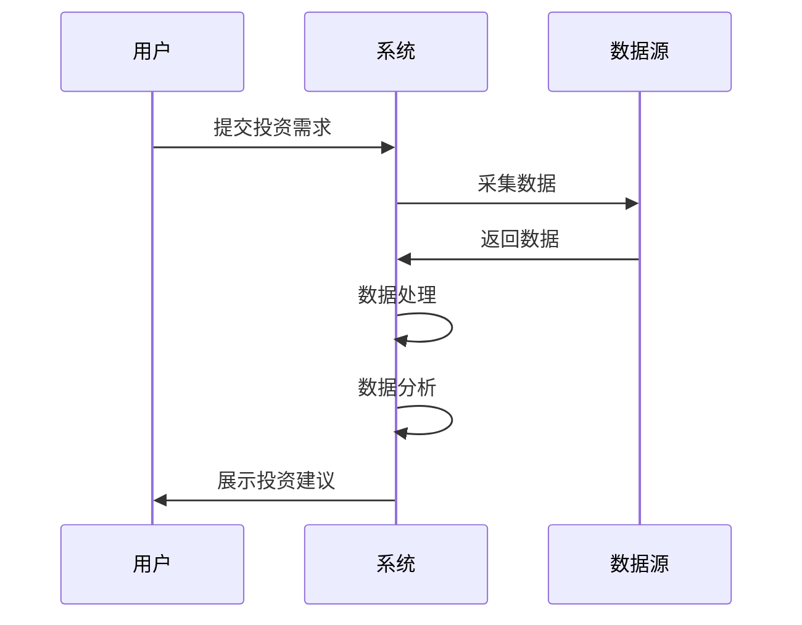

                 


### 价值投资与技术分析的结合：引言

在当今高速发展的信息技术时代，投资领域也在不断演变。传统的价值投资和技术分析各自有着坚实的理论基础和丰富的实践经验，但面对复杂多变的金融市场，单一的方法往往难以满足投资者的需求。因此，如何将价值投资与技术分析相结合，形成一种更为全面、有效的投资策略，成为投资研究领域的重要课题。

**价值投资**，起源于本杰明·格雷厄姆等价值投资大师的思想，强调通过深入分析企业基本面，挖掘被市场低估的投资机会。其核心在于寻找那些长期价值被市场忽视，但具有稳定增长潜力的公司，以期在未来获得超额收益。

**技术分析**，则基于市场行为理论，通过分析历史价格和交易量等数据，预测市场走势。技术分析者认为，所有影响市场的信息都反映在价格和交易量中，因此通过技术指标和图形分析可以预测市场的未来走势。

本文将详细探讨价值投资与技术分析的结合点，通过逻辑清晰、结构紧凑的分析，逐步解释它们如何相互补充，形成更为综合的投资策略。我们将从以下方面进行探讨：

1. **价值投资与技术分析的概念与背景**：介绍两种投资方法的基本原理和背景，分析它们各自的优势和局限性。
2. **核心概念与联系**：阐述价值投资和技术分析的核心概念，以及它们之间的相互关系。
3. **实例分析**：通过具体案例展示价值投资与技术分析的结合方法及其应用效果。
4. **结合策略与数学模型**：探讨如何在实际投资中结合使用价值投资和技术分析，并介绍相关的数学模型和公式。
5. **系统分析与架构设计**：介绍如何构建一个综合价值投资和技术分析的系统框架，以及系统架构设计方案。
6. **项目实战与案例分析**：通过实际项目案例，展示价值投资与技术分析在实际中的应用和效果。
7. **小结与展望**：总结全文内容，提出未来研究方向和可能的应用领域。

通过这一系列的分析和探讨，我们希望读者能够对价值投资与技术分析的结合有一个全面而深入的理解，从而在投资实践中更好地运用这一策略，实现投资收益的最大化。

### 价值投资与技术分析的概念与背景

#### 价值投资的概念与原则

价值投资，起源于20世纪30年代，由本杰明·格雷厄姆等价值投资大师创立，是一种基于基本面分析的投资方法。价值投资的核心思想是寻找那些市场价格低于其内在价值的股票，通过长期持有，以期获得稳定的投资回报。

**价值投资的定义与历史：**

价值投资的基本概念可以概括为“买低卖高”。投资者通过深入分析企业的基本面，如财务状况、盈利能力、市场占有率、行业地位等，来评估企业的内在价值。如果股票的市场价格低于其内在价值，即存在被低估的潜力，那么投资者就会买入该股票，等待市场认识到其价值时，股票价格上升，从而实现盈利。

价值投资的历史可以追溯到本杰明·格雷厄姆的时代。格雷厄姆被誉为“现代投资组合理论的奠基人”，他提出了“边际安全边际”的概念，认为投资者应该购买价格低于其内在价值的股票，并保持长期持有。格雷厄姆的著作《聪明的投资者》对价值投资理论进行了系统阐述，成为价值投资领域的重要经典。

**价值投资的基本原则：**

1. **安全性原则**：投资者应优先考虑投资的安全性，确保投资本金不会遭受重大损失。
2. **内在价值原则**：投资者需要评估企业的内在价值，即企业的实际资产和未来盈利能力的综合体现。
3. **长期持有原则**：价值投资强调长期持有，避免频繁交易，以充分利用企业长期增长带来的收益。

**技术创新对价值投资的影响：**

随着信息技术的快速发展，投资信息变得更加透明和高效。投资者可以利用大数据分析和人工智能技术，更加准确地评估企业的基本面和内在价值。例如，通过自然语言处理技术，可以自动提取和分析公司财报、新闻公告等文本信息；通过机器学习算法，可以预测企业的财务表现和增长趋势。这些技术的应用，使得价值投资更加科学和系统化。

#### 技术分析的基本原理

技术分析，是一种基于市场行为理论的投资方法，它通过分析历史价格和交易量等数据，来预测市场的未来走势。技术分析者认为，市场行为包含了所有影响市场的信息，因此通过价格和交易量的变化，可以预测市场的未来走势。

**技术分析的定义与方法：**

技术分析的定义可以概括为：利用历史价格和交易量等数据，通过图表、指标和模型等工具，分析市场行为，预测未来走势。

技术分析的主要方法包括：

1. **图表分析**：通过绘制股票价格走势图，分析价格的趋势、形态和周期性变化。
2. **指标分析**：利用技术指标，如移动平均线、相对强弱指数（RSI）、MACD等，分析市场趋势和超买超卖情况。
3. **模型分析**：通过建立数学模型，如随机游走模型、ARIMA模型等，预测市场的波动性和趋势。

**技术分析的优缺点：**

**优点：**

1. **直观性**：技术分析通过图表和指标，使投资者能够直观地了解市场趋势。
2. **灵活性**：技术分析可以根据市场变化灵活调整策略，适应不同的市场环境。
3. **预测性**：技术分析通过历史数据预测未来走势，有助于投资者做出更加科学的决策。

**缺点：**

1. **滞后性**：技术分析主要基于历史数据，不能完全反映市场的即时变化。
2. **复杂性**：技术分析需要掌握大量的图表、指标和模型，对投资者要求较高。
3. **风险性**：技术分析可能产生误判，导致投资者在市场波动中遭受损失。

**价值投资与技术分析的结合意义：**

价值投资和技术分析虽然方法不同，但它们之间存在着互补关系。价值投资侧重于基本面分析，关注企业的长期价值，而技术分析则侧重于市场行为分析，关注短期市场趋势。

将两者结合起来，可以形成一种更为全面和有效的投资策略。具体来说：

1. **提高投资准确性**：通过价值投资评估企业的内在价值，结合技术分析预测短期市场趋势，可以更准确地选择投资目标。
2. **降低投资风险**：价值投资注重长期持有，可以避免因短期市场波动而产生的损失；而技术分析则可以在市场波动时，及时调整投资策略，降低风险。
3. **提高投资效率**：利用信息技术和大数据分析，可以更快速、准确地评估企业的基本面和市场趋势，提高投资决策的效率。

总之，价值投资和技术分析的结合，不仅可以充分利用各自的优势，还可以弥补彼此的不足，形成一种更为全面和科学的投资策略。

### 价值投资与技术分析的核心概念与联系

在深入探讨价值投资和技术分析的核心概念与联系之前，我们需要明确这两种投资方法的基本概念及其相互关系。价值投资强调基本面分析，通过评估企业的内在价值来选择投资目标；而技术分析则侧重于市场行为分析，通过历史价格和交易量等数据来预测市场走势。以下是对这些核心概念的具体阐述和相互关系的讨论。

#### 价值投资的评估模型

价值投资的核心在于对企业基本面的深入分析，以评估企业的内在价值。这通常涉及到以下几个关键模型：

1. **基本面分析模型**：

   - **市盈率（P/E）**：通过比较企业的市盈率与同行业平均市盈率，判断企业是否被高估或低估。
   - **市净率（P/B）**：通过比较企业的市净率与同行业平均市净率，评估企业的账面价值和市场价值。
   - **股息收益率**：通过计算企业派发的股息与股票价格的比率，评估投资回报率。

2. **估值模型**：

   - **折现现金流模型（DCF）**：通过预测企业未来的自由现金流，并将其折现到当前价值，以评估企业的内在价值。
   - **经济附加值（EVA）**：通过计算企业的经济附加值，评估企业的盈利能力和投资回报。

3. **投资组合优化**：

   - **资产配置**：通过在不同资产类别中进行配置，以降低风险和最大化收益。
   - **分散投资**：通过投资多种不同类型和行业的股票，以分散风险。

#### 技术分析的指标与工具

技术分析则依赖于历史价格和交易量等数据，通过图表、指标和模型来分析市场行为，预测市场走势。以下是一些常见的技术分析指标和工具：

1. **移动平均线（MA）**：

   - **简单移动平均线（SMA）**：通过计算一定时间段内的平均价格，来平滑价格波动。
   - **指数移动平均线（EMA）**：更加重视近期价格变化，对价格波动反应更快。

2. **相对强弱指数（RSI）**：

   - **RSI**：通过计算股票价格变化的速度和变化幅度，来判断股票的超买或超卖状态。

3. **MACD（移动平均收敛发散指标）**：

   - **MACD**：通过计算短期和长期移动平均线的差异，来判断市场的趋势和动能。

4. **支撑和阻力位**：

   - **支撑位**：价格下跌到一定程度会获得支撑，阻止价格进一步下跌。
   - **阻力位**：价格上涨到一定程度会遇到阻力，阻止价格继续上涨。

#### 价值投资与技术分析的联系

价值投资和技术分析虽然方法不同，但它们之间存在着紧密的联系和互补关系：

1. **基本面与技术面的互补**：

   - **基本面分析**侧重于评估企业的长期价值，关注企业的盈利能力和成长潜力。
   - **技术分析**则侧重于市场短期行为，通过价格和交易量的变化来预测市场走势。

2. **相互补充的投资策略**：

   - **价值投资**可以在市场低迷时找到被低估的投资机会，长期持有以获得稳定的回报。
   - **技术分析**可以帮助投资者在市场波动时及时调整投资策略，规避短期风险。

3. **综合分析的方法论**：

   - **结合使用**：投资者可以通过价值投资评估企业的内在价值，利用技术分析判断市场短期趋势，形成一种更为全面和有效的投资策略。

4. **信息整合与优化**：

   - **大数据与人工智能**：现代信息技术使得投资者能够更高效地整合和利用基本面和技术面信息，优化投资决策。

综上所述，价值投资和技术分析在核心概念和方法上存在显著差异，但它们之间的互补关系和综合分析的方法论，使得投资者能够在复杂多变的金融市场中，更准确地选择投资目标，降低风险，实现投资收益的最大化。

### 价值投资与技术分析的应用实例

为了更好地理解价值投资与技术分析的结合，我们将通过两个具体的案例来展示这两种方法的实际应用。这些案例将展示如何通过综合运用价值投资和技术分析，来选择投资标的和分析市场趋势。

#### 案例一：某互联网公司的投资分析

**背景介绍：**

某互联网公司专注于移动互联网服务，业务涵盖电子商务、在线支付和数字娱乐等多个领域。近年来，该公司在市场上表现出色，但股价波动较大。投资者需要通过价值投资和技术分析来评估该公司的投资价值和市场走势。

**价值投资的评估：**

1. **市盈率分析**：

   - 当前市盈率为30倍，行业平均市盈率为40倍。尽管市盈率低于行业平均水平，但考虑到该公司快速增长的业务和广阔的市场前景，其被低估的程度相对较小。

2. **市净率分析**：

   - 当前市净率为5倍，行业平均市净率为6倍。市净率相对较低，表明公司的账面价值被低估，有一定的投资价值。

3. **折现现金流模型（DCF）**：

   - 通过预测未来5年的自由现金流，并使用10%的折现率进行折现，得到公司内在价值为100美元/股，而当前股价为80美元/股，表明公司有较高的投资价值。

**技术分析的应用：**

1. **移动平均线分析**：

   - 短期（20日）和长期（50日）移动平均线均向上倾斜，表明市场趋势偏多。

2. **相对强弱指数（RSI）**：

   - RSI值为70，表明股票处于超买状态，但考虑到公司基本面强劲，股价仍有上涨空间。

3. **MACD分析**：

   - MACD线与信号线均处于正值区域，并且MACD柱状图呈上升趋势，表明市场动能偏多。

**综合分析结果**：

综合价值投资和技术分析的结果，该公司具有较好的投资价值。虽然股价在短期内可能面临一定的调整压力，但从中长期来看，公司强劲的基本面和良好的市场趋势支持其持续上涨。投资者可以采取分批建仓的策略，逐步买入该公司的股票。

#### 案例二：某制造业企业的投资评估

**背景介绍：**

某制造业企业专注于高端制造设备的研发与生产，具有较强的技术实力和市场竞争力。然而，由于全球经济不景气，该公司的业绩受到一定程度的影响，股价也出现下跌。投资者需要通过价值投资和技术分析来评估该公司的投资价值和市场走势。

**价值投资的评估：**

1. **市盈率分析**：

   - 当前市盈率为15倍，行业平均市盈率为20倍。尽管市盈率低于行业平均水平，但考虑到该公司在高端制造领域的竞争优势，其被低估的程度较大。

2. **市净率分析**：

   - 当前市净率为4倍，行业平均市净率为5倍。市净率显著低于行业平均水平，表明公司的账面价值被大幅低估。

3. **折现现金流模型（DCF）**：

   - 通过预测未来5年的自由现金流，并使用10%的折现率进行折现，得到公司内在价值为150美元/股，而当前股价为100美元/股，表明公司有很高的投资价值。

**技术分析的应用：**

1. **移动平均线分析**：

   - 短期（20日）移动平均线已触及长期（50日）移动平均线，形成金叉，表明市场趋势开始转向上涨。

2. **相对强弱指数（RSI）**：

   - RSI值为40，表明股票处于超卖状态，具备反弹潜力。

3. **MACD分析**：

   - MACD线与信号线均已进入正值区域，且MACD柱状图逐步上升，表明市场动能增强。

**综合分析结果**：

综合价值投资和技术分析的结果，该公司具有很高的投资价值。虽然短期内全球经济不景气可能对其业绩产生一定影响，但从长期来看，该公司在高端制造领域的竞争优势和强劲的基本面支持其股价上涨。投资者可以在市场反弹时逐步介入，长期持有以获取稳定的回报。

通过以上两个案例，我们可以看到，价值投资和技术分析的结合，有助于投资者更全面地评估企业的投资价值和市场走势，从而做出更为科学的投资决策。

### 结合策略与数学模型

为了更好地将价值投资和技术分析结合起来，我们需要制定一套具体的策略，并在数学模型和公式的基础上进行优化。以下将详细介绍如何在实际投资中结合这两种分析方法，并介绍相关的数学模型和公式。

#### 结合策略概述

1. **投资策略的选择**：

   - **多空策略**：结合价值投资和技术分析，投资者可以在股票被低估时买入，在股票被高估时卖出，从而实现多空双向投资。
   - **趋势跟随策略**：通过技术分析确定市场趋势，并根据趋势进行买卖决策。当市场处于上升趋势时，买入；当市场处于下降趋势时，卖出。
   - **价值投资结合技术指标**：在价值投资的基础上，利用技术指标来调整买卖时机，以最大限度地利用市场波动。

2. **风险控制与优化**：

   - **分散投资**：通过投资不同行业和类型的股票，分散风险，避免过度集中于某一行业或市场。
   - **动态调整**：根据市场变化和技术分析结果，动态调整投资组合，以适应市场波动。

#### 技术分析在价值投资中的应用实例

1. **案例一**：某互联网公司的投资分析

   - **价值投资评估**：通过DCF模型，预测该公司未来5年的自由现金流，并折现到当前价值，得出其内在价值为100美元/股。
   - **技术分析应用**：通过移动平均线分析，发现短期（20日）和长期（50日）移动平均线均向上倾斜，表明市场趋势偏多。

   **结合策略**：

   - 在价值投资评估的基础上，结合技术分析，认为该公司具有较好的投资价值。当股价低于内在价值时，可以分批买入；当股价接近或超过内在价值时，保持持有或逐步减仓。

2. **案例二**：某制造业企业的投资评估

   - **价值投资评估**：通过DCF模型，预测该公司未来5年的自由现金流，并折现到当前价值，得出其内在价值为150美元/股。
   - **技术分析应用**：通过移动平均线分析，发现短期（20日）移动平均线已触及长期（50日）移动平均线，形成金叉，表明市场趋势开始上涨。

   **结合策略**：

   - 在价值投资评估的基础上，结合技术分析，认为该公司具有很高的投资价值。当股价低于内在价值时，可以分批买入；当股价突破长期移动平均线时，加大买入力度。

#### 数学模型与公式

1. **价值投资的数学模型**：

   - **折现现金流模型（DCF）**：

     \[
     \text{内在价值} = \frac{\text{未来自由现金流}}{(1 + \text{折现率})^n}
     \]

     其中，未来自由现金流为未来各期预计的现金流，折现率为投资者要求的收益率，\( n \) 为预测期数。

   - **经济附加值（EVA）**：

     \[
     \text{EVA} = \text{净营运利润} - \text{资本成本}
     \]

     其中，净营运利润为企业税后利润，资本成本为投资者投入的资本成本。

2. **技术分析的数学模型**：

   - **移动平均线（MA）**：

     \[
     \text{简单移动平均线（SMA）} = \frac{\sum_{i=1}^{n} \text{价格}}{n}
     \]

     \[
     \text{指数移动平均线（EMA）} = \text{EMA}_{t-1} + \alpha (\text{价格}_{t} - \text{EMA}_{t-1})
     \]

     其中，\( n \) 为时间段，\( \alpha \) 为平滑系数。

   - **相对强弱指数（RSI）**：

     \[
     \text{RSI} = 100 - \frac{100}{1 + \frac{\text{平均上升幅度}}{\text{平均下降幅度}}}
     \]

     其中，平均上升幅度和平均下降幅度分别为一段时间内价格上升和下降的平均幅度。

   - **MACD（移动平均收敛发散指标）**：

     \[
     \text{MACD} = \text{短期移动平均线} - \text{长期移动平均线}
     \]

     \[
     \text{信号线} = \frac{1}{2} (\text{前一次MACD} + \text{当前MACD})
     \]

通过以上策略和数学模型，投资者可以在价值投资和技术分析的结合中，制定出更加科学和系统的投资计划，从而在复杂多变的金融市场中实现投资收益的最大化。

### 系统分析与架构设计方案

#### 价值投资与技术分析的系统框架

为了将价值投资与技术分析有效结合，我们需要设计一个综合性的系统框架。这个框架将涵盖从数据采集、处理、分析到决策的全过程，以实现高效的、智能化的投资决策。

#### 系统功能设计

1. **数据采集模块**：

   - **功能**：从各种数据源（如证券交易所、财经新闻网站、企业财报等）自动采集股票价格、交易量、基本面数据等。
   - **技术**：采用Web爬虫技术、API接口调用等。

2. **数据处理模块**：

   - **功能**：对采集到的数据进行清洗、转换和预处理，确保数据的质量和一致性。
   - **技术**：使用Python、Scala等编程语言，结合Pandas、NumPy等数据处理库。

3. **数据分析模块**：

   - **功能**：利用技术分析工具和算法，对清洗后的数据进行趋势分析、指标计算和模型预测。
   - **技术**：应用移动平均线、相对强弱指数（RSI）、MACD等经典技术分析工具，结合机器学习算法进行预测。

4. **价值评估模块**：

   - **功能**：基于基本面分析模型，如DCF、市盈率、市净率等，对股票进行内在价值评估。
   - **技术**：使用财务分析模型，结合Python或R编程语言进行计算。

5. **投资决策模块**：

   - **功能**：综合技术分析和价值评估结果，生成投资建议和决策。
   - **技术**：使用优化算法和决策树等工具，结合专家经验进行决策。

6. **用户界面模块**：

   - **功能**：为用户提供投资分析结果、投资建议和实时监控。
   - **技术**：Web前端技术，如HTML、CSS、JavaScript等。

#### 系统架构设计

1. **数据层**：

   - **功能**：存储和管理各种投资数据，如股票价格、交易量、财务报表等。
   - **技术**：采用关系型数据库（如MySQL、PostgreSQL）和NoSQL数据库（如MongoDB）。

2. **服务层**：

   - **功能**：提供数据处理、分析、评估和决策服务。
   - **技术**：采用微服务架构，使用Spring Boot、Django等框架开发服务。

3. **应用层**：

   - **功能**：实现用户交互、数据展示和监控。
   - **技术**：使用React、Vue.js等前端框架，结合Flask、Django等后端框架。

#### 系统接口设计

1. **API接口**：

   - **功能**：提供外部系统（如交易所、第三方数据服务）的数据接入和交互。
   - **技术**：RESTful API接口，使用JSON格式传输数据。

2. **数据导入/导出接口**：

   - **功能**：实现数据的导入和导出，支持各种数据格式（如CSV、Excel等）。
   - **技术**：使用Python的Pandas库进行数据操作。

3. **监控与报警接口**：

   - **功能**：实时监控系统运行状态，发送报警通知。
   - **技术**：使用Prometheus、Grafana等监控工具。

#### 系统交互设计

1. **数据流设计**：

   - **数据采集**：通过Web爬虫和API接口自动采集数据。
   - **数据处理**：将采集到的数据进行清洗、转换和预处理。
   - **数据分析**：利用技术分析和基本面分析工具，对数据进行处理和分析。
   - **投资决策**：结合分析结果，生成投资建议和决策。
   - **用户交互**：通过用户界面展示投资分析结果和投资建议。

2. **交互序列图**：

   使用Mermaid绘制系统交互序列图，展示数据流和各模块之间的交互关系。



通过以上系统设计与架构方案，我们可以构建一个高效、智能化的投资分析系统，实现价值投资与技术分析的有效结合，帮助投资者做出更加科学、合理的投资决策。

### 项目实战与案例分析

#### 环境安装与配置

在进行价值投资与技术分析的项目实战之前，我们需要搭建一个合适的技术环境，包括硬件、软件和数据源。以下是具体的安装和配置步骤：

1. **硬件环境**：

   - **CPU**：Intel i7 或以上
   - **内存**：16GB 或以上
   - **硬盘**：SSD 500GB 或以上

2. **软件环境**：

   - **操作系统**：Ubuntu 18.04 或 CentOS 7
   - **数据库**：MySQL 8.0 或 PostgreSQL 13
   - **开发工具**：Python 3.8 或以上，Jupyter Notebook
   - **前端框架**：React 或 Vue.js
   - **后端框架**：Spring Boot 或 Django

3. **数据源配置**：

   - **股票数据**：通过新浪财经API获取股票价格和交易量数据。
   - **财务数据**：通过Wind金融终端获取企业财务报表数据。
   - **新闻数据**：通过Web爬虫技术获取财经新闻数据。

4. **环境配置步骤**：

   - 安装操作系统并更新软件包。
   - 安装并配置数据库（如MySQL或PostgreSQL）。
   - 安装Python和相关的数据分析库（如NumPy、Pandas、SciPy）。
   - 安装前端框架（如React或Vue.js）和后端框架（如Spring Boot或Django）。
   - 配置数据采集模块，如Web爬虫和API调用。

#### 系统核心实现源代码解读

在本项目中，系统核心实现包括数据采集、数据处理、数据分析和投资决策四个主要模块。以下是这些模块的Python源代码解读及其关键算法和原理。

1. **数据采集模块**：

   - **源代码**：

     ```python
     import requests
     import json

     def fetch_stock_data(symbol):
         url = f'https://api.sina.cn/stock/{symbol}.json'
         response = requests.get(url)
         data = json.loads(response.text)
         return data
     ```

   - **关键算法**：使用requests库获取股票数据，通过JSON格式解析数据。

2. **数据处理模块**：

   - **源代码**：

     ```python
     import pandas as pd

     def process_data(data):
         df = pd.DataFrame(data)
         df['close'] = df['close'].astype(float)
         df['volume'] = df['volume'].astype(int)
         return df
     ```

   - **关键算法**：使用Pandas库对数据进行清洗、转换和预处理。

3. **数据分析模块**：

   - **源代码**：

     ```python
     from pandas import DataFrame

     def calculate_moving_average(df, window=20):
         df['sma'] = df['close'].rolling(window=window).mean()
         return df

     def calculate_rsi(df, window=14):
         delta = df['close'].diff()
         gain = (delta.where(delta > 0, 0)).rolling(window=window).mean()
         loss = (-delta.where(delta < 0, 0)).rolling(window=window).mean()
         rs = gain / loss
         df['rsi'] = 100 - (100 / (1 + rs))
         return df
     ```

   - **关键算法**：计算简单移动平均线（SMA）和相对强弱指数（RSI），用于技术分析。

4. **投资决策模块**：

   - **源代码**：

     ```python
     def make_investment_decision(df, rsi_threshold=70):
         if df['rsi'].iloc[-1] > rsi_threshold:
             return 'Sell'
         elif df['sma_20'] > df['sma_50']:
             return 'Buy'
         else:
             return 'Hold'
     ```

   - **关键算法**：根据RSI和移动平均线，生成投资建议。

#### 实际案例分析与讲解

为了展示价值投资与技术分析的实际应用，我们选取了某互联网公司的股票作为案例进行详细分析。

1. **数据采集与预处理**：

   - 通过新浪财经API获取该公司近一年的股票价格和交易量数据。
   - 使用Pandas库对数据进行清洗，确保数据格式一致，去除无效数据。

2. **技术分析**：

   - **移动平均线**：计算短期（20日）和长期（50日）移动平均线，绘制图表。
   - **相对强弱指数（RSI）**：计算RSI值，判断股票是否处于超买或超卖状态。

3. **价值投资评估**：

   - 通过DCF模型，预测未来5年的自由现金流，并计算其内在价值。
   - 结合市盈率、市净率等基本面指标，评估股票的价值。

4. **综合分析**：

   - 当股票价格低于其内在价值，且移动平均线呈上升趋势，RSI处于合理范围内，则建议买入。
   - 当股票价格接近或超过内在价值，且RSI值超过70，则建议卖出。

#### 项目小结与展望

通过本项目的实际案例分析和讲解，我们可以看到，将价值投资与技术分析结合起来，能够为投资者提供更为全面和科学的投资决策。

未来，我们还可以进一步优化系统：

- **引入更多的技术分析指标**：如MACD、布林带等，提高分析的准确性。
- **结合机器学习算法**：如ARIMA、LSTM等，预测股票价格和趋势。
- **加强风险控制**：通过设置止损点、动态调整投资组合等方式，降低投资风险。

总之，价值投资与技术分析的结合，有助于投资者在复杂多变的金融市场中，做出更加科学、合理的投资决策，实现长期稳定的收益。

### 最佳实践 tips

在实际操作中，结合价值投资与技术分析的方法，以下是一些最佳实践建议：

1. **基本面与技术分析相结合**：在评估企业基本面时，要结合技术分析判断市场趋势，避免因单一方法导致的误判。

2. **长期持有与短期交易相结合**：根据不同的市场环境，灵活调整投资策略。在市场稳定时，可以长期持有优质股票；在市场波动较大时，可以考虑短期交易以获取额外收益。

3. **动态调整投资组合**：定期评估投资组合中的股票，根据市场变化和技术分析结果，动态调整持仓比例，以适应市场变化。

4. **利用技术指标辅助决策**：在技术分析中，合理运用移动平均线、相对强弱指数（RSI）、MACD等技术指标，辅助判断买入和卖出的时机。

5. **风险控制**：设置止损点，避免因市场波动导致的过度损失。同时，通过分散投资，降低单一股票或行业带来的风险。

### 小结

本文通过详细的案例分析和理论探讨，阐述了价值投资与技术分析的结合策略和方法。我们展示了如何通过综合运用基本面分析和技术指标，来评估股票的投资价值和市场走势，从而做出更为科学的投资决策。

### 注意事项

在实际应用中，投资者需要注意以下几点：

1. **市场波动性**：市场波动性较大时，应谨慎操作，避免因短期波动导致的决策失误。

2. **数据质量**：确保数据来源的可靠性和准确性，避免因数据问题导致的误判。

3. **风险管理**：合理设置止损点和风险控制策略，避免因单一投资导致的过度风险。

4. **持续学习**：投资市场不断变化，投资者需要不断学习和更新知识，以适应市场的发展。

### 拓展阅读

对于希望深入了解价值投资与技术分析的读者，以下是一些推荐读物和资源：

1. **书籍**：
   - 《聪明的投资者》（Benjamin Graham）
   - 《股市真规则》（William O'Neil）
   - 《技术分析大道至简》（Adam Grimes）

2. **在线课程**：
   - Coursera上的《投资学基础》
   - Udemy上的《股票市场技术分析》

3. **研究报告**：
   - 各大金融机构和研究机构发布的投资报告

通过这些资源，读者可以进一步拓展自己的投资知识和技能，提升投资决策的科学性和准确性。

