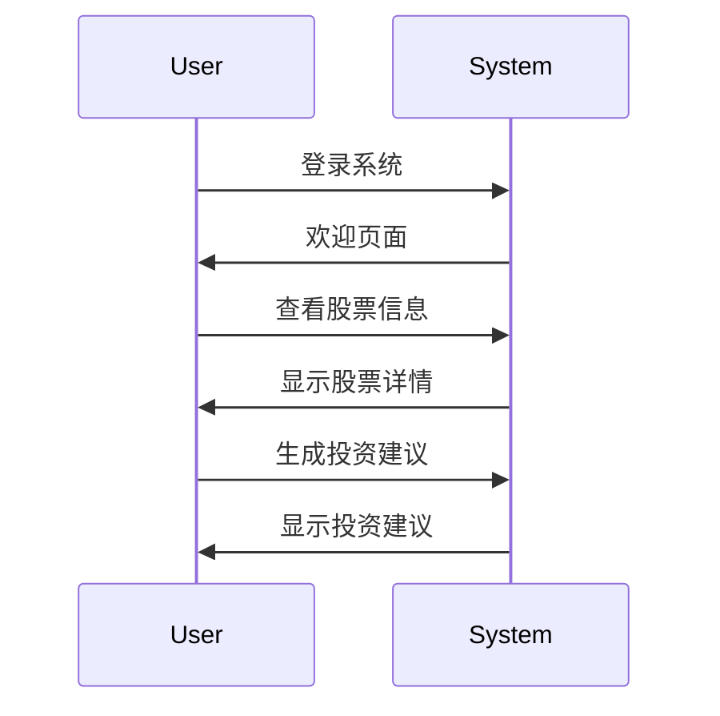
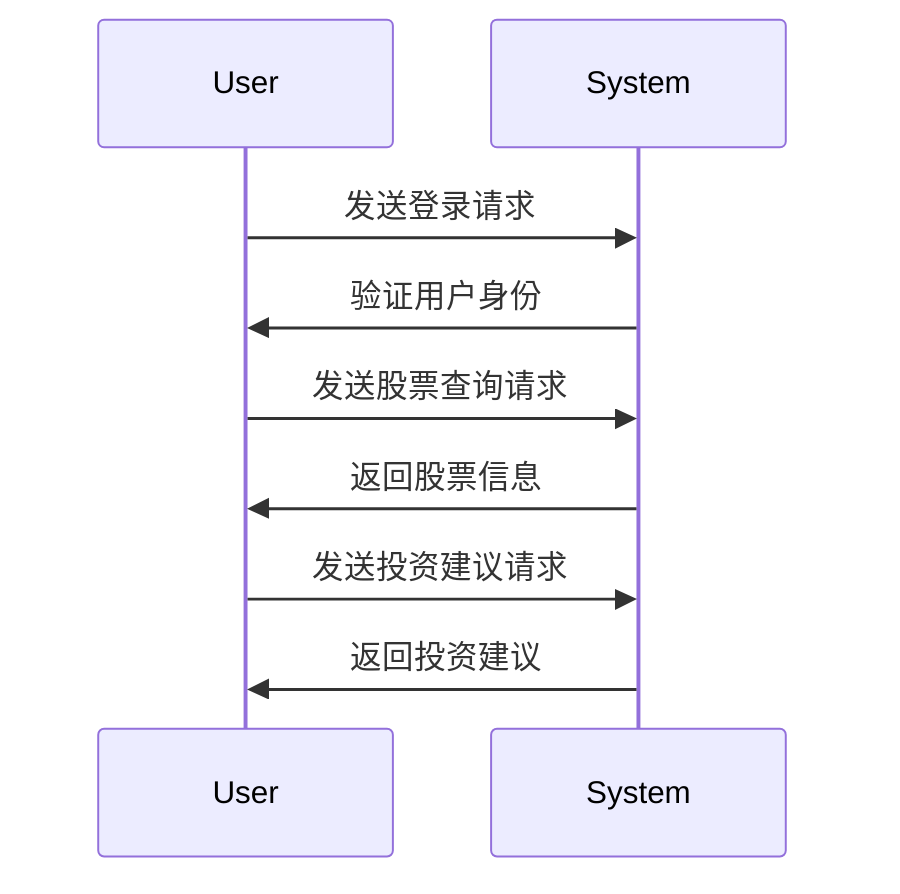

                 


## 引言

### 价值投资与行为金融学的背景

**价值投资**作为一种投资哲学，最早由本杰明·格雷厄姆（Benjamin Graham）提出，其核心在于寻找被市场低估的股票，通过长期持有，等待市场认识到其内在价值。价值投资强调对公司的基本面分析，寻找那些市场价格低于其内在价值的股票，并通过耐心持有获取长期资本增值。

**行为金融学**则是一个相对较新的领域，主要研究人类行为如何影响金融市场。它关注投资者的心理偏差、情感因素以及社会影响，解释为什么投资者的行为往往与理性经济学模型预测不符。

这两者看似属于不同领域，但实则密切相关。价值投资在寻找低估股票时，需要理解市场的情绪和投资者的行为；而行为金融学则提供了理解这些行为背后的心理学原理。将价值投资与行为金融学结合起来，投资者可以更全面地分析市场，做出更合理的投资决策。

### 本文的目的与结构

本文旨在深入探讨价值投资与行为金融学的交集，帮助读者理解这两大领域的核心概念，并学会如何将它们应用于实际投资中。文章将分为以下几个部分：

1. **基本概念介绍**：介绍价值投资和行为金融学的核心概念，包括其历史、理论基础和关键要素。
2. **整合与应用**：探讨如何将行为金融学的方法应用于价值投资分析，包括财务报表分析和投资决策。
3. **案例研究**：通过实际案例展示价值投资与行为金融学的应用，分析成功与失败的案例。
4. **项目实战**：介绍一个实际项目，展示如何将价值投资与行为金融学的理念应用于项目开发和管理。
5. **总结与拓展**：总结本文的主要观点，提出最佳实践建议，并推荐进一步阅读的资源。

通过本文的阅读，读者将能够：

- 理解价值投资和行为金融学的核心概念。
- 掌握将行为金融学应用于价值投资分析的方法。
- 学习通过案例分析来提高投资决策的质量。
- 获得将价值投资理念应用于实际项目开发的实践经验。

### 关键词

- 价值投资
- 行为金融学
- 投资哲学
- 基本面分析
- 心理偏差
- 股票市场

### 摘要

本文将深入探讨价值投资与行为金融学的融合，首先介绍两者的核心概念和理论基础，接着分析如何将行为金融学的原理应用于价值投资分析，并通过案例研究展示其实际应用效果。最后，本文将结合实际项目，介绍如何将价值投资与行为金融学的理念应用于项目开发和管理，提供实用的最佳实践建议，并推荐进一步阅读的资源。

---

在接下来的部分，我们将逐一介绍价值投资和行为金融学的核心概念，并探讨它们之间的联系和差异。读者可以通过本文的逐步阅读，逐步建立起对这两个领域的全面理解，从而为未来的投资决策打下坚实的基础。让我们开始吧！

## 价值投资的基本概念

### 历史与发展

价值投资的理念最早可以追溯到20世纪30年代，当时本杰明·格雷厄姆（Benjamin Graham）提出了著名的“安全边际”理论，并在其1949年的经典著作《聪明的投资者》（The Intelligent Investor）中详细阐述。格雷厄姆认为，投资不仅仅是关于资产的买卖，更是关于企业价值的评估。他的理论核心在于寻找市场价格低于其内在价值的股票，通过长期持有，等待市场认识到其真实价值。

格雷厄姆的学生沃伦·巴菲特（Warren Buffett）将价值投资的理念发扬光大，并成为现代价值投资的最杰出代表。巴菲特以其长期稳健的投资业绩和独特的投资哲学，证明了价值投资的有效性。他的投资原则包括寻找有长期增长潜力的公司、耐心持有股票、避免市场波动的影响等。

### 理论基础

价值投资的理论基础主要来源于本杰明·格雷厄姆和戴维·多德（David Dodd）在《证券分析》（Security Analysis）一书中提出的“价值”概念。价值投资认为，股票的价值取决于其未来现金流的折现值，即公司的内在价值（Intrinsic Value）。这个概念可以简单理解为，通过合理估计公司的未来盈利能力和现金流，将其折现到当前时间点的价值。

**内在价值**的计算通常涉及以下几个步骤：

1. **估计未来现金流**：通过分析公司的财务报表和市场趋势，预测公司未来的盈利能力和现金流量。
2. **确定折现率**：选择合适的折现率，以反映市场风险和投资者的时间偏好。
3. **折现未来现金流**：将预计的现金流按照折现率折现到当前时间点，得到股票的内在价值。

**安全边际**是价值投资的另一个核心概念。它指的是股票市场价格与其内在价值之间的差距。格雷厄姆认为，只有在股票价格低于其内在价值足够多时，才值得购买，这样才能保证即使预测有误，投资者也有足够的安全垫来保护资本。

### 价值投资的关键要素

1. **价值评估**：价值投资的核心在于对公司内在价值的评估。投资者需要通过详细的基本面分析，如财务报表分析、行业趋势研究等，来确定股票的内在价值。
   
2. **耐心持有**：价值投资强调长期投资，投资者应耐心持有被低估的股票，等待市场认识到其价值。这种投资哲学避免了短期市场波动的影响，有利于实现长期资本增值。

3. **风险管理**：价值投资并不排除市场风险，但通过选择被低估的股票，投资者可以在一定程度上降低投资风险。此外，通过分散投资和构建多元化的投资组合，投资者可以进一步降低风险。

4. **独立思考**：价值投资要求投资者具有独立思考的能力，不受市场情绪和公众观点的影响。通过深入研究公司的基本面，投资者可以做出基于理性的投资决策。

### 价值投资的优点与局限性

**优点**：

1. **长期稳健**：价值投资注重长期投资，通过耐心持有被低估的股票，可以获得稳定的长期回报。
2. **风险可控**：通过选择被低估的股票，投资者可以在一定程度上规避市场风险。
3. **适应性强**：价值投资方法适用于各种市场环境，无论是牛市还是熊市，都有可能找到被低估的股票。

**局限性**：

1. **投资周期长**：价值投资需要较长的投资周期，不适合追求短期利润的投资者。
2. **研究成本高**：进行详细的基本面分析需要大量的时间和精力，对投资者要求较高。
3. **市场情绪影响**：即使股票被低估，市场情绪也可能导致其价格继续下跌，投资者需要具备良好的心理素质。

通过以上对价值投资基本概念的分析，我们可以看到，价值投资是一种以长期投资为核心的投资哲学，通过寻找被市场低估的股票，实现资本增值。它强调基本面分析、耐心持有和风险管理，为投资者提供了一种稳健的投资策略。在接下来的部分，我们将深入探讨行为金融学的核心概念，并分析两者之间的联系和差异。

## 行为金融学的核心概念

### 历史与发展

行为金融学作为一门新兴的学科，其起源可以追溯到20世纪70年代。最初，传统的金融学理论基于理性经济人的假设，认为投资者在做出投资决策时总是追求最大化收益，并能够准确预测市场。然而，实际市场表现与这一假设相去甚远，许多投资者在市场中表现出非理性行为，如过度交易、跟风投资等。行为金融学正是在这样的背景下产生的，旨在通过心理学和社会学的研究，解释投资者的非理性行为和市场波动。

20世纪80年代和90年代，行为金融学逐渐得到了学术界和业界的认可。丹尼尔·卡内曼（Daniel Kahneman）和Amos Tversky的工作为行为金融学奠定了理论基础，他们的研究成果表明，投资者在决策过程中会受到多种认知偏差的影响。这些认知偏差不仅会影响个人的投资行为，也会在市场上产生广泛的影响。

### 理论基础

行为金融学的理论基础主要包括以下几个方面：

**1. 心理偏差**：行为金融学认为，投资者的决策过程受到多种心理偏差的影响，如过度自信、代表性偏差、确认偏差等。这些偏差会导致投资者在投资过程中做出非理性的决策。

- **过度自信**：投资者往往高估自己的判断力和控制能力，从而做出过于自信的投资决策。
- **代表性偏差**：投资者倾向于根据表面的特征来评估信息，而忽略了信息之间的统计关系。
- **确认偏差**：投资者在收集信息时，往往优先考虑那些支持自己已有观点的信息，忽略相反的信息。

**2. 情感因素**：情感在投资决策中起着重要作用。恐惧、贪婪、希望等情感会影响投资者的决策，使其在市场波动中做出非理性的反应。

- **恐惧**：在市场下跌时，投资者可能会因为恐惧而急于抛售，从而导致进一步的市场下跌。
- **贪婪**：在市场上涨时，投资者可能会因为贪婪而过度投资，忽略了潜在的风险。

**3. 社会因素**：投资者在做出投资决策时，会受到社会因素的影响，如从众行为、媒体报道等。

- **从众行为**：投资者往往会跟随其他投资者的行为，导致市场出现羊群效应。
- **媒体报道**：媒体报道可以影响投资者的情绪和决策，从而影响市场走势。

### 行为金融学的重要理论

**1. 非理性预期理论**：行为金融学认为，市场并非总是有效，投资者由于受到各种心理和社会因素的影响，其预期往往是非理性的。这种非理性预期会导致市场出现过度反应或反应不足，从而导致市场波动。

**2. 心理账户理论**：该理论认为，投资者在心理上将资金分成不同的账户，不同的账户有不同的资金管理和风险偏好。这种心理账户会影响投资者的投资决策，如在不同市场环境下选择不同的投资策略。

**3. 羊群效应**：羊群效应是指投资者在做出投资决策时，会模仿其他投资者的行为。这种行为会导致市场出现恐慌性抛售或过度乐观，从而引发市场波动。

### 行为金融学的研究方法

行为金融学采用多种研究方法来探究投资者的行为和市场波动，包括实验室实验、实地观察、问卷调查等。

- **实验室实验**：通过实验室实验，研究人员可以模拟真实的投资环境，观察投资者的行为和决策过程。
- **实地观察**：通过对实际市场数据的分析，研究人员可以了解投资者的行为和市场反应。
- **问卷调查**：通过问卷调查，研究人员可以收集大量投资者的行为数据，分析其投资决策和行为模式。

### 行为金融学在投资决策中的应用

行为金融学为投资决策提供了新的视角和方法，投资者可以通过以下方式应用行为金融学的理论：

**1. 识别心理偏差**：投资者应意识到自己可能受到的心理偏差影响，通过提高自我认知，减少非理性决策。

**2. 管理情感因素**：投资者应学会控制自己的情感，避免在市场波动中做出过度反应。

**3. 建立长期投资策略**：行为金融学强调长期投资的重要性，投资者应通过制定长期投资策略，规避市场短期波动的影响。

**4. 多元化投资**：通过多元化投资，投资者可以降低个别股票的市场风险，实现风险分散。

### 行为金融学的优点与局限性

**优点**：

1. **解释市场波动**：行为金融学提供了对市场波动更全面的理解，解释了为什么市场会出现非理性波动。
2. **改进投资策略**：通过了解投资者的行为和心理偏差，投资者可以改进自己的投资策略，减少非理性决策。
3. **提高风险意识**：行为金融学强调风险管理的重要性，投资者可以更好地管理投资风险。

**局限性**：

1. **研究方法的局限性**：行为金融学的研究方法存在一定局限性，如实验室实验可能无法完全模拟真实市场环境。
2. **理论应用难度**：行为金融学的理论在具体应用中具有一定的难度，投资者需要具备一定的心理学知识和自我控制能力。
3. **市场变化的不确定性**：市场变化复杂多变，投资者无法完全预测市场行为，因此行为金融学的理论应用存在一定的局限性。

通过以上对行为金融学核心概念的分析，我们可以看到，行为金融学通过研究投资者的心理偏差、情感因素和社会影响，提供了对市场波动更全面的理解。它不仅解释了投资者行为的非理性现象，也为投资者提供了改进投资策略的方法。在接下来的部分，我们将探讨价值投资和行为金融学之间的联系和差异，帮助读者更好地理解这两个领域的融合。

### 价值投资与行为金融学的联系与差异

价值投资和行为金融学虽然在投资哲学和方法论上有所不同，但它们之间却存在着紧密的联系。理解这两者之间的关系，有助于投资者在投资决策中更全面地分析市场，做出更为理性的选择。

#### 联系

1. **共同目标**：价值投资和行为金融学的最终目标都是实现投资收益的最大化。价值投资通过寻找被市场低估的股票，实现长期资本增值；行为金融学则通过理解投资者的心理和社会行为，减少投资决策中的非理性因素，提高投资效率。

2. **基本分析方法**：价值投资的核心在于对公司基本面的分析，而行为金融学则通过心理学和社会学的方法来理解市场行为。这两者都强调对信息的深入挖掘和分析，从而做出更为合理的投资决策。

3. **风险管理**：价值投资和行为金融学都重视风险管理。价值投资通过分散投资、选择被低估的股票来降低风险；行为金融学则通过理解投资者的心理偏差和情感因素，避免因情绪波动而做出非理性的投资决策。

#### 差异

1. **理论基础**：价值投资的理论基础主要源于本杰明·格雷厄姆的“安全边际”理论和沃伦·巴菲特的长期投资哲学；而行为金融学则主要基于心理学和社会学的研究，解释投资者的非理性行为和市场波动。

2. **投资方法**：价值投资注重长期持有，通过耐心等待市场认识到股票的内在价值；行为金融学则更注重短期投资策略，通过理解市场情绪和投资者行为来捕捉市场波动带来的机会。

3. **风险偏好**：价值投资通常具有较低的风险偏好，强调通过选择低估的股票来降低风险；行为金融学则更关注投资者心理和社会因素对市场的影响，其投资策略可能更倾向于高风险高回报。

#### 如何结合

1. **基本面分析结合行为分析**：投资者在进行价值投资分析时，可以结合行为金融学的理论，理解市场情绪和投资者行为对股票价格的影响。通过分析投资者的心理偏差和情感因素，可以更准确地判断股票是否被市场低估。

2. **短期策略与长期策略的结合**：在制定投资策略时，投资者可以将价值投资的长期持有策略与行为金融学的短期交易策略相结合。例如，在市场情绪高涨时，可以采用短期交易策略获取市场波动带来的机会；在市场情绪低迷时，则可以采用长期持有策略，等待市场认识到股票的内在价值。

3. **风险管理与情绪控制**：投资者在进行投资决策时，应重视风险管理和情绪控制。价值投资通过分散投资和选择低估股票来降低风险；行为金融学则通过理解投资者的心理偏差和情感因素，避免因情绪波动而做出非理性的投资决策。

通过以上分析，我们可以看到，价值投资和行为金融学虽然理论基础和方法有所不同，但它们在投资实践中具有互补性。投资者通过结合两者的优势，可以更全面地分析市场，做出更为理性的投资决策。

在接下来的部分，我们将探讨如何将行为金融学的原理应用于价值投资分析，帮助投资者在实际操作中更好地结合这两种投资方法。通过分析财务报表、管理情绪和制定投资策略，投资者可以进一步提高投资的成功率。

### 将行为金融学原理应用于价值投资分析

将行为金融学的原理应用于价值投资分析，可以显著提升投资者的投资决策质量和实际操作效果。以下是几个关键步骤和策略，帮助投资者在实践中有效地结合价值投资和行为金融学。

#### 分析财务报表

1. **识别管理层的心理偏差**：
   - **财务报表分析**：投资者需要深入分析公司的财务报表，包括利润表、资产负债表和现金流量表。通过这些报表，可以识别管理层的心理偏差，如过度乐观或过度悲观。例如，管理层可能会夸大盈利或低估负债，投资者需要通过详细的数据分析来识别这些偏差。
   - **关键财务指标**：投资者应关注关键财务指标，如毛利率、净利率、资产负债率和现金流量等。通过对比历史数据和行业标准，可以识别管理层的心理偏差对财务指标的影响。

2. **评估管理层行为**：
   - **管理决策分析**：通过分析管理层的决策过程，投资者可以评估其行为是否受到心理偏差的影响。例如，管理层是否在市场波动时做出过度反应，或者在业务扩展时过于激进。
   - **透明度**：投资者应关注公司的信息披露透明度。不透明的财务报表可能隐藏管理层的心理偏差和不良行为，投资者应谨慎对待。

#### 管理情绪

1. **避免情绪驱动投资**：
   - **设定投资目标**：投资者应在投资前设定明确的目标和风险承受能力。通过设定明确的投资目标和风险偏好，可以避免在情绪波动时做出冲动决策。
   - **情绪监控**：投资者应定期监控自己的情绪状态，确保投资决策不受情绪影响。可以通过记录投资日记、进行情绪分析和咨询心理专家等方式，保持情绪稳定。

2. **建立情绪调节机制**：
   - **情绪释放**：投资者可以通过运动、冥想、阅读等方式，释放情绪压力，保持心态平和。
   - **投资纪律**：投资者应建立严格的投资纪律，避免因市场波动而改变长期投资策略。通过设定投资计划和定期审查，可以确保投资决策的理性。

#### 制定投资策略

1. **结合长期持有与短期交易**：
   - **分阶段投资**：投资者可以将投资组合分为长期持有和短期交易两部分。在市场情绪稳定时，可以采用长期持有策略；在市场波动较大时，可以采用短期交易策略。
   - **动态调整**：投资者应依据市场变化，灵活调整投资策略。在市场情绪高涨时，可以适当增加短期交易的比重；在市场情绪低迷时，可以增加长期持有的比重。

2. **多元化投资组合**：
   - **资产配置**：投资者应通过多元化投资组合，降低个别资产的市场风险。可以选择不同行业、不同地域和不同市场状态的资产，实现风险分散。
   - **心理账户管理**：投资者应建立心理账户，将资金合理分配到不同类型的投资中。通过心理账户的管理，可以避免因某一投资的市场波动而影响整体投资心态。

#### 实际应用案例

1. **案例一：苹果公司**：
   - **财务报表分析**：在分析苹果公司的财务报表时，投资者可以发现其毛利率和净利率的波动较大，可能反映了管理层在市场波动时的心理偏差。
   - **情绪管理**：投资者在投资苹果公司时，应关注市场情绪的变化，避免因情绪波动而做出非理性决策。
   - **投资策略**：投资者可以采取分阶段投资策略，在市场情绪稳定时长期持有，在市场波动时进行短期交易。

2. **案例二：社交媒体公司**：
   - **财务报表分析**：社交媒体公司的财务报表通常较为复杂，投资者需要深入分析其广告收入、用户增长和利润率等指标。
   - **情绪管理**：社交媒体行业的市场波动较大，投资者应保持冷静，避免情绪驱动投资。
   - **投资策略**：投资者可以采取多元化投资组合，分散风险，同时关注行业趋势和公司基本面。

通过将行为金融学的原理应用于价值投资分析，投资者可以更加全面地评估投资机会，管理情绪波动，制定合理的投资策略。在实际操作中，投资者应结合市场环境和公司特点，灵活应用这些方法，提高投资决策的质量和效果。

在接下来的部分，我们将通过几个具体的案例，进一步展示如何将价值投资与行为金融学的理念应用于实际投资中，帮助读者更好地理解这两种投资方法的实际应用效果。

### 案例研究：价值投资与行为金融学的实际应用

#### 案例一：苹果公司（Apple Inc.）

**背景介绍**：
苹果公司是一家全球领先的科技公司，以其创新的消费电子产品和服务而闻名。在过去的几十年中，苹果公司经历了多个阶段的市场波动和公司变化，是价值投资与行为金融学研究的理想对象。

**价值投资分析**：
1. **财务报表分析**：
   - **利润表**：苹果公司的利润表显示了其稳定的盈利能力，尤其是在智能手机、平板电脑和Mac电脑等核心产品线上的强劲表现。
   - **资产负债表**：苹果公司拥有大量现金和投资，负债较低，财务状况健康。
   - **现金流量表**：苹果公司的自由现金流稳定增长，表明其具有强大的资金管理能力。

2. **内在价值评估**：
   - **折现现金流模型（DCF）**：通过预测苹果公司的未来现金流并将其折现到当前时间点，投资者可以评估其内在价值。苹果公司的内在价值通常高于市场交易价格，表明其股票被低估。

**行为金融学分析**：
1. **市场情绪分析**：
   - **过度乐观/悲观**：在苹果公司发布新产品时，市场情绪可能会过度乐观，导致股价短期大幅上涨；而在新产品发布失败或市场环境不佳时，市场情绪可能会过度悲观，导致股价短期大幅下跌。
   - **从众行为**：在市场情绪高涨时，投资者可能会盲目跟风购买苹果股票；在市场情绪低迷时，投资者可能会恐慌性抛售。

**投资策略**：
1. **长期持有**：投资者可以采用长期持有策略，等待市场认识到苹果公司的真实价值。
2. **分阶段投资**：在市场情绪稳定时，投资者可以逐步建仓；在市场情绪波动时，投资者可以适当调整持仓比例。

**结果与反思**：
- **成功案例**：在苹果公司发布iPhone X时，市场情绪过度乐观，股价短期上涨。长期投资者在市场情绪回归正常后，成功获取了资本增值。
- **失败案例**：在苹果公司发布iPhone SE时，市场情绪过度悲观，股价短期下跌。投资者如果在市场情绪低迷时恐慌性抛售，可能会错过后来的股价反弹。

#### 案例二：亚马逊公司（Amazon.com）

**背景介绍**：
亚马逊公司是一家全球领先的电子商务公司，以其创新的商业模式和强大的物流网络而著称。亚马逊在电子商务领域有着深厚的影响力，同时也面临着激烈的竞争和市场波动。

**价值投资分析**：
1. **财务报表分析**：
   - **利润表**：亚马逊的盈利能力在过去几年有所提升，但因其大规模投资和研发支出，净利润波动较大。
   - **资产负债表**：亚马逊的负债较高，但其强大的现金流量和资产质量表明其财务状况相对稳健。
   - **现金流量表**：亚马逊的自由现金流虽然波动较大，但整体上显示出稳定增长的趋势。

2. **内在价值评估**：
   - **折现现金流模型（DCF）**：通过预测亚马逊的未来现金流并折现，投资者可以评估其内在价值。尽管亚马逊的市场交易价格较高，但其在电子商务和云计算领域的巨大潜力表明其内在价值可能被低估。

**行为金融学分析**：
1. **市场情绪分析**：
   - **过度乐观/悲观**：在亚马逊发布新业务或新产品时，市场情绪可能会过度乐观或悲观。例如，亚马逊推出云计算服务AWS时，市场对其前景表现出高度乐观；而在电子商务竞争加剧时，市场情绪可能会变得悲观。
   - **从众行为**：投资者可能会在市场情绪高涨时盲目跟风，导致股价波动加剧。

**投资策略**：
1. **长期持有**：投资者可以采用长期持有策略，利用市场波动进行低买高卖，实现资本增值。
2. **风险管理**：投资者应关注亚马逊的业务风险，如市场竞争加剧和宏观经济环境变化，通过分散投资和调整投资组合来降低风险。

**结果与反思**：
- **成功案例**：在亚马逊云计算服务AWS取得成功后，市场情绪转向乐观，股价大幅上涨。长期投资者在这一过程中获得了显著资本增值。
- **失败案例**：在电子商务市场竞争加剧时，市场情绪转向悲观，股价波动较大。投资者如果在市场情绪低迷时盲目抛售，可能会错过后来的市场反弹。

#### 案例三：特斯拉公司（Tesla, Inc.）

**背景介绍**：
特斯拉公司是一家全球领先的电动汽车和清洁能源公司，以其创新的产品和技术而著称。特斯拉在电动汽车行业中的领先地位使其成为投资者关注的焦点。

**价值投资分析**：
1. **财务报表分析**：
   - **利润表**：特斯拉的盈利能力较弱，但其在电动汽车市场的领先地位和品牌影响力使其具有长期增长潜力。
   - **资产负债表**：特斯拉的负债较高，但其强大的现金流和资本支出表明其在持续投资和发展。
   - **现金流量表**：特斯拉的自由现金流波动较大，但显示出稳定增长的趋势。

2. **内在价值评估**：
   - **折现现金流模型（DCF）**：通过预测特斯拉的未来现金流并折现，投资者可以评估其内在价值。尽管特斯拉的市场交易价格较高，但其在电动汽车和能源存储领域的巨大潜力表明其内在价值可能被低估。

**行为金融学分析**：
1. **市场情绪分析**：
   - **过度乐观/悲观**：特斯拉的新产品发布和重大技术突破往往会引起市场情绪的波动。例如，特斯拉发布Model 3时，市场情绪过度乐观；而在面临生产挑战和竞争压力时，市场情绪可能会过度悲观。
   - **从众行为**：投资者可能会在市场情绪高涨时盲目跟风，导致股价波动加剧。

**投资策略**：
1. **长期持有**：投资者可以采用长期持有策略，利用市场波动进行低买高卖，实现资本增值。
2. **风险管理**：投资者应关注特斯拉的业务风险，如市场竞争加剧和宏观经济环境变化，通过分散投资和调整投资组合来降低风险。

**结果与反思**：
- **成功案例**：在特斯拉推出新车型和提高生产效率后，市场情绪转向乐观，股价大幅上涨。长期投资者在这一过程中获得了显著资本增值。
- **失败案例**：在特斯拉面临生产挑战和市场竞争压力时，市场情绪转向悲观，股价波动较大。投资者如果在市场情绪低迷时盲目抛售，可能会错过后来的市场反弹。

通过以上案例研究，我们可以看到，价值投资和行为金融学在实际投资中的应用效果显著。投资者通过深入分析公司的基本面、市场情绪和行为模式，可以更全面地评估投资机会，制定合理的投资策略，实现长期稳定的投资收益。

在接下来的部分，我们将通过一个实际项目，展示如何将价值投资与行为金融学的理念应用于项目开发和管理，为读者提供实用的实践经验。

### 实际项目：结合价值投资与行为金融学的项目开发

#### 项目背景

假设我们正在开发一个名为“智能投资顾问系统”的项目，旨在通过人工智能和大数据分析，为个人投资者提供个性化的投资建议。该系统的目标是通过结合价值投资和行为金融学的原理，帮助投资者做出更理性的投资决策。

#### 项目介绍

1. **项目功能**：
   - **财务分析**：系统通过分析公司的财务报表和市场数据，评估股票的内在价值和投资潜力。
   - **心理分析**：系统利用行为金融学的原理，分析投资者的心理状态和情绪波动，提供情绪管理建议。
   - **投资建议**：系统根据财务分析和心理分析结果，生成个性化的投资建议，包括买卖时机、投资组合调整等。

2. **技术架构**：
   - **前端**：使用HTML、CSS和JavaScript构建用户界面，提供交互式界面和实时数据展示。
   - **后端**：使用Python和Flask框架构建后端服务，处理数据分析和投资建议生成。
   - **数据库**：使用MySQL存储公司财务数据和市场数据，以及用户行为数据。

#### 系统功能设计

1. **领域模型**：
   - **股票信息**：包括公司名称、股票代码、财务数据、市场数据等。
   - **用户信息**：包括用户ID、用户偏好、情绪状态等。
   - **投资建议**：包括投资组合、买卖建议、情绪管理建议等。

2. **类图**（使用Mermaid绘制）：

```mermaid
classDiagram
    User <<类>> User
    Stock <<类>> Stock
    InvestmentAdvice <<类>> InvestmentAdvice
    
    User -> Stock : 关注
    User -> InvestmentAdvice : 接受
    InvestmentAdvice -> Stock : 依据
```

#### 系统架构设计

1. **架构图**（使用Mermaid绘制）：



#### 系统接口设计

1. **API接口**：
   - **股票信息查询**：GET /api/stocks/{stock_id}
   - **用户登录**：POST /api/login
   - **生成投资建议**：POST /api/investment_advice

#### 系统交互

1. **序列图**（使用Mermaid绘制）：



#### 项目实战

1. **环境安装**：
   - 安装Python和Flask框架：`pip install flask`
   - 安装MySQL数据库：`sudo apt-get install mysql-server`

2. **系统核心实现**：

```python
from flask import Flask, request, jsonify
from stock_analyzer import StockAnalyzer

app = Flask(__name__)
analyzer = StockAnalyzer()

@app.route('/api/stocks/<int:stock_id>', methods=['GET'])
def get_stock_info(stock_id):
    stock = analyzer.get_stock_info(stock_id)
    return jsonify(stock)

@app.route('/api/login', methods=['POST'])
def login():
    data = request.get_json()
    user_id = data.get('user_id')
    password = data.get('password')
    if analyzer.authenticate_user(user_id, password):
        return jsonify({"status": "success"})
    else:
        return jsonify({"status": "failure"})

@app.route('/api/investment_advice', methods=['POST'])
def get_investment_advice():
    data = request.get_json()
    user_id = data.get('user_id')
    stock_id = data.get('stock_id')
    advice = analyzer.get_investment_advice(user_id, stock_id)
    return jsonify(advice)

if __name__ == '__main__':
    app.run(debug=True)
```

3. **代码应用解读与分析**：

以上代码实现了三个API接口，分别是股票信息查询、用户登录和生成投资建议。通过这些接口，用户可以访问系统功能，获取股票信息、登录系统和获取投资建议。

- **股票信息查询**：通过传入股票ID，系统从数据库中获取股票的详细信息，并将其返回给用户。
- **用户登录**：通过传入用户ID和密码，系统验证用户身份，并返回登录状态。
- **生成投资建议**：通过传入用户ID和股票ID，系统分析股票的财务数据和市场情绪，生成投资建议，并将其返回给用户。

4. **实际案例分析**：

假设用户ID为1001的用户查询股票代码为AAPL的股票信息，并生成投资建议。系统会首先从数据库中获取苹果公司的财务数据和市场数据，然后使用行为金融学的原理分析市场情绪和投资者的情绪状态，最后生成投资建议。

- **财务数据**：根据苹果公司的财务报表，系统计算出其内在价值，并与市场交易价格进行比较。
- **市场情绪**：通过分析市场数据，系统评估当前市场情绪是否有利于投资苹果股票。
- **情绪状态**：通过分析用户的情绪状态，系统评估用户是否受到心理偏差的影响，从而影响投资决策。

5. **项目小结**：

通过结合价值投资和行为金融学的原理，智能投资顾问系统为投资者提供了全面的投资分析工具。系统不仅通过财务数据评估股票的内在价值，还通过心理数据分析投资者的情绪状态，提供个性化的投资建议。这种结合使得系统能够更准确地识别投资机会，帮助投资者做出更理性的投资决策。

### 最佳实践 Tips

1. **持续学习**：投资者应不断学习新的投资知识和行为金融学的理论，以应对市场的不断变化。
2. **情绪管理**：投资者应学会控制自己的情绪，避免在市场波动中做出非理性的投资决策。
3. **多元化投资**：通过分散投资，投资者可以降低个别股票的市场风险，实现风险分散。

### 小结

本文通过深入探讨价值投资与行为金融学的核心概念和实际应用，展示了如何将这两种投资方法结合，为投资者提供更全面的投资分析和决策支持。通过案例研究和项目实战，读者可以更好地理解价值投资和行为金融学的应用效果，并在实际投资中运用这些理念。

### 注意事项

1. **投资风险**：投资者在应用价值投资与行为金融学时，应充分了解市场风险和投资风险，做好风险管理。
2. **数据质量**：投资者在分析财务报表和市场数据时，应确保数据的质量和准确性。

### 拓展阅读

- 《聪明的投资者》（The Intelligent Investor） - 本杰明·格雷厄姆
- 《行为金融学：心理与市场》（Behavioral Finance: The Psychology of Investing） - 杰夫·伯恩斯坦（Jeffrey A. T. Berndt）
- 《投资心理学》（Investment Psychology Explained） - 迈克尔·A. 纽科姆（Michael A. Newman）

---

通过本文的阅读，读者应能够更好地理解价值投资与行为金融学的核心概念和应用方法，为未来的投资决策提供坚实的理论基础和实践指导。

### 作者信息

作者：AI天才研究院/AI Genius Institute & 禅与计算机程序设计艺术 /Zen And The Art of Computer Programming

---

感谢读者对本文的阅读，希望本文能为您的投资之路提供有价值的参考。如果您有任何问题或建议，欢迎在评论区留言，我们期待与您互动交流。

