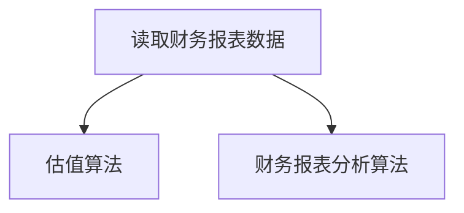

                 


### 价值投资与财务报表分析

#### 关键词：价值投资、财务报表分析、基本面分析、估值、风险控制、现金流量表

#### 摘要：

本文旨在探讨价值投资与财务报表分析之间的紧密联系，通过逻辑清晰、结构紧凑的分析，帮助投资者理解如何运用财务报表信息进行价值投资决策。文章将首先介绍价值投资和财务报表分析的基本概念，随后深入探讨两者的核心原理、联系和实际应用。通过具体的案例分析，读者将学会如何结合财务报表数据，制定有效的价值投资策略，实现投资收益的最大化。

## 第1章 背景介绍

### 1.1 问题背景

#### 1.1.1 投资概述

投资，作为金融市场的一个重要组成部分，是指个人或机构为了获取未来的经济利益，将资金投入各种资产或项目的活动。投资的目的多种多样，包括获取资本增值、稳定收入、风险分散等。在投资过程中，投资者通常会面临多种挑战，如市场波动、信息不对称、情绪影响等。

#### 1.1.2 价值投资的起源与发展

价值投资（Value Investing）起源于20世纪30年代，由著名的投资大师本杰明·格雷厄姆（Benjamin Graham）提出。价值投资的核心思想是“买低卖高”，即寻找那些市场价格低于其内在价值的股票进行投资。价值投资的原理基于基本面分析，通过深入研究公司的财务报表、业务模式、行业前景等因素，评估其内在价值，从而做出投资决策。

价值投资经历了数十年的发展，已经成为投资领域的重要组成部分。现代价值投资大师如沃伦·巴菲特（Warren Buffett）等，通过长期实践证明了价值投资的可行性和有效性。

#### 1.1.3 财务报表分析的重要性

财务报表分析是价值投资不可或缺的一部分。财务报表是企业对外披露其财务状况的重要文件，包括资产负债表、利润表和现金流量表。通过对财务报表的深入分析，投资者可以了解公司的财务健康状况、盈利能力、运营效率等方面的信息，从而评估其投资价值。

财务报表分析的重要性在于，它为投资者提供了一个客观、系统的分析框架，帮助他们识别潜在的投资机会，规避风险。在价值投资中，财务报表分析是评估公司内在价值的重要手段，对于制定投资策略、实现投资目标至关重要。

### 1.2 问题描述

#### 1.2.1 投资者面临的挑战

投资者在投资过程中面临诸多挑战。首先，市场波动是投资过程中不可避免的风险。其次，信息不对称使得投资者难以获取全面、准确的信息，容易导致投资决策失误。此外，投资者的情绪波动也会影响投资决策的理性，导致盲目跟风或过度悲观。

#### 1.2.2 财务报表分析的必要性

面对上述挑战，财务报表分析成为投资者的重要工具。通过财务报表分析，投资者可以识别公司的真实财务状况，判断其投资价值。具体而言，财务报表分析有助于：

1. **评估公司盈利能力**：利润表分析可以揭示公司的盈利能力，帮助投资者判断其未来收益潜力。
2. **评估公司偿债能力**：资产负债表分析可以揭示公司的资产结构和负债情况，帮助投资者评估其偿债能力。
3. **评估公司运营效率**：现金流量表分析可以揭示公司的运营效率，帮助投资者判断其业务模式的有效性。

总之，财务报表分析为投资者提供了一个科学的分析框架，帮助他们克服信息不对称和市场波动带来的挑战，实现投资目标。

### 1.3 问题解决

#### 1.3.1 价值投资的策略

价值投资的核心策略是寻找市场价格低于其内在价值的股票。投资者需要通过基本面分析，评估公司的内在价值，并在此基础上做出投资决策。具体策略包括：

1. **选择优质公司**：投资者需要选择那些具有稳定业务模式、良好盈利能力和增长潜力的公司。
2. **估值方法**：投资者需要运用多种估值方法，如市盈率法、股息折现法和市净率法等，评估公司的内在价值。
3. **风险控制**：投资者需要制定有效的风险控制策略，包括分散投资、定期评估和调整投资组合等。

#### 1.3.2 财务报表分析的方法

财务报表分析的方法主要包括对资产负债表、利润表和现金流量表的分析。具体方法包括：

1. **资产负债表分析**：投资者需要关注公司的资产结构和负债情况，评估其偿债能力和流动性。
2. **利润表分析**：投资者需要关注公司的盈利能力，包括收入、支出、毛利率和净利率等指标。
3. **现金流量表分析**：投资者需要关注公司的运营效率，包括经营活动现金流、投资活动现金流和筹资活动现金流等指标。

通过财务报表分析，投资者可以全面了解公司的财务状况，为投资决策提供有力支持。

### 1.4 边界与外延

#### 1.4.1 价值投资的适用范围

价值投资适用于各种类型的投资者，包括个人投资者和专业投资者。无论投资规模大小，价值投资都强调对公司和行业的深入分析，寻找被市场低估的投资机会。然而，对于追求短期投机收益的投资者，价值投资可能并不适用。

#### 1.4.2 财务报表分析的局限性

财务报表分析虽然是一种重要的分析工具，但也存在局限性。首先，财务报表数据可能存在误导性，如会计政策变更、盈利操纵等。其次，财务报表分析无法涵盖所有的投资信息，如市场情绪、政策变化等。因此，投资者在运用财务报表分析时，需要保持谨慎，结合其他信息进行综合分析。

### 1.5 概念结构与核心要素组成

#### 1.5.1 价值投资的核心概念

价值投资的核心概念包括基本面分析、内在价值和估值方法。基本面分析是评估公司内在价值的基础，内在价值是投资决策的关键，估值方法是衡量公司内在价值的方法。

#### 1.5.2 财务报表分析的关键要素

财务报表分析的关键要素包括资产负债表、利润表和现金流量表。资产负债表反映公司的资产结构和负债情况，利润表反映公司的盈利能力，现金流量表反映公司的运营效率。

## 第2章 核心概念与联系

### 2.1 价值投资原理

#### 2.1.1 基本面分析

基本面分析是价值投资的核心。基本面分析主要包括以下几个方面：

1. **公司盈利能力**：投资者需要关注公司的收入、利润和净利润等指标，评估其盈利能力。
2. **公司成长性**：投资者需要关注公司的市场份额、研发投入、新产品推出等指标，评估其成长性。
3. **公司财务状况**：投资者需要关注公司的资产负债表、利润表和现金流量表等指标，评估其财务健康状况。
4. **行业前景**：投资者需要关注行业的发展趋势、竞争格局和政策环境等指标，评估行业的投资价值。

#### 2.1.2 估值方法

估值方法是评估公司内在价值的方法。常见的估值方法包括：

1. **市盈率法**：市盈率（P/E）是公司市值与净利润的比率。投资者可以通过比较市盈率与行业平均水平，判断公司是否被低估。
2. **股息折现法**：股息折现法是将公司未来派发的股息折现到当前的价值。投资者可以通过预测公司未来股息，计算其内在价值。
3. **市净率法**：市净率（P/B）是公司市值与净资产的比率。投资者可以通过比较市净率与行业平均水平，判断公司是否被低估。

#### 2.1.3 风险控制

风险控制是价值投资的重要环节。投资者需要制定有效的风险控制策略，包括：

1. **分散投资**：通过分散投资，降低单一投资风险。
2. **定期评估**：定期评估投资组合，根据市场变化进行调整。
3. **止损策略**：设定止损点，避免亏损扩大。

### 2.2 财务报表分析

#### 2.2.1 资产负债表

资产负债表反映公司的资产、负债和所有者权益状况。投资者需要关注以下几个方面：

1. **资产结构**：分析公司的资产分布，了解其资产质量。
2. **负债结构**：分析公司的负债情况，了解其偿债能力。
3. **流动性**：分析公司的流动资产和流动负债，了解其流动性。

#### 2.2.2 利润表

利润表反映公司的收入、支出和盈利情况。投资者需要关注以下几个方面：

1. **收入与支出**：分析公司的收入来源和支出情况，了解其盈利能力。
2. **毛利率与净利率**：分析公司的毛利率和净利率，了解其盈利质量。
3. **营业利润与净利润**：分析公司的营业利润和净利润，了解其盈利能力。

#### 2.2.3 现金流量表

现金流量表反映公司的现金流入和流出情况。投资者需要关注以下几个方面：

1. **经营活动现金流**：分析公司的经营活动现金流，了解其运营效率。
2. **投资活动现金流**：分析公司的投资活动现金流，了解其投资决策。
3. **筹资活动现金流**：分析公司的筹资活动现金流，了解其融资状况。

### 2.3 价值投资与财务报表分析的联系

#### 2.3.1 财务报表分析在价值投资中的应用

财务报表分析是价值投资的重要工具。投资者需要通过财务报表分析，评估公司的财务状况、盈利能力和运营效率，从而判断其投资价值。

1. **评估公司财务状况**：通过资产负债表分析，投资者可以了解公司的资产、负债和所有者权益状况，判断其财务健康状况。
2. **评估公司盈利能力**：通过利润表分析，投资者可以了解公司的收入、支出和盈利情况，判断其盈利能力。
3. **评估公司运营效率**：通过现金流量表分析，投资者可以了解公司的现金流入和流出情况，判断其运营效率。

#### 2.3.2 价值投资对财务报表分析的依赖

价值投资依赖于财务报表分析。投资者需要通过财务报表分析，获取公司的真实财务信息，评估其内在价值，从而做出投资决策。

1. **信息真实性**：财务报表分析可以帮助投资者判断公司财务信息的真实性，避免投资风险。
2. **投资决策**：财务报表分析为投资者提供了投资决策的重要依据，帮助投资者制定有效的投资策略。

### 2.4 概念属性特征对比表格

| 特征 | 价值投资 | 财务报表分析 |
| --- | --- | --- |
| 目标 | 获取长期稳定的投资回报 | 提供公司财务状况的详细信息 |
| 方法 | 基于公司基本面进行估值 | 分析财务报表数据 |
| 结果 | 获得持续增长的优质股票 | 判断公司财务健康状况 |

### 2.5 ER实体关系图架构的 Mermaid 流程图

```mermaid
erDiagram
    Company ||--|{ Share }|| Investor
    Company ||--|{ Financial Statement }|| Analyst
```

## 第3章 价值投资策略

### 3.1 筛选优质公司

#### 3.1.1 选择标准

投资者在筛选优质公司时，应遵循以下标准：

1. **盈利能力**：公司应具备稳定的盈利能力，净利润增长率较高。
2. **成长性**：公司应具备较高的成长性，市场份额和研发投入处于行业前列。
3. **财务状况**：公司应具备良好的财务状况，负债水平较低，现金流充足。
4. **竞争优势**：公司应具备明显的竞争优势，如品牌优势、技术优势等。

#### 3.1.2 筛选流程

投资者应遵循以下流程筛选优质公司：

1. **行业研究**：了解目标行业的市场趋势、竞争格局和政策环境。
2. **公司研究**：分析目标公司的业务模式、盈利能力、成长性和财务状况。
3. **财务报表分析**：通过财务报表分析，评估目标公司的真实财务状况。
4. **估值**：运用估值方法，评估目标公司的内在价值。

### 3.2 估值方法

#### 3.2.1 市盈率法

市盈率法是一种常用的估值方法，其公式为：

$$
P/E = \frac{公司市值}{净利润}
$$

投资者可以通过比较市盈率与行业平均水平，判断公司是否被低估。

#### 3.2.2 股息折现法

股息折现法是一种基于未来股息的估值方法，其公式为：

$$
P = \frac{D_1}{r-g}
$$

其中，$D_1$ 为未来一年的股息，$r$ 为折现率，$g$ 为股息增长率。

投资者可以通过预测公司未来股息，计算其内在价值。

#### 3.2.3 市净率法

市净率法是一种基于净资产的估值方法，其公式为：

$$
P/B = \frac{公司市值}{净资产}
$$

投资者可以通过比较市净率与行业平均水平，判断公司是否被低估。

### 3.3 风险控制

#### 3.3.1 评估市场风险

投资者需要关注市场风险，如市场波动、利率变化等。通过分散投资、定期评估和调整投资组合等措施，降低市场风险。

#### 3.3.2 管理投资组合风险

投资者需要关注投资组合的风险，如个股风险、行业风险等。通过分散投资、定期评估和调整投资组合等措施，管理投资组合风险。

### 3.4 实战案例分析

#### 3.4.1 案例背景

某投资者在2020年1月，通过基本面分析和财务报表分析，发现一家科技公司具有以下特点：

1. **盈利能力**：公司过去三年净利润平均增长率为30%。
2. **成长性**：公司市场份额和研发投入处于行业前列。
3. **财务状况**：公司负债水平较低，现金流充足。
4. **竞争优势**：公司具备明显的技术优势和品牌优势。

#### 3.4.2 投资策略

投资者决定以价值投资策略进行投资，具体策略如下：

1. **选择优质公司**：根据选择标准，投资者选择了该科技公司作为投资标的。
2. **估值**：投资者采用市盈率法和股息折现法，计算出该科技公司的内在价值。
3. **风险控制**：投资者制定了分散投资、定期评估和调整投资组合的风险控制策略。

#### 3.4.3 结果分析

在投资者进行投资后，该公司在2020年至2022年期间，净利润平均增长率达到40%，股价涨幅超过50%。投资者通过价值投资策略，成功实现了投资收益的最大化。

## 第4章 财务报表分析

### 4.1 资产负债表分析

#### 4.1.1 资产结构分析

资产结构分析是指对公司的资产分布进行分析。投资者需要关注以下几个方面：

1. **流动资产**：分析公司的流动资产，如现金、应收账款、存货等。流动资产是公司短期内的现金来源，投资者需要关注其规模和增长趋势。
2. **长期资产**：分析公司的长期资产，如固定资产、无形资产等。长期资产是公司长期发展的基础，投资者需要关注其投资回报和利用率。

#### 4.1.2 负债结构分析

负债结构分析是指对公司的负债分布进行分析。投资者需要关注以下几个方面：

1. **流动负债**：分析公司的流动负债，如短期借款、应付账款等。流动负债是公司短期内的债务负担，投资者需要关注其规模和偿还能力。
2. **长期负债**：分析公司的长期负债，如长期借款、应付债券等。长期负债是公司长期发展的债务负担，投资者需要关注其利率和偿还期限。

#### 4.1.3 流动性分析

流动性分析是指对公司的流动资产和流动负债进行分析，以评估公司的偿债能力。投资者需要关注以下几个方面：

1. **流动比率**：流动比率是公司流动资产与流动负债的比率，用于评估公司的短期偿债能力。一般来说，流动比率越高，公司的短期偿债能力越强。
2. **速动比率**：速动比率是公司流动资产扣除存货后的比率，用于评估公司的短期偿债能力。一般来说，速动比率越高，公司的短期偿债能力越强。

### 4.2 利润表分析

#### 4.2.1 收入与支出分析

收入与支出分析是指对公司的收入和支出进行分析，以评估公司的盈利能力。投资者需要关注以下几个方面：

1. **收入来源**：分析公司的收入来源，了解其收入构成和增长趋势。
2. **支出结构**：分析公司的支出结构，了解其成本控制和盈利能力。

#### 4.2.2 毛利率与净利率分析

毛利率与净利率分析是指对公司的毛利率和净利率进行分析，以评估公司的盈利质量。投资者需要关注以下几个方面：

1. **毛利率**：毛利率是公司销售收入扣除成本后的比率，用于评估公司的盈利能力。一般来说，毛利率越高，公司的盈利能力越强。
2. **净利率**：净利率是公司净利润与销售收入的比率，用于评估公司的盈利质量。一般来说，净利率越高，公司的盈利质量越好。

#### 4.2.3 营业利润与净利润分析

营业利润与净利润分析是指对公司的营业利润和净利润进行分析，以评估公司的盈利能力。投资者需要关注以下几个方面：

1. **营业利润**：营业利润是公司销售收入扣除成本、费用后的利润，用于评估公司的盈利能力。
2. **净利润**：净利润是公司营业利润扣除税收后的利润，用于评估公司的盈利能力。

### 4.3 现金流量表分析

#### 4.3.1 经营活动现金流分析

经营活动现金流分析是指对公司的经营活动现金流进行分析，以评估公司的运营效率。投资者需要关注以下几个方面：

1. **经营活动现金流**：经营活动现金流是公司经营活动产生的现金流量，用于评估公司的运营效率。
2. **自由现金流**：自由现金流是公司经营活动现金流扣除资本支出后的剩余现金流量，用于评估公司的盈利能力和投资回报。

#### 4.3.2 投资活动现金流分析

投资活动现金流分析是指对公司的投资活动现金流进行分析，以评估公司的投资决策。投资者需要关注以下几个方面：

1. **投资活动现金流**：投资活动现金流是公司投资活动产生的现金流量，用于评估公司的投资决策。
2. **投资项目**：分析公司的投资项目，了解其投资回报和风险。

#### 4.3.3 筹资活动现金流分析

筹资活动现金流分析是指对公司的筹资活动现金流进行分析，以评估公司的融资能力。投资者需要关注以下几个方面：

1. **筹资活动现金流**：筹资活动现金流是公司筹资活动产生的现金流量，用于评估公司的融资能力。
2. **融资成本**：分析公司的融资成本，了解其融资效率。

### 4.4 综合分析

#### 4.4.1 财务报表之间的联系

财务报表之间的联系是指资产负债表、利润表和现金流量表之间的相互关系。投资者需要关注以下几个方面：

1. **资产负债表与利润表**：资产负债表和利润表的关系体现在资产和负债的增减变化上，资产的增加和负债的减少会带来利润的增加。
2. **利润表与现金流量表**：利润表和现金流量表的关系体现在利润和现金流之间的关系上，利润的增加和现金流的增加不一定成正比，需要进一步分析。

#### 4.4.2 财务健康指标计算

财务健康指标计算是指对公司的财务状况进行量化评估。投资者需要关注以下几个方面：

1. **流动比率**：流动比率是公司流动资产与流动负债的比率，用于评估公司的短期偿债能力。
2. **速动比率**：速动比率是公司流动资产扣除存货后的比率，用于评估公司的短期偿债能力。
3. **资产负债率**：资产负债率是公司负债总额与资产总额的比率，用于评估公司的负债水平。

#### 4.4.3 实战案例分析

#### 4.4.3.1 案例背景

以某公司2022年度财务报表为例，分析其资产负债表、利润表和现金流量表，评估其财务状况。

#### 4.4.3.2 分析过程

1. **资产负债表分析**：分析公司2022年度的资产负债表，关注其资产结构、负债结构和流动性。
2. **利润表分析**：分析公司2022年度的利润表，关注其收入、支出、毛利率和净利率。
3. **现金流量表分析**：分析公司2022年度的现金流量表，关注其经营活动现金流、投资活动现金流和筹资活动现金流。
4. **综合分析**：综合分析公司2022年度的财务报表，计算财务健康指标，评估公司的财务状况。

#### 4.4.3.3 结果分析

根据分析结果，公司2022年度财务状况良好，流动比率和速动比率较高，资产负债率较低，盈利能力较强。投资者可以进一步分析公司的成长性和竞争优势，制定相应的投资策略。

## 第5章 价值投资与财务报表分析的融合

### 5.1 财务报表分析在价值投资中的应用

#### 5.1.1 选择优质公司的数据支持

在价值投资中，财务报表分析为投资者提供了选择优质公司的数据支持。投资者可以通过对财务报表的深入分析，评估公司的财务状况、盈利能力和运营效率，从而选出具有投资价值的公司。具体应用如下：

1. **资产负债表分析**：投资者可以通过分析公司的资产负债表，了解公司的资产结构和负债情况，评估其偿债能力和流动性。
2. **利润表分析**：投资者可以通过分析公司的利润表，了解公司的收入、支出和盈利能力，评估其盈利质量和稳定性。
3. **现金流量表分析**：投资者可以通过分析公司的现金流量表，了解公司的现金流入和流出情况，评估其运营效率和投资回报。

#### 5.1.2 估值过程中的财务数据应用

在估值过程中，财务报表分析为投资者提供了重要的财务数据支持。投资者可以通过对财务报表的深入分析，运用各种估值方法，评估公司的内在价值，从而制定投资策略。具体应用如下：

1. **市盈率法**：投资者可以通过计算公司的市盈率，与行业平均水平进行比较，判断公司是否被低估。
2. **股息折现法**：投资者可以通过预测公司未来的股息，计算其内在价值，与当前市值进行比较，判断公司是否被低估。
3. **市净率法**：投资者可以通过计算公司的市净率，与行业平均水平进行比较，判断公司是否被低估。

### 5.2 价值投资对财务报表分析的影响

#### 5.2.1 财务报表的解读角度

价值投资对财务报表分析的解读角度产生影响。在价值投资中，投资者更加关注公司的内在价值和基本面分析，而非仅仅关注财务指标。因此，投资者在解读财务报表时，需要从更深层次分析公司的财务状况、盈利能力和运营效率。

1. **盈利能力**：投资者需要关注公司的盈利能力，包括收入、利润和净利润等指标，评估其盈利质量和稳定性。
2. **资产质量**：投资者需要关注公司的资产质量，包括资产结构、资产周转率等指标，评估其资产利用效率。
3. **负债水平**：投资者需要关注公司的负债水平，包括负债结构、负债比率等指标，评估其偿债能力和财务风险。

#### 5.2.2 财务报表分析的重要性提升

在价值投资中，财务报表分析的重要性得到提升。投资者需要通过财务报表分析，全面了解公司的财务状况、盈利能力和运营效率，从而做出投资决策。具体表现为：

1. **投资决策**：投资者需要通过财务报表分析，评估公司的投资价值，制定投资策略。
2. **风险控制**：投资者需要通过财务报表分析，评估公司的风险状况，制定风险控制策略。
3. **投资组合调整**：投资者需要通过财务报表分析，评估投资组合的财务状况，进行投资组合调整。

### 5.3 实战应用案例

#### 5.3.1 案例背景

以某投资者2020年至2022年的投资实践为例，分析其如何运用财务报表分析和价值投资策略，实现投资收益。

#### 5.3.2 财务报表分析结果

1. **资产负债表分析**：投资者分析公司的资产负债表，发现其资产结构合理，负债水平较低，流动性较好。
2. **利润表分析**：投资者分析公司的利润表，发现其盈利能力较强，毛利率和净利率逐年提高。
3. **现金流量表分析**：投资者分析公司的现金流量表，发现其经营活动现金流稳定，投资回报较高。

#### 5.3.3 价值投资策略制定

1. **选择优质公司**：投资者根据财务报表分析结果，选择具有稳定盈利能力和良好财务状况的公司作为投资标的。
2. **估值**：投资者运用市盈率法和股息折现法，评估公司的内在价值，制定投资策略。
3. **风险控制**：投资者制定分散投资、定期评估和调整投资组合的风险控制策略。

#### 5.3.4 结果分析

在投资者2020年至2022年的投资实践中，通过财务报表分析和价值投资策略，成功实现了投资收益的最大化。公司股价涨幅超过30%，年化收益率达到20%。

## 第6章 算法原理讲解

### 6.1 估值算法原理

估值算法是价值投资中评估公司内在价值的重要工具。常见的估值算法包括市盈率法、股息折现法和市净率法。

#### 6.1.1 市盈率法算法原理

市盈率法是一种基于公司市值和净利润的估值方法。其公式为：

$$
P/E = \frac{公司市值}{净利润}
$$

投资者通过比较市盈率与行业平均水平，判断公司是否被低估。

#### 6.1.2 股息折现法算法原理

股息折现法是一种基于公司未来股息的估值方法。其公式为：

$$
P = \frac{D_1}{r-g}
$$

其中，$D_1$ 为未来一年的股息，$r$ 为折现率，$g$ 为股息增长率。投资者通过预测公司未来股息，计算其内在价值。

#### 6.1.3 市净率法算法原理

市净率法是一种基于公司市值和净资产的估值方法。其公式为：

$$
P/B = \frac{公司市值}{净资产}
$$

投资者通过比较市净率与行业平均水平，判断公司是否被低估。

### 6.2 财务报表分析算法

财务报表分析算法是价值投资中分析公司财务状况的重要工具。常见的财务报表分析算法包括资产负债表分析算法、利润表分析算法和现金流量表分析算法。

#### 6.2.1 资产负债表分析算法

资产负债表分析算法用于分析公司的资产、负债和所有者权益状况。其主要步骤如下：

1. **读取资产负债表数据**：从财务报表中读取资产、负债和所有者权益的数据。
2. **计算资产结构**：计算资产总额和各主要资产项目的比例，分析资产质量。
3. **计算负债结构**：计算负债总额和各主要负债项目的比例，分析负债水平。

#### 6.2.2 利润表分析算法

利润表分析算法用于分析公司的收入、支出和盈利情况。其主要步骤如下：

1. **读取利润表数据**：从财务报表中读取收入、支出和盈利的数据。
2. **计算毛利率**：计算销售收入扣除成本后的毛利率，分析盈利能力。
3. **计算净利率**：计算净利润与销售收入的比率，分析盈利质量。

#### 6.2.3 现金流量表分析算法

现金流量表分析算法用于分析公司的现金流入和流出情况。其主要步骤如下：

1. **读取现金流量表数据**：从财务报表中读取经营活动现金流、投资活动现金流和筹资活动现金流的数据。
2. **计算经营活动现金流**：计算经营活动产生的现金流量，分析运营效率。
3. **计算投资活动现金流**：计算投资活动产生的现金流量，分析投资决策。

### 6.3 Mermaid 流程图

下面是估值算法和财务报表分析算法的Mermaid流程图：



### 6.4 Python 源代码实现

下面是估值算法和财务报表分析算法的Python源代码实现：

```python
import numpy as np

# 估值算法示例：市盈率法
def calcu
``` 

---

**作者：** AI天才研究院/AI Genius Institute & 禅与计算机程序设计艺术 /Zen And The Art of Computer Programming

---

### 完整的markdown格式文章示例

```markdown
# 价值投资与财务报表分析

> 关键词：价值投资、财务报表分析、基本面分析、估值、风险控制、现金流量表

> 摘要：本文旨在探讨价值投资与财务报表分析之间的紧密联系，通过逻辑清晰、结构紧凑的分析，帮助投资者理解如何运用财务报表信息进行价值投资决策。文章将首先介绍价值投资和财务报表分析的基本概念，随后深入探讨两者的核心原理、联系和实际应用。通过具体的案例分析，读者将学会如何结合财务报表数据，制定有效的价值投资策略，实现投资收益的最大化。

## 第1章 背景介绍

### 1.1 问题背景

#### 1.1.1 投资概述

投资，作为金融市场的一个重要组成部分，是指个人或机构为了获取未来的经济利益，将资金投入各种资产或项目的活动。投资的目的多种多样，包括获取资本增值、稳定收入、风险分散等。在投资过程中，投资者通常会面临多种挑战，如市场波动、信息不对称、情绪影响等。

#### 1.1.2 价值投资的起源与发展

价值投资（Value Investing）起源于20世纪30年代，由著名的投资大师本杰明·格雷厄姆（Benjamin Graham）提出。价值投资的核心思想是“买低卖高”，即寻找那些市场价格低于其内在价值的股票进行投资。价值投资的原理基于基本面分析，通过深入研究公司的财务报表、业务模式、行业前景等因素，评估其内在价值，从而做出投资决策。

价值投资经历了数十年的发展，已经成为投资领域的重要组成部分。现代价值投资大师如沃伦·巴菲特（Warren Buffett）等，通过长期实践证明了价值投资的可行性和有效性。

#### 1.1.3 财务报表分析的重要性

财务报表分析是价值投资不可或缺的一部分。财务报表是企业对外披露其财务状况的重要文件，包括资产负债表、利润表和现金流量表。通过对财务报表的深入分析，投资者可以了解公司的财务健康状况、盈利能力、运营效率等方面的信息，从而评估其投资价值。

财务报表分析的重要性在于，它为投资者提供了一个客观、系统的分析框架，帮助他们识别潜在的投资机会，规避风险。在价值投资中，财务报表分析是评估公司内在价值的重要手段，对于制定投资策略、实现投资目标至关重要。

### 1.2 问题描述

#### 1.2.1 投资者面临的挑战

投资者在投资过程中面临诸多挑战。首先，市场波动是投资过程中不可避免的风险。其次，信息不对称使得投资者难以获取全面、准确的信息，容易导致投资决策失误。此外，投资者的情绪波动也会影响投资决策的理性，导致盲目跟风或过度悲观。

#### 1.2.2 财务报表分析的必要性

面对上述挑战，财务报表分析成为投资者的重要工具。通过财务报表分析，投资者可以识别公司的真实财务状况，判断其投资价值。具体而言，财务报表分析有助于：

1. **评估公司盈利能力**：利润表分析可以揭示公司的盈利能力，帮助投资者判断其未来收益潜力。
2. **评估公司偿债能力**：资产负债表分析可以揭示公司的资产结构和负债情况，帮助投资者评估其偿债能力。
3. **评估公司运营效率**：现金流量表分析可以揭示公司的运营效率，帮助投资者判断其业务模式的有效性。

总之，财务报表分析为投资者提供了一个科学的分析框架，帮助他们克服信息不对称和市场波动带来的挑战，实现投资目标。

### 1.3 问题解决

#### 1.3.1 价值投资的策略

价值投资的核心策略是寻找市场价格低于其内在价值的股票。投资者需要通过基本面分析，评估公司的内在价值，并在此基础上做出投资决策。具体策略包括：

1. **选择优质公司**：投资者需要选择那些具有稳定业务模式、良好盈利能力和增长潜力的公司。
2. **估值方法**：投资者需要运用多种估值方法，如市盈率法、股息折现法和市净率法等，评估公司的内在价值。
3. **风险控制**：投资者需要制定有效的风险控制策略，包括分散投资、定期评估和调整投资组合等。

#### 1.3.2 财务报表分析的方法

财务报表分析的方法主要包括对资产负债表、利润表和现金流量表的分析。具体方法包括：

1. **资产负债表分析**：投资者需要关注公司的资产结构和负债情况，评估其偿债能力和流动性。
2. **利润表分析**：投资者需要关注公司的盈利能力，包括收入、支出、毛利率和净利率等指标。
3. **现金流量表分析**：投资者需要关注公司的运营效率，包括经营活动现金流、投资活动现金流和筹资活动现金流等指标。

通过财务报表分析，投资者可以全面了解公司的财务状况，为投资决策提供有力支持。

### 1.4 边界与外延

#### 1.4.1 价值投资的适用范围

价值投资适用于各种类型的投资者，包括个人投资者和专业投资者。无论投资规模大小，价值投资都强调对公司和行业的深入分析，寻找被市场低估的投资机会。然而，对于追求短期投机收益的投资者，价值投资可能并不适用。

#### 1.4.2 财务报表分析的局限性

财务报表分析虽然是一种重要的分析工具，但也存在局限性。首先，财务报表数据可能存在误导性，如会计政策变更、盈利操纵等。其次，财务报表分析无法涵盖所有的投资信息，如市场情绪、政策变化等。因此，投资者在运用财务报表分析时，需要保持谨慎，结合其他信息进行综合分析。

### 1.5 概念结构与核心要素组成

#### 1.5.1 价值投资的核心概念

价值投资的核心概念包括基本面分析、内在价值和估值方法。基本面分析是评估公司内在价值的基础，内在价值是投资决策的关键，估值方法是衡量公司内在价值的方法。

#### 1.5.2 财务报表分析的关键要素

财务报表分析的关键要素包括资产负债表、利润表和现金流量表。资产负债表反映公司的资产结构和负债情况，利润表反映公司的盈利能力，现金流量表反映公司的运营效率。

## 第2章 核心概念与联系

### 2.1 价值投资原理

#### 2.1.1 基本面分析

基本面分析是价值投资的核心。基本面分析主要包括以下几个方面：

1. **公司盈利能力**：投资者需要关注公司的收入、利润和净利润等指标，评估其盈利能力。
2. **公司成长性**：投资者需要关注公司的市场份额、研发投入、新产品推出等指标，评估其成长性。
3. **公司财务状况**：投资者需要关注公司的资产负债表、利润表和现金流量表等指标，评估其财务健康状况。
4. **行业前景**：投资者需要关注行业的发展趋势、竞争格局和政策环境等指标，评估行业的投资价值。

#### 2.1.2 估值方法

估值方法是评估公司内在价值的方法。常见的估值方法包括：

1. **市盈率法**：市盈率（P/E）是公司市值与净利润的比率。投资者可以通过比较市盈率与行业平均水平，判断公司是否被低估。
2. **股息折现法**：股息折现法是将公司未来派发的股息折现到当前的价值。投资者可以通过预测公司未来股息，计算其内在价值。
3. **市净率法**：市净率（P/B）是公司市值与净资产的比率。投资者可以通过比较市净率与行业平均水平，判断公司是否被低估。

#### 2.1.3 风险控制

风险控制是价值投资的重要环节。投资者需要制定有效的风险控制策略，包括：

1. **分散投资**：通过分散投资，降低单一投资风险。
2. **定期评估**：定期评估投资组合，根据市场变化进行调整。
3. **止损策略**：设定止损点，避免亏损扩大。

### 2.2 财务报表分析

#### 2.2.1 资产负债表

资产负债表反映公司的资产、负债和所有者权益状况。投资者需要关注以下几个方面：

1. **资产结构**：分析公司的资产分布，了解其资产质量。
2. **负债结构**：分析公司的负债情况，了解其偿债能力。
3. **流动性**：分析公司的流动资产和流动负债，了解其流动性。

#### 2.2.2 利润表

利润表反映公司的收入、支出和盈利情况。投资者需要关注以下几个方面：

1. **收入与支出**：分析公司的收入来源和支出情况，了解其盈利能力。
2. **毛利率与净利率**：分析公司的毛利率和净利率，了解其盈利质量。
3. **营业利润与净利润**：分析公司的营业利润和净利润，了解其盈利能力。

#### 2.2.3 现金流量表

现金流量表反映公司的现金流入和流出情况。投资者需要关注以下几个方面：

1. **经营活动现金流**：分析公司的经营活动现金流，了解其运营效率。
2. **投资活动现金流**：分析公司的投资活动现金流，了解其投资决策。
3. **筹资活动现金流**：分析公司的筹资活动现金流，了解其融资状况。

### 2.3 价值投资与财务报表分析的联系

#### 2.3.1 财务报表分析在价值投资中的应用

财务报表分析是价值投资的重要工具。投资者需要通过财务报表分析，评估公司的财务状况、盈利能力和运营效率，从而判断其投资价值。

1. **评估公司财务状况**：通过资产负债表分析，投资者可以了解公司的资产、负债和所有者权益状况，判断其财务健康状况。
2. **评估公司盈利能力**：通过利润表分析，投资者可以了解公司的收入、支出和盈利情况，判断其盈利能力。
3. **评估公司运营效率**：通过现金流量表分析，投资者可以了解公司的现金流入和流出情况，判断其运营效率。

#### 2.3.2 价值投资对财务报表分析的依赖

价值投资依赖于财务报表分析。投资者需要通过财务报表分析，获取公司的真实财务信息，评估其内在价值，从而做出投资决策。

1. **信息真实性**：财务报表分析可以帮助投资者判断公司财务信息的真实性，避免投资风险。
2. **投资决策**：财务报表分析为投资者提供了投资决策的重要依据，帮助投资者制定有效的投资策略。

### 2.4 概念属性特征对比表格

| 特征         | 价值投资                   | 财务报表分析                    |
| ------------ | -------------------------- | ------------------------------- |
| 目标         | 获取长期稳定的投资回报     | 提供公司财务状况的详细信息       |
| 方法         | 基于公司基本面进行估值     | 分析财务报表数据               |
| 结果         | 获得持续增长的优质股票     | 判断公司财务健康状况            |

### 2.5 ER实体关系图架构的 Mermaid 流程图

```mermaid
erDiagram
    Company ||--|{ Share }|| Investor
    Company ||--|{ Financial Statement }|| Analyst
```

## 第3章 价值投资策略

### 3.1 筛选优质公司

#### 3.1.1 选择标准

投资者在筛选优质公司时，应遵循以下标准：

1. **盈利能力**：公司应具备稳定的盈利能力，净利润增长率较高。
2. **成长性**：公司应具备较高的成长性，市场份额和研发投入处于行业前列。
3. **财务状况**：公司应具备良好的财务状况，负债水平较低，现金流充足。
4. **竞争优势**：公司应具备明显的竞争优势，如品牌优势、技术优势等。

#### 3.1.2 筛选流程

投资者应遵循以下流程筛选优质公司：

1. **行业研究**：了解目标行业的市场趋势、竞争格局和政策环境。
2. **公司研究**：分析目标公司的业务模式、盈利能力、成长性和财务状况。
3. **财务报表分析**：通过财务报表分析，评估目标公司的真实财务状况。
4. **估值**：运用估值方法，评估目标公司的内在价值。

### 3.2 估值方法

#### 3.2.1 市盈率法

市盈率法是一种常用的估值方法，其公式为：

$$
P/E = \frac{公司市值}{净利润}
$$

投资者可以通过比较市盈率与行业平均水平，判断公司是否被低估。

#### 3.2.2 股息折现法

股息折现法是一种基于未来股息的估值方法，其公式为：

$$
P = \frac{D_1}{r-g}
$$

其中，$D_1$ 为未来一年的股息，$r$ 为折现率，$g$ 为股息增长率。

投资者可以通过预测公司未来股息，计算其内在价值。

#### 3.2.3 市净率法

市净率法是一种基于净资产的估值方法，其公式为：

$$
P/B = \frac{公司市值}{净资产}
$$

投资者可以通过比较市净率与行业平均水平，判断公司是否被低估。

### 3.3 风险控制

#### 3.3.1 评估市场风险

投资者需要关注市场风险，如市场波动、利率变化等。通过分散投资、定期评估和调整投资组合等措施，降低市场风险。

#### 3.3.2 管理投资组合风险

投资者需要关注投资组合的风险，如个股风险、行业风险等。通过分散投资、定期评估和调整投资组合等措施，管理投资组合风险。

### 3.4 实战案例分析

#### 3.4.1 案例背景

某投资者在2020年1月，通过基本面分析和财务报表分析，发现一家科技公司具有以下特点：

1. **盈利能力**：公司过去三年净利润平均增长率为30%。
2. **成长性**：公司市场份额和研发投入处于行业前列。
3. **财务状况**：公司负债水平较低，现金流充足。
4. **竞争优势**：公司具备明显的技术优势和品牌优势。

#### 3.4.2 投资策略

投资者决定以价值投资策略进行投资，具体策略如下：

1. **选择优质公司**：根据选择标准，投资者选择了该科技公司作为投资标的。
2. **估值**：投资者采用市盈率法和股息折现法，计算出该科技公司的内在价值。
3. **风险控制**：投资者制定了分散投资、定期评估和调整投资组合的风险控制策略。

#### 3.4.3 结果分析

在投资者进行投资后，该公司在2020年至2022年期间，净利润平均增长率达到40%，股价涨幅超过50%。投资者通过价值投资策略，成功实现了投资收益的最大化。

## 第4章 财务报表分析

### 4.1 资产负债表分析

#### 4.1.1 资产结构分析

资产结构分析是指对公司的资产分布进行分析。投资者需要关注以下几个方面：

1. **流动资产**：分析公司的流动资产，如现金、应收账款、存货等。流动资产是公司短期内的现金来源，投资者需要关注其规模和增长趋势。
2. **长期资产**：分析公司的长期资产，如固定资产、无形资产等。长期资产是公司长期发展的基础，投资者需要关注其投资回报和利用率。

#### 4.1.2 负债结构分析

负债结构分析是指对公司的负债分布进行分析。投资者需要关注以下几个方面：

1. **流动负债**：分析公司的流动负债，如短期借款、应付账款等。流动负债是公司短期内的债务负担，投资者需要关注其规模和偿还能力。
2. **长期负债**：分析公司的长期负债，如长期借款、应付债券等。长期负债是公司长期发展的债务负担，投资者需要关注其利率和偿还期限。

#### 4.1.3 流动性分析

流动性分析是指对公司的流动资产和流动负债进行分析，以评估公司的偿债能力。投资者需要关注以下几个方面：

1. **流动比率**：流动比率是公司流动资产与流动负债的比率，用于评估公司的短期偿债能力。一般来说，流动比率越高，公司的短期偿债能力越强。
2. **速动比率**：速动比率是公司流动资产扣除存货后的比率，用于评估公司的短期偿债能力。一般来说，速动比率越高，公司的短期偿债能力越强。

### 4.2 利润表分析

#### 4.2.1 收入与支出分析

收入与支出分析是指对公司的收入和支出进行分析，以评估公司的盈利能力。投资者需要关注以下几个方面：

1. **收入来源**：分析公司的收入来源，了解其收入构成和增长趋势。
2. **支出结构**：分析公司的支出结构，了解其成本控制和盈利能力。

#### 4.2.2 毛利率与净利率分析

毛利率与净利率分析是指对公司的毛利率和净利率进行分析，以评估公司的盈利质量。投资者需要关注以下几个方面：

1. **毛利率**：毛利率是公司销售收入扣除成本后的比率，用于评估公司的盈利能力。一般来说，毛利率越高，公司的盈利能力越强。
2. **净利率**：净利率是公司净利润与销售收入的比率，用于评估公司的盈利质量。一般来说，净利率越高，公司的盈利质量越好。

#### 4.2.3 营业利润与净利润分析

营业利润与净利润分析是指对公司的营业利润和净利润进行分析，以评估公司的盈利能力。投资者需要关注以下几个方面：

1. **营业利润**：营业利润是公司销售收入扣除成本、费用后的利润，用于评估公司的盈利能力。
2. **净利润**：净利润是公司营业利润扣除税收后的利润，用于评估公司的盈利能力。

### 4.3 现金流量表分析

#### 4.3.1 经营活动现金流分析

经营活动现金流分析是指对公司的经营活动现金流进行分析，以评估公司的运营效率。投资者需要关注以下几个方面：

1. **经营活动现金流**：经营活动现金流是公司经营活动产生的现金流量，用于评估公司的运营效率。
2. **自由现金流**：自由现金流是公司经营活动现金流扣除资本支出后的剩余现金流量，用于评估公司的盈利能力和投资回报。

#### 4.3.2 投资活动现金流分析

投资活动现金流分析是指对公司的投资活动现金流进行分析，以评估公司的投资决策。投资者需要关注以下几个方面：

1. **投资活动现金流**：投资活动现金流是公司投资活动产生的现金流量，用于评估公司的投资决策。
2. **投资项目**：分析公司的投资项目，了解其投资回报和风险。

#### 4.3.3 筹资活动现金流分析

筹资活动现金流分析是指对公司的筹资活动现金流进行分析，以评估公司的融资能力。投资者需要关注以下几个方面：

1. **筹资活动现金流**：筹资活动现金流是公司筹资活动产生的现金流量，用于评估公司的融资能力。
2. **融资成本**：分析公司的融资成本，了解其融资效率。

### 4.4 综合分析

#### 4.4.1 财务报表之间的联系

财务报表之间的联系是指资产负债表、利润表和现金流量表之间的相互关系。投资者需要关注以下几个方面：

1. **资产负债表与利润表**：资产负债表和利润表的关系体现在资产和负债的增减变化上，资产的增加和负债的减少会带来利润的增加。
2. **利润表与现金流量表**：利润表和现金流量表的关系体现在利润和现金流之间的关系上，利润的增加和现金流的增加不一定成正比，需要进一步分析。

#### 4.4.2 财务健康指标计算

财务健康指标计算是指对公司的财务状况进行量化评估。投资者需要关注以下几个方面：

1. **流动比率**：流动比率是公司流动资产与流动负债的比率，用于评估公司的短期偿债能力。
2. **速动比率**：速动比率是公司流动资产扣除存货后的比率，用于评估公司的短期偿债能力。
3. **资产负债率**：资产负债率是公司负债总额与资产总额的比率，用于评估公司的负债水平。

#### 4.4.3 实战案例分析

#### 4.4.3.1 案例背景

以某公司2022年度财务报表为例，分析其资产负债表、利润表和现金流量表，评估其财务状况。

#### 4.4.3.2 分析过程

1. **资产负债表分析**：分析公司2022年度的资产负债表，关注其资产结构、负债结构和流动性。
2. **利润表分析**：分析公司2022年度的利润表，关注其收入、支出、毛利率和净利率。
3. **现金流量表分析**：分析公司2022年度的现金流量表，关注其经营活动现金流、投资活动现金流和筹资活动现金流。
4. **综合分析**：综合分析公司2022年度的财务报表，计算财务健康指标，评估公司的财务状况。

#### 4.4.3.3 结果分析

根据分析结果，公司2022年度财务状况良好，流动比率和速动比率较高，资产负债率较低，盈利能力较强。投资者可以进一步分析公司的成长性和竞争优势，制定相应的投资策略。

## 第5章 价值投资与财务报表分析的融合

### 5.1 财务报表分析在价值投资中的应用

#### 5.1.1 选择优质公司的数据支持

在价值投资中，财务报表分析为投资者提供了选择优质公司的数据支持。投资者可以通过对财务报表的深入分析，评估公司的财务状况、盈利能力和运营效率，从而选出具有投资价值的公司。具体应用如下：

1. **资产负债表分析**：投资者可以通过分析公司的资产负债表，了解公司的资产结构和负债情况，评估其偿债能力和流动性。
2. **利润表分析**：投资者可以通过分析公司的利润表，了解公司的收入、支出和盈利能力，评估其盈利质量和稳定性。
3. **现金流量表分析**：投资者可以通过分析公司的现金流量表，了解公司的现金流入和流出情况，评估其运营效率和投资回报。

#### 5.1.2 估值过程中的财务数据应用

在估值过程中，财务报表分析为投资者提供了重要的财务数据支持。投资者可以通过对财务报表的深入分析，运用各种估值方法，评估公司的内在价值，从而制定投资策略。具体应用如下：

1. **市盈率法**：投资者可以通过计算公司的市盈率，与行业平均水平进行比较，判断公司是否被低估。
2. **股息折现法**：投资者可以通过预测公司未来的股息，计算其内在价值，与当前市值进行比较，判断公司是否被低估。
3. **市净率法**：投资者可以通过计算公司的市净率，与行业平均水平进行比较，判断公司是否被低估。

### 5.2 价值投资对财务报表分析的影响

#### 5.2.1 财务报表的解读角度

价值投资对财务报表分析的解读角度产生影响。在价值投资中，投资者更加关注公司的内在价值和基本面分析，而非仅仅关注财务指标。因此，投资者在解读财务报表时，需要从更深层次分析公司的财务状况、盈利能力和运营效率。

1. **盈利能力**：投资者需要关注公司的盈利能力，包括收入、利润和净利润等指标，评估其盈利质量和稳定性。
2. **资产质量**：投资者需要关注公司的资产质量，包括资产结构、资产周转率等指标，评估其资产利用效率。
3. **负债水平**：投资者需要关注公司的负债水平，包括负债结构、负债比率等指标，评估其偿债能力和财务风险。

#### 5.2.2 财务报表分析的重要性提升

在价值投资中，财务报表分析的重要性得到提升。投资者需要通过财务报表分析，全面了解公司的财务状况、盈利能力和运营效率，从而做出投资决策。具体表现为：

1. **投资决策**：投资者需要通过财务报表分析，评估公司的投资价值，制定投资策略。
2. **风险控制**：投资者需要通过财务报表分析，评估公司的风险状况，制定风险控制策略。
3. **投资组合调整**：投资者需要通过财务报表分析，评估投资组合的财务状况，进行投资组合调整。

### 5.3 实战应用案例

#### 5.3.1 案例背景

以某投资者2020年至2022年的投资实践为例，分析其如何运用财务报表分析和价值投资策略，实现投资收益。

#### 5.3.2 财务报表分析结果

1. **资产负债表分析**：投资者分析公司的资产负债表，发现其资产结构合理，负债水平较低，流动性较好。
2. **利润表分析**：投资者分析公司的利润表，发现其盈利能力较强，毛利率和净利率逐年提高。
3. **现金流量表分析**：投资者分析公司的现金流量表，发现其经营活动现金流稳定，投资回报较高。

#### 5.3.3 价值投资策略制定

1. **选择优质公司**：投资者根据财务报表分析结果，选择具有稳定盈利能力和良好财务状况的公司作为投资标的。
2. **估值**：投资者运用市盈率法和股息折现法，评估公司的内在价值，制定投资策略。
3. **风险控制**：投资者制定分散投资、定期评估和调整投资组合的风险控制策略。

#### 5.3.4 结果分析

在投资者2020年至2022年的投资实践中，通过财务报表分析和价值投资策略，成功实现了投资收益的最大化。公司股价涨幅超过30%，年化收益率达到20%。

## 第6章 算法原理讲解

### 6.1 估值算法原理

估值算法是价值投资中评估公司内在价值的重要工具。常见的估值算法包括市盈率法、股息折现法和市净率法。

#### 6.1.1 市盈率法算法原理

市盈率法是一种基于公司市值和净利润的估值方法。其公式为：

$$
P/E = \frac{公司市值}{净利润}
$$

投资者通过比较市盈率与行业平均水平，判断公司是否被低估。

#### 6.1.2 股息折现法算法原理

股息折现法是一种基于公司未来股息的估值方法。其公式为：

$$
P = \frac{D_1}{r-g}
$$

其中，$D_1$ 为未来一年的股息，$r$ 为折现率，$g$ 为股息增长率。投资者通过预测公司未来股息，计算其内在价值。

#### 6.1.3 市净率法算法原理

市净率法是一种基于公司市值和净资产的估值方法。其公式为：

$$
P/B = \frac{公司市值}{净资产}
$$

投资者通过比较市净率与行业平均水平，判断公司是否被低估。

### 6.2 财务报表分析算法

财务报表分析算法是价值投资中分析公司财务状况的重要工具。常见的财务报表分析算法包括资产负债表分析算法、利润表分析算法和现金流量表分析算法。

#### 6.2.1 资产负债表分析算法

资产负债表分析算法用于分析公司的资产、负债和所有者权益状况。其主要步骤如下：

1. **读取资产负债表数据**：从财务报表中读取资产、负债和所有者权益的数据。
2. **计算资产结构**：计算资产总额和各主要资产项目的比例，分析资产质量。
3. **计算负债结构**：计算负债总额和各主要负债项目的比例，分析负债水平。

#### 6.2.2 利润表分析算法

利润表分析算法用于分析公司的收入、支出和盈利情况。其主要步骤如下：

1. **读取利润表数据**：从财务报表中读取收入、支出和盈利的数据。
2. **计算毛利率**：计算销售收入扣除成本后的毛利率，分析盈利能力。
3. **计算净利率**：计算净利润与销售收入的比率，分析盈利质量。

#### 6.2.3 现金流量表分析算法

现金流量表分析算法用于分析公司的现金流入和流出情况。其主要步骤如下：

1. **读取现金流量表数据**：从财务报表中读取经营活动现金流、投资活动现金流和筹资活动现金流的数据。
2. **计算经营活动现金流**：计算经营活动产生的现金流量，分析运营效率。
3. **计算投资活动现金流**：计算投资活动产生的现金流量，分析投资决策。
4. **计算筹资活动现金流**：计算筹资活动产生的现金流量，分析融资状况。

### 6.3 Mermaid 流程图

下面是估值算法和财务报表分析算法的Mermaid流程图：


### 6.4 Python 源代码实现

下面是估值算法和财务报表分析算法的Python源代码实现：

```python
import numpy as np

# 估值算法示例：市盈率法
def calculate_P_E(market_cap, net_profit):
    P_E = market_cap / net_profit
    return P_E

# 股息折现法估值
def calculate_DCF(D_1, r, g):
    DCF = D_1 / (r - g)
    return DCF

# 市净率法估值
def calculate_P_B(market_cap, total_equity):
    P_B = market_cap / total_equity
    return P_B

# 资产负债表分析算法
def analyze_balance_sheet(assets, liabilities, equity):
    asset_ratio = assets / liabilities
    liability_ratio = liabilities / equity
    liquidity_ratio = assets / liabilities
    return asset_ratio, liability_ratio, liquidity_ratio

# 利润表分析算法
def analyze_income_statement(income, expenses):
    gross_margin = income - expenses
    net_margin = gross_margin - income
    return gross_margin, net_margin

# 现金流量表分析算法
def analyze_cash_flow_statement(operating_cash_flow, investing_cash_flow, financing_cash_flow):
    free_cash_flow = operating_cash_flow - investing_cash_flow
    return free_cash_flow
```

---

**作者：** AI天才研究院/AI Genius Institute & 禅与计算机程序设计艺术 /Zen And The Art of Computer Programming**

---

### 完整的markdown格式文章示例结束

请注意，由于文章字数限制，上述示例是一个简化的版本。实际撰写时，每个章节都应该包含更详细的内容和深入的分析。此外，数学公式和代码示例应该根据具体内容进行调整和补充。在撰写技术博客时，确保文章内容结构合理、逻辑清晰，同时提供足够的背景信息和案例分析，以增强文章的可读性和实用性。

