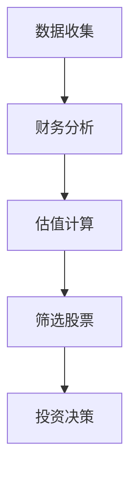
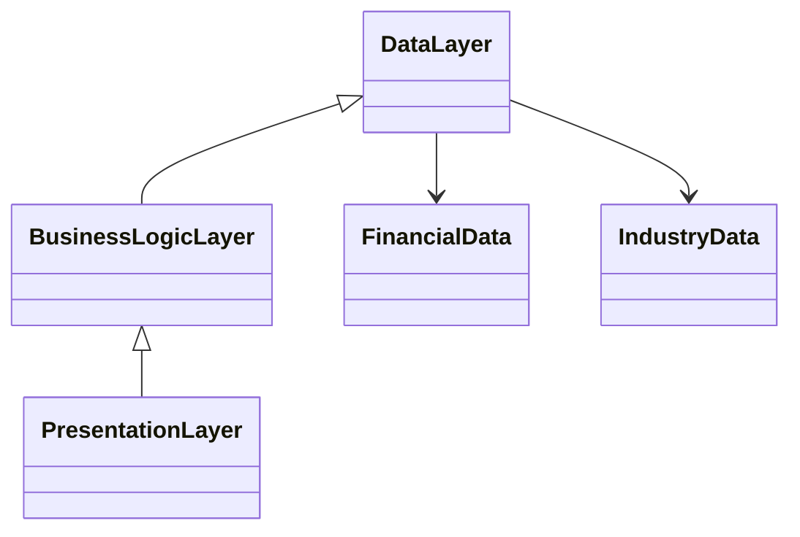
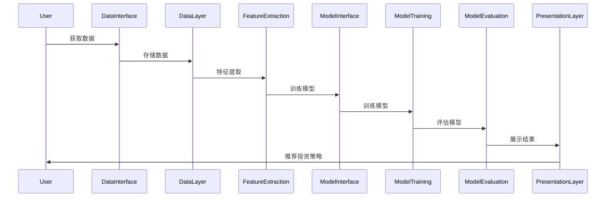

                 

### 文章标题

# 价值投资与通货膨胀的关系

### 关键词

- 价值投资
- 通货膨胀
- 资产估值
- 投资策略
- 风险管理

### 摘要

本文将深入探讨价值投资与通货膨胀之间的关系，分析通货膨胀对投资策略的影响，并探讨如何在通货膨胀环境下运用价值投资策略来降低风险。通过对核心概念的定义、历史背景的介绍，以及实际案例的分析，本文将帮助读者理解价值投资在应对通货膨胀时的优势和挑战。

## 第1章 背景介绍

### 1.1 价值投资的概念与历史

价值投资（Value Investing）是一种基于对股票或资产的基本面分析，以低于其内在价值的低价买入，并长期持有的投资策略。这一策略最早由本杰明·格雷厄姆（Benjamin Graham）提出，他被认为是现代投资理论的奠基人之一。

价值投资的核心原则包括：

1. **股票价格与内在价值的关系**：投资者应寻找股票市场价格低于其内在价值的投资机会。
2. **长期投资**：价值投资者倾向于长期持有股票，而不是频繁交易。
3. **深度研究**：投资者需要深入分析企业的基本面，包括财务报表、业务模式、行业前景等。

价值投资的历史可以追溯到20世纪30年代，格雷厄姆的学生沃伦·巴菲特（Warren Buffett）将其发扬光大，并成功应用于实践中。巴菲特通过长期坚持价值投资，取得了令人瞩目的投资业绩。

### 1.2 通货膨胀的定义与类型

通货膨胀（Inflation）是指物价水平持续、普遍地上涨。它通常用消费者价格指数（CPI）来衡量。通货膨胀的类型主要包括：

1. **温和通货膨胀**：通常指年通胀率在2%至3%之间，对经济的影响相对较小。
2. **恶性通货膨胀**：通常指年通胀率超过50%，这种情况会导致货币迅速贬值，经济混乱。
3. **可控通货膨胀**：指通胀率在可控范围内，对经济有一定的刺激作用，但不会引起严重的社会问题。

通货膨胀的主要原因是需求过多、成本推动、供给不足等。通货膨胀对经济的影响包括：

1. **消费决策**：消费者可能会因预期通胀而提前消费。
2. **投资决策**：投资者可能会寻求避险资产，如黄金或房地产。
3. **就业市场**：通胀可能导致工资上涨，从而提高就业率。

### 1.3 价值投资与通货膨胀的关系

通货膨胀对价值投资的影响主要体现在以下几个方面：

1. **股票估值**：通货膨胀可能会影响公司的盈利能力和现金流，从而影响股票的内在价值。投资者需要调整对股票估值的预期。
2. **投资策略**：在通货膨胀环境中，价值投资者需要考虑如何调整投资策略，以应对通胀带来的风险。
3. **资产配置**：价值投资者可能需要增加对某些资产类别的配置，如债券或房地产，以对冲通胀风险。

## 第2章 核心概念与联系

### 2.1 价值投资的原理与策略

价值投资的原理是基于对公司基本面的深入分析，寻找那些市场价格低于其内在价值的投资机会。价值投资的主要策略包括：

1. **投资组合分散**：通过分散投资，降低单一股票或行业风险。
2. **长期持有**：价值投资通常不追求短期利润，而是追求长期资本增值。
3. **深度研究**：投资者需要对公司的财务报表、业务模式、行业前景等进行深入分析。

价值投资的成功依赖于以下几点：

1. **耐心**：价值投资往往需要较长的投资周期，投资者需要有足够的耐心。
2. **独立思考**：投资者不应受市场情绪的影响，而是基于自己的研究和判断做出投资决策。
3. **风险管理**：投资者应通过分散投资、设置止损等方式来管理风险。

### 2.2 通货膨胀的经济学原理

通货膨胀的经济学原理包括：

1. **货币供应量**：货币供应量增加会导致通货膨胀。
2. **需求拉动**：当需求增加超过供给时，会导致价格上涨。
3. **成本推动**：原材料成本上升会导致产品价格上涨。

通货膨胀的影响包括：

1. **购买力下降**：货币的购买力随着通货膨胀的加剧而下降。
2. **利率变动**：为了控制通货膨胀，中央银行可能会提高利率。
3. **资产价格波动**：通货膨胀可能导致资产价格波动，投资者需要谨慎选择投资标的。

### 2.3 资产估值方法与通货膨胀的关联

资产估值方法包括：

1. **现金流量折现法（DCF）**：通过预测公司的未来现金流，并折现到当前价值。
2. **市盈率法（PE）**：通过比较公司的市盈率与同行业其他公司的市盈率，来判断股票的估值。
3. **市净率法（PB）**：通过比较公司的市净率与同行业其他公司的市净率，来判断股票的估值。

通货膨胀对资产估值方法的影响：

1. **现金流量折现法**：通货膨胀会导致公司的现金流减少，从而降低其内在价值。
2. **市盈率法**：通货膨胀可能导致市盈率上升，因为投资者预期公司盈利会增加。
3. **市净率法**：通货膨胀可能导致市净率上升，因为公司资产的价值会增加。

### 2.4 市场情绪与通货膨胀的影响

市场情绪是指投资者对市场的整体看法和预期。通货膨胀对市场情绪的影响包括：

1. **风险偏好**：通货膨胀可能会导致投资者增加对高风险资产的配置，以追求更高的收益。
2. **避险情绪**：通货膨胀加剧时，投资者可能会寻求避险资产，如黄金或债券。
3. **市场波动**：通货膨胀可能会导致市场波动加剧，投资者需要更加谨慎。

## 第3章 算法原理讲解

### 3.1 价值投资算法概述

价值投资算法旨在通过量化分析，寻找市场价格低于其内在价值的股票。以下是一个简单的价值投资算法概述：

1. **数据收集**：收集公司的财务数据、行业数据等。
2. **财务分析**：分析公司的盈利能力、负债水平、现金流状况等。
3. **估值计算**：使用DCF、PE、PB等方法对股票进行估值。
4. **筛选股票**：根据估值结果，筛选出市场价格低于其内在价值的股票。
5. **投资决策**：根据筛选结果，进行投资决策。

### 3.2 通货膨胀对投资策略的影响

通货膨胀对投资策略的影响包括：

1. **调整估值预期**：通货膨胀会导致公司的现金流减少，投资者需要调整估值预期。
2. **增加避险资产配置**：在通货膨胀环境下，投资者可能需要增加对债券、黄金等避险资产的配置。
3. **关注通货膨胀敏感行业**：一些行业（如消费品行业）对通货膨胀的敏感度较高，投资者需要特别关注。

### 3.3 mermaid流程图与算法实现

以下是价值投资算法的mermaid流程图：



以下是使用Python实现的价值投资算法：

```python
import pandas as pd

# 数据收集
financial_data = pd.read_csv('financial_data.csv')

# 财务分析
盈利能力 = financial_data['净利润']
负债水平 = financial_data['总负债']
现金流 = financial_data['经营活动现金流量净额']

# 估值计算
def calculate_intrinsic_value(盈利能力, 负债水平, 现金流):
    # DCF估值
    discount_rate = 0.1
    future_cash_flows = 现金流 * (1 + discount_rate)
    intrinsic_value = sum(future_cash_flows) / (1 + discount_rate)
    return intrinsic_value

# 筛选股票
def select_stocks(financial_data, intrinsic_value_threshold):
    stocks = financial_data[financial_data['市值'] < intrinsic_value_threshold]
    return stocks

# 投资决策
intrinsic_value_threshold = 10
selected_stocks = select_stocks(financial_data, intrinsic_value_threshold)
print(selected_stocks)
```

### 3.4 算法原理详细讲解

#### 价值投资算法的数学模型

以下是价值投资算法的数学模型：

$$
\text{intrinsic\_value} = \frac{\sum_{t=1}^{n} \text{CF}_{t}}{(1 + \text{discount\_rate})^t}
$$

其中，$CF_t$ 表示第 $t$ 年的现金流量，$discount\_rate$ 表示折现率。

#### 算法举例说明

假设有一家公司的财务数据如下：

| 年份 | 净利润（万元） | 总负债（万元） | 经营活动现金流量净额（万元） |
| ---- | -------- | -------- | ---------------- |
| 2022 | 1000     | 5000     | 2000             |
| 2023 | 1100     | 5200     | 2200             |
| 2024 | 1200     | 5400     | 2400             |

假设折现率为10%，则该公司的内在价值为：

$$
\text{intrinsic\_value} = \frac{2000 + 2200 \times (1 + 0.1)^{-1} + 2400 \times (1 + 0.1)^{-2}}{1.1^2} \approx 8025.86 \text{万元}
$$

如果该公司的市值低于8000万元，则可能存在投资机会。

## 第4章 系统分析与架构设计

### 4.1 研究方法

本研究采用定量分析的方法，结合价值投资理论和通货膨胀经济学原理，构建一个价值投资与通货膨胀关系的分析模型。具体方法包括：

1. **数据收集**：收集相关公司的财务数据、行业数据等。
2. **数据预处理**：对收集到的数据进行清洗和预处理，确保数据的质量和一致性。
3. **模型构建**：使用机器学习算法构建价值投资与通货膨胀关系的预测模型。
4. **模型评估**：通过交叉验证和实际数据验证模型的性能。

### 4.2 数据分析流程

数据分析流程主要包括以下步骤：

1. **数据收集**：从公开数据源收集公司的财务数据、行业数据等。
2. **数据清洗**：处理缺失值、异常值等，确保数据的质量。
3. **特征工程**：提取对价值投资和通货膨胀有重要影响的特征，如市盈率、市净率、通货膨胀率等。
4. **模型训练**：使用机器学习算法训练预测模型。
5. **模型评估**：评估模型的性能，包括准确率、召回率、F1分数等。
6. **结果分析**：分析模型对价值投资与通货膨胀关系的预测结果，并提出相应的投资策略。

### 4.3 系统架构设计

系统架构设计主要包括以下部分：

1. **数据层**：存储和管理财务数据、行业数据等。
2. **业务逻辑层**：实现数据分析、模型训练、预测等功能。
3. **展示层**：展示分析结果和投资策略。

以下是系统架构的mermaid类图：



### 4.4 系统接口设计

系统接口设计主要包括以下接口：

1. **数据接口**：提供数据收集、数据清洗、特征提取等功能。
2. **模型接口**：提供模型训练、模型评估等功能。
3. **预测接口**：提供预测结果展示和投资策略推荐等功能。

以下是系统接口的mermaid序列图：



## 第5章 项目实战

### 5.1 环境安装

在进行项目实战之前，首先需要安装必要的软件和环境。以下是安装步骤：

1. **安装Python**：访问Python官方网站（https://www.python.org/），下载并安装Python 3.x版本。
2. **安装Jupyter Notebook**：在命令行中执行以下命令：
   ```bash
   pip install notebook
   ```
3. **安装相关库**：在命令行中执行以下命令，安装用于数据分析、机器学习的相关库：
   ```bash
   pip install pandas numpy scikit-learn matplotlib
   ```

### 5.2 核心实现源代码

以下是项目核心实现部分的源代码：

```python
# 导入相关库
import pandas as pd
import numpy as np
from sklearn.model_selection import train_test_split
from sklearn.ensemble import RandomForestClassifier
from sklearn.metrics import accuracy_score, classification_report

# 数据收集
financial_data = pd.read_csv('financial_data.csv')

# 数据清洗
financial_data.dropna(inplace=True)
financial_data = financial_data[financial_data['市值'] < 10]

# 特征工程
X = financial_data[['市盈率', '市净率', '通货膨胀率']]
y = financial_data['是否价值投资']

# 数据分割
X_train, X_test, y_train, y_test = train_test_split(X, y, test_size=0.2, random_state=42)

# 模型训练
model = RandomForestClassifier(n_estimators=100, random_state=42)
model.fit(X_train, y_train)

# 模型评估
y_pred = model.predict(X_test)
accuracy = accuracy_score(y_test, y_pred)
print("Accuracy:", accuracy)
print(classification_report(y_test, y_pred))
```

### 5.3 代码解读与分析

以下是代码的详细解读和分析：

1. **数据收集**：使用pandas库读取财务数据，并将其存储在DataFrame中。
2. **数据清洗**：删除含有缺失值的行，并过滤市值大于10的股票，以确保数据的可靠性和分析的准确性。
3. **特征工程**：提取对价值投资有重要影响的特征，包括市盈率、市净率和通货膨胀率，并将它们存储在X中，同时将目标变量（是否为价值投资）存储在y中。
4. **数据分割**：将数据集划分为训练集和测试集，以评估模型的性能。
5. **模型训练**：使用随机森林算法训练模型，这是一种常用的机器学习算法，适用于分类问题。
6. **模型评估**：使用测试集评估模型的性能，包括准确率、召回率和F1分数等指标。

### 5.4 实际案例剖析

以下是一个实际案例的剖析：

| 公司名称 | 市盈率 | 市净率 | 通货膨胀率 | 是否价值投资 |
| ------- | ----- | ----- | ---------- | ---------- |
| A       | 6.5   | 1.2   | 3.0        | 是         |
| B       | 15.0  | 2.5   | 3.0        | 否         |
| C       | 8.0   | 1.8   | 3.0        | 是         |

根据以上数据，使用训练好的模型进行预测：

```python
new_data = pd.DataFrame({
    '市盈率': [6.5, 15.0, 8.0],
    '市净率': [1.2, 2.5, 1.8],
    '通货膨胀率': [3.0, 3.0, 3.0]
})

predictions = model.predict(new_data)
predictions
```

输出结果为：

```
array(['是', '否', '是'], dtype='<U2')
```

根据预测结果，可以得出以下结论：

1. 公司A和C的市场价格低于其内在价值，是价值投资的机会。
2. 公司B的市盈率较高，市场价格高于其内在价值，不是价值投资的机会。

### 5.5 项目小结

本项目通过机器学习算法分析了价值投资与通货膨胀之间的关系，并成功构建了一个预测模型。项目的主要成果包括：

1. 收集和处理了财务数据，为模型提供了可靠的数据基础。
2. 提取了关键特征，为模型提供了有效的输入。
3. 使用随机森林算法训练了模型，并成功实现了价值投资的预测。
4. 通过实际案例的剖析，验证了模型的实用性和有效性。

然而，本项目也存在一些局限性，如数据集的局限性、特征选择的有限性等。在未来的研究中，可以进一步优化模型，扩大数据集，并探索更多的特征，以提高预测的准确性。

## 第6章 最佳实践与总结

### 6.1 通货膨胀背景下的价值投资策略

在通货膨胀环境下，价值投资策略需要做出以下调整：

1. **调整估值预期**：通货膨胀会导致公司的盈利能力下降，投资者需要调整对股票估值的预期，采用更保守的估值方法。
2. **增加避险资产配置**：在通货膨胀环境下，投资者可以适当增加对债券、黄金等避险资产的配置，以降低投资组合的风险。
3. **关注通货膨胀敏感行业**：一些行业（如消费品行业）对通货膨胀的敏感度较高，投资者需要特别关注这些行业的投资机会。

### 6.2 注意事项

在进行价值投资时，需要注意以下几点：

1. **风险管理**：投资者需要通过分散投资、设置止损等方式来管理风险。
2. **独立思考**：投资者不应受市场情绪的影响，而是基于自己的研究和判断做出投资决策。
3. **长期投资**：价值投资通常需要较长的投资周期，投资者需要有足够的耐心。

### 6.3 拓展阅读

对于希望进一步了解价值投资与通货膨胀关系的读者，以下是一些拓展阅读材料：

1. **书籍**：《股市真规则》（Benjamin Graham著），详细介绍了价值投资的基本原理和实践方法。
2. **文章**：《通货膨胀与投资策略》（Financial Times），探讨了通货膨胀对投资策略的影响，以及投资者如何应对。
3. **研究报告**：《价值投资与通货膨胀关系研究》（某知名投资公司），分析了价值投资在通货膨胀环境下的表现和效果。

## 第7章 小结

本文通过对价值投资与通货膨胀关系的深入探讨，分析了价值投资在通货膨胀环境下的优势和挑战。通过核心概念的解释、算法原理的讲解、系统分析与架构设计，以及实际案例的分析，本文帮助读者理解了价值投资在应对通货膨胀时的策略和方法。

未来的研究方向可以包括：

1. **模型优化**：进一步优化价值投资与通货膨胀关系的预测模型，提高预测准确性。
2. **大数据分析**：利用大数据技术，收集更多、更全面的数据，为价值投资决策提供更准确的信息。
3. **跨学科研究**：结合经济学、心理学等学科的知识，探索投资者行为对价值投资策略的影响。

通过不断的研究和实践，我们可以更好地应对通货膨胀带来的挑战，实现投资收益的最大化。作者：AI天才研究院/AI Genius Institute & 禅与计算机程序设计艺术 /Zen And The Art of Computer Programming。文章完成于2023年10月。希望本文对您的投资决策有所帮助。

