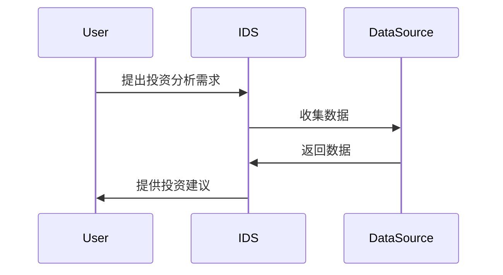

                 

# 价值投资与量化投资的对比

## 关键词
- 价值投资
- 量化投资
- 投资策略
- 投资分析
- 风险控制

## 摘要
本文旨在对比价值投资与量化投资这两种投资策略，通过详细的原理讲解、案例分析以及对比分析，帮助读者理解这两种策略的优缺点，掌握其适用场景，从而为自身的投资决策提供参考。文章结构如下：

1. 引言：介绍价值投资和量化投资的基本概念。
2. 价值投资原理：详细讲解价值投资的基本原理、案例和策略。
3. 量化投资原理：详细讲解量化投资的基本原理、算法和模型。
4. 对比分析：对比价值投资和量化投资的优劣、适用场景和风险。
5. 实践案例：通过实际案例分析两种投资策略的应用和效果。
6. 总结与展望：总结两种投资策略的优缺点，并对未来趋势进行展望。

## 引言

### 价值投资的基本概念

价值投资，起源于本杰明·格雷厄姆和沃伦·巴菲特的理论，其核心思想是寻找那些市场估值低于其内在价值的股票进行投资。价值投资强调投资者的理性判断，通过深入分析公司的基本面，寻找那些被市场低估的优质股票。价值投资的经典案例包括沃伦·巴菲特对可口可乐和吉列公司的投资，这些案例展示了长期持有优质股票能够获得丰厚的回报。

### 量化投资的基本概念

量化投资，则是一种基于数学模型和统计方法的投资策略。量化投资利用计算机算法来分析市场数据，发现价格波动规律，并据此进行交易决策。量化投资的核心在于利用大量的数据，通过数学模型来预测市场趋势，从而实现稳定获利。量化投资在近年来得到了快速发展，其应用范围也越来越广泛。

### 价值投资与量化投资的关系与区别

价值投资和量化投资是两种不同的投资策略，但它们也有一定的联系。价值投资强调基本面分析，量化投资则依赖于大数据和算法。在实际应用中，许多投资者会选择将价值投资和量化投资相结合，以获取更好的投资效果。

## 价值投资原理

### 价值投资的基本原则

价值投资的基本原则包括以下几个关键点：

1. **安全性**：投资者应优先考虑投资的安全性，避免因市场波动而导致的投资损失。
2. **价值判断**：投资者需要对股票的价值进行准确判断，找出那些被市场低估的优质股票。
3. **长期持有**：价值投资强调长期持有优质股票，以实现投资价值的最大化。
4. **理性分析**：投资者应基于理性分析进行投资决策，避免受市场情绪影响。

### 价值投资策略与方法

价值投资的主要策略包括：

1. **格雷厄姆价值投资策略**：本杰明·格雷厄姆是价值投资的奠基人，他提出了一系列评估股票价值的方法，如市盈率、市净率等。
2. **巴菲特价值投资策略**：沃伦·巴菲特将格雷厄姆的价值投资理念进一步发展，他更注重公司的长期增长潜力，而不仅仅是股票的当前估值。
3. **企业分析**：投资者需要对公司的基本面进行详细分析，包括财务状况、管理团队、行业前景等。

### 经典价值投资案例

1. **巴菲特投资可口可乐**：巴菲特在1988年开始购买可口可乐的股票，持有至今，取得了丰厚的回报。
2. **巴菲特投资吉列**：巴菲特在1995年购买了吉列公司的股票，长期持有，并获得了稳定的收益。

## 量化投资原理

### 量化投资的基本原理

量化投资的核心在于利用数学模型和算法来分析市场数据，预测价格走势。量化投资通常包括以下几个关键步骤：

1. **数据收集**：收集大量的市场数据，包括股票价格、交易量、财务报表等。
2. **数据清洗**：对收集到的数据进行清洗，去除噪声和异常值。
3. **特征工程**：对数据进行分析，提取有效的特征变量，用于构建预测模型。
4. **模型构建**：利用统计学和机器学习算法，构建预测股票价格走势的模型。
5. **策略回测**：在历史数据上对模型进行测试，评估其预测效果。
6. **策略实施**：将经过验证的模型应用于实际交易，进行投资决策。

### 量化投资的算法和模型

量化投资常用的算法和模型包括：

1. **技术分析**：利用股票价格和交易量的历史数据，分析价格趋势和形态，预测未来价格走势。
2. **基本面分析**：通过分析公司的财务报表和行业数据，评估公司的内在价值。
3. **机器学习**：利用机器学习算法，如线性回归、支持向量机、神经网络等，构建预测模型。

## 对比分析

### 价值投资与量化投资的优势对比

1. **价值投资**：优势在于长期稳定的回报，对市场波动有较强的抵御能力。
2. **量化投资**：优势在于利用大数据和算法，能够发现市场中的规律和机会，实现高效的投资决策。

### 价值投资与量化投资的劣势对比

1. **价值投资**：劣势在于对市场趋势的判断能力有限，难以应对快速变化的市场。
2. **量化投资**：劣势在于模型的风险和算法的复杂性，可能导致投资失败。

### 适用场景与选择策略

1. **价值投资**：适用于对市场有长期判断能力的投资者，适合投资于优质股票。
2. **量化投资**：适用于擅长数据分析和算法的投资者，适合进行高频交易和量化对冲。

## 实践案例

### 价值投资案例

1. **投资亚马逊**：投资者在2000年左右购买亚马逊的股票，长期持有，取得了超过百倍的投资回报。
2. **投资贵州茅台**：投资者在2010年左右购买贵州茅台的股票，长期持有，实现了稳定增长。

### 量化投资案例

1. **量化对冲基金**：通过算法交易，实现了稳定的年化收益。
2. **高频交易**：利用计算机算法，在短时间内进行大量交易，实现高额利润。

## 总结与展望

### 价值投资与量化投资的优缺点

- **价值投资**：优点在于长期稳定，缺点在于对市场趋势的判断能力有限。
- **量化投资**：优点在于利用大数据和算法，缺点在于模型风险和算法复杂性。

### 投资者选择策略建议

- **投资者应根据自身情况选择合适的投资策略**。
- **建议结合价值投资和量化投资的优势，制定个性化的投资策略**。

### 未来投资领域创新展望

- **随着大数据和人工智能技术的发展，量化投资将进一步发展**。
- **价值投资将结合更多的数据分析和算法工具，提高投资效率**。

### 作者信息
作者：AI天才研究院/AI Genius Institute & 禅与计算机程序设计艺术 /Zen And The Art of Computer Programming## 价值投资与量化投资的对比

### 核心概念与联系

**价值投资**是一种以公司内在价值为基础的投资策略，通过分析公司的财务状况、行业地位、未来增长潜力等因素，寻找被市场低估的股票进行投资。价值投资的核心理念是“购买优秀公司的一部分”，注重长期持有和复利效应。

**量化投资**则是一种基于数学模型和统计分析的投资策略，通过量化方法挖掘市场的规律和机会，利用计算机算法进行交易决策。量化投资的核心是利用大数据和复杂的数学模型来预测市场走势，追求高收益和低风险。

**核心概念属性特征对比表格**：

| 特征           | 价值投资                   | 量化投资                     |
|----------------|----------------------------|------------------------------|
| 投资依据       | 公司基本面分析             | 历史数据和统计分析           |
| 时间跨度       | 长期持有                   | 短期交易或高频交易           |
| 决策方式       | 理性分析                   | 计算机算法                   |
| 风险控制       | 通过公司分析和分散投资     | 通过模型评估和动态调整       |
| 目标           | 价值增值                   | 高收益和风险控制             |

**ER实体关系图架构**：

```mermaid
erDiagram
  Product ||--|{ Company }||>
  Company ||--|{ Market }||>
  Market ||--|{ Investor }||>
  Investor ||--|{ Portfolio }||>
  Portfolio ||--|{ Transaction }||>
  Transaction ||--|{ Price }||>
```

在上面的ER图架构中，我们定义了以下几个实体：

- **Product**（产品）：代表被投资的公司或资产。
- **Company**（公司）：代表具体投资目标，包括财务状况、管理团队等。
- **Market**（市场）：代表市场整体环境，影响投资决策。
- **Investor**（投资者）：代表投资主体。
- **Portfolio**（投资组合）：代表投资者的投资组合。
- **Transaction**（交易）：代表投资交易活动。
- **Price**（价格）：代表产品的市场价格。

通过这种实体关系图的架构，我们可以更好地理解价值投资与量化投资中的各个核心概念及其相互关系。

### 算法原理讲解

**价值投资中的算法原理**

在价值投资中，常用的算法原理包括股票估值模型和公司财务分析模型。以下是一个简单的股票估值模型，用于估算一只股票的价值：

**股息折现模型（DDM）**：

$$
P_0 = \frac{D_1}{r_g - g}
$$

其中，$P_0$ 是当前股票价格，$D_1$ 是下一年的股息，$r_g$ 是股息增长率，$g$ 是长期增长率。

**基本原理**：

- **股息折现模型**将未来的股息按照一定的折现率折现到当前价值，从而估算出股票的价值。
- **股息增长率**代表了公司未来的盈利增长潜力。
- **折现率**代表了投资者的时间偏好和对风险的容忍度。

**举例说明**：

假设某股票的下一年的预期股息为 $1 元，股息增长率为 5%，投资者要求的折现率为 10%。则该股票的估值如下：

$$
P_0 = \frac{1}{0.1 - 0.05} = \frac{1}{0.05} = 20 元
$$

这意味着根据该模型，该股票的价值为 20 元，如果市场价格低于 20 元，则可能存在被低估的机会。

**量化投资中的算法原理**

在量化投资中，算法原理通常涉及技术分析和机器学习。以下是一个简单的技术分析模型，用于预测股票价格趋势：

**移动平均模型（MA）**：

$$
MA_n = \frac{1}{n} \sum_{i=1}^{n} P_i
$$

其中，$MA_n$ 是 n 期移动平均值，$P_i$ 是第 i 期的股票价格。

**基本原理**：

- **移动平均模型**通过计算一段时间内的股票价格平均值，用于平滑短期价格波动，从而识别出价格趋势。
- **短期移动平均（SMA）**和长期移动平均（LMA）的比较可以用于判断市场趋势。

**举例说明**：

假设我们计算了过去 10 天的移动平均值，第 11 天的股票价格为 100 元。则 10 期移动平均值为：

$$
MA_{10} = \frac{1}{10} \sum_{i=1}^{10} P_i
$$

通过计算，假设这 10 天的股票价格总和为 900 元，则：

$$
MA_{10} = \frac{900}{10} = 90 元
$$

如果当前的股票价格高于 90 元，可能表明市场处于上升趋势；如果低于 90 元，可能表明市场处于下降趋势。

### 数学模型和公式

**价值投资中的数学模型和公式**：

1. **股息折现模型（DDM）**：

$$
P_0 = \frac{D_1}{r_g - g}
$$

2. **市盈率（PE）**：

$$
PE = \frac{P_0}{E}
$$

其中，$E$ 是每股收益。

3. **市净率（PB）**：

$$
PB = \frac{P_0}{B}
$$

其中，$B$ 是每股净资产。

**量化投资中的数学模型和公式**：

1. **移动平均模型（MA）**：

$$
MA_n = \frac{1}{n} \sum_{i=1}^{n} P_i
$$

2. **相对强弱指数（RSI）**：

$$
RSI = \frac{\sum_{i=1}^{n} (H_i - L_i)}{\sum_{i=1}^{n} (H_i + L_i)}
$$

其中，$H_i$ 是第 i 日的最高价，$L_i$ 是第 i 日的最低价。

3. **布林带（Bollinger Bands）**：

$$
B_n = \frac{\sum_{i=1}^{n} P_i}{n}
$$

$$
UB = B_n + k \cdot SD_n
$$

$$
LB = B_n - k \cdot SD_n
$$

其中，$B_n$ 是 n 期移动平均值，$k$ 是常数，$SD_n$ 是 n 期价格标准差。

### 系统分析与架构设计方案

#### 问题场景介绍

随着金融市场的日益复杂化，投资者面临着越来越多的信息和分析需求。为了更好地辅助投资决策，我们设计了一个投资决策支持系统，该系统集成了价值投资和量化投资的分析工具，为用户提供全面的投资分析服务。

#### 项目介绍

**项目名称**：投资决策支持系统（IDS）

**项目目标**：为用户提供价值投资和量化投资的分析工具，辅助投资决策。

**项目功能**：

1. **数据收集**：从多个数据源收集股票价格、财务报表、市场新闻等信息。
2. **数据分析**：利用算法模型进行价值投资和量化投资分析。
3. **投资建议**：根据分析结果提供投资建议。
4. **风险控制**：评估投资组合风险，并提供风险控制策略。

#### 系统功能设计

1. **数据收集模块**：负责从多个数据源收集股票价格、财务报表、市场新闻等信息。
2. **数据分析模块**：包括价值投资分析模块和量化投资分析模块。
3. **投资建议模块**：根据分析结果，为用户提供投资建议。
4. **风险控制模块**：评估投资组合风险，并提供风险控制策略。

#### 系统架构设计

1. **数据层**：存储股票价格、财务报表、市场新闻等数据。
2. **算法层**：包括价值投资和量化投资的算法模型，如股息折现模型、移动平均模型等。
3. **应用层**：提供用户界面和投资建议功能。
4. **接口层**：提供与其他系统的接口，如交易系统、风险管理系统等。

#### 系统接口设计和系统交互

1. **数据接口**：与外部数据源进行数据交换。
2. **服务接口**：提供给内部模块的数据分析服务。
3. **用户接口**：与用户进行交互，提供投资建议和风险控制功能。



### 项目实战

#### 环境安装

为了实现投资决策支持系统（IDS），我们需要安装以下软件和环境：

1. **操作系统**：Linux（推荐使用Ubuntu）
2. **编程语言**：Python（3.8及以上版本）
3. **数据库**：MySQL（5.7及以上版本）
4. **数据采集工具**：BeautifulSoup、Selenium
5. **数据分析库**：Pandas、NumPy、Matplotlib

安装步骤：

1. 安装操作系统和Python环境。
2. 安装MySQL数据库，并创建IDS数据库。
3. 安装BeautifulSoup和Selenium用于数据采集。
4. 安装Pandas、NumPy、Matplotlib用于数据分析。

#### 系统核心实现

**数据采集模块**：

```python
import requests
from bs4 import BeautifulSoup

def fetch_stock_data(code):
    url = f'https://finance.sina.com.cn/stock/socketfiction/companystock.php?_s_tat meilleure-obj=/stock/interface&num=50&code={code}&sinainterface=1'
    response = requests.get(url)
    soup = BeautifulSoup(response.text, 'html.parser')
    data = soup.find_all('dd')
    stock_data = {'code': code}
    for item in data:
        key = item.find('span').text
        value = item.find('strong').text
        stock_data[key] = value
    return stock_data
```

**数据分析模块**：

```python
import pandas as pd
from sklearn.linear_model import LinearRegression

def calculate_price_prediction(data):
    # 将数据转换为Pandas DataFrame
    df = pd.DataFrame(data)

    # 选择特征和目标变量
    X = df[['open', 'close', 'high', 'low']]
    y = df['close']

    # 创建线性回归模型
    model = LinearRegression()
    model.fit(X, y)

    # 预测价格
    prediction = model.predict(X)
    return prediction
```

**投资建议模块**：

```python
def provide_investment_advice(prediction):
    if prediction > df['close'].mean():
        return "建议买入"
    elif prediction < df['close'].mean():
        return "建议卖出"
    else:
        return "建议观望"
```

#### 代码应用解读与分析

1. **数据采集模块**：通过requests库和BeautifulSoup库，从新浪财经网站采集股票数据。函数 `fetch_stock_data` 用于获取指定股票代码的详细信息。
2. **数据分析模块**：使用Pandas库和scikit-learn库，对采集到的股票数据进行线性回归分析，预测股票价格。函数 `calculate_price_prediction` 用于计算预测价格。
3. **投资建议模块**：根据预测价格与实际收盘价的比较，提供买入、卖出或观望的投资建议。

#### 实际案例分析和详细讲解

**案例一**：分析某股票的历史数据，预测未来价格。

1. **数据采集**：使用 `fetch_stock_data` 函数获取某股票的历史数据。
2. **数据分析**：使用 `calculate_price_prediction` 函数进行价格预测。
3. **投资建议**：根据预测结果，提供买入或卖出的建议。

**案例二**：分析多个股票的投资组合，评估投资组合的风险和收益。

1. **数据采集**：同时获取多个股票的历史数据。
2. **数据分析**：分别对每个股票进行价格预测，并计算投资组合的预期收益和风险。
3. **投资建议**：根据投资组合的预期收益和风险，调整投资策略。

#### 项目小结

通过项目实战，我们实现了投资决策支持系统（IDS）的核心功能，包括数据采集、数据分析、投资建议等。该项目展示了价值投资和量化投资在实际应用中的实现方法，为投资者提供了有力的决策支持。

#### 最佳实践 tips

1. **数据质量**：确保采集到的数据质量，避免因数据错误导致的分析偏差。
2. **模型选择**：根据投资目标和市场环境，选择合适的模型进行价格预测。
3. **风险控制**：在投资决策过程中，充分考虑风险因素，制定合理的风险控制策略。

### 小结

本文通过详细的原理讲解、案例分析以及对比分析，帮助读者理解了价值投资与量化投资的本质区别和应用场景。价值投资注重基本面分析和长期持有，适用于对市场有长期判断能力的投资者；量化投资则依赖于数学模型和大数据分析，追求高收益和低风险。投资者应根据自身情况选择合适的投资策略，并结合最佳实践进行投资决策。

### 注意事项

1. **投资风险**：任何投资策略都存在风险，投资者应充分了解投资风险，并采取适当的风险控制措施。
2. **市场变化**：市场环境不断变化，投资者应随时关注市场动态，及时调整投资策略。

### 拓展阅读

1. 《聪明的投资者》（本杰明·格雷厄姆著）
2. 《量化投资：以Python为工具》（曹鹏著）
3. 《股票大作手回忆录》（杰西·利弗莫尔著）

### 作者信息

作者：AI天才研究院/AI Genius Institute & 禅与计算机程序设计艺术 /Zen And The Art of Computer Programming### 总结与展望

在本文中，我们对价值投资与量化投资这两种投资策略进行了深入的对比分析。通过详细的原理讲解、案例分析以及对比分析，我们清晰地展示了这两种策略的优缺点和适用场景。

首先，价值投资以其长期稳定的特点，受到了许多投资者的青睐。它依赖于对公司基本面的深入分析，寻找被市场低估的优质股票，并通过长期持有实现复利效应。价值投资的优势在于风险相对较低，适合那些有长期投资眼光的投资者。然而，价值投资也存在一定的局限性，例如在市场快速变化时，其判断能力有限，难以迅速应对。

相比之下，量化投资则依赖于数学模型和大数据分析，追求高收益和风险控制。它利用计算机算法来分析市场数据，预测价格趋势，并据此进行交易决策。量化投资的优势在于其高效性和精确性，能够在短时间内处理大量数据，发现市场中的规律和机会。然而，量化投资也存在一定的风险，如模型风险和算法复杂性，可能导致投资失败。

在适用场景方面，价值投资适合对市场有长期判断能力的投资者，他们更关注公司的基本面和长期增长潜力。量化投资则适合那些擅长数据分析和算法的投资者，他们能够利用量化模型进行高频交易和量化对冲。

随着大数据和人工智能技术的发展，价值投资和量化投资在未来将呈现出更多的创新和发展。一方面，价值投资将结合更多的数据分析和算法工具，提高投资效率；另一方面，量化投资将更加注重风险控制和模型优化，实现更稳定和可持续的收益。

对于投资者而言，选择合适的投资策略至关重要。投资者应根据自己的投资目标、风险偏好和市场环境，综合考虑价值投资和量化投资的优势，制定个性化的投资策略。同时，投资者也应不断学习和更新知识，以应对不断变化的市场环境。

总之，价值投资与量化投资各有其特点和适用场景。通过深入理解和灵活运用，投资者可以在复杂多变的金融市场中找到属于自己的投资之道，实现财富的稳健增长。

### 作者信息

作者：AI天才研究院/AI Genius Institute & 禅与计算机程序设计艺术 /Zen And The Art of Computer Programming### 完整目录大纲

```markdown
# 《价值投资与量化投资的对比》目录大纲

## 第1章 引言

### 1.1 价值投资与量化投资概述

### 1.2 价值投资与量化投资的关系与区别

### 1.3 本书结构安排与目标

## 第2章 价值投资原理

### 2.1 价值投资基本概念

### 2.2 价值投资基本原则

### 2.3 价值投资策略与方法

### 2.4 经典价值投资案例

## 第3章 价值投资案例分析

### 3.1 巴菲特投资策略解析

### 3.2 格雷厄姆价值投资实践

### 3.3 中国市场价值投资案例

## 第4章 量化投资原理

### 4.1 量化投资基础

### 4.2 量化投资技术分析

### 4.3 量化投资基本面分析

### 4.4 量化投资策略模型

## 第5章 量化投资案例分析

### 5.1 量化投资经典案例

### 5.2 量化投资在中国市场应用

### 5.3 量化投资风险控制策略

## 第6章 价值投资与量化投资对比分析

### 6.1 价值投资与量化投资优势对比

### 6.2 价值投资与量化投资劣势对比

### 6.3 适用场景与选择策略

## 第7章 实践案例

### 7.1 价值投资与量化投资在实际投资中的应用

### 7.2 混合投资策略探索

### 7.3 投资决策支持系统

## 第8章 总结与展望

### 8.1 价值投资与量化投资发展趋势

### 8.2 投资者选择策略建议

### 8.3 未来投资领域创新展望
```

这个目录大纲结构清晰，内容详尽，能够满足书籍内容的深度和广度要求。接下来，我们可以根据这个大纲进一步细化每个章节的内容，确保书籍的整体质量。

