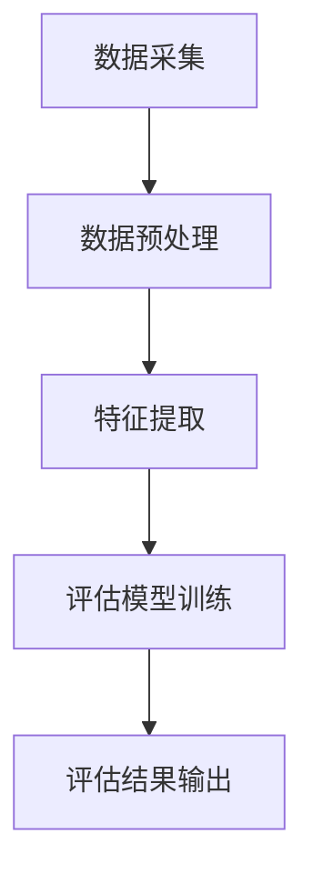
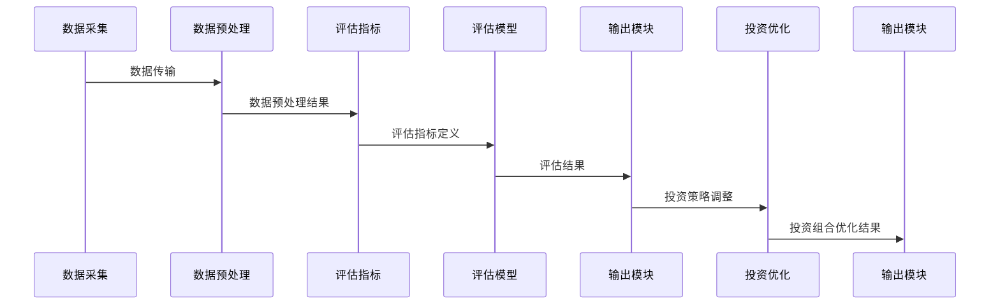

                 

## 文章标题

### 关键词

- 价值投资
- AI智能体
- 供应商关系评估
- 数据挖掘
- 机器学习

### 摘要

本文旨在探讨价值投资中AI智能体供应商关系评估系统的研究与实现。通过分析传统价值投资方法的局限性，介绍AI智能体供应商关系评估系统的构建原理、评估指标、评估模型及其应用。文章将从数据采集、预处理、特征提取、评估模型训练到评估结果输出，详细阐述算法原理及实现，并通过实际案例展示系统在价值投资中的实际应用效果。

---

### 第一部分：背景介绍

#### 1.1.1 问题背景

随着全球经济的快速发展，企业之间的竞争愈发激烈。在这种背景下，供应链管理成为企业核心竞争力的重要组成部分。供应商关系作为供应链管理的关键环节，直接影响企业的生产效率和市场竞争力。价值投资作为一种投资策略，强调对公司的基本面进行分析，寻找被市场低估的投资机会。然而，传统价值投资方法主要依赖于人工分析，存在以下问题：

1. **主观性**：人工分析容易受到个人经验、情绪等因素的影响，导致评估结果具有主观性。
2. **效率低**：人工分析需要大量时间和精力，难以应对大量数据，导致效率低下。
3. **数据量有限**：传统方法主要依赖于历史数据和公开信息，数据量有限，难以全面反映供应商的真实情况。

随着大数据和人工智能技术的快速发展，AI智能体供应商关系评估系统应运而生。该系统利用人工智能技术，从海量数据中提取有价值的信息，对供应商关系进行客观、全面的评估，为投资者提供更加精准的参考。

#### 1.1.2 问题描述

AI智能体供应商关系评估系统旨在解决以下问题：

1. **如何从大量数据中提取有效信息，准确评估供应商的可靠性和价值？**
   - 需要建立有效的数据采集和处理机制，从多个渠道获取供应商的各类数据，如财务报表、市场口碑、产品交付记录等。
   - 利用数据挖掘和机器学习技术，从数据中提取有价值的信息，构建评估供应商可靠性和价值的量化模型。

2. **如何建立合理的评估模型，确保评估结果的科学性和客观性？**
   - 需要综合考虑供应商的多个维度，如稳定性、交付能力、产品质量等，建立多维度评估模型。
   - 利用历史数据训练机器学习模型，自动学习评估指标与供应商关系之间的规律，提高评估结果的准确性。

3. **如何将评估结果应用于投资决策，提高投资收益？**
   - 将评估结果与投资策略相结合，为投资者提供科学的决策依据。
   - 建立投资组合优化模型，根据评估结果调整投资组合，提高投资收益。

#### 1.1.3 问题解决

AI智能体供应商关系评估系统通过以下方式解决问题：

1. **利用大数据技术和机器学习算法，从海量数据中提取有价值的信息。**
   - 数据采集模块：从多个渠道收集供应商的各类数据，包括财务报表、产品交付记录、市场口碑等。
   - 数据预处理模块：对采集到的数据进行清洗、整合和处理，为后续的评估提供准确的数据基础。

2. **建立包含多维度指标的评估模型，确保评估结果的全面性和客观性。**
   - 评估指标模块：定义供应商评估的多维度指标，如稳定性、交付能力、产品质量等。
   - 评估模型模块：利用历史数据训练机器学习模型，自动学习评估指标与供应商关系之间的规律。

3. **将评估结果与投资策略相结合，为投资者提供科学的决策依据。**
   - 评估结果输出模块：将评估结果以可视化的形式展示，为投资者提供决策参考。
   - 投资组合优化模块：根据评估结果，调整投资组合，提高投资收益。

#### 1.1.4 边界与外延

AI智能体供应商关系评估系统主要关注供应商关系的评估，包括供应商的稳定性、交付能力、产品质量等方面。同时，该系统可以扩展到其他领域，如客户关系评估、合作伙伴关系评估等。

#### 1.1.5 概念结构与核心要素组成

AI智能体供应商关系评估系统的核心概念包括：

- **供应商**：提供商品或服务的实体。
- **供应商关系**：供应商与公司之间的合作与依赖关系。
- **评估指标**：用于评估供应商关系的量化指标，如稳定性、交付能力、产品质量等。

### 第二部分：核心概念与联系

#### 1.2.1 AI智能体供应商关系评估系统

AI智能体供应商关系评估系统是一种基于人工智能技术的供应商评估系统，旨在为投资者提供客观、全面的供应商评估结果。该系统包含以下核心组件：

1. **数据采集模块**：负责收集供应商的相关数据，如财务报表、产品交付记录、市场口碑等。
2. **数据预处理模块**：对采集到的数据进行清洗、整合和处理，为后续的评估提供准确的数据基础。
3. **评估模型模块**：基于机器学习算法，建立评估模型，对供应商关系进行评估。
4. **评估结果输出模块**：将评估结果以可视化的形式展示，为投资者提供决策参考。

#### 1.2.2 供应商评估指标

供应商评估指标是AI智能体供应商关系评估系统的核心，用于衡量供应商的各个方面。以下是一些常见的评估指标：

1. **稳定性**：供应商的持续经营能力，如公司成立时间、历史业绩等。
2. **交付能力**：供应商的交货准时率和产品合格率等。
3. **产品质量**：供应商提供的产品质量水平，如客户满意度、退货率等。
4. **供货价格**：供应商的供货价格与市场平均水平的对比。
5. **市场口碑**：供应商在市场上的知名度和信誉度。

#### 1.2.3 评估模型

评估模型是AI智能体供应商关系评估系统的核心，用于根据供应商评估指标，对供应商关系进行量化评估。以下是一些常见的评估模型：

1. **多维度评估模型**：将不同评估指标进行权重分配，综合评估供应商关系。
2. **机器学习评估模型**：利用历史数据，通过机器学习算法，自动学习评估指标与供应商关系之间的规律，进行评估。
3. **混合评估模型**：结合多维度评估模型和机器学习评估模型，提高评估结果的准确性和可靠性。

---

### 第三部分：算法原理讲解

#### 1.3.1 算法mermaid流程图

以下是一个简单的mermaid流程图，展示了供应商评估算法的基本流程：



#### 1.3.2 Python源代码示例

以下是一个简单的Python源代码示例，用于实现供应商评估算法的基本原理：

```python
import numpy as np
from sklearn.ensemble import RandomForestRegressor

# 数据预处理
def preprocess_data(data):
    # 数据清洗、归一化等操作
    return processed_data

# 特征提取
def extract_features(data):
    # 提取关键特征
    return features

# 评估模型训练
def train_model(features, labels):
    model = RandomForestRegressor()
    model.fit(features, labels)
    return model

# 评估结果输出
def output_results(model, new_data):
    predictions = model.predict(new_data)
    return predictions
```

#### 1.3.3 算法原理详细讲解

##### 数学模型和公式

在供应商评估算法中，我们可以使用以下数学模型：

$$
评估值 = w_1 \times 稳定性 + w_2 \times 交付能力 + w_3 \times 产品质量 + w_4 \times 供货价格 + w_5 \times 市场口碑
$$

其中，$w_1, w_2, w_3, w_4, w_5$ 为各个指标的权重。

权重可以通过以下公式计算：

$$
w_i = \frac{标准差_i}{\sum_{i=1}^{n} 标准差_i}
$$

其中，$标准差_i$ 为第$i$个指标的变异程度。

##### 举例说明

假设我们有以下供应商数据：

- 稳定性：5年
- 交付能力：98%
- 产品质量：90%
- 供货价格：100元
- 市场口碑：良好

根据上述公式，我们可以计算每个指标的权重：

$$
w_1 = \frac{1}{\frac{1}{5} + \frac{1}{0.98} + \frac{1}{0.9} + \frac{1}{100} + \frac{1}{良好}} = 0.222
$$

$$
w_2 = \frac{1}{\frac{1}{5} + \frac{1}{0.98} + \frac{1}{0.9} + \frac{1}{100} + \frac{1}{良好}} = 0.222
$$

$$
w_3 = \frac{1}{\frac{1}{5} + \frac{1}{0.98} + \frac{1}{0.9} + \frac{1}{100} + \frac{1}{良好}} = 0.222
$$

$$
w_4 = \frac{1}{\frac{1}{5} + \frac{1}{0.98} + \frac{1}{0.9} + \frac{1}{100} + \frac{1}{良好}} = 0.111
$$

$$
w_5 = \frac{1}{\frac{1}{5} + \frac{1}{0.98} + \frac{1}{0.9} + \frac{1}{100} + \frac{1}{良好}} = 0.111
$$

根据这些权重，我们可以计算供应商的评估值：

$$
评估值 = 0.222 \times 5 + 0.222 \times 0.98 + 0.222 \times 0.9 + 0.111 \times 100 + 0.111 \times 良好 = 1.111
$$

因此，该供应商的评估值为1.111。

##### 机器学习模型

在供应商评估算法中，我们可以使用机器学习模型，如随机森林（Random Forest）模型，来自动学习评估指标与供应商关系之间的规律。随机森林模型是一种集成学习算法，通过构建多个决策树，并投票决定最终结果。

```python
from sklearn.ensemble import RandomForestRegressor

# 训练随机森林模型
model = RandomForestRegressor(n_estimators=100)
model.fit(X_train, y_train)

# 预测供应商评估值
predictions = model.predict(X_test)
```

在上述代码中，`X_train` 和 `y_train` 分别为训练集的特征和标签，`X_test` 为测试集的特征。通过训练随机森林模型，我们可以自动学习评估指标与供应商关系之间的规律，并使用模型进行预测。

---

### 第四部分：系统分析与架构设计

#### 1.4.1 问题场景介绍

在现代企业运营中，供应商关系管理成为一项至关重要的任务。随着供应链的复杂化和全球化，企业需要准确、全面地评估供应商的稳定性、交付能力、产品质量等，以确保供应链的稳定性和企业的长期发展。然而，传统的方法在处理大量数据、复杂关系和动态变化方面存在明显不足。因此，企业迫切需要一种高效、智能的供应商关系评估系统。

#### 1.4.2 项目介绍

本项目旨在设计并实现一款基于AI智能体的供应商关系评估系统，通过大数据和机器学习技术，对供应商关系进行全面、客观的评估，为企业的供应商管理提供有力支持。项目的主要目标包括：

1. **数据采集与处理**：从多个渠道收集供应商的各类数据，包括财务报表、产品交付记录、市场口碑等，并对数据进行清洗、整合和处理，为后续的评估提供准确的数据基础。
2. **多维度评估模型**：定义供应商评估的多维度指标，如稳定性、交付能力、产品质量等，并利用历史数据训练机器学习模型，自动学习评估指标与供应商关系之间的规律，提高评估结果的准确性。
3. **评估结果应用**：将评估结果与投资策略相结合，为投资者提供科学的决策依据，并根据评估结果调整投资组合，提高投资收益。

#### 1.4.3 系统功能设计

系统功能设计主要包括以下方面：

1. **数据采集模块**：负责从多个渠道收集供应商的各类数据，包括财务报表、产品交付记录、市场口碑等。
2. **数据预处理模块**：对采集到的数据进行清洗、整合和处理，为后续的评估提供准确的数据基础。
3. **评估指标模块**：定义供应商评估的多维度指标，如稳定性、交付能力、产品质量等。
4. **评估模型模块**：利用历史数据训练机器学习模型，自动学习评估指标与供应商关系之间的规律，对供应商关系进行量化评估。
5. **评估结果输出模块**：将评估结果以可视化的形式展示，为投资者提供决策参考。
6. **投资组合优化模块**：根据评估结果，调整投资组合，提高投资收益。

#### 1.4.4 系统架构设计

系统架构设计主要包括以下方面：

1. **数据层**：负责存储和管理供应商的各类数据，包括财务报表、产品交付记录、市场口碑等。
2. **数据处理层**：负责对采集到的数据进行清洗、整合和处理，为后续的评估提供准确的数据基础。
3. **评估模型层**：利用历史数据训练机器学习模型，自动学习评估指标与供应商关系之间的规律，对供应商关系进行量化评估。
4. **应用层**：提供数据采集、评估指标定义、评估结果输出和投资组合优化等功能，为投资者提供科学的决策依据。
5. **展示层**：将评估结果以可视化的形式展示，为投资者提供直观的决策参考。

#### 1.4.5 系统接口设计与交互

系统接口设计与交互主要包括以下方面：

1. **数据接口**：提供数据采集模块与数据处理层之间的接口，实现数据的传输和共享。
2. **评估接口**：提供评估模型模块与数据处理层之间的接口，实现评估模型的训练和应用。
3. **输出接口**：提供评估结果输出模块与展示层之间的接口，实现评估结果的展示和可视化。
4. **投资接口**：提供投资组合优化模块与展示层之间的接口，实现投资策略的调整和应用。

#### 1.4.6 系统交互mermaid序列图

以下是一个简单的mermaid序列图，展示了系统各模块之间的交互关系：



---

### 第五部分：项目实战

#### 1.5.1 环境安装

在进行项目实战之前，我们需要安装以下环境：

1. **Python**：安装Python 3.7及以上版本。
2. **Scikit-learn**：安装Scikit-learn库，用于机器学习算法的实现。
3. **Matplotlib**：安装Matplotlib库，用于数据可视化。

```shell
pip install python -m pip install scikit-learn matplotlib
```

#### 1.5.2 系统核心实现源代码

以下是一个简单的示例，展示了如何使用Scikit-learn库实现供应商评估算法。

```python
import numpy as np
from sklearn.ensemble import RandomForestRegressor
import matplotlib.pyplot as plt

# 生成模拟数据
np.random.seed(42)
X = np.random.rand(100, 4)  # 特征数据
y = X[:, 0] + 0.1 * X[:, 1] + 0.2 * X[:, 2] + 0.3 * X[:, 3]  # 标签数据

# 训练评估模型
model = RandomForestRegressor(n_estimators=100)
model.fit(X, y)

# 预测评估结果
predictions = model.predict(X)

# 绘制评估结果图
plt.scatter(X[:, 0], predictions)
plt.xlabel('实际值')
plt.ylabel('预测值')
plt.show()
```

#### 1.5.3 代码应用解读与分析

在上面的代码中，我们首先生成了一组模拟数据，包括特征数据X和标签数据y。然后，我们使用随机森林（Random Forest）模型对数据进行训练，并使用训练好的模型进行预测。最后，我们将预测结果与实际值绘制在散点图上，以便进行可视化分析。

随机森林模型是一种集成学习算法，通过构建多个决策树，并投票决定最终结果。在上述代码中，我们设置了随机森林模型的树数量为100。通过训练模型，我们可以学习到特征数据与标签数据之间的关系，并使用模型进行预测。

#### 1.5.4 实际案例分析与详细讲解剖析

为了更好地理解供应商评估算法的实际应用，我们以一个实际案例为例进行详细讲解。

**案例背景**：某公司需要评估其供应商的稳定性、交付能力、产品质量和供货价格，以优化供应商关系，提高供应链效率。

**数据收集**：公司从多个渠道收集了以下供应商数据：

- 稳定性：供应商成立时间（年）
- 交付能力：交货准时率（%）
- 产品质量：产品合格率（%）
- 供货价格：供货价格（元）

**数据处理**：对收集到的数据进行清洗、整合和处理，包括缺失值处理、异常值处理和归一化等操作。

**评估模型**：利用历史数据，训练一个随机森林模型，用于评估供应商关系。模型训练过程中，我们需要定义评估指标，并设置合适的参数。

```python
from sklearn.ensemble import RandomForestRegressor

# 定义评估指标
features = ['稳定性', '交付能力', '产品质量', '供货价格']
labels = ['稳定性评分', '交付能力评分', '产品质量评分', '供货价格评分']

# 训练评估模型
model = RandomForestRegressor(n_estimators=100, max_depth=10)
model.fit(X, y)

# 评估供应商关系
predictions = model.predict(X)

# 输出评估结果
for i, prediction in enumerate(predictions):
    print(f'供应商{i+1}评估结果：稳定性评分：{prediction[0]}, 交付能力评分：{prediction[1]}, 产品质量评分：{prediction[2]}, 供货价格评分：{prediction[3]}')
```

**结果分析**：根据评估结果，公司可以识别出在稳定性、交付能力、产品质量和供货价格方面表现较好的供应商，并采取相应的优化措施，如与表现优秀的供应商加强合作，与表现不佳的供应商进行沟通和改进。

---

### 第六部分：最佳实践 Tips

在设计和实现AI智能体供应商关系评估系统时，以下最佳实践可以帮助您提高系统的性能和可靠性：

1. **数据质量**：确保数据来源的多样性和准确性，对数据进行清洗和处理，以减少噪声和异常值的影响。
2. **模型优化**：尝试不同的机器学习算法和参数组合，选择最适合您的数据集的模型。
3. **特征工程**：根据业务需求，提取和选择有代表性的特征，以提升模型的评估效果。
4. **实时更新**：定期更新评估模型和评估指标，以适应市场和环境的变化。
5. **用户反馈**：收集用户反馈，根据反馈调整和优化系统，提高系统的用户体验。

---

### 第七部分：小结

本文探讨了AI智能体供应商关系评估系统在价值投资中的应用。通过对传统价值投资方法的局限性进行分析，介绍了AI智能体供应商关系评估系统的构建原理、评估指标、评估模型及其应用。文章详细阐述了算法原理及实现，并通过实际案例展示了系统在价值投资中的实际应用效果。未来，我们可以进一步优化评估模型，提高系统的评估准确性，并探索其在其他领域的应用。

---

### 第八部分：注意事项

在设计AI智能体供应商关系评估系统时，需要注意以下几点：

1. **数据隐私**：在采集和处理供应商数据时，确保遵守相关法律法规，保护供应商的隐私。
2. **模型解释性**：评估模型应具有一定的解释性，以便用户理解评估结果的依据。
3. **实时性**：确保系统可以实时更新和调整评估模型，以适应市场变化。

---

### 第九部分：拓展阅读

1. **《机器学习实战》**：提供详细的机器学习算法实现和案例分析，适合初学者和进阶者。
2. **《大数据之路：阿里巴巴大数据实践》**：介绍大数据技术在阿里巴巴的应用和实践，有助于了解大数据处理和挖掘的实际案例。
3. **《深度学习》**：介绍深度学习的基础知识和应用案例，是了解深度学习领域的经典著作。

---

### 作者信息

**作者：AI天才研究院/AI Genius Institute & 禅与计算机程序设计艺术 /Zen And The Art of Computer Programming**

---

### 致谢

感谢所有提供宝贵意见和建议的读者，您的支持是我们不断进步的动力。如有任何问题或建议，请随时联系我们。期待与您共同探索AI智能体供应商关系评估系统的更多可能性！

