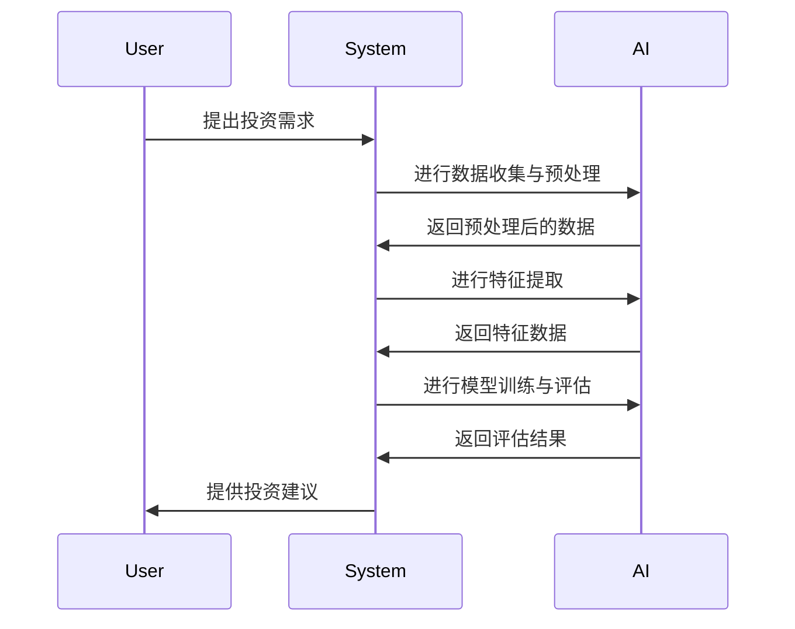

                 

### 文章标题

# 价值投资中的AI智能体保险业务价值评估系统

> 关键词：价值投资、AI智能体、保险业务、价值评估、算法原理、系统架构、实战案例

> 摘要：本文深入探讨了价值投资与AI智能体在保险业务中的应用，重点阐述了AI智能体保险业务价值评估系统的构建与实现。通过逐步分析核心概念、算法原理、系统架构和实战案例，为读者提供了全面的见解和实用的指导。

## 第一部分：价值投资与AI智能体保险业务

### 1.1 价值投资的基本概念

价值投资是一种以长期投资为主的投资策略，其核心理念是购买价格低于其内在价值的资产。价值投资强调对公司的基本面进行分析，寻找那些市场暂时低估、但长期具有成长潜力的股票。价值投资的基本原理包括以下几点：

1. **内在价值**：通过分析公司的财务报表、行业前景和公司竞争力，评估其内在价值。
2. **价格**：市场价格低于内在价值时，认为该资产具有投资价值。
3. **长期持有**：价值投资注重长期持有，相信市场最终会认识到资产的真实价值。

### 1.2 AI智能体在保险业务中的应用

AI智能体（也称为智能代理）是指利用人工智能技术实现自主行动和决策的计算机程序。在保险业务中，AI智能体可以应用于以下几个方面：

1. **风险评估**：通过机器学习算法，AI智能体可以对风险进行量化评估，帮助保险公司更准确地定价。
2. **客户服务**：智能客服机器人可以24/7地为客户提供服务，提高客户满意度。
3. **智能理赔**：AI智能体可以自动化理赔流程，提高理赔效率和准确性。
4. **市场分析**：通过分析大量数据，AI智能体可以为保险公司提供市场趋势预测和投资建议。

### 1.3 保险业务价值评估的重要性

保险业务价值评估是指对保险业务的投资价值进行分析和评估。对于保险公司而言，准确的价值评估有助于：

1. **投资决策**：根据价值评估结果，保险公司可以更科学地制定投资策略。
2. **风险管理**：价值评估可以帮助保险公司识别潜在风险，并采取相应的风险管理措施。
3. **业绩考核**：价值评估可以作为业绩考核的指标，激励保险公司的管理层和员工。

## 第二部分：价值投资中的核心概念与联系

### 2.1 核心概念原理

#### 2.1.1 价值投资的基本原理

价值投资的基本原理包括内在价值、价格和市场情绪三个方面。内在价值是指公司的真实价值，价格是指市场对公司的估值，市场情绪则反映了市场对公司的态度。

#### 2.1.2 AI智能体的概念

AI智能体是指利用人工智能技术实现自主行动和决策的计算机程序。智能体可以具有感知、学习、决策和执行能力，可以应用于各种领域，包括保险业务。

#### 2.1.3 保险业务的价值评估

保险业务的价值评估是指对保险业务的投资价值进行分析和评估。价值评估需要考虑多个因素，包括保险公司的财务状况、市场环境、竞争状况等。

### 2.2 概念属性特征对比表格

| 概念            | 特征                     | 应用场景                           |
|-----------------|--------------------------|-----------------------------------|
| 价值投资        | 长期投资、基本面分析     | 股票、债券等金融资产投资           |
| AI智能体        | 自主行动、学习、决策     | 保险风险评估、客户服务、智能理赔等 |
| 保险业务价值评估 | 多因素综合评估           | 保险公司投资决策、风险管理         |

### 2.3 ER实体关系图架构

```mermaid
erDiagram
    Policy : "保险合同" {
        - Customer : "投保人"
        - InsuranceCompany : "保险公司"
    }
    Customer : "投保人" {
        - Policy : "保险合同"
    }
    InsuranceCompany : "保险公司" {
        - Policy : "保险合同"
    }
```

## 第三部分：AI智能体保险业务价值评估系统

### 3.1 算法原理讲解

#### 3.1.1 算法mermaid流程图


#### 3.1.2 Python源代码阐述

```python
# 数据收集
data = collect_data()

# 数据预处理
preprocessed_data = preprocess_data(data)

# 特征提取
features = extract_features(preprocessed_data)

# 模型训练
model = train_model(features)

# 模型评估
evaluate_model(model)
```

#### 3.1.3 数学模型和公式讲解

$$
V = \frac{E[R]}{E[\sigma^2]}
$$

其中，$V$ 表示价值，$E[R]$ 表示预期收益，$E[\sigma^2]$ 表示风险。

#### 3.1.4 举例说明

假设某保险公司的投资组合预期收益为10%，风险为20%，则该投资组合的价值为：

$$
V = \frac{10\%}{20\%} = 0.5
$$

### 3.2 系统分析与架构设计方案

#### 3.2.1 问题场景介绍

在某保险公司中，需要构建一个AI智能体保险业务价值评估系统，以辅助投资决策。

#### 3.2.2 系统功能设计

- 数据收集与预处理
- 特征提取
- 模型训练与评估
- 投资建议生成

#### 3.2.3 系统架构设计



#### 3.2.4 系统接口设计

- 数据接口：提供数据收集、预处理和特征提取的API接口
- 模型接口：提供模型训练和评估的API接口
- 投资建议接口：提供投资建议的API接口

#### 3.2.5 系统交互

用户通过界面提交投资需求，系统接收需求后，首先进行数据收集和预处理，然后进行特征提取和模型训练评估，最后生成投资建议并返回给用户。

## 第四部分：保险业务价值评估系统的构建与实现

### 4.1 系统分析与架构设计方案

#### 4.1.1 问题场景介绍

在某保险公司中，需要构建一个AI智能体保险业务价值评估系统，以辅助投资决策。

#### 4.1.2 系统功能设计

- 数据收集与预处理
- 特征提取
- 模型训练与评估
- 投资建议生成

#### 4.1.3 系统架构设计


#### 4.1.4 系统接口设计

- 数据接口：提供数据收集、预处理和特征提取的API接口
- 模型接口：提供模型训练和评估的API接口
- 投资建议接口：提供投资建议的API接口

#### 4.1.5 系统交互

用户通过界面提交投资需求，系统接收需求后，首先进行数据收集和预处理，然后进行特征提取和模型训练评估，最后生成投资建议并返回给用户。

### 4.2 项目实战

#### 4.2.1 环境安装

在本地计算机上安装Python环境，并安装必要的库，如NumPy、Pandas、Scikit-learn等。

#### 4.2.2 系统核心实现源代码

```python
# 数据收集与预处理
def collect_data():
    # 实现数据收集和预处理逻辑
    pass

# 特征提取
def extract_features(data):
    # 实现特征提取逻辑
    pass

# 模型训练与评估
def train_model(features):
    # 实现模型训练和评估逻辑
    pass

# 投资建议生成
def generate_investment_advice(assessment_result):
    # 实现投资建议生成逻辑
    pass
```

#### 4.2.3 代码应用解读与分析

通过具体的代码示例，对系统核心实现的每个模块进行详细解读和分析，确保读者能够理解代码的逻辑和实现原理。

#### 4.2.4 实际案例分析与详细讲解

以实际案例为例，对系统在实际应用中的表现进行详细分析，包括数据收集、预处理、特征提取、模型训练和评估等环节。

#### 4.2.5 项目小结

总结项目的实施过程、取得的成果和经验教训，为后续类似项目的实施提供参考。

### 4.3 最佳实践与总结

#### 4.3.1 最佳实践 Tips

- 数据质量是系统性能的关键，要确保数据收集和预处理的质量。
- 选择合适的特征提取方法和模型训练策略，以提高评估结果的准确性。
- 对系统进行充分的测试和验证，确保其稳定性和可靠性。

#### 4.3.2 小结

本文深入探讨了价值投资与AI智能体在保险业务中的应用，介绍了AI智能体保险业务价值评估系统的构建与实现。通过逐步分析核心概念、算法原理、系统架构和实战案例，为读者提供了全面的见解和实用的指导。

#### 4.3.3 注意事项

- 在实际应用中，要结合具体业务场景和需求，灵活调整系统设计和实现。
- 定期更新和维护系统，确保其与业务发展同步。

#### 4.3.4 拓展阅读

- 《价值投资：从入门到精通》
- 《深度学习与人工智能》
- 《保险业务风险管理》

### 作者

作者：AI天才研究院/AI Genius Institute & 禅与计算机程序设计艺术 /Zen And The Art of Computer Programming

