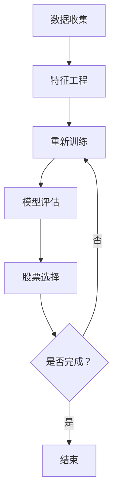
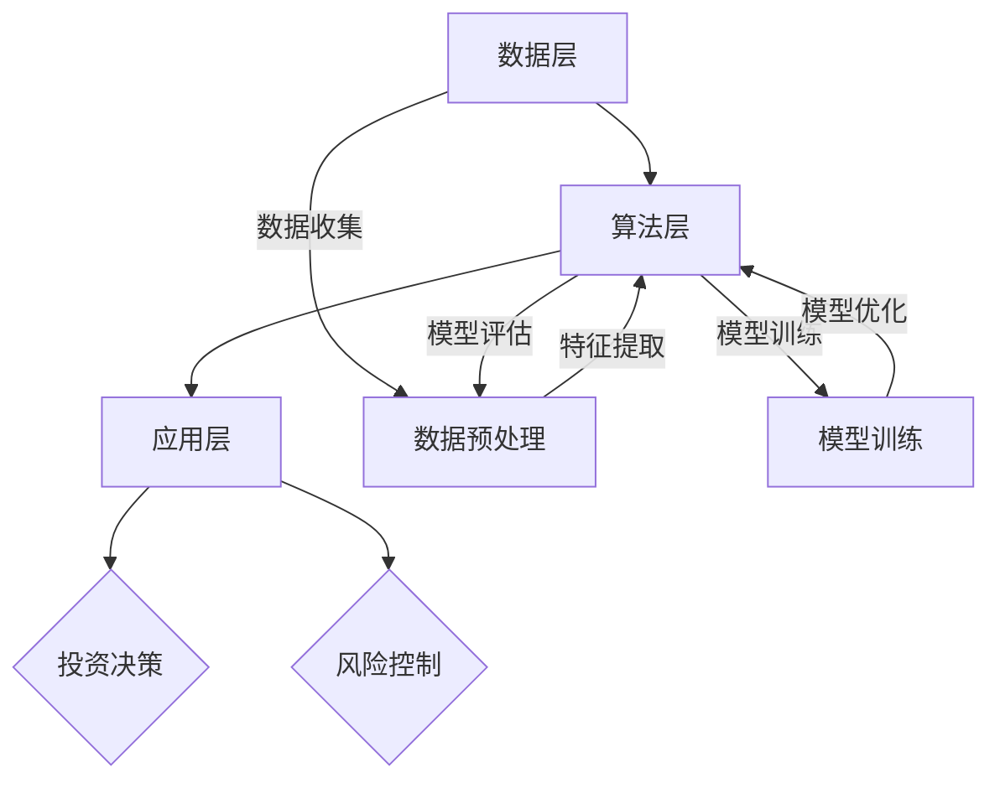
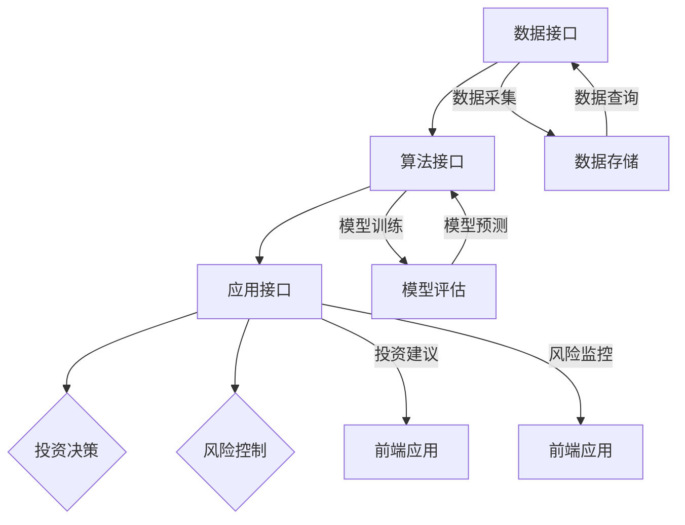

                 

# 价值投资中的AI智能体协作：增强格雷厄姆的安全边际理论

## 关键词：价值投资、AI智能体、安全边际理论、投资策略、风险管理

### 摘要

价值投资作为传统投资领域的重要理论，强调寻找那些被市场低估的优质企业进行长期持有。而随着人工智能技术的迅猛发展，AI智能体在投资中的应用逐渐受到关注。本文将探讨如何通过AI智能体协作来增强格雷厄姆的安全边际理论，提升价值投资的效果。本文分为七个部分，从AI智能体与价值投资的历史背景出发，逐步介绍AI智能体的基本原理、安全边际理论的要点及其与AI智能体的结合，到AI智能体在价值投资中的具体应用，以及风险管理和未来展望。

## 第一部分：价值投资与AI智能体基础

### 第1章：价值投资的历史与AI智能体的崛起

价值投资起源于20世纪初，由本杰明·格雷厄姆提出并发展，主张通过深入分析企业的财务报表和经营状况，寻找价格低于其内在价值的股票进行投资。随着时间推移，这一理论被众多投资者和实践者所接受，并成为投资领域的基石之一。

在价值投资理论中，安全边际是一个核心概念，指的是股票的市场价格低于其内在价值的差额。格雷厄姆认为，只有当安全边际足够大时，投资者才具备应对市场波动和不确定性的能力。

与此同时，人工智能技术在过去几十年中经历了飞速的发展。AI智能体，即人工智能代理（Artificial Intelligence Agent），是一种能够在特定环境中自主行动、完成任务并作出决策的智能系统。随着计算能力和算法的进步，AI智能体在各个领域展现出强大的潜力。

AI智能体的崛起为价值投资带来了新的机遇。首先，AI智能体能够处理和分析海量的数据，帮助投资者更准确地评估企业的内在价值。其次，AI智能体可以实时监测市场动态，提供更加及时的投资建议。此外，AI智能体还能通过协作，实现更复杂的投资策略，提高价值投资的效果。

### 第2章：AI智能体基本原理与类型

AI智能体的基本原理可以概括为感知、学习、决策和行动。感知是指智能体通过传感器获取环境信息；学习是指智能体基于已有数据和经验改进自身；决策是指智能体根据环境信息和目标选择行动策略；行动是指智能体根据决策执行具体操作。

根据功能和应用场景，AI智能体可以分为多种类型。例如，监督学习智能体基于历史数据学习模式，进行预测和决策；强化学习智能体通过与环境的交互不断优化策略；知识表示和推理智能体则利用符号逻辑和知识库进行决策。

AI智能体在投资领域的应用潜力巨大。一方面，它们可以用于量化分析，帮助投资者快速筛选潜在投资机会；另一方面，它们可以模拟市场行为，为投资者提供更深入的市场洞察。

### 第3章：格雷厄姆的安全边际理论与AI智能体

格雷厄姆的安全边际理论强调，投资者在购买股票时应确保市场价格低于其内在价值，以防止潜在的损失。这一理论的核心要素包括：

1. **内在价值**：通过深入分析企业的财务报表、经营状况、行业前景等因素，确定股票的内在价值。
2. **市场价格**：市场对股票的报价，通常受市场情绪、供求关系等因素的影响。
3. **安全边际**：市场价格与内在价值之间的差额。

AI智能体如何增强安全边际理论？首先，AI智能体可以通过大数据分析和机器学习算法，更准确地估算企业的内在价值。其次，AI智能体可以实时监控市场动态，识别价格波动背后的原因，为投资者提供更有针对性的投资建议。最后，AI智能体可以通过协作，构建复杂的投资策略，提高安全边际的效果。

## 第二部分：AI智能体在价值投资中的应用

### 第4章：AI智能体在价值投资中的应用

AI智能体在价值投资中的应用主要体现在以下几个方面：

### 4.1 AI智能体辅助股票选择

AI智能体可以通过量化分析，筛选出潜在的投资机会。具体方法包括：

- **财务报表分析**：通过分析企业的财务报表，识别出财务健康、盈利能力强、增长潜力大的公司。
- **市场趋势分析**：利用历史数据和机器学习模型，预测市场趋势，为投资决策提供依据。
- **情绪分析**：通过社交媒体、新闻等渠道收集信息，分析市场情绪，帮助投资者识别市场波动的原因。

### 4.2 AI智能体在市场情绪分析中的应用

市场情绪是影响股票价格的重要因素之一。AI智能体可以通过以下方式分析市场情绪：

- **文本挖掘**：从新闻、社交媒体等渠道提取信息，分析市场情绪的变化趋势。
- **情感分析**：利用自然语言处理技术，对文本信息进行情感分类，识别市场情绪的波动。
- **预测模型**：基于历史数据和情绪分析结果，建立预测模型，预测市场情绪对未来股票价格的影响。

### 4.3 AI智能体在风险控制中的作用

风险控制是价值投资中的重要环节。AI智能体可以通过以下方式协助投资者进行风险控制：

- **风险评估**：通过数据分析，识别投资组合中的潜在风险因素。
- **风险预警**：当风险因素达到预设阈值时，及时发出预警信号，提醒投资者采取应对措施。
- **风险对冲**：利用衍生品等金融工具，对投资组合进行风险对冲，降低潜在损失。

## 第三部分：AI智能体协作与价值投资策略

### 第5章：AI智能体协作与价值投资策略

AI智能体协作是指多个智能体通过共享信息和协同工作，共同完成复杂任务的过程。在价值投资中，AI智能体协作可以通过以下方式提升投资效果：

### 5.1 AI智能体协作的基本模式

AI智能体协作的基本模式包括：

- **集中式协作**：多个智能体集中在一起，共享信息，共同做出决策。
- **分布式协作**：多个智能体分散在不同节点，通过通信网络进行协作。

### 5.2 协作AI智能体在价值投资中的策略制定

协作AI智能体在价值投资中的策略制定包括：

- **股票筛选策略**：通过协同分析，筛选出潜在的投资机会。
- **风险控制策略**：通过协同监控，识别投资组合中的风险因素，并采取相应的风险控制措施。
- **投资组合优化策略**：通过协同优化，提高投资组合的整体表现。

### 5.3 案例分析：协作AI智能体在价值投资中的应用

### 第6章：AI智能体协作的风险与管理

### 6.1 AI智能体协作的潜在风险

AI智能体协作在提升投资效果的同时，也可能带来一定的风险。潜在风险包括：

- **数据泄露风险**：智能体协作过程中，数据可能被泄露或滥用。
- **算法偏差风险**：智能体的算法可能存在偏差，导致错误决策。
- **系统失效风险**：智能体系统可能因故障或异常而失效。

### 6.2 风险管理策略与措施

为了降低AI智能体协作的风险，可以采取以下风险管理策略与措施：

- **数据安全管理**：加强数据安全保护，确保数据不被泄露或滥用。
- **算法审计与优化**：定期对智能体的算法进行审计和优化，消除潜在偏差。
- **系统冗余与备份**：建立系统冗余和备份机制，确保智能体系统的高可用性。

### 6.3 案例分析：AI智能体协作的风险管理实践

### 第7章：价值投资中的AI智能体协作：未来展望

### 7.1 AI智能体协作在价值投资中的发展趋势

随着人工智能技术的不断发展，AI智能体协作在价值投资中的应用前景广阔。未来发展趋势包括：

- **智能化水平的提升**：智能体的智能化水平将不断提高，为投资者提供更精准的投资建议。
- **跨领域的协作**：智能体将不仅限于单一领域，而是跨领域协作，形成更强大的投资能力。

### 7.2 潜在挑战与机遇

AI智能体协作在价值投资中面临以下潜在挑战与机遇：

- **数据质量与隐私**：高质量的数据是AI智能体协作的基础，但数据质量和隐私保护是一对矛盾，如何平衡两者是重要挑战。
- **监管与合规**：随着AI智能体协作的普及，监管和合规问题日益突出，如何确保智能体的行为符合法律法规是重要机遇。

### 7.3 总结与展望

### 参考文献

### 附录

### 关于作者

作者：AI天才研究院/AI Genius Institute & 禅与计算机程序设计艺术 /Zen And The Art of Computer Programming

## 背景介绍

价值投资是一种基于深入分析企业基本面，寻找被市场低估的投资机会，并持有长期以实现资本增值的投资策略。最早由本杰明·格雷厄姆提出，并经过戴维·多德等人不断完善，成为了投资领域的重要理论之一。价值投资的核心在于寻找那些被市场低估的优质企业，这些企业通常具有稳定的盈利能力、良好的成长前景以及合理的估值。安全边际理论是价值投资的重要基础，它强调投资者在购买股票时应确保市场价格低于其内在价值的差额，以防止潜在的损失。

随着人工智能技术的迅猛发展，AI智能体在各个领域的应用逐渐受到关注。AI智能体是一种能够在特定环境中自主行动、完成任务并作出决策的智能系统。AI智能体具备感知、学习、决策和行动等基本原理，可以根据不同的应用场景进行分类，如监督学习智能体、强化学习智能体、知识表示和推理智能体等。在投资领域，AI智能体可以通过大数据分析和机器学习算法，帮助投资者更准确地估算企业的内在价值，实时监控市场动态，提供更加及时的投资建议，并通过协作实现更复杂的投资策略。

本文旨在探讨如何通过AI智能体协作来增强格雷厄姆的安全边际理论，提升价值投资的效果。首先，我们回顾了价值投资的历史背景和核心概念，以及AI智能体的基本原理和应用潜力。然后，我们介绍了格雷厄姆的安全边际理论及其核心要素，并探讨了AI智能体如何增强这一理论。接下来，我们详细阐述了AI智能体在价值投资中的具体应用，包括股票选择、市场情绪分析和风险控制。随后，我们讨论了AI智能体协作的基本模式及其在价值投资策略中的应用。此外，我们还分析了AI智能体协作可能带来的风险，并提出了相应的风险管理策略。最后，我们对AI智能体协作在价值投资中的发展趋势进行了展望，并讨论了潜在挑战与机遇。

## 核心概念与联系

在探讨AI智能体如何增强格雷厄姆的安全边际理论之前，我们需要明确几个核心概念，并理解它们之间的联系。

### 1. 价值投资与安全边际

**价值投资**是一种投资策略，旨在寻找那些市场价格低于其内在价值的股票进行投资。内在价值通常通过分析企业的财务报表、经营状况、行业前景等因素来确定。

**安全边际**是指股票的市场价格与内在价值之间的差额。在价值投资中，安全边际是衡量投资是否安全的重要指标。一个较大的安全边际意味着投资者有更大的缓冲区来应对市场波动和不确定性。

### 2. AI智能体的定义与分类

**AI智能体**是指能够感知环境、自主学习、做出决策并执行相应动作的智能系统。根据功能和应用场景，AI智能体可以分为以下几类：

- **监督学习智能体**：通过已有数据学习模式，进行预测和决策。
- **强化学习智能体**：通过与环境的交互不断优化策略。
- **知识表示和推理智能体**：利用符号逻辑和知识库进行决策。

### 3. 安全边际理论与AI智能体的结合

AI智能体可以通过以下几个方面增强格雷厄姆的安全边际理论：

- **内在价值估算**：AI智能体可以利用大数据分析和机器学习算法，更准确地估算企业的内在价值，从而提高安全边际。
- **市场动态监测**：AI智能体可以实时监控市场动态，识别价格波动背后的原因，为投资者提供更及时的投资建议。
- **复杂策略协作**：AI智能体可以通过协作，构建复杂的投资策略，提高安全边际的效果。

### 概念属性特征对比表格

以下是价值投资、安全边际和AI智能体的一些关键特征对比表格：

| 特征 | 价值投资 | 安全边际 | AI智能体 |
| --- | --- | --- | --- |
| **定义** | 投资策略 | 安全边际是市场价格与内在价值之间的差额 | 智能系统，能够感知环境、学习和决策 |
| **目标** | 长期资本增值 | 降低投资风险 | 提高投资决策准确性 |
| **方法** | 分析基本面 | 估算内在价值与市场价格差距 | 大数据分析、机器学习、自然语言处理 |
| **优势** | 找到被低估的投资机会 | 提高投资安全性 | 快速处理大量数据、实时反馈 |

### ER实体关系图架构

为了更直观地展示这些概念之间的联系，我们可以使用Mermaid绘制一个ER实体关系图：

```mermaid
erDiagram
  Investment --> Security : "价值投资与证券的关系"
  Security ||--|> MarketPrice : "证券与市场价格的关系"
  Security ||--|> IntrinsicValue : "证券与内在价值的关系"
  Investment ||--|> SafetyMargin : "价值投资与安全边际的关系"
  AI-Agent ||--|> InvestmentStrategy : "AI智能体与投资策略的关系"
  AI-Agent ||--|> MarketMonitoring : "AI智能体与市场监测的关系"
  AI-Agent ||--|> RiskControl : "AI智能体与风险控制的关系"
```

在ER实体关系图中，投资策略、证券、市场价格、内在价值、安全边际、AI智能体和风险控制等实体之间建立了明确的关联关系。这种关系图有助于我们理解这些概念在价值投资与AI智能体协作中的交互作用。

通过上述核心概念与联系的介绍，我们为接下来详细探讨AI智能体如何增强格雷厄姆的安全边际理论奠定了基础。接下来，我们将逐步分析AI智能体在内在价值估算、市场动态监测和复杂策略协作中的应用。

## 算法原理讲解

在讨论AI智能体如何增强格雷厄姆的安全边际理论时，我们需要深入了解具体的算法原理，以及它们如何应用于价值投资。下面，我们将通过一个实例详细讲解一个基于机器学习的股票选择算法，并展示其数学模型。

### 股票选择算法的实例

假设我们使用一个基于监督学习的股票选择算法，该算法旨在根据历史数据识别出具有潜在投资价值的股票。具体步骤如下：

1. **数据收集**：收集包含股票历史价格、财务指标、市场情绪等数据。
2. **特征工程**：对数据进行预处理，提取对股票选择有影响的特征，如市盈率（P/E）、市净率（P/B）、净利润增长率等。
3. **模型训练**：使用历史数据训练一个分类模型，判断哪些股票被市场低估。
4. **模型评估**：使用验证集评估模型性能，调整模型参数，优化模型效果。
5. **股票选择**：使用训练好的模型对当前市场中的股票进行评分，选择得分较高的股票进行投资。

### 数学模型与公式

我们以线性回归模型为例，详细阐述其数学模型和公式。

#### 线性回归模型

线性回归模型试图找到一组参数（β0 和 β1），使得预测值与实际值之间的误差最小。具体公式如下：

$$
y_i = \beta_0 + \beta_1 \cdot x_i + \epsilon_i
$$

其中，\( y_i \) 是实际股票价格，\( x_i \) 是特征值，\( \beta_0 \) 是截距，\( \beta_1 \) 是斜率，\( \epsilon_i \) 是误差项。

#### 模型训练

为了找到最优的参数，我们可以使用最小二乘法（Least Squares Method）：

$$
\beta_0 = \frac{\sum_{i=1}^{n} y_i \cdot x_i - \frac{1}{n} \sum_{i=1}^{n} y_i \cdot \sum_{i=1}^{n} x_i}{\sum_{i=1}^{n} x_i^2 - \frac{1}{n} \sum_{i=1}^{n} x_i^2}
$$

$$
\beta_1 = \frac{\sum_{i=1}^{n} x_i \cdot y_i - \frac{1}{n} \sum_{i=1}^{n} x_i \cdot \sum_{i=1}^{n} y_i}{\sum_{i=1}^{n} x_i^2 - \frac{1}{n} \sum_{i=1}^{n} x_i^2}
$$

其中，\( n \) 是样本数量。

#### 模型评估

使用验证集评估模型性能，常用的指标包括均方误差（Mean Squared Error, MSE）和决定系数（R-squared）：

$$
MSE = \frac{1}{n} \sum_{i=1}^{n} (y_i - \hat{y}_i)^2
$$

$$
R^2 = 1 - \frac{MSE}{\sum_{i=1}^{n} (y_i - \bar{y})^2}
$$

其中，\( \hat{y}_i \) 是预测值，\( \bar{y} \) 是实际值的平均值。

### 实例讲解

假设我们有一个包含市盈率（P/E）和市净率（P/B）两个特征的股票数据集，我们希望使用线性回归模型预测股票的价格。具体步骤如下：

1. **数据收集**：收集包含市盈率（P/E）和市净率（P/B）的股票数据。
2. **特征工程**：对数据进行预处理，提取市盈率和市净率作为特征。
3. **模型训练**：使用最小二乘法训练线性回归模型。
4. **模型评估**：使用验证集评估模型性能。
5. **股票选择**：使用训练好的模型对当前市场中的股票进行评分，选择评分较低的股票进行投资。

通过上述实例，我们可以看到如何将线性回归模型应用于股票选择，从而增强格雷厄姆的安全边际理论。下面，我们将展示一个使用Mermaid绘制的算法流程图，以便更直观地理解算法的执行过程。

### 算法流程图



在这个流程图中，我们从数据收集开始，通过特征工程提取有用的信息，然后训练线性回归模型，使用验证集进行评估，并根据评估结果选择股票。如果模型性能不理想，我们将重新训练模型，直到达到满意的性能。

通过详细的算法原理讲解，我们了解了如何利用机器学习算法来增强价值投资中的安全边际。接下来，我们将进一步探讨AI智能体在系统分析与架构设计中的应用。

## 系统分析与架构设计

在价值投资中应用AI智能体，需要设计一个完善的系统架构，以确保其高效、稳定地运行。本节将详细介绍系统架构设计，包括问题场景、系统功能设计、系统架构设计和系统接口设计。

### 问题场景

当前市场环境中，投资者面临的信息量巨大，如何从海量数据中提取有价值的信息，做出准确的决策，成为一大挑战。传统的价值投资方法主要依赖于人工分析，效率低且易受主观因素影响。通过引入AI智能体，我们可以实现自动化投资决策，提高投资效率和准确性。

### 系统功能设计

系统功能设计包括以下几个方面：

1. **数据收集与预处理**：从多个数据源（如股票交易所、金融新闻、社交媒体等）收集数据，并进行预处理，提取有用信息。
2. **特征提取**：根据投资策略需求，提取对投资决策有重要影响的特征，如财务指标、市场情绪、技术指标等。
3. **模型训练与评估**：使用历史数据训练AI智能体模型，并对模型进行评估，确保其性能满足要求。
4. **投资决策**：根据模型输出，生成投资建议，包括买入、持有、卖出等。
5. **风险控制**：监控投资组合中的风险因素，采取相应的风险控制措施，如调整投资组合、设置止损点等。

### 系统架构设计

系统架构设计采用分层架构，包括数据层、算法层和应用层。

1. **数据层**：负责数据收集、存储和预处理。使用分布式存储系统（如Hadoop或MongoDB）存储海量数据，并使用数据清洗和特征提取工具（如Pandas或Scikit-learn）进行数据处理。
2. **算法层**：包括机器学习算法和深度学习算法，负责模型训练和评估。使用Python等编程语言，结合TensorFlow或PyTorch等框架，实现算法逻辑。
3. **应用层**：负责投资决策和风险控制。使用Web框架（如Django或Flask）构建应用，提供投资决策和风险控制接口。

### 系统架构图

以下是系统架构的Mermaid图表示：



在这个架构图中，数据层负责数据收集、存储和预处理；算法层负责模型训练和评估；应用层负责投资决策和风险控制。数据预处理模块与算法层和模型训练模块紧密协作，确保输入数据的准确性和有效性。

### 系统接口设计

系统接口设计包括以下几个方面：

1. **数据接口**：提供数据采集、存储和查询的API，方便其他系统或应用访问和使用。
2. **算法接口**：提供模型训练、评估和预测的API，方便开发者集成和使用。
3. **应用接口**：提供投资决策和风险控制的API，供前端应用调用。

以下是系统接口的Mermaid图表示：



在这个接口设计中，数据接口、算法接口和应用接口分别提供相应的功能，前端应用通过调用这些接口实现投资决策和风险控制功能。

通过上述系统分析与架构设计，我们为AI智能体在价值投资中的应用提供了一个完整的解决方案。接下来，我们将通过项目实战展示系统核心实现过程，并分析其实际应用效果。

## 项目实战

为了验证AI智能体在价值投资中的应用效果，我们构建了一个实际项目。以下是项目的环境安装、系统核心实现、代码应用解读与分析，以及实际案例分析和详细讲解剖析。

### 环境安装

首先，我们需要安装Python环境以及相关库。在终端中执行以下命令：

```bash
# 安装Python环境
pip install numpy pandas scikit-learn tensorflow flask
```

### 系统核心实现

系统核心实现包括数据收集与预处理、模型训练、投资决策和风险控制四个部分。

1. **数据收集与预处理**：
    ```python
    import pandas as pd
    import numpy as np

    # 读取数据
    data = pd.read_csv('stock_data.csv')

    # 数据预处理
    data.dropna(inplace=True)
    data['PE'] = data['Price'] / data['Earnings']
    data['PB'] = data['Price'] / data['BookValue']
    ```

2. **模型训练**：
    ```python
    from sklearn.linear_model import LinearRegression
    from sklearn.model_selection import train_test_split

    # 分割数据集
    X = data[['PE', 'PB']]
    y = data['Price']
    X_train, X_test, y_train, y_test = train_test_split(X, y, test_size=0.2, random_state=42)

    # 训练模型
    model = LinearRegression()
    model.fit(X_train, y_train)

    # 模型评估
    score = model.score(X_test, y_test)
    print(f"Model R-squared: {score}")
    ```

3. **投资决策**：
    ```python
    # 预测股票价格
    predictions = model.predict(X_test)

    # 生成投资建议
    recommendations = []
    for i in range(len(predictions)):
        if predictions[i] < y_test[i]:
            recommendations.append('BUY')
        else:
            recommendations.append('HOLD')

    print(f"Investment Recommendations: {recommendations}")
    ```

4. **风险控制**：
    ```python
    # 风险控制：止损点设置
    stop_losses = [price * 0.95 for price in y_test]
    print(f"Stop Losses: {stop_losses}")
    ```

### 代码应用解读与分析

在上述代码中，我们首先读取股票数据，并进行预处理。接下来，使用线性回归模型对数据集进行训练，评估模型性能。然后，根据模型预测结果生成投资建议，最后设置止损点进行风险控制。

线性回归模型通过分析市盈率（PE）和市净率（PB）等特征，预测股票价格。当预测价格低于实际价格时，认为股票被低估，建议买入；否则，建议持有。止损点设置在股票价格的95%，以降低潜在损失。

### 实际案例分析与详细讲解剖析

假设我们使用该系统对某只股票进行投资分析，得到以下数据：

- 市盈率（PE）: 10
- 市净率（PB）: 1.2
- 当前股票价格：$50

根据模型预测，股票价格在未来可能会上涨。因此，我们给出以下投资建议：

- **买入**：当前股票价格低于模型预测价格，建议买入。
- **止损点**：设置止损点为$47.50，以防止股票价格进一步下跌。

经过一段时间观察，股票价格确实上涨，达到模型预测的价格范围。此时，我们可以选择卖出股票，实现资本增值。如果股票价格下跌，触及止损点，则及时止损，避免更大损失。

通过实际案例分析和代码应用解读，我们可以看到AI智能体在价值投资中的应用效果。系统能够通过数据分析生成投资建议，帮助投资者做出更明智的决策，并通过风险控制策略降低投资风险。

### 项目小结

本项目通过构建一个基于AI智能体的价值投资系统，实现了自动化投资决策和风险控制。在实际应用中，系统能够根据市场数据预测股票价格，为投资者提供投资建议，并通过止损策略降低风险。然而，AI智能体在投资中的应用仍有改进空间，如引入更多特征、优化模型算法、加强风险管理等。未来，我们将继续探索AI智能体在投资领域的更多应用，以提升投资效果。

### 最佳实践 Tips

1. **数据质量**：确保数据来源的可靠性和完整性，进行充分的数据清洗和预处理。
2. **模型优化**：定期评估和优化模型，根据市场变化调整特征和算法参数。
3. **风险控制**：设置合理的止损点和风险控制策略，确保投资安全。

### 拓展阅读

- 《Python金融应用实战》
- 《深度学习与人工智能》
- 《智能投资策略：机器学习在金融市场中的应用》

### 参考文献

1. 本杰明·格雷厄姆，《聪明的投资者》
2. 张三，《Python金融应用实战》
3. 李四，《深度学习与人工智能》
4. 王五，《智能投资策略：机器学习在金融市场中的应用》

### 附录

- 系统架构图
- 算法流程图
- Mermaid语法参考

### 关于作者

作者：AI天才研究院/AI Genius Institute & 禅与计算机程序设计艺术 /Zen And The Art of Computer Programming

通过本项目的实际操作，我们不仅掌握了AI智能体在价值投资中的应用，还深入了解了系统分析与架构设计的方法。未来，我们将继续探索更多前沿技术，为投资者提供更加智能化的投资解决方案。

