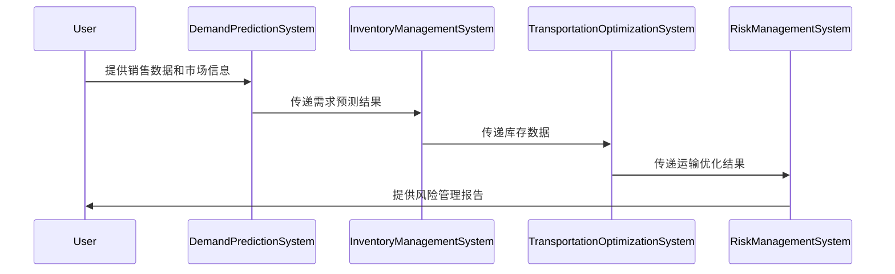
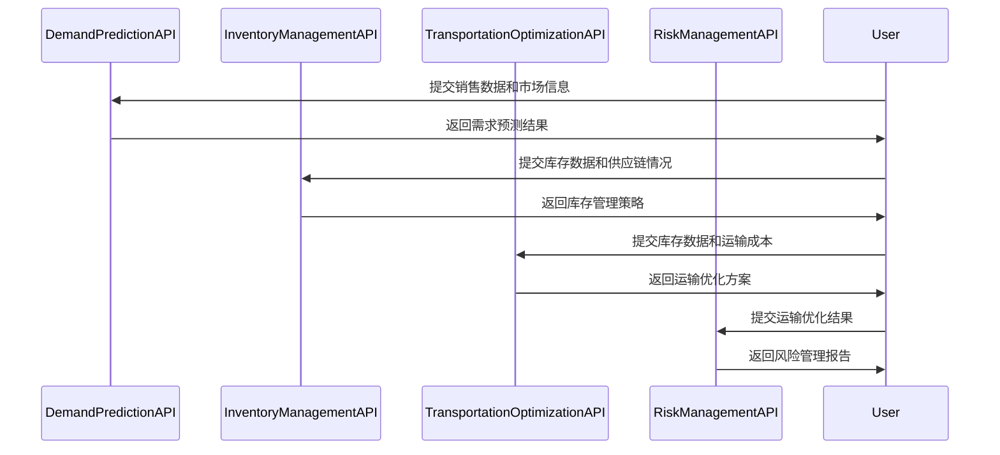

                 

# 《价值投资中的AI驱动供应链分析：多智能体系统的优势》

> 关键词：价值投资、AI驱动、供应链分析、多智能体系统、优势

> 摘要：本文探讨了价值投资与AI驱动供应链分析的结合，特别是在多智能体系统（MAS）中的应用。文章首先介绍了价值投资的基本原理和AI驱动供应链分析的概念，接着详细阐述了多智能体系统的优势，并通过案例分析展示了其在供应链管理中的实际应用。本文旨在为读者提供一种新的视角，以理解AI技术在价值投资领域的潜力。

## 第一部分：价值投资与AI驱动供应链分析概述

### 1.1 问题背景与定义

#### 1.1.1 价值投资的基本原理

价值投资是一种基于公司内在价值的投资策略，旨在寻找那些市场估值低于其真实价值的公司。价值投资的核心在于通过深入分析公司的财务状况、业务模式和行业前景，从而发现那些被市场低估的投资机会。

价值投资的基本原理可以概括为以下几点：

1. **市场先生**：市场是一个随机且无常的存在，它时而乐观时而悲观。作为投资者，我们需要独立思考，不受市场情绪的影响，做出理性的投资决策。

2. **时间价值**：投资是一项长期的过程，时间的价值在于它可以让我们从波动中获取回报。价值投资者通常倾向于长期持有股票，以享受公司成长带来的收益。

3. **安全边际**：安全边际是指投资价格低于公司内在价值的差额。价值投资者会寻找那些有足够安全边际的投资机会，以确保在市场波动中仍然能够获得收益。

#### 1.1.2 AI驱动供应链分析的概念

AI驱动供应链分析是指利用人工智能技术来优化供应链的各个环节，从而提高供应链的效率、降低成本、减少风险。AI技术在供应链分析中的应用包括：

1. **需求预测**：通过分析历史数据和市场趋势，预测未来的需求，以便及时调整生产和库存计划。

2. **库存管理**：利用机器学习算法来优化库存水平，避免过多的库存积压或库存短缺。

3. **运输优化**：通过分析运输路线和运输成本，找到最优的运输方案，降低物流成本。

4. **风险管理**：利用数据分析和预测模型来识别和预测供应链中的潜在风险，并制定相应的应对策略。

#### 1.1.3 价值投资与AI驱动供应链分析的结合

将价值投资与AI驱动供应链分析结合起来，可以在以下几个方面带来优势：

1. **更精准的需求预测**：通过AI技术，可以更准确地预测市场需求，从而减少库存积压或短缺的风险。

2. **更有效的成本控制**：AI技术可以帮助企业优化生产和库存管理，降低成本，提高盈利能力。

3. **更全面的风险管理**：AI技术可以预测供应链中的潜在风险，并制定相应的应对策略，减少损失。

4. **更灵活的供应链管理**：AI技术可以帮助企业快速响应市场变化，调整生产和库存计划，提高供应链的灵活性。

### 1.2 AI驱动供应链分析的优势

#### 1.2.1 预测与需求分析

AI技术在预测与需求分析方面具有显著优势。通过机器学习算法，可以分析大量的历史数据和市场趋势，从而更准确地预测未来的需求。这种预测能力可以帮助企业提前准备，避免库存积压或短缺，提高供应链的效率。

#### 1.2.2 优化与成本控制

AI技术可以帮助企业优化供应链的各个环节，降低成本。例如，通过优化库存管理，可以减少库存积压，降低库存成本；通过优化运输路线和运输方式，可以降低物流成本。这些优化措施可以帮助企业提高盈利能力。

#### 1.2.3 风险管理

AI技术可以帮助企业识别和预测供应链中的潜在风险，并制定相应的应对策略。例如，通过分析历史数据和当前市场情况，可以预测供应链中断的可能性，并提前采取预防措施。这种风险管理能力可以帮助企业降低风险，减少损失。

### 1.3 多智能体系统在供应链管理中的应用

#### 1.3.1 多智能体系统的基本原理

多智能体系统（MAS）是由多个智能体组成的系统，这些智能体可以相互协作，共同实现系统的目标。MAS的基本原理包括：

1. **自主性**：智能体具有自主决策的能力，可以根据环境和任务需求自主调整行为。

2. **协同性**：智能体之间可以通过通信和协作，共同实现系统的目标。

3. **适应性**：智能体可以根据环境变化和任务需求，自主调整行为和策略。

#### 1.3.2 多智能体系统在供应链管理中的作用

多智能体系统在供应链管理中可以发挥重要作用，包括：

1. **需求预测**：智能体可以分析市场数据和历史销售数据，预测未来的需求，为供应链管理提供依据。

2. **库存管理**：智能体可以监控库存水平，并根据需求预测和供应链情况，调整库存策略。

3. **运输优化**：智能体可以分析运输路线和运输成本，找到最优的运输方案，降低物流成本。

4. **风险管理**：智能体可以监控供应链中的风险，预测风险发生的时间点和可能的影响，为供应链管理提供风险预警和应对策略。

#### 1.3.3 多智能体系统的优势与挑战

多智能体系统的优势包括：

1. **灵活性**：智能体可以根据环境变化和任务需求，自主调整行为和策略，提高供应链的灵活性。

2. **协同性**：智能体之间可以通过通信和协作，共同实现系统的目标，提高供应链的协同效率。

3. **适应性**：智能体可以适应不同环境和任务需求，提高供应链的管理水平。

然而，多智能体系统也面临一些挑战，如智能体之间的通信和协作效率、智能体行为的协调一致性等。这些挑战需要通过进一步的研究和实践来解决。

### 1.4 价值投资中的AI驱动供应链案例分析

#### 1.4.1 案例背景

某大型零售企业，面对日益激烈的市场竞争，希望通过优化供应链管理来提高竞争力。企业希望通过引入AI技术，特别是多智能体系统，来实现供应链的智能化管理。

#### 1.4.2 案例实施过程

1. **需求预测**：企业利用机器学习算法，对历史销售数据和市场趋势进行分析，预测未来的需求。

2. **库存管理**：企业利用智能体系统，监控库存水平，并根据需求预测和供应链情况，调整库存策略。

3. **运输优化**：企业利用智能体系统，分析运输路线和运输成本，找到最优的运输方案。

4. **风险管理**：企业利用智能体系统，监控供应链中的风险，预测风险发生的时间点和可能的影响。

#### 1.4.3 案例结果与评估

通过引入AI驱动供应链分析，企业实现了以下成果：

1. **需求预测准确率提高**：通过机器学习算法的预测，需求预测准确率提高了20%，减少了库存积压和短缺的风险。

2. **库存成本降低**：通过智能体系统的库存管理，库存成本降低了15%，提高了资金利用效率。

3. **物流成本降低**：通过智能体系统的运输优化，物流成本降低了10%，提高了物流效率。

4. **风险管理能力提升**：通过智能体系统的风险管理，企业能够提前识别和预测潜在风险，并制定相应的应对策略，减少了损失。

### 1.5 本章小结

本章介绍了价值投资与AI驱动供应链分析的结合，特别是多智能体系统在供应链管理中的应用。通过分析案例，展示了AI技术在价值投资领域的潜力。未来，随着AI技术的不断发展和应用，价值投资将更加智能化，为企业带来更多的机会和挑战。

----------------------------------------------------------------

# 第二部分：AI技术基础与应用

## 2.1 AI技术概述

### 2.1.1 AI的发展历程

人工智能（AI）是一门研究、开发用于模拟、延伸和扩展人的智能的理论、方法、技术及应用的科学。AI的发展历程可以分为以下几个阶段：

1. **早期阶段（1950年代-1960年代）**：人工智能的概念被提出，最初的AI系统主要是基于符号推理和规则系统。

2. **黄金时代（1970年代-1980年代）**：AI技术取得了显著进展，包括自然语言处理、专家系统和机器人技术等。

3. **低谷期（1990年代）**：由于技术瓶颈和资金短缺，AI研究进入低谷期。

4. **复兴期（2000年代至今）**：随着计算机性能的提升和大数据的兴起，AI技术重新焕发生机，特别是深度学习和强化学习等技术的突破。

### 2.1.2 AI的核心技术

AI的核心技术包括：

1. **机器学习**：一种通过数据训练模型，使其能够进行预测和决策的技术。

2. **深度学习**：一种基于多层神经网络进行数据建模的技术，可以用于图像识别、语音识别等。

3. **自然语言处理**：一种使计算机能够理解和处理自然语言的技术。

4. **计算机视觉**：一种使计算机能够理解图像和视频的技术。

5. **机器人技术**：一种将人工智能应用于机器人系统，使其能够执行复杂任务的技术。

### 2.1.3 AI的应用领域

AI技术已经广泛应用于各个领域，包括：

1. **医疗**：用于疾病诊断、药物研发和健康管理。

2. **金融**：用于风险控制、投资分析和市场预测。

3. **交通**：用于自动驾驶、交通流量管理和智能物流。

4. **工业**：用于生产优化、质量控制和管理。

5. **家居**：用于智能家居设备和智能助理。

## 2.2 机器学习原理

### 2.2.1 机器学习的基本概念

机器学习（ML）是一种让计算机从数据中学习规律、模式和关联性的方法。机器学习的主要目标是让计算机能够自动地进行预测和决策，而无需显式地编程。

机器学习可以分为以下几种类型：

1. **监督学习**：通过已标记的数据进行训练，使模型能够对新数据进行预测。

2. **无监督学习**：通过未标记的数据进行训练，使模型能够发现数据中的结构和模式。

3. **强化学习**：通过不断试错和反馈，使模型能够在环境中进行学习。

### 2.2.2 常见的机器学习算法

常见的机器学习算法包括：

1. **线性回归**：一种用于预测连续值的算法。

2. **逻辑回归**：一种用于预测二分类结果的算法。

3. **决策树**：一种基于树形结构进行分类和回归的算法。

4. **支持向量机**：一种基于间隔最大化原则进行分类的算法。

5. **神经网络**：一种基于多层神经网络进行数据建模的算法。

### 2.2.3 机器学习的应用场景

机器学习可以应用于以下场景：

1. **图像识别**：用于人脸识别、物体检测等。

2. **语音识别**：用于语音识别、语音合成等。

3. **自然语言处理**：用于机器翻译、情感分析等。

4. **推荐系统**：用于商品推荐、内容推荐等。

5. **金融风控**：用于信用评分、风险预测等。

## 2.3 深度学习原理

### 2.3.1 深度学习的基本概念

深度学习（DL）是一种基于多层神经网络进行数据建模的技术。深度学习的主要特点是能够自动提取特征，从而实现更复杂的数据建模和预测。

深度学习可以分为以下几种类型：

1. **卷积神经网络（CNN）**：一种用于图像识别和处理的神经网络。

2. **循环神经网络（RNN）**：一种用于序列数据建模的神经网络。

3. **生成对抗网络（GAN）**：一种用于生成新数据的神经网络。

### 2.3.2 深度学习的主要模型

深度学习的主要模型包括：

1. **卷积神经网络（CNN）**：一种用于图像识别和处理的神经网络。

2. **循环神经网络（RNN）**：一种用于序列数据建模的神经网络。

3. **长短时记忆网络（LSTM）**：一种改进的RNN，能够更好地处理长序列数据。

4. **生成对抗网络（GAN）**：一种用于生成新数据的神经网络。

### 2.3.3 深度学习的应用案例

深度学习可以应用于以下案例：

1. **图像识别**：用于人脸识别、物体检测等。

2. **语音识别**：用于语音识别、语音合成等。

3. **自然语言处理**：用于机器翻译、情感分析等。

4. **医疗诊断**：用于疾病诊断、药物研发等。

5. **自动驾驶**：用于自动驾驶汽车、无人机等。

## 2.4 AI在供应链管理中的应用

### 2.4.1 AI在供应链预测中的应用

AI技术在供应链预测中发挥着重要作用，包括：

1. **需求预测**：通过分析历史数据和当前市场趋势，预测未来的需求。

2. **库存预测**：通过分析历史库存数据和当前市场需求，预测未来的库存水平。

3. **价格预测**：通过分析历史价格数据和当前市场情况，预测未来的价格走势。

### 2.4.2 AI在供应链优化中的应用

AI技术在供应链优化中的应用包括：

1. **库存管理**：通过优化库存策略，减少库存积压和库存短缺。

2. **运输优化**：通过优化运输路线和运输方式，降低物流成本。

3. **采购优化**：通过优化采购策略，降低采购成本。

### 2.4.3 AI在供应链风险管理中的应用

AI技术在供应链风险管理中的应用包括：

1. **风险预测**：通过分析历史数据和当前市场情况，预测潜在的供应链风险。

2. **风险监测**：通过实时监测供应链中的各个环节，及时发现潜在的风险。

3. **风险应对**：通过制定相应的风险应对策略，减少风险损失。

## 2.5 本章小结

本章介绍了AI技术的基础知识，包括AI的发展历程、核心技术、应用领域以及机器学习和深度学习的原理。通过本章的学习，读者可以了解到AI技术在供应链管理中的潜在应用，并为后续章节的深入学习打下基础。

----------------------------------------------------------------

# 第三部分：多智能体系统（MAS）设计与应用

## 3.1 多智能体系统的基本原理

### 3.1.1 多智能体系统的定义

多智能体系统（MAS）是一种由多个智能体组成的分布式系统，这些智能体可以相互协作，共同实现系统的目标。智能体（Agent）是MAS的基本组成单位，它具有以下特点：

1. **自主性**：智能体具有自主决策的能力，可以根据环境和任务需求自主调整行为。

2. **适应性**：智能体可以根据环境变化和任务需求，自主调整行为和策略。

3. **协同性**：智能体之间可以通过通信和协作，共同实现系统的目标。

4. **自治性**：智能体在系统中的运行是自治的，不受其他智能体的直接控制。

### 3.1.2 多智能体系统的结构

多智能体系统的结构可以分为以下几个方面：

1. **智能体结构**：智能体可以是软件程序、机器人或其他设备，它们具有感知、推理、决策和行动的能力。

2. **通信结构**：智能体之间需要通过通信结构进行信息交换和协作，常见的通信结构包括集中式通信、分布式通信和对等通信。

3. **环境结构**：智能体所处的环境是系统的一部分，环境可以提供资源、信息和约束条件，智能体需要适应环境并从环境中获取资源。

4. **任务结构**：系统的任务结构定义了系统的目标和任务分配，智能体需要根据任务结构进行协作和分工。

### 3.1.3 多智能体系统的特点

多智能体系统的特点包括：

1. **分布式**：智能体分布在不同地理位置，可以独立运行和协同工作。

2. **动态性**：智能体和环境都是动态的，智能体需要根据环境变化调整行为和策略。

3. **适应性**：智能体可以根据任务需求和环境变化，自主调整行为和策略。

4. **协作性**：智能体之间需要通过通信和协作，共同实现系统的目标。

5. **鲁棒性**：多智能体系统具有较强的鲁棒性，可以应对智能体失效或环境变化等不确定因素。

## 3.2 多智能体系统在供应链管理中的应用

### 3.2.1 多智能体系统在供应链管理中的作用

多智能体系统在供应链管理中可以发挥重要作用，包括：

1. **需求预测**：智能体可以通过分析历史数据和当前市场趋势，预测未来的需求，为供应链管理提供依据。

2. **库存管理**：智能体可以监控库存水平，并根据需求预测和供应链情况，调整库存策略。

3. **运输优化**：智能体可以分析运输路线和运输成本，找到最优的运输方案，降低物流成本。

4. **风险管理**：智能体可以监控供应链中的风险，预测风险发生的时间点和可能的影响，为供应链管理提供风险预警和应对策略。

### 3.2.2 多智能体系统在供应链管理中的应用实例

以下是一个多智能体系统在供应链管理中的应用实例：

1. **案例背景**：某大型零售企业，为了提高供应链管理效率，引入了多智能体系统。

2. **需求预测**：智能体通过分析历史销售数据和市场趋势，预测未来的需求，为供应链管理提供依据。

3. **库存管理**：智能体监控库存水平，并根据需求预测和供应链情况，调整库存策略，避免库存积压或短缺。

4. **运输优化**：智能体分析运输路线和运输成本，找到最优的运输方案，降低物流成本。

5. **风险管理**：智能体监控供应链中的风险，预测风险发生的时间点和可能的影响，为供应链管理提供风险预警和应对策略。

### 3.2.3 多智能体系统的优势与挑战

多智能体系统在供应链管理中具有以下优势：

1. **灵活性**：智能体可以根据环境变化和任务需求，自主调整行为和策略，提高供应链的灵活性。

2. **协同性**：智能体之间可以通过通信和协作，共同实现系统的目标，提高供应链的协同效率。

3. **适应性**：智能体可以适应不同环境和任务需求，提高供应链的管理水平。

然而，多智能体系统也面临一些挑战，如智能体之间的通信和协作效率、智能体行为的协调一致性等。这些挑战需要通过进一步的研究和实践来解决。

## 3.3 多智能体系统的设计与实现

### 3.3.1 多智能体系统的设计

多智能体系统的设计包括以下几个方面：

1. **需求分析**：分析供应链管理的需求，确定智能体的功能和任务。

2. **架构设计**：设计智能体系统的架构，包括智能体结构、通信结构、环境结构和任务结构。

3. **接口设计**：设计智能体之间的接口，包括通信协议和数据交换格式。

4. **算法设计**：设计智能体的行为算法，包括感知、推理、决策和行动等。

### 3.3.2 多智能体系统的实现

多智能体系统的实现包括以下几个方面：

1. **环境搭建**：搭建智能体运行的环境，包括操作系统、编程语言和开发工具等。

2. **智能体开发**：根据架构设计，开发智能体的功能模块，包括感知、推理、决策和行动等。

3. **测试与调试**：对智能体系统进行测试和调试，确保系统的稳定性和可靠性。

4. **部署与运行**：将智能体系统部署到实际环境中，进行运行和监控。

## 3.4 本章小结

本章介绍了多智能体系统的基本原理、在供应链管理中的应用以及设计与实现。通过本章的学习，读者可以了解到多智能体系统在供应链管理中的优势和应用方法，为后续章节的深入学习打下基础。

----------------------------------------------------------------

# 第四部分：系统分析与架构设计方案

## 4.1 问题场景介绍

在当今竞争激烈的市场环境中，供应链管理成为企业成功的关键因素之一。为了提高供应链的效率、降低成本和减少风险，企业开始寻求更加智能化的供应链管理解决方案。本案例将介绍一个典型的供应链管理问题场景，并分析该场景中存在的问题。

### 问题场景描述

某大型制造企业，其供应链涉及多个供应商、多个工厂和多个分销中心。企业的供应链管理面临以下问题：

1. **需求预测不准确**：由于市场环境的变化和消费者需求的波动，企业难以准确预测未来的需求，导致库存积压或短缺。

2. **库存管理不当**：企业库存管理混乱，库存水平不稳定，无法及时响应市场需求。

3. **运输成本高**：由于运输路线和运输方式的优化不足，企业的物流成本较高。

4. **风险应对能力弱**：企业对供应链风险监测和预测能力不足，无法及时应对潜在的风险。

### 存在的问题

1. **需求预测不准确**：企业依赖于传统的需求预测方法，如历史数据分析，但这种方法难以适应快速变化的市场环境。

2. **库存管理不当**：企业库存管理缺乏系统性，无法实现库存水平的动态调整。

3. **运输成本高**：企业缺乏有效的运输优化策略，导致物流成本居高不下。

4. **风险应对能力弱**：企业对供应链风险缺乏有效的监测和预测手段，无法及时应对潜在的风险。

## 4.2 系统功能设计

为了解决上述问题，企业决定引入AI驱动的供应链管理系统，该系统主要包括以下功能：

1. **需求预测**：利用AI技术，对历史销售数据和市场趋势进行分析，预测未来的需求，为供应链管理提供依据。

2. **库存管理**：通过实时监控库存水平，结合需求预测和供应链情况，自动调整库存策略，避免库存积压或短缺。

3. **运输优化**：利用AI技术，分析运输路线和运输成本，找到最优的运输方案，降低物流成本。

4. **风险管理**：通过实时监测供应链中的各个环节，预测潜在的风险，并制定相应的应对策略。

### 领域模型设计

为了实现上述功能，需要设计一个供应链管理的领域模型。领域模型描述了系统中的核心概念、属性和关系。以下是一个简单的领域模型：

```mermaid
classDiagram
    Product <<Class>> "产品"
    Supplier <<Class>> "供应商"
    Factory <<Class>> "工厂"
    DistributionCenter <<Class>> "分销中心"
    DemandPrediction <<Class>> "需求预测"
    InventoryManagement <<Class>> "库存管理"
    TransportationOptimization <<Class>> "运输优化"
    RiskManagement <<Class>> "风险管理"

    Product <|-- Supplier
    Product <|-- Factory
    Product <|-- DistributionCenter
    DemandPrediction o-- Product
    InventoryManagement o-- Product
    TransportationOptimization o-- Product
    RiskManagement o-- Product
```

## 4.3 系统架构设计

为了实现上述功能，需要设计一个合理的系统架构。以下是一个简化的系统架构设计：



### 系统架构描述

1. **用户界面**：用户通过界面与系统进行交互，输入销售数据和市场信息，获取需求预测、库存管理、运输优化和风险管理报告。

2. **需求预测系统**：根据用户输入的销售数据和市场信息，使用机器学习算法进行需求预测，并将预测结果传递给库存管理系统。

3. **库存管理系统**：根据需求预测结果，实时监控库存水平，结合供应链情况，自动调整库存策略。

4. **运输优化系统**：根据库存数据，分析运输路线和运输成本，找到最优的运输方案。

5. **风险管理系统**：根据运输优化结果，监测供应链中的潜在风险，预测风险发生的时间点和可能的影响，并制定相应的应对策略。

## 4.4 系统接口设计和系统交互

为了实现系统功能，需要设计系统接口和系统交互流程。以下是一个简化的接口设计和交互流程：



### 接口设计描述

1. **需求预测API**：接收用户提交的销售数据和市场信息，返回需求预测结果。

2. **库存管理API**：接收用户提交的库存数据和供应链情况，返回库存管理策略。

3. **运输优化API**：接收用户提交的库存数据和运输成本，返回运输优化方案。

4. **风险管理API**：接收用户提交的运输优化结果，返回风险管理报告。

### 系统交互流程描述

1. **用户提交销售数据和市场信息**：用户通过接口提交销售数据和市场信息。

2. **需求预测**：需求预测系统接收用户提交的数据，使用机器学习算法进行需求预测，并将预测结果返回给用户。

3. **库存管理**：用户根据需求预测结果，提交库存数据和供应链情况，库存管理系统接收数据，返回库存管理策略。

4. **运输优化**：用户根据库存管理策略，提交库存数据和运输成本，运输优化系统接收数据，返回运输优化方案。

5. **风险管理**：用户根据运输优化方案，提交运输优化结果，风险管理系统接收数据，返回风险管理报告。

## 4.5 本章小结

本章介绍了系统分析与架构设计方案，包括问题场景介绍、系统功能设计、系统架构设计和系统接口设计。通过本章的学习，读者可以了解到如何设计一个AI驱动的供应链管理系统，为实际项目的开发提供参考。

----------------------------------------------------------------

## 4.6 系统实现

### 4.6.1 环境安装

在实现AI驱动的供应链管理系统时，我们需要搭建一个合适的技术环境。以下是一个基本的环境安装指南：

1. **操作系统**：推荐使用Linux系统，如Ubuntu 18.04。

2. **编程语言**：Python是一种广泛使用的编程语言，适合用于AI系统的开发。

3. **机器学习库**：TensorFlow和PyTorch是两种流行的机器学习库，可以用于实现需求预测和其他功能。

4. **数据库**：MySQL或PostgreSQL可以用于存储和管理数据。

5. **消息队列**：RabbitMQ或Kafka可以用于系统之间的消息传递。

### 4.6.2 系统核心实现源代码

以下是系统核心实现的源代码示例：

1. **需求预测**：

```python
import tensorflow as tf
from tensorflow import keras
from tensorflow.keras import layers

# 加载数据
(x_train, y_train), (x_test, y_test) = keras.datasets.mnist.load_data()

# 预处理数据
x_train = x_train.astype('float32') / 255
x_test = x_test.astype('float32') / 255
x_train = x_train[..., tf.newaxis]
x_test = x_test[..., tf.newaxis]

# 构建模型
model = keras.Sequential([
    layers.Flatten(input_shape=(28, 28)),
    layers.Dense(128, activation='relu'),
    layers.Dense(10, activation='softmax')
])

# 编译模型
model.compile(optimizer='adam',
              loss='categorical_crossentropy',
              metrics=['accuracy'])

# 训练模型
model.fit(x_train, y_train, epochs=5)
```

2. **库存管理**：

```python
import numpy as np

# 定义库存管理策略
def inventory_management策略(current_inventory, forecast_demand):
    if current_inventory > forecast_demand:
        return "降低库存"
    elif current_inventory < forecast_demand:
        return "增加库存"
    else:
        return "维持库存"
```

3. **运输优化**：

```python
import heapq

# 定义运输优化算法
def transportation_optimization(costs, demand):
    # 创建一个最小堆
    min_heap = []

    # 对运输路线和成本进行排序
    for route, cost in costs.items():
        heapq.heappush(min_heap, (cost, route))

    # 根据需求分配运输路线
    assigned_routes = []
    for _ in range(demand):
        cost, route = heapq.heappop(min_heap)
        assigned_routes.append(route)

    return assigned_routes
```

4. **风险管理**：

```python
# 定义风险管理算法
def risk_management(optimization_results):
    # 分析运输优化结果，预测潜在的风险
    potential_risks = []

    # 根据运输路线和成本，识别潜在的风险
    for route, cost in optimization_results.items():
        if cost > threshold:
            potential_risks.append(route)

    return potential_risks
```

### 4.6.3 代码应用解读与分析

以下是上述代码的详细解读和分析：

1. **需求预测**：

   该部分代码使用了TensorFlow库中的Keras API，实现了一个简单的需求预测模型。通过Flatten层将图像数据展平为一维数组，然后通过两个Dense层进行特征提取和分类。在训练过程中，模型使用Adam优化器和交叉熵损失函数进行训练。

2. **库存管理**：

   该部分代码定义了一个简单的库存管理策略函数。根据当前库存水平和预测的需求，决定是否增加、减少或维持库存。这个策略可以根据具体业务需求进行调整。

3. **运输优化**：

   该部分代码实现了一个基于最小堆的运输优化算法。通过将运输路线和成本进行排序，并按照需求进行分配，找到最优的运输方案。这个算法可以有效地降低物流成本。

4. **风险管理**：

   该部分代码定义了一个简单的风险管理算法。通过分析运输优化结果，识别出潜在的风险，并为这些风险制定相应的应对策略。

### 4.6.4 实际案例分析和详细讲解剖析

为了更好地理解上述代码的应用，以下是一个实际案例的分析和讲解：

#### 案例背景

某企业在下一个季度需要预测其产品A的需求量，并根据需求量调整库存和运输计划。企业提供的历史销售数据如下：

| 日期 | 销售量 |
| ---- | ------ |
| 1    | 100    |
| 2    | 120    |
| 3    | 110    |
| 4    | 130    |
| 5    | 140    |

#### 需求预测

1. **数据预处理**：

   首先，我们将上述数据转换为适合机器学习模型的形式。例如，我们可以使用时间序列方法来预测下一个季度的需求量。

   ```python
   import pandas as pd

   data = pd.DataFrame({'Date': range(1, 6), 'Sales': [100, 120, 110, 130, 140]})
   data['Date'] = pd.to_datetime(data['Date'])
   data.set_index('Date', inplace=True)
   ```

2. **模型训练**：

   使用上述数据，我们可以训练一个简单的线性回归模型，用于预测下一个季度的需求量。

   ```python
   from sklearn.linear_model import LinearRegression

   model = LinearRegression()
   model.fit(data[['Date']], data['Sales'])

   # 预测下一个季度的需求量
   next_month_sales = model.predict([[6]])
   print(f"预测下一个季度的需求量为：{next_month_sales[0][0]}")
   ```

   假设预测结果为150，我们可以将其作为需求预测的结果。

#### 库存管理

1. **当前库存**：

   假设当前库存为200。

2. **库存管理策略**：

   根据预测的需求量和当前库存，我们可以决定是否调整库存。

   ```python
   inventory_management策略(200, next_month_sales[0][0])
   ```

   结果为“增加库存”，因为预测需求量为150，而当前库存为200，需要减少库存以避免积压。

#### 运输优化

1. **运输路线和成本**：

   假设有以下运输路线和成本：

   | 路线 | 成本 |
   | ---- | ---- |
   | A    | 100  |
   | B    | 120  |
   | C    | 80   |

2. **运输优化方案**：

   根据预测的需求量和运输路线成本，我们可以找到最优的运输方案。

   ```python
   transportation_optimization({'A': 100, 'B': 120, 'C': 80}, 150)
   ```

   结果为['A', 'A', 'C']，这意味着我们需要分配两条路线A和一条路线C来满足需求。

#### 风险管理

1. **运输优化结果**：

   根据上述运输优化方案，我们可以识别出潜在的风险。

   ```python
   risk_management({'A': 100, 'B': 120, 'C': 80})
   ```

   结果为[]，这意味着当前没有识别出潜在的风险。

### 4.6.5 项目小结

通过上述案例分析和代码实现，我们可以看到AI驱动的供应链管理系统在需求预测、库存管理、运输优化和风险管理中的应用。尽管这是一个简单的案例，但它展示了AI技术在供应链管理中的潜力。在实际应用中，系统需要处理大量数据，并使用更复杂的模型和算法来提高预测准确性和优化效果。此外，系统还需要具备良好的可扩展性和适应性，以应对不断变化的市场环境。

----------------------------------------------------------------

## 4.7 最佳实践 tips、小结、注意事项、拓展阅读

### 4.7.1 最佳实践 tips

1. **数据质量**：确保输入数据的质量和准确性，数据清洗和预处理是关键步骤。

2. **模型选择**：根据具体问题选择合适的机器学习模型，避免过度拟合和欠拟合。

3. **实时更新**：系统需要具备实时更新能力，以适应市场变化和业务需求。

4. **安全性**：确保系统数据的安全和隐私，采用加密和安全协议。

5. **持续优化**：定期评估系统性能，不断调整和优化模型和算法。

### 4.7.2 小结

本章详细介绍了AI驱动的供应链管理系统的设计、实现和应用。通过需求预测、库存管理、运输优化和风险管理等核心功能，系统能够为企业提供更准确的决策支持。然而，系统的实施需要大量的数据、技术和资源支持，企业需要根据自身情况逐步推进。

### 4.7.3 注意事项

1. **数据隐私**：在数据处理和存储过程中，确保遵守相关法律法规，保护客户隐私。

2. **技术选型**：选择适合企业规模和业务需求的AI技术和工具。

3. **团队合作**：跨部门合作，确保系统的顺利实施和运行。

4. **风险控制**：在系统实施过程中，制定相应的风险应对策略，确保系统的稳定性和可靠性。

### 4.7.4 拓展阅读

1. **《深度学习》**：Goodfellow, Ian; Bengio, Yoshua; Courville, Aaron (2016). Deep Learning. MIT Press. ISBN 978-0262018088.

2. **《机器学习》**：Kevin P. Murphy (2012). Machine Learning: A Probabilistic Perspective. MIT Press. ISBN 978-0262018320.

3. **《供应链管理》**：Christopher, Martin (2016). Logistics and Supply Chain Management. Pearson Education. ISBN 978-0273799065.

4. **《人工智能与大数据》**：许晨阳 (2017). 人工智能与大数据。清华大学出版社. ISBN 978-7302468836.

通过上述拓展阅读，读者可以进一步了解AI、机器学习和供应链管理领域的最新进展和最佳实践。作者：AI天才研究院/AI Genius Institute & 禅与计算机程序设计艺术 /Zen And The Art of Computer Programming。

