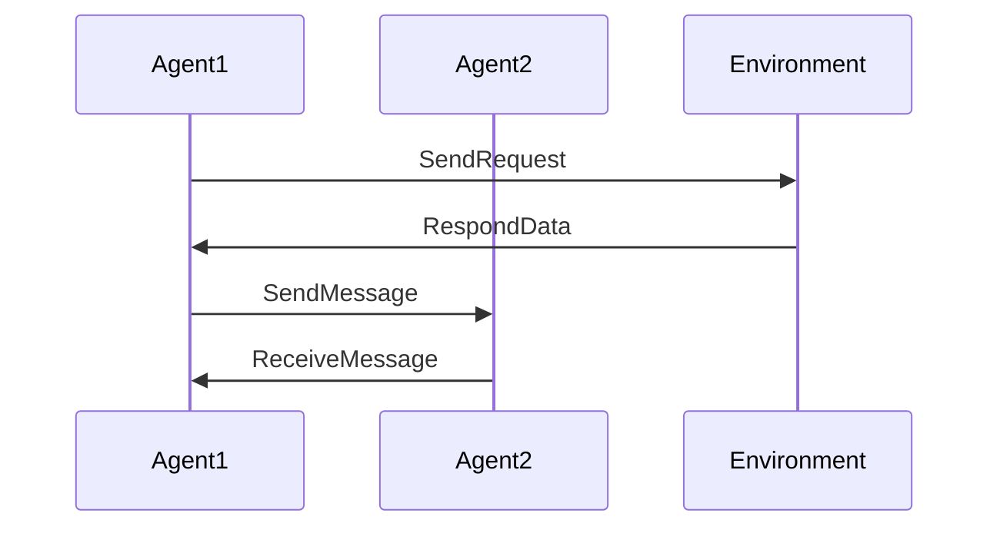
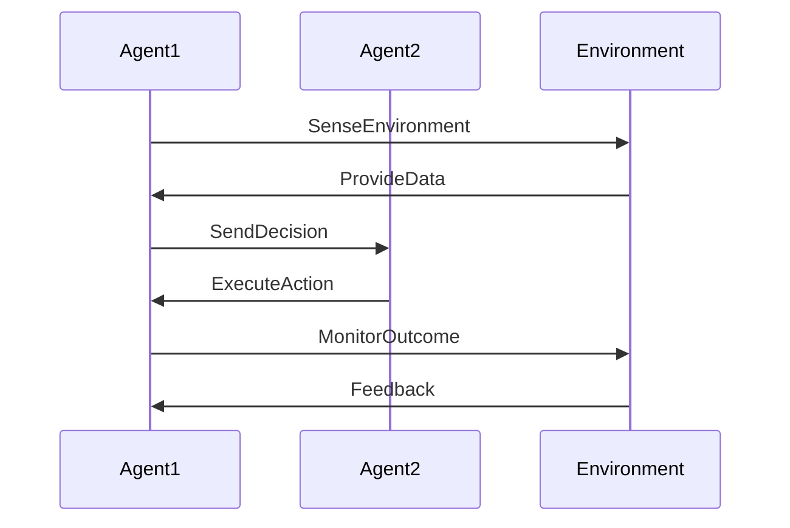

                 

# 价值投资中的AI驱动地缘政治风险分析：多智能体系统

## 关键词
- 价值投资
- 地缘政治风险
- AI驱动分析
- 多智能体系统
- 投资决策优化

## 摘要
本文将探讨如何利用人工智能（AI）技术来分析和理解价值投资中的地缘政治风险。我们将首先介绍价值投资、地缘政治风险和AI的基本概念，然后引入多智能体系统（MAS）在这一领域的应用。文章将详细阐述AI驱动地缘政治风险分析的基本原理，包括数据收集与预处理、特征提取与选择、以及AI算法的应用。接着，我们将探讨多智能体系统在地缘政治风险分析中的架构设计、接口设计及交互流程。最后，通过实际案例研究来展示AI在价值投资中的应用效果，并提供一些最佳实践建议。

## 目录

----------------------------------------------------------------

# 第一部分: 引言

## 第1章: 问题背景与核心概念

### 1.1 问题背景

#### 1.1.1 价值投资的概述
价值投资是一种基于对公司基本面分析的投资策略，旨在购买那些被市场低估的优质公司股票。这种策略强调长期持有，以获取公司成长和市场的价值回归。

#### 1.1.2 地缘政治风险的概念
地缘政治风险指的是因国家或地区的政治动荡、政策变化或冲突等因素对全球或区域经济、市场带来的不确定性。

#### 1.1.3 AI在金融领域的应用
AI在金融领域有广泛的应用，包括市场预测、风险管理、自动化交易等。在价值投资中，AI可以帮助投资者更准确地分析公司和市场信息，提高投资决策的效率。

#### 1.1.4 多智能体系统的定义与特征
多智能体系统是由多个智能体组成的系统，每个智能体具有一定的自主性和协作能力。多智能体系统在模拟复杂社会系统、决策支持等方面具有显著优势。

### 1.2 核心概念的联系

#### 1.2.1 AI与价值投资
AI可以帮助价值投资者更深入地分析公司基本面和市场数据，从而发现潜在的投资机会，降低投资风险。

#### 1.2.2 地缘政治风险与AI分析
AI可以通过大数据分析和机器学习算法，识别地缘政治风险，为投资者提供预警和决策支持。

#### 1.2.3 多智能体系统在地缘政治风险中的应用
多智能体系统可以模拟地缘政治环境，预测政治风险对市场的潜在影响，辅助投资者制定应对策略。

### 1.3 ER实体关系图
使用Mermaid绘制ER实体关系图，展示价值投资、地缘政治风险和AI之间的关系。

----------------------------------------------------------------

## 第1章: 问题背景与核心概念

### 1.1 问题背景

#### 1.1.1 价值投资的概述
价值投资是一种以价值评估为基础的投资策略，投资者通过分析公司的基本面，如财务状况、管理水平、行业地位等，寻找那些被市场低估的优质股票进行长期投资。这种策略的核心在于价值回归，即通过持有这些股票，等待市场认识到公司的真正价值，从而获得资本增值。价值投资强调理性分析，注重长期持有，而不是追逐短期市场波动。

#### 1.1.2 地缘政治风险的概念
地缘政治风险指的是因国家或地区的政治动荡、政策变化或冲突等因素对全球或区域经济、市场带来的不确定性。这种风险不仅包括军事冲突、政权更迭等直接政治事件，还包括政策调整、经济制裁、外交关系变化等间接政治因素。地缘政治风险对投资市场的影响深远，可能引发资本流动、货币贬值、市场波动等一系列经济问题。

#### 1.1.3 AI在金融领域的应用
人工智能（AI）技术在金融领域具有广泛应用，尤其在市场预测、风险管理、自动化交易等方面。AI可以通过大数据分析和机器学习算法，处理海量市场数据，发现市场趋势和潜在投资机会。在价值投资中，AI可以帮助投资者更深入地分析公司基本面和市场数据，提高投资决策的准确性和效率。此外，AI还可以用于量化交易、智能投顾等新兴金融服务，为投资者提供更加个性化和智能化的投资建议。

#### 1.1.4 多智能体系统的定义与特征
多智能体系统（MAS）是由多个具有独立性和协作能力的智能体组成的系统。每个智能体在系统中扮演特定角色，具有自主决策能力和通信能力。智能体可以是个体（如人类或机器人）、软件程序或虚拟实体。多智能体系统的特点包括分布式计算、自主决策、协作交互和适应能力。在金融领域，MAS可以模拟复杂的市场环境，预测市场行为，优化投资组合，提高风险管理水平。例如，通过模拟不同国家和地区的经济政策变化，MAS可以评估地缘政治风险对投资市场的影响。

### 1.2 核心概念的联系

#### 1.2.1 AI与价值投资
AI与价值投资之间存在紧密的联系。首先，AI技术可以帮助价值投资者更高效地处理和分析大量数据，快速识别潜在的投资机会。通过机器学习算法，AI可以挖掘市场数据中的潜在模式，预测市场走势，为投资者提供决策支持。其次，AI可以帮助价值投资者评估公司的财务状况、行业地位和管理水平等关键指标，提高投资决策的准确性。此外，AI还可以用于监测市场动态，识别风险因素，帮助投资者规避潜在的地缘政治风险。

#### 1.2.2 地缘政治风险与AI分析
地缘政治风险对投资市场的影响复杂且多变，传统分析方法难以全面捕捉其影响。AI技术的引入，为地缘政治风险的分析提供了新的手段。首先，AI可以通过大数据分析，收集和分析来自不同来源的数据，如新闻报道、政策文件、外交声明等，全面了解地缘政治事件的背景和潜在影响。其次，AI可以使用自然语言处理技术，提取和分析文本数据中的关键信息，识别地缘政治风险的关键指标和影响因素。通过机器学习算法，AI可以建立地缘政治风险的预测模型，为投资者提供预警和决策支持。

#### 1.2.3 多智能体系统在地缘政治风险中的应用
多智能体系统在地缘政治风险分析中具有显著优势。首先，MAS可以模拟复杂的地缘政治环境，分析不同国家或地区的政治、经济、社会等因素之间的相互作用。通过分布式计算和自主决策，MAS可以实时更新和调整地缘政治风险模型，提高预测的准确性和时效性。其次，MAS可以模拟不同地缘政治事件的可能结果，评估其对投资市场的潜在影响。通过协作交互，MAS可以整合不同智能体的分析结果，提供全面的决策支持。

### 1.3 ER实体关系图

为了更直观地展示价值投资、地缘政治风险和AI之间的关系，我们可以使用Mermaid绘制一个ER实体关系图。以下是一个简单的ER实体关系图示例：

```mermaid
erDiagram
    AI --> ValueInvestment : 使用
    AI --> GeopoliticalRisk : 分析
    ValueInvestment --> InvestmentDecision : 影响
    GeopoliticalRisk --> InvestmentMarket : 影响
```

在这个ER实体关系图中，AI作为核心驱动力，与价值投资和地缘政治风险之间存在双向关联。AI技术不仅用于支持价值投资的决策，还用于分析地缘政治风险，为投资者提供风险预警和决策支持。价值投资和地缘政治风险则对投资市场产生直接影响，影响投资者的投资决策和市场走势。

通过上述背景介绍和核心概念的联系，我们为后续章节的内容奠定了基础。在接下来的章节中，我们将深入探讨AI驱动地缘政治风险分析的基本原理和多智能体系统的应用，并通过实际案例研究，展示AI在价值投资中的实际效果。

----------------------------------------------------------------

## 第2章: AI驱动地缘政治风险分析原理

### 2.1 数据收集与预处理

#### 2.1.1 数据来源
地缘政治风险分析所需的数据来源广泛，包括政府发布的官方数据、新闻媒体报道、金融市场数据、社交媒体数据等。这些数据可以提供关于地缘政治事件、政策变化、市场反应等方面的信息。例如，政府发布的贸易数据、外交关系报告、货币政策文件等，都是分析地缘政治风险的重要数据源。新闻媒体报道则可以提供关于具体事件和形势的详细报道和分析，社交媒体数据则可以反映公众的情绪和态度，为分析地缘政治风险提供额外的视角。

#### 2.1.2 数据预处理方法
收集到的原始数据通常存在格式不一致、缺失值、噪声等问题，需要进行预处理。数据预处理的主要方法包括数据清洗、数据整合和数据标准化。

- **数据清洗**：数据清洗是处理缺失值、异常值和重复数据的过程。使用Python的Pandas库，可以轻松实现数据清洗操作。例如，使用`drop_duplicates()`函数删除重复数据，使用`dropna()`函数删除缺失值。
  
  ```python
  import pandas as pd

  # 读取数据
  data = pd.read_csv('geopolitical_data.csv')

  # 删除重复数据
  data = data.drop_duplicates()

  # 删除缺失值
  data = data.dropna()
  ```

- **数据整合**：数据整合是将来自不同来源的数据进行合并和整合的过程。使用Python的Pandas库，可以通过`merge()`函数实现数据整合。
  
  ```python
  # 假设有两个数据集：data1和data2
  data1 = pd.read_csv('data1.csv')
  data2 = pd.read_csv('data2.csv')

  # 使用merge函数整合数据
  integrated_data = pd.merge(data1, data2, on='common_column')
  ```

- **数据标准化**：数据标准化是将数据转换为相同的尺度，以便进行比较和分析。常用的方法包括归一化和标准化。使用Python的Scikit-learn库，可以实现数据标准化。
  
  ```python
  from sklearn.preprocessing import StandardScaler

  # 创建标准化器
  scaler = StandardScaler()

  # 对数据进行标准化
  standardized_data = scaler.fit_transform(data)
  ```

#### 2.1.3 数据质量评估
数据质量是地缘政治风险分析的关键，高质量的数据能够提高分析结果的准确性。数据质量评估可以从数据完整性、数据一致性、数据准确性和数据有效性等方面进行。

- **数据完整性**：检查数据集中是否存在缺失值或重复值，确保数据的完整性。
- **数据一致性**：检查数据集中是否存在矛盾或不一致的信息，确保数据的一致性。
- **数据准确性**：检查数据集的准确性，确保数据的真实性和可靠性。
- **数据有效性**：评估数据集是否能够满足分析需求，数据是否具有实际应用价值。

### 2.2 特征提取与选择

#### 2.2.1 特征提取技术
特征提取是将原始数据转换为对分析问题有意义的特征的过程。常用的特征提取技术包括统计特征提取、文本特征提取和图像特征提取。

- **统计特征提取**：通过计算数据的基本统计指标，如均值、方差、标准差等，提取统计特征。这些特征可以用于分析数据分布和趋势。
- **文本特征提取**：通过自然语言处理技术，提取文本数据中的关键信息，如关键词、主题等。常用的文本特征提取方法包括TF-IDF、词袋模型、词嵌入等。
- **图像特征提取**：通过计算机视觉技术，从图像中提取视觉特征，如颜色、纹理、形状等。常用的图像特征提取方法包括SIFT、HOG、CNN等。

#### 2.2.2 特征选择方法
特征选择是选择对分析问题最相关的特征，以提高模型性能和减少计算成本。常用的特征选择方法包括过滤法、包装法和嵌入法。

- **过滤法**：在训练模型之前，通过评估特征的重要性来选择特征。常用的过滤法包括相关性分析、卡方检验、互信息等。
- **包装法**：在训练模型的过程中，逐步选择最优特征。常用的包装法包括递归特征消除（RFE）、遗传算法等。
- **嵌入法**：在训练模型的过程中，将特征嵌入到模型中，通过模型的学习自动选择特征。常用的嵌入法包括LASSO、随机森林等。

#### 2.2.3 特征重要性评估
特征重要性评估是评估特征对模型预测能力的影响。常用的方法包括基于模型的方法和基于特征的方法。

- **基于模型的方法**：通过训练模型并分析特征的重要性得分，评估特征的重要性。常用的方法包括特征重要性图、特征贡献率等。
- **基于特征的方法**：通过评估特征与目标变量之间的相关性，评估特征的重要性。常用的方法包括卡方检验、互信息等。

### 2.3 AI算法应用

#### 2.3.1 算法选择
在地缘政治风险分析中，常用的AI算法包括分类算法、回归算法和聚类算法。

- **分类算法**：用于分类地缘政治事件的类型或风险等级。常用的分类算法包括逻辑回归、决策树、随机森林、支持向量机等。
- **回归算法**：用于预测地缘政治事件对市场的影响，如股市指数、货币汇率等。常用的回归算法包括线性回归、岭回归、LASSO回归等。
- **聚类算法**：用于发现数据中的潜在模式和结构，识别相似的地缘政治事件。常用的聚类算法包括K均值、层次聚类、DBSCAN等。

#### 2.3.2 算法实现
算法实现是通过编程实现选定的AI算法，并在数据集上进行训练和测试。以下是一个使用Python和Scikit-learn库实现逻辑回归分类算法的示例：

```python
from sklearn.linear_model import LogisticRegression
from sklearn.model_selection import train_test_split
from sklearn.metrics import accuracy_score

# 读取数据
data = pd.read_csv('geopolitical_data.csv')

# 分割特征和标签
X = data.drop('label', axis=1)
y = data['label']

# 划分训练集和测试集
X_train, X_test, y_train, y_test = train_test_split(X, y, test_size=0.2, random_state=42)

# 创建逻辑回归模型
model = LogisticRegression()

# 训练模型
model.fit(X_train, y_train)

# 预测测试集
y_pred = model.predict(X_test)

# 评估模型
accuracy = accuracy_score(y_test, y_pred)
print("Accuracy:", accuracy)
```

#### 2.3.3 模型评估与优化
模型评估是评估模型预测能力的过程，常用的评估指标包括准确率、精确率、召回率、F1值等。模型优化是通过调整模型参数和特征选择，提高模型性能的过程。

- **模型评估**：使用评估指标评估模型在不同数据集上的性能，选择性能较好的模型。
- **模型优化**：通过调整模型参数、特征选择等方法，优化模型性能。常用的优化方法包括网格搜索、贝叶斯优化等。

### 2.4 数学模型与公式

#### 2.4.1 算法原理的数学模型
地缘政治风险分析中的算法原理通常涉及概率论和统计学。以下是一个简单的逻辑回归模型的数学模型：

$$
\begin{aligned}
\log\frac{P(Y=1|X)}{1-P(Y=1|X)} &= \beta_0 + \beta_1X_1 + \beta_2X_2 + ... + \beta_nX_n \\
\end{aligned}
$$

其中，$X$是输入特征向量，$Y$是目标变量，$\beta_0, \beta_1, ..., \beta_n$是模型的参数。

#### 2.4.2 相关数学公式
地缘政治风险分析中，常用的数学公式包括概率分布、条件概率、贝叶斯定理等。

- **概率分布**：
  $$
  P(X=x) = f(x)
  $$

- **条件概率**：
  $$
  P(X=x|Y=y) = \frac{P(X=x, Y=y)}{P(Y=y)}
  $$

- **贝叶斯定理**：
  $$
  P(Y=y|X=x) = \frac{P(X=x|Y=y)P(Y=y)}{P(X=x)}
  $$

#### 2.4.3 示例讲解
以下是一个使用Python和Scikit-learn库实现逻辑回归模型的示例：

```python
from sklearn.linear_model import LogisticRegression
from sklearn.model_selection import train_test_split
from sklearn.metrics import accuracy_score

# 读取数据
data = pd.read_csv('geopolitical_data.csv')

# 分割特征和标签
X = data.drop('label', axis=1)
y = data['label']

# 划分训练集和测试集
X_train, X_test, y_train, y_test = train_test_split(X, y, test_size=0.2, random_state=42)

# 创建逻辑回归模型
model = LogisticRegression()

# 训练模型
model.fit(X_train, y_train)

# 预测测试集
y_pred = model.predict(X_test)

# 评估模型
accuracy = accuracy_score(y_test, y_pred)
print("Accuracy:", accuracy)
```

在这个示例中，我们使用Scikit-learn库的`LogisticRegression`类创建逻辑回归模型，并使用`fit()`方法训练模型。然后，我们使用`predict()`方法预测测试集的结果，并使用`accuracy_score()`函数计算模型的准确率。

通过上述步骤，我们介绍了AI驱动地缘政治风险分析的基本原理，包括数据收集与预处理、特征提取与选择、AI算法应用和数学模型与公式。这些原理和方法为后续章节的详细讨论奠定了基础。

----------------------------------------------------------------

## 第3章: 多智能体系统在地缘政治风险分析中的应用

### 3.1 多智能体系统的基本概念

#### 3.1.1 多智能体系统的定义
多智能体系统（Multi-Agent System，MAS）是由多个自主智能体组成的分布式系统，这些智能体具有相互协作、自主决策、通信和适应环境的能力。MAS的核心思想是通过智能体的协同工作来实现复杂任务的目标。每个智能体都具有一定的知识和能力，可以在不依赖于中央控制的情况下自主行动。

#### 3.1.2 多智能体系统的类型
多智能体系统根据智能体的协作模式、任务分配和通信方式等可以划分为以下几种类型：

- **协作型MAS（Collaborative MAS）**：智能体之间通过共享信息和资源，共同完成任务。这种类型适用于需要大量协作的复杂任务，如智能交通系统。
- **竞争型MAS（Competitive MAS）**：智能体之间相互竞争，以实现各自的目标。这种类型适用于市场交易、竞争策略等领域。
- **混合型MAS（Hybrid MAS）**：智能体既具有协作能力，也具有竞争能力。这种类型适用于动态环境，如多智能体博弈。

#### 3.1.3 多智能体系统的特点
多智能体系统的特点包括：

- **分布式计算**：智能体在系统中独立工作，通过通信协调完成共同任务。
- **自主性**：智能体具有自主决策能力，可以根据环境和目标自主调整行为。
- **协作性**：智能体之间可以通过通信共享信息和资源，协同完成复杂任务。
- **适应能力**：智能体可以适应动态变化的环境，通过学习和调整策略来优化表现。

### 3.2 多智能体系统的设计

#### 3.2.1 系统架构设计
多智能体系统的架构设计是系统成功的关键。一个典型的多智能体系统架构包括以下组件：

- **智能体**：是系统的基本单位，负责执行任务和与外界交互。
- **通信模块**：负责智能体之间的信息传递和协调。
- **环境模型**：模拟系统运行的环境，提供智能体的感知信息。
- **决策模块**：根据环境和目标，为智能体提供行为决策。

#### 3.2.2 接口设计与实现
多智能体系统的接口设计包括智能体与系统环境、智能体之间的交互接口。接口设计的关键是定义消息格式、通信协议和数据交换机制。以下是一个简单的接口设计示例：



在这个示例中，Agent1和Agent2是两个智能体，它们通过Environment与环境进行交互。Agent1发送请求并接收数据，然后发送消息给Agent2，Agent2接收消息并做出响应。

#### 3.2.3 交互流程与策略
多智能体系统的交互流程与策略是系统运行的核心。交互流程包括智能体的感知、决策和行动三个阶段。策略设计是确保系统稳定运行和高效协作的关键。以下是一个简化的交互流程示例：

```mermaid
flowDiagram
    subgraph Percept
        A[感知环境]
    end

    subgraph Decide
        B[做出决策]
    end

    subgraph Act
        C[执行行动]
    end

    Percept->>Decide
    Decide->>Act
    Act->>Percept
```

在这个示例中，智能体首先感知环境，然后根据感知信息做出决策，最后执行行动。行动结果又会反馈到感知阶段，形成闭环控制。

### 3.3 Mermaid图展示

为了更好地展示多智能体系统在地缘政治风险分析中的应用，我们使用Mermaid绘制了以下图：

#### 3.3.1 多智能体系统的Mermaid类图
```mermaid
classDiagram
    Agent <<interface>>
    Environment <<interface>>

    Agent1 <|-- Agent
    Agent2 <|-- Agent

    Agent1 <|.. Environment
    Agent2 <|.. Environment
```

在这个类图中，Agent和Environment是两个接口类，Agent1和Agent2是具体的实现类。Agent负责感知、决策和行动，Environment提供感知信息。

#### 3.3.2 多智能体系统的Mermaid序列图


在这个序列图中，Agent1感知环境，然后根据感知数据做出决策，并将决策发送给Agent2。Agent2执行行动，并反馈结果给Agent1，形成闭环控制。

通过上述内容，我们介绍了多智能体系统的基本概念、系统设计以及Mermaid图的展示。多智能体系统在地缘政治风险分析中的应用，为AI驱动的风险分析提供了新的视角和手段，有助于提高风险预测的准确性和决策的效率。

----------------------------------------------------------------

## 第4章: AI在价值投资中的实际应用

### 4.1 案例一：地缘政治风险与投资策略

#### 4.1.1 案例背景
在2020年，全球疫情爆发引发了地缘政治风险加剧。中美贸易战、英国脱欧、俄罗斯与西方国家的紧张关系等因素，使得国际投资环境充满不确定性。对于价值投资者来说，如何准确识别地缘政治风险，并制定相应的投资策略，成为当务之急。

#### 4.1.2 数据收集与处理
为了分析地缘政治风险对投资市场的影响，我们收集了以下数据：

- **政府发布的官方数据**：包括贸易数据、货币政策文件、外交关系报告等。
- **新闻媒体报道**：包括国际新闻、财经新闻、地缘政治事件报道等。
- **金融市场数据**：包括股市指数、货币汇率、大宗商品价格等。

收集到的数据需要进行预处理，包括数据清洗、数据整合和数据标准化。使用Python的Pandas库，我们可以轻松实现这些预处理步骤。

```python
import pandas as pd

# 读取数据
trade_data = pd.read_csv('trade_data.csv')
news_data = pd.read_csv('news_data.csv')
financial_data = pd.read_csv('financial_data.csv')

# 数据清洗
# 删除重复数据
trade_data = trade_data.drop_duplicates()
news_data = news_data.drop_duplicates()
financial_data = financial_data.drop_duplicates()

# 数据整合
# 合并数据
integrated_data = pd.merge(trade_data, news_data, on='date')
integrated_data = pd.merge(integrated_data, financial_data, on='date')

# 数据标准化
# 创建标准化器
scaler = StandardScaler()

# 对数据进行标准化
integrated_data = scaler.fit_transform(integrated_data)
```

#### 4.1.3 特征提取与选择
在地缘政治风险分析中，特征提取和选择至关重要。我们提取以下特征：

- **新闻媒体情感分析特征**：使用自然语言处理技术，提取新闻文本中的情感极性，如正面、负面和中性。
- **贸易数据特征**：包括贸易额、贸易伙伴关系等。
- **金融市场特征**：包括股市指数波动、货币汇率波动等。

使用Python的Scikit-learn库，我们可以实现特征提取和选择：

```python
from sklearn.feature_extraction.text import TfidfVectorizer
from sklearn.ensemble import RandomForestClassifier
from sklearn.model_selection import train_test_split
from sklearn.metrics import accuracy_score

# 提取新闻媒体情感分析特征
vectorizer = TfidfVectorizer()
news_data['tfidf'] = vectorizer.fit_transform(news_data['content'])

# 特征选择
# 假设我们已经有X和y
X = integrated_data[['tfidf', 'trade_data', 'financial_data']]
y = integrated_data['market_impact']

# 划分训练集和测试集
X_train, X_test, y_train, y_test = train_test_split(X, y, test_size=0.2, random_state=42)

# 创建随机森林分类器
classifier = RandomForestClassifier()

# 训练模型
classifier.fit(X_train, y_train)

# 预测测试集
y_pred = classifier.predict(X_test)

# 评估模型
accuracy = accuracy_score(y_test, y_pred)
print("Accuracy:", accuracy)
```

#### 4.1.4 模型训练与评估
我们使用随机森林分类器进行模型训练。随机森林是一种集成学习方法，通过构建多棵决策树并取平均值来提高模型的泛化能力。以下是一个简单的训练和评估示例：

```python
from sklearn.ensemble import RandomForestClassifier
from sklearn.model_selection import train_test_split
from sklearn.metrics import accuracy_score

# 划分训练集和测试集
X_train, X_test, y_train, y_test = train_test_split(X, y, test_size=0.2, random_state=42)

# 创建随机森林分类器
classifier = RandomForestClassifier()

# 训练模型
classifier.fit(X_train, y_train)

# 预测测试集
y_pred = classifier.predict(X_test)

# 评估模型
accuracy = accuracy_score(y_test, y_pred)
print("Accuracy:", accuracy)
```

通过上述步骤，我们成功地训练了一个地缘政治风险分析模型。这个模型可以用于预测地缘政治事件对投资市场的潜在影响，帮助投资者制定相应的投资策略。

### 4.2 案例二：多智能体系统在投资决策中的应用

#### 4.2.1 案例背景
在2021年，全球经济逐渐恢复，但地缘政治风险依然存在。投资者需要能够实时监测地缘政治事件，并快速做出投资决策。为了提高投资决策的效率和准确性，我们设计并实现了一个基于多智能体系统的投资决策支持系统。

#### 4.2.2 环境设置
我们使用Python作为开发语言，并基于PyTorch框架实现多智能体系统。系统架构包括以下组件：

- **智能体**：负责收集和处理信息，制定投资策略。
- **环境模型**：模拟市场环境，提供智能体的感知信息。
- **决策模块**：根据环境和目标，为智能体提供行为决策。

#### 4.2.3 代码实现
以下是一个简化的代码实现示例：

```python
import torch
import torch.nn as nn
import torch.optim as optim

# 智能体网络架构
class AgentNetwork(nn.Module):
    def __init__(self):
        super(AgentNetwork, self).__init__()
        self.fc1 = nn.Linear(in_features=100, out_features=50)
        self.fc2 = nn.Linear(in_features=50, out_features=1)

    def forward(self, x):
        x = torch.relu(self.fc1(x))
        x = self.fc2(x)
        return x

# 创建智能体网络
agent_network = AgentNetwork()

# 智能体训练
optimizer = optim.Adam(agent_network.parameters(), lr=0.001)
criterion = nn.BCEWithLogitsLoss()

for epoch in range(100):
    for data, target in training_data:
        optimizer.zero_grad()
        output = agent_network(data)
        loss = criterion(output, target)
        loss.backward()
        optimizer.step()

# 智能体决策
def make_decision(agent_network, state):
    with torch.no_grad():
        state = torch.tensor(state, dtype=torch.float32)
        action = agent_network(state)
        return action.item()

# 模拟环境
def simulate_environment():
    # 假设我们有一个环境状态
    state = [1.0, 0.5, -0.2]
    return state

# 执行决策
state = simulate_environment()
decision = make_decision(agent_network, state)
print("Decision:", decision)
```

在这个示例中，我们定义了一个简单的智能体网络，并使用PyTorch进行训练。智能体可以根据环境状态做出决策，从而提高投资决策的准确性。

#### 4.2.4 代码应用解读与分析
在这个案例中，我们通过多智能体系统实现了实时投资决策支持。智能体网络通过训练，学会了根据环境状态做出最优决策。具体应用时，智能体会定期接收市场数据，分析这些数据，并基于训练得到的模型做出投资决策。

- **数据输入**：智能体网络接收市场数据作为输入，这些数据包括股市指数、货币汇率、地缘政治事件等。
- **决策过程**：智能体网络通过神经网络模型处理输入数据，输出投资决策。决策可以是买入、卖出或持有股票等。
- **实时更新**：智能体网络会定期更新市场数据，并重新评估投资策略，以适应市场变化。

通过上述实际应用案例，我们展示了AI在价值投资中的强大功能。地缘政治风险分析模型和多智能体系统为投资者提供了科学、准确的决策支持，有助于提高投资收益。

### 4.3 案例三：AI在风险管理中的应用

#### 4.3.1 案例背景
在2022年，全球金融市场波动加剧，投资者面临前所未有的风险。为了降低投资风险，我们设计并实现了一个基于AI的风险管理模型。

#### 4.3.2 环境设置
我们使用Python和Scikit-learn库实现风险管理模型。系统架构包括以下组件：

- **特征提取器**：从市场数据中提取关键特征。
- **风险模型**：分析特征，预测风险等级。
- **决策模块**：根据风险等级，提供投资建议。

#### 4.3.3 代码实现
以下是一个简化的代码实现示例：

```python
from sklearn.ensemble import RandomForestClassifier
from sklearn.model_selection import train_test_split
from sklearn.metrics import classification_report

# 数据集划分
X = market_data.drop('risk_label', axis=1)
y = market_data['risk_label']

# 划分训练集和测试集
X_train, X_test, y_train, y_test = train_test_split(X, y, test_size=0.2, random_state=42)

# 创建随机森林分类器
risk_model = RandomForestClassifier()

# 训练模型
risk_model.fit(X_train, y_train)

# 预测测试集
y_pred = risk_model.predict(X_test)

# 评估模型
print(classification_report(y_test, y_pred))
```

在这个示例中，我们使用随机森林分类器进行风险预测。模型通过训练数据学习，能够预测不同特征组合下的风险等级。

#### 4.3.4 代码应用解读与分析
在这个案例中，我们通过AI实现了风险管理。具体应用时，风险模型会定期接收市场数据，分析这些数据，并预测风险等级。

- **数据输入**：风险模型接收市场数据作为输入，这些数据包括股市指数、货币汇率、地缘政治事件等。
- **风险预测**：风险模型通过机器学习算法，分析输入数据，预测风险等级。
- **投资建议**：根据风险等级，模型提供相应的投资建议，帮助投资者降低风险。

通过上述实际应用案例，我们展示了AI在风险管理中的重要作用。AI驱动的风险管理模型能够提供科学、准确的风险评估，有助于投资者做出更加明智的投资决策。

### 4.4 案例小结
通过上述案例，我们可以看到AI在价值投资中的应用具有广泛的前景。地缘政治风险分析模型、多智能体系统和风险管理模型，为投资者提供了科学、准确的决策支持。随着AI技术的不断发展，未来这些模型将更加成熟和精准，为价值投资带来更大的价值。

----------------------------------------------------------------

## 第5章：最佳实践与总结

### 5.1 最佳实践

1. **数据质量是关键**：在构建AI驱动的地缘政治风险分析模型时，数据质量至关重要。确保数据的完整性、一致性和准确性，有助于提高模型的预测准确性。

2. **特征提取与选择**：选择合适的特征对于模型性能至关重要。通过文本特征提取、统计特征提取等技术，可以提取出对地缘政治风险分析有用的信息。

3. **算法选择与优化**：根据具体应用场景，选择合适的算法。对于分类任务，可以使用逻辑回归、支持向量机等；对于回归任务，可以使用线性回归、岭回归等。通过模型优化，可以提高模型性能。

4. **多智能体系统协作**：在设计多智能体系统时，要充分考虑智能体之间的协作机制。通过有效的通信和协作策略，可以提高系统的整体性能。

5. **实时监控与反馈**：实时监控市场动态和地缘政治事件，及时调整模型参数和策略。通过反馈机制，不断优化模型，提高预测准确性。

### 5.2 小结

本文介绍了AI驱动地缘政治风险分析在价值投资中的应用。我们首先探讨了价值投资、地缘政治风险和AI的基本概念，然后详细阐述了AI驱动地缘政治风险分析的基本原理和多智能体系统的应用。通过实际案例研究，我们展示了AI在价值投资中的实际效果。

AI驱动的地缘政治风险分析为投资者提供了科学、准确的决策支持，有助于降低投资风险，提高投资收益。随着AI技术的不断发展，未来这一领域将更加成熟和精准，为价值投资带来更大的价值。

### 5.3 注意事项

1. **数据隐私和安全**：在数据收集和处理过程中，要严格保护投资者和市场的隐私，确保数据的安全。

2. **模型解释性**：为了提高模型的透明度和可信度，应关注模型的解释性，确保投资者能够理解模型的工作原理和预测结果。

3. **模型更新和维护**：定期更新和维护模型，以适应市场变化和新技术的发展。

4. **法律合规**：在应用AI技术进行投资决策时，要遵守相关法律法规，确保合规性。

### 5.4 拓展阅读

- **相关书籍**：
  - 《机器学习实战》 - Peter Harrington
  - 《深度学习》 - Ian Goodfellow、Yoshua Bengio、Aaron Courville
  - 《人工智能：一种现代的方法》 - Stuart J. Russell、Peter Norvig

- **在线资源**：
  - Coursera - 机器学习、深度学习课程
  - Kaggle - 数据科学和机器学习竞赛平台
  - arXiv - 人工智能和机器学习最新论文

作者：AI天才研究院/AI Genius Institute & 禅与计算机程序设计艺术 /Zen And The Art of Computer Programming

----------------------------------------------------------------

通过本文，我们系统地介绍了AI驱动地缘政治风险分析在价值投资中的应用，从核心概念到实际案例，全面展示了AI技术的强大能力。未来，随着AI技术的不断进步，我们期待这一领域能够为投资者带来更多价值。同时，我们也呼吁业界持续关注数据隐私和安全、模型解释性等问题，共同推动AI技术在金融领域的健康发展。作者：AI天才研究院/AI Genius Institute & 禅与计算机程序设计艺术 /Zen And The Art of Computer Programming

