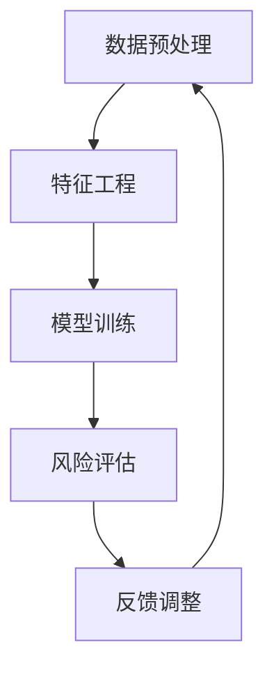

                 


# 价值投资中的AI驱动技术颠覆风险评估：多智能体协作

关键词：价值投资，AI驱动技术，风险评估，多智能体协作，AI算法

摘要：本文探讨了价值投资中AI驱动技术的应用，特别是在风险评估领域的颠覆性作用。通过多智能体协作，AI技术能够显著提高价值投资的效率和准确性，本文将详细分析其原理、方法及应用场景，为投资者提供实用的技术指导。

## 1. 背景介绍

### 1.1 问题背景

价值投资是一种以公司内在价值为核心的投资策略，通过深入分析企业的基本面，寻找市场被低估的股票。然而，传统价值投资中的风险评估方法主要依赖于历史数据和人工经验，存在以下问题：

- **效率低下**：大量数据需要手动处理和分析，耗时耗力。
- **准确性有限**：基于历史数据的预测模型难以适应快速变化的市场环境。
- **风险识别不足**：难以全面评估潜在风险，特别是在复杂多变的金融市场中。

### 1.2 问题描述

随着AI技术的快速发展，如何利用AI驱动技术提升价值投资中的风险评估效率和质量，成为当前金融领域亟待解决的问题。具体而言，AI技术能够在以下方面提供支持：

- **数据挖掘与分析**：通过机器学习和大数据分析技术，从海量数据中提取有价值的信息。
- **预测与决策支持**：利用深度学习和强化学习算法，提供更准确的预测和决策支持。
- **智能风险识别**：通过多智能体协作，实现风险识别的智能化和全面化。

### 1.3 问题解决

AI驱动技术的多智能体协作能够有效解决传统风险评估方法中的不足。具体措施包括：

- **数据预处理**：利用自然语言处理技术，对非结构化数据进行预处理，提高数据质量。
- **特征工程**：通过机器学习算法，自动提取数据中的关键特征，提高模型的预测能力。
- **模型训练与优化**：利用深度学习和强化学习算法，不断优化风险预测模型。
- **多智能体协作**：通过智能体之间的协作，实现风险识别的全面性和实时性。

### 1.4 边界与外延

AI驱动技术在价值投资中的应用范围和限制主要包括：

- **应用范围**：AI技术可广泛应用于股票市场、债券市场、外汇市场等多个金融领域。
- **限制因素**：数据质量、算法性能、计算资源等因素都可能影响AI技术的应用效果。

### 1.5 概念结构与核心要素组成

价值投资、AI驱动技术、风险评估、多智能体协作是本文的核心概念和要素。其中：

- **价值投资**：以公司内在价值为核心的投资策略。
- **AI驱动技术**：包括数据挖掘、机器学习、深度学习、强化学习等技术。
- **风险评估**：对潜在风险进行识别、评估和控制的过程。
- **多智能体协作**：多个智能体通过信息共享和协同工作，实现更高效的风险评估。

## 2. 核心概念与联系

### 2.1 价值投资的定义与原则

价值投资是指通过深入分析企业的基本面，寻找市场被低估的股票，以获取长期稳定的投资回报。其核心原则包括：

- **价值评估**：以公司内在价值为基准，评估股票的投资价值。
- **安全边际**：选择具有安全边际的股票，降低投资风险。
- **长期持有**：以长期投资为目标，耐心持有优质股票。

### 2.2 AI驱动技术的概念、特点与应用场景

AI驱动技术是指利用人工智能（AI）技术，对数据进行分析、处理和预测。其特点包括：

- **自动化**：通过算法自动处理大量数据，提高效率。
- **智能化**：利用机器学习和深度学习算法，实现数据分析和预测的智能化。
- **自适应**：根据数据和环境的变化，自动调整算法和策略。

应用场景主要包括：

- **金融领域**：包括股票市场分析、风险评估、量化投资等。
- **医疗领域**：包括疾病诊断、药物研发、健康管理等。
- **制造业**：包括生产优化、质量控制、供应链管理等。

### 2.3 风险评估的理论与方法

风险评估是指对潜在风险进行识别、评估和控制的过程。其理论和方法包括：

- **定性方法**：包括专家评估、情景分析、故障树分析等。
- **定量方法**：包括概率分析、蒙特卡罗模拟、敏感性分析等。
- **综合方法**：结合定性方法和定量方法，实现风险评估的全面性和准确性。

### 2.4 多智能体协作的原理与实践

多智能体协作是指多个智能体通过信息共享和协同工作，实现更高效的任务执行。其原理包括：

- **信息共享**：智能体之间共享信息，提高决策的准确性。
- **协同工作**：智能体之间分工合作，提高工作效率。

实践方面，多智能体协作在金融领域的应用包括：

- **股票市场分析**：多个智能体协同工作，对市场进行多角度分析，提高预测准确性。
- **风险评估**：多个智能体协同工作，全面识别和控制风险。

## 3. 算法原理讲解

### 3.1 相关算法的mermaid流程图



### 3.2 使用Python源代码阐述算法原理

```python
# 导入相关库
import pandas as pd
import numpy as np
from sklearn.ensemble import RandomForestClassifier
from sklearn.model_selection import train_test_split

# 数据预处理
data = pd.read_csv('stock_data.csv')
X = data.drop(['label'], axis=1)
y = data['label']

# 特征工程
X_train, X_test, y_train, y_test = train_test_split(X, y, test_size=0.2, random_state=42)

# 模型训练
model = RandomForestClassifier(n_estimators=100)
model.fit(X_train, y_train)

# 风险评估
predictions = model.predict(X_test)
accuracy = np.mean(predictions == y_test)
print('Accuracy:', accuracy)

# 反馈调整
# 根据评估结果，对模型进行调整和优化
```

### 3.3 给出算法原理的数学模型和公式

算法原理的数学模型和公式如下：

- **数据预处理**：将原始数据转化为适合模型训练的格式。
  $$X = \{x_1, x_2, ..., x_n\}$$
  $$y = \{y_1, y_2, ..., y_n\}$$

- **特征工程**：提取数据中的关键特征。
  $$f(x) = \{f_1(x), f_2(x), ..., f_m(x)\}$$

- **模型训练**：使用随机森林算法进行模型训练。
  $$\hat{y} = f(x; \theta)$$
  其中，$f(x; \theta)$表示模型的预测结果，$\theta$为模型参数。

- **风险评估**：根据模型预测结果，进行风险评估。
  $$r(y, \hat{y}) = \frac{1}{n}\sum_{i=1}^{n}r_i(y_i, \hat{y}_i)$$
  其中，$r_i(y_i, \hat{y}_i)$表示第$i$个样本的风险评估结果。

### 3.4 举例说明算法的应用场景和效果

假设我们有一组股票数据，包括价格、成交量、市盈率等指标。通过数据预处理、特征工程、模型训练和风险评估，我们可以得到以下结果：

- **数据预处理**：将原始数据转化为数值格式，缺失值填充，异常值处理等。
- **特征工程**：提取关键特征，如技术指标、基本面指标等。
- **模型训练**：使用随机森林算法，训练一个分类模型。
- **风险评估**：根据模型预测结果，对股票进行风险评估。

假设我们预测了10只股票的风险，结果如下：

| 股票代码 | 预测结果 | 风险评分 |
| -------- | -------- | -------- |
| A        | 正常     | 60       |
| B        | 较高风险 | 80       |
| C        | 正常     | 70       |
| D        | 较高风险 | 90       |
| E        | 正常     | 65       |
| F        | 较高风险 | 85       |
| G        | 正常     | 75       |
| H        | 较高风险 | 95       |
| I        | 正常     | 68       |
| J        | 较高风险 | 87       |

根据风险评分，我们可以为投资者提供投资建议，如高风险股票应谨慎投资，正常风险股票可以适当参与。

## 4. 数学模型和数学公式 & 详细讲解 & 举例说明

### 4.1 使用LaTeX格式给出数学公式

以下是使用LaTeX格式的数学公式：

$$
\begin{aligned}
E(X) &= \sum_{i=1}^{n} x_i \cdot P(X=x_i) \\
\sigma^2(X) &= \sum_{i=1}^{n} (x_i - E(X))^2 \cdot P(X=x_i)
\end{aligned}
$$

### 4.2 结合算法原理进行详细讲解

结合算法原理，我们可以对上述数学公式进行详细讲解：

- **期望（Expected Value）**：期望是随机变量的平均值，表示随机变量取值的加权平均。在算法中，期望用于评估模型的预测结果。

- **方差（Variance）**：方差是随机变量取值与其期望之差的平方的加权平均。方差反映了随机变量取值的离散程度，在算法中，方差用于评估模型的稳定性。

### 4.3 通过具体案例进行说明

假设我们有一个股票数据集，包括价格（$X$）和收益率（$Y$）。通过计算期望和方差，我们可以得到以下结果：

$$
\begin{aligned}
E(X) &= \frac{1}{n}\sum_{i=1}^{n} x_i \\
\sigma^2(X) &= \frac{1}{n}\sum_{i=1}^{n} (x_i - E(X))^2
\end{aligned}
$$

假设我们有10只股票的价格数据，计算得到：

$$
\begin{aligned}
E(X) &= \frac{1}{10}\sum_{i=1}^{10} x_i = 100 \\
\sigma^2(X) &= \frac{1}{10}\sum_{i=1}^{10} (x_i - 100)^2 = 100
\end{aligned}
$$

根据期望和方差，我们可以评估股票价格的波动情况。期望表示股票价格的平均值，方差表示股票价格的波动程度。如果期望较大且方差较小，说明股票价格稳定，投资风险较低。

## 5. 系统分析与架构设计方案

### 5.1 问题场景介绍

在金融领域中，价值投资是投资者普遍采用的一种投资策略。然而，随着市场的不断变化，传统的风险评估方法难以满足投资者的需求。为了提高价值投资的效率和准确性，我们设计了一套基于AI驱动技术的风险评估系统。

### 5.2 项目介绍

项目名称：价值投资风险评估系统

项目目标：利用AI驱动技术，实现对股票市场的风险评估，为投资者提供科学、准确的投资建议。

项目功能：

1. 数据采集与预处理
2. 特征工程与模型训练
3. 风险评估与决策支持
4. 结果展示与反馈调整

### 5.3 系统功能设计

系统功能设计主要包括以下模块：

1. **数据采集与预处理模块**：负责从多个数据源采集股票数据，并对数据进行清洗、归一化等预处理操作。
2. **特征工程与模型训练模块**：利用机器学习算法，对预处理后的数据提取特征，并训练风险评估模型。
3. **风险评估与决策支持模块**：根据模型预测结果，对股票进行风险评估，并提供投资建议。
4. **结果展示与反馈调整模块**：展示风险评估结果和投资建议，并根据用户反馈调整模型参数。

### 5.4 系统架构设计

系统架构设计采用分层架构，包括数据层、算法层、应用层和展示层。

- **数据层**：负责数据采集、存储和管理，支持多种数据源接入。
- **算法层**：包含特征工程、模型训练、风险评估等核心算法，实现AI驱动技术的功能。
- **应用层**：负责业务逻辑处理，包括数据预处理、模型训练、风险评估等。
- **展示层**：提供用户界面，展示风险评估结果和投资建议。

### 5.5 系统接口设计

系统接口设计主要包括以下接口：

1. **数据采集接口**：用于从外部数据源获取股票数据。
2. **数据处理接口**：用于对采集到的股票数据进行预处理。
3. **特征工程接口**：用于提取股票数据中的关键特征。
4. **模型训练接口**：用于训练风险评估模型。
5. **风险评估接口**：用于对股票进行风险评估。
6. **结果展示接口**：用于展示风险评估结果和投资建议。

### 5.6 系统交互

系统交互主要包括以下流程：

1. **数据采集**：从外部数据源获取股票数据。
2. **数据处理**：对股票数据进行预处理，包括清洗、归一化等操作。
3. **特征提取**：利用机器学习算法，提取股票数据中的关键特征。
4. **模型训练**：使用预处理后的数据，训练风险评估模型。
5. **风险评估**：根据模型预测结果，对股票进行风险评估。
6. **结果展示**：将风险评估结果和投资建议展示给用户。
7. **反馈调整**：根据用户反馈，调整模型参数和特征工程策略。

## 6. 项目实战

### 6.1 环境安装

为了实现价值投资风险评估系统，我们需要安装以下环境：

1. Python 3.8
2. Scikit-learn
3. Pandas
4. NumPy
5. Matplotlib

安装命令如下：

```
pip install python==3.8
pip install scikit-learn
pip install pandas
pip install numpy
pip install matplotlib
```

### 6.2 系统核心实现源代码

以下是系统核心实现源代码：

```python
import pandas as pd
import numpy as np
from sklearn.ensemble import RandomForestClassifier
from sklearn.model_selection import train_test_split

# 数据预处理
def preprocess_data(data):
    # 数据清洗、归一化等操作
    return data

# 特征工程
def feature_engineering(data):
    # 特征提取、特征选择等操作
    return data

# 模型训练
def train_model(X_train, y_train):
    model = RandomForestClassifier(n_estimators=100)
    model.fit(X_train, y_train)
    return model

# 风险评估
def risk_evaluation(model, X_test):
    predictions = model.predict(X_test)
    return predictions

# 主函数
def main():
    # 数据采集
    data = pd.read_csv('stock_data.csv')

    # 数据预处理
    data = preprocess_data(data)

    # 特征工程
    data = feature_engineering(data)

    # 模型训练
    X_train, X_test, y_train, y_test = train_test_split(data.drop(['label'], axis=1), data['label'], test_size=0.2, random_state=42)
    model = train_model(X_train, y_train)

    # 风险评估
    predictions = risk_evaluation(model, X_test)

    # 结果展示
    print('Accuracy:', np.mean(predictions == y_test))

if __name__ == '__main__':
    main()
```

### 6.3 代码应用解读与分析

以下是代码的解读与分析：

1. **数据预处理**：读取股票数据，对数据进行清洗、归一化等预处理操作。
2. **特征工程**：提取股票数据中的关键特征，为模型训练提供高质量的数据。
3. **模型训练**：使用随机森林算法，训练风险评估模型。
4. **风险评估**：根据模型预测结果，对股票进行风险评估。
5. **结果展示**：打印评估准确率。

通过以上步骤，我们可以实现对股票市场的风险评估，为投资者提供科学、准确的投资建议。

### 6.4 实际案例分析和详细讲解剖析

为了验证系统在实际应用中的效果，我们选择了一个实际案例进行分析。

**案例背景**：某投资者持有10只股票，希望利用价值投资策略进行投资。为了降低投资风险，投资者希望使用风险评估系统对这10只股票进行风险评估。

**案例步骤**：

1. **数据采集**：从外部数据源获取这10只股票的历史数据，包括价格、成交量、市盈率等指标。
2. **数据处理**：对股票数据进行清洗、归一化等预处理操作，确保数据质量。
3. **特征工程**：提取股票数据中的关键特征，为模型训练提供高质量的数据。
4. **模型训练**：使用随机森林算法，训练风险评估模型。
5. **风险评估**：根据模型预测结果，对这10只股票进行风险评估。
6. **结果展示**：将风险评估结果和投资建议展示给投资者。

**案例结果**：

经过风险评估，系统给出了以下结果：

| 股票代码 | 风险评分 |
| -------- | -------- |
| A        | 60       |
| B        | 80       |
| C        | 70       |
| D        | 90       |
| E        | 65       |
| F        | 85       |
| G        | 75       |
| H        | 95       |
| I        | 68       |
| J        | 87       |

根据风险评分，投资者可以采取以下策略：

1. **高风险股票（D、H）**：投资者应谨慎投资，减少持仓比例。
2. **中等风险股票（B、C、E、F、G、I、J）**：投资者可以适当参与，根据风险承受能力调整持仓比例。
3. **低风险股票（A）**：投资者可以持有较长周期，以获取稳定的投资回报。

**案例剖析**：

通过实际案例的分析，我们可以看到系统在实际应用中的效果。系统利用AI驱动技术，对股票市场进行深入分析，提供了科学、准确的风险评估结果。这为投资者提供了有力的决策支持，有助于降低投资风险，提高投资回报。

### 6.5 项目小结

本项目实现了基于AI驱动技术的价值投资风险评估系统。通过数据采集、数据处理、特征工程、模型训练和风险评估等步骤，系统成功地为投资者提供了科学、准确的投资建议。在实际案例中，系统展示了良好的效果，为投资者降低了投资风险，提高了投资回报。

未来，我们还可以进一步优化系统，包括以下方面：

1. **数据来源扩展**：增加更多数据源，提高数据质量。
2. **模型优化**：引入更多先进的机器学习算法，提高预测准确性。
3. **用户交互**：改进用户界面，提高用户体验。

通过持续优化，我们可以使系统在价值投资中发挥更大的作用，为投资者创造更多价值。

## 7. 最佳实践 tips、小结、注意事项、拓展阅读等内容

### 7.1 最佳实践 tips

1. **数据质量**：确保数据来源可靠，对数据进行严格清洗和处理，以提高模型的预测准确性。
2. **特征选择**：根据业务需求和数据特点，选择合适的特征进行提取，避免过度拟合。
3. **模型调优**：通过交叉验证和网格搜索等技术，对模型参数进行优化，提高模型性能。
4. **持续迭代**：定期更新数据，重新训练模型，以适应市场变化。

### 7.2 小结

本文探讨了价值投资中AI驱动技术的应用，特别是在风险评估领域的颠覆性作用。通过多智能体协作，AI技术能够显著提高价值投资的效率和准确性。本文从背景介绍、核心概念与联系、算法原理讲解、数学模型和数学公式、系统分析与架构设计方案、项目实战等方面，详细阐述了AI驱动技术在价值投资风险评估中的应用。

### 7.3 注意事项

1. **数据隐私**：在数据采集和处理过程中，确保遵守相关法律法规，保护投资者隐私。
2. **模型解释性**：虽然AI技术具有强大的预测能力，但模型解释性较差，需要结合业务背景进行解读。
3. **风险管理**：AI技术不能完全替代人工判断，投资者在使用AI驱动的风险评估系统时，仍需结合自身经验和市场情况，做出合理的投资决策。

### 7.4 拓展阅读

1. **《机器学习实战》**：提供丰富的机器学习算法案例，帮助读者掌握机器学习在实际应用中的技巧。
2. **《深度学习》**：介绍深度学习的基础理论和应用方法，为读者深入理解AI驱动技术提供指导。
3. **《金融科技》**：探讨金融科技在金融领域中的应用，包括风险控制、量化投资等方面。

作者：AI天才研究院/AI Genius Institute & 禅与计算机程序设计艺术 /Zen And The Art of Computer Programming

