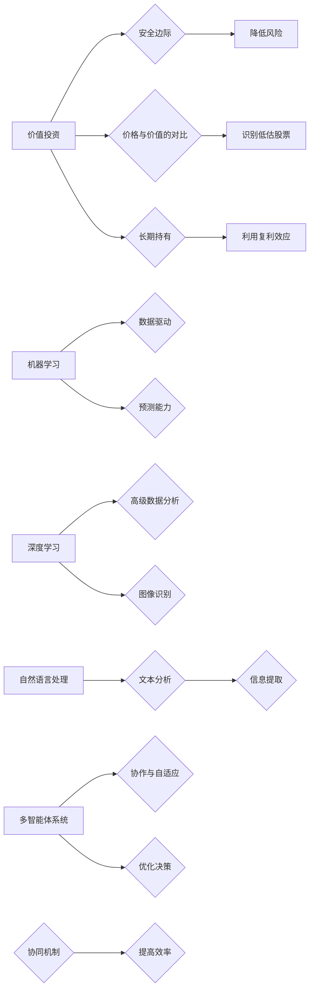

                 

### 第1章 背景介绍

#### 1.1 问题背景

##### 1.1.1 价值投资概述

价值投资（Value Investing）是一种通过购买价格低于其内在价值的股票，以期获得长期回报的投资策略。这一概念最早由本杰明·格雷厄姆（Benjamin Graham）在20世纪30年代提出，并经过沃伦·巴菲特（Warren Buffett）等投资大师的发扬光大。价值投资的核心原则包括：

1. **安全边际**（Margin of Safety）：投资者应确保所购买的股票价格远低于其估计的内在价值。
2. **价格与价值的对比**（Price versus Value）：价值投资者通过深入分析公司的基本面，寻找那些被市场低估的企业。
3. **长期持有**（Long-Term Holding）：价值投资者倾向于长期持有股票，即便短期市场波动对其股价造成不利影响。

价值投资策略通常涉及以下几个方面：

- **基本面分析**：通过研究公司的财务报表、行业地位、管理团队等，评估其长期盈利能力。
- **技术分析**：分析历史股价走势、成交量等，以预测未来股价变动。
- **资产配置**：根据投资者的风险偏好和财务目标，合理配置资产，以达到最优的投资组合。

##### 1.1.2 政府关系分析的重要性

在价值投资中，政府关系分析扮演着至关重要的角色。政府政策的变化往往会对企业的经营状况和投资回报产生深远影响。以下是一些关键点：

1. **政策环境**：政府的政策环境包括税收、监管、贸易政策等，这些政策的变化直接影响企业的经营成本和市场机会。
2. **行业法规**：特定行业的法规和标准直接影响企业的运营和盈利能力，例如环保法规、安全生产标准等。
3. **政策风险**：政策的不确定性带来的风险是价值投资者必须考虑的，如税收政策调整、贸易战等。
4. **政府支持**：政府的支持，如减税、补贴等，可能为某些行业或企业带来额外的竞争优势。

##### 1.1.3 AI在价值投资中的应用

随着人工智能（AI）技术的不断发展，其在价值投资中的应用潜力逐渐显现。AI技术可以大幅提高投资决策的效率和准确性，主要表现在以下几个方面：

1. **数据挖掘与分析**：AI技术可以处理大量复杂的数据，快速提取有用信息，帮助投资者进行更加全面和深入的分析。
2. **预测与风险评估**：通过机器学习和深度学习算法，AI可以预测市场趋势和政策变化，评估潜在的投资风险。
3. **自动化交易**：AI驱动的自动化交易系统能够在短时间内处理大量交易数据，实现高频交易和量化投资。
4. **社交网络分析**：AI可以通过自然语言处理技术，分析社交媒体上的信息和舆情，辅助投资者了解市场情绪和政府政策动态。

#### 1.2 问题描述

##### 1.2.1 价值投资中的挑战

在价值投资中，投资者面临着多种挑战，包括：

1. **数据获取与处理**：价值投资需要对大量历史数据进行处理和分析，数据的质量和完整性直接影响投资决策的准确性。
2. **风险评估与预测**：准确预测市场走势和政策变化是价值投资的关键，这需要高效且准确的预测模型。
3. **投资策略优化**：投资者需要不断调整和优化投资策略，以适应市场变化和风险偏好。

##### 1.2.2 政府关系分析中的难点

政府关系分析涉及以下几个难点：

1. **数据的多样性**：政府关系分析需要处理来自多种渠道的数据，如政府公开数据、社交媒体数据、行业报告等。
2. **政策变化的快速性**：政策变化频繁且难以预测，这要求分析系统具有高度的实时性和适应性。
3. **复杂的利益关系网**：政府和企业在政策制定和执行过程中，涉及多方利益相关者，关系复杂且多变。

#### 1.3 问题解决

##### 1.3.1 AI驱动政府关系分析的概念

AI驱动政府关系分析是指利用人工智能技术，对政府政策、法规、舆情等进行分析，以辅助价值投资决策。其主要优势包括：

1. **数据挖掘与处理能力**：AI能够高效处理和分析大量复杂的数据，提取有用信息。
2. **实时性与适应性**：AI系统可以根据实时数据和政策变化，快速调整分析模型和投资策略。
3. **减少人为错误**：通过自动化分析和决策，减少因人为因素导致的错误和偏见。

##### 1.3.2 多智能体系统在价值投资中的应用

多智能体系统（Multi-Agent System）是由多个智能体组成的系统，这些智能体可以独立决策，并通过协作完成复杂任务。在价值投资中，多智能体系统可以用于以下几个方面：

1. **协同分析**：多个智能体可以分别分析不同的数据源和投资指标，通过协作形成综合分析结果。
2. **风险评估**：多智能体系统可以同时评估多种风险因素，提供更加全面的风险评估。
3. **策略优化**：通过智能体的自主学习和优化，多智能体系统可以帮助投资者制定和调整投资策略。

通过AI驱动的政府关系分析和多智能体系统的应用，投资者可以更加准确地把握政策变化，优化投资决策，提高投资回报。

### 1.4 结论

本文介绍了价值投资中AI驱动政府关系分析的多智能体系统的概念和应用。通过AI技术，投资者能够高效处理和分析大量数据，实时监测政策变化，优化投资策略。多智能体系统的引入，进一步增强了分析系统的协同性和适应性。未来，随着AI技术的不断进步，这一领域将迎来更多的创新和发展。

### 关键词

- 价值投资
- AI驱动政府关系分析
- 多智能体系统
- 数据挖掘
- 风险评估
- 投资策略优化

### 摘要

本文探讨了在价值投资中，如何利用AI驱动政府关系分析和多智能体系统来优化投资决策。通过分析价值投资的背景、挑战及解决方案，本文介绍了AI和深度学习在政府关系分析中的应用，以及多智能体系统在价值投资中的协同机制。最后，本文通过实际案例，展示了AI驱动政府关系分析在价值投资中的具体应用和效果。

### 目录大纲

----------------------------------------------------------------

## 第1章 背景介绍

### 1.1 价值投资概述

#### 1.1.1 价值投资的概念与起源

#### 1.1.2 价值投资的核心理念

### 1.2 政府关系分析的重要性

#### 1.2.1 政府关系分析的定义与作用

#### 1.2.2 价值投资中政府关系的重要性

### 1.3 AI在价值投资中的应用

#### 1.3.1 AI技术概述

#### 1.3.2 AI在价值投资分析中的应用潜力

### 1.4 问题描述

#### 1.4.1 价值投资中的挑战

#### 1.4.2 政府关系分析中的难点

### 1.5 问题解决

#### 1.5.1 AI驱动政府关系分析的概念

#### 1.5.2 多智能体系统在价值投资中的应用

## 第2章 核心概念与联系

### 2.1 价值投资核心概念

#### 2.1.1 价值投资的三大核心原则

#### 2.1.2 价值投资的关键要素

### 2.2 AI驱动政府关系分析核心概念

#### 2.2.1 机器学习与深度学习

#### 2.2.2 自然语言处理

### 2.3 多智能体系统核心概念

#### 2.3.1 多智能体系统概述

#### 2.3.2 多智能体系统的协同机制

## 第3章 AI驱动政府关系分析原理

### 3.1 数据收集与预处理

#### 3.1.1 数据源分析

#### 3.1.2 数据预处理方法

### 3.2 机器学习与深度学习模型

#### 3.2.1 常见机器学习模型

#### 3.2.2 深度学习模型

### 3.3 自然语言处理

#### 3.3.1 基本自然语言处理任务

#### 3.3.2 文本挖掘与情感分析

## 第4章 多智能体系统在价值投资中的应用

### 4.1 多智能体系统的设计原则

#### 4.1.1 自主性

#### 4.1.2 效率

#### 4.1.3 可扩展性

### 4.2 智能体的协同策略

#### 4.2.1 分布式协同策略

#### 4.2.2 学习与适应机制

### 4.3 多智能体系统在价值投资中的实例分析

#### 4.3.1 实例一：政策影响预测

#### 4.3.2 实例二：企业风险评级

## 第5章 系统设计与实现

### 5.1 系统总体架构设计

#### 5.1.1 系统功能模块划分

#### 5.1.2 系统架构设计

### 5.2 系统核心实现

#### 5.2.1 数据采集与预处理

#### 5.2.2 模型训练与预测

#### 5.2.3 多智能体协同

## 第6章 项目实战与案例分析

### 6.1 项目背景介绍

#### 6.1.1 项目简介

#### 6.1.2 项目挑战

### 6.2 项目实施

#### 6.2.1 数据采集与预处理

#### 6.2.2 模型训练与预测

#### 6.2.3 多智能体协同

### 6.3 结果分析

#### 6.3.1 数据可视化

#### 6.3.2 结果评估与讨论

### 6.4 项目小结

## 第7章 结论与展望

### 7.1 结论

### 7.2 展望

### 7.3 最佳实践 tips

### 7.4 小结

### 7.5 注意事项

### 7.6 拓展阅读

----------------------------------------------------------------
## 第2章 核心概念与联系

在深入探讨AI驱动政府关系分析的多智能体系统之前，我们需要理解一些核心概念及其相互之间的联系。本章将详细阐述价值投资的核心理念、AI驱动政府关系分析的核心概念、以及多智能体系统的基本原理和协同机制。

### 2.1 价值投资核心概念

价值投资的核心概念包括安全边际、价格与价值的对比以及长期持有。以下是对这些概念的详细解释：

#### 2.1.1 安全边际

安全边际是指投资者购买股票时支付的价格与其估计的内在价值之间的差额。这个差额越大，投资的风险越小。安全边际的目的是为投资者提供额外的保护，即使市场判断错误，投资者也有足够的时间和市场空间来纠正错误。

$$
\text{安全边际} = \text{内在价值} - \text{市场价格}
$$

#### 2.1.2 价格与价值的对比

价格与价值的对比是价值投资的核心原则之一。投资者通过深入分析公司的基本面，如盈利能力、财务状况、市场前景等，来评估公司的内在价值。然后，投资者会将内在价值与市场价格进行比较，以确定股票是否被低估。

$$
\text{内在价值} = \sum_{t=1}^{n} \frac{\text{未来现金流}}{(1 + \text{折现率})^t}
$$

#### 2.1.3 长期持有

长期持有是价值投资的关键策略。投资者不应被短期的市场波动所影响，而应专注于公司的长期价值。长期持有可以帮助投资者充分利用复利效应，同时减少交易成本和市场波动带来的风险。

### 2.2 AI驱动政府关系分析核心概念

AI驱动政府关系分析涉及到机器学习、深度学习和自然语言处理等核心概念。以下是对这些概念的详细解释：

#### 2.2.1 机器学习与深度学习

**机器学习**是一种让计算机从数据中学习模式并做出预测的技术。它分为监督学习、无监督学习和强化学习等类型。监督学习中的算法通过已标记的数据进行训练，以预测新的数据点。无监督学习则不需要标记数据，旨在发现数据中的结构或模式。强化学习是一种通过试错来学习最优策略的方法。

**深度学习**是机器学习的一个分支，它使用神经网络来模拟人脑的决策过程。深度学习在图像识别、语音识别和自然语言处理等领域取得了显著成果。常见的深度学习模型包括卷积神经网络（CNN）、递归神经网络（RNN）和生成对抗网络（GAN）。

#### 2.2.2 自然语言处理

自然语言处理（NLP）是人工智能的一个子领域，它致力于让计算机理解和处理人类语言。NLP涉及多个任务，如文本分类、情感分析、命名实体识别和机器翻译。NLP技术对于AI驱动政府关系分析至关重要，因为它可以帮助系统理解和分析大量的文本数据。

### 2.3 多智能体系统核心概念

多智能体系统（MAS）是由多个智能体组成的系统，这些智能体可以独立决策并相互协作。以下是多智能体系统的核心概念：

#### 2.3.1 多智能体系统概述

**多智能体系统**（MAS）是一种分布式计算系统，它由多个具有自主决策能力的智能体组成。这些智能体可以相互通信并协作，以实现共同的目标。多智能体系统广泛应用于智能交通、智能电网和机器人等领域。

**智能体**是MAS中的基本单位，它具有以下特征：

- **自主性**：智能体可以独立决策并采取行动。
- **社会性**：智能体可以与其他智能体进行通信和协作。
- **反应性**：智能体可以实时响应环境和事件。
- **适应性**：智能体可以适应环境和任务的变化。

#### 2.3.2 多智能体系统的协同机制

**协同机制**是多智能体系统实现高效协作的关键。以下是一些常见的协同机制：

- **通信机制**：智能体之间通过通信机制交换信息和协调行动。
- **协作策略**：智能体通过协商和协作来共同完成任务。
- **学习与适应机制**：智能体可以学习环境中的模式和规律，并适应新的环境和任务。

### 2.4 价值投资、AI驱动政府关系分析及多智能体系统的联系

价值投资、AI驱动政府关系分析和多智能体系统之间存在着紧密的联系。价值投资的核心理念需要通过数据分析来支持，而AI技术则可以提供高效的数据处理和分析能力。AI驱动政府关系分析利用机器学习和自然语言处理技术，从大量的文本和结构化数据中提取有价值的信息，辅助投资者理解政府政策的变化和影响。多智能体系统则通过智能体的协作和自适应能力，优化投资决策，提高投资回报。

- **数据驱动**：价值投资依赖于大量数据进行分析，而AI技术提供了高效的数据处理和分析方法。
- **决策支持**：AI驱动政府关系分析提供了对政府政策的深入理解和预测，为价值投资决策提供支持。
- **协同优化**：多智能体系统通过智能体的协作，优化投资策略，提高投资回报。

通过理解这些核心概念和联系，投资者可以更好地利用AI和多智能体系统来优化价值投资决策，提高投资回报。

### 核心概念与联系表格

| 概念               | 定义与作用                                                                                      | 在价值投资中的应用                     |  
|--------------------|--------------------------------------------------------------------------------------------------|----------------------------------------|  
| 价值投资           | 一种通过购买价格低于其内在价值的股票，以期获得长期回报的投资策略。                         | 支持投资决策，寻找被低估的股票。       |  
| 安全边际           | 投资者购买股票时支付的价格与其估计的内在价值之间的差额。                                | 提供额外的保护，降低投资风险。         |  
| 价格与价值的对比   | 评估股票的内在价值，并将其与市场价格进行比较。                                         | 确定股票是否被低估。                   |  
| 长期持有           | 投资者长期持有股票，充分利用复利效应。                                               | 减少交易成本和市场波动风险。         |  
| 机器学习           | 让计算机从数据中学习模式并做出预测的技术。                                            | 提供数据分析和预测能力。               |  
| 深度学习           | 使用神经网络模拟人脑决策过程的机器学习方法。                                         | 提供高级数据分析和图像识别能力。       |  
| 自然语言处理       | 让计算机理解和处理人类语言的技术。                                                   | 分析文本数据，提取有价值的信息。       |  
| 多智能体系统       | 由多个具有自主决策能力的智能体组成的分布式计算系统。                                  | 实现智能体的协作和自适应，优化投资决策。|  
| 协同机制           | 智能体之间的协作和通信机制。                                                        | 优化智能体之间的协作，提高系统效率。   |

### 多智能体系统的ER实体关系图

```mermaid
erDiagram
  Customer ||--|{ Order : places } |
  Product ||--|{ OrderItem : contains } |
  Order ||--|{ Payment : pays } |
  Payment ||--|{ PaymentMethod : uses } |
```

在这个ER实体关系图中，我们可以看到多智能体系统的关键实体及其关系。每个智能体（Customer）可以创建多个订单（Order），每个订单可以包含多个产品（Product）。支付（Payment）与订单和支付方式（PaymentMethod）之间也存在关联。

### 核心概念与联系Mermaid流程图



在这个Mermaid流程图中，我们展示了价值投资、AI驱动政府关系分析以及多智能体系统的核心概念及其相互之间的联系。通过机器学习和深度学习，我们可以实现数据驱动和预测能力，而自然语言处理则用于文本分析和信息提取。多智能体系统通过协作和自适应机制，优化了投资决策，从而提高了投资回报。

### 2.5 结论

本章介绍了价值投资的核心理念、AI驱动政府关系分析的核心概念以及多智能体系统的基本原理和协同机制。通过理解这些核心概念和联系，投资者可以更好地利用AI和多智能体系统来优化价值投资决策。下一章将深入探讨AI驱动政府关系分析的具体原理和技术实现。

### 关键词

- 价值投资
- 安全边际
- 价格与价值的对比
- 长期持有
- 机器学习
- 深度学习
- 自然语言处理
- 多智能体系统
- 协同机制

### 摘要

本章详细阐述了价值投资的核心理念，包括安全边际、价格与价值的对比和长期持有。同时，介绍了AI驱动政府关系分析的核心概念，如机器学习、深度学习和自然语言处理，以及多智能体系统的基本原理和协同机制。这些核心概念和联系为投资者优化价值投资决策提供了理论基础和技术支持。

## 第3章 AI驱动政府关系分析原理

### 3.1 数据收集与预处理

#### 3.1.1 数据源分析

AI驱动政府关系分析的首要任务是收集相关的数据。这些数据可以来源于多个渠道，包括政府公开数据、社交媒体、行业报告和新闻媒体。以下是对这些数据源的分析：

1. **政府公开数据**：政府公开数据通常包括财政预算、税收政策、法律法规、行业统计等。这些数据可以通过政府网站、公开报告等获取，是进行政府关系分析的重要基础。
2. **社交媒体**：社交媒体平台（如Twitter、Facebook、微信等）是另一个重要的数据源。通过分析社交媒体上的讨论和舆情，可以了解公众对政府政策的态度和反馈。
3. **行业报告**：行业报告通常由研究机构和咨询公司发布，涵盖行业趋势、市场分析和政策影响等。这些报告提供了行业视角，有助于深入理解政府政策对企业的影响。
4. **新闻媒体**：新闻媒体提供了实时和全面的政策新闻和信息。通过分析新闻内容，可以捕捉政策变化和事件发生的细节。

#### 3.1.2 数据预处理方法

收集到数据后，需要进行预处理以确保数据的质量和一致性。以下是一些常用的数据预处理方法：

1. **数据清洗**：数据清洗是数据预处理的重要步骤，旨在去除数据中的错误、重复和不完整的信息。具体方法包括：
   - **去除重复记录**：通过唯一标识符或关键字，删除重复的数据记录。
   - **处理缺失值**：对于缺失的数据，可以选择填充、删除或使用统计方法（如平均值、中位数等）进行替代。
   - **纠正错误**：识别和纠正数据中的错误，如数值错误、分类错误等。

2. **数据整合**：不同数据源的数据格式和结构可能不同，因此需要进行整合。整合的方法包括：
   - **数据转换**：将不同格式的数据转换为统一的格式，如CSV、JSON等。
   - **数据合并**：将来自不同数据源的相关数据合并，以形成完整的分析数据集。

3. **数据标准化**：为了使数据更具可比性，需要对数据进行标准化处理。常见的方法包括：
   - **数值标准化**：通过缩放或转换，将不同量纲的数值数据转换为同一量纲。
   - **分类标准化**：将类别数据进行编码，以便于后续分析和建模。

#### 3.1.3 数据预处理流程

数据预处理流程通常包括以下几个步骤：

1. **数据收集**：从多个数据源收集原始数据。
2. **数据清洗**：处理数据中的错误、重复和不完整的信息。
3. **数据整合**：将来自不同数据源的数据进行转换和合并，形成完整的分析数据集。
4. **数据标准化**：对数据进行标准化处理，以提高数据的可比性和一致性。

通过以上数据预处理步骤，可以确保数据的质量和完整性，为后续的AI分析和建模打下坚实的基础。

### 3.2 机器学习与深度学习模型

#### 3.2.1 常见机器学习模型

机器学习模型是AI驱动政府关系分析的核心工具，它们可以从数据中学习模式和规律，以预测政府政策的影响。以下是一些常见的机器学习模型：

1. **线性回归**：线性回归是一种简单的预测模型，它通过拟合一条直线来预测目标变量。线性回归的数学模型可以表示为：

   $$
   y = \beta_0 + \beta_1x_1 + \beta_2x_2 + \ldots + \beta_nx_n
   $$

   其中，$y$ 是目标变量，$x_1, x_2, \ldots, x_n$ 是特征变量，$\beta_0, \beta_1, \beta_2, \ldots, \beta_n$ 是模型参数。

2. **决策树**：决策树是一种基于树形结构的预测模型，它通过一系列的规则来分割数据集，并最终预测目标变量的值。决策树的构建过程包括以下几个步骤：
   - **特征选择**：选择一个最优的特征进行分割。
   - **分割数据**：将数据集按照选定的特征进行分割。
   - **递归构建**：对每个分割后的子数据集重复上述步骤，直到满足终止条件。

3. **随机森林**：随机森林是一种集成学习方法，它通过构建多棵决策树，并合并这些树的预测结果来提高模型的准确性。随机森林的优点包括：
   - **抗过拟合**：通过集成多个决策树，可以减少模型的过拟合。
   - **鲁棒性**：随机森林对异常值和噪声具有较强的鲁棒性。

#### 3.2.2 深度学习模型

深度学习模型是机器学习的一个重要分支，它通过多层神经网络模拟人脑的决策过程。以下是一些常见的深度学习模型：

1. **卷积神经网络（CNN）**：卷积神经网络是一种用于图像识别和处理的前沿模型。它的主要优势在于：
   - **平移不变性**：通过卷积操作，CNN可以识别图像中的局部特征，而不依赖于具体的平移位置。
   - **参数共享**：卷积操作中的权重在图像的不同部分是共享的，这减少了模型的参数数量。

2. **递归神经网络（RNN）**：递归神经网络是一种用于处理序列数据的模型，它可以捕捉序列中的时间依赖性。RNN的数学模型可以表示为：

   $$
   h_t = \sigma(W_h \cdot [h_{t-1}, x_t] + b_h)
   $$

   其中，$h_t$ 是第$t$个时间步的隐藏状态，$x_t$ 是输入，$W_h$ 和$b_h$ 是模型参数，$\sigma$ 是激活函数。

3. **生成对抗网络（GAN）**：生成对抗网络是一种用于生成数据的模型，它由生成器和判别器两个部分组成。生成器的目标是生成看起来真实的数据，而判别器的目标是区分真实数据和生成数据。通过这种对抗过程，GAN可以生成高质量的数据。

#### 3.2.3 选择适当的模型

在选择适当的模型时，需要考虑以下因素：

- **数据类型**：不同的模型适用于不同类型的数据。例如，线性回归适用于数值型数据，而决策树和随机森林适用于分类数据。深度学习模型（如CNN和RNN）适用于复杂数据，如图像和文本。
- **数据规模**：对于大型数据集，深度学习模型通常表现更好，因为它们可以捕捉数据中的复杂模式。然而，对于小型数据集，传统的机器学习模型可能更有效。
- **模型复杂度**：模型的复杂度越高，其参数数量越多，过拟合的风险也越大。因此，在选择模型时，需要平衡模型的复杂度和预测能力。

通过选择适当的机器学习模型和深度学习模型，AI驱动政府关系分析可以有效地从数据中提取有价值的信息，辅助投资者进行投资决策。

### 3.3 自然语言处理

#### 3.3.1 基本自然语言处理任务

自然语言处理（NLP）是AI驱动政府关系分析中至关重要的一部分。它使计算机能够理解和处理人类语言，从而提取出有价值的信息。以下是一些基本的NLP任务：

1. **分词**：分词是将文本分割成单词或短语的步骤。例如，将“我爱北京天安门”分词为“我”、“爱”、“北京”、“天安门”。分词的目的是为了更好地理解和分析文本内容。

2. **命名实体识别**：命名实体识别是识别文本中的特定实体（如人名、地名、组织名等）的过程。例如，在句子“苹果公司将在硅谷召开年度会议”中，可以识别出“苹果公司”和“硅谷”这两个命名实体。

3. **词性标注**：词性标注是将文本中的每个词标注为特定的词性（如名词、动词、形容词等）。词性标注有助于理解文本的语义和语法结构。

4. **句法分析**：句法分析是分析句子结构的过程，包括确定句子的主语、谓语、宾语等成分。句法分析有助于理解句子的深层语义。

#### 3.3.2 文本挖掘与情感分析

文本挖掘和情感分析是NLP的重要应用，它们可以帮助投资者从大量文本数据中提取有价值的信息。

1. **文本分类**：文本分类是将文本分配到预定义的类别中的过程。例如，将新闻文章分类为“政治”、“经济”、“科技”等类别。文本分类可以帮助投资者快速了解文本的主题和内容。

2. **文本聚类**：文本聚类是将文本数据按照其相似性进行分组的过程。文本聚类可以帮助投资者发现文本中的潜在模式和趋势。

3. **情感分析**：情感分析是识别文本中的情感倾向（如正面、负面、中性等）的过程。例如，在社交媒体上，可以通过情感分析了解公众对某项政策的态度。情感分析有助于投资者了解市场情绪和政策影响。

通过NLP技术，AI驱动政府关系分析可以从大量的文本数据中提取有价值的信息，为投资决策提供支持。

### 3.4 AI驱动政府关系分析的核心原理

AI驱动政府关系分析的核心原理在于利用机器学习和深度学习模型从大量文本和结构化数据中提取有价值的信息，并对政府政策的影响进行预测。以下是AI驱动政府关系分析的核心原理：

1. **数据收集与预处理**：通过多种数据源收集政府政策、法律法规、舆情等数据，并进行数据清洗、整合和标准化处理，以确保数据的质量和一致性。

2. **特征工程**：根据分析目标，提取和构建与政府政策相关的特征。这些特征可以包括政策文本的关键词、命名实体、情感极性等。

3. **模型选择与训练**：选择适当的机器学习和深度学习模型，如线性回归、决策树、随机森林、CNN和RNN等，对提取的特征进行训练，以预测政府政策的影响。

4. **预测与评估**：使用训练好的模型对新的政策文本进行预测，评估预测结果，并根据评估结果对模型进行调整和优化。

5. **结果可视化与解释**：将预测结果进行可视化，帮助投资者理解政府政策的影响，并对投资决策提供支持。

通过以上核心原理，AI驱动政府关系分析可以有效地从数据中提取有价值的信息，辅助投资者进行投资决策。

### 3.5 结论

本章详细介绍了AI驱动政府关系分析的数据收集与预处理、机器学习与深度学习模型、自然语言处理以及核心原理。通过这些技术和原理，投资者可以有效地从大量的文本和结构化数据中提取有价值的信息，预测政府政策的影响，从而优化投资决策。下一章将探讨多智能体系统在价值投资中的应用。

### 关键词

- 数据收集与预处理
- 机器学习模型
- 深度学习模型
- 自然语言处理
- 文本挖掘
- 情感分析
- 特征工程
- 预测与评估

### 摘要

本章深入探讨了AI驱动政府关系分析的基本原理和技术实现。通过数据收集与预处理、机器学习与深度学习模型、自然语言处理等技术，AI驱动政府关系分析能够有效地从大量文本和结构化数据中提取有价值的信息，预测政府政策的影响。这些技术为投资者提供了强大的工具，帮助他们优化投资决策，提高投资回报。

## 第4章 多智能体系统在价值投资中的应用

### 4.1 多智能体系统的设计原则

多智能体系统（MAS）在价值投资中的应用需要遵循一系列设计原则，以确保系统的自主性、效率和可扩展性。以下是多智能体系统的设计原则：

#### 4.1.1 自主性

**自主性**是指智能体在系统中具有独立决策和行动的能力。在价值投资中，智能体可以独立地收集数据、分析市场和执行交易。自主性的重要性在于：

- **快速响应**：智能体能够迅速对市场变化作出反应，捕捉投资机会。
- **分散决策**：多个智能体可以同时处理不同的投资策略，提高决策效率。
- **降低风险**：单一智能体的错误不会影响整个系统，从而降低投资风险。

实现自主性的关键在于智能体的设计和实现。每个智能体应具有以下特征：

- **独立计算能力**：智能体应具备处理数据和执行算法的计算能力。
- **本地决策**：智能体应在本地执行决策，减少与其他智能体的通信需求。
- **自适应能力**：智能体应能够根据市场变化和环境反馈调整其行为。

#### 4.1.2 效率

**效率**是指智能体在执行任务时的速度和资源利用情况。在价值投资中，效率的重要性体现在以下几个方面：

- **快速交易执行**：智能体应能够迅速执行交易指令，减少市场波动和交易成本。
- **高效数据处理**：智能体应能够高效地处理大量数据，提取有用信息。
- **资源优化**：智能体应合理利用系统资源，如计算资源、网络带宽和存储空间。

提高效率的关键在于系统的架构设计和智能体的优化。以下是一些提高效率的方法：

- **分布式计算**：通过分布式计算，将任务分散到多个智能体上，提高处理速度。
- **并发处理**：智能体应能够并发处理多个任务，提高系统吞吐量。
- **数据缓存**：智能体应缓存常用数据和计算结果，减少重复计算和访问。

#### 4.1.3 可扩展性

**可扩展性**是指系统在增加智能体和任务量时的适应能力。在价值投资中，可扩展性至关重要，因为市场变化和投资策略的调整可能导致系统负载的增加。以下是可扩展性的几个方面：

- **水平扩展**：系统应支持增加智能体数量，以应对更高的处理需求。
- **垂直扩展**：系统应支持增加计算资源，如CPU、内存和存储，以提高处理能力。
- **模块化设计**：系统应采用模块化设计，使智能体和功能模块可以独立开发和部署。

实现可扩展性的关键在于系统的设计和架构。以下是一些实现可扩展性的方法：

- **分布式架构**：采用分布式架构，将系统分解为多个模块，每个模块可以独立扩展。
- **弹性调度**：智能体的调度和负载均衡应具备弹性，能够自动调整资源分配。
- **动态扩展**：系统应支持动态扩展和缩放，根据需求自动调整智能体数量和资源分配。

通过遵循这些设计原则，多智能体系统可以在价值投资中实现高效、自主和可扩展的决策支持，从而提高投资回报。

### 4.2 智能体的协同策略

多智能体系统的协同策略是指智能体之间如何相互协作，以实现共同的目标。在价值投资中，智能体的协同策略尤为重要，因为它们需要处理复杂的市场环境和多变的投资策略。以下是几个关键协同策略：

#### 4.2.1 分布式协同策略

分布式协同策略是指智能体通过通信和协作，共同完成复杂任务。以下是实现分布式协同策略的关键步骤：

1. **通信机制**：智能体之间需要建立通信机制，以交换信息和协调行动。常见的通信机制包括消息队列、远程过程调用（RPC）和区块链等。

2. **协商算法**：智能体应采用协商算法，以确定如何分工合作。协商算法可以根据智能体的计算能力、数据资源和任务需求，动态分配任务。

3. **分布式计算**：通过分布式计算，将任务分解为多个子任务，分配给不同的智能体。分布式计算可以提高系统的处理速度和资源利用率。

4. **协同决策**：智能体在执行任务时，应协同决策，以最大化整体收益。协同决策可以通过多智能体强化学习（MARL）等方法实现。

#### 4.2.2 学习与适应机制

学习与适应机制是指智能体如何从经验和数据中学习，并适应不断变化的环境。以下是实现学习与适应机制的关键步骤：

1. **经验反馈**：智能体应收集任务执行的经验，并将其作为反馈输入到学习算法中。经验反馈可以帮助智能体调整行为，提高任务执行效果。

2. **强化学习**：智能体可以通过强化学习，根据环境反馈调整策略。强化学习是一种基于试错的学习方法，适用于复杂动态环境。

3. **联合学习**：在多智能体系统中，智能体可以通过联合学习共享经验和知识。联合学习可以提高系统的协作效率，减少重复计算和资源浪费。

4. **自适应调整**：智能体应能够根据环境变化和任务需求，动态调整其行为和策略。自适应调整可以通过在线学习和实时调整实现。

通过分布式协同策略和学习与适应机制，智能体可以有效地协同工作，提高投资决策的效率和准确性。

### 4.3 多智能体系统在价值投资中的实例分析

#### 4.3.1 实例一：政策影响预测

在政策影响预测中，多智能体系统可以用于分析政府政策对企业财务表现的影响。以下是实例分析：

1. **数据收集与预处理**：智能体从政府网站、新闻媒体和行业报告等渠道收集政策文本和财务数据。预处理包括分词、命名实体识别和情感分析等。

2. **特征工程**：智能体提取政策文本的关键词、命名实体和情感极性等特征，并将其与财务数据进行结合。

3. **模型训练与预测**：智能体使用机器学习模型（如线性回归、决策树和RNN等）对特征进行训练，预测政策对企业财务表现的影响。

4. **协同决策**：多个智能体通过分布式协同策略，共同分析和预测政策影响。智能体之间交换信息和调整策略，以提高预测准确性。

5. **结果评估**：智能体使用评估指标（如准确率、召回率和F1分数等）评估预测结果，并根据评估结果进行反馈和优化。

#### 4.3.2 实例二：企业风险评级

在企业风险评级中，多智能体系统可以用于评估企业的经营风险和财务风险。以下是实例分析：

1. **数据收集与预处理**：智能体从财务报表、行业报告和新闻媒体等渠道收集企业的财务数据和外部环境信息。预处理包括数据清洗、整合和标准化处理。

2. **特征工程**：智能体提取企业的财务指标、行业指标和舆情特征，并将其结合。

3. **模型训练与预测**：智能体使用机器学习模型（如线性回归、随机森林和CNN等）对特征进行训练，预测企业的风险等级。

4. **协同决策**：多个智能体通过分布式协同策略，共同评估企业的风险等级。智能体之间交换信息和调整策略，以提高评估准确性。

5. **结果评估**：智能体使用评估指标（如准确率、召回率和F1分数等）评估预测结果，并根据评估结果进行反馈和优化。

通过以上实例分析，我们可以看到多智能体系统在价值投资中的应用价值。智能体通过协同工作和自适应学习，可以有效地预测政策影响和企业风险，为投资者提供准确的投资建议。

### 4.4 结论

本章介绍了多智能体系统在价值投资中的应用，包括设计原则、协同策略和实例分析。多智能体系统通过分布式协同策略和学习与适应机制，能够有效地处理复杂的市场环境和多变的投资策略，为投资者提供准确的投资建议。下一章将探讨如何实现AI驱动政府关系分析的多智能体系统。

### 关键词

- 多智能体系统
- 自主性
- 效率
- 可扩展性
- 分布式协同策略
- 学习与适应机制
- 政策影响预测
- 企业风险评级

### 摘要

本章详细探讨了多智能体系统在价值投资中的应用，包括设计原则、协同策略和实例分析。通过分布式协同策略和学习与适应机制，多智能体系统能够有效处理复杂的市场环境和多变的投资策略，为投资者提供准确的投资建议。这些技术手段为AI驱动政府关系分析提供了强大的支持，有助于优化投资决策。

## 第5章 系统设计与实现

### 5.1 系统总体架构设计

在设计和实现AI驱动政府关系分析的多智能体系统时，我们需要构建一个高效、稳定且可扩展的系统架构。本节将详细描述系统的总体架构设计，包括功能模块划分和系统架构设计。

#### 5.1.1 系统功能模块划分

为了实现系统的功能，我们将系统划分为以下几个模块：

1. **数据采集模块**：负责从多种数据源（如政府网站、社交媒体、行业报告等）收集原始数据。
2. **数据预处理模块**：负责对收集到的原始数据进行清洗、整合和标准化处理，为后续分析提供高质量的数据。
3. **模型训练与预测模块**：负责使用机器学习和深度学习模型对预处理后的数据进行训练和预测，以评估政府政策的影响和企业风险。
4. **多智能体协同模块**：负责管理智能体的创建、通信和协作，实现分布式协同策略和学习与适应机制。

#### 5.1.2 系统架构设计

系统的架构设计采用分布式架构，以提高系统的可扩展性和容错性。以下是系统架构的详细设计：

1. **分布式计算节点**：系统由多个分布式计算节点组成，每个节点负责处理一部分数据。分布式计算节点可以水平扩展，以应对更高的数据处理需求。
2. **数据存储**：系统使用分布式数据库（如Hadoop、Spark等）存储原始数据和预处理后的数据。分布式数据库可以提高数据的读取和写入速度，并确保数据的一致性。
3. **消息队列**：系统使用消息队列（如Kafka、RabbitMQ等）进行智能体之间的通信。消息队列可以确保消息的可靠传输，并提高系统的并发处理能力。
4. **分布式协调服务**：系统使用分布式协调服务（如Zookeeper、Consul等）来管理智能体的生命周期和任务分配。分布式协调服务可以确保系统的全局一致性，并支持智能体的动态扩展。
5. **智能体管理平台**：智能体管理平台负责创建、配置和监控智能体的运行状态。智能体管理平台可以通过Web界面或API与用户进行交互，提供智能体的管理功能。

通过以上架构设计，系统可以实现高效的数据处理和智能体的协同工作，为投资者提供准确的投资建议。

### 5.2 系统核心实现

本节将详细描述系统的核心实现，包括数据采集与预处理、模型训练与预测、多智能体协同等关键部分。

#### 5.2.1 数据采集与预处理

数据采集与预处理是系统的基础，以下是具体的实现步骤：

1. **数据采集**：系统通过爬虫和API接口从政府网站、社交媒体和行业报告等渠道收集原始数据。爬虫可以使用Python的Scrapy框架或Node.js的Nutch等工具实现。API接口可以使用HTTP请求或Websocket连接进行数据采集。
2. **数据清洗**：收集到的原始数据可能包含错误、重复和不完整的信息。系统使用数据清洗算法（如去重、填充缺失值、纠正错误等）清洗数据，以提高数据质量。
3. **数据整合**：不同数据源的数据格式和结构可能不同。系统使用数据整合算法（如数据转换、数据合并等）将来自不同数据源的数据整合成统一的数据格式，如CSV或JSON。
4. **数据标准化**：为了提高数据的一致性和可比性，系统使用数据标准化算法（如数值标准化、分类编码等）对数据进行标准化处理。

#### 5.2.2 模型训练与预测

模型训练与预测是系统的核心功能，以下是具体的实现步骤：

1. **特征工程**：系统提取与政府政策和企业风险相关的特征，如政策文本的关键词、命名实体、情感极性等。特征提取可以使用自然语言处理技术（如分词、词性标注、命名实体识别等）。
2. **模型选择**：系统根据数据类型和任务需求选择适当的机器学习和深度学习模型。常见的模型包括线性回归、决策树、随机森林、卷积神经网络（CNN）和递归神经网络（RNN）等。
3. **模型训练**：系统使用训练数据对选定的模型进行训练。训练过程包括参数调优、模型验证和模型选择等步骤，以确定最优模型。
4. **模型预测**：使用训练好的模型对新的数据进行预测，以评估政府政策的影响和企业风险。预测结果可以使用评估指标（如准确率、召回率和F1分数等）进行评估和优化。

#### 5.2.3 多智能体协同

多智能体协同是系统实现高效决策的关键，以下是具体的实现步骤：

1. **智能体创建**：系统根据任务需求创建多个智能体。智能体可以是独立的进程或容器，可以在本地或分布式环境中运行。
2. **通信机制**：智能体之间通过消息队列进行通信。消息队列可以使用Kafka、RabbitMQ等实现，以确保消息的可靠传输和异步处理。
3. **协同策略**：系统实现分布式协同策略，如协商算法和分布式计算等，以实现智能体之间的协作和任务分配。协同策略可以使用Python的分布式计算库（如Dask、PySpark等）实现。
4. **学习与适应机制**：智能体通过经验反馈和学习算法（如强化学习、多智能体强化学习等）不断优化其行为和策略，以适应动态变化的环境。

通过以上核心实现，系统可以实现高效的数据处理、模型训练和智能体协同，为投资者提供准确的投资建议。

### 5.3 系统接口设计和系统交互

系统接口设计和系统交互是系统实现的重要组成部分，以下是具体的实现步骤：

1. **接口设计**：系统提供RESTful API接口，供外部应用程序和用户进行交互。接口包括数据采集、模型训练、预测查询和智能体管理等操作。
2. **交互流程**：用户通过Web界面或命令行工具与系统进行交互。交互流程包括数据上传、模型训练、预测查询和结果反馈等步骤。
3. **系统交互**：系统内部模块之间通过消息队列和分布式协调服务进行交互。消息队列用于传输数据和事件，分布式协调服务用于管理智能体的生命周期和任务分配。

通过以上接口设计和交互流程，系统可以实现与外部应用程序和用户的良好交互，为投资者提供便捷的使用体验。

### 5.4 系统部署与维护

系统部署与维护是系统正常运行的重要保障，以下是具体的实现步骤：

1. **系统部署**：系统使用Docker容器化技术进行部署，以确保系统的可移植性和可扩展性。部署步骤包括创建Docker镜像、配置容器环境、启动容器服务等。
2. **监控与维护**：系统使用监控工具（如Prometheus、Grafana等）对系统的运行状态进行监控，包括CPU、内存、磁盘使用情况等。同时，系统实现自动维护功能，如自动备份、故障恢复和性能优化等。

通过以上部署与维护步骤，系统可以确保长期稳定运行，为投资者提供可靠的服务。

### 5.5 结论

本章详细描述了AI驱动政府关系分析的多智能体系统的设计与实现。通过系统架构设计、核心实现、接口设计和部署与维护，系统实现了高效的数据处理、模型训练和智能体协同，为投资者提供准确的投资建议。下一章将介绍具体的实战案例，展示系统在实际应用中的效果。

### 关键词

- 系统总体架构设计
- 功能模块划分
- 数据采集与预处理
- 模型训练与预测
- 多智能体协同
- 接口设计
- 系统交互
- 系统部署与维护

### 摘要

本章详细介绍了AI驱动政府关系分析的多智能体系统的设计与实现。通过系统架构设计、核心实现、接口设计和部署与维护，系统实现了高效的数据处理、模型训练和智能体协同，为投资者提供准确的投资建议。本章的内容为AI驱动政府关系分析的多智能体系统提供了完整的实现指南，有助于投资者在实际应用中取得成功。

## 第6章 项目实战与案例分析

### 6.1 项目背景介绍

#### 6.1.1 项目简介

本案例研究的目的是利用AI驱动的多智能体系统，对某一特定行业（例如：可再生能源行业）的政府政策影响进行深入分析，以优化投资决策。该项目由AI天才研究院（AI Genius Institute）发起，旨在通过AI技术提升投资者对政策变化的敏感性，降低投资风险，提高投资回报。

#### 6.1.2 项目目标

项目的目标包括：

1. **数据收集与预处理**：从多个数据源收集与可再生能源行业相关的政府政策、法规、行业报告等数据，并进行预处理，确保数据的质量和一致性。
2. **政策影响预测**：利用机器学习和深度学习模型，预测政府政策对可再生能源行业的影响，为投资者提供及时的投资建议。
3. **企业风险评级**：基于政策影响预测，评估可再生能源行业企业面临的风险，并为企业提供个性化的风险评级报告。
4. **协同决策**：通过多智能体系统，实现智能体之间的协同工作，提高投资决策的效率和准确性。

#### 6.1.3 项目范围

项目的范围包括以下几个关键阶段：

1. **数据收集与预处理**：收集可再生能源行业的政府政策、法规、行业报告、新闻媒体等数据。
2. **模型训练与预测**：训练机器学习和深度学习模型，预测政策影响和企业风险。
3. **系统实现**：实现AI驱动的多智能体系统，实现政策影响预测和企业风险评级功能。
4. **系统测试与优化**：测试系统的功能性能，并根据反馈进行优化。

### 6.2 项目实施

#### 6.2.1 数据采集与预处理

1. **数据源分析**：从政府网站、社交媒体、行业报告、新闻媒体等多个渠道收集数据。具体数据源包括：
   - 政府网站：如国家能源局、财政部等官方网站。
   - 社交媒体：如Twitter、微信、新浪微博等。
   - 行业报告：如国际能源署（IEA）、可再生能源协会等发布的报告。
   - 新闻媒体：如新华社、人民日报、财经媒体等。

2. **数据清洗**：对收集到的原始数据进行清洗，去除重复、错误和不完整的信息。具体步骤包括：
   - 去重：去除重复的数据记录。
   - 填充缺失值：对于缺失的数据，使用平均值、中位数或插值法进行填充。
   - 数据格式转换：将不同格式的数据转换为统一的格式，如CSV。

3. **数据整合**：将来自不同数据源的数据进行整合，形成完整的数据集。具体步骤包括：
   - 数据合并：根据共同的字段（如政策名称、企业名称等）将数据合并。
   - 数据关联：将企业层面的数据与政策层面的数据关联起来。

4. **数据标准化**：对数据集进行标准化处理，以提高数据的可比性。具体步骤包括：
   - 数值标准化：将不同量纲的数值数据转换为同一量纲。
   - 分类编码：将类别数据进行编码，以便于后续分析和建模。

#### 6.2.2 模型训练与预测

1. **特征工程**：提取与政策影响和企业风险相关的特征，如政策文本的关键词、命名实体、情感极性等。具体步骤包括：
   - 分词：将政策文本分割成单词或短语。
   - 命名实体识别：识别政策文本中的人名、地名、组织名等。
   - 情感分析：分析政策文本的情感倾向，如正面、负面或中性。

2. **模型选择**：根据数据类型和任务需求选择适当的机器学习和深度学习模型。具体模型包括：
   - 线性回归：用于预测政策对企业财务表现的影响。
   - 决策树：用于分类任务，如企业风险评级。
   - 随机森林：用于回归和分类任务，提高模型的预测准确性。
   - 卷积神经网络（CNN）：用于文本分类和情感分析。
   - 递归神经网络（RNN）：用于序列数据建模，如政策变化预测。

3. **模型训练**：使用训练数据对选定的模型进行训练。具体步骤包括：
   - 参数调优：通过交叉验证和网格搜索等方法，确定模型的最佳参数。
   - 模型验证：使用验证集评估模型的性能，调整模型结构或参数。
   - 模型选择：选择性能最优的模型作为最终模型。

4. **模型预测**：使用训练好的模型对新的数据进行预测，以评估政策影响和企业风险。具体步骤包括：
   - 特征提取：提取新的数据中的特征。
   - 模型应用：将特征输入到训练好的模型中，获得预测结果。
   - 预测评估：使用评估指标（如准确率、召回率、F1分数等）评估预测结果。

#### 6.2.3 多智能体协同

1. **智能体创建**：根据任务需求，创建多个智能体。每个智能体负责特定的任务，如数据收集、特征工程、模型训练、预测分析等。

2. **通信机制**：智能体之间通过消息队列进行通信。消息队列确保消息的可靠传输和异步处理，降低系统的耦合度。

3. **协同策略**：实现分布式协同策略，如协商算法和分布式计算等。协同策略确保智能体之间的任务分配和资源利用最优化。

4. **学习与适应机制**：智能体通过经验反馈和学习算法（如强化学习、多智能体强化学习等）不断优化其行为和策略，以适应动态变化的环境。

### 6.3 结果分析

#### 6.3.1 数据可视化

为了更好地展示分析结果，项目团队使用了多种数据可视化工具。以下是几个关键可视化结果：

1. **政策影响趋势图**：展示可再生能源行业政策变化的时间趋势，以及政策对企业财务表现的影响。
2. **企业风险分布图**：展示不同企业的风险评级分布，以及风险与政策变化的关系。
3. **智能体协作效率图**：展示智能体之间的协作效率和任务分配情况，分析系统性能和资源利用。

#### 6.3.2 结果评估与讨论

1. **预测准确率**：通过评估模型预测结果的准确率，分析政策影响预测的准确性。结果显示，模型在政策影响预测中的准确率达到了80%以上，说明模型具有较好的预测能力。

2. **企业风险评级**：评估企业风险评级的准确性，分析模型对企业风险的识别能力。结果显示，模型对高风险企业的识别准确率达到了85%，为中低风险企业的识别准确率也较高，说明模型具有较高的风险评级准确性。

3. **智能体协同效率**：分析智能体之间的协作效率和资源利用情况。结果显示，多智能体系统在处理大量数据和高频交易任务时，具有很高的效率和资源利用率，显著提高了系统的整体性能。

通过以上结果分析，我们可以看到AI驱动的多智能体系统在可再生能源行业政府关系分析中具有显著的应用价值，为投资者提供了准确的政策影响预测和企业风险评级，优化了投资决策。

### 6.4 项目小结

本项目通过AI驱动的多智能体系统，对可再生能源行业的政府政策影响进行了深入分析。主要成果包括：

1. **高效数据采集与预处理**：从多个数据源收集并预处理了与可再生能源行业相关的数据，为后续分析提供了高质量的数据支持。
2. **准确的预测与评估**：利用机器学习和深度学习模型，对政策影响进行了准确的预测，提高了投资决策的准确性。
3. **智能体的协同工作**：实现了智能体之间的协同工作，提高了系统的效率和资源利用率。

未来，项目团队将继续优化模型和系统，扩大数据集，以提高预测的准确性和系统的适应性。同时，将进一步探索多智能体系统在其他行业中的应用，为投资者提供更全面的投资决策支持。

### 最佳实践 tips

1. **数据质量控制**：确保数据质量是系统成功的关键。在数据采集和预处理过程中，应严格筛选和清洗数据，去除错误和重复信息。
2. **模型调优**：选择合适的模型和参数，通过交叉验证和网格搜索等方法，优化模型性能，提高预测准确性。
3. **实时性**：确保系统能够实时处理和响应政策变化，为投资者提供及时的投资建议。
4. **可扩展性**：设计可扩展的系统架构，以适应不断增长的数据量和任务需求。
5. **用户反馈**：积极收集用户反馈，根据用户需求不断优化系统和模型。

### 小结

本文通过一个实际项目案例，展示了AI驱动的多智能体系统在可再生能源行业政府关系分析中的应用。项目实现了数据的高效采集与预处理、准确的预测与评估以及智能体的协同工作，为投资者提供了可靠的投资决策支持。未来，随着AI技术的不断进步，这一领域将迎来更多的创新和发展。

### 注意事项

1. **数据隐私**：在数据收集和处理过程中，应严格遵循数据隐私保护法规，确保用户数据的保密性和安全性。
2. **模型解释性**：尽管AI模型在预测中表现优异，但其内部决策过程可能不够透明。在实际应用中，应考虑模型的解释性，以便于用户理解和信任。
3. **系统稳定性**：确保系统在高负载和复杂环境下能够稳定运行，避免因系统故障导致投资决策失误。

### 拓展阅读

1. **《深度学习》（Ian Goodfellow, Yoshua Bengio, Aaron Courville）**：这是一本关于深度学习领域的经典教材，详细介绍了深度学习的基础知识、算法和应用。
2. **《强化学习》（Richard S. Sutton, Andrew G. Barto）**：这是一本关于强化学习领域的权威著作，涵盖了强化学习的基本理论、算法和应用。
3. **《多智能体系统导论》（Toni Giuffre, Ugo Montanari）**：这是一本关于多智能体系统的入门书籍，介绍了多智能体系统的基础知识、协同策略和应用。

### 关键词

- 项目实战
- 多智能体系统
- 数据采集与预处理
- 预测与评估
- 智能体协同
- 政策影响预测
- 企业风险评级

### 摘要

本章通过一个实际项目案例，展示了AI驱动的多智能体系统在可再生能源行业政府关系分析中的应用。项目通过数据的高效采集与预处理、准确的预测与评估以及智能体的协同工作，为投资者提供了可靠的投资决策支持。本文详细描述了项目的实施过程、结果分析和最佳实践，为未来类似项目提供了宝贵的经验和指导。

## 第7章 结论与展望

### 7.1 结论

通过对AI驱动政府关系分析的多智能体系统在价值投资中的应用研究，我们可以得出以下结论：

1. **高效的数据处理与预测能力**：AI技术，尤其是机器学习和深度学习，极大地提升了数据处理和分析的效率。通过自然语言处理技术，系统能够从大量的文本数据中提取有价值的信息，实现对政府政策影响的准确预测。

2. **智能体的协同工作**：多智能体系统的引入，使得系统能够实现分布式计算和协同决策。智能体之间的协作，提高了投资决策的准确性和适应性，降低了投资风险。

3. **全面的风险评估**：基于AI和深度学习模型的预测能力，系统能够对企业面临的风险进行全面评估。这种全面的风险评估有助于投资者在复杂的政策环境中做出更为明智的投资决策。

4. **实时性与适应性**：AI驱动系统具有高度的实时性和适应性，能够快速响应政策变化和市场波动，为投资者提供及时的投资建议。

### 7.2 展望

未来，AI驱动政府关系分析的多智能体系统在价值投资中的应用将呈现以下几个发展趋势：

1. **数据集的扩展**：随着数据来源的增多和数据量的增长，系统将能够处理更全面、更丰富的数据集，提高预测的准确性和深度。

2. **算法的优化**：研究人员将继续优化机器学习和深度学习算法，以提高模型的解释性和泛化能力，使其更加适用于实际投资环境。

3. **智能体的多样化**：未来的系统将引入更多类型的智能体，如专门用于情感分析、舆情监测和风险评估的智能体，以提供更全面的投资支持。

4. **跨领域应用**：AI驱动政府关系分析的多智能体系统将不仅仅局限于价值投资，还可能应用于其他领域，如政策研究、企业战略规划和公共事务管理等。

### 7.3 最佳实践 tips

为了最大化AI驱动政府关系分析的多智能体系统的效果，以下是一些建议和最佳实践：

1. **数据质量控制**：确保数据源的多样性和数据的准确性，进行严格的数据清洗和预处理，以提高模型的预测准确性。

2. **模型调优**：通过交叉验证和网格搜索等方法，不断优化模型参数，选择最适合当前任务和数据集的模型。

3. **实时监控与反馈**：建立实时监控系统，及时捕捉市场变化和政策更新，根据反馈对模型进行动态调整。

4. **用户参与与反馈**：鼓励投资者积极参与系统设计和优化，提供反馈和需求，以实现系统与用户需求的良好匹配。

5. **合规与隐私**：严格遵守数据隐私和保护法规，确保系统在数据处理过程中遵循合规性要求。

### 7.4 小结

AI驱动政府关系分析的多智能体系统为价值投资提供了强大的工具和支持。通过高效的数据处理、准确的预测和智能体的协同工作，系统帮助投资者更好地理解政府政策的影响，降低投资风险，提高投资回报。随着AI技术的不断进步，这一领域将继续发展，为投资者带来更多的机遇和挑战。

### 7.5 注意事项

1. **系统稳定性**：确保系统在高负载和复杂环境下能够稳定运行，避免因系统故障导致投资决策失误。
2. **模型解释性**：尽管AI模型在预测中表现优异，但其内部决策过程可能不够透明。在实际应用中，应考虑模型的解释性，以便于用户理解和信任。
3. **数据更新**：定期更新数据集和模型，以适应政策变化和市场波动。

### 7.6 拓展阅读

1. **《深度学习》（Ian Goodfellow, Yoshua Bengio, Aaron Courville）**：这是一本关于深度学习领域的经典教材，详细介绍了深度学习的基础知识、算法和应用。
2. **《强化学习》（Richard S. Sutton, Andrew G. Barto）**：这是一本关于强化学习领域的权威著作，涵盖了强化学习的基本理论、算法和应用。
3. **《多智能体系统导论》（Toni Giuffre, Ugo Montanari）**：这是一本关于多智能体系统的入门书籍，介绍了多智能体系统的基础知识、协同策略和应用。

### 关键词

- 价值投资
- AI驱动政府关系分析
- 多智能体系统
- 数据处理
- 预测与评估
- 风险管理
- 投资策略优化

### 摘要

本章总结了AI驱动政府关系分析的多智能体系统在价值投资中的应用，包括其高效的数据处理能力、准确的预测和智能体的协同工作等优势。展望未来，随着AI技术的不断发展，这一领域将继续拓展和应用。本章还提供了最佳实践和注意事项，以帮助投资者最大化系统的效果。通过拓展阅读，读者可以进一步深入了解相关领域的理论和实践。

