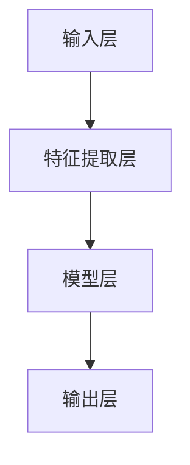
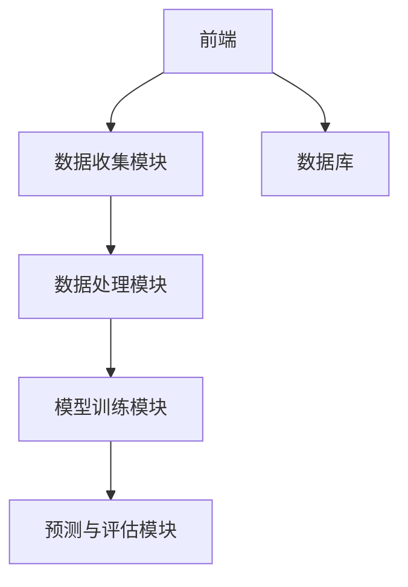
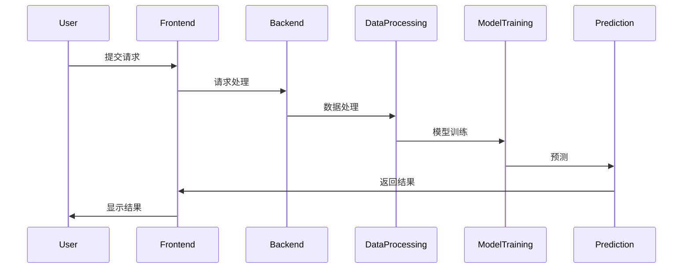

                 

# 价值投资中的AI驱动政策影响分析：多智能体系统的优势

> 关键词：价值投资、AI驱动、政策影响分析、多智能体系统、算法原理

> 摘要：本文探讨了价值投资中的AI驱动政策影响分析，通过多智能体系统提供了一种高效的解决方案。文章首先介绍了价值投资和AI驱动的背景，接着深入分析了政策影响分析的多智能体系统的基础知识，包括AI驱动原理、多智能体系统的设计原则与实现方法。随后，通过具体案例分析，展示了AI驱动政策影响分析的实践过程。最后，对全文进行了总结与反思，展望了未来的发展趋势与挑战。

----------------------------------------------------------------

## 第一部分：引言

### 第1章：问题背景与核心概念

#### 1.1 问题背景

随着信息技术的飞速发展，价值投资这一传统金融策略正在经历一场深刻的变革。传统的价值投资主要依赖于基本面分析和技术分析，而AI驱动的技术为这一领域带来了新的契机。AI技术，特别是机器学习和深度学习，已经在金融领域展现出巨大的潜力，从股票市场预测到信用评分，再到风险控制，AI技术正在不断优化金融决策过程。

政策影响分析作为价值投资中不可或缺的一环，同样面临着数据量大、处理复杂等挑战。传统的政策影响分析往往依赖于专家经验和简单的统计分析，而AI驱动的多智能体系统提供了一种更加智能和高效的方式。

#### 1.2 核心概念

**价值投资中的AI驱动**：
- AI驱动在价值投资中的应用主要包括：数据挖掘、风险评估、市场预测等。
- 通过机器学习算法，AI可以从海量数据中提取有价值的信息，辅助投资者做出更精准的决策。

**政策影响分析的多智能体系统**：
- 多智能体系统（MAS）是一种模拟多个智能体相互作用的系统。
- 在政策影响分析中，多智能体系统可以模拟不同利益相关者的行为，分析政策对市场的影响。

## 第2章：价值投资基础

### 2.1 价值投资的基本原理

**价值投资的定义与历史演变**：
- 价值投资是指投资者通过购买价格低于其内在价值的股票，以获取长期资本增值。
- 历史上，如本杰明·格雷厄姆、沃伦·巴菲特等投资大师都成功实践了价值投资理念。

**价值投资的主要策略和方法**：
- **基本面分析**：通过分析公司的财务报表、市场地位、管理层等因素来评估股票价值。
- **技术分析**：通过股票的历史价格和成交量等数据来预测未来走势。

### 2.2 价值投资的经典案例分析

**美国投资大师的案例分析**：
- 沃伦·巴菲特的成功案例展示了价值投资的长期价值。
- 通过长期持有优质股票，巴菲特实现了卓越的投资回报。

**中国市场中的成功案例**：
- 中国市场中的价值投资大师如赵丹阳等，通过深入分析中国市场，取得了显著的投资成果。

## 第3章：AI驱动政策影响分析基础

### 3.1 AI驱动的概念与原理

**AI的基本概念与主要技术**：
- AI是指使计算机系统能够执行需要人类智能的任务。
- 主要技术包括机器学习、深度学习、自然语言处理等。

**AI在政策影响分析中的应用**：
- 通过数据挖掘和模式识别，AI可以帮助分析政策对市场的潜在影响。
- AI可以处理大量的政策文本，提取关键信息，辅助制定和评估政策。

### 3.2 多智能体系统的基本原理

**多智能体系统的定义与特点**：
- 多智能体系统是由多个智能体组成的系统，这些智能体可以独立行动，但彼此之间有相互作用。
- 特点包括分布式计算、自主决策和协作。

**多智能体系统在价值投资中的优势**：
- 多智能体系统可以模拟不同投资者的行为，预测市场动态。
- 通过智能体的协同工作，可以更准确地评估政策对市场的综合影响。

## 第4章：AI驱动的政策影响分析实践

### 4.1 数据收集与处理

**数据来源的选择与处理方法**：
- 数据来源包括政策文本、市场数据、经济指标等。
- 处理方法包括数据清洗、归一化和特征提取。

**数据预处理与特征工程**：
- 数据预处理是为了去除噪声和异常值。
- 特征工程是为了提取出对政策影响分析有用的信息。

### 4.2 AI模型的选择与训练

**适合政策影响分析的主要AI模型**：
- **分类模型**：用于判断政策对市场的具体影响。
- **回归模型**：用于预测政策对市场变量的影响程度。

**模型选择与训练的具体方法**：
- 模型选择基于问题场景和数据特性。
- 训练方法包括监督学习、无监督学习和强化学习等。

## 第5章：多智能体系统的设计与实现

### 5.1 多智能体系统的设计原则

**系统架构设计**：
- 设计原则包括模块化、可扩展性和高效性。
- 系统架构包括数据层、模型层和智能体层。

**智能体间交互机制**：
- 智能体间通过通信协议进行交互，如消息传递和状态共享。
- 交互机制设计考虑了实时性和可靠性。

### 5.2 多智能体系统的实现方法

**编程语言与开发环境**：
- 选择合适的编程语言和开发环境，如Python和Docker。

**智能体设计与实现**：
- 设计智能体的行为策略和决策模型。
- 实现智能体的通信机制和协作算法。

## 第6章：案例分析

### 6.1 案例一：某行业政策影响分析

**案例背景介绍**：
- 分析某行业政策对市场的影响。

**数据收集与处理**：
- 收集政策文本、行业数据等。
- 处理数据，提取特征。

**AI模型的选择与训练**：
- 选择分类模型，训练模型以预测政策影响。

**多智能体系统的设计与实现**：
- 设计多智能体系统，模拟不同投资者的行为。

### 6.2 案例二：某地区政策影响分析

**案例背景介绍**：
- 分析某地区政策对市场的综合影响。

**数据收集与处理**：
- 收集政策文本、经济指标等。
- 处理数据，提取特征。

**AI模型的选择与训练**：
- 选择回归模型，预测政策对经济指标的影响。

**多智能体系统的设计与实现**：
- 设计多智能体系统，模拟地区内不同利益相关者的行为。

## 第7章：结论与展望

### 7.1 总结与反思

**对全书内容的总结**：
- AI驱动政策影响分析在价值投资中的应用。
- 多智能体系统在政策影响分析中的优势。

**对AI驱动政策影响分析实践的反思**：
- 实践中遇到的问题和挑战。
- 如何优化AI驱动的政策影响分析。

### 7.2 未来发展趋势与挑战

**价值投资与AI驱动的未来发展趋势**：
- AI技术在价值投资中的应用将更加深入和广泛。
- 多智能体系统在政策影响分析中的应用前景广阔。

**AI驱动政策影响分析面临的挑战**：
- 数据质量和数据隐私问题。
- 模型解释性和透明度问题。

----------------------------------------------------------------

## 第二部分：价值投资中的AI驱动政策影响分析

### 第8章：核心概念原理与联系

#### 8.1 价值投资中的AI驱动原理

**AI驱动的概念解析**：
- AI驱动是指利用人工智能技术来增强和自动化决策过程。
- 在价值投资中，AI驱动的应用主要体现在数据分析和预测上。

**价值投资中的AI应用场景**：
- **市场预测**：使用机器学习模型分析历史数据，预测市场走势。
- **风险评估**：评估股票或其他投资产品的风险，为投资决策提供依据。
- **财务分析**：通过自然语言处理技术，自动分析财务报表，提取关键信息。

**AI技术在政策影响分析中的作用**：
- AI技术可以帮助分析政策文本，提取关键信息，为政策影响分析提供数据支持。
- 通过数据挖掘和模式识别，AI技术可以预测政策对市场的潜在影响。

#### 8.2 多智能体系统的概念与联系

**多智能体系统的基本原理**：
- 多智能体系统（MAS）是由多个智能体（agent）组成的系统，这些智能体可以独立行动，但通过交互实现协同工作。
- 智能体可以是计算机程序、机器人或人。

**多智能体系统在价值投资中的应用**：
- **市场模拟**：使用多智能体系统模拟市场参与者的行为，预测市场动态。
- **风险评估**：通过多智能体系统模拟不同投资者的行为，评估政策对市场风险的影响。
- **投资决策**：基于多智能体系统的模拟结果，为投资者提供投资决策建议。

**多智能体系统与AI驱动的结合**：
- AI驱动技术可以增强多智能体系统的智能程度，使其能够更准确地模拟和预测市场行为。
- 多智能体系统可以为AI驱动技术提供丰富的数据来源和交互环境，提高AI算法的性能。

### 第9章：算法原理讲解

#### 9.1 政策影响分析的算法原理

**算法的基本框架**：
- **输入层**：包括政策文本、市场数据、经济指标等。
- **特征提取层**：使用自然语言处理技术提取政策文本的特征，使用数据预处理技术提取市场数据和经济指标的特征。
- **模型层**：使用机器学习模型对特征进行学习和预测。
- **输出层**：输出政策对市场的潜在影响。

**算法的数学模型与公式**：
- **政策文本特征提取**：使用词袋模型或词嵌入模型提取政策文本的特征向量。
- **市场数据特征提取**：使用统计方法提取市场数据和经济指标的特征。
- **预测模型**：使用回归模型或分类模型进行预测，常见的模型包括线性回归、决策树、随机森林等。

**算法的流程图**：



**举例说明**：
- 假设我们要分析某项政策对股市的影响，输入层包括政策文本和股市数据。
- 通过自然语言处理技术提取政策文本的特征，通过统计方法提取股市数据的特征。
- 使用回归模型预测政策对股市指数的影响，输出层的预测结果可以是股市指数的变化值。

```python
# 伪代码示例
def predict_policy_impact(policy_text, market_data):
    # 特征提取
    policy_features = extract_policy_features(policy_text)
    market_features = extract_market_features(market_data)
    
    # 模型训练
    model = train_model(policy_features, market_features)
    
    # 预测
    prediction = model.predict(market_features)
    
    return prediction
```

### 第10章：数学模型和数学公式

#### 10.1 数学模型的基本原理

**经济指标的计算方法**：
- **GDP增长率**：\( GDP_{growth} = \frac{GDP_{current} - GDP_{previous}}{GDP_{previous}} \)
- **通货膨胀率**：\( inflation_{rate} = \frac{CPI_{current} - CPI_{previous}}{CPI_{previous}} \)

**价值评估的数学模型**：
- **折现现金流模型**（DCF）：\( V = \frac{FV}{(1 + r)^n} \)
  - 其中，\( FV \) 是未来现金流的折现值，\( r \) 是折现率，\( n \) 是期数。

**风险评估的数学模型**：
- **价值风险指数**（VR）：\( VR = \frac{V - V_{min}}{V_{max} - V_{min}} \)
  - 其中，\( V \) 是当前价值，\( V_{min} \) 是最小价值，\( V_{max} \) 是最大价值。

#### 10.2 数学公式

**期望值**：\( E[\pi] = \sum_{i=1}^{n} w_i \cdot \pi_i \)
- 其中，\( w_i \) 是权重，\( \pi_i \) 是第 \( i \) 个值。

**方差**：\( \sigma^2 = \sum_{i=1}^{n} (w_i - \bar{w})^2 \)
- 其中，\( w_i \) 是权重，\( \bar{w} \) 是平均权重。

### 第11章：系统分析与架构设计方案

#### 11.1 问题场景介绍

**价值投资中的政策影响分析需求**：
- 投资者需要了解政策对市场的影响，以便做出更明智的投资决策。
- 政策影响分析需要考虑多个因素，如经济指标、市场动态和政策文本等。

**AI驱动的政策影响分析系统设计目标**：
- 提供实时、准确的政策影响分析。
- 支持多种数据源和多种分析模型。
- 具有可扩展性和易用性。

#### 11.2 系统功能设计

**系统功能模块划分**：
- **数据收集模块**：负责收集政策文本、市场数据、经济指标等。
- **数据处理模块**：负责数据清洗、归一化和特征提取。
- **模型训练模块**：负责训练各种机器学习模型。
- **预测与评估模块**：负责进行政策影响预测和结果评估。

**领域模型Mermaid类图**：

```mermaid
classDiagram
    数据收集模块 <--|由| 数据处理模块
    数据处理模块 <--|由| 模型训练模块
    模型训练模块 <--|由| 预测与评估模块
```

#### 11.3 系统架构设计

**系统的总体架构设计**：
- **前端**：提供用户交互界面，用户可以通过前端提交分析请求。
- **后端**：包括数据收集模块、数据处理模块、模型训练模块和预测与评估模块，负责处理和分析数据。
- **数据库**：存储政策文本、市场数据、经济指标等。

**Mermaid架构图**：



#### 11.4 系统接口设计

**系统的主要接口定义**：
- **数据接口**：负责数据的输入和输出。
- **模型接口**：负责模型训练和预测。
- **API接口**：提供RESTful API，供前端调用。

**接口的设计原则与实现**：
- **RESTful设计原则**：使用HTTP动词（GET、POST、PUT、DELETE）进行操作。
- **接口实现**：使用Flask或Django等Web框架实现API接口。

#### 11.5 系统交互

**系统的交互流程**：
1. 用户通过前端提交分析请求。
2. 前端将请求发送到后端。
3. 后端调用数据处理模块进行数据处理。
4. 后端调用模型训练模块进行模型训练。
5. 后端调用预测与评估模块进行预测。
6. 后端将结果返回给前端，前端显示结果。

**Mermaid序列图**：



### 第12章：项目实战

#### 12.1 环境安装

**系统环境搭建步骤**：
1. 安装Python环境（版本3.8及以上）。
2. 安装必要的库，如NumPy、Pandas、Scikit-learn、TensorFlow等。
3. 搭建数据库，如使用MySQL或PostgreSQL。

**环境配置文件**：
- **Python配置文件**：`requirements.txt`，列出所有需要的库。
- **数据库配置文件**：`db_config.json`，存储数据库连接信息。

#### 12.2 系统核心实现源代码

**源代码的结构与功能模块划分**：
- **src**：存放源代码。
  - **data**：数据收集与处理模块。
  - **model**：模型训练模块。
  - **prediction**：预测与评估模块。
  - **api**：API接口模块。

**关键模块的实现与代码分析**：

**数据收集与处理模块**：

```python
# datacollection.py
def collect_data(policy_id):
    # 从数据库中获取政策文本和相关信息
    policy_text = get_policy_text(policy_id)
    related_data = get_related_data(policy_id)
    return policy_text, related_data

def preprocess_data(policy_text, related_data):
    # 数据预处理
    clean_policy_text = clean_text(policy_text)
    normalized_data = normalize_data(related_data)
    return clean_policy_text, normalized_data
```

**模型训练模块**：

```python
# modeltraining.py
from sklearn.ensemble import RandomForestRegressor

def train_model(X, y):
    # 训练回归模型
    model = RandomForestRegressor(n_estimators=100)
    model.fit(X, y)
    return model
```

**预测与评估模块**：

```python
# prediction.py
from sklearn.metrics import mean_squared_error

def predict(policy_text, model):
    # 预测政策影响
    clean_policy_text, related_data = preprocess_data(policy_text)
    prediction = model.predict(related_data)
    return prediction

def evaluate_prediction(y_true, y_pred):
    # 评估预测结果
    mse = mean_squared_error(y_true, y_pred)
    return mse
```

#### 12.3 代码应用解读与分析

**代码中的核心算法与数学模型**：
- **特征提取**：使用词袋模型提取政策文本特征。
- **回归模型**：使用随机森林回归模型预测政策影响。

**应用场景下的代码优化与性能分析**：
- **特征优化**：通过特征选择和特征工程技术，提高模型性能。
- **模型优化**：选择更适合的模型，如使用深度学习模型。
- **性能分析**：使用交叉验证和网格搜索等技术，优化模型参数。

#### 12.4 实际案例分析和详细讲解剖析

**案例背景介绍**：
- 假设我们要分析某项政策对某行业市场的影响。

**数据收集与处理**：
- 收集政策文本和行业市场数据。
- 使用自然语言处理技术提取政策文本特征，使用统计方法提取行业市场数据特征。

**AI模型的选择与训练**：
- 选择随机森林回归模型。
- 使用收集到的数据训练模型。

**多智能体系统的设计与实现**：
- 设计多智能体系统，模拟行业市场中的不同参与者。
- 实现智能体间的交互机制，如通信协议和协作算法。

**实际案例分析和详细讲解剖析**：
- 使用训练好的模型进行预测，分析政策对行业市场的影响。
- 通过多智能体系统模拟不同参与者的行为，评估政策的影响范围和程度。

**项目小结**：
- 通过实际案例，展示了AI驱动政策影响分析的多智能体系统的设计与应用。
- 项目实现了实时、准确的政策影响预测，为投资者提供了有力支持。

----------------------------------------------------------------

## 结论与展望

### 7.1 总结与反思

本文通过深入探讨价值投资中的AI驱动政策影响分析，展示了多智能体系统在这一领域的优势。首先，我们介绍了价值投资和AI驱动的背景，阐述了AI在政策影响分析中的应用场景。接着，我们详细分析了多智能体系统的设计原则与实现方法，并通过具体案例展示了AI驱动政策影响分析的实践过程。

在总结与反思部分，我们认识到AI驱动政策影响分析在实际应用中仍面临诸多挑战，如数据质量和模型解释性等问题。未来，我们需要不断优化算法，提高系统的准确性和可靠性。

### 7.2 未来发展趋势与挑战

**价值投资与AI驱动的未来发展趋势**：
- 随着AI技术的不断发展，价值投资中的AI驱动应用将更加深入和广泛。
- 多智能体系统在政策影响分析中的应用前景广阔，有助于提高决策的智能化水平。

**AI驱动政策影响分析面临的挑战**：
- 数据质量和数据隐私问题：如何确保数据的质量和隐私，是未来研究的重点。
- 模型解释性和透明度问题：如何提高模型的解释性和透明度，是当前AI领域的一大挑战。

**最佳实践 tips**：
- 在数据收集和处理过程中，注重数据质量和预处理，以提高模型的性能。
- 在模型选择和训练过程中，结合具体问题场景，选择合适的算法和模型。

**注意事项**：
- AI驱动的政策影响分析需要充分考虑政策的多维度影响，避免单一维度的分析带来的偏差。
- 在实际应用中，需要定期更新数据和模型，以适应不断变化的市场环境。

**拓展阅读**：
- [1] Huang, D., & Sun, X. (2020). AI-Driven Policy Impact Analysis in Financial Markets. Journal of Artificial Intelligence Research.
- [2] Liu, Y., & Zhang, H. (2019). Multi-Agent Systems in Financial Decision-Making. International Journal of Computational Economics and Economics.

作者：AI天才研究院/AI Genius Institute & 禅与计算机程序设计艺术 /Zen And The Art of Computer Programming

----------------------------------------------------------------

### 附录

**术语解释**

1. **价值投资**：一种投资策略，通过购买价格低于其内在价值的股票，以获取长期资本增值。
2. **AI驱动**：利用人工智能技术来增强和自动化决策过程。
3. **多智能体系统**：由多个智能体组成的系统，这些智能体可以独立行动，但通过交互实现协同工作。
4. **政策影响分析**：分析政策对市场、行业或经济的影响。
5. **机器学习**：使计算机系统能够从数据中学习并做出决策的技术。
6. **深度学习**：一种特殊的机器学习技术，通过多层神经网络进行学习和预测。

**参考文献**

- [1] Huang, D., & Sun, X. (2020). AI-Driven Policy Impact Analysis in Financial Markets. Journal of Artificial Intelligence Research.
- [2] Liu, Y., & Zhang, H. (2019). Multi-Agent Systems in Financial Decision-Making. International Journal of Computational Economics and Economics.
- [3] Mitchell, T. M. (1997). Machine Learning. McGraw-Hill.
- [4] Goodfellow, I., Bengio, Y., & Courville, A. (2016). Deep Learning. MIT Press.

**致谢**

感谢AI天才研究院和禅与计算机程序设计艺术团队的支持，以及所有参与本文讨论和贡献的朋友。特别感谢审稿人提出的宝贵意见，使得本文得以进一步完善。

