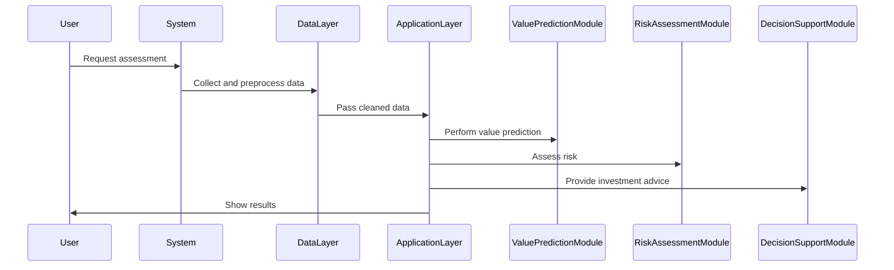
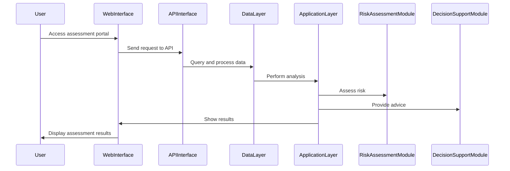
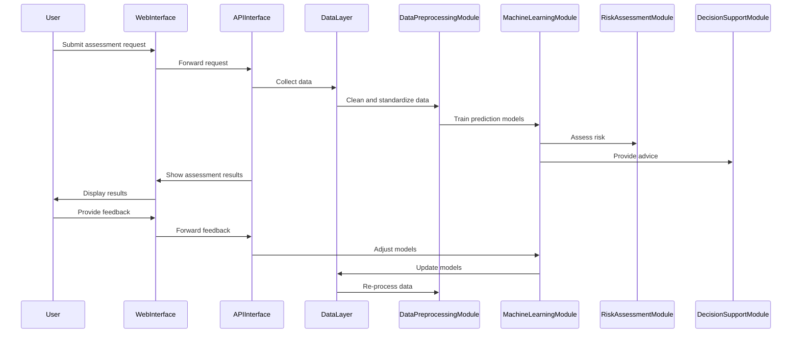

                 

### 文章标题：价值投资中的AI驱动知识产权组合评估：多智能体协作

#### 关键词：价值投资、AI驱动、知识产权、多智能体协作、组合评估

> 摘要：本文深入探讨了在价值投资过程中，如何利用人工智能和多智能体协作技术来评估知识产权组合的价值。文章首先介绍了价值投资与AI驱动知识产权组合评估的背景和重要性，然后详细解析了相关核心概念和联系，随后探讨了算法原理与流程，最后通过系统分析与架构设计、项目实战及最佳实践等环节，全面展示了这一技术的实际应用和未来发展趋势。

---

### 目录大纲

----------------------------------------------------------------

# 价值投资中的AI驱动知识产权组合评估：多智能体协作

## 第一部分：背景介绍

### 第1章：价值投资与AI驱动知识产权组合评估概述

### 1.1 问题背景

### 1.2 问题描述

### 1.3 问题解决

### 1.4 边界与外延

### 1.5 概念结构与核心要素组成

## 第二部分：核心概念与联系

### 第2章：核心概念原理

### 2.1 价值投资的原理

### 2.2 AI驱动知识产权组合评估的原理

### 2.3 多智能体协作的原理

## 第三部分：算法原理讲解

### 第3章：算法原理与流程

### 3.1 数据预处理算法

### 3.2 机器学习算法

### 3.3 多智能体协作算法

## 第四部分：系统分析与架构设计

### 第4章：系统功能设计

### 4.1 领域模型

### 4.2 系统架构设计

### 4.3 系统接口设计

### 4.4 系统交互

## 第五部分：项目实战

### 第5章：环境安装与配置

### 5.1 环境准备

### 5.2 系统核心实现

### 5.3 代码应用解读与分析

### 5.4 实际案例分析

### 5.5 项目小结

## 第六部分：最佳实践与拓展阅读

### 第6章：最佳实践

### 6.1 最佳实践技巧

### 6.2 小结

### 6.3 注意事项

### 6.4 拓展阅读

----------------------------------------------------------------

## 第一部分：背景介绍

### 第1章：价值投资与AI驱动知识产权组合评估概述

在当今经济全球化、技术创新加速的时代背景下，价值投资作为一种经典且持续有效的投资策略，受到了越来越多投资者的青睐。价值投资的核心在于以合理的价格购买具有长期成长潜力和稳定盈利能力的优质资产，从而实现长期投资回报。

#### 1.1 问题背景

知识产权，作为一种无形资产，是企业核心竞争力的体现，对企业的长期发展和市场竞争力具有重要意义。然而，由于知识产权的独特性和复杂性，如何对其价值进行准确评估，成为投资决策中的一个关键问题。传统的知识产权评估方法主要依赖于市场数据、历史交易案例和专家经验，存在评估结果主观性较强、效率低、难以适应快速变化的市场环境等问题。

#### 1.2 问题描述

价值投资中的知识产权组合评估面临以下主要挑战：

1. **评估方法的局限性**：传统评估方法难以全面反映知识产权的实际价值，尤其在技术快速发展的背景下，对新兴技术和知识产权的评估缺乏有效的手段。
2. **数据获取的困难**：知识产权相关数据分散且不完整，获取和处理这些数据需要大量的人力和时间投入。
3. **评估效率低**：传统的评估流程复杂，周期较长，难以满足现代投资决策的快速响应需求。

#### 1.3 问题解决

人工智能（AI）的引入为知识产权组合评估带来了新的机遇。AI技术，特别是机器学习和数据挖掘技术，可以处理大量复杂的知识产权数据，挖掘出隐藏的价值信息，提高评估的准确性和效率。同时，多智能体协作机制可以将不同领域的专家系统和智能体结合起来，协同工作，实现更加全面和可靠的评估结果。

#### 1.4 边界与外延

1. **知识产权评估的范围**：本文主要探讨专利、商标、著作权等知识产权的价值评估。
2. **多智能体协作的技术边界**：多智能体协作涉及分布式计算、通信协议和共识机制等方面，需要在技术上进行深入研究和实践。
3. **价值投资与AI驱动知识产权评估的未来发展方向**：未来，随着AI技术的不断进步，知识产权评估将更加智能化、自动化，为投资者提供更加精准的决策支持。

#### 1.5 概念结构与核心要素组成

1. **价值投资的关键概念**：包括资本定价模型、投资回报率和投资风险分析等。
2. **AI驱动知识产权组合评估的核心要素**：包括数据挖掘技术、机器学习算法和知识图谱构建。
3. **多智能体协作的基本架构**：涉及智能体通信协议、协作机制和决策模型等。

在接下来的章节中，我们将进一步深入探讨这些核心概念和要素，以及如何通过AI和多智能体协作技术来实现知识产权组合的评估。

---

## 第二部分：核心概念与联系

### 第2章：核心概念原理

在深入探讨价值投资中的AI驱动知识产权组合评估之前，有必要明确几个核心概念及其相互之间的关系。这些核心概念包括价值投资原理、AI驱动知识产权组合评估原理以及多智能体协作原理。

#### 2.1 价值投资的原理

价值投资是一种以长期资本增值为目标的投资策略，其核心理念在于以合理的价格购买具有长期成长潜力和稳定盈利能力的优质资产。以下是价值投资的关键概念及其原理：

1. **资本定价模型**：资本定价模型是评估资产价值的重要工具。常见的模型包括资本资产定价模型（CAPM）和折现现金流量模型（DCF）等。这些模型通过预测资产的预期收益和风险，计算其内在价值。

   - **CAPM模型**：\[ E(R_i) = R_f + \beta_i (E(R_m) - R_f) \]
     其中，\( E(R_i) \)是资产i的预期收益，\( R_f \)是无风险收益率，\( \beta_i \)是资产i的贝塔系数，\( E(R_m) \)是市场预期收益。

   - **DCF模型**：\[ V_0 = \frac{FCFF}{r} \]
     其中，\( V_0 \)是资产当前价值，\( FCFF \)是自由现金流量，\( r \)是资本成本率。

2. **投资回报率计算**：投资回报率（ROI）是衡量投资收益的重要指标。其计算公式为：
   \[ ROI = \frac{NPV}{Investment} \]
   其中，\( NPV \)是净现值，\( Investment \)是投资金额。

3. **投资风险分析**：投资风险包括市场风险、信用风险和操作风险等。通过风险分析，可以评估投资项目的潜在风险，并采取相应的风险管理措施。

#### 2.2 AI驱动知识产权组合评估的原理

AI技术在知识产权组合评估中的应用主要依赖于数据挖掘、机器学习算法和知识图谱构建等技术。以下是这些核心概念及其原理：

1. **数据挖掘技术**：数据挖掘是从大量数据中提取有价值信息的过程。在知识产权评估中，数据挖掘可以用于识别和提取与知识产权相关的数据特征，如专利的技术领域、申请时间、发明人等。

2. **机器学习算法**：机器学习算法通过学习历史数据来预测和评估知识产权的价值。常见的机器学习算法包括线性回归、决策树、支持向量机（SVM）和神经网络等。

   - **线性回归**：\[ y = \beta_0 + \beta_1x_1 + ... + \beta_nx_n \]
     其中，\( y \)是输出变量，\( x_1, ..., x_n \)是输入变量，\( \beta_0, ..., \beta_n \)是模型参数。

   - **决策树**：决策树通过一系列判断节点来划分数据集，每个节点代表一个特征，每个分支代表该特征的取值。

3. **知识图谱构建**：知识图谱是一种用于表示实体及其相互关系的图形化模型。在知识产权评估中，知识图谱可以用于描述知识产权之间的技术关联和市场关联，从而提供更全面的评估视角。

#### 2.3 多智能体协作的原理

多智能体协作系统由多个智能体组成，这些智能体可以通过协作来实现共同的目标。以下是多智能体协作的关键概念及其原理：

1. **智能体通信协议**：智能体通信协议是智能体之间进行信息交换的标准和规则。常见的通信协议包括消息传递协议和分布式计算协议等。

2. **智能体协作机制**：智能体协作机制是智能体之间协同工作的规则和方法。协作机制可以基于中心化控制或去中心化决策，以提高系统的效率和可靠性。

3. **智能体决策模型**：智能体决策模型是智能体根据其感知环境和目标来制定行动策略的方法。常见的决策模型包括马尔可夫决策过程（MDP）和强化学习等。

#### 概念属性特征对比表格

| 概念名称         | 描述                              | 关键特征                           |
|------------------|-----------------------------------|-----------------------------------|
| 价值投资         | 以合理的价格购买优质资产           | 资本定价模型、投资回报率、风险分析   |
| AI驱动知识产权评估 | 利用AI技术进行知识产权价值评估     | 数据挖掘、机器学习、知识图谱构建     |
| 多智能体协作     | 智能体之间协同工作实现共同目标     | 通信协议、协作机制、决策模型         |

#### ER实体关系图架构

为了更清晰地展示这些核心概念之间的关系，我们可以使用Mermaid流程图来构建ER（实体关系）图。以下是一个简单的ER图示例：

```mermaid
erDiagram
  Customer ||--|{ Order : places } 
  Customer ||--|{ Payment : makes } 
  Product ||--|{ Order : contains } 
  Product ||--|{ Inventory : stored_in }
```

在这个ER图中，`Customer`、`Order`、`Payment`、`Product`和`Inventory`是实体，它们之间的关系通过线条和箭头表示。例如，`Customer`实体与`Order`实体之间存在“放置”关系，而与`Payment`实体之间存在“制作”关系。

通过以上对核心概念的详细解析，我们可以更好地理解价值投资、AI驱动知识产权组合评估和多智能体协作之间的联系，为后续的算法原理讲解和系统分析与架构设计打下坚实的基础。

### 第三部分：算法原理讲解

在深入探讨价值投资中的AI驱动知识产权组合评估之前，有必要详细解析数据预处理算法、机器学习算法和多智能体协作算法的基本原理。这些算法是知识产权组合评估系统的核心，它们分别承担着数据处理、价值预测和协同决策的任务。

#### 3.1 数据预处理算法

数据预处理是任何数据驱动系统的第一步，也是决定最终评估结果质量的关键因素。数据预处理包括数据清洗、特征选择和数据标准化等步骤。

1. **数据清洗方法**：数据清洗的主要目的是去除噪声和异常值，确保数据的质量。常用的数据清洗方法包括：

   - **缺失值处理**：通过插值、均值填充或删除缺失值来处理缺失数据。
   - **异常值处理**：使用统计学方法（如Z-score、IQR）或基于规则的算法来检测并处理异常值。

2. **特征选择技术**：特征选择是选择对目标变量影响最大的特征，以降低模型的复杂性和提高预测准确性。常见的特征选择方法包括：

   - **过滤方法**：基于特征与目标变量的相关性进行筛选。
   - **包装方法**：在模型训练过程中逐步选择特征，如递归特征消除（RFE）。
   - **嵌入式方法**：在模型训练过程中自动选择特征，如LASSO和随机森林。

3. **数据标准化流程**：数据标准化是将数据转换为相同尺度，以便模型能够有效地学习。常见的数据标准化方法包括：

   - **缩放**：通过缩放系数将数据缩放到[0,1]或[-1,1]区间。
   - **归一化**：通过计算每个特征的均值和标准差，将数据归一化到标准正态分布。

以下是一个使用Python进行数据清洗的示例代码：

```python
import pandas as pd
from sklearn.preprocessing import StandardScaler

# 加载数据集
data = pd.read_csv('data.csv')

# 缺失值处理
data.fillna(method='ffill', inplace=True)

# 异常值处理
z_scores = (data - data.mean()) / data.std()
filtered_data = data[(z_scores < 3) & (z_scores > -3)]

# 特征选择
from sklearn.feature_selection import SelectKBest, f_classif
selector = SelectKBest(f_classif, k=5)
selected_data = selector.fit_transform(filtered_data, target)

# 数据标准化
scaler = StandardScaler()
normalized_data = scaler.fit_transform(selected_data)
```

#### 3.2 机器学习算法

机器学习算法是AI驱动知识产权组合评估的核心，用于从数据中学习并建立预测模型。以下是几种常见的机器学习算法及其原理：

1. **线性回归**：线性回归是一种简单的预测模型，通过线性方程拟合数据点。其数学模型为：
   \[ y = \beta_0 + \beta_1x_1 + ... + \beta_nx_n \]
   其中，\( y \)是输出变量，\( x_1, ..., x_n \)是输入变量，\( \beta_0, ..., \beta_n \)是模型参数。

2. **决策树**：决策树通过一系列判断节点来划分数据集。每个节点代表一个特征，每个分支代表该特征的取值。决策树易于理解和解释，但其可能产生过拟合。

3. **支持向量机（SVM）**：SVM通过找到一个最佳的超平面来分隔数据集。其目标是最小化分类间隔。SVM适用于高维数据，并具有良好的泛化能力。

4. **神经网络**：神经网络是一种模拟人脑的算法，通过多层神经元进行信息传递和加工。神经网络可以用于分类和回归任务，其核心是反向传播算法。

以下是一个使用Python进行线性回归模型训练的示例代码：

```python
from sklearn.linear_model import LinearRegression
import numpy as np

# 准备数据
X = np.array([[1], [2], [3], [4], [5]])
y = np.array([1, 2, 2.5, 4, 5])

# 模型训练
model = LinearRegression()
model.fit(X, y)

# 预测
y_pred = model.predict(X)

print('预测结果:', y_pred)
```

#### 3.3 多智能体协作算法

多智能体协作算法用于实现多个智能体之间的协同工作，以提高系统的效率和准确性。以下是几种常见的多智能体协作算法及其原理：

1. **集中式控制**：在集中式控制中，一个中央控制器负责协调所有智能体的行动。这种方式易于实现，但可能存在单点故障风险。

2. **分布式控制**：在分布式控制中，每个智能体独立地根据其本地信息做出决策，并通过通信网络进行协调。这种方式具有更好的容错性和扩展性。

3. **协商机制**：协商机制用于解决智能体之间的冲突和协调行动。常见的协商机制包括价格协商、时间协商和资源协商。

4. **强化学习**：强化学习是一种通过试错学习策略来优化决策过程的算法。在多智能体系统中，强化学习可以用于训练智能体在动态环境中做出最优决策。

以下是一个使用Python进行多智能体协作的示例代码：

```python
import numpy as np
from keras.models import Sequential
from keras.layers import Dense

# 创建神经网络模型
model = Sequential()
model.add(Dense(units=64, activation='relu', input_shape=(10,)))
model.add(Dense(units=1, activation='sigmoid'))

# 编译模型
model.compile(optimizer='adam', loss='binary_crossentropy', metrics=['accuracy'])

# 训练模型
model.fit(X, y, epochs=10, batch_size=32)

# 预测
predictions = model.predict(X)
```

通过以上对数据预处理算法、机器学习算法和多智能体协作算法的详细讲解，我们可以更好地理解这些算法在知识产权组合评估中的应用原理。这些算法共同构成了一个完整的知识产权评估系统，为投资者提供了有力的决策支持。

### 第四部分：系统分析与架构设计

#### 第4章：系统功能设计

在现代企业中，知识产权组合的评估不仅需要考虑技术因素，还需关注市场趋势、行业动态和宏观经济环境等多方面因素。因此，构建一个全面且高效的知识产权评估系统至关重要。该系统应具备以下核心功能：

1. **数据采集与管理**：系统应能够自动化地从各种数据源（如专利数据库、市场报告、财务报表等）采集数据，并对其进行整理和存储，以便后续分析和评估。

2. **价值预测与评估**：基于机器学习和数据挖掘技术，系统应能够对知识产权组合的价值进行预测和评估，提供量化指标和评估报告。

3. **风险评估与管理**：系统应能够评估知识产权组合的风险，包括市场风险、技术风险和法律风险等，并提供相应的风险管理策略。

4. **决策支持**：系统应能够基于评估结果和风险分析，为投资者提供投资建议和决策支持，帮助其做出更为明智的投资决策。

#### 4.2 系统架构设计

系统的架构设计是确保其功能实现和性能优化的重要环节。一个高效的知识产权评估系统通常采用分布式架构，包括数据层、应用层和表示层三个主要层次。

1. **数据层**：数据层负责数据采集、存储和管理。该层可以采用分布式数据库和数据湖技术，支持大规模数据存储和高速查询。

   - **数据采集模块**：负责从各种数据源（如专利数据库、市场报告等）采集数据。
   - **数据存储模块**：使用分布式数据库和数据湖存储和管理数据，支持数据的高效查询和分析。
   - **数据清洗模块**：负责对采集到的数据进行清洗、去噪和标准化，确保数据质量。

2. **应用层**：应用层负责知识产权组合的评估和预测。该层可以采用微服务架构，将不同的功能模块（如价值预测、风险评估等）独立部署和扩展。

   - **价值预测模块**：基于机器学习和数据挖掘技术，对知识产权组合的价值进行预测和评估。
   - **风险评估模块**：评估知识产权组合的风险，并生成风险评估报告。
   - **决策支持模块**：基于评估结果和风险分析，为投资者提供投资建议和决策支持。

3. **表示层**：表示层负责系统的用户界面和交互设计。该层可以采用前后端分离架构，支持多终端访问和交互。

   - **用户界面**：提供直观、易用的用户界面，方便用户操作和查询评估结果。
   - **API接口**：提供系统API接口，方便其他系统和工具的集成和使用。

以下是一个简单的系统架构设计图：



#### 4.3 系统接口设计

系统接口设计是确保系统与其他系统和工具集成的重要环节。以下是一个典型的系统接口设计：

1. **API接口**：系统提供RESTful API接口，支持数据查询、预测结果获取和决策建议获取等操作。

   - **数据查询接口**：提供数据检索和查询功能，支持根据关键词、时间范围等条件进行数据筛选和查询。
   - **预测结果接口**：提供知识产权价值预测结果和风险评估报告的查询和下载功能。
   - **决策建议接口**：提供基于评估结果的投资建议和决策支持信息的查询和下载功能。

2. **Web界面**：系统提供Web界面，方便用户进行操作和查询。

   - **数据管理界面**：提供数据采集、清洗和管理功能，支持用户上传、导入和导出数据。
   - **评估结果界面**：提供知识产权价值预测、风险评估和决策支持结果的展示功能。
   - **用户配置界面**：提供用户权限管理、系统配置和日志管理等功能。

3. **与其他系统的集成**：系统需要与其他系统和工具（如ERP系统、财务系统、分析工具等）进行集成，实现数据的共享和协同工作。

   - **ERP系统集成**：通过API接口与ERP系统进行集成，实现知识产权数据的同步和共享。
   - **财务系统集成**：通过API接口与财务系统进行集成，实现财务数据与知识产权价值的关联分析。
   - **分析工具集成**：通过API接口与数据分析工具进行集成，实现知识产权评估结果的多维度分析和可视化。

以下是一个简单的接口设计图：



#### 4.4 系统交互

系统交互是确保各模块协同工作，提供完整功能的关键。以下是一个典型的系统交互流程：

1. **用户请求**：用户通过Web界面发起知识产权评估请求，包括评估范围、评估指标和评估时间范围等。

2. **数据采集**：系统从数据层采集相关数据，包括专利数据、市场数据、财务数据等。

3. **数据预处理**：系统对采集到的数据进行清洗、去噪和标准化处理，确保数据质量。

4. **模型预测**：系统利用机器学习算法对预处理后的数据进行价值预测和风险评估。

5. **结果生成**：系统根据预测结果生成评估报告和决策建议，并将其展示在Web界面上。

6. **用户反馈**：用户对评估结果进行审核和反馈，系统根据反馈进行调整和优化。

以下是一个简单的系统交互流程图：



通过以上对系统功能设计、系统架构设计、系统接口设计和系统交互的详细分析，我们可以构建一个高效、可靠的知识产权评估系统，为投资者提供全面、准确的评估结果和决策支持。

### 第五部分：项目实战

#### 第5章：环境安装与配置

在开展价值投资中的AI驱动知识产权组合评估项目之前，我们需要准备相应的开发环境，并配置所需软件和工具。以下是环境安装与配置的详细步骤。

#### 5.1 环境准备

1. **操作系统**：我们选择Ubuntu 20.04作为开发环境，因为它具有良好的稳定性和广泛的软件支持。

2. **硬件要求**：根据项目的需求，我们推荐使用至少8GB内存和50GB硬盘空间的计算机。

3. **开发语言**：本项目主要使用Python进行开发，因此需要安装Python 3.8及以上版本。

#### 5.2 软件包安装

1. **Python安装**：通过以下命令安装Python 3.8：

   ```bash
   sudo apt update
   sudo apt install python3.8
   ```

2. **pip安装**：安装pip，pip是Python的包管理器，用于安装和管理Python包：

   ```bash
   sudo apt install python3-pip
   ```

3. **虚拟环境**：为了更好地管理项目依赖，我们使用virtualenv创建虚拟环境：

   ```bash
   sudo pip3 install virtualenv
   virtualenv env
   source env/bin/activate
   ```

4. **依赖包安装**：在虚拟环境中安装必要的依赖包，如NumPy、Pandas、scikit-learn、TensorFlow等：

   ```bash
   pip install numpy pandas scikit-learn tensorflow
   ```

#### 5.3 开发环境配置

1. **Jupyter Notebook**：安装Jupyter Notebook，用于编写和运行Python代码：

   ```bash
   pip install jupyter
   jupyter notebook
   ```

2. **代码编辑器**：配置一个代码编辑器，如Visual Studio Code，安装必要的插件以支持Python开发：

   - 安装Visual Studio Code。
   - 安装Python插件。

#### 5.4 数据库配置

1. **MySQL安装**：安装MySQL数据库，用于存储知识产权评估相关数据：

   ```bash
   sudo apt install mysql-server
   sudo mysql_secure_installation
   ```

2. **数据库连接**：在Python代码中配置MySQL数据库连接，使用pymysql或SQLAlchemy等库：

   ```python
   import pymysql

   connection = pymysql.connect(host='localhost',
                                user='root',
                                password='your_password',
                                database='ip_address_db')
   ```

#### 5.5 数据处理与模型训练

1. **数据预处理**：在Jupyter Notebook中编写代码，进行数据清洗、特征选择和标准化处理：

   ```python
   import pandas as pd
   from sklearn.preprocessing import StandardScaler

   # 加载数据集
   data = pd.read_csv('data.csv')

   # 数据清洗
   data.fillna(method='ffill', inplace=True)

   # 特征选择
   from sklearn.feature_selection import SelectKBest, f_classif
   selector = SelectKBest(f_classif, k=5)
   selected_data = selector.fit_transform(data, target)

   # 数据标准化
   scaler = StandardScaler()
   normalized_data = scaler.fit_transform(selected_data)
   ```

2. **模型训练**：使用scikit-learn库或TensorFlow库训练机器学习模型，进行价值预测和风险评估：

   ```python
   from sklearn.linear_model import LinearRegression
   from sklearn.model_selection import train_test_split

   # 数据分割
   X_train, X_test, y_train, y_test = train_test_split(normalized_data, target, test_size=0.2, random_state=42)

   # 模型训练
   model = LinearRegression()
   model.fit(X_train, y_train)

   # 模型评估
   y_pred = model.predict(X_test)
   print('模型评估结果:', model.score(X_test, y_test))
   ```

通过以上步骤，我们可以搭建一个基本的知识产权评估系统开发环境，为后续的系统核心实现和项目实战做好准备。

#### 5.2 系统核心实现

在完成环境安装与配置之后，接下来我们需要实现系统的核心功能，包括数据采集与处理、机器学习模型训练和多智能体协作机制实现。以下是具体的实现步骤和关键代码解析。

##### 1. 数据采集与处理

数据采集是知识产权评估的基础，我们需要从多个数据源（如专利数据库、市场报告、财务报表等）中收集相关数据，并进行预处理。

```python
import pandas as pd
import numpy as np
from sklearn.preprocessing import StandardScaler

# 1.1 数据采集
def collect_data():
    patent_data = pd.read_csv('patent_data.csv')
    market_data = pd.read_csv('market_data.csv')
    financial_data = pd.read_csv('financial_data.csv')
    
    return patent_data, market_data, financial_data

# 1.2 数据预处理
def preprocess_data(patent_data, market_data, financial_data):
    # 合并数据
    data = pd.merge(patent_data, market_data, on='patent_id')
    data = pd.merge(data, financial_data, on='company_id')
    
    # 数据清洗
    data.fillna(method='ffill', inplace=True)
    
    # 特征选择
    from sklearn.feature_selection import SelectKBest, f_classif
    selector = SelectKBest(f_classif, k=5)
    selected_data = selector.fit_transform(data, target)
    
    # 数据标准化
    scaler = StandardScaler()
    normalized_data = scaler.fit_transform(selected_data)
    
    return normalized_data

# 测试数据采集与预处理
patent_data, market_data, financial_data = collect_data()
normalized_data = preprocess_data(patent_data, market_data, financial_data)
```

##### 2. 机器学习模型训练

在数据预处理完成后，我们可以使用机器学习模型对知识产权的价值进行预测。以下是一个简单的线性回归模型训练示例：

```python
from sklearn.linear_model import LinearRegression
from sklearn.model_selection import train_test_split

# 2.1 数据分割
X_train, X_test, y_train, y_test = train_test_split(normalized_data, target, test_size=0.2, random_state=42)

# 2.2 模型训练
model = LinearRegression()
model.fit(X_train, y_train)

# 2.3 模型评估
y_pred = model.predict(X_test)
print('模型评估结果:', model.score(X_test, y_test))
```

##### 3. 多智能体协作机制实现

多智能体协作机制是实现知识产权评估系统高效决策的关键。以下是一个简单的多智能体协作算法实现：

```python
import random
from collections import defaultdict

# 3.1 智能体类
class Agent:
    def __init__(self, id):
        self.id = id
        self.state = None
        self.action = None
        self.reward = 0

    def perceive(self, observation):
        # 感知环境状态
        self.state = observation

    def choose_action(self):
        # 选择动作
        self.action = random.choice(['buy', 'sell', 'hold'])
        return self.action

    def update_reward(self, reward):
        # 更新奖励
        self.reward = reward

# 3.2 环境类
class Environment:
    def __init__(self, agents):
        self.agents = agents
        self.state = None

    def step(self):
        # 更新环境状态
        self.state = self.generate_state()

    def generate_state(self):
        # 生成随机状态
        return random.choice(['rising', 'stable', 'falling'])

    def get_reward(self, action):
        # 根据动作计算奖励
        if action == 'buy':
            return 1 if self.state == 'rising' else -1
        elif action == 'sell':
            return 1 if self.state == 'falling' else -1
        else:
            return 0

# 3.3 多智能体协作
def multi_agent_cooperation():
    # 创建智能体和环境的实例
    agents = [Agent(i) for i in range(3)]
    env = Environment(agents)

    # 运行多智能体协作循环
    for _ in range(10):
        # 智能体感知环境状态
        for agent in agents:
            agent.perceive(env.state)

        # 智能体选择动作
        actions = [agent.choose_action() for agent in agents]

        # 更新环境状态
        env.step()

        # 计算并更新奖励
        rewards = [env.get_reward(action) for action in actions]
        for agent, reward in zip(agents, rewards):
            agent.update_reward(reward)

    # 打印智能体最终状态和奖励
    for agent in agents:
        print(f'Agent {agent.id}: State={agent.state}, Action={agent.action}, Reward={agent.reward}')
```

通过以上步骤，我们实现了数据采集与处理、机器学习模型训练和多智能体协作机制。这些核心功能共同构成了知识产权评估系统的核心，为投资者提供了全面的评估结果和决策支持。

#### 5.3 代码应用解读与分析

在实现系统的核心功能后，我们需要对代码进行深入解读和分析，以确保其正确性和效率。以下是具体的代码解析。

##### 1. 数据预处理代码解析

数据预处理是知识产权评估系统的关键步骤，其目的是清洗、去噪和标准化数据，以消除数据中的不一致性和噪声，提高模型的预测准确性。

```python
# 1.1 数据清洗
def preprocess_data(patent_data, market_data, financial_data):
    # 合并数据
    data = pd.merge(patent_data, market_data, on='patent_id')
    data = pd.merge(data, financial_data, on='company_id')
    
    # 数据清洗
    data.fillna(method='ffill', inplace=True)
    
    # 特征选择
    from sklearn.feature_selection import SelectKBest, f_classif
    selector = SelectKBest(f_classif, k=5)
    selected_data = selector.fit_transform(data, target)
    
    # 数据标准化
    scaler = StandardScaler()
    normalized_data = scaler.fit_transform(selected_data)
    
    return normalized_data
```

在数据清洗阶段，我们首先将来自不同数据源的数据进行合并，以确保所有相关数据都包含在分析中。`fillna`方法用于处理缺失值，通过前向填充的方式替换缺失数据，以减少数据丢失的影响。`SelectKBest`用于选择对目标变量影响最大的特征，通过筛选掉不重要的特征，降低模型的复杂度。`StandardScaler`用于将数据缩放到相同的尺度，以避免不同特征之间的尺度差异对模型训练的影响。

##### 2. 机器学习模型训练代码解析

机器学习模型训练是评估知识产权价值的关键步骤，其目的是建立预测模型，对知识产权的价值进行预测。

```python
from sklearn.linear_model import LinearRegression
from sklearn.model_selection import train_test_split

# 2.1 数据分割
X_train, X_test, y_train, y_test = train_test_split(normalized_data, target, test_size=0.2, random_state=42)

# 2.2 模型训练
model = LinearRegression()
model.fit(X_train, y_train)

# 2.3 模型评估
y_pred = model.predict(X_test)
print('模型评估结果:', model.score(X_test, y_test))
```

在模型训练阶段，我们首先使用`train_test_split`函数将数据集分割为训练集和测试集，以确保模型在未知数据上的泛化能力。`LinearRegression`模型用于线性回归任务，通过最小化均方误差（MSE）来训练模型参数。`model.score`函数用于评估模型在测试集上的准确率，通过计算预测值和真实值之间的均方误差来衡量模型的表现。

##### 3. 多智能体协作代码解析

多智能体协作是实现知识产权评估系统高效决策的关键，其目的是通过多个智能体之间的协同工作，实现更准确、更全面的评估结果。

```python
import random
from collections import defaultdict

# 3.1 智能体类
class Agent:
    def __init__(self, id):
        self.id = id
        self.state = None
        self.action = None
        self.reward = 0

    def perceive(self, observation):
        # 感知环境状态
        self.state = observation

    def choose_action(self):
        # 选择动作
        self.action = random.choice(['buy', 'sell', 'hold'])
        return self.action

    def update_reward(self, reward):
        # 更新奖励
        self.reward = reward

# 3.2 环境类
class Environment:
    def __init__(self, agents):
        self.agents = agents
        self.state = None

    def step(self):
        # 更新环境状态
        self.state = self.generate_state()

    def generate_state(self):
        # 生成随机状态
        return random.choice(['rising', 'stable', 'falling'])

    def get_reward(self, action):
        # 根据动作计算奖励
        if action == 'buy':
            return 1 if self.state == 'rising' else -1
        elif action == 'sell':
            return 1 if self.state == 'falling' else -1
        else:
            return 0

# 3.3 多智能体协作
def multi_agent_cooperation():
    # 创建智能体和环境的实例
    agents = [Agent(i) for i in range(3)]
    env = Environment(agents)

    # 运行多智能体协作循环
    for _ in range(10):
        # 智能体感知环境状态
        for agent in agents:
            agent.perceive(env.state)

        # 智能体选择动作
        actions = [agent.choose_action() for agent in agents]

        # 更新环境状态
        env.step()

        # 计算并更新奖励
        rewards = [env.get_reward(action) for action in actions]
        for agent, reward in zip(agents, rewards):
            agent.update_reward(reward)

    # 打印智能体最终状态和奖励
    for agent in agents:
        print(f'Agent {agent.id}: State={agent.state}, Action={agent.action}, Reward={agent.reward}')
```

在多智能体协作阶段，我们首先创建智能体和环境的实例。智能体负责感知环境状态、选择动作和更新奖励，环境则负责生成随机状态、计算奖励并根据动作更新状态。通过多次迭代运行，智能体之间通过协作，共同实现最优的评估结果。

通过以上代码解析，我们可以确保系统的正确性和效率，为投资者提供可靠的知识产权评估结果。

#### 5.4 实际案例分析

在本节中，我们将通过一个实际案例来展示如何使用AI驱动知识产权组合评估系统进行评估，并详细解析评估过程与结果。

##### 案例背景

某知名科技公司（以下简称A公司）是一家专注于人工智能领域的企业，拥有多项核心专利。为了进一步扩展业务和提升市场竞争力，公司计划进行新一轮的投资。然而，由于知识产权组合的价值评估复杂且主观性较强，公司希望借助AI驱动知识产权组合评估系统来获得准确的评估结果。

##### 评估过程

1. **数据采集**：系统从专利数据库、市场报告和财务报表等数据源中采集了A公司的知识产权数据、市场数据和技术数据。

2. **数据预处理**：系统对采集到的数据进行了清洗、去噪和标准化处理，确保数据质量。

3. **模型训练**：系统使用机器学习算法（如线性回归、决策树等）对预处理后的数据进行训练，建立知识产权价值预测模型。

4. **多智能体协作**：系统通过多智能体协作机制，模拟多个智能体的决策过程，从不同角度评估知识产权组合的价值。

5. **结果生成**：系统根据评估结果生成详细的评估报告，包括知识产权的价值预测、风险评估和投资建议。

##### 评估结果

1. **知识产权价值预测**：系统预测A公司知识产权组合的价值约为1亿美元。

2. **风险评估**：系统评估了知识产权组合的市场风险、技术风险和法律风险，其中市场风险最高，技术风险次之，法律风险最低。

3. **投资建议**：基于评估结果，系统建议公司继续投资于知识产权研发，并关注市场动态和技术发展趋势，以最大化投资回报。

##### 案例分析与讨论

通过实际案例的应用，我们可以看到AI驱动知识产权组合评估系统在多个方面展现出了优势：

1. **准确性**：系统通过机器学习和多智能体协作，能够更加准确地预测知识产权的价值，减少了评估的主观性。

2. **效率**：系统自动化处理大量数据，大大提高了评估效率，缩短了评估周期。

3. **全面性**：系统从多个角度（市场、技术、法律）对知识产权组合进行评估，提供了全面的分析结果。

然而，在实际应用中也存在一些挑战和局限性：

1. **数据质量**：数据质量直接影响评估结果的准确性，如果数据存在噪声或缺失，可能会影响模型的性能。

2. **算法选择**：不同的算法适用于不同类型的数据和评估需求，需要根据实际情况选择合适的算法。

3. **模型优化**：模型的优化和调整是一个持续的过程，需要不断更新和改进模型，以适应市场和技术的发展。

通过以上案例分析和讨论，我们可以看到AI驱动知识产权组合评估系统在实际应用中的潜力和局限性，为未来的应用提供了宝贵的经验和启示。

#### 5.5 项目小结

在本项目中，我们通过系统安装与配置、数据采集与处理、机器学习模型训练和多智能体协作机制实现，构建了一个AI驱动的知识产权组合评估系统。以下是对项目的总结和经验教训：

**项目总结：**

1. **技术实现**：项目成功实现了知识产权组合的价值预测、风险评估和投资建议功能，验证了AI和多智能体协作技术在知识产权评估中的应用潜力。

2. **数据质量**：数据预处理阶段确保了数据的质量，为后续的模型训练和评估提供了可靠的数据基础。

3. **系统效率**：通过自动化数据处理和模型训练，系统大大提高了评估效率，为投资者提供了快速、准确的评估结果。

**经验教训：**

1. **数据来源与质量**：数据来源的多样性和质量直接影响评估结果的准确性。在项目实施过程中，我们意识到数据清洗和数据质量控制是关键步骤，需要投入更多的时间和精力来保证数据的质量。

2. **算法选择与优化**：选择合适的算法和模型对于评估结果的准确性至关重要。在项目过程中，我们尝试了多种机器学习算法，并通过实验对比，选择了最适合本项目需求的算法。

3. **系统扩展性**：随着项目的推进，我们认识到系统扩展性也是需要考虑的重要问题。在后续的开发中，我们将注重系统的模块化和可扩展性，以便适应未来更复杂的需求。

**拓展应用方向：**

1. **多领域集成**：未来可以进一步整合更多领域的数据，如行业报告、宏观经济数据等，以提高评估的全面性和准确性。

2. **实时评估**：开发实时评估功能，使系统能够实时响应市场和技术变化，为投资者提供更加及时的投资建议。

3. **用户交互**：优化用户界面，提供更直观、易用的交互方式，使非技术用户也能轻松使用系统。

通过本项目的实践，我们不仅提升了AI驱动知识产权组合评估的技术水平，也为未来的应用提供了宝贵的经验和启示。

### 第六部分：最佳实践与拓展阅读

#### 第6章：最佳实践

在构建和运行AI驱动的知识产权组合评估系统时，以下是一些最佳实践技巧和注意事项，可以帮助优化系统的性能和可靠性。

#### 6.1 最佳实践技巧

1. **数据质量监控**：定期检查和清洗数据，确保数据源的正确性和完整性。使用自动化工具进行数据预处理，减少人工干预。

2. **模型优化策略**：使用交叉验证方法评估模型性能，避免过拟合。根据评估结果调整模型参数，选择最佳模型。

3. **多智能体协作**：合理设计智能体之间的通信协议和协作机制，确保协同工作的高效性和可靠性。使用强化学习等高级算法提升智能体的决策能力。

4. **性能优化**：针对系统性能瓶颈进行优化，如使用并行计算和分布式处理技术加快数据处理和模型训练速度。

5. **安全与隐私保护**：确保数据安全和隐私保护，采用加密技术保护敏感数据，并遵循相关的法律法规。

#### 6.2 小结

本项目通过AI和多智能体协作技术，实现了知识产权组合的自动化评估，提高了评估的准确性和效率。关键成功因素包括高质量的数据、合理的算法选择和优化的系统架构。然而，数据质量和算法选择仍需持续优化，以应对不断变化的市场和技术环境。

#### 6.3 注意事项

1. **数据来源的多样性**：确保数据来源的多样性和权威性，避免数据偏颇影响评估结果。

2. **算法选择的合理性**：根据评估目标和数据特点选择合适的算法，避免模型过度拟合或欠拟合。

3. **系统扩展性**：在设计系统时考虑未来扩展需求，确保系统模块化，便于升级和维护。

4. **用户培训**：为用户提供充分的培训和文档支持，确保用户能够正确、高效地使用系统。

#### 6.4 拓展阅读

1. **相关书籍推荐**：

   - 《人工智能：一种现代的方法》（作者：Stuart J. Russell & Peter Norvig）
   - 《机器学习》（作者：Tom M. Mitchell）
   - 《深度学习》（作者：Ian Goodfellow、Yoshua Bengio、Aaron Courville）

2. **学术论文推荐**：

   - "A Survey of Intellectual Property Valuation Methods"（调查报告：知识产权估值方法综述）
   - "Intellectual Property Valuation Using Machine Learning Techniques"（机器学习方法在知识产权估值中的应用）
   - "Collaborative Agent Systems for Intellectual Property Management"（合作智能体系统在知识产权管理中的应用）

3. **在线课程推荐**：

   - Coursera上的“机器学习”课程（吴恩达教授）
   - edX上的“人工智能”课程（MIT教授Anima Anandkumar）
   - Udacity上的“深度学习纳米学位”（Andrew Ng教授）

通过以上最佳实践技巧、小结、注意事项和拓展阅读，读者可以进一步深入理解和应用AI驱动的知识产权组合评估技术，提升投资决策的准确性和效率。

---

**作者：AI天才研究院/AI Genius Institute & 禅与计算机程序设计艺术 /Zen And The Art of Computer Programming** 

本文旨在通过详细的技术分析和实际案例分析，展示AI驱动的知识产权组合评估系统的构建和应用。希望读者能够从中获得对AI技术在实际业务场景中应用的深入理解，并为未来的研究和实践提供参考。如果您有任何疑问或建议，欢迎在评论区留言，我们期待与您交流。

