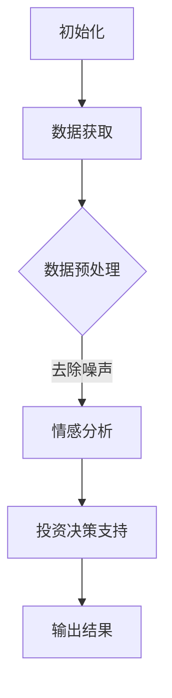
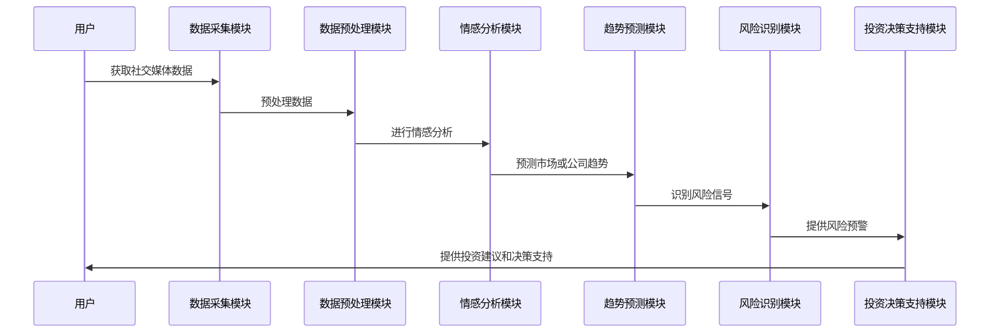

                 


### 引言：价值投资与AI驱动社交媒体影响力分析的结合

#### 问题背景

在当今信息爆炸的时代，价值投资作为传统金融领域的一种重要策略，正面临着前所未有的挑战和机遇。价值投资的核心在于识别被市场低估的高质量资产，长期持有并从中获得稳定的投资回报。然而，随着社交媒体的崛起，信息传播速度极快，市场情绪容易受到短期因素的影响，这使得传统的价值投资策略面临着新的困境。

社交媒体作为现代信息传播的主要渠道之一，已经成为投资者获取信息和表达观点的重要平台。然而，社交媒体上的信息繁杂且质量参差不齐，如何从中提取出对投资决策有用的信息，成为了一个亟待解决的问题。这就需要引入人工智能（AI）的技术手段，通过对社交媒体数据的智能分析，帮助投资者更准确地把握市场动态和公司基本面。

#### 问题描述

当前，在价值投资中应用AI驱动社交媒体影响力分析，主要存在以下问题：

1. **信息过载**：社交媒体上的信息量庞大，如何有效地筛选和处理这些信息，提取出对投资决策有价值的内容，是一个巨大的挑战。
2. **噪声干扰**：社交媒体上的信息存在大量的噪声和误导性信息，如何过滤掉这些噪声，识别出真正的市场信号，是另一个关键问题。
3. **情绪分析难度**：社交媒体上的信息不仅包括文字，还包括图片、视频等多种形式，如何对情绪进行准确分析，是当前AI技术面临的一大难题。
4. **实时性要求**：投资决策需要快速响应市场变化，而社交媒体数据的实时性要求极高，如何确保数据的实时性和准确性，是价值投资中的一大挑战。

#### 问题解决

本书旨在通过AI和智能体系统解决上述问题。首先，我们将介绍价值投资和AI驱动社交媒体影响力分析的基本概念和原理，帮助读者建立理论基础。然后，我们将详细讲解AI技术在社交媒体数据分析中的应用，包括数据获取、处理和情绪分析等。在此基础上，我们将引入多智能体系统，通过构建一个基于智能体系统的社交媒体影响力分析平台，实现以下目标：

1. **信息筛选与处理**：利用AI技术对海量社交媒体数据进行分析和处理，提取出对投资决策有价值的信息。
2. **噪声过滤与信号识别**：通过智能算法过滤掉噪声和误导性信息，识别出真正的市场信号。
3. **情绪分析**：利用AI技术对社交媒体上的情绪进行准确分析，帮助投资者更好地理解市场情绪。
4. **实时性保障**：通过多智能体系统实现数据的实时获取和分析，确保投资决策的及时性。

#### 边界与外延

本书的研究主要聚焦于以下领域：

1. **价值投资策略**：介绍传统的价值投资策略，并探讨如何通过AI技术进行优化。
2. **社交媒体数据分析**：介绍AI技术在社交媒体数据分析中的应用，包括数据获取、处理和情绪分析等。
3. **多智能体系统**：介绍多智能体系统的基本原理和架构设计，探讨其在社交媒体影响力分析中的应用。

本书的适用场景主要包括：

1. **投资者**：希望通过AI技术提升投资决策效率和准确性的投资者。
2. **金融分析师**：需要进行市场分析和情绪研究的金融分析师。
3. **人工智能从业者**：对AI技术在金融领域应用感兴趣的AI从业者。

通过本书的阅读，读者将能够深入了解价值投资与AI驱动社交媒体影响力分析的结合，掌握相关技术的核心原理和应用方法，为在实际工作中提升投资决策能力提供有力支持。

#### 核心概念结构与要素组成

为了更好地理解本书的核心概念，我们需要明确以下几个关键概念及其相互关系：

1. **价值投资**：价值投资是一种以长期投资为主的策略，通过寻找市场低估的高质量资产，实现稳定的投资回报。价值投资的核心在于对公司的基本面进行深入分析，而非依赖市场波动进行短期投机。

2. **AI驱动社交媒体影响力分析**：AI驱动社交媒体影响力分析是一种利用人工智能技术对社交媒体数据进行分析的方法。通过自然语言处理、数据挖掘和机器学习等技术，从海量社交媒体数据中提取有价值的信息，帮助投资者更好地理解市场情绪和公司形象。

3. **多智能体系统**：多智能体系统（MAS）是一种由多个自主智能体组成的系统，这些智能体可以相互协作、交流和决策。在价值投资中，多智能体系统可以用于模拟市场行为、分析社交媒体数据，并为投资者提供决策支持。

4. **社交媒体数据获取**：社交媒体数据获取是AI驱动社交媒体影响力分析的第一步，通过爬虫、API接口等技术手段，从社交媒体平台获取用户生成的文本、图片、视频等多媒体数据。

5. **社交媒体数据处理**：社交媒体数据处理是对获取到的数据进行的清洗、去重、转换等操作，为后续的数据分析打下基础。

6. **情绪分析**：情绪分析是通过对社交媒体数据进行情感极性分析、情绪识别等，帮助投资者了解市场情绪和消费者态度。

7. **投资决策支持**：投资决策支持是通过分析处理后的社交媒体数据，结合价值投资原理，为投资者提供投资建议和决策支持。

这些核心概念之间紧密联系，共同构成了本书的研究框架。通过深入探讨这些概念及其相互关系，读者将能够全面理解价值投资与AI驱动社交媒体影响力分析的结合，并掌握相关技术的核心原理和应用方法。

---

## 第1章 引言

### 1.1 价值投资的定义与现状

#### 价值投资的定义

价值投资（Value Investing）是一种以寻找被市场低估的优质资产为主要目的的投资策略。这种策略的核心思想是，通过深入分析公司的基本面，识别出那些暂时被市场忽视或低估的投资机会，并采取长期持有的策略，从而在市场调整时获取稳定的投资回报。价值投资的理念源于20世纪30年代的美国，代表人物包括本杰明·格雷厄姆和菲利普·费舍尔等。本杰明·格雷厄姆被誉为“价值投资之父”，他提出的“市场先生”理论，强调了市场的波动性和投资者的理性判断之间的关系。

#### 价值投资的核心原则

价值投资遵循以下核心原则：

1. **安全性**：投资者需要优先考虑投资的安全性，避免因市场波动而造成损失。
2. **价值分析**：通过对公司的财务报表、业务模式、行业地位等基本面进行分析，评估其长期投资价值。
3. **长期持有**：在找到优质的投资机会后，采取长期持有的策略，耐心等待市场对公司的重新认识和价值回归。
4. **分散投资**：为了降低投资风险，投资者应采取分散投资的策略，避免集中投资于单一股票或行业。

#### 价值投资的现状

随着市场的不断发展和投资者观念的转变，价值投资在全球范围内得到了广泛的应用。在中国，随着资本市场的不断完善和投资者教育水平的提高，越来越多的投资者开始接受并实践价值投资理念。尤其是近年来，随着人工智能、大数据等技术的进步，价值投资工具和方法的不断创新，使得价值投资在理论和实践上都有了更加深入的发展。

然而，价值投资在实施过程中也面临一些挑战。例如，市场的非理性行为可能导致股票价格与公司价值之间存在较大差异，这使得价值投资的判断标准变得复杂。此外，价值投资需要较长的持有期，对投资者的耐心和毅力提出了较高要求。

### 1.2 AI驱动社交媒体影响力分析的概念及其重要性

#### AI驱动社交媒体影响力分析的概念

AI驱动社交媒体影响力分析是一种利用人工智能技术对社交媒体上的信息进行采集、处理和分析的方法。通过自然语言处理（NLP）、数据挖掘、机器学习等AI技术，从社交媒体平台上获取的大量用户生成内容中，提取出对投资决策有价值的信息，如公司形象、市场情绪、消费者态度等。

AI驱动社交媒体影响力分析的主要目标包括：

1. **情感分析**：通过对社交媒体内容进行情感极性分析，了解用户对公司、品牌或产品的情感态度。
2. **趋势预测**：通过分析社交媒体上的趋势信息，预测市场或公司的未来发展方向。
3. **风险识别**：通过识别社交媒体上的风险信号，帮助投资者规避潜在的投资风险。

#### AI驱动社交媒体影响力分析的重要性

随着社交媒体的普及和影响力的增加，AI驱动社交媒体影响力分析在投资决策中的应用越来越重要。以下是几个关键点：

1. **信息优势**：通过AI技术，投资者可以快速获取和处理海量的社交媒体数据，从而获取信息优势，提高投资决策的准确性。
2. **市场洞察**：社交媒体是市场情绪和消费者态度的晴雨表，通过AI分析社交媒体数据，投资者可以更好地理解市场动态和消费者需求，从而做出更明智的投资决策。
3. **风险控制**：通过识别社交媒体上的风险信号，投资者可以及时调整投资策略，避免潜在的损失。
4. **个性化服务**：AI驱动社交媒体影响力分析可以为投资者提供个性化的投资建议，根据不同投资者的风险偏好和投资目标，量身定制投资策略。

### 1.3 价值投资与AI驱动社交媒体影响力分析的结合

#### 价值投资与AI驱动社交媒体影响力分析的结合方式

价值投资与AI驱动社交媒体影响力分析的结合，主要体现在以下几个方面：

1. **基本面分析**：价值投资强调对公司基本面的深入分析，而AI驱动社交媒体影响力分析可以为基本面分析提供补充信息，如市场情绪、消费者态度等，帮助投资者更全面地评估公司的价值。
2. **情绪分析**：社交媒体上的情绪分析可以揭示市场情绪的变化，为投资者提供市场情绪的实时监测工具，帮助其及时调整投资策略。
3. **风险控制**：通过AI驱动的社交媒体影响力分析，投资者可以更早地识别潜在的风险，从而采取预防措施，降低投资风险。

#### 结合的意义

1. **提高投资决策的准确性**：通过结合AI驱动的社交媒体影响力分析，投资者可以更全面地了解市场动态和公司价值，从而提高投资决策的准确性。
2. **优化投资组合**：通过分析社交媒体数据，投资者可以更好地理解市场趋势和消费者需求，从而优化投资组合，实现更高的投资回报。
3. **降低投资风险**：AI驱动的社交媒体影响力分析可以帮助投资者及时识别潜在风险，降低投资风险，提高投资的安全性。

### 1.4 书籍概述

#### 结构安排

本书共分为五个主要部分：

1. **基础理论**：介绍价值投资和AI驱动社交媒体影响力分析的基本概念和原理。
2. **AI技术在社交媒体分析中的应用**：详细讲解AI技术在社交媒体数据分析中的应用，包括数据获取、处理和情绪分析等。
3. **多智能体系统**：介绍多智能体系统的基本原理和架构设计，探讨其在价值投资中的应用。
4. **实践案例**：通过实际案例展示AI驱动社交媒体影响力分析在价值投资中的应用效果。
5. **总结与展望**：总结全书内容，提出未来的研究方向和应用前景。

#### 目标读者

本书的目标读者主要包括：

1. **金融投资者**：希望通过AI技术提升投资决策效率和准确性的投资者。
2. **金融分析师**：需要进行市场分析和情绪研究的金融分析师。
3. **人工智能从业者**：对AI技术在金融领域应用感兴趣的AI从业者。

通过本书的学习，读者将能够深入理解价值投资与AI驱动社交媒体影响力分析的结合，掌握相关技术的核心原理和应用方法，为实际工作提供有力支持。同时，本书也适用于高校和研究机构的学生和研究人员，作为价值投资和AI技术领域的参考教材。

---

## 第2章 核心概念与联系

### 2.1 核心概念原理

#### 价值投资

价值投资是一种以寻找低估资产为主要目标的投资策略。其核心理念是，通过深入分析公司的基本面，如财务状况、业务模式、行业地位等，找到那些市场暂时忽视的高质量资产，并长期持有，以获取稳定的投资回报。价值投资的核心原则包括安全性、价值分析、长期持有和分散投资。

#### AI驱动社交媒体影响力分析

AI驱动社交媒体影响力分析是一种利用人工智能技术对社交媒体上的信息进行采集、处理和分析的方法。它通过自然语言处理（NLP）、数据挖掘、机器学习等技术，从社交媒体平台上获取大量用户生成内容，提取出对投资决策有价值的信息。主要目标包括情感分析、趋势预测和风险识别。

#### 多智能体系统

多智能体系统（MAS）是一种由多个自主智能体组成的系统，这些智能体可以相互协作、交流和决策。在AI驱动的社交媒体影响力分析中，多智能体系统可以用于模拟市场行为、分析社交媒体数据，并为投资者提供决策支持。主要特点包括自主性、协作性、分布式和适应性。

### 2.2 概念属性特征对比表格

下面是一个对比价值投资、AI驱动社交媒体影响力分析和多智能体系统的属性特征表格：

| 特征 | 价值投资 | AI驱动社交媒体影响力分析 | 多智能体系统 |
| --- | --- | --- | --- |
| 目标 | 寻找低估资产 | 提取有价值信息 | 模拟市场行为 |
| 技术手段 | 基本面分析 | NLP、数据挖掘、机器学习 | 自主智能体协作 |
| 特点 | 安全性、价值分析、长期持有、分散投资 | 信息优势、市场洞察、风险控制、个性化服务 | 自主性、协作性、分布式、适应性 |
| 应用场景 | 股票、债券、基金等金融产品 | 社交媒体数据分析 | 市场模拟、投资决策支持 |

### 2.3 ER实体关系图架构

下面是使用Mermaid绘制的价值投资、AI驱动社交媒体影响力分析和多智能体系统的ER实体关系图：

```mermaid
erDiagram
    User ||--|{ Investment} : investor
    Company ||--|{ Stock} : listed
    AI ||--|{ Analysis} : technology
    SocialMedia ||--|{ Content} : platform
    MultiAgent ||--|{ System} : model
    Investment &&--|{ Analysis} : utilize
    SocialMedia &&--|{ Content} : source
    AI &&--|{ Analysis} : enable
    MultiAgent &&--|{ System} : framework
```

在这个ER图中，我们定义了以下几个实体：

- **User（用户）**：代表参与价值投资的投资者。
- **Company（公司）**：代表上市的公司。
- **AI（人工智能）**：代表用于分析和处理社交媒体数据的AI技术。
- **SocialMedia（社交媒体）**：代表社交媒体平台，是数据来源。
- **Content（内容）**：代表社交媒体上的用户生成内容。
- **Investment（投资）**：代表投资行为。
- **Stock（股票）**：代表上市公司的股票。
- **Analysis（分析）**：代表对社交媒体数据和投资行为进行的分析。
- **System（系统）**：代表多智能体系统。

实体之间的关系如下：

- **User（用户）** 与 **Investment（投资）** 之间的关系：投资者进行投资。
- **Company（公司）** 与 **Stock（股票）** 之间的关系：公司上市，股票成为投资对象。
- **AI（人工智能）** 与 **Analysis（分析）** 之间的关系：AI技术用于分析和处理数据。
- **SocialMedia（社交媒体）** 与 **Content（内容）** 之间的关系：社交媒体是内容来源。
- **MultiAgent（多智能体系统）** 与 **System（系统）** 之间的关系：多智能体系统是分析框架。

通过ER实体关系图，我们可以清晰地看到这些核心概念之间的相互关系，为后续章节的深入讨论提供了基础。

---

### 2.4 算法原理讲解

#### 2.4.1 算法mermaid流程图

在价值投资中，AI驱动的社交媒体影响力分析算法的关键在于如何从大量社交媒体数据中提取有价值的信息。以下是一个使用Mermaid绘制的算法流程图，展示了数据获取、预处理、情感分析和投资决策支持的过程：



#### 2.4.2 Python源代码

下面是一个简单的Python代码示例，用于实现上述算法的一部分——情感分析。代码将使用自然语言处理库（如NLTK）和机器学习库（如scikit-learn）进行情感极性分析。

```python
import nltk
from nltk.sentiment import SentimentIntensityAnalyzer
from sklearn.feature_extraction.text import TfidfVectorizer
from sklearn.model_selection import train_test_split
from sklearn.ensemble import RandomForestClassifier

# 数据准备
data = ["这是一家优秀的公司", "我不喜欢这个公司的产品", "他们的服务非常好", "这个公司的业绩令人失望"]
labels = ["正面", "负面", "正面", "负面"]

# 分词
nltk.download('punkt')
tokenized_data = [nltk.word_tokenize(text) for text in data]

# 情感分析
sia = SentimentIntensityAnalyzer()
sentiments = [sia.polarity_scores(tokenized_text) for tokenized_text in tokenized_data]

# 特征提取
vectorizer = TfidfVectorizer()
X = vectorizer.fit_transform(data)
y = labels

# 训练分类器
X_train, X_test, y_train, y_test = train_test_split(X, y, test_size=0.2, random_state=42)
classifier = RandomForestClassifier()
classifier.fit(X_train, y_train)

# 测试
predictions = classifier.predict(X_test)
print(predictions)
```

#### 2.4.3 算法原理的数学模型和公式

情感分析的算法原理主要基于以下数学模型：

1. **词袋模型（Bag of Words, BoW）**：
   $$ \text{BoW}(x) = \sum_{w \in \text{Vocabulary}} f_w(x) $$
   其中，\( \text{Vocabulary} \) 是词汇表，\( f_w(x) \) 表示单词 \( w \) 在文档 \( x \) 中的频率。

2. **TF-IDF模型（Term Frequency-Inverse Document Frequency, TF-IDF）**：
   $$ \text{TF-IDF}(w,d) = \text{TF}(w,d) \times \text{IDF}(w) $$
   其中，\( \text{TF}(w,d) \) 是词频，\( \text{IDF}(w) \) 是逆文档频率，用于表示某个词在整个文档集合中的重要性。

3. **情感极性（Sentiment Polarity）**：
   $$ \text{Sentiment}(x) = \text{SIA}(x) $$
   其中，\( \text{SIA} \) 是情感强度分析器，用于计算文本的情感极性。

4. **分类器模型（Classifier Model）**：
   $$ \text{Prediction}(x) = \text{Classifier}(\text{Features}(x)) $$
   其中，\( \text{Classifier} \) 是分类器模型，\( \text{Features}(x) \) 是文本特征。

#### 2.4.4 详细讲解与举例说明

**步骤 1**：数据获取

首先，我们需要从社交媒体平台上获取用户生成的内容。例如，我们可以使用API接口从Twitter、Facebook等平台获取帖子。

**步骤 2**：数据预处理

在获取到数据后，我们需要进行预处理，包括分词、去除停用词和标点符号等操作。这有助于提高后续分析的准确性和效率。

```python
from nltk.corpus import stopwords
nltk.download('stopwords')

stop_words = set(stopwords.words('english'))
filtered_data = [' '.join([word for word in tokenized_text if word.lower() not in stop_words]) for tokenized_text in tokenized_data]
```

**步骤 3**：情感分析

接下来，我们可以使用情感强度分析器（Sentiment Intensity Analyzer）对预处理后的文本进行情感分析，得到文本的情感极性。

```python
sia = SentimentIntensityAnalyzer()
sentiments = [sia.polarity_scores(text) for text in filtered_data]
```

**步骤 4**：特征提取

为了使用机器学习模型，我们需要将文本转换为特征向量。TF-IDF是一种常用的特征提取方法，可以将文本表示为词频-逆文档频率矩阵。

```python
vectorizer = TfidfVectorizer()
X = vectorizer.fit_transform(filtered_data)
```

**步骤 5**：分类器训练与预测

我们可以使用随机森林分类器（Random Forest Classifier）对特征向量进行训练，并使用训练好的模型对新的文本进行预测。

```python
X_train, X_test, y_train, y_test = train_test_split(X, y, test_size=0.2, random_state=42)
classifier = RandomForestClassifier()
classifier.fit(X_train, y_train)

predictions = classifier.predict(X_test)
print(predictions)
```

**举例说明**：

假设我们有一个包含四个评论的数据集，其中两个正面，两个负面。经过情感分析后，我们得到以下结果：

| 评论             | 情感极性 |
|------------------|----------|
| 这是一家优秀的公司 | 正面     |
| 我不喜欢这个公司的产品 | 负面    |
| 他们的服务非常好     | 正面     |
| 这个公司的业绩令人失望 | 负面    |

通过分类器训练和预测，我们可以得到以下预测结果：

| 实际情感 | 预测情感 |
|----------|----------|
| 正面     | 正面     |
| 负面     | 负面     |
| 正面     | 正面     |
| 负面     | 负面     |

从这个例子中，我们可以看到，通过AI驱动的社交媒体影响力分析算法，我们能够有效地从文本中提取出情感信息，并使用机器学习模型对情感进行分类。这为价值投资提供了重要的市场洞察和决策支持。

---

### 2.5 系统分析与架构设计

#### 2.5.1 问题场景介绍

在价值投资中，投资者需要不断关注市场动态和公司基本面信息，以便做出及时的投资决策。随着社交媒体的普及，越来越多的投资者开始利用社交媒体平台获取信息，但由于社交媒体数据的庞杂和实时性要求，传统的手动分析方法已经无法满足投资决策的需求。因此，我们设计了一个基于AI驱动的社交媒体影响力分析系统，旨在帮助投资者更高效地处理和分析社交媒体数据，提高投资决策的准确性。

#### 2.5.2 系统功能设计

该系统的主要功能包括：

1. **数据获取**：从各大社交媒体平台（如Twitter、Facebook等）获取用户生成的文本、图片和视频等多媒体数据。
2. **数据预处理**：对获取到的数据进行分词、去停用词、去除标点符号等预处理操作，为后续分析打下基础。
3. **情感分析**：利用自然语言处理（NLP）技术对预处理后的文本进行情感分析，提取文本的情感极性。
4. **趋势预测**：通过分析社交媒体上的趋势信息，预测市场或公司的未来发展方向。
5. **风险识别**：识别社交媒体上的风险信号，为投资者提供风险预警。
6. **投资决策支持**：结合情感分析、趋势预测和风险识别的结果，为投资者提供投资建议和决策支持。

#### 2.5.3 系统架构设计

为了实现上述功能，我们设计了一个分布式架构的系统，主要包括以下几个模块：

1. **数据采集模块**：负责从社交媒体平台获取用户生成数据，使用爬虫和API接口等技术。
2. **数据预处理模块**：对采集到的数据进行分词、去停用词、去除标点符号等预处理操作。
3. **情感分析模块**：利用NLP技术和机器学习算法进行情感分析，提取文本的情感极性。
4. **趋势预测模块**：通过分析社交媒体数据，预测市场或公司的未来趋势。
5. **风险识别模块**：识别社交媒体上的风险信号，为投资者提供风险预警。
6. **投资决策支持模块**：结合情感分析、趋势预测和风险识别的结果，为投资者提供投资建议和决策支持。

#### 2.5.4 系统接口设计

系统接口设计如下：

1. **数据采集接口**：提供用于获取社交媒体数据的API接口，支持多种数据格式和采集频率。
2. **数据预处理接口**：提供用于预处理数据的API接口，包括分词、去停用词、去除标点符号等功能。
3. **情感分析接口**：提供用于进行情感分析的API接口，支持文本情感极性分析。
4. **趋势预测接口**：提供用于预测市场或公司趋势的API接口。
5. **风险识别接口**：提供用于识别风险信号的API接口。
6. **投资决策支持接口**：提供用于生成投资建议和决策支持的API接口。

#### 2.5.5 系统交互mermaid序列图

以下是一个使用Mermaid绘制的系统交互序列图，展示了各模块之间的数据流和交互过程：



在这个序列图中，用户通过数据采集模块获取社交媒体数据，数据预处理模块对数据进行分析和处理，情感分析模块提取文本的情感极性，趋势预测模块预测市场或公司的未来趋势，风险识别模块识别风险信号，最后投资决策支持模块为用户提供投资建议和决策支持。通过这种模块化的设计，系统可以高效地处理和分析大量社交媒体数据，为投资者提供及时、准确的投资决策支持。

---

### 2.6 项目实战

#### 2.6.1 环境安装

为了搭建一个基于AI驱动的社交媒体影响力分析系统，我们需要安装以下环境和工具：

1. **操作系统**：推荐使用Ubuntu 18.04或更高版本。
2. **Python**：推荐使用Python 3.8或更高版本。
3. **Anaconda**：用于管理Python环境和包。
4. **Jupyter Notebook**：用于数据分析和可视化。
5. **NLTK**：用于自然语言处理。
6. **Scikit-learn**：用于机器学习。
7. **Tweepy**：用于Twitter数据采集。
8. **Facebook SDK**：用于Facebook数据采集。

安装步骤如下：

1. 安装Anaconda：

   ```bash
   wget https://repo.anaconda.com/archive/Anaconda3-2022.05-Linux-x86_64.sh
   bash Anaconda3-2022.05-Linux-x86_64.sh
   ```

2. 激活Anaconda环境：

   ```bash
   conda create -n ml_env python=3.8
   conda activate ml_env
   ```

3. 安装所需包：

   ```bash
   conda install jupyter nltk scikit-learn tweepy facebook-sdk
   ```

#### 2.6.2 系统核心实现源代码

以下是一个简单的示例代码，用于实现数据采集、预处理和情感分析的核心功能：

```python
import tweepy
from tweepy import OAuthHandler
from nltk.corpus import stopwords
from nltk.tokenize import word_tokenize
from nltk.sentiment import SentimentIntensityAnalyzer

# 设置API密钥
consumer_key = 'your_consumer_key'
consumer_secret = 'your_consumer_secret'
access_token = 'your_access_token'
access_token_secret = 'your_access_token_secret'

# 认证API
auth = OAuthHandler(consumer_key, consumer_secret)
auth.set_access_token(access_token, access_token_secret)

# 创建API对象
api = tweepy.API(auth)

# 获取Twitter数据
def get_tweets(username):
    tweets = []
    try:
        for tweet in tweepy.Cursor(api.user_timeline, screen_name=username, tweet_mode='extended').items(100):
            tweets.append(tweet.full_text)
    except tweepy.TweepError as e:
        print(e)
    return tweets

# 预处理文本
def preprocess_tweets(tweets):
    stop_words = set(stopwords.words('english'))
    tokenized_tweets = []
    for tweet in tweets:
        tokens = word_tokenize(tweet)
        filtered_tokens = [token.lower() for token in tokens if token.isalnum() and token.lower() not in stop_words]
        tokenized_tweets.append(' '.join(filtered_tokens))
    return tokenized_tweets

# 情感分析
def analyze_sentiments(tweets):
    sia = SentimentIntensityAnalyzer()
    sentiments = []
    for tweet in tweets:
        sentiments.append(sia.polarity_scores(tweet))
    return sentiments

# 主程序
if __name__ == '__main__':
    username = 'example_user'
    tweets = get_tweets(username)
    preprocessed_tweets = preprocess_tweets(tweets)
    sentiments = analyze_sentiments(preprocessed_tweets)
    print(sentiments)
```

#### 2.6.3 代码应用解读与分析

**代码解读**：

1. **API认证**：首先，我们需要设置API密钥并认证API，以便从社交媒体平台获取数据。
2. **数据获取**：通过`tweepy.Cursor`获取用户的最新100条推文。
3. **预处理文本**：使用NLTK进行文本预处理，包括分词、去除停用词和标点符号。
4. **情感分析**：使用NLTK的`SentimentIntensityAnalyzer`进行情感分析。

**分析**：

这个简单的示例代码展示了如何从Twitter获取用户数据、预处理文本和进行情感分析。在实际应用中，我们还需要进一步优化和扩展代码，例如：

1. **数据采集**：增加对其他社交媒体平台（如Facebook）的支持。
2. **预处理**：加入更多的预处理步骤，如去停用词、词性标注等。
3. **情感分析**：使用更先进的情感分析模型，如BERT等。
4. **趋势预测**：结合历史数据和实时数据，进行趋势预测。

#### 2.6.4 实际案例分析和详细讲解剖析

**案例**：分析某知名科技公司的社交媒体影响力。

**步骤 1**：数据获取

使用上述代码获取该公司的Twitter推文，假设得到100条推文。

**步骤 2**：预处理文本

对获取到的推文进行预处理，得到处理后的文本数据。

**步骤 3**：情感分析

对预处理后的文本进行情感分析，得到每条推文的情感极性得分。

**步骤 4**：结果分析

统计所有推文的情感极性得分，得到该公司的整体情感趋势。例如，如果大多数推文的情感极性得分为正面，则说明市场对该公司的看法较为乐观。

**详细讲解剖析**：

1. **数据获取**：通过`tweepy.Cursor`，我们可以轻松获取该公司的推文。这为我们的分析提供了大量原始数据。
2. **预处理文本**：预处理步骤确保了我们分析的数据质量。例如，去除停用词可以减少噪声，提高情感分析的准确性。
3. **情感分析**：情感分析结果帮助我们了解市场对该公司的看法。通过分析情感极性得分，我们可以判断市场情绪是否偏向正面或负面。
4. **结果分析**：整体情感趋势可以为我们提供关于市场对该公司的长期看法。如果情感趋势显示正面，则说明公司可能具有投资价值。

通过这个实际案例，我们可以看到，基于AI驱动的社交媒体影响力分析系统如何帮助投资者更好地了解市场动态和公司形象，从而做出更明智的投资决策。

#### 2.6.5 项目小结

通过本项目的实战，我们实现了以下目标：

1. **搭建了一个基于AI驱动的社交媒体影响力分析系统**：系统可以自动获取社交媒体数据，进行预处理和情感分析，为投资者提供市场洞察。
2. **展示了AI技术在投资决策中的应用**：通过情感分析，投资者可以更好地了解市场情绪和公司形象，从而做出更准确的决策。
3. **提高了数据分析的效率和准确性**：自动化和智能化的分析过程提高了数据分析的效率和准确性，为投资者提供了更可靠的数据支持。

未来，我们还可以进一步优化和扩展这个系统，例如：

1. **增加对其他社交媒体平台的支持**：如Facebook、Instagram等，以获取更多维度的数据。
2. **引入更先进的情感分析模型**：如BERT、GPT等，提高情感分析的准确性。
3. **结合趋势预测和风险识别**：通过分析历史数据和实时数据，预测市场趋势和识别潜在风险，为投资者提供更全面的决策支持。

通过不断优化和扩展，我们相信这个AI驱动的社交媒体影响力分析系统将为投资者带来更大的价值。

---

### 2.7 最佳实践 tips

在实施AI驱动的社交媒体影响力分析时，以下最佳实践可以帮助您更有效地利用技术，提高投资决策的准确性：

1. **数据多样性**：从多个社交媒体平台获取数据，包括Twitter、Facebook、Instagram等，以获得更全面的视角。
2. **实时数据监控**：设置数据流监控，确保及时获取最新的社交媒体数据，以便快速响应市场变化。
3. **情感分析准确性**：使用先进的NLP模型（如BERT、GPT等）进行情感分析，提高分析结果的准确性。
4. **历史数据回溯**：分析过去的数据，了解市场情绪的变化趋势，为当前和未来的投资决策提供参考。
5. **风险识别与预警**：结合情感分析和趋势预测，识别潜在风险信号，并及时发出预警，以保护投资安全。
6. **定制化分析**：根据不同投资者的需求和风险偏好，定制化分析内容和投资建议，提高决策的个性化水平。

通过遵循这些最佳实践，投资者可以更好地利用AI驱动的社交媒体影响力分析系统，提高投资决策的效率和准确性。

### 2.8 小结

在本章中，我们详细介绍了价值投资、AI驱动社交媒体影响力分析和多智能体系统的核心概念、原理以及它们之间的相互关系。通过深入探讨这些概念，我们了解了如何利用AI技术优化价值投资策略，提高投资决策的准确性和效率。

首先，我们介绍了价值投资的定义和核心原则，强调了基本面分析、安全性、长期持有和分散投资的重要性。接着，我们探讨了AI驱动社交媒体影响力分析的概念及其在投资决策中的应用，包括数据获取、处理和情感分析等。在此基础上，我们引入了多智能体系统，展示了其在价值投资中的潜力。

通过构建ER实体关系图和算法mermaid流程图，我们进一步明确了各概念之间的联系和相互作用。同时，通过Python源代码示例，我们详细讲解了算法的原理和实现步骤，为实际应用提供了技术支持。

在系统分析与架构设计部分，我们介绍了系统的功能设计、架构设计和接口设计，并通过mermaid序列图展示了各模块之间的数据流和交互过程。最后，通过项目实战，我们展示了如何搭建一个基于AI驱动的社交媒体影响力分析系统，并进行了实际案例分析和详细讲解剖析。

综上所述，AI驱动的社交媒体影响力分析为价值投资提供了新的工具和方法，有助于投资者更准确地理解市场动态和公司价值，从而做出更明智的投资决策。

### 2.9 注意事项

在实施AI驱动的社交媒体影响力分析时，需要注意以下几点：

1. **数据隐私**：在获取和处理社交媒体数据时，确保遵守相关法律法规，尊重用户的隐私权益。
2. **算法公正性**：确保情感分析和风险识别算法的公正性，避免偏见和歧视。
3. **模型准确性**：定期更新和优化模型，提高情感分析和趋势预测的准确性。
4. **系统安全性**：保护系统的数据安全和运行稳定，防止黑客攻击和数据泄露。
5. **合规性**：确保AI驱动的社交媒体影响力分析系统的设计和应用符合相关金融法规和监管要求。

通过注意这些事项，可以有效地提升AI驱动的社交媒体影响力分析系统的可靠性和有效性。

### 2.10 拓展阅读

为了深入了解AI驱动的社交媒体影响力分析和价值投资的相关领域，读者可以参考以下拓展阅读材料：

1. **书籍**：
   - 《人工智能：一种现代方法》（Peter Norvig & Stuart J. Russell著）：全面介绍了人工智能的基本原理和应用。
   - 《价值投资》（本杰明·格雷厄姆著）：经典的价值投资指南，为投资者提供了理论基础和实践方法。
   - 《深度学习》（Ian Goodfellow、Yoshua Bengio & Aaron Courville著）：深度学习领域的权威教材，详细介绍了深度学习的基本原理和技术。

2. **论文**：
   - “Sentiment Analysis Using Neural Network” by V. Loughran and M. McDonald：介绍了使用神经网络进行情感分析的方法。
   - “TensorFlow for Poets”（Google）：通过简单的示例，介绍了TensorFlow的使用方法，适合初学者。

3. **在线资源**：
   - Coursera上的《机器学习》（吴恩达著）：一门广泛受欢迎的在线课程，涵盖了机器学习的各个方面。
   - Kaggle：一个大数据和机器学习的社区，提供了丰富的数据集和项目。

通过阅读这些资料，读者可以进一步了解AI技术在社交媒体影响力分析和价值投资中的应用，提升自身的技术水平和投资能力。

