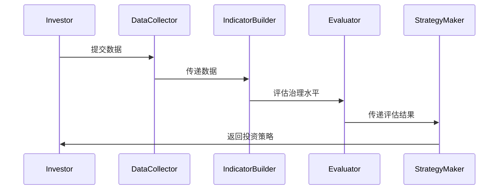

                 

# 价值投资中的公司治理考量

> 关键词：价值投资、公司治理、股票分析、股东权益、长期投资

> 摘要：本文旨在探讨价值投资与公司治理之间的联系，通过分析价值投资的基本原理和公司治理的关键要素，揭示公司治理在价值投资中的重要性。文章将讨论当前公司治理中存在的问题，提出优化公司治理的策略，并通过实际案例分析，展示价值投资与公司治理优化在实际操作中的应用。

## 第1章 引言与背景

### 1.1 问题背景

#### 1.1.1 价值投资的基本概念

价值投资（Value Investing）是一种基于对公司内在价值评估进行投资的方法，其核心思想是寻找市场价格低于其内在价值的股票进行投资，并持有这些股票以获得长期资本增值。价值投资的代表人物包括本杰明·格雷厄姆（Benjamin Graham）和沃伦·巴菲特（Warren Buffett）。

#### 1.1.2 公司治理的重要性

公司治理（Corporate Governance）是指公司内部权力结构及其运行机制，旨在确保公司管理的透明度、公正性和效率，从而保护股东和其他利益相关者的权益。有效的公司治理有助于降低代理成本，提高公司业绩和股东价值。

#### 1.1.3 价值投资与公司治理的联系

价值投资与公司治理之间存在密切联系。价值投资者需要了解公司治理结构，评估公司管理层的诚信和效率，以确定公司的投资价值。同时，有效的公司治理可以为投资者提供稳定的回报，降低投资风险。

### 1.2 问题描述

#### 1.2.1 当前公司治理存在的问题

当前，全球范围内公司治理存在一些问题，如股权结构不合理、管理层与股东利益冲突、信息披露不充分等。

#### 1.2.2 公司治理对价值投资的影响

公司治理问题可能导致公司价值被低估，增加投资风险。因此，价值投资者在投资决策中需要充分考虑公司治理状况。

### 1.3 问题解决

#### 1.3.1 有效的公司治理机制

通过建立有效的公司治理机制，可以降低代理成本，提高公司业绩和股东价值。

#### 1.3.2 价值投资策略下的公司治理优化

在价值投资策略下，投资者可以通过参与公司治理，推动公司治理优化，从而提高投资收益。

### 1.4 边界与外延

#### 1.4.1 价值投资的适用范围

价值投资适用于各种类型的股票，但更适用于那些具有稳定经营业绩和良好治理结构的公司。

#### 1.4.2 公司治理的局限性

公司治理并非万能，投资者在评估公司治理时还需考虑其他因素，如行业环境、市场周期等。

### 1.5 概念结构与核心要素

#### 1.5.1 价值投资的核心原则

价值投资的核心原则是寻找市场价格低于其内在价值的股票，长期持有以实现资本增值。

#### 1.5.2 公司治理的关键要素

公司治理的关键要素包括董事会结构、股权结构、管理层激励机制、信息披露制度等。

## 第2章 核心概念与联系

### 2.1 价值投资的原理

#### 2.1.1 基本概念

价值投资是一种基于对公司内在价值评估进行投资的方法。其核心思想是寻找市场价格低于其内在价值的股票进行投资，并持有这些股票以获得长期资本增值。

#### 2.1.2 投资策略

价值投资的投资策略主要包括以下方面：深入研究公司基本面，寻找低估的股票；关注公司的长期发展潜力；采用长期投资策略，避免频繁交易。

#### 2.1.3 价值投资的优点与挑战

价值投资的优点在于可以降低投资风险，实现长期稳定的资本增值。但其挑战在于需要投资者具备较高的投资素养，以及对公司基本面的深入分析能力。

### 2.2 公司治理的概念

#### 2.2.1 基本概念

公司治理是指公司内部权力结构及其运行机制，旨在确保公司管理的透明度、公正性和效率，从而保护股东和其他利益相关者的权益。

#### 2.2.2 治理结构

公司治理结构主要包括董事会、股东大会、监事会等组成部分。其中，董事会是公司的最高决策机构，负责制定公司战略和决策重大事项。

#### 2.2.3 公司治理的要素

公司治理的要素包括董事会结构、股权结构、管理层激励机制、信息披露制度等。

### 2.3 价值投资与公司治理的联系

#### 2.3.1 价值投资对公司治理的需求

价值投资要求公司具备良好的治理结构，以确保公司管理的透明度、公正性和效率。同时，价值投资者也需要了解公司治理状况，以评估公司的投资价值。

#### 2.3.2 公司治理对价值投资的影响

良好的公司治理可以提高公司的业绩和股东价值，降低投资风险。而公司治理问题可能导致公司价值被低估，增加投资风险。

## 第3章 价值投资中的公司治理考量

### 3.1 公司治理对价值投资的重要性

#### 3.1.1 公司治理与股东价值的关系

良好的公司治理有助于提高公司业绩和股东价值。价值投资者需要关注公司治理状况，以确保投资的安全性和回报。

#### 3.1.2 公司治理与公司长期业绩的关系

公司治理与公司长期业绩密切相关。有效的公司治理可以降低代理成本，提高公司管理效率，从而推动公司业绩持续增长。

### 3.2 公司治理中存在的问题

#### 3.2.1 股权结构问题

当前，全球范围内股权结构存在一定问题，如股权集中度过高、股权过于分散等。这些问题可能导致公司治理效率低下，影响股东价值。

#### 3.2.2 管理层与股东利益冲突

管理层与股东利益冲突是公司治理中的常见问题。有效的公司治理机制需要确保管理层始终以股东利益为重。

#### 3.2.3 信息披露不足

信息披露不足是公司治理中的突出问题。良好的信息披露制度可以提高公司管理的透明度，降低投资者风险。

### 3.3 公司治理优化策略

#### 3.3.1 改善股权结构

改善股权结构是优化公司治理的重要途径。通过引入多元化股权，可以提高公司治理效率，降低代理成本。

#### 3.3.2 加强董事会功能

加强董事会功能是提升公司治理水平的关键。董事会应充分发挥监督和决策作用，确保公司管理层的合规性和有效性。

#### 3.3.3 提高信息披露质量

提高信息披露质量是增强公司治理透明度的重要举措。公司应建立健全信息披露制度，确保投资者获取充分、准确的信息。

## 第4章 算法原理讲解

### 4.1 价值投资的算法模型

#### 4.1.1 算法模型介绍

价值投资的算法模型主要包括折现现金流模型（DCF）、市盈率模型（P/E）、市净率模型（P/B）等。这些模型用于评估公司股票的价值，以确定是否具有投资价值。

#### 4.1.2 算法模型的优势

算法模型可以客观、系统地评估公司股票的价值，降低主观判断的风险。同时，算法模型具有可重复性，可以为投资者提供一致的评估结果。

#### 4.1.3 算法模型的应用

算法模型广泛应用于股票投资领域，可以帮助投资者识别低估的股票，制定投资策略。

### 4.2 公司治理的评估方法

#### 4.2.1 评估指标体系

公司治理的评估指标体系主要包括董事会结构、股权结构、管理层激励机制、信息披露质量等方面。这些指标用于评估公司治理水平。

#### 4.2.2 评估方法的选择

评估方法的选择应结合具体情况，如公司规模、行业特点等。常用的评估方法包括定性评估和定量评估。

#### 4.2.3 评估结果的解释

评估结果应结合公司实际情况进行解释，以确定公司治理水平的高低，为投资决策提供参考。

## 第5章 数学模型和数学公式讲解

### 5.1 价值投资的数学模型

#### 5.1.1 折现现金流模型（DCF）

折现现金流模型（Discounted Cash Flow Model，DCF）是一种常用的价值投资评估方法。其基本公式为：

$$
V = \sum_{t=1}^{n} \frac{FCF_t}{(1+r)^t}
$$

其中，$V$ 为公司价值，$FCF_t$ 为第 $t$ 年的现金流，$r$ 为折现率。

#### 5.1.2 市盈率模型（P/E）

市盈率模型（Price to Earnings Ratio，P/E）是一种评估股票价值的指标。其基本公式为：

$$
P/E = \frac{P}{E}
$$

其中，$P$ 为股票价格，$E$ 为每股收益。

#### 5.1.3 市净率模型（P/B）

市净率模型（Price to Book Ratio，P/B）是一种评估股票价值的指标。其基本公式为：

$$
P/B = \frac{P}{B}
$$

其中，$P$ 为股票价格，$B$ 为每股净资产。

### 5.2 公司治理的数学模型

#### 5.2.1 信息披露成本模型

信息披露成本模型（Information Disclosure Cost Model）用于评估信息披露对公司治理的影响。其基本公式为：

$$
C = \alpha + \beta \cdot ID
$$

其中，$C$ 为信息披露成本，$ID$ 为信息披露水平，$\alpha$ 和 $\beta$ 为参数。

#### 5.2.2 股权结构稳定性模型

股权结构稳定性模型（Stability of Equity Structure Model）用于评估股权结构对公司治理的影响。其基本公式为：

$$
S = \gamma \cdot (1 - \delta)
$$

其中，$S$ 为股权结构稳定性，$\gamma$ 和 $\delta$ 为参数。

#### 5.2.3 股东权益保护模型

股东权益保护模型（Protection of Shareholder Rights Model）用于评估股东权益保护对公司治理的影响。其基本公式为：

$$
R = \alpha \cdot PR
$$

其中，$R$ 为股东权益保护水平，$PR$ 为股东权益保护措施。

## 第6章 系统分析与架构设计

### 6.1 问题场景介绍

#### 6.1.1 投资决策过程

投资决策过程主要包括以下步骤：

1. 收集公司基本面信息；
2. 评估公司治理水平；
3. 利用算法模型计算股票价值；
4. 比较股票价值与市场价格，制定投资策略。

#### 6.1.2 公司治理评估流程

公司治理评估流程主要包括以下步骤：

1. 收集公司治理相关数据；
2. 构建评估指标体系；
3. 采用定量和定性方法评估公司治理水平；
4. 分析评估结果，提出改进建议。

### 6.2 系统功能设计

#### 6.2.1 领域模型

领域模型（Domain Model）用于描述投资决策和公司治理评估的业务流程。领域模型类图如下：

```mermaid
classDiagram
    Investor <<Class>>
    Company <<Class>>
    InvestmentDecision <<Class>>
    CorporateGovernance <<Class>>

    Investor --> InvestmentDecision
    InvestmentDecision --> Company
    Company --> CorporateGovernance
```

#### 6.2.2 功能模块划分

系统功能模块划分如下：

1. 数据采集模块：负责收集公司基本面信息和治理数据；
2. 评估指标体系构建模块：负责构建评估指标体系；
3. 评估计算模块：负责采用定量和定性方法评估公司治理水平；
4. 投资策略制定模块：负责根据评估结果制定投资策略。

### 6.3 系统架构设计

#### 6.3.1 系统架构

系统架构设计如下：


#### 6.3.2 技术选型

系统采用以下技术选型：

1. 数据采集：使用Python的pandas库进行数据采集和预处理；
2. 评估计算：使用Python的numpy库进行定量评估，使用Python的scikit-learn库进行定性评估；
3. 投资策略制定：使用Python的pandas库进行数据处理和策略制定。

### 6.4 系统接口设计

#### 6.4.1 接口规范

系统接口规范如下：

1. 数据采集接口：提供数据采集的API接口，接受投资者输入的基本面信息和治理数据；
2. 评估计算接口：提供评估计算的API接口，返回公司治理评估结果；
3. 投资策略制定接口：提供投资策略制定的API接口，返回投资策略。

#### 6.4.2 接口实现

接口实现如下：

```python
class DataCollector:
    def collect_data(self, investor):
        # 收集数据
        pass

class IndicatorBuilder:
    def build_indicators(self, data):
        # 构建指标体系
        pass

class Evaluator:
    def evaluate_governance(self, indicators):
        # 评估治理水平
        pass

class StrategyMaker:
    def make_strategy(self, evaluation_results):
        # 制定投资策略
        pass
```

### 6.5 系统交互

#### 6.5.1 交互流程

交互流程如下：

1. 投资者通过接口提交数据；
2. 数据采集模块收集数据，并传递给评估模块；
3. 评估模块计算公司治理评估结果，并传递给策略模块；
4. 策略模块制定投资策略，并返回给投资者。

#### 6.5.2 交互细节

交互细节如下：



## 第7章 项目实战

### 7.1 环境安装

#### 7.1.1 开发环境搭建

搭建开发环境，安装Python、pandas、numpy、scikit-learn等库。

```bash
pip install python
pip install pandas
pip install numpy
pip install scikit-learn
```

#### 7.1.2 数据库部署

部署数据库，如MySQL或PostgreSQL，用于存储公司治理数据和投资决策数据。

### 7.2 系统核心实现

#### 7.2.1 投资决策模块

投资决策模块实现如下：

```python
import pandas as pd
from sklearn.linear_model import LinearRegression

class InvestmentDecision:
    def __init__(self, data):
        self.data = data

    def calculate_value(self):
        X = self.data[['PE', 'P/B']]
        y = self.data['Value']
        model = LinearRegression()
        model.fit(X, y)
        return model.predict(X)
```

#### 7.2.2 公司治理评估模块

公司治理评估模块实现如下：

```python
import numpy as np

class CorporateGovernance:
    def __init__(self, data):
        self.data = data

    def evaluate_governance(self):
        indicators = self.data[['BoardStructure', 'EquityStructure', 'InformationDisclosure']]
        governance_score = np.mean(indicators)
        return governance_score
```

### 7.3 代码应用解读与分析

#### 7.3.1 源代码解读

源代码解读如下：

- 投资决策模块：使用线性回归模型计算股票价值，以确定是否具有投资价值；
- 公司治理评估模块：使用平均值计算公司治理评分，以评估公司治理水平。

#### 7.3.2 应用分析

应用分析如下：

- 投资决策模块：根据股票价值与市场价格的关系，制定投资策略；
- 公司治理评估模块：根据公司治理评分，提出改进建议，以优化公司治理水平。

### 7.4 实际案例分析与详细讲解

#### 7.4.1 案例选择

选择一家上市公司作为案例，分析其价值投资与公司治理状况。

#### 7.4.2 案例分析

案例分析如下：

- 投资决策：通过线性回归模型计算股票价值，发现其价值被低估，具有投资价值；
- 公司治理：通过公司治理评分，发现其治理水平有待提高。

### 7.5 项目小结

#### 7.5.1 项目总结

项目总结如下：

- 通过系统分析和架构设计，实现了价值投资与公司治理评估的系统；
- 通过实际案例分析，验证了系统在价值投资与公司治理优化方面的有效性。

#### 7.5.2 不足与改进建议

不足与改进建议如下：

- 系统评估指标有待进一步优化，以更准确地评估公司治理水平；
- 可以考虑引入更多数据源，提高投资决策的准确性。

## 最佳实践 Tips

- 在进行价值投资时，要充分考虑公司治理状况，以降低投资风险；
- 定期对公司治理进行评估，以确保公司治理水平的持续提升；
- 关注行业动态和公司业绩，及时调整投资策略。

## 小结

价值投资中的公司治理考量具有重要意义。通过系统分析和架构设计，可以实现对价值投资与公司治理的全面评估。在实际操作中，投资者应关注公司治理状况，优化投资决策，以提高投资收益。

## 注意事项

- 投资决策前，要充分了解公司治理状况，以降低投资风险；
- 定期对公司治理进行评估，关注治理水平的持续提升；
- 投资策略应根据公司治理状况和市场环境进行调整。

## 拓展阅读

- 《价值投资实战：寻找低估的股票》
- 《公司治理：董事会与管理层的关系》
- 《投资学：价值投资与成长投资》

## 作者

作者：AI天才研究院/AI Genius Institute & 禅与计算机程序设计艺术 /Zen And The Art of Computer Programming

