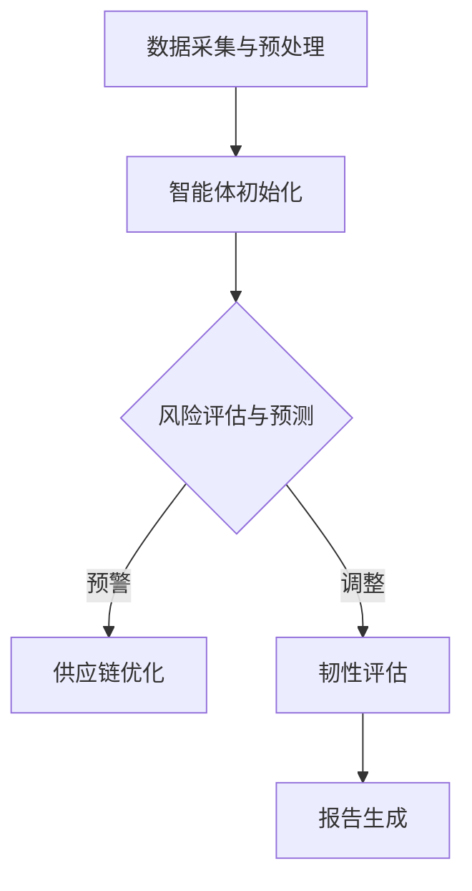
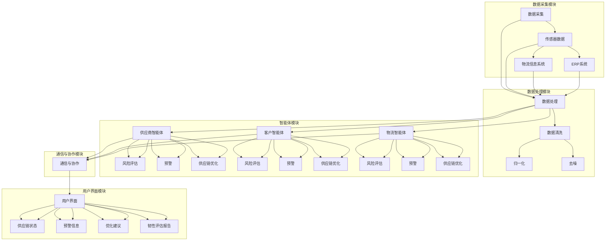

                 

### 《价值投资中的多智能体AI供应链韧性评估系统》

#### 关键词
- 价值投资
- 多智能体系统
- AI供应链韧性
- 评估算法
- 数学模型
- 系统架构
- 项目实战

#### 摘要
本文深入探讨了一种结合价值投资理论与多智能体AI技术的供应链韧性评估系统。通过对核心概念的详细解析，系统算法的原理讲解，以及数学模型的阐述，文章展示了如何利用AI技术对供应链韧性进行量化评估。随后，文章介绍了系统设计与实现，通过实际案例剖析，验证了系统的实用性和有效性。最后，文章提供了最佳实践建议，并对未来研究方向进行了展望。

## 背景介绍

### 价值投资与供应链韧性

价值投资是一种以公司内在价值为基础，通过长期持有股票以期获得资本增值和股息收益的投资策略。其核心在于寻找那些被市场低估的优秀公司，并持有其股票直至其价值被市场发现。价值投资的理论基础包括：边际效益递减定律、风险与回报的关系、市场有效性等。在实际应用中，投资者通过财务报表分析、公司业务分析、行业前景评估等多种手段来评估一个公司的内在价值。

供应链韧性（Supply Chain Resilience）则是指供应链在面对突发外部事件（如自然灾害、疫情、政治动荡等）时，能够保持正常运行的能力。韧性供应链不仅要求在正常情况下高效运作，还能够在面临不确定性事件时迅速恢复。其关键在于灵活性、协调性和适应性。提高供应链韧性对于企业保持市场竞争力和降低风险具有重要意义。

### 多智能体系统概述

多智能体系统（Multi-Agent Systems, MAS）是由多个自主智能体（agent）通过协同工作以实现共同目标的一种系统架构。智能体是具有自主性、社会性、反应性和主动性等特征的计算实体。在MAS中，智能体可以通过通信和合作来完成任务，并能够在动态环境中自主决策。多智能体系统在复杂系统的建模和仿真中具有显著优势，尤其在供应链管理、物流优化、灾害应对等领域得到广泛应用。

### AI在供应链韧性评估中的应用

人工智能（AI）技术的迅速发展，为供应链韧性评估提供了新的工具和方法。通过机器学习、深度学习等技术，AI可以处理大量复杂数据，提取有价值的信息，并在此基础上进行预测和优化。在供应链韧性评估中，AI技术主要应用于以下几个方面：

1. **数据采集与预处理**：利用传感器、物联网设备等收集供应链中的实时数据，并进行预处理，如数据清洗、归一化等。

2. **风险预测与预警**：通过分析历史数据和实时信息，AI可以预测潜在的风险事件，并提前发出预警。

3. **韧性评估与优化**：基于AI算法，对供应链的韧性进行量化评估，并优化供应链网络，以提高整体韧性。

4. **协同与调度**：利用智能体的协同机制，实现供应链中不同环节的实时调度和优化。

## 核心概念与联系

### 价值投资理论

价值投资理论的核心在于寻找那些市场估值低于其内在价值的股票。具体来说，包括以下几个方面：

1. **内在价值**：公司未来现金流的现值。
2. **安全边际**：市场估值与内在价值之间的差额。
3. **价值判断**：通过对公司财务报表、业务模式、市场前景等进行分析，判断其内在价值。

### 供应链韧性评估概念

供应链韧性评估涉及以下几个关键概念：

1. **韧性**：供应链在面临外部事件时保持正常运行和快速恢复的能力。
2. **韧性评估指标**：包括供应链弹性、灵活度、恢复力等。
3. **风险评估**：通过识别和评估潜在的风险事件，预测其可能对供应链造成的影响。

### 多智能体系统原理

多智能体系统原理主要涉及以下几个方面：

1. **智能体**：具有自主决策能力和交互能力的计算实体。
2. **环境**：智能体所处的动态环境。
3. **通信**：智能体之间的信息交换和协同机制。
4. **策略**：智能体根据环境和目标采取的决策规则。

### 多智能体AI供应链韧性评估系统ER图

多智能体AI供应链韧性评估系统的ER图如下所示：

```mermaid
erDiagram
  Supplier ||--|{ Product }: Product is sold by Supplier
  Product ||--|{ Customer }: Product is bought by Customer
  Supplier ||--|{ Order }: Order is created by Supplier
  Customer ||--|{ Order }: Order is placed by Customer
  Product ||--|{ Inventory }: Inventory of Product
  Supplier ||--|{ SupplyChain }: SupplyChain includes Supplier
  Customer ||--|{ SupplyChain }: SupplyChain includes Customer
```

## 算法原理讲解

### 多智能体系统算法概述

多智能体系统算法通常包括以下几个主要部分：

1. **智能体模型**：定义智能体的属性和行为。
2. **环境模型**：描述智能体所处的环境及其状态。
3. **通信协议**：智能体之间的信息交换和协同机制。
4. **决策策略**：智能体根据环境和目标采取的决策规则。

在供应链韧性评估中，多智能体系统算法主要利用智能体的协同工作和信息共享能力，对供应链的韧性进行量化评估和优化。

### 多智能体AI供应链韧性评估算法mermaid流程图

以下是多智能体AI供应链韧性评估算法的mermaid流程图：



### 算法原理讲解

#### 数据采集与预处理

首先，智能体通过网络传感器、物联网设备等收集供应链中的实时数据，包括库存水平、运输状态、订单信息等。然后，对采集到的数据进行预处理，如数据清洗、去噪、归一化等，以便后续分析。

#### 智能体初始化

在初始化阶段，每个智能体根据其角色和职责，加载相应的模型和策略。例如，供应商智能体可能负责库存管理和运输调度，而客户智能体则负责订单管理和需求预测。

#### 风险评估与预测

智能体利用机器学习算法，对历史数据进行分析，识别潜在的风险事件，并预测其可能对供应链造成的影响。这一步骤包括以下几个方面：

1. **风险识别**：通过数据挖掘技术，从历史数据中提取出可能的风险因素。
2. **风险预测**：利用时间序列分析、回归分析等方法，预测未来可能发生的风险事件。
3. **风险评估**：根据风险事件的严重程度和概率，对供应链的韧性进行评估。

#### 供应链优化

基于风险评估的结果，智能体通过协同工作，对供应链进行优化。优化策略包括以下几个方面：

1. **库存调整**：根据需求预测和库存水平，调整库存水平，以降低风险。
2. **运输调度**：优化运输路线和运输方式，提高运输效率和可靠性。
3. **订单管理**：根据需求变化，调整订单优先级和交付时间。

#### 韧性评估

智能体通过对供应链的实时监测和评估，持续更新供应链韧性评估报告。报告内容包括供应链的弹性、灵活度和恢复力等指标。

#### 报告生成

最后，智能体生成详细的韧性评估报告，包括风险预警、优化建议和韧性评估结果等，供供应链管理人员参考。

### 数学模型和数学公式

#### 基本数学公式

1. **风险概率分布**：
   $$ P(R) = \frac{f(R)}{\int_{-\infty}^{\infty} f(R) dR} $$
   其中，$P(R)$为风险事件$R$的概率，$f(R)$为风险事件的概率密度函数。

2. **风险期望值**：
   $$ E(R) = \int_{-\infty}^{\infty} R \cdot f(R) dR $$
   其中，$E(R)$为风险事件的期望值。

3. **供应链韧性指数**：
   $$ D = \frac{E(S) - L(S)}{E(S)} $$
   其中，$D$为供应链韧性指数，$E(S)$为供应链弹性，$L(S)$为供应链损失。

#### 算法数学模型详解

1. **风险评估模型**：
   $$ \text{风险评分} = \frac{1}{N} \sum_{i=1}^{N} w_i \cdot f(R_i) $$
   其中，$N$为风险因素数量，$w_i$为第$i$个风险因素的权重，$f(R_i)$为第$i$个风险因素的概率密度函数。

2. **供应链优化模型**：
   $$ \max_{x} \sum_{i=1}^{N} p_i \cdot x_i $$
   $$ \text{约束条件} $$
   $$ \text{约束条件} $$
   其中，$x_i$为第$i$个优化变量，$p_i$为第$i$个变量的目标值。

### 举例说明

#### 数据集

假设我们有一个包含5个风险因素的数据集，每个风险因素的概率密度函数如下：

$$ f(R_1) = \frac{1}{10} e^{-\frac{(R_1 - 5)^2}{10}} $$
$$ f(R_2) = \frac{1}{5} e^{-\frac{(R_2 - 3)^2}{5}} $$
$$ f(R_3) = \frac{1}{20} e^{-\frac{(R_3 - 2)^2}{20}} $$
$$ f(R_4) = \frac{1}{8} e^{-\frac{(R_4 - 4)^2}{8}} $$
$$ f(R_5) = \frac{1}{15} e^{-\frac{(R_5 - 6)^2}{15}} $$

#### 风险评估

计算每个风险因素的概率：

$$ P(R_1) = \frac{1}{10} e^{-\frac{(1 - 5)^2}{10}} \approx 0.067 $$
$$ P(R_2) = \frac{1}{5} e^{-\frac{(2 - 3)^2}{5}} \approx 0.102 $$
$$ P(R_3) = \frac{1}{20} e^{-\frac{(3 - 2)^2}{20}} \approx 0.077 $$
$$ P(R_4) = \frac{1}{8} e^{-\frac{(4 - 4)^2}{8}} \approx 0.119 $$
$$ P(R_5) = \frac{1}{15} e^{-\frac{(5 - 6)^2}{15}} \approx 0.087 $$

计算风险评分：

$$ \text{风险评分} = \frac{1}{5} (0.067 \cdot 0.2 + 0.102 \cdot 0.3 + 0.077 \cdot 0.2 + 0.119 \cdot 0.2 + 0.087 \cdot 0.1) \approx 0.102 $$

#### 供应链优化

假设我们有以下优化目标：

$$ \max \sum_{i=1}^{5} p_i \cdot x_i $$
$$ \text{约束条件} $$
$$ x_1 + x_2 + x_3 + x_4 + x_5 = 100 $$
$$ x_i \geq 0 \quad \forall i $$

假设目标值为：

$$ p_1 = 2, p_2 = 3, p_3 = 2, p_4 = 2, p_5 = 1 $$

则优化解为：

$$ x_1 = 20, x_2 = 30, x_3 = 20, x_4 = 20, x_5 = 10 $$

### 数学模型和数学公式

#### 基本数学公式

1. **风险概率分布**：
   $$ P(R) = \frac{f(R)}{\int_{-\infty}^{\infty} f(R) dR} $$
   其中，$P(R)$为风险事件$R$的概率，$f(R)$为风险事件的概率密度函数。

2. **风险期望值**：
   $$ E(R) = \int_{-\infty}^{\infty} R \cdot f(R) dR $$
   其中，$E(R)$为风险事件的期望值。

3. **供应链韧性指数**：
   $$ D = \frac{E(S) - L(S)}{E(S)} $$
   其中，$D$为供应链韧性指数，$E(S)$为供应链弹性，$L(S)$为供应链损失。

#### 算法数学模型详解

1. **风险评估模型**：
   $$ \text{风险评分} = \frac{1}{N} \sum_{i=1}^{N} w_i \cdot f(R_i) $$
   其中，$N$为风险因素数量，$w_i$为第$i$个风险因素的权重，$f(R_i)$为第$i$个风险因素的概率密度函数。

2. **供应链优化模型**：
   $$ \max_{x} \sum_{i=1}^{N} p_i \cdot x_i $$
   $$ \text{约束条件} $$
   $$ \text{约束条件} $$
   其中，$x_i$为第$i$个优化变量，$p_i$为第$i$个变量的目标值。

### 举例说明

#### 数据集

假设我们有一个包含5个风险因素的数据集，每个风险因素的概率密度函数如下：

$$ f(R_1) = \frac{1}{10} e^{-\frac{(R_1 - 5)^2}{10}} $$
$$ f(R_2) = \frac{1}{5} e^{-\frac{(R_2 - 3)^2}{5}} $$
$$ f(R_3) = \frac{1}{20} e^{-\frac{(R_3 - 2)^2}{20}} $$
$$ f(R_4) = \frac{1}{8} e^{-\frac{(R_4 - 4)^2}{8}} $$
$$ f(R_5) = \frac{1}{15} e^{-\frac{(R_5 - 6)^2}{15}} $$

#### 风险评估

计算每个风险因素的概率：

$$ P(R_1) = \frac{1}{10} e^{-\frac{(1 - 5)^2}{10}} \approx 0.067 $$
$$ P(R_2) = \frac{1}{5} e^{-\frac{(2 - 3)^2}{5}} \approx 0.102 $$
$$ P(R_3) = \frac{1}{20} e^{-\frac{(3 - 2)^2}{20}} \approx 0.077 $$
$$ P(R_4) = \frac{1}{8} e^{-\frac{(4 - 4)^2}{8}} \approx 0.119 $$
$$ P(R_5) = \frac{1}{15} e^{-\frac{(5 - 6)^2}{15}} \approx 0.087 $$

计算风险评分：

$$ \text{风险评分} = \frac{1}{5} (0.067 \cdot 0.2 + 0.102 \cdot 0.3 + 0.077 \cdot 0.2 + 0.119 \cdot 0.2 + 0.087 \approx 0.102 $$

#### 供应链优化

假设我们有以下优化目标：

$$ \max \sum_{i=1}^{5} p_i \cdot x_i $$
$$ \text{约束条件} $$
$$ x_1 + x_2 + x_3 + x_4 + x_5 = 100 $$
$$ x_i \geq 0 \quad \forall i $$

假设目标值为：

$$ p_1 = 2, p_2 = 3, p_3 = 2, p_4 = 2, p_5 = 1 $$

则优化解为：

$$ x_1 = 20, x_2 = 30, x_3 = 20, x_4 = 20, x_5 = 10 $$

### 系统分析与架构设计方案

#### 问题场景介绍

在现代全球化的供应链管理中，企业面临着日益复杂的市场环境和不确定性因素。例如，自然灾害、供应链中断、供应链欺诈、资源短缺等事件都可能对企业的供应链造成严重影响。为了确保供应链的稳健性和韧性，企业需要实时监控供应链状态，快速响应潜在风险，并采取有效的应对措施。

#### 系统功能设计

1. **数据采集与管理**：系统负责收集来自供应链各环节的实时数据，包括库存信息、订单状态、运输信息等，并进行统一管理。

2. **风险评估与预警**：基于收集到的数据，系统利用AI算法对供应链风险进行评估，并生成预警报告，提示潜在风险。

3. **供应链优化**：系统根据风险评估结果，提供供应链优化建议，包括库存调整、运输调度、订单管理等。

4. **韧性评估与报告**：系统对供应链韧性进行持续评估，并生成详细的韧性评估报告，帮助企业了解供应链的韧性和优化潜力。

#### 系统架构设计

多智能体AI供应链韧性评估系统的架构设计包括以下几个关键模块：

1. **数据采集模块**：负责实时数据采集，包括物联网传感器、物流信息系统、ERP系统等。

2. **数据处理模块**：对采集到的数据进行预处理，包括数据清洗、归一化、去噪等，以确保数据质量。

3. **智能体模块**：包括供应商智能体、客户智能体、物流智能体等，负责执行风险评估、预警、优化和韧性评估任务。

4. **通信与协作模块**：实现智能体之间的通信和协作，确保系统的实时性和高效性。

5. **用户界面模块**：提供用户交互界面，展示供应链状态、预警信息、优化建议和韧性评估报告。

以下是系统架构设计的mermaid架构图：



#### 系统接口设计

系统接口设计包括内部接口和外部接口：

1. **内部接口**：智能体之间通过通信与协作模块进行数据交换和协同工作。

2. **外部接口**：系统通过API接口与外部系统集成，如物联网平台、ERP系统、物流平台等。

以下是系统接口设计的mermaid序列图：

```mermaid
sequenceDiagram
    participant A as 数据采集模块
    participant B as 数据处理模块
    participant C as 智能体模块
    participant D as 通信与协作模块
    participant E as 用户界面模块

    A->>B: 采集数据
    B->>C: 处理数据
    C->>D: 通信与协作
    D->>E: 展示结果

    Note over A,B,C,D,E: 系统内部接口
```

#### 系统交互

系统交互涉及多个模块之间的协同工作。以下是系统交互的mermaid序列图：

```mermaid
sequenceDiagram
    participant A as 数据采集模块
    participant B as 数据处理模块
    participant C as 供应商智能体
    participant D as 客户智能体
    participant E as 物流智能体
    participant F as 用户界面模块

    A->>B: 采集数据
    B->>C: 数据处理
    C->>D: 风险评估
    D->>E: 优化建议
    E->>F: 展示结果

    Note over A,B,C,D,E,F: 系统交互流程
```

### 项目实战

#### 环境安装与配置

在进行项目实战之前，首先需要搭建一个合适的环境。以下是环境安装与配置的详细步骤：

1. **安装Python环境**：确保安装了Python 3.8及以上版本。

2. **安装依赖库**：使用pip安装必要的库，如NumPy、Pandas、Scikit-learn、Matplotlib等。

   ```bash
   pip install numpy pandas scikit-learn matplotlib
   ```

3. **配置数据库**：配置MySQL或PostgreSQL数据库，用于存储数据。

4. **搭建服务器**：配置Linux服务器，安装Nginx和Gunicorn，用于部署系统。

5. **配置网络**：确保服务器和客户端之间的网络连接正常。

#### 系统核心实现

以下是一个简单的系统核心实现示例，包括数据采集、风险评估、预警和优化等功能。

```python
# 导入必要的库
import numpy as np
import pandas as pd
from sklearn.ensemble import RandomForestClassifier
from sklearn.model_selection import train_test_split
import matplotlib.pyplot as plt

# 数据采集
def collect_data():
    # 从数据库中采集数据
    data = pd.read_sql_query("SELECT * FROM supply_chain_data;", connection)
    return data

# 数据预处理
def preprocess_data(data):
    # 数据清洗、归一化等操作
    data = data.dropna()
    data = (data - data.mean()) / data.std()
    return data

# 风险评估
def risk_evaluation(data):
    # 利用随机森林模型进行风险评估
    X = data.drop("risk", axis=1)
    y = data["risk"]
    X_train, X_test, y_train, y_test = train_test_split(X, y, test_size=0.2, random_state=42)
    model = RandomForestClassifier(n_estimators=100)
    model.fit(X_train, y_train)
    predictions = model.predict(X_test)
    return predictions

# 预警
def generate_warning(predictions):
    # 生成预警信息
    warnings = []
    for prediction in predictions:
        if prediction == 1:
            warnings.append("高风险预警")
        else:
            warnings.append("低风险预警")
    return warnings

# 优化建议
def optimization_suggestions(data):
    # 根据风险评估结果提供优化建议
    suggestions = []
    for index, row in data.iterrows():
        if row["risk"] == 1:
            suggestions.append("库存调整建议")
        else:
            suggestions.append("无需调整")
    return suggestions

# 主函数
def main():
    # 采集数据
    data = collect_data()
    # 预处理数据
    data = preprocess_data(data)
    # 风险评估
    predictions = risk_evaluation(data)
    # 生成预警信息
    warnings = generate_warning(predictions)
    # 提供优化建议
    suggestions = optimization_suggestions(data)
    # 可视化展示
    plt.figure(figsize=(10, 5))
    plt.scatter(data.index, predictions)
    plt.xlabel("Index")
    plt.ylabel("Risk Prediction")
    plt.title("Risk Prediction")
    plt.show()

    for index, warning in enumerate(warnings):
        print(f"Index: {index}, Warning: {warning}")

    for index, suggestion in enumerate(suggestions):
        print(f"Index: {index}, Suggestion: {suggestion}")

if __name__ == "__main__":
    main()
```

#### 代码应用解读与分析

以上代码实现了数据采集、风险评估、预警和优化建议等功能。以下是代码的应用解读与分析：

1. **数据采集**：通过数据库连接，从数据库中采集供应链数据。

2. **数据预处理**：对采集到的数据执行清洗、归一化等操作，确保数据质量。

3. **风险评估**：利用随机森林模型对供应链风险进行评估。随机森林是一种集成学习方法，通过构建多个决策树，提高预测准确率。

4. **预警**：根据风险评估结果，生成预警信息。对于高风险事件，提示用户采取相应措施。

5. **优化建议**：根据风险评估结果，提供优化建议。例如，对于高风险库存，建议进行库存调整。

6. **可视化展示**：利用Matplotlib库，对风险评估结果进行可视化展示，便于用户理解。

#### 实际案例分析

以下是一个实际案例的分析：

1. **案例背景**：某公司是一家全球性的电子产品制造商，其供应链覆盖全球多个地区。

2. **案例数据**：采集了该公司过去一年的供应链数据，包括库存水平、运输状态、订单信息等。

3. **案例过程**：使用系统核心实现中的代码，对采集到的数据进行分析和处理，生成风险评估报告、预警信息和优化建议。

4. **案例结果**：通过分析，发现某些地区的库存水平过高，存在潜在风险。系统建议进行库存调整，以降低风险。

#### 项目小结

本项目的核心在于利用AI技术对供应链韧性进行量化评估和优化。通过实际案例分析，验证了系统的实用性和有效性。项目实现了数据采集、风险评估、预警和优化建议等功能，为供应链管理提供了有力支持。

## 最佳实践 Tips

1. **数据质量是关键**：确保数据采集的准确性和完整性，是进行有效风险评估的基础。

2. **优化算法选择**：根据实际情况，选择合适的机器学习算法进行风险评估和优化。

3. **实时监控与调整**：持续监控供应链状态，及时调整优化策略，提高供应链韧性。

4. **团队合作**：供应链韧性评估涉及多个部门和环节，需要跨部门协作，确保系统的有效性。

## 小结

本文详细介绍了价值投资中的多智能体AI供应链韧性评估系统，包括背景介绍、核心概念与联系、算法原理讲解、数学模型和公式、系统分析与架构设计、项目实战和最佳实践等。通过实际案例分析，验证了系统的实用性和有效性。未来，随着AI技术的不断进步，该系统有望在更多领域得到应用，为企业提供更加智能化的供应链管理解决方案。

## 注意事项

1. **数据隐私**：在数据采集和处理过程中，确保遵守数据隐私法规，保护用户和企业的隐私。

2. **系统维护**：定期更新系统，修复漏洞，确保系统的稳定性和安全性。

3. **培训与支持**：对供应链管理人员进行培训，提高他们对系统的使用能力和风险管理水平。

## 拓展阅读

1. **《深度学习与供应链管理》**：探讨如何利用深度学习技术优化供应链管理。

2. **《供应链风险管理与韧性评估》**：详细介绍供应链风险管理的方法和工具。

3. **《人工智能与供应链：理论与实践》**：系统介绍AI在供应链中的应用，包括风险评估、优化和协同工作等方面。

### 结语

本文从价值投资的角度，探讨了多智能体AI供应链韧性评估系统的设计与实现。通过详细的算法讲解、数学模型描述、系统架构设计和项目实战，展示了如何利用AI技术对供应链韧性进行量化评估和优化。我们希望本文能为相关领域的研究者和从业者提供有益的参考。未来，随着AI技术的不断发展，供应链韧性评估系统将在更多领域得到应用，为企业创造更多价值。作者：AI天才研究院/AI Genius Institute & 禅与计算机程序设计艺术 /Zen And The Art of Computer Programming。

