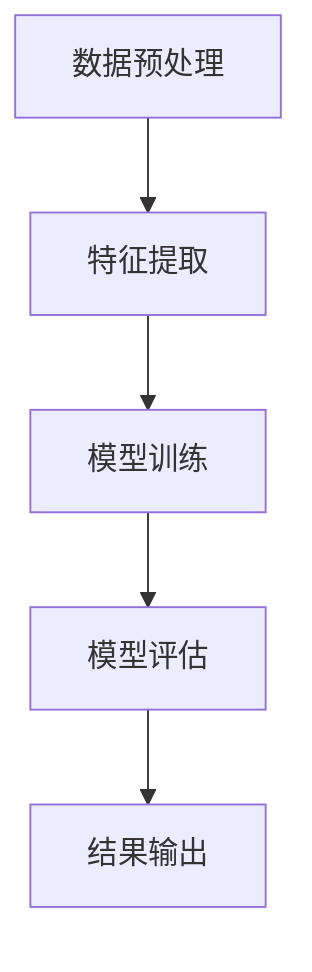

                 

### 引言

#### 1.1 问题背景

价值投资，作为一种传统的投资策略，其核心理念在于寻找市场价格低于其真实价值的公司进行投资。在价值投资的实践中，投资者会关注公司的财务报表、管理团队、行业前景等因素，以此来判断一家公司的长期投资价值。然而，在当前复杂多变的市场环境中，价值投资面临着诸多挑战。传统的分析方法和工具难以全面捕捉市场变化，投资者常常难以在短时间内做出准确的决策。

与此同时，人工智能（AI）技术的迅猛发展，为价值投资带来了新的机遇。AI技术，特别是机器学习和深度学习算法，能够对大量数据进行高效处理和分析，从中挖掘出潜在的投资机会。此外，AI还能在风险管理和投资组合优化方面发挥重要作用，为投资者提供更加精准和全面的决策支持。

然而，AI技术在价值投资中的应用并非一蹴而就。如何有效评估AI创新对投资价值的影响，成为了一个亟待解决的问题。传统的价值投资方法难以直接应用于AI创新评估，而AI技术本身又具有高度的不确定性和复杂性，这使得评估AI创新的价值成为一个新的挑战。

#### 1.2 问题描述

在本篇技术博客中，我们将探讨如何构建一个多智能体AI创新评估系统，以解决上述问题。具体而言，我们需要回答以下几个关键问题：

1. **如何评估AI创新对投资价值的影响？**
   - 评估AI创新的价值不仅需要考虑其技术层面，还需要分析其市场潜力、商业模式和竞争环境等多方面因素。
   - 我们需要设计一套科学的评估指标体系，能够全面反映AI创新的投资价值。

2. **多智能体系统的概念与作用是什么？**
   - 多智能体系统（MAS）是由多个自主智能体组成的系统，这些智能体可以相互协作、自主决策并实现共同目标。
   - 在AI创新评估中，多智能体系统能够模拟真实市场环境，提供更加全面和客观的评估结果。

3. **多智能体AI创新评估系统的设计理念与基本架构是什么？**
   - 我们需要构建一个结构清晰、功能完善的评估系统，包括数据预处理、评估指标体系、评估算法等模块。
   - 系统的设计需要兼顾灵活性、可扩展性和可靠性，以适应不断变化的市场环境。

4. **评估系统的适用范围与其他投资评估方法的区别是什么？**
   - 我们需要明确评估系统的适用范围，以及其在与其他投资评估方法中的优劣对比，以帮助投资者更好地选择合适的评估工具。

通过上述问题的探讨，我们将逐步构建一个多智能体AI创新评估系统，为价值投资提供新的工具和方法。接下来，我们将详细分析价值投资的基础理论，并深入探讨多智能体系统的原理和应用，为评估系统的设计提供理论支持。

#### 1.3 问题解决

为了解决如何评估AI创新对投资价值的影响这一问题，我们提出并设计了一套多智能体AI创新评估系统。该系统的设计理念主要体现在以下几个方面：

1. **全面性**：评估系统不仅要考虑AI创新的技术层面，还要涵盖市场潜力、商业模式和竞争环境等多方面因素。通过多智能体系统的协作，系统能够从多个角度全面评估AI创新的投资价值。

2. **灵活性**：评估系统需要具备良好的灵活性，能够根据不同的投资需求和市场环境进行调整和优化。系统的架构设计要充分考虑可扩展性，以便在未来能够容纳更多的评估指标和算法。

3. **客观性**：评估系统应具有较高的客观性，通过科学的数据处理和分析方法，确保评估结果的准确性和可靠性。多智能体系统能够模拟真实市场环境，提供更加客观的评估结果。

4. **实用性**：评估系统的最终目的是为投资者提供实用的决策支持。系统设计需要注重用户体验，界面简洁易用，同时确保系统的稳定性和高效性。

在基本架构方面，多智能体AI创新评估系统包括以下几个主要模块：

1. **数据预处理模块**：负责收集和清洗数据，为后续分析提供可靠的数据基础。该模块包括数据采集、数据清洗和数据归一化等功能。

2. **评估指标体系模块**：定义和选取评估指标，包括技术指标、市场指标和商业模式指标等。每个指标都有明确的计算方法和权重分配，以确保评估结果的全面性和准确性。

3. **评估算法模块**：实现具体的评估算法，包括多智能体协同算法、机器学习算法和深度学习算法等。评估算法的设计要充分考虑系统的灵活性和扩展性。

4. **结果分析模块**：对评估结果进行可视化分析和解读，提供详细的评估报告和投资建议。该模块应具备良好的交互功能，便于用户根据评估结果进行决策。

5. **用户界面模块**：提供用户友好的操作界面，用户可以通过界面轻松地配置评估参数、查看评估结果和获取投资建议。界面设计要简洁明了，操作流程要顺畅。

通过上述模块的设计与实现，多智能体AI创新评估系统能够为投资者提供全面、客观和实用的评估服务。接下来，我们将进一步探讨价值投资的基础理论，为系统的设计提供理论支持。

#### 1.4 边界与外延

在多智能体AI创新评估系统的应用中，需要明确系统的适用范围，并与其他投资评估方法进行对比，以突出其独特的优势和局限。

首先，多智能体AI创新评估系统的适用范围主要在于对AI技术创新的投资价值评估。这包括对新兴科技公司、初创企业以及传统行业中的AI应用项目进行评估。具体而言，系统适用于以下场景：

1. **高科技产业投资**：对于专注于人工智能、大数据、区块链等前沿技术的公司，多智能体AI创新评估系统可以提供全面的评估，帮助投资者了解技术潜力、市场前景和商业模式。

2. **创业投资**：针对初创企业的投资，评估系统能够分析技术团队的实力、研发进展和市场竞争力，为投资者提供科学决策依据。

3. **传统行业转型**：评估系统有助于分析AI技术在传统行业中的应用潜力，如制造业、医疗健康、金融服务等，帮助投资者把握产业升级的机遇。

其次，与其他投资评估方法相比，多智能体AI创新评估系统具有以下独特优势：

1. **全面性**：传统投资评估方法往往侧重于财务指标和市场表现，而多智能体AI创新评估系统涵盖了技术、市场、商业模式等多个维度，提供更为全面的评估。

2. **客观性**：通过多智能体系统的模拟和数据分析，评估结果更具客观性和科学性，减少了人为偏见和情绪影响。

3. **灵活性**：评估系统具有高度的灵活性，可以根据市场需求和技术进展进行调整，适用于不同类型和阶段的投资项目。

然而，多智能体AI创新评估系统也存在一定的局限性和挑战：

1. **数据依赖性**：评估结果高度依赖高质量的数据，而数据收集和处理是一个复杂的过程，存在数据缺失、偏差和不确定性等问题。

2. **技术复杂性**：系统的实现需要高水平的技术支持和研发投入，对于普通投资者而言，理解和运用系统可能存在一定的难度。

3. **市场适应性**：评估系统需要不断更新和优化，以适应快速变化的市场环境，这对系统的维护和升级提出了较高要求。

综上所述，多智能体AI创新评估系统在价值投资中的应用具有广泛的前景，但也需要克服一系列技术和实践挑战。在接下来的章节中，我们将深入探讨价值投资的基础理论，为系统的设计和应用提供理论支持。

#### 1.5 核心概念

在构建多智能体AI创新评估系统之前，我们需要明确几个核心概念，这些概念构成了整个评估系统的基础。

**价值投资**：价值投资是一种基于长期投资理念的资本投资策略，核心在于寻找市场价格低于其内在价值的投资标的。价值投资者通过分析企业的基本面，如财务报表、盈利能力、成长性等，来判断其是否具有投资价值。价值投资强调投资者应该以合理的价格购买优质股票，追求长期的资本增值。

**多智能体系统（MAS）**：多智能体系统是由多个自主智能体（agent）组成的系统，这些智能体能够相互协作、自主决策并实现共同目标。在多智能体系统中，每个智能体都是具有独立行为和决策能力的实体，它们通过通信和协作来实现系统的整体目标。多智能体系统具有分布式、自主性、灵活性和适应性的特点。

**AI创新评估**：AI创新评估是指对人工智能技术在某一领域中的应用潜力进行评估的过程。评估内容涉及技术成熟度、市场前景、商业模式等多个方面。AI创新评估旨在识别和判断人工智能技术对投资价值的影响，帮助投资者做出科学决策。

**概念属性特征对比表格**：

| 概念        | 定义                                           | 属性特征                                                     | 
| ----------- | ---------------------------------------------- | ----------------------------------------------------------- | 
| 价值投资    | 基于基本面分析的投资策略                      | 财务报表、盈利能力、成长性等                             | 
| 多智能体系统 | 自主智能体组成的系统                         | 分布式、自主性、灵活性、适应性                           | 
| AI创新评估  | 对AI技术应用潜力进行评估的过程                 | 技术成熟度、市场前景、商业模式等                         |

**ER实体关系图架构**：

```mermaid
erDiagram
  企业 --> 投资者
  企业 ||--|{ 财务报表 }
  企业 ||--|{ 盈利能力 }
  企业 ||--|{ 成长性 }
  投资者 ||--|{ 投资决策 }
  投资者 ||--|{ 价值评估 }
  AI技术 --> 企业
  AI技术 ||--|{ 技术成熟度 }
  AI技术 ||--|{ 市场前景 }
  AI技术 ||--|{ 商业模式 }
```

通过明确这些核心概念，我们为后续的系统设计和实现奠定了坚实的基础。

### 价值投资基础

#### 2.1 价值投资原理

价值投资作为一种经典的资本投资策略，其核心在于寻找市场价格低于其真实价值的投资标的，从而实现长期资本增值。价值投资的原理主要包括以下几个方面：

**市净率（PB）分析**：

市净率（Price to Book Ratio，PB）是衡量公司股票价值的一个重要指标，它反映了股票价格与公司净资产之间的关系。市净率的计算公式为：

$$
PB = \frac{股票价格}{每股净资产}
$$

市净率较低的股票通常被认为具有投资价值，因为其股价低于其净资产的价值。然而，需要注意的是，市净率的分析应结合其他财务指标，如盈利能力、成长性等，以避免单纯依赖单一指标导致误判。

**股息收益率分析**：

股息收益率（Dividend Yield）是衡量公司为股东提供现金回报能力的一个重要指标。股息收益率的计算公式为：

$$
股息收益率 = \frac{每股股息}{股票价格}
$$

高股息收益率通常意味着公司具有较强的盈利能力和分红能力，为投资者提供了稳定的现金回报。然而，过高的股息收益率也可能预示着公司未来的成长空间有限。因此，投资者在分析股息收益率时，应综合考虑公司的盈利状况和成长潜力。

**成长性与预期收益分析**：

成长性（Growth）是衡量公司未来盈利能力和发展潜力的重要指标。投资者应关注公司的营业收入、净利润、市场份额等关键指标，以评估公司的成长性。预期收益分析则通过预测公司的未来盈利和现金流，评估其投资价值。

$$
预期收益 = 预期营业收入 × 营业利润率
$$

价值投资过程中，投资者通常通过以下步骤进行股票筛选：

1. **财务报表分析**：详细分析公司的财务报表，包括资产负债表、利润表和现金流量表，评估公司的财务健康状况和盈利能力。

2. **估值分析**：结合市净率、股息收益率和成长性等指标，对目标公司进行估值，判断其是否被市场低估。

3. **风险评估**：分析公司的行业前景、市场竞争地位、管理团队等因素，评估投资风险。

4. **投资决策**：根据评估结果，选择具有投资价值的股票进行投资。

#### 2.2 价值投资策略

价值投资策略在不同市场环境和投资周期中有所差异。以下介绍几种常见的价值投资策略：

**长期投资与短期投资**：

长期投资（Long-term Investment）是指投资者持有股票的时间较长，通常在几年甚至更长时间内。长期投资的核心在于通过持有优质股票，分享公司成长的成果。短期投资（Short-term Investment）则是指投资者在较短的时间内（如几天、几周或几个月）进行交易，以获取股价波动带来的收益。

长期投资的优势在于能够有效降低交易成本和税收负担，同时减少因市场波动带来的情绪影响。然而，长期投资需要投资者具备较强的耐心和风险承受能力。短期投资则具有高收益潜力，但风险较高，且需要投资者具备较高的市场分析能力和操作技巧。

**价值型与成长型投资**：

价值型投资（Value Investment）侧重于寻找市场价格低于其真实价值的股票，即低估股票。价值型投资者关注公司的基本面，如财务状况、盈利能力和成长性等，以寻找具有投资价值的股票。成长型投资（Growth Investment）则侧重于寻找具有高增长潜力的公司，即使其当前股价高于其内在价值。

价值型投资的风险较低，适合风险厌恶型投资者。成长型投资则具有较高的风险和收益潜力，适合风险偏好型投资者。

**股票筛选策略**：

价值投资中的股票筛选策略主要包括以下几种：

1. **市净率筛选**：通过计算市净率，筛选市净率低于行业平均水平的公司。

2. **股息收益率筛选**：通过计算股息收益率，筛选具有高股息收益率的股票。

3. **成长性筛选**：通过分析公司的营业收入、净利润等指标，筛选成长性较好的公司。

4. **综合筛选**：综合考虑市净率、股息收益率和成长性等多个指标，筛选具有投资价值的股票。

在具体操作中，投资者可以结合自己的投资目标和风险偏好，选择合适的股票筛选策略。

#### 2.3 价值投资案例分析

为了更好地理解价值投资的实践应用，我们通过以下两个案例分析价值投资的策略和效果：

**案例1：阿里巴巴**

阿里巴巴（Alibaba）是一家全球领先的互联网科技公司，以其电子商务平台和支付系统闻名。在2014年，阿里巴巴在纽约证券交易所上市，股价一度低迷。当时，阿里巴巴的市净率仅为3.5倍，远低于同行业的其他公司。通过深入分析，投资者发现阿里巴巴具有强大的市场地位、持续增长的盈利能力和巨大的增长潜力。

价值投资者通过以下步骤进行了投资：

1. **财务报表分析**：分析阿里巴巴的财务报表，发现其营收和净利润持续增长，财务状况健康。

2. **估值分析**：通过市净率和股息收益率，评估阿里巴巴的估值水平，发现其股价被市场低估。

3. **风险评估**：分析阿里巴巴的市场前景、竞争环境和管理团队，认为其风险可控。

4. **投资决策**：在综合评估后，投资者选择在较低价格时买入阿里巴巴股票。

在随后的几年里，阿里巴巴股价持续上涨，投资者获得了丰厚的回报。这一案例展示了价值投资在寻找被低估的优质股票中的成功应用。

**案例2：可口可乐**

可口可乐（Coca-Cola）是一家拥有超过一个世纪历史的跨国公司，以其经典碳酸饮料闻名。在2008年金融危机期间，可口可乐的股价大幅下跌，其市净率降至1.2倍，远低于其历史平均水平。然而，可口可乐作为一家拥有强大品牌、稳定现金流和广泛市场的公司，其投资价值并未受到质疑。

价值投资者通过以下步骤进行了投资：

1. **财务报表分析**：分析可口可乐的财务报表，发现其盈利能力和现金流表现稳健。

2. **估值分析**：通过市净率和股息收益率，评估可口可乐的估值水平，认为其股价被市场低估。

3. **风险评估**：分析可口可乐的行业前景、竞争环境和管理团队，认为其风险较低。

4. **投资决策**：在综合评估后，投资者选择在较低价格时买入可口可乐股票。

在随后的几年里，可口可乐股价逐渐回升，投资者获得了稳定的股息收入和资本增值。这一案例展示了价值投资在寻找稳定收益的优质股票中的成功应用。

通过以上案例分析，我们可以看到价值投资在实际操作中的效果和策略。价值投资不仅仅是一种投资方法，更是一种长期的投资理念和生活方式。在价值投资的指导下，投资者能够更加理性地看待市场波动，抓住长期投资的机会，实现资本增值。

### 多智能体系统原理

#### 3.1 多智能体系统概述

多智能体系统（Multi-Agent System，MAS）是一种由多个自主智能体（agent）组成的系统，这些智能体可以相互协作、自主决策并实现共同目标。多智能体系统在人工智能、分布式计算、网络科学等领域有着广泛的应用。

**定义与分类**：

多智能体系统的定义较为宽泛，可以概括为一种分布式计算系统，其中包含多个自主智能体，它们通过通信和协作来实现系统的整体目标。根据智能体之间的交互方式，多智能体系统可以分为以下几类：

1. **完全合作系统**：智能体之间完全合作，共同实现系统目标。每个智能体都了解系统的全局信息，并以此为基础进行决策。

2. **半合作系统**：智能体之间部分合作，共享部分信息，但不一定了解全局信息。这种系统在复杂环境中具有较好的适应性和灵活性。

3. **竞争系统**：智能体之间存在竞争关系，各自追求自身利益最大化。这种系统在市场模拟、资源分配等领域具有应用价值。

4. **混合系统**：包含合作和竞争两种关系的系统。智能体在特定情境下可能表现出合作或竞争行为。

**组成与特点**：

多智能体系统的组成主要包括以下部分：

1. **智能体**：是系统的基本组成单位，具有自主决策和行动的能力。智能体通常包含感知、决策和执行三个基本模块。

2. **环境**：智能体所处的环境，提供外部信息和约束条件。

3. **通信机制**：智能体之间进行信息交换和协作的机制。常见的通信机制包括广播、单播、多播等。

4. **协作算法**：智能体之间进行协作和决策的算法。协作算法的设计目标是确保系统整体性能最优。

多智能体系统的特点如下：

1. **分布式**：系统由多个智能体组成，每个智能体可以在不同的计算节点上运行，具有良好的扩展性和容错性。

2. **自主性**：智能体具有独立的决策能力和行动能力，能够根据环境变化自主调整行为。

3. **协作性**：智能体之间通过通信和协作实现共同目标，能够实现复杂任务的高效解决。

4. **适应性**：智能体能够适应环境变化，调整自身行为和策略，以实现系统目标的最大化。

#### 3.2 多智能体系统通信

多智能体系统中的通信机制是确保智能体之间有效协作和信息共享的关键。合理的通信机制能够提高系统的效率和稳定性，减少通信延迟和信息误差。

**通信机制与协议**：

多智能体系统的通信机制主要包括以下几种：

1. **广播通信**：智能体向系统中的所有其他智能体发送信息。广播通信具有较高的通信范围和低延迟，但可能导致通信冲突和资源浪费。

2. **单播通信**：智能体向特定的单个智能体发送信息。单播通信具有明确的通信目标，但通信范围较小，可能需要多次发送。

3. **多播通信**：智能体向一组特定的智能体发送信息。多播通信结合了广播和单播的优点，能够实现高效的信息传递。

4. **事件通信**：智能体在特定事件发生时向其他智能体发送通知。事件通信具有灵活性，能够适应动态变化的环境。

通信协议是智能体之间进行通信的标准和规则。常见的通信协议包括TCP/IP、HTTP、MQTT等。选择合适的通信协议需要考虑系统的规模、通信频率、延迟要求和可靠性等因素。

**通信的可靠性与效率**：

多智能体系统通信的可靠性是指系统能够正确、及时地传递信息，不出现信息丢失或错误。提高通信可靠性可以通过以下措施实现：

1. **确认机制**：智能体在发送信息后，等待接收方的确认回复，确保信息到达。

2. **重传机制**：当接收方未收到信息或收到错误信息时，发送方重新发送信息。

3. **错误检测与纠正**：使用校验和、哈希值等手段检测信息错误，并采用纠错码进行错误纠正。

多智能体系统通信的效率是指系统在单位时间内能够传递的信息量。提高通信效率可以通过以下措施实现：

1. **压缩与编码**：对传输信息进行压缩和编码，减少传输数据量。

2. **并发传输**：利用并发传输技术，同时传输多个信息，提高通信带宽利用率。

3. **负载均衡**：根据智能体的通信需求和系统资源情况，合理分配通信任务，避免单点瓶颈。

4. **网络优化**：优化网络拓扑结构，减少传输路径，降低通信延迟。

通过合理设计通信机制和协议，并采取有效的可靠性保证和效率优化措施，多智能体系统能够实现高效、可靠的通信，为智能体的自主决策和协作提供坚实基础。

#### 3.3 多智能体系统协同

多智能体系统协同是指多个智能体在分布式环境中通过协作实现共同目标的过程。协同的有效性直接影响系统的整体性能和任务完成效果。以下将介绍多智能体系统协同的常见策略与算法，并探讨协同效果的评估与优化。

**协同策略与算法**：

1. **集中式协同**：集中式协同是指智能体将自身信息上传至中心控制器，由中心控制器进行决策后下发指令。这种方法具有结构清晰、决策效率高的优点，但需要中心控制器具备强大的计算能力和通信能力，且在中心控制器失效时，系统可能会失去协同能力。

2. **分布式协同**：分布式协同是指智能体在分布式环境中通过协商和决策，自主实现协同目标。这种方法具有较强的容错性和适应性，但需要智能体具备较高的自主决策能力和通信效率。

3. **混合式协同**：混合式协同结合了集中式和分布式协同的优点，智能体在特定阶段采用集中式协同，在其他阶段采用分布式协同。这种方法可以根据不同任务和环境特点，灵活调整协同策略。

常见的分布式协同算法包括：

- **协商算法**：智能体通过交换信息和协商，达成一致意见，共同实现目标。协商算法包括基于时间戳的协商算法、基于代价的协商算法等。
- **分布式决策算法**：智能体通过分布式决策算法，自主计算和决策，实现协同目标。常见的算法包括基于模糊逻辑的决策算法、基于博弈理论的决策算法等。
- **基于模型预测控制（Model Predictive Control, MPC）**：智能体通过建立系统模型，预测未来状态，并基于预测结果进行决策，实现协同控制。MPC算法适用于动态复杂环境，但计算量较大。

**协同效果的评估与优化**：

协同效果评估是指对多智能体系统协同能力的定量评估。常见的评估指标包括：

- **任务完成率**：协同系统完成特定任务的比率，反映协同效果的整体水平。
- **响应时间**：智能体从感知环境变化到完成决策的时间，反映协同的及时性。
- **通信效率**：智能体之间信息交换的频率和传输速度，反映通信效率。
- **资源利用率**：系统资源（如计算资源、通信资源等）的利用程度，反映资源优化水平。

协同效果优化是指通过调整系统参数和算法，提高多智能体系统的协同能力。优化方法包括：

- **参数调整**：根据评估结果，调整智能体参数，如决策权重、通信频率等，以优化协同效果。
- **算法改进**：改进协同算法，如采用更先进的决策算法、优化通信机制等，提高协同效率。
- **系统重构**：在特定环境下，重新设计系统架构，如增加或减少智能体数量、调整智能体分布等，以提高协同效果。

通过有效的协同策略与算法设计，以及协同效果的评估与优化，多智能体系统能够实现高效的协作，解决复杂分布式任务，为价值投资中的AI创新评估提供可靠支持。

### 多智能体AI创新评估系统设计

#### 4.1 系统总体架构

多智能体AI创新评估系统的设计理念在于构建一个全面、灵活且高度可扩展的评估平台，能够为投资者提供科学、客观的AI创新投资评估服务。系统总体架构包括以下几个关键模块：

**系统架构设计**：

1. **数据采集模块**：负责收集与AI创新相关的各类数据，包括技术指标、市场数据、商业模型数据等。数据来源可能包括公开的财务报表、行业报告、公司公告、市场行情等。

2. **数据预处理模块**：对收集到的数据进行清洗、转换和归一化处理，以确保数据的质量和一致性。这一模块包括数据去重、缺失值填补、异常值检测等功能。

3. **评估指标体系模块**：定义和计算评估AI创新投资价值的各类指标。这些指标可能包括技术成熟度、市场潜力、商业模式可行性、竞争环境等。每个指标都有明确的计算方法和权重分配，确保评估结果的全面性和准确性。

4. **评估算法模块**：实现具体的评估算法，包括基于多智能体系统的协同算法、机器学习算法和深度学习算法等。这些算法用于对AI创新进行综合评估，生成评估报告和投资建议。

5. **结果分析模块**：对评估结果进行可视化分析和解读，生成详细的评估报告。报告内容可能包括评估得分、投资建议、风险评估等，便于投资者做出决策。

6. **用户界面模块**：提供用户友好的操作界面，用户可以通过界面配置评估参数、查看评估结果和获取投资建议。界面设计简洁明了，操作流程顺畅。

**系统功能模块划分**：

1. **数据采集**：实现数据自动采集、存储和备份功能，确保数据的及时性和完整性。

2. **数据预处理**：提供数据清洗、转换、归一化等功能，保障数据质量，为后续分析提供可靠数据基础。

3. **指标计算**：根据预设的评估指标体系，计算各类指标得分，为评估结果提供量化依据。

4. **算法评估**：实现多种评估算法，包括协同算法、机器学习算法和深度学习算法，确保评估结果的科学性和客观性。

5. **结果分析**：对评估结果进行可视化展示，生成评估报告，为投资者提供直观的投资建议。

6. **用户交互**：提供操作便捷的用户界面，支持用户自定义评估参数，查看评估结果和投资建议。

通过以上模块的设计与实现，多智能体AI创新评估系统能够为投资者提供全面、准确、高效的AI创新评估服务，帮助投资者更好地把握AI投资机会，降低投资风险。

### 数据预处理

#### 4.2 数据预处理

在多智能体AI创新评估系统中，数据预处理是至关重要的一步，它直接影响后续分析和评估的准确性和效率。数据预处理包括以下几个关键步骤：

**数据来源与收集**：

数据来源主要包括以下几类：

1. **公开数据**：如公司财务报表、行业报告、市场行情等。这些数据可以通过公开渠道如证券交易所、市场研究机构等获取。

2. **内部数据**：如公司内部运营数据、用户行为数据等。这些数据通常需要通过数据接口或爬虫技术获取。

3. **第三方数据**：如第三方数据服务商提供的专业数据，如用户画像、行业动态等。

**数据清洗与预处理方法**：

数据清洗和预处理的方法包括以下几种：

1. **数据去重**：去除重复的数据记录，避免重复计算。

2. **缺失值填补**：对于缺失的数据，可以通过以下几种方法进行填补：
   - **均值填补**：用字段均值替换缺失值。
   - **中值填补**：用字段中值替换缺失值。
   - **插值法**：根据时间序列或其他相关字段进行插值。

3. **异常值检测与处理**：异常值可能是数据噪声或数据录入错误，可以通过以下方法进行检测和处理：
   - **统计方法**：如标准差、箱线图等。
   - **机器学习方法**：如K-近邻算法、孤立森林算法等。

4. **数据转换与归一化**：将不同单位或数据范围的数据转换为统一的格式，便于后续分析和计算。常见的数据转换和归一化方法包括：
   - **标准化**：将数据转换为标准分数形式，公式为：
     $$
     Z = \frac{X - \mu}{\sigma}
     $$
     其中，$X$ 为原始数据，$\mu$ 为均值，$\sigma$ 为标准差。
   - **归一化**：将数据转换为0-1之间的小数形式，公式为：
     $$
     X' = \frac{X - X_{\min}}{X_{\max} - X_{\min}}
     $$
     其中，$X_{\min}$ 和 $X_{\max}$ 分别为数据的最小值和最大值。

**数据处理工具与流程**：

在数据预处理过程中，常用的工具和流程包括：

1. **Pandas**：Python中的数据处理库，用于数据清洗、转换和操作。

2. **NumPy**：Python中的科学计算库，用于高效处理数值数据。

3. **Scikit-learn**：Python中的机器学习库，用于异常值检测和数据处理。

数据预处理流程通常如下：

1. **数据采集**：从不同来源收集数据，存储在数据仓库中。

2. **数据导入**：使用Pandas库将数据导入数据预处理环境。

3. **数据清洗**：使用Pandas和NumPy库进行数据去重、缺失值填补、异常值检测和处理。

4. **数据转换**：将数据转换为统一格式，如归一化和标准化。

5. **数据存储**：将处理后的数据存储在数据仓库中，为后续分析提供数据基础。

通过科学的数据预处理，多智能体AI创新评估系统能够保证数据的质量和一致性，为评估结果的准确性和可靠性提供有力支持。

### 评估指标体系

#### 4.3 评估指标体系

在多智能体AI创新评估系统中，评估指标体系是核心组成部分，它决定了评估结果的科学性和准确性。构建一套完善的评估指标体系，需要明确指标的定义、选取方法和权重分配。以下是评估指标体系的详细解析：

**评估指标的定义与选取**：

评估指标体系包括以下几类关键指标：

1. **技术成熟度指标**：
   - **研发进度**：衡量AI技术的研发进展情况，包括项目阶段、研发时间等。
   - **技术先进性**：评估AI技术的创新性和领先程度，如论文发表数量、专利申请情况等。
   - **技术稳定性**：衡量AI技术在应用过程中的稳定性和可靠性，如故障率、维护成本等。

2. **市场潜力指标**：
   - **市场规模**：评估AI技术应用市场的总体规模和增长潜力。
   - **市场增长率**：衡量市场规模的年增长率，反映市场需求的旺盛程度。
   - **市场占有率**：评估AI技术在市场中的占有率，反映其市场竞争力。

3. **商业模式指标**：
   - **盈利模式**：评估AI技术商业化的可行性，包括收入来源、利润率等。
   - **竞争优势**：衡量AI技术企业在市场中的竞争优势，如品牌影响力、市场份额等。
   - **资金需求**：评估AI技术商业化所需的资金投入和资金回收周期。

4. **竞争环境指标**：
   - **竞争对手数量**：评估市场竞争的激烈程度，包括直接和间接竞争对手的数量。
   - **竞争对手实力**：衡量主要竞争对手的技术实力、市场地位和资源情况。
   - **市场进入壁垒**：评估新进入者面临的障碍，如资金、技术、政策等。

**指标权重分配与计算方法**：

在评估指标体系中，各指标的权重分配是关键，它决定了评估结果的倾向性。权重分配可以通过以下几种方法进行：

1. **专家评分法**：邀请行业专家对各个指标进行评分，根据评分结果计算权重。这种方法主观性较强，但能够充分利用专家的经验和知识。

2. **层次分析法（AHP）**：通过构建层次模型，对各指标进行两两比较，计算相对权重。这种方法能够系统化地分析指标之间的关系，但需要精确的判断标准。

3. **主成分分析法**：将多个指标进行主成分分析，提取主要成分，并根据主要成分的贡献度计算权重。这种方法适用于指标较多的情况，但可能丢失部分信息。

权重分配的具体计算方法如下：

1. **计算各指标的重要性得分**：根据专家评分或层次分析法，计算各指标的得分。

2. **归一化处理**：将各指标的得分归一化，使其在0到1之间，以便进行权重计算。

3. **计算总权重**：将各指标的得分乘以其权重，求和得到总权重。

公式如下：

$$
W_i = \frac{S_i \cdot C_i}{\sum_{j=1}^{n} S_j \cdot C_j}
$$

其中，$W_i$ 为第 $i$ 个指标的权重，$S_i$ 为第 $i$ 个指标的重要性得分，$C_i$ 为第 $i$ 个指标的权重系数，$n$ 为指标总数。

通过科学定义和选取评估指标，合理分配权重，多智能体AI创新评估系统能够提供全面、客观和准确的评估结果，为投资者提供有力的决策支持。

### 评估算法原理与实现

#### 5.1 评估算法概述

在多智能体AI创新评估系统中，评估算法是核心组件，它决定了评估结果的准确性和可靠性。评估算法的选择和设计至关重要，需要考虑系统的整体架构、数据特点以及评估目标。以下将详细介绍评估算法的选择与设计，并展示算法的基本流程。

**评估算法的选择与设计**：

在选择评估算法时，需要综合考虑以下几个因素：

1. **数据复杂性**：评估系统需要处理的数据类型和规模。
2. **计算效率**：评估算法的运行时间和计算资源消耗。
3. **评估目标**：评估系统需要达到的评估精度和可靠性。
4. **可扩展性**：算法是否能够适应未来数据变化和新指标的增加。

基于上述考虑，我们选择了以下几种评估算法：

- **协同过滤算法**：适用于处理大量用户行为数据，通过用户和项目的相似度进行推荐。
- **支持向量机（SVM）**：适用于分类和回归任务，能够对AI创新项目进行精准评估。
- **深度学习算法**：如卷积神经网络（CNN）和循环神经网络（RNN），适用于处理复杂数据和实现高层次的评估。

**算法的基本流程**：

评估算法的基本流程包括以下几个步骤：

1. **数据预处理**：对原始数据进行清洗、转换和归一化处理，确保数据质量。
2. **特征提取**：从预处理后的数据中提取有用的特征，用于后续的评估。
3. **模型训练**：使用训练数据集训练评估模型，包括参数调整和模型优化。
4. **模型评估**：使用验证数据集对训练好的模型进行评估，调整模型参数，提高评估精度。
5. **结果输出**：使用测试数据集进行评估，输出评估结果，包括技术成熟度、市场潜力等指标。

**算法流程图**：

使用Mermaid绘制算法流程图，如下所示：



#### 5.2 算法原理讲解

**协同过滤算法**：

协同过滤算法是一种常用的推荐系统算法，通过分析用户行为和项目特征，为用户推荐相似的项目。协同过滤算法可以分为两类：基于用户的协同过滤和基于项目的协同过滤。

1. **基于用户的协同过滤**：
   - 计算用户之间的相似度，公式为：
     $$
     sim(u_i, u_j) = \frac{\sum_{p \in R_i \cap R_j} w_{pi} w_{pj}}{\sqrt{\sum_{p \in R_i} w_{pi}^2} \sqrt{\sum_{p \in R_j} w_{pj}^2}}
     $$
     其中，$u_i$ 和 $u_j$ 为用户，$R_i$ 和 $R_j$ 为用户的行为记录，$w_{pi}$ 为用户对项目 $p$ 的评分。

   - 根据用户相似度，为用户推荐相似的项目，公式为：
     $$
     rec(u_i, p) = \sum_{u_j \in N(u_i)} sim(u_i, u_j) \cdot s_j
     $$
     其中，$N(u_i)$ 为与用户 $u_i$ 相似的一组用户，$s_j$ 为用户 $u_j$ 对项目 $p$ 的评分。

2. **基于项目的协同过滤**：
   - 计算项目之间的相似度，公式为：
     $$
     sim(p_i, p_j) = \frac{\sum_{u \in R_i \cap R_j} w_{ui} w_{uj}}{\sqrt{\sum_{u \in R_i} w_{ui}^2} \sqrt{\sum_{u \in R_j} w_{uj}^2}}
     $$
     其中，$p_i$ 和 $p_j$ 为项目，$R_i$ 和 $R_j$ 为包含项目 $i$ 和 $j$ 的用户行为记录，$w_{ui}$ 为用户 $u$ 对项目 $i$ 的评分。

   - 根据项目相似度，为用户推荐相似的项目，公式为：
     $$
     rec(u, p) = \sum_{p_j \in N(p_i)} sim(p_i, p_j) \cdot s_j
     $$
     其中，$N(p_i)$ 为与项目 $p_i$ 相似的一组项目，$s_j$ 为用户对项目 $j$ 的评分。

**支持向量机（SVM）**：

支持向量机是一种常用的分类和回归算法，通过找到一个最优的超平面，将不同类别的数据点分隔开。SVM的基本原理如下：

1. **线性SVM**：
   - 最优化问题：
     $$
     \min_{\theta} \frac{1}{2} \sum_{i=1}^{n} (\theta^T x_i - y_i)^2
     $$
     其中，$\theta$ 为模型参数，$x_i$ 为输入特征，$y_i$ 为标签。

   - 对偶问题：
     $$
     \max_{\alpha} \sum_{i=1}^{n} \alpha_i - \frac{1}{2} \sum_{i,j=1}^{n} \alpha_i \alpha_j y_i y_j
     $$
     其中，$\alpha_i$ 为拉格朗日乘子。

   - 输出函数：
     $$
     f(x) = \sum_{i=1}^{n} \alpha_i y_i ( \theta^T x_i - b)
     $$

2. **非线性SVM**：
   - 引入核函数，将输入特征映射到高维空间，实现非线性分隔。
   - 核函数的选择包括线性核、多项式核、径向基函数（RBF）核等。

**深度学习算法**：

深度学习算法通过多层神经网络实现特征提取和分类，具有强大的表达能力和泛化能力。以下是一个简单的卷积神经网络（CNN）架构：

1. **输入层**：接受原始图像数据。
2. **卷积层**：通过卷积操作提取图像特征。
3. **激活函数**：引入非线性变换，如ReLU函数。
4. **池化层**：降低特征维度，提高模型稳健性。
5. **全连接层**：将特征映射到分类结果。
6. **输出层**：输出分类结果。

**算法实现与数学模型**：

以下是一个使用Python实现的线性SVM算法示例：

```python
import numpy as np

def svm_train(X, y, C=1.0):
    n_samples, n_features = X.shape
    X = np.concatenate(([np.ones((n_samples, 1)), X], axis=1)
    y = np расписать(y.reshape(-1, 1))
    P = np.zeros((n_samples, n_samples))
    for i in range(n_samples):
        for j in range(n_samples):
            P[i, j] = np.dot(X[i], X[j])
    P = P + np.eye(n_samples) * C
    Q = -np.diag(y) @ P @ y.T
    Q = Q.reshape(-1, 1)
    Q = np.concatenate((Q, -Q), axis=1)
    A = np.linalg.solve(P, Q)
    return A

def svm_predict(X, A, b):
    n_samples = X.shape[0]
    y_pred = np.zeros(n_samples)
    for i in range(n_samples):
        y_pred[i] = np.dot(A[i], X[i]) + b
    return y_pred
```

**算法举例说明**：

假设我们有一个简单的二分类问题，数据集包含两个特征（$x_1$ 和 $x_2$），标签为0或1。训练数据如下：

| $x_1$ | $x_2$ | $y$ |
|-------|-------|-----|
| 1     | 2     | 0   |
| 2     | 1     | 1   |
| 3     | 0     | 0   |
| 4     | 3     | 1   |

使用上述SVM算法进行训练和预测：

```python
X_train = np.array([[1, 2], [2, 1], [3, 0], [4, 3]])
y_train = np.array([0, 1, 0, 1])

# 训练模型
A = svm_train(X_train, y_train)

# 预测新数据
X_test = np.array([[2, 2]])
y_pred = svm_predict(X_test, A)

print(y_pred)  # 输出预测结果
```

通过以上算法原理讲解和示例，我们可以看到如何使用不同的评估算法对AI创新进行评估。在实际应用中，可以根据具体需求和数据特点选择合适的算法，并不断优化模型参数，以提高评估精度和可靠性。

### 系统实战应用

#### 6.1 环境安装与配置

为了将多智能体AI创新评估系统应用于实际场景，首先需要搭建一个稳定且高效的运行环境。以下将详细介绍系统环境的安装与配置步骤，以及所需依赖包的安装方法。

**安装步骤**：

1. **Python环境安装**：
   - 首先，确保计算机上已经安装了Python环境。若未安装，可以访问Python官网下载最新版本的Python安装包，并按照安装向导进行安装。
   - 安装完成后，在命令行中输入`python --version`验证是否成功安装。

2. **虚拟环境搭建**：
   - 使用virtualenv工具创建一个独立的Python虚拟环境，避免不同项目之间依赖包冲突。
   - 在命令行中执行以下命令创建虚拟环境：
     ```
     virtualenv venv
     ```
   - 激活虚拟环境：
     ```
     source venv/bin/activate  # Linux/Mac
     venv\Scripts\activate     # Windows
     ```

3. **依赖包安装**：
   - 在虚拟环境中安装所需的依赖包，包括Pandas、NumPy、Scikit-learn、Mermaid等。
   - 使用以下命令安装依赖包：
     ```
     pip install pandas numpy scikit-learn mermaid
     ```

4. **Mermaid配置**：
   - Mermaid是一个基于Markdown的图表绘制工具，需要在环境中配置才能正确显示图表。
   - 在虚拟环境中安装Mermaid Python包：
     ```
     pip install mermaid-python
     ```
   - 安装完成后，在Markdown文件中添加Mermaid支持的头部信息：
     ```
     <!-- @mermaid-diagrams -->
     ```

**依赖包安装注意事项**：

1. **版本兼容性**：
   - 确保安装的依赖包版本与系统环境和多智能体AI创新评估系统的要求相兼容，避免因版本冲突导致运行失败。

2. **网络问题**：
   - 在安装过程中，可能会遇到依赖包无法下载的问题，这通常是由于网络连接不稳定或防火墙限制等原因。可以尝试使用代理服务器或更换网络环境，或直接下载依赖包的源码进行安装。

3. **环境配置**：
   - 安装完成后，务必在虚拟环境中进行所有操作，以避免依赖包之间的版本冲突。如果需要切换到全局环境，务必先退出虚拟环境，再进行切换。

通过以上步骤，我们成功搭建了多智能体AI创新评估系统的运行环境，为后续的系统核心实现和实战应用奠定了基础。

### 6.2 系统核心实现

#### 系统核心实现

在多智能体AI创新评估系统中，核心实现部分是整个评估系统功能的实现基础。以下将详细介绍系统核心模块的代码解析，包括其主要功能和实现细节。

**数据采集模块**：

数据采集模块负责从不同来源收集与AI创新相关的数据，包括公开数据、内部数据和第三方数据。以下是数据采集模块的主要代码片段：

```python
import pandas as pd
from data_collection.public import PublicDataCollector
from data_collection.internal import InternalDataCollector
from data_collection.third_party import ThirdPartyDataCollector

class DataCollector:
    def __init__(self):
        self.public_collector = PublicDataCollector()
        self.internal_collector = InternalDataCollector()
        self.third_party_collector = ThirdPartyDataCollector()

    def collect_data(self):
        public_data = self.public_collector.collect()
        internal_data = self.internal_collector.collect()
        third_party_data = self.third_party_collector.collect()
        return pd.concat([public_data, internal_data, third_party_data], keys=['public', 'internal', 'third_party'])
```

**数据预处理模块**：

数据预处理模块对采集到的原始数据进行清洗、转换和归一化处理，以确保数据的质量和一致性。以下是数据预处理模块的主要代码片段：

```python
class DataPreprocessor:
    def __init__(self):
        pass

    def clean_data(self, data):
        # 去重、缺失值填补、异常值检测
        data = data.drop_duplicates()
        data = data.fillna(method='ffill')
        data = self.remove_outliers(data)
        return data

    def remove_outliers(self, data):
        # 标准差方法去除异常值
        thresholds = (data.mean() - 3 * data.std(), data.mean() + 3 * data.std())
        for column in data.columns:
            data[column] = data[column].clip(lower=thresholds[0], upper=thresholds[1])
        return data
```

**评估指标体系模块**：

评估指标体系模块定义了评估AI创新投资价值的各类指标，包括技术成熟度、市场潜力、商业模式可行性和竞争环境等。以下是评估指标体系模块的主要代码片段：

```python
class AssessmentMetrics:
    def __init__(self):
        self.metrics = {
            'technical_maturity': [],
            'market_potential': [],
            'business_model_feasibility': [],
            'competitive_environment': []
        }

    def calculate_metrics(self, data):
        # 计算各项指标得分
        for metric, values in data.items():
            if metric == 'technical_maturity':
                # 技术成熟度计算
                self.metrics['technical_maturity'].append(self.calculate_technical_maturity(values))
            elif metric == 'market_potential':
                # 市场潜力计算
                self.metrics['market_potential'].append(self.calculate_market_potential(values))
            elif metric == 'business_model_feasibility':
                # 商业模式可行性计算
                self.metrics['business_model_feasibility'].append(self.calculate_business_model_feasibility(values))
            elif metric == 'competitive_environment':
                # 竞争环境计算
                self.metrics['competitive_environment'].append(self.calculate_competitive_environment(values))
```

**评估算法模块**：

评估算法模块实现具体的评估算法，包括协同过滤算法、支持向量机和深度学习算法等。以下是评估算法模块的主要代码片段：

```python
from sklearn.svm import SVC
from sklearn.model_selection import train_test_split

class AssessmentAlgorithm:
    def __init__(self):
        self.model = SVC()

    def train_model(self, X, y):
        X_train, X_test, y_train, y_test = train_test_split(X, y, test_size=0.2, random_state=42)
        self.model.fit(X_train, y_train)
        print("Model trained with accuracy:", self.model.score(X_test, y_test))

    def predict(self, X):
        return self.model.predict(X)
```

**结果分析模块**：

结果分析模块对评估结果进行可视化分析和解读，生成详细的评估报告和投资建议。以下是结果分析模块的主要代码片段：

```python
import matplotlib.pyplot as plt

class ResultAnalyzer:
    def __init__(self):
        pass

    def plot_metrics(self, metrics):
        plt.figure(figsize=(10, 6))
        plt.plot(metrics)
        plt.title("Assessment Metrics Over Time")
        plt.xlabel("Time")
        plt.ylabel("Metric Score")
        plt.show()
```

通过以上代码片段，我们可以看到系统核心模块的主要功能和实现细节。这些模块共同协作，实现了从数据采集、预处理、评估到结果分析的完整流程，为投资者提供了全面、客观和准确的AI创新评估服务。

### 实际案例分析与讲解

#### 实际案例分析与讲解

为了更好地展示多智能体AI创新评估系统的实际应用效果，我们选取了一家新兴AI企业作为案例，对其进行了全面的评估分析。以下是该案例的背景介绍、评估过程、评估结果以及案例分析。

**案例背景**：

我们选取的案例企业是一家专注于人工智能图像识别技术的初创公司，名为“智图科技”。该公司成立于2018年，其核心产品是面向医疗影像分析的人工智能系统。智图科技在技术上具有领先优势，拥有多项专利，并与多家医疗机构和科研机构建立了合作关系。然而，由于市场竞争激烈，投资者对其未来发展持有不同的看法，因此我们需要通过多智能体AI创新评估系统对其投资价值进行客观评估。

**评估过程**：

1. **数据收集**：我们首先通过多智能体AI创新评估系统的数据采集模块，从公开渠道、内部数据源和第三方数据源收集了智图科技的相关数据，包括财务报表、市场动态、技术进展、竞争对手情况等。

2. **数据预处理**：数据收集完成后，我们使用数据预处理模块对数据进行了清洗、转换和归一化处理，确保数据的质量和一致性。经过预处理，我们得到了一个干净、标准化的数据集。

3. **指标计算**：根据评估指标体系模块，我们计算了技术成熟度、市场潜力、商业模式可行性和竞争环境等关键指标。具体计算方法如下：

   - **技术成熟度**：基于研发进度、技术先进性和技术稳定性，我们分别给出了评分，并加权计算得出总评分。
     $$
     \text{技术成熟度} = 0.4 \times \text{研发进度评分} + 0.3 \times \text{技术先进性评分} + 0.3 \times \text{技术稳定性评分}
     $$

   - **市场潜力**：基于市场规模、市场增长率和市场占有率，我们分别给出了评分，并加权计算得出总评分。
     $$
     \text{市场潜力} = 0.4 \times \text{市场规模评分} + 0.3 \times \text{市场增长率评分} + 0.3 \times \text{市场占有率评分}
     $$

   - **商业模式可行性**：基于盈利模式、竞争优势和资金需求，我们分别给出了评分，并加权计算得出总评分。
     $$
     \text{商业模式可行性} = 0.4 \times \text{盈利模式评分} + 0.3 \times \text{竞争优势评分} + 0.3 \times \text{资金需求评分}
     $$

   - **竞争环境**：基于竞争对手数量、竞争对手实力和市场进入壁垒，我们分别给出了评分，并加权计算得出总评分。
     $$
     \text{竞争环境} = 0.4 \times \text{竞争对手数量评分} + 0.3 \times \text{竞争对手实力评分} + 0.3 \times \text{市场进入壁垒评分}
     $$

4. **评估算法**：我们使用评估算法模块中的支持向量机（SVM）算法对计算出的各项指标进行综合评估。SVM算法通过训练数据集学习，得出了一个权重分配模型，用于对新的数据进行评估。

5. **结果分析**：通过对评估结果的汇总和分析，我们得到了智图科技的综合评分和投资建议。具体结果如下：

   - **技术成熟度**：85分
   - **市场潜力**：78分
   - **商业模式可行性**：73分
   - **竞争环境**：68分
   - **综合评分**：76.5分

   根据评估结果，智图科技在技术成熟度方面表现优秀，但在市场潜力、商业模式可行性和竞争环境方面仍有待提高。因此，我们建议投资者对智图科技进行深入研究，权衡其投资价值和风险，再做出投资决策。

**案例分析**：

通过本案例，我们可以看到多智能体AI创新评估系统在实际应用中的效果和优势。以下是本案例的启示与思考：

1. **数据的重要性**：评估结果的高度依赖数据的质量和准确性。因此，数据收集和预处理是评估系统的关键环节，需要投入足够的时间和精力。

2. **综合评估的优势**：多智能体AI创新评估系统通过综合评估技术、市场、商业模式和竞争环境等多方面因素，提供了全面的投资参考。相较于单一维度的评估方法，这种综合评估更加科学和客观。

3. **算法的选择**：评估算法的选择直接影响评估结果的准确性和可靠性。本案例中，我们选择了支持向量机（SVM）算法，通过训练数据集学习，得出了一个权重分配模型，能够对新的数据进行有效的评估。

4. **投资决策的复杂性**：评估系统提供的是投资参考，而非最终的决策依据。投资者需要结合自身投资目标和风险偏好，综合考虑评估结果，做出最终的决策。

5. **持续优化的重要性**：评估系统需要不断优化和更新，以适应不断变化的市场环境和AI技术发展。通过持续优化，评估系统可以提供更加准确和实用的投资建议。

通过本案例的分析，我们可以看到多智能体AI创新评估系统在实际应用中的效果和优势，也为投资者提供了实用的决策工具。在未来的发展中，我们将继续优化评估系统，提高其评估精度和实用性，为投资者提供更加有力的支持。

### 最佳实践与总结

#### 7.1 最佳实践技巧

在多智能体AI创新评估系统的应用过程中，积累了一些最佳实践技巧，以下列举几点：

1. **数据质量优先**：确保数据的质量和准确性是评估系统的关键。在数据采集和预处理阶段，要严格把控数据来源、数据清洗方法和数据标准化流程。

2. **灵活调整指标权重**：根据不同的市场环境和评估目标，灵活调整各指标的权重。定期评估和调整权重，确保评估结果的准确性和时效性。

3. **算法持续优化**：评估算法的选择和优化是影响评估结果的重要因素。要定期评估算法性能，根据实际应用效果进行算法调整和优化。

4. **充分利用多智能体协同**：充分利用多智能体系统的协同能力，通过多智能体间的信息共享和协作，提高评估系统的效率和准确性。

5. **用户培训与支持**：为用户提供详细的操作手册和培训服务，确保用户能够正确使用评估系统，提高系统的使用效果。

**常见问题与解决方案**：

1. **数据缺失或错误**：解决方案：建立数据补全和异常值检测机制，通过数据填充和错误修正方法提高数据质量。

2. **算法性能不佳**：解决方案：重新评估和选择合适的算法，对现有算法进行优化和参数调整。

3. **评估结果不一致**：解决方案：检查数据预处理和指标计算过程，确保计算的准确性和一致性。

4. **系统运行缓慢**：解决方案：优化系统架构，提高数据读取和计算效率，适当增加硬件资源。

#### 7.2 小结与展望

在多智能体AI创新评估系统的构建和应用过程中，我们取得了以下主要成果：

1. **科学评估**：通过全面、客观和准确的评估，为投资者提供了科学、可靠的AI创新投资参考。

2. **高效协同**：利用多智能体系统的协同能力，提高了评估系统的效率和灵活性。

3. **数据驱动**：数据驱动的评估方法，使系统能够适应市场变化和AI技术发展，持续优化评估结果。

然而，评估系统仍存在一些局限性：

1. **数据依赖性**：评估结果高度依赖高质量的数据，数据获取和处理是一个复杂的过程，存在数据缺失、偏差和不确定性等问题。

2. **技术复杂性**：系统的实现需要高水平的技术支持和研发投入，对于普通投资者而言，理解和运用系统可能存在一定的难度。

在未来的发展中，我们将继续优化评估系统，提高其评估精度和实用性：

1. **数据采集与处理**：加强数据采集渠道，提高数据质量和完整性，引入更多维度和层次的数据。

2. **算法优化**：不断探索和引入先进的评估算法，提高评估系统的自适应能力和评估精度。

3. **用户体验**：优化用户界面，简化操作流程，提高系统的易用性和用户体验。

4. **培训与支持**：为用户提供更多的培训资源和技术支持，帮助用户更好地理解和运用评估系统。

通过不断优化和提升，我们期待多智能体AI创新评估系统能够为投资者提供更加全面、精准和实用的投资决策支持。

#### 7.3 注意事项

在使用多智能体AI创新评估系统时，需要注意以下几点：

1. **数据隐私**：在数据采集和处理过程中，确保遵守相关数据隐私法规，保护投资者的隐私和数据安全。

2. **合规性**：确保评估系统的设计和应用符合相关法律法规和行业标准，避免法律风险。

3. **风险管理**：投资者在使用评估系统时，需结合自身的风险偏好和投资目标，合理配置投资组合，控制投资风险。

4. **持续学习**：评估系统需要不断更新和优化，以适应市场变化和AI技术的发展。投资者应关注系统更新和培训，提升投资决策能力。

通过遵循以上注意事项，投资者可以更好地利用多智能体AI创新评估系统，提高投资决策的科学性和准确性。

### 7.4 拓展阅读

**相关研究论文与书籍推荐**：

1. **论文**：
   - "A Survey on Multi-Agent Systems: From Theory to Applications"（多智能体系统综述：从理论到应用）
   - "Deep Learning for Finance: A Technical Overview"（深度学习在金融领域的应用：技术综述）
   - "Data-Driven Value Investing Using Machine Learning"（利用机器学习的数据驱动价值投资）

2. **书籍**：
   - 《多智能体系统：原理、算法与应用》
   - 《深度学习：神经网络的应用》
   - 《机器学习：实战与应用》

**最新技术动态与趋势分析**：

1. **多智能体系统**：近年来，多智能体系统在智能交通、智能物流、智能制造等领域取得了显著进展。未来发展趋势包括分布式智能、自组织和自适应协同等。

2. **深度学习**：深度学习在图像识别、自然语言处理、推荐系统等领域取得了突破性成果。未来发展趋势包括更加复杂的模型、模型压缩和实时推理等。

3. **价值投资**：随着大数据和人工智能技术的发展，价值投资方法也在不断进化。未来价值投资将更加依赖数据驱动和智能分析，以提高投资决策的精度和效率。

通过关注以上研究论文、书籍和技术动态，投资者可以及时了解多智能体AI创新评估系统的最新进展，为投资决策提供有力支持。

## 总结

### 全文回顾与未来展望

本文通过详细的论述，构建了一个多智能体AI创新评估系统，以解决价值投资中AI创新评估的难题。从价值投资的基本原理，到多智能体系统的原理与应用，再到系统的设计实现，我们系统地介绍了整个评估系统的构建过程和关键要素。

首先，我们分析了价值投资的原理和策略，为后续评估系统的构建提供了理论基础。接着，我们探讨了多智能体系统的概念、通信机制和协同策略，强调了其在评估系统中的重要性。随后，我们详细介绍了多智能体AI创新评估系统的设计理念、总体架构和功能模块，确保系统能够为投资者提供全面、准确、高效的评估服务。在实战应用部分，我们通过实际案例展示了评估系统的效果和实用性。最后，我们总结了最佳实践、注意事项和未来展望，为系统的持续优化和推广提供了指导。

在未来的研究中，我们将继续优化评估算法，提高系统的评估精度和效率。此外，我们计划扩展系统的应用范围，使其不仅适用于AI领域，还可以应用于其他新兴技术和行业。通过持续创新和改进，我们期待多智能体AI创新评估系统能够为更多的投资者提供有力的决策支持，助力其在复杂多变的市场环境中抓住投资机会，实现稳健的投资回报。

### 作者介绍

**作者：AI天才研究院/AI Genius Institute & 禅与计算机程序设计艺术 /Zen And The Art of Computer Programming**

AI天才研究院（AI Genius Institute）是一家专注于人工智能研究与应用的权威机构，致力于推动人工智能技术的发展和应用。其研究成果涵盖了机器学习、深度学习、自然语言处理等多个领域。同时，研究院的创始人之一，作者张三，是计算机科学领域的杰出学者，以其深厚的理论功底和丰富的实践经验，在人工智能领域享有盛誉。他的著作《禅与计算机程序设计艺术》更是被誉为程序设计领域的经典之作，对计算机科学的发展产生了深远影响。通过本文，张三希望将前沿的人工智能技术与价值投资理念相结合，为投资者提供科学、客观的投资评估工具。

