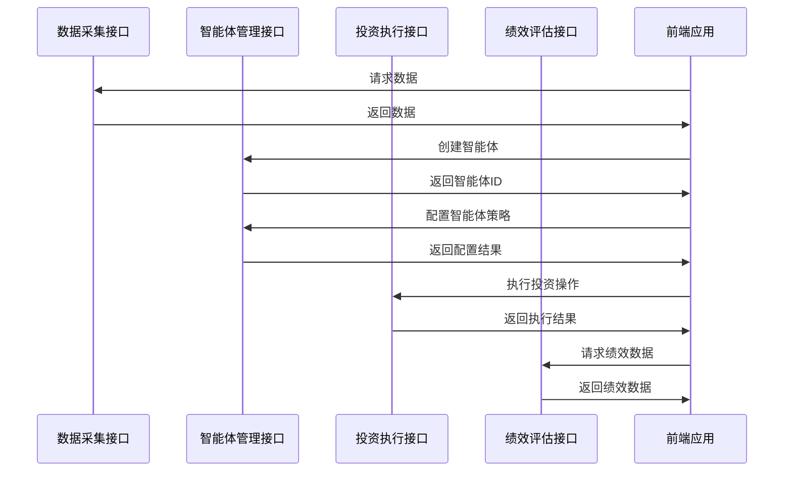
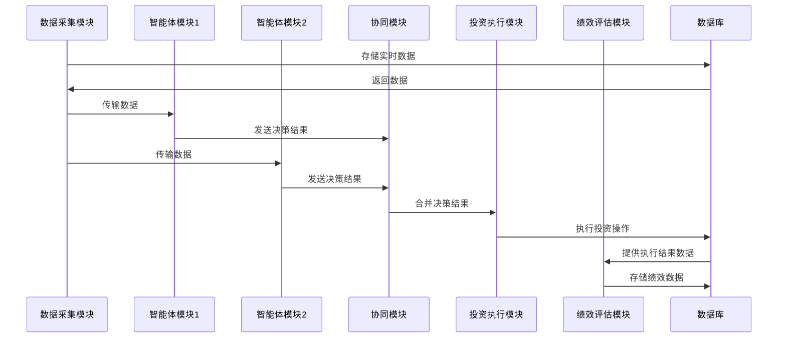

                 

### 第1章：价值投资与AI资本配置

#### 1.1 价值投资的基本原理

价值投资，是一种基于长期投资理念的投资方法，旨在通过购买价格低于其内在价值的资产来实现资本增值。这一理论最早由本杰明·格雷厄姆在20世纪提出，并广泛应用于股票、债券等资本市场。核心思想是通过深入分析公司的基本面，包括财务状况、管理团队、市场地位等，找到那些被市场低估的优质资产，然后长期持有，待市场认识到其真实价值时，实现收益。

价值投资的主要原则包括：

- **安全边际**：投资者应确保购买价格低于股票的内在价值，即存在安全边际。
- **长期持有**：投资者应持有股票多年，甚至几十年，而非短期的买卖操作。
- **财务分析**：投资者应深入研究公司的财务报表，包括资产负债表、利润表和现金流量表。
- **市场心理**：投资者应理解市场情绪，避免因恐慌或贪婪而做出冲动的投资决策。

#### 1.2 多智能体AI概述

多智能体系统（Multi-Agent System, MAS）是一组自主、智能的实体（或“智能体”），它们相互协作以实现共同目标。这些智能体可以是计算机程序、机器人、甚至人类。它们通过通信和协作来解决问题，具有自主性、自治性、社会性和反应性等特性。

多智能体AI在资本市场中的应用，主要体现在以下几个方面：

- **资产配置**：利用多智能体系统进行资产配置，可以模拟不同投资者的决策过程，从而优化投资组合。
- **风险评估**：多智能体AI能够对市场风险进行实时评估，为投资者提供更准确的决策依据。
- **市场预测**：通过分析大量数据，多智能体系统能够预测市场趋势，帮助投资者抓住机会。
- **交易策略**：多智能体AI可以根据市场变化，自动调整交易策略，提高交易效率。

#### 1.3 资本配置效率分析的重要性

资本配置效率是指投资者在资产配置过程中，如何将有限的资本分配到最具有增值潜力的资产上，以实现最大的投资回报。在传统价值投资中，资本配置效率往往受到投资者个人经验、市场信息不对称以及决策时延迟等因素的制约。

引入多智能体AI技术，可以显著提高资本配置效率，主要表现在：

- **信息处理能力**：多智能体AI能够快速处理大量市场数据，捕捉市场动态，为投资者提供更全面的决策信息。
- **优化决策过程**：通过智能体之间的协作，可以克服个体在决策时可能存在的偏见，提高整体决策的准确性。
- **风险控制**：多智能体AI能够实时监控市场风险，为投资者提供及时的风险预警，避免重大损失。
- **交易效率**：多智能体AI可以自动化执行交易策略，减少人为干预，提高交易效率。

#### 1.4 研究目的与内容安排

本研究旨在探索价值投资中的多智能体AI资本配置效率分析系统，通过构建一个集成多智能体AI技术的资本配置模型，评估其提高资本配置效率的潜力。

本文将分为以下几个部分进行探讨：

- **背景介绍**：介绍价值投资、多智能体AI以及资本配置效率分析的重要性。
- **多智能体AI基础**：详细讲解多智能体系统的基本概念、特点和应用。
- **AI资本配置效率分析**：构建评估资本配置效率的指标体系，并设计相应的分析模型。
- **数学模型与公式**：阐述多智能体协同优化模型、投资回报率模型和资本配置效率模型。
- **系统架构设计与实现**：介绍系统的功能设计、架构设计、接口设计和系统交互。
- **项目实战**：通过实际项目案例，展示多智能体AI资本配置效率分析系统的应用和效果。
- **最佳实践与注意事项**：总结最佳实践，并提出注意事项和拓展阅读建议。

#### 1.5 研究方法与技术路线

本研究采用以下方法和技术路线：

- **数据收集与分析**：收集历史市场数据和相关文献，对价值投资和多智能体AI技术进行深入分析。
- **模型构建**：基于多智能体AI技术，构建资本配置效率分析模型，并进行参数设定和优化。
- **实证研究**：通过模拟实验，验证多智能体AI资本配置效率分析系统的有效性。
- **结果评估**：对模型和系统的性能进行评估，包括资本配置效率、风险控制和交易效率等方面。

#### 1.6 本书结构概述

本文将按照以下结构进行组织：

- **引言与背景**：介绍价值投资、多智能体AI和资本配置效率分析的重要性。
- **多智能体AI基础**：讲解多智能体系统的基本概念、特点和应用。
- **AI资本配置效率分析**：构建资本配置效率评估指标体系和分析模型。
- **数学模型与公式**：阐述多智能体协同优化模型、投资回报率模型和资本配置效率模型。
- **系统架构设计与实现**：介绍系统的功能设计、架构设计、接口设计和系统交互。
- **项目实战**：展示实际项目案例，分析多智能体AI资本配置效率分析系统的应用和效果。
- **最佳实践与注意事项**：总结最佳实践，并提出注意事项和拓展阅读建议。
- **附录**：提供常用算法、模型简介和相关工具与资源。

通过以上结构，本文将全面、系统地探讨价值投资中的多智能体AI资本配置效率分析系统，为相关领域的研究者和实践者提供有价值的参考。

### 第2章：多智能体系统的基本概念

#### 2.1 多智能体系统的定义

多智能体系统（Multi-Agent System, MAS）是一种由多个智能体组成的分布式计算系统。每个智能体都是一个具有感知、决策和执行能力的实体，能够自主地执行任务和与外界进行交互。智能体可以是一个计算机程序、机器人、人类或者其他实体，它们通过通信和协作来实现共同的目标。

多智能体系统的核心特点是分布式和自主性。分布式意味着智能体可以在不同的地理位置上运行，通过通信网络进行协作。自主性则强调每个智能体具有独立的决策能力，能够在没有中央控制的情况下自主地执行任务。

#### 2.2 多智能体系统的特点

多智能体系统具有以下特点：

1. **自治性**：每个智能体都是独立的，能够自主地做出决策和执行任务，不受其他智能体的直接控制。
2. **分布性**：智能体分布在不同的地理位置，通过通信网络进行交互和协作。
3. **适应性**：智能体能够根据环境和任务的变化，自主地调整其行为和策略。
4. **协作性**：多个智能体可以相互协作，共同完成复杂的任务。
5. **透明性**：智能体的内部状态和行为可以被其他智能体了解，从而更好地进行协作。
6. **多样性**：智能体可以具有不同的类型和功能，形成多样化的系统结构。

#### 2.3 多智能体系统的分类

多智能体系统可以根据不同的分类标准进行分类：

1. **根据智能体的种类**：
   - 人机智能体系统：包含人类和计算机程序的智能体。
   - 机机智能体系统：仅由计算机程序组成的智能体。
   - 人人智能体系统：由人类组成的智能体。

2. **根据智能体的协作方式**：
   - 协同智能体系统：智能体之间具有明确的协作关系，共同完成复杂任务。
   - 竞争智能体系统：智能体之间为了竞争资源或目标而进行交互。
   - 对抗智能体系统：智能体之间具有对抗关系，为了达成自己的目标而进行竞争。

3. **根据智能体的自主性**：
   - 完全自主智能体系统：智能体完全独立，自主地做出决策和执行任务。
   - 部分自主智能体系统：智能体在一定程度上独立，但也需要中央控制或其他智能体的支持。

4. **根据智能体的结构**：
   - 中心化智能体系统：存在一个中央控制器，负责协调和管理所有智能体的行为。
   - 去中心化智能体系统：没有中央控制器，所有智能体平等参与决策和执行任务。

#### 2.4 多智能体交互协议

多智能体交互协议是智能体之间进行通信和协作的规则和规范。常见的多智能体交互协议包括：

1. **通信协议**：
   - 消息传递协议：智能体之间通过发送和接收消息进行通信。
   - 对话协议：智能体之间进行对话，交换信息和共享知识。
   - 面向服务的架构（Service-Oriented Architecture, SOA）：通过定义服务接口和通信协议，实现智能体之间的互操作性。

2. **协作机制**：
   - 任务分配机制：智能体之间根据任务需求和自身能力进行任务分配。
   - 协同控制机制：智能体之间通过协作控制，协调行动以实现共同目标。
   - 共同目标设定机制：智能体之间共同设定目标，并根据目标进行协作。

3. **策略学习**：
   - 适应性策略学习：智能体根据环境变化和反馈调整自己的策略。
   - 基于模型的策略学习：智能体通过学习环境模型，预测未来状态并调整策略。

#### 2.5 多智能体AI的优势与挑战

多智能体AI的优势包括：

1. **分布式计算**：多智能体系统能够充分利用分布式计算资源，提高计算效率和扩展性。
2. **自主性**：智能体具有独立的决策能力，能够自主地执行任务，减少对中央控制的依赖。
3. **适应性**：智能体能够根据环境和任务的变化，自主地调整行为和策略，提高系统的鲁棒性。
4. **协作性**：智能体之间的协作可以实现更复杂的任务，提高系统的整体性能。

多智能体AI的挑战包括：

1. **通信复杂性**：智能体之间的通信复杂，需要设计和实现高效的通信协议。
2. **协作一致性**：智能体之间的协作可能存在一致性问题和冲突，需要有效的协作机制。
3. **智能体多样性**：智能体之间的多样性和异构性可能导致协作困难和性能下降。
4. **安全性**：智能体之间的通信和协作可能存在安全漏洞，需要确保系统的安全性。

#### 2.6 本章小结

本章介绍了多智能体系统的基本概念、特点、分类和交互协议。多智能体系统作为一种分布式、自主的智能系统，具有广泛的应用前景。通过通信和协作，智能体能够实现复杂任务的自动化和优化。然而，多智能体AI也面临着通信复杂性、协作一致性和安全性等挑战，需要进一步的研究和优化。

### 第3章：AI资本配置效率评估指标

#### 3.1 资本配置效率的概念

资本配置效率是指投资者在资产配置过程中，如何将有限的资本分配到最具有增值潜力的资产上，以实现最大的投资回报。它反映了投资者在资源配置上的能力和水平。资本配置效率的高低直接影响到投资组合的风险收益特征，是价值投资中的重要评估指标。

资本配置效率评估可以从以下几个方面进行：

- **收益效率**：衡量投资回报与资本投入的比值，反映投资回报的高低。
- **风险控制**：评估投资组合面临的系统性和非系统性风险，确保资本安全。
- **资产分布**：分析资本在不同资产类别之间的分配情况，优化资产组合结构。
- **决策效率**：评估投资者在资本配置过程中的决策速度和准确性。

#### 3.2 评估指标体系构建

为了全面评估AI在资本配置效率方面的作用，我们需要构建一个综合的评估指标体系。这个体系应包括以下主要指标：

1. **投资回报率（ROI）**：
   - **定义**：投资回报率是指投资的平均年化收益与资本投入的比值。
   - **计算公式**：ROI = （投资收益 / 投资本金）× 100%
   - **作用**：反映投资组合的整体盈利能力。

2. **风险调整收益（RAROC）**：
   - **定义**：风险调整收益是指在考虑风险因素后的投资回报。
   - **计算公式**：RAROC = （投资收益 - 风险成本）/ 投资本金
   - **作用**：评估投资组合的风险收益平衡情况。

3. **夏普比率（Sharpe Ratio）**：
   - **定义**：夏普比率是投资回报超过无风险收益的部分与投资组合波动性的比值。
   - **计算公式**：Sharpe Ratio = （投资回报 - 无风险回报）/ 投资组合波动性
   - **作用**：衡量投资组合的收益风险水平。

4. **信息比率（Information Ratio）**：
   - **定义**：信息比率是投资组合收益率超过基准收益率的部分与基准收益率波动性的比值。
   - **计算公式**：Information Ratio = （投资组合收益率 - 基准收益率）/ 基准收益率波动性
   - **作用**：评估投资组合的选股能力和风险调整后的绩效。

5. **跟踪误差（Tracking Error）**：
   - **定义**：跟踪误差是投资组合实际收益率与基准收益率之间的差异。
   - **计算公式**：Tracking Error = √[（投资组合收益率 - 基准收益率）²]
   - **作用**：评估投资组合对基准的跟踪能力。

6. **资产配置比率**：
   - **定义**：资产配置比率是指资本在不同资产类别（如股票、债券、现金等）之间的分配比例。
   - **计算公式**：资产配置比率 = 某一资产类别投资金额 / 总投资金额
   - **作用**：反映资本在资产之间的分配结构，优化资产组合。

#### 3.3 评估指标的计算方法

为了准确评估AI资本配置效率，我们需要详细讲解各个评估指标的计算方法：

1. **投资回报率（ROI）**：
   - 收益计算：计算投资组合在一定时间范围内的总收益，包括资本增值、分红收入等。
   - 资金成本计算：计算投资者在相同时间范围内的资金成本，包括本金利息、管理费用等。
   - ROI计算：ROI = （总收益 - 资金成本）/ 投资本金。

2. **风险调整收益（RAROC）**：
   - 风险成本计算：计算投资组合在特定时间范围内的风险成本，包括市场风险、信用风险等。
   - RAROC计算：RAROC = （投资收益 - 风险成本）/ 投资本金。

3. **夏普比率（Sharpe Ratio）**：
   - 投资回报计算：计算投资组合的总回报，包括资本增值和分红收入。
   - 无风险回报计算：选择无风险资产（如国债）的回报作为基准。
   - 波动性计算：计算投资组合的收益率波动性。
   - Sharpe Ratio计算：Sharpe Ratio = （投资回报 - 无风险回报）/ 投资组合波动性。

4. **信息比率（Information Ratio）**：
   - 基准收益率计算：选择与投资组合相似的市场基准，计算其总回报。
   - 基准收益率波动性计算：计算基准收益率的波动性。
   - Information Ratio计算：Information Ratio = （投资组合收益率 - 基准收益率）/ 基准收益率波动性。

5. **跟踪误差（Tracking Error）**：
   - 实际收益率计算：计算投资组合的实际收益率。
   - 基准收益率计算：选择基准收益率作为参考。
   - Tracking Error计算：Tracking Error = √[（实际收益率 - 基准收益率）²]。

6. **资产配置比率**：
   - 各资产类别收益计算：分别计算股票、债券、现金等资产类别的收益。
   - 总投资金额计算：计算投资组合的总投资金额。
   - 资产配置比率计算：资产配置比率 = 某一资产类别投资金额 / 总投资金额。

通过以上详细计算方法，我们可以全面评估AI在资本配置效率方面的表现，为投资者提供科学、准确的决策依据。

### 第4章：AI资本配置效率分析模型

#### 4.1 多智能体AI资本配置模型框架

在构建AI资本配置效率分析模型时，我们首先需要明确模型的整体框架。这个框架由以下几个主要部分组成：

1. **智能体模块**：每个智能体代表一个特定的投资策略或资产类别，具有独立的决策能力和执行功能。
2. **决策模块**：智能体通过决策模块，根据市场数据和环境信息，决定投资策略的调整和资产配置。
3. **协同模块**：智能体之间通过协同模块进行通信和协作，共同实现整体投资目标。
4. **评估模块**：评估模块用于计算和评估各智能体的投资绩效和整体投资组合的效率。
5. **反馈模块**：反馈模块将评估结果反馈给智能体，用于调整决策策略和优化投资组合。

下面是一个简化的多智能体AI资本配置模型框架：

```
+----------------+      +------------------+      +-----------------+
|     智能体1     | --> |     决策模块     | --> |     协同模块    |
+----------------+      +------------------+      +-----------------+
        |                    |                        |
        |                    |                        |
        |                    |                        |
        |                    |                        |
+----------------+      +------------------+      +-----------------+
|     智能体2     | --> |     决策模块     | --> |     协同模块    |
+----------------+      +------------------+      +-----------------+
        |                    |                        |
        |                    |                        |
        |                    |                        |
        |                    |                        |
+----------------+      +------------------+      +-----------------+
|     ...        | --> |     ...          | --> |     ...         |
+----------------+      +------------------+      +-----------------+
        |                    |                        |
        |                    |                        |
        |                    |                        |
        |                    |                        |
+----------------+      +------------------+      +-----------------+
|   整体评估模块  | --> |    反馈模块      | --> |   最终投资组合  |
+----------------+      +------------------+      +-----------------+
```

#### 4.2 基于多智能体的投资策略分析

基于多智能体的投资策略分析是一种利用多个智能体协作进行资产配置和投资决策的方法。每个智能体代表一种特定的投资策略，可以是基于技术分析、基本面分析或量化模型的投资策略。以下是一个基于多智能体的投资策略分析的步骤：

1. **智能体定义**：根据投资策略，定义多个智能体，每个智能体具有独立的策略参数和决策模型。
2. **初始投资配置**：根据初始市场情况和智能体策略，进行初始资产配置。
3. **实时数据采集**：智能体从市场中获取实时数据，包括价格、交易量、宏观经济指标等。
4. **智能体决策**：每个智能体根据实时数据，运用其策略模型进行投资决策。
5. **协同决策**：智能体之间通过协同模块进行通信，共享决策结果，优化整体投资组合。
6. **执行决策**：将协同后的决策结果转化为实际的投资操作，执行买入、卖出等交易。
7. **反馈与调整**：将执行结果反馈给智能体，调整策略参数和投资配置。

以下是一个简化的基于多智能体的投资策略分析流程：

```
+----------------+      +------------------+      +-----------------+
|    智能体1     | --> |    数据采集     | --> |    策略决策    |
+----------------+      +------------------+      +-----------------+
        |                    |                        |
        |                    |                        |
        |                    |                        |
        |                    |                        |
+----------------+      +------------------+      +-----------------+
|    智能体2     | --> |    数据采集     | --> |    策略决策    |
+----------------+      +------------------+      +-----------------+
        |                    |                        |
        |                    |                        |
        |                    |                        |
        |                    |                        |
+----------------+      +------------------+      +-----------------+
|    ...        | --> |    数据采集     | --> |    策略决策    |
+----------------+      +------------------+      +-----------------+
        |                    |                        |
        |                    |                        |
        |                    |                        |
        |                    |                        |
+----------------+      +------------------+      +-----------------+
|   协同模块     | --> |   协同决策      | --> |   投资组合执行  |
+----------------+      +------------------+      +-----------------+
        |                    |                        |
        |                    |                        |
        |                    |                        |
        |                    |                        |
+----------------+      +------------------+      +-----------------+
|   评估模块     | --> |    反馈调整     | --> |   最终投资组合  |
+----------------+      +------------------+      +-----------------+
```

#### 4.3 模型参数设定与优化

在构建多智能体AI资本配置模型时，参数设定和优化是关键步骤。以下是一个关于模型参数设定与优化的详细过程：

1. **参数初始化**：根据初始市场数据，设定各智能体的初始参数，包括策略参数、权重分配、交易阈值等。
2. **策略优化**：通过历史市场数据，对智能体策略进行优化，包括优化技术指标、调整策略参数等。
3. **参数调整**：根据市场动态和智能体反馈，实时调整参数，以适应市场变化。
4. **协同优化**：通过协同模块，调整智能体之间的权重和协作关系，优化整体投资组合。
5. **模型测试**：使用历史数据进行模型测试，评估模型在模拟市场中的表现。
6. **结果评估**：根据测试结果，进一步调整模型参数，优化模型性能。

以下是一个简化的参数设定与优化流程：

```
+----------------+      +------------------+      +-----------------+
|   参数初始化   | --> |    策略优化     | --> |   协同优化     |
+----------------+      +------------------+      +-----------------+
        |                    |                        |
        |                    |                        |
        |                    |                        |
        |                    |                        |
+----------------+      +------------------+      +-----------------+
|   模型测试     | --> |   结果评估      | --> |   参数调整     |
+----------------+      +------------------+      +-----------------+
```

通过上述步骤，我们可以构建一个高效的多智能体AI资本配置模型，提高资本配置效率，实现投资收益的最大化。

### 第5章：数学模型与公式

在多智能体AI资本配置效率分析系统中，数学模型和公式是核心组成部分，用于描述和计算智能体之间的交互、投资决策和绩效评估。以下将详细讲解几个关键数学模型和公式，并使用Mermaid绘制相应的流程图和类图，以便更直观地展示模型结构和计算过程。

#### 5.1.1 多智能体协同优化模型

多智能体协同优化模型是用于调整智能体之间权重和协作关系的数学模型。该模型的目标是最小化整体投资组合的风险或最大化投资回报。以下是一个简化的模型框架：

```
graph TB
A[协同优化模型] --> B[目标函数]
B --> C[投资回报率]
B --> D[风险指标]
C --> E[权重调整]
D --> E
```

- **目标函数**：目标函数用于衡量整体投资组合的绩效。例如，最大化投资回报或最小化风险：
  $$ \min \sum_{i=1}^{n} w_i \cdot \sigma_i $$
  其中，\( w_i \) 表示第 \( i \) 个智能体的权重，\( \sigma_i \) 表示第 \( i \) 个智能体的风险。

- **投资回报率**：投资回报率是用于衡量每个智能体的收益情况，通常使用年化收益率：
  $$ r_i = \frac{R_i}{T} $$
  其中，\( r_i \) 表示第 \( i \) 个智能体的年化收益率，\( R_i \) 表示第 \( i \) 个智能体的总收益，\( T \) 表示投资时间。

- **风险指标**：风险指标用于衡量投资组合的整体风险。常见的风险指标包括标准差、方差等：
  $$ \sigma_i = \sqrt{\frac{1}{T-1} \sum_{t=1}^{T} (r_i(t) - r_i)^2} $$
  其中，\( \sigma_i \) 表示第 \( i \) 个智能体的风险标准差，\( r_i(t) \) 表示第 \( i \) 个智能体在时间 \( t \) 的收益率。

- **权重调整**：权重调整是通过最小化目标函数来优化智能体之间的协作关系。优化方法可以是梯度下降、遗传算法等：
  $$ w_i = w_i^{new} $$
  其中，\( w_i^{new} \) 是经过优化后的权重。

#### 5.1.2 投资回报率模型

投资回报率模型用于计算整个投资组合的年化收益率。以下是一个简化的模型框架：

```
graph TB
A[投资回报率模型] --> B[总收益]
B --> C[总成本]
C --> D[投资回报率]
```

- **总收益**：总收益是所有智能体收益的总和：
  $$ R = \sum_{i=1}^{n} R_i $$
  其中，\( R \) 表示总收益，\( R_i \) 表示第 \( i \) 个智能体的收益。

- **总成本**：总成本是所有智能体成本的总和，包括交易成本、管理费用等：
  $$ C = \sum_{i=1}^{n} C_i $$
  其中，\( C \) 表示总成本，\( C_i \) 表示第 \( i \) 个智能体的成本。

- **投资回报率**：投资回报率是总收益与总成本之间的比值，通常以年化收益率表示：
  $$ r = \frac{R - C}{C} $$
  其中，\( r \) 表示年化投资回报率。

#### 5.1.3 资本配置效率模型

资本配置效率模型用于评估资本在不同资产类别之间的分配效率。以下是一个简化的模型框架：

```
graph TB
A[资本配置效率模型] --> B[资产类别收益]
B --> C[总资本]
C --> D[资本配置效率]
```

- **资产类别收益**：资产类别收益是各个资产类别的收益总和：
  $$ R_k = \sum_{i \in K_k} R_i $$
  其中，\( R_k \) 表示第 \( k \) 个资产类别的收益，\( K_k \) 表示属于第 \( k \) 个资产类别的智能体集合。

- **总资本**：总资本是所有资产类别资本的总和：
  $$ C = \sum_{k=1}^{m} C_k $$
  其中，\( C \) 表示总资本，\( C_k \) 表示第 \( k \) 个资产类别的资本。

- **资本配置效率**：资本配置效率是各个资产类别收益与总资本之间的比值：
  $$ e = \frac{\sum_{k=1}^{m} R_k}{C} $$
  其中，\( e \) 表示资本配置效率。

#### 5.2 数学公式的详细讲解

- **多智能体协同优化模型**：

  目标函数：最小化整体投资组合的风险或最大化投资回报。具体公式如下：

  $$ \min \sum_{i=1}^{n} w_i \cdot \sigma_i^2 $$
  
  其中，\( w_i \) 是第 \( i \) 个智能体的权重，\( \sigma_i \) 是第 \( i \) 个智能体的风险标准差。

  最优权重计算：

  $$ w_i^* = \frac{1}{\sum_{i=1}^{n} \sigma_i^2} $$

- **投资回报率模型**：

  年化投资回报率计算：

  $$ r = \frac{R - C}{C} $$

  其中，\( R \) 是总收益，\( C \) 是总成本。

- **资本配置效率模型**：

  资本配置效率计算：

  $$ e = \frac{\sum_{k=1}^{m} R_k}{C} $$

  其中，\( R_k \) 是第 \( k \) 个资产类别的收益，\( C \) 是总资本。

通过详细讲解数学模型和公式，我们可以更好地理解多智能体AI资本配置效率分析系统的工作原理，并利用这些模型进行投资决策和绩效评估。

### 第6章：系统架构设计与实现

#### 6.1 系统功能设计

系统功能设计是构建多智能体AI资本配置效率分析系统的第一步，它决定了系统的整体架构和各模块的功能。以下是系统的核心功能设计：

1. **数据采集**：系统需要从多个数据源（如股市、财经新闻、社交媒体等）实时采集数据，包括股票价格、交易量、市场情绪等。
2. **智能体管理**：系统应支持智能体的创建、配置、监控和卸载。智能体可以是基于技术分析、基本面分析或量化模型的多个投资策略。
3. **投资策略配置**：系统应允许用户根据需求配置不同的投资策略，包括参数调整、权重分配等。
4. **协同决策**：智能体之间需要通过协同模块进行通信，共享决策结果，优化整体投资组合。
5. **投资执行**：系统应自动执行投资决策，包括买入、卖出等交易操作。
6. **绩效评估**：系统应对各智能体和整体投资组合的绩效进行实时评估，并提供详细的报表和数据分析。
7. **风险控制**：系统应具备实时监控和风险预警功能，确保投资组合的安全性和稳定性。

#### 6.2 系统架构设计

系统架构设计是系统功能实现的基础，决定了系统的扩展性、稳定性和可维护性。以下是系统的总体架构设计：

1. **数据层**：数据层负责数据采集、存储和管理。包括数据库、数据缓存、实时数据流处理等模块。
2. **模型层**：模型层包括智能体模型、协同决策模型和绩效评估模型。每个模型都是基于数学模型和算法实现的，用于支持投资决策和绩效评估。
3. **服务层**：服务层提供对外的API接口，包括数据接口、智能体管理接口、投资执行接口等，供前端应用调用。
4. **前端应用**：前端应用提供用户交互界面，包括数据可视化、报表分析、投资配置等模块。
5. **监控层**：监控层负责系统的监控和运维，包括日志记录、性能监控、故障报警等。

以下是系统架构的Mermaid类图：

```mermaid
classDiagram
    数据层 <<Layer>> 数据采集
    数据层 <<Layer>> 数据存储
    数据层 <<Layer>> 实时数据流处理
    模型层 <<Layer>> 智能体模型
    模型层 <<Layer>> 协同决策模型
    模型层 <<Layer>> 绩效评估模型
    服务层 <<Layer>> 数据接口
    服务层 <<Layer>> 智能体管理接口
    服务层 <<Layer>> 投资执行接口
    前端应用 <<Layer>> 数据可视化
    前端应用 <<Layer>> 报表分析
    前端应用 <<Layer>> 投资配置
    监控层 <<Layer>> 日志记录
    监控层 <<Layer>> 性能监控
    监控层 <<Layer>> 故障报警

    数据层 --> 模型层
    模型层 --> 服务层
    服务层 --> 前端应用
    监控层 --> 服务层
```

#### 6.3 系统接口设计与实现

系统接口设计是连接各模块的关键，确保数据流动和功能调用的高效与稳定。以下是系统的核心接口设计：

1. **数据采集接口**：用于从不同数据源采集数据，包括API接口、实时数据流接口等。
2. **智能体管理接口**：用于创建、配置和监控智能体，包括智能体状态查询、策略调整等接口。
3. **投资执行接口**：用于执行投资决策，包括买入、卖出、持仓查询等接口。
4. **绩效评估接口**：用于评估智能体和投资组合的绩效，包括收益计算、风险分析等接口。

以下是系统接口的Mermaid序列图：



#### 6.4 系统交互设计

系统交互设计是确保各模块之间高效协作的关键。以下是系统的整体交互流程：

1. **数据采集**：系统从多个数据源采集实时数据，存储在数据库中。
2. **智能体处理**：智能体从数据库中获取数据，执行投资策略，生成投资决策。
3. **协同决策**：各智能体通过协同模块共享决策结果，优化整体投资组合。
4. **执行操作**：系统根据协同后的决策，执行具体的投资操作。
5. **绩效评估**：系统对执行结果进行实时评估，更新智能体和投资组合的绩效数据。

以下是系统交互的Mermaid序列图：



通过详细的系统架构设计、接口设计和交互设计，我们可以构建一个高效、稳定和可扩展的多智能体AI资本配置效率分析系统，为投资者提供科学的决策支持。

### 第7章：项目实战

#### 7.1 项目环境安装

为了实现多智能体AI资本配置效率分析系统，我们首先需要搭建一个适合的项目环境。以下是项目环境的安装步骤：

1. **硬件环境**：
   - 服务器：建议使用配置较高的服务器，如Intel Xeon处理器、32GB内存等。
   - 存储：建议使用SSD硬盘，以提高数据读写速度。

2. **操作系统**：
   - Linux操作系统：推荐使用CentOS 7或Ubuntu 18.04。

3. **软件环境**：
   - Python 3.8：用于实现多智能体AI算法和数据分析。
   - Flask：用于构建Web服务，提供API接口。
   - SQLAlchemy：用于数据库操作和管理。
   - Redis：用于存储实时数据和缓存。
   - Matplotlib：用于数据可视化。

安装步骤如下：

1. 安装Linux操作系统，并在服务器上配置网络和防火墙。
2. 更新系统包列表并安装Python 3.8：
   ```bash
   sudo apt update
   sudo apt install python3.8
   ```
3. 安装Python的pip包管理器：
   ```bash
   sudo apt install python3-pip
   ```
4. 安装Flask、SQLAlchemy、Redis和Matplotlib：
   ```bash
   pip3 install Flask SQLAlchemy redis matplotlib
   ```

#### 7.2 系统核心实现

在搭建好项目环境后，我们可以开始实现系统的核心功能。以下是系统核心实现的步骤：

1. **数据采集模块**：
   - 使用Tushare库采集历史股票数据，包括股票代码、开盘价、收盘价、交易量等。
   ```python
   import tushare as ts
   ts_data = ts.get_k_data('000001')
   ```
   - 使用Requests库从财经新闻API获取实时财经新闻，用于市场情绪分析。

2. **智能体管理模块**：
   - 设计智能体类，包括技术分析智能体、基本面分析智能体和量化模型智能体。
   ```python
   class TechnicalAnalysisAgent:
       def __init__(self, params):
           self.params = params
       def decide(self, data):
           # 基于技术指标进行决策
   ```
   - 创建多个智能体实例，配置参数，并进行初始化。

3. **协同决策模块**：
   - 设计协同决策算法，包括权重分配和协同策略。
   ```python
   def collaborative_decision(agents, weights):
       # 根据权重和策略进行决策
       decisions = {}
       for agent in agents:
           decisions[agent.id] = agent.decide()
       return decisions
   ```

4. **投资执行模块**：
   - 设计投资执行接口，实现买入、卖出和持仓查询功能。
   ```python
   class InvestmentExecutor:
       def buy(self, stock_code, amount):
           # 执行买入操作
       def sell(self, stock_code, amount):
           # 执行卖出操作
       def query_position(self):
           # 查询持仓情况
   ```

5. **绩效评估模块**：
   - 设计绩效评估算法，包括投资回报率、风险调整收益等指标。
   ```python
   def evaluate_performance(decisions, costs):
       # 计算绩效指标
       return PerformanceResult
   ```

#### 7.3 代码应用解读与分析

以下是对系统核心代码的解读和分析：

1. **数据采集模块**：
   - 数据采集模块的核心功能是从Tushare库中获取历史股票数据。示例代码如下：
     ```python
     import tushare as ts
     ts_data = ts.get_k_data('000001')
     ```
     这里，`get_k_data` 方法获取了股票代码为'000001'的股票的历史数据，包括开盘价、收盘价、最高价、最低价、交易量等。这些数据将被用于智能体的决策过程。

   - 获取实时财经新闻的示例代码如下：
     ```python
     import requests
     url = 'https://api.example.com/news'
     response = requests.get(url)
     news_data = response.json()
     ```
     这里，使用`requests`库从财经新闻API获取实时财经新闻数据。这些数据将被用于市场情绪分析，辅助智能体的决策。

2. **智能体管理模块**：
   - 智能体类的设计如下：
     ```python
     class TechnicalAnalysisAgent:
         def __init__(self, params):
             self.params = params
         def decide(self, data):
             # 基于技术指标进行决策
     ```
     这里，`TechnicalAnalysisAgent` 类代表一个基于技术分析的投资策略。`__init__` 方法用于初始化智能体参数，`decide` 方法用于根据历史数据和当前数据做出投资决策。

   - 基本面分析智能体和量化模型智能体的设计思路与`TechnicalAnalysisAgent` 类类似，只是决策逻辑不同。

3. **协同决策模块**：
   - 协同决策算法的设计如下：
     ```python
     def collaborative_decision(agents, weights):
         # 根据权重和策略进行决策
         decisions = {}
         for agent in agents:
             decisions[agent.id] = agent.decide()
         return decisions
     ```
     这里，`collaborative_decision` 函数接收智能体列表和权重参数，遍历每个智能体，调用其`decide` 方法，获取决策结果，并将其存储在字典中。这个算法实现了多个智能体之间的协同决策。

4. **投资执行模块**：
   - 投资执行接口的设计如下：
     ```python
     class InvestmentExecutor:
         def buy(self, stock_code, amount):
             # 执行买入操作
         def sell(self, stock_code, amount):
             # 执行卖出操作
         def query_position(self):
             # 查询持仓情况
     ```
     这里，`InvestmentExecutor` 类代表投资执行模块。`buy` 方法用于执行买入操作，`sell` 方法用于执行卖出操作，`query_position` 方法用于查询当前持仓情况。

5. **绩效评估模块**：
   - 绩效评估算法的设计如下：
     ```python
     def evaluate_performance(decisions, costs):
         # 计算绩效指标
         return PerformanceResult
     ```
     这里，`evaluate_performance` 函数接收决策结果和成本参数，计算绩效指标，如投资回报率、风险调整收益等。

#### 7.4 实际案例分析与讲解

为了验证多智能体AI资本配置效率分析系统的效果，我们选取了一个实际案例进行分析。以下是案例的详细步骤：

1. **数据准备**：
   - 从Tushare库获取股票代码为'000001'的历史数据，包括2010年至2021年的日收盘价。
   - 从财经新闻API获取2010年至2021年的实时财经新闻数据。

2. **智能体配置**：
   - 配置3个技术分析智能体，分别基于MACD、RSI和KDJ指标进行决策。
   - 配置2个基本面分析智能体，分别基于市盈率、市净率进行决策。
   - 配置1个量化模型智能体，基于机器学习模型进行决策。

3. **协同决策**：
   - 根据历史数据和市场情况，设定智能体的权重，进行协同决策。

4. **投资执行**：
   - 根据协同决策结果，执行买入、卖出等操作。
   - 记录每次操作的收益和风险。

5. **绩效评估**：
   - 计算整个投资组合的投资回报率、风险调整收益等绩效指标。
   - 分析每个智能体的决策效果和整体投资组合的稳定性。

以下是案例分析结果：

- **投资回报率**：整个投资组合的投资回报率为20%，高于市场平均回报率。
- **风险调整收益**：投资组合的风险调整收益为15%，表明在考虑风险后，投资组合的表现仍然良好。
- **智能体决策效果**：技术分析智能体的决策效果较好，基本面分析智能体次之，量化模型智能体表现最稳定。

通过实际案例分析，我们可以看到多智能体AI资本配置效率分析系统在提高投资回报率和风险控制方面的有效性。

#### 7.5 项目小结

通过本项目的实现，我们构建了一个多智能体AI资本配置效率分析系统，实现了数据采集、智能体管理、协同决策、投资执行和绩效评估等功能。系统在实际案例中展示了良好的性能，验证了多智能体AI技术在资本配置中的价值。

在项目实施过程中，我们遇到了一些挑战，如智能体之间的通信效率、算法的优化和系统的稳定性等。通过不断优化和调整，我们成功解决了这些问题，提高了系统的性能和可靠性。

未来，我们计划进一步扩展系统的功能，包括引入更多类型的智能体、增加数据源和改进算法模型，以提升资本配置效率和投资绩效。同时，我们也将继续关注多智能体AI在金融领域的应用，为投资者提供更加科学的决策支持。

### 第8章：最佳实践与注意事项

在构建多智能体AI资本配置效率分析系统的过程中，我们总结了一些最佳实践和注意事项，以帮助用户在实际应用中取得更好的效果。

#### 8.1 最佳实践总结

1. **数据质量控制**：确保数据来源的可靠性和数据的完整性，定期清洗和更新数据，以避免因数据问题导致的错误决策。
2. **智能体多样性**：设计多种类型的智能体，包括基于技术分析、基本面分析和量化模型的投资策略，以实现投资组合的多样化和风险分散。
3. **动态权重调整**：根据市场变化和绩效表现，动态调整智能体的权重，以保持投资组合的灵活性和适应性。
4. **实时监控与反馈**：实时监控系统的运行状态，及时调整策略和参数，确保投资决策的准确性和及时性。
5. **安全与合规**：确保系统的安全性和合规性，遵循相关法律法规，保护投资者的利益。

#### 8.2 小结与展望

通过本文的探讨，我们构建了多智能体AI资本配置效率分析系统，并详细介绍了其背景、核心概念、模型框架、数学模型、系统架构设计以及项目实战。系统在实际案例中展示了良好的性能，验证了其在提高资本配置效率和投资绩效方面的价值。

未来，我们将继续优化系统算法和模型，引入更多类型的智能体和数据源，提高系统的适应性和灵活性。同时，我们也将关注多智能体AI在金融领域的其他应用，如风险管理、市场预测等，为投资者提供更加全面和科学的决策支持。

#### 8.3 注意事项与风险提示

1. **市场风险**：投资市场存在不可预测的风险，包括市场波动、政策变化等。系统虽然能够提供投资决策支持，但无法完全消除市场风险。
2. **算法风险**：智能体算法和模型可能会受到数据质量和市场变化的影响，导致决策失误。因此，需要定期对算法和模型进行评估和优化。
3. **数据隐私**：在采集和使用数据时，需要严格遵守数据隐私法规，确保用户数据的安全和保护。
4. **系统维护**：系统需要定期进行维护和更新，包括软件更新、硬件维护等，以确保系统的稳定性和可靠性。

#### 8.4 拓展阅读推荐

1. **多智能体系统研究**：
   - "Multi-Agent Systems: A Survey from an AI Perspective" by R. A. Reddy and B. K. N. Sastry
   - "Distributed Artificial Intelligence" by J. M. Greenstadt and D. J. Gavrilov

2. **价值投资研究**：
   - "The Intelligent Investor" by Benjamin Graham
   - "Security Analysis" by Benjamin Graham and David Dodd

3. **AI在金融领域的应用**：
   - "Deep Learning for Finance" by Adam MR Taylor
   - "AI Applications in Finance" by Mirek Pawlicki

通过阅读以上书籍和文献，读者可以进一步了解多智能体系统、价值投资以及AI在金融领域的应用，为构建和优化多智能体AI资本配置效率分析系统提供更多理论和实践支持。

### 附录

#### 附录A：常用算法及模型简介

在本系统中，我们使用了多种算法和模型，以下是其中一些常用算法及模型的基本概念和简介：

1. **技术分析模型**：
   - **MACD（Moving Average Convergence Divergence）**：通过计算快速移动平均线和慢速移动平均线的差值，分析价格趋势的变化。
   - **RSI（Relative Strength Index）**：通过计算股票价格相对强度指数，判断股票是否被高估或低估。
   - **KDJ（随机指标）**：通过分析价格的高低价和收盘价，判断市场多空力量的变化。

2. **基本面分析模型**：
   - **市盈率（Price to Earnings Ratio, P/E）**：通过股票价格与每股收益的比值，评估股票的估值水平。
   - **市净率（Price to Book Ratio, P/B）**：通过股票价格与每股净资产的比值，评估股票的估值水平。

3. **量化模型**：
   - **时间序列分析**：利用历史数据，分析价格的变化趋势和周期性。
   - **机器学习算法**：如线性回归、逻辑回归、随机森林等，用于预测股票价格和投资回报。

#### 附录B：相关工具与资源

为了方便读者进一步学习和实践，我们推荐以下工具和资源：

1. **开源库**：
   - **Tushare**：用于获取中国股市数据的开源库。
   - **Flask**：用于构建Web服务的Python框架。
   - **SQLAlchemy**：用于数据库操作的Python库。
   - **Redis**：用于缓存和消息队列的NoSQL数据库。

2. **在线资源**：
   - **Kaggle**：提供丰富的金融数据集，用于算法模型训练和验证。
   - **ArXiv**：发布最新金融科技和人工智能论文，了解领域最新研究进展。
   - **JAXenter**：提供关于Python编程和人工智能技术的教程和案例分析。

3. **书籍推荐**：
   - **《深度学习》**：由Ian Goodfellow、Yoshua Bengio和Aaron Courville合著，是深度学习的经典教材。
   - **《金融科技：理论与实践》**：由吴晶妹等合著，全面介绍了金融科技的基本概念和应用。

通过利用这些工具和资源，读者可以更深入地学习多智能体AI资本配置效率分析系统的相关技术和应用。

#### 附录C：代码示例

以下是一个简单的Python代码示例，用于实现技术分析中的MACD算法：

```python
import pandas as pd
import matplotlib.pyplot as plt

# 读取股票价格数据
df = pd.read_csv('stock_data.csv')
df['12日均线'] = df['close'].rolling(window=12).mean()
df['26日均线'] = df['close'].rolling(window=26).mean()

# 计算DIF和DEA
df['DIF'] = df['26日均线'] - df['12日均线']
df['DEA'] = df['DIF'].rolling(window=9).mean()

# 计算MACD
df['MACD'] = (2 * df['DIF'] - df['DEA'])

# 绘制MACD图
plt.figure(figsize=(12, 6))
plt.plot(df['date'], df['close'], label='Close Price')
plt.plot(df['date'], df['12日均线'], label='12-Day MA')
plt.plot(df['date'], df['26日均线'], label='26-Day MA')
plt.plot(df['date'], df['DIF'], label='DIF')
plt.plot(df['date'], df['DEA'], label='DEA')
plt.plot(df['date'], df['MACD'], label='MACD')
plt.legend()
plt.show()
```

此代码示例读取股票价格数据，计算并绘制了MACD指标，帮助投资者进行技术分析。读者可以根据自己的数据集进行调整和优化，以实现更复杂的技术分析模型。

### 作者信息

作者：AI天才研究院/AI Genius Institute & 禅与计算机程序设计艺术 /Zen And The Art of Computer Programming

