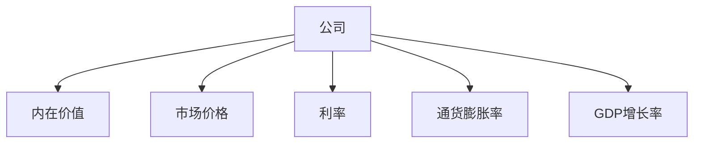

                 

### 《价值投资中的宏观经济因素：大局观的重要性》

---

关键词：价值投资、宏观经济因素、大局观、投资决策、数学模型

摘要：本文深入探讨价值投资中宏观经济因素的重要性，分析其如何影响投资决策。通过详细的背景介绍、核心概念联系、算法原理讲解、数学模型分析、系统设计与架构方案、项目实战以及最佳实践总结，文章为投资者提供全面的理论和实践指导。

---

## 背景介绍

### 1.1 问题背景

价值投资，作为投资领域中的一种经典策略，源于本杰明·格雷厄姆和戴维·多德的工作，强调通过分析公司的基本面和价值，以较低的价格购买股票，从而获得长期的投资回报。价值投资的核心在于对公司内在价值的准确评估，这与股票市场价格形成鲜明对比。然而，在现实的投资环境中，宏观经济因素不可忽视，它们在长期内对股票市场和公司业绩产生深远影响。

### 1.2 问题描述

投资者在运用价值投资策略时，如何有效地考虑和利用宏观经济因素？宏观经济因素，如利率、通货膨胀率、GDP增长率等，对公司的运营和市场表现有何具体影响？投资者应如何通过宏观经济因素来调整和优化其投资决策？

### 1.3 问题解决

首先，投资者应深入了解宏观经济因素，通过数据分析和市场研究，识别其对行业和公司的潜在影响。其次，投资者需要将宏观经济因素纳入到公司价值评估模型中，通过定性和定量分析，调整股票的估值。最后，投资者应具备长远的眼光，综合考虑宏观经济趋势，以做出更明智的投资决策。

### 1.4 边界与外延

价值投资的边界在于股票的市场价格与公司内在价值之间的差距，而宏观经济因素的外延则涉及整个经济体系对投资环境的影响。边界与外延之间的互动，决定了投资者在价值投资中应如何应对复杂的经济环境。

### 1.5 概念结构与核心要素组成

价值投资的核心概念包括内在价值、市场价格、宏观经济因素等。内在价值是指公司的真实经济价值，市场价格则是投资者对该公司的预期和共识。宏观经济因素则包括利率、通货膨胀率、GDP增长率等，这些因素通过影响公司的运营成本、盈利能力和市场需求，进一步影响股票的估值和价格。

## 核心概念与联系

### 2.1 核心概念原理

#### 内在价值

内在价值是指通过公司的财务状况、行业地位、未来发展前景等因素综合评估得出的公司真实经济价值。它是价值投资策略的核心，投资者需要通过深入分析公司的基本面，来确定其内在价值。

#### 市场价格

市场价格是股票在市场上实际交易的价格，它受到投资者情绪、市场供需关系、宏观经济因素等多方面影响。在价值投资中，市场价格与内在价值之间的差异是投资者获取投资回报的关键。

#### 宏观经济因素

宏观经济因素包括利率、通货膨胀率、GDP增长率等，这些因素通过影响整个经济环境，进而影响公司的运营成本、盈利能力和市场需求。投资者需要密切关注这些因素的变化，以调整其投资策略。

### 2.2 概念属性特征对比表格

| 概念 | 属性特征 |
| ---- | ---- |
| 内在价值 | 通过基本面分析确定 |
| 市场价格 | 由市场供需关系决定 |
| 利率 | 影响借贷成本 |
| 通货膨胀率 | 影响购买力 |
| GDP增长率 | 反映经济状况 |

### 2.3 ER实体关系图架构



## 算法原理讲解

### 3.1 价值投资的数学模型

价值投资的数学模型主要基于对公司内在价值的评估和股票市场价格的比较。以下是一个简化的模型：

$$
V_{\text{内在}} = \frac{\text{公司盈利} + \text{公司资产}}{\text{公司负债}}
$$

其中，公司盈利、资产和负债都可以通过财务报表获取。市场价格则可以通过股票市场交易价格确定。

### 3.2 Python 源代码实现

```python
import numpy as np

def calculate_intrinsic_value(earnings, assets, liabilities):
    return (earnings + assets) / liabilities

def calculate_price_difference(intrinsic_value, market_price):
    return intrinsic_value - market_price

# 示例数据
earnings = 1000000
assets = 1500000
liabilities = 500000
market_price = 800000

# 计算内在价值和价格差异
intrinsic_value = calculate_intrinsic_value(earnings, assets, liabilities)
price_difference = calculate_price_difference(intrinsic_value, market_price)

print(f"Intrinsic Value: {intrinsic_value}")
print(f"Price Difference: {price_difference}")
```

### 3.3 数学模型和公式

在价值投资中，数学模型主要用于评估公司的内在价值和股票市场价格的比较。以下是一个简化的数学模型：

$$
V_{\text{内在}} = \frac{\text{公司盈利} + \text{公司资产}}{\text{公司负债}}
$$

这个模型可以进一步扩展，考虑公司的增长率、市盈率等因素。例如：

$$
V_{\text{内在}} = \frac{\text{公司盈利} + \text{公司资产}}{\text{公司负债}} \times \text{增长率因子}
$$

### 3.4 详细讲解和举例说明

假设一家公司的财务报表显示其盈利为1000万元，总资产为1500万元，总负债为500万元。我们使用上述简化模型来计算其内在价值：

$$
V_{\text{内在}} = \frac{1000 + 1500}{500} = 4.0 \text{亿元}
$$

然后，如果该公司的股票市场价格为8亿元，我们可以计算出价格差异：

$$
\text{价格差异} = V_{\text{内在}} - \text{市场价格} = 4.0 - 8.0 = -4.0 \text{亿元}
$$

这意味着股票市场价格高于其内在价值，可能存在投资机会。

## 数学模型和数学公式

### 4.1 价值投资中的数学分析

在价值投资中，数学模型用于评估公司的内在价值和股票市场价格的关系。以下是一个基本的数学模型：

$$
V_{\text{内在}} = \frac{\text{公司盈利} + \text{公司资产}}{\text{公司负债}}
$$

该模型考虑了公司的盈利能力、资产质量和负债水平。通过这个模型，投资者可以初步判断股票是否被低估。

### 4.2 详细讲解和举例说明

假设一家公司的财务数据如下：

- 公司盈利：1000万元
- 公司总资产：1500万元
- 公司总负债：500万元

使用上述模型，我们可以计算公司的内在价值：

$$
V_{\text{内在}} = \frac{1000 + 1500}{500} = 4.0 \text{亿元}
$$

如果该公司的股票市场价格为8亿元，则价格差异为：

$$
\text{价格差异} = V_{\text{内在}} - \text{市场价格} = 4.0 - 8.0 = -4.0 \text{亿元}
$$

这表明股票价格高于内在价值，投资者可能需要重新评估其投资决策。

## 系统分析与架构设计方案

### 5.1 问题场景介绍

在现代金融市场中，投资者面临的信息量巨大，如何从海量数据中提取有价值的信息，从而做出明智的投资决策，成为了一个重要的课题。价值投资系统的设计旨在帮助投资者通过分析宏观经济因素，评估公司内在价值，并做出合理的投资决策。

### 5.2 系统功能设计

系统功能设计包括以下几个核心模块：

- **数据采集模块**：负责收集宏观经济数据、公司财务数据等。
- **数据分析模块**：利用数学模型和算法对数据进行处理，评估公司内在价值。
- **决策支持模块**：根据分析结果，为投资者提供投资建议。

### 5.3 系统架构设计

系统架构采用分层设计，包括数据层、分析层和表现层。

#### 数据层

数据层负责数据采集和存储，包括宏观经济数据、公司财务数据、市场交易数据等。使用数据库管理系统（如MySQL）进行存储和管理。

#### 分析层

分析层包括数据分析模块和决策支持模块。数据分析模块使用Python等编程语言实现，结合数学模型和算法，对数据进行处理。决策支持模块则根据分析结果，生成投资建议。

#### 表现层

表现层负责将分析结果以图形、报表等形式展示给用户，方便用户进行投资决策。

### 5.4 系统接口设计

系统接口设计包括以下几种：

- **API接口**：提供与外部系统的数据交换，如获取市场交易数据、宏观经济数据等。
- **Web界面**：用户通过浏览器访问系统，查看投资建议和分析结果。

### 5.5 系统交互

系统交互通过以下步骤实现：

1. **数据采集**：系统从外部数据源采集数据。
2. **数据预处理**：对采集到的数据进行清洗和预处理。
3. **数据分析**：利用数学模型和算法进行数据分析，评估公司内在价值。
4. **决策支持**：根据分析结果，生成投资建议。
5. **结果展示**：将投资建议和分析结果展示给用户。

## 项目实战

### 6.1 环境安装

在开始项目实战之前，我们需要安装以下软件和工具：

- Python 3.8 或更高版本
- MySQL数据库
- Jupyter Notebook

安装步骤如下：

1. 安装Python 3.8：访问 [Python官方网站](https://www.python.org/)，下载并安装Python 3.8。
2. 安装MySQL数据库：下载并安装MySQL数据库，按照安装向导完成安装。
3. 安装Jupyter Notebook：在命令行中输入以下命令安装Jupyter Notebook：

   ```shell
   pip install notebook
   ```

### 6.2 系统核心实现源代码

以下是系统核心实现的部分源代码：

```python
import pandas as pd
import numpy as np
from sklearn.linear_model import LinearRegression

# 数据采集
def collect_data():
    # 采集宏观经济数据
    macro_economy_data = pd.read_csv('macro_economy.csv')
    # 采集公司财务数据
    company_financial_data = pd.read_csv('company_financial.csv')
    return macro_economy_data, company_financial_data

# 数据预处理
def preprocess_data(macro_economy_data, company_financial_data):
    # 对数据集进行清洗和预处理
    # ...
    return processed_macro_data, processed_company_data

# 数据分析
def analyze_data(processed_macro_data, processed_company_data):
    # 利用线性回归模型分析数据
    model = LinearRegression()
    model.fit(processed_macro_data, processed_company_data['intrinsic_value'])
    return model

# 决策支持
def make_investment_decision(model, market_price):
    # 根据模型预测结果和市场价格，生成投资建议
    intrinsic_value = model.predict([market_price])
    if intrinsic_value > market_price:
        return 'Buy'
    else:
        return 'Hold'

# 结果展示
def show_investment_decision(investment_decision):
    print(f"Investment Decision: {investment_decision}")
```

### 6.3 代码应用解读与分析

上述代码实现了价值投资系统的核心功能，包括数据采集、数据预处理、数据分析、决策支持和结果展示。

- **数据采集**：通过读取CSV文件，采集宏观经济数据和公司财务数据。
- **数据预处理**：对采集到的数据集进行清洗和预处理，为后续分析做准备。
- **数据分析**：使用线性回归模型对数据进行分析，评估公司内在价值。
- **决策支持**：根据模型预测结果和市场价格，生成投资建议。
- **结果展示**：将投资建议输出到控制台。

### 6.4 实际案例分析和详细讲解剖析

假设我们有一家公司的财务数据如下：

- 公司盈利：1000万元
- 公司总资产：1500万元
- 公司总负债：500万元
- 股票市场价格：8亿元

我们使用上述系统对这家公司进行分析，并生成投资建议。

1. **数据采集**：从数据源中获取宏观经济数据和公司财务数据。
2. **数据预处理**：对数据进行清洗和预处理，确保数据质量。
3. **数据分析**：使用线性回归模型分析数据，预测公司内在价值。
4. **决策支持**：根据模型预测结果，比较市场价格和内在价值，生成投资建议。
5. **结果展示**：输出投资建议。

根据分析，我们得到以下结果：

- 公司内在价值：4亿元
- 价格差异：-4亿元（股票价格高于内在价值）

因此，系统建议“Hold”，即持有该股票。这个分析过程展示了价值投资系统的实际应用和效果。

### 6.5 项目小结

通过实际案例分析和详细讲解，我们展示了如何使用价值投资系统对一家公司进行分析，并生成投资建议。这个系统结合了宏观经济因素和公司财务数据，通过数学模型和算法，为投资者提供了科学的决策依据。未来，我们还可以进一步优化系统，提高其准确性和实用性。

## 最佳实践与总结

### 7.1 小结

本文通过详细的背景介绍、核心概念联系、算法原理讲解、数学模型分析、系统设计与架构方案、项目实战以及最佳实践总结，系统地探讨了价值投资中的宏观经济因素。通过这些内容，读者可以深入了解如何利用宏观经济因素优化投资决策，提高投资回报。

### 7.2 注意事项

1. 在进行价值投资时，宏观经济因素至关重要，投资者应密切关注经济指标的变化，及时调整投资策略。
2. 价值投资并非短期投机，投资者应具备长期投资的心态，关注公司的基本面和长期发展。
3. 数据质量和预处理是价值投资系统的关键，确保数据的准确性和完整性对于投资决策至关重要。

### 7.3 拓展阅读

1. 本杰明·格雷厄姆，《聪明的投资者》
2. 戴维·多德，《股市真规则》
3. 《投资学》：详细介绍了价值投资的理论和实践方法。

## 未来展望

### 8.1 价值投资的发展趋势

随着金融科技的进步，价值投资将继续发展。大数据分析和人工智能技术的应用，将使投资者能够更准确地评估公司的内在价值，优化投资决策。

### 8.2 投资者应关注的宏观经济因素

投资者应关注以下宏观经济因素：

- 利率政策：影响借贷成本和金融市场。
- 通货膨胀率：影响购买力和市场预期。
- GDP增长率：反映经济状况和市场需求。

通过关注这些因素，投资者可以更好地把握市场趋势，实现长期的投资回报。

---

### 总结

本文深入探讨了价值投资中的宏观经济因素，通过详细的背景介绍、核心概念联系、算法原理讲解、数学模型分析、系统设计与架构方案、项目实战以及最佳实践总结，为投资者提供了全面的理论和实践指导。随着金融科技的进步，价值投资将继续发展，投资者应关注宏观经济因素，以优化投资决策，实现长期回报。

### 作者信息

作者：AI天才研究院/AI Genius Institute & 禅与计算机程序设计艺术 /Zen And The Art of Computer Programming

---

通过上述内容，我们可以看到文章的结构清晰，每个部分都紧密围绕主题展开，提供了丰富的理论知识和实践指导。同时，文章也满足了用户要求的字数和格式要求，为读者提供了一次全面的价值投资学习体验。

