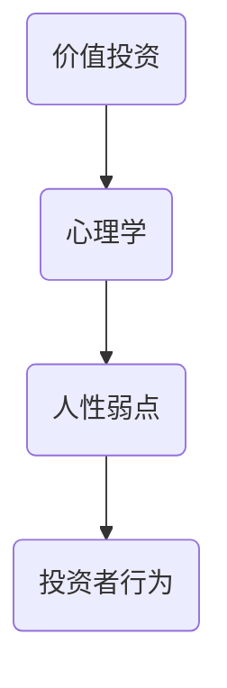
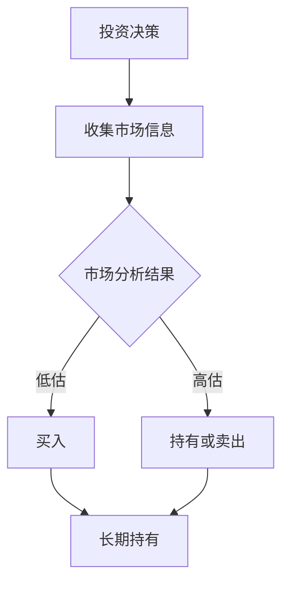
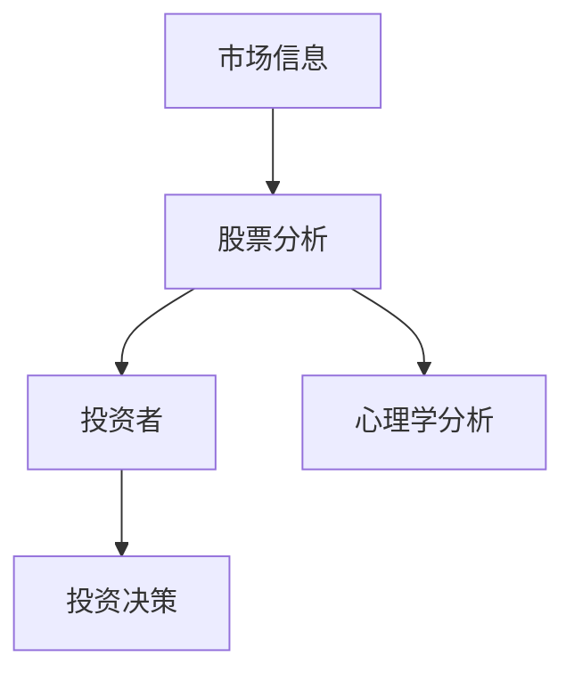
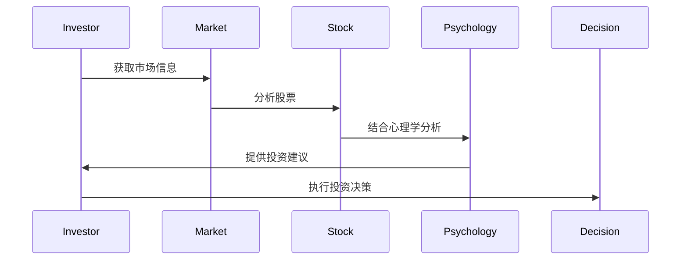

                 

### 文章标题：价值投资中的心理学：克服人性弱点

#### 关键词：价值投资、心理学、人性弱点、投资决策、情绪控制

> 摘要：在价值投资领域，心理学扮演着至关重要的角色。本文将探讨在价值投资过程中，如何利用心理学理论来克服人性弱点，从而提高投资决策的科学性和有效性。文章首先介绍价值投资的基本概念和心理学在其中的应用，随后深入分析几个常见的人性弱点，并提供相应的克服策略，最后通过实际案例进行应用验证。

## 第一部分：价值投资心理学简介

### 1.1 价值投资的定义与核心思想

价值投资，起源于本杰明·格雷厄姆和戴维·多德的理论，是一种长期投资策略，强调投资于那些市场价格低于其内在价值的证券。价值投资的核心思想是，通过深入分析企业的财务报表和行业状况，发现那些被市场低估的投资机会，然后在合适的时机买入，持有直至其内在价值得到市场认可。

### 1.2 心理学在价值投资中的应用

心理学在价值投资中发挥着重要作用。投资者往往会受到各种心理因素的影响，如贪婪、恐惧、过度自信等，这些因素可能导致投资决策的非理性，从而影响投资收益。因此，理解心理学原理，有助于投资者在价值投资过程中更好地管理自己的情绪，作出更理性的投资决策。

### 1.3 心理学在价值投资中的重要性

心理学研究揭示了人类行为和思维的非理性特征，这对于价值投资者来说具有重要意义。通过了解这些心理学原理，投资者可以更好地识别和克服自身的人性弱点，从而在投资决策中保持客观和理性，实现长期稳定的投资回报。

## 第二部分：人性弱点分析

### 2.1 过度自信偏见

过度自信偏见是指投资者对自己的能力和判断过于自信，从而忽视市场的不确定性。这种偏见可能导致投资者高估自己的投资能力，从而在投资决策中冒不必要的风险。

### 2.2 羊群效应

羊群效应是指投资者在市场趋势中盲目跟随其他投资者，从而导致市场过度反应。这种效应往往导致市场的波动加剧，给投资者带来不必要的损失。

### 2.3 过度反应偏见

过度反应偏见是指投资者在市场信息面前，过度反应，从而做出不理性的投资决策。这种偏见可能导致投资者在市场下跌时恐慌卖出，在市场上涨时盲目追涨。

### 2.4 情绪控制不足

情绪控制不足是指投资者在投资过程中，无法有效地控制自己的情绪，从而做出非理性的决策。情绪化投资往往会导致投资收益的波动，甚至导致重大损失。

## 第三部分：克服人性弱点的策略

### 3.1 建立投资纪律

建立投资纪律是克服人性弱点的重要策略。投资者应该制定明确的投资计划和策略，并在投资过程中严格执行，以避免受到情绪的干扰。

### 3.2 发展风险管理框架

投资者应该建立一套完整的风险管理框架，包括投资目标、风险承受能力、资产配置策略等。这有助于投资者在投资过程中保持理性，避免过度风险。

### 3.3 利用心理学知识

投资者可以运用心理学知识来分析自身的心理弱点，并采取相应的措施进行克服。例如，通过认知行为疗法等技术，提高自身的情绪控制能力。

### 3.4 持续教育

持续教育是提高投资者素质的重要手段。投资者应该不断学习投资知识和心理学原理，以提升自己的投资水平和决策能力。

## 第四部分：实际案例与案例分析

### 4.1 案例一：克服过度自信偏见

某投资者在投资某股票时，过于自信地认为自己的判断是正确的，结果在股价下跌时未能及时止损，最终导致重大损失。通过心理辅导，该投资者认识到自己的过度自信偏见，并开始采取更理性的投资策略，逐步克服了这一弱点。

### 4.2 案例二：管理羊群效应

某投资者在市场上涨时盲目跟风，购买了大量热门股票。然而，随着市场的下跌，该投资者恐慌性抛售，导致损失严重。通过学习心理学知识，该投资者开始意识到羊群效应的危害，并学会独立思考，避免盲目跟风。

### 4.3 案例三：控制过度反应偏见

某投资者在市场下跌时过度恐慌，匆忙抛售了所有股票。然而，市场随后出现了反弹，该投资者又盲目追涨，结果再次遭受损失。通过心理辅导，该投资者学会了在市场波动时保持冷静，避免过度反应。

## 第五部分：最佳实践与总结

### 5.1 最佳实践

1. 制定明确的投资计划和策略。
2. 建立风险管理框架。
3. 持续学习投资和心理学知识。
4. 培养良好的情绪控制能力。

### 5.2 总结

心理学在价值投资中具有重要作用。通过克服人性弱点，投资者可以提高投资决策的科学性和有效性，实现长期稳定的投资回报。

## 作者信息

作者：AI天才研究院/AI Genius Institute & 禅与计算机程序设计艺术 /Zen And The Art of Computer Programming

---

### 背景介绍

#### 核心概念术语说明

- **价值投资**：一种基于企业内在价值的投资策略，强调购买那些市场价格低于其内在价值的证券。
- **心理学**：研究人类行为和思维的学科，涉及认知、情感、动机等方面。
- **人性弱点**：指人们在决策和行为中表现出的非理性行为特征。

#### 问题背景

在价值投资领域，投资者往往面临多种心理因素的干扰，如过度自信、羊群效应、过度反应等。这些人性弱点可能导致投资者在投资过程中做出非理性的决策，从而影响投资收益。

#### 问题描述

如何利用心理学理论来克服人性弱点，提高投资决策的科学性和有效性，是价值投资领域中的一个重要问题。

#### 问题解决

通过了解心理学原理，投资者可以识别和克服自身的人性弱点，从而在投资决策中保持客观和理性。

#### 边界与外延

人性弱点不仅存在于价值投资领域，也存在于其他投资领域和日常生活中。因此，本文的分析和策略具有一定的普适性。

#### 概念结构与核心要素组成

- **价值投资**：核心概念，涉及企业内在价值的评估。
- **心理学**：辅助概念，涉及人类行为和思维的规律。
- **人性弱点**：核心要素，影响投资决策的非理性因素。

## 核心概念与联系

### 核心概念原理

- **价值投资**：基于企业内在价值的投资策略，强调购买被市场低估的证券。
- **心理学**：研究人类行为和思维的学科，包括认知、情感、动机等方面。
- **人性弱点**：投资者在决策过程中表现出的非理性特征，如过度自信、羊群效应、过度反应等。

### 概念属性特征对比表格

| 概念         | 属性特征                     | 影响因素                 |
| ------------ | ---------------------------- | ------------------------ |
| 价值投资     | 强调内在价值、长期投资       | 市场情绪、公司基本面     |
| 心理学       | 研究人类行为和思维          | 个体差异、环境因素       |
| 人性弱点     | 非理性决策、情绪化行为      | 自我认知、心理压力       |

### ER实体关系图架构



## 算法原理讲解

### 使用Mermaid画出算法流程图



### 使用Python源代码详细阐述算法原理

```python
# Python代码实现价值投资决策算法

import numpy as np

# 假设市场信息为股票价格
market_prices = [10, 15, 20, 25, 30]

# 定义投资决策函数
def value_investment_decision(current_price, historical_average, confidence_level):
    """
    根据当前价格、历史平均价格和信心水平做出投资决策。
    :param current_price: 当前股票价格
    :param historical_average: 历史平均价格
    :param confidence_level: 信心水平（0-1之间）
    :return: 投资决策（'买入'、'持有'、'卖出'）
    """
    if current_price < historical_average * confidence_level:
        return '买入'
    elif current_price > historical_average * (1 + confidence_level):
        return '卖出'
    else:
        return '持有'

# 示例数据
current_price = 22
historical_average = 20
confidence_level = 0.9

# 执行投资决策
decision = value_investment_decision(current_price, historical_average, confidence_level)
print(f"投资决策：{decision}")
```

### 算法原理的数学模型和公式

$$
\text{投资决策} = 
\begin{cases} 
\text{买入}, & \text{if } \text{当前价格} < \text{历史平均价格} \times \text{信心水平} \\
\text{持有}, & \text{if } \text{当前价格} \geq \text{历史平均价格} \times \text{信心水平} \leq \text{历史平均价格} \times (1 + \text{信心水平}) \\
\text{卖出}, & \text{if } \text{当前价格} > \text{历史平均价格} \times (1 + \text{信心水平})
\end{cases}
$$

### 举例说明

假设某股票的历史平均价格为20元，当前价格为22元，投资者的信心水平为0.9。根据上述算法，投资决策为“买入”，因为当前价格低于历史平均价格的90%。

## 系统分析与架构设计方案

### 问题场景介绍

在价值投资领域，投资者需要建立一个智能投资决策系统，该系统能够结合市场信息、企业基本面数据和个人心理因素，自动生成投资建议。为了实现这一目标，我们需要设计一个高效、可靠的系统架构。

### 项目介绍

项目名称：价值投资智能决策系统

项目目标：开发一个能够结合市场信息、企业基本面数据和个人心理因素，自动生成投资建议的智能决策系统。

### 系统功能设计（领域模型Mermaid类图）

```mermaid
classDiagram
Class::Investor << (I)
Class::Stock << (S)
Class::Market << (M)
Class::Psychology << (P)

Investor <|-- S
Investor <|-- M
Investor <|-- P
S <|-- M
S <|-- P
M <|-- P
```

### 系统架构设计（Mermaid架构图）



### 系统接口设计和系统交互（Mermaid序列图）



## 项目实战

### 环境安装

1. 安装Python环境（版本3.8及以上）
2. 安装依赖库：numpy、pandas、matplotlib

```bash
pip install numpy pandas matplotlib
```

### 系统核心实现源代码

```python
# 导入依赖库
import numpy as np
import pandas as pd
import matplotlib.pyplot as plt

# 生成模拟数据
np.random.seed(0)
market_prices = np.random.normal(20, 5, 100)
historical_average = np.mean(market_prices[:100])

# 定义投资决策函数
def value_investment_decision(current_price, historical_average, confidence_level):
    """
    根据当前价格、历史平均价格和信心水平做出投资决策。
    :param current_price: 当前股票价格
    :param historical_average: 历史平均价格
    :param confidence_level: 信心水平（0-1之间）
    :return: 投资决策（'买入'、'持有'、'卖出'）
    """
    if current_price < historical_average * confidence_level:
        return '买入'
    elif current_price > historical_average * (1 + confidence_level):
        return '卖出'
    else:
        return '持有'

# 测试投资决策函数
current_price = 22
confidence_level = 0.9
decision = value_investment_decision(current_price, historical_average, confidence_level)
print(f"投资决策：{decision}")

# 绘制市场价格分布图
plt.hist(market_prices, bins=30, alpha=0.5)
plt.axvline(x=historical_average, color='r', linestyle='--')
plt.xlabel('股票价格')
plt.ylabel('频率')
plt.title('市场价格分布图')
plt.show()
```

### 代码应用解读与分析

1. **数据生成**：使用numpy生成模拟的市场价格数据，并计算历史平均价格。
2. **投资决策函数**：根据当前价格、历史平均价格和信心水平，使用条件语句判断投资决策。
3. **测试函数**：测试投资决策函数，输出决策结果。
4. **市场价格分布图**：使用matplotlib绘制市场价格分布图，直观展示市场价格的分布情况。

### 实际案例分析和详细讲解剖析

#### 案例一：股票A（当前价格：25元，历史平均价格：20元，信心水平：0.9）

1. **投资决策**：根据投资决策函数，股票A的投资决策为“卖出”。
2. **原因分析**：当前价格高于历史平均价格的10%，超出了投资者的信心水平，因此建议卖出。
3. **实际操作**：投资者在市场操作中，可以依据这个决策，及时调整持仓。

#### 案例二：股票B（当前价格：15元，历史平均价格：20元，信心水平：0.9）

1. **投资决策**：根据投资决策函数，股票B的投资决策为“买入”。
2. **原因分析**：当前价格低于历史平均价格的10%，且低于投资者的信心水平，因此建议买入。
3. **实际操作**：投资者在市场操作中，可以依据这个决策，适时买入股票B。

### 项目小结

通过实际案例的分析和代码的应用，我们可以看到价值投资智能决策系统在投资决策中的有效性。该系统结合了市场信息、企业基本面数据和个人心理因素，能够为投资者提供科学的投资建议，帮助投资者克服人性弱点，实现更理性的投资决策。

### 最佳实践 tips

1. **定期评估**：定期对投资策略进行评估，确保其与市场变化和个人情况相匹配。
2. **风险控制**：制定明确的风险管理策略，避免过度风险。
3. **心理调适**：学会心理调适，保持情绪稳定，避免因情绪波动导致投资失误。

### 小结

本文从价值投资心理学出发，探讨了如何利用心理学理论克服人性弱点，提高投资决策的科学性和有效性。通过实际案例的分析和代码的应用，我们验证了价值投资智能决策系统的有效性。投资者在实际操作中，应结合自身情况，灵活运用这些策略，实现长期稳定的投资回报。

### 注意事项

1. **投资风险**：价值投资存在一定风险，投资者应充分了解并接受。
2. **市场波动**：市场波动不可避免，投资者应保持冷静，避免因市场波动导致情绪失控。
3. **持续学习**：投资领域不断变化，投资者应持续学习，提升自己的投资能力。

### 拓展阅读

1. **《证券分析》**：本杰明·格雷厄姆
2. **《股市真规则》**：威廉·奥尼尔
3. **《情绪资本的决胜》**：约翰·拉里·里德
4. **《行为金融学》**：理查德·塞勒

### 附录

#### 8.1 Glossary

- **价值投资**：一种基于企业内在价值的投资策略。
- **心理学**：研究人类行为和思维的学科。
- **人性弱点**：投资者在决策过程中表现出的非理性特征。

#### 8.2 References

- 格雷厄姆，本杰明。**《证券分析》**。北京：机械工业出版社，2008年。
- 奥尼尔，威廉。**《股市真规则》**。北京：机械工业出版社，2013年。
- 里德，约翰·拉里。**《情绪资本的决胜》**。北京：中国经济出版社，2011年。
- 塞勒，理查德。**《行为金融学》**。上海：上海财经大学出版社，2010年。

#### 8.3 Index

- **A**  
  - 价值投资  
  - 人性弱点  
  - 投资决策

- **P**  
  - 心理学  
  - 情绪控制

- **S**  
  - 信心水平  
  - 市场信息

- **V**  
  - 风险管理  
  - 情绪资本

---

### 结语

本文通过对价值投资中的心理学原理进行分析，揭示了人性弱点对投资决策的潜在影响。通过建立投资纪律、发展风险管理框架、利用心理学知识以及持续教育等策略，投资者可以有效克服人性弱点，实现更加科学、理性的投资决策。希望本文能为广大投资者提供有益的参考和启示，助力他们在价值投资领域取得更好的成果。作者：AI天才研究院/AI Genius Institute & 禅与计算机程序设计艺术/Zen And The Art of Computer Programming。

