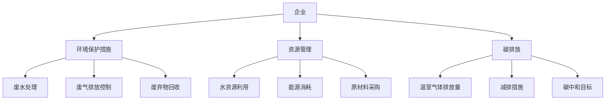
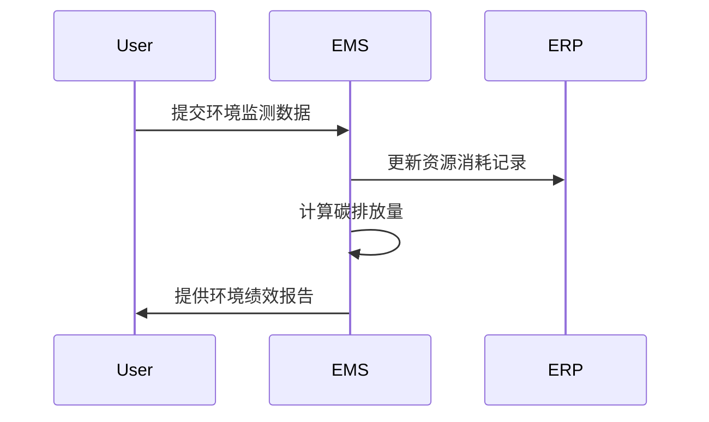
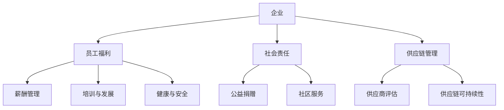
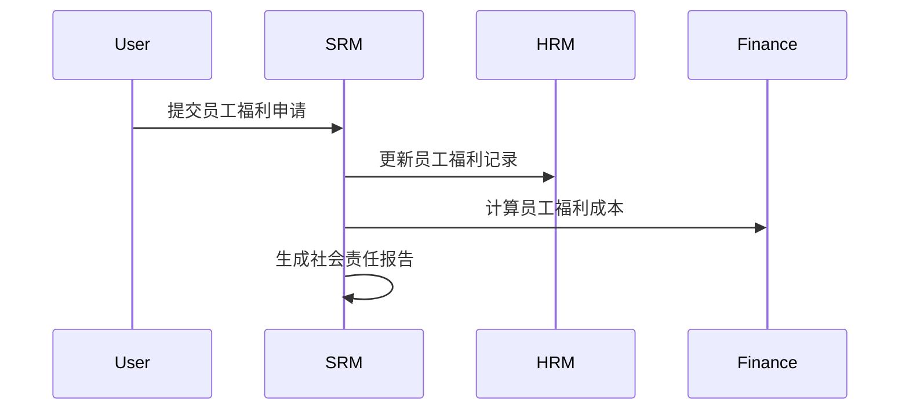
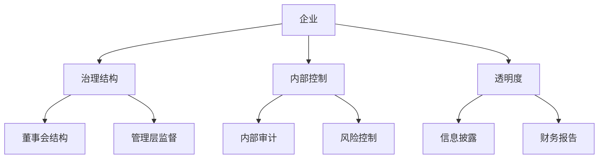
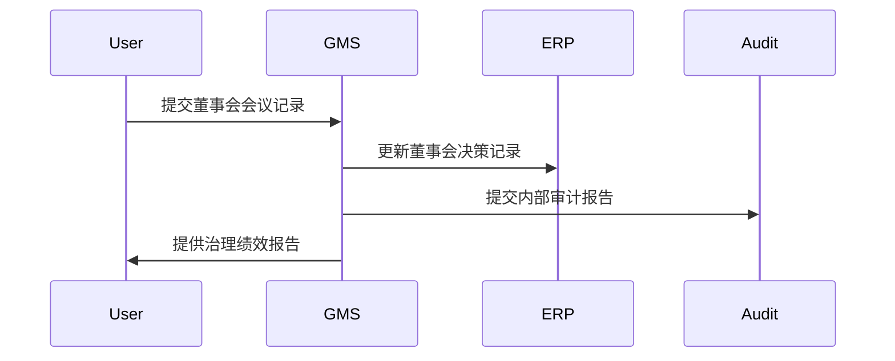

                 

# 价值投资中的环境、社会和治理（ESG）因素考量

## 关键词
- 价值投资
- 环境因素
- 社会因素
- 治理因素
- ESG评价方法
- 投资决策

## 摘要
本文旨在探讨在价值投资过程中，如何考量企业的环境、社会和治理（ESG）因素。通过对ESG因素的核心概念、具体内容、评价方法和工具的详细分析，本文揭示了ESG因素在投资决策中的重要性。文章分为四个部分，首先介绍ESG因素在价值投资中的背景和重要性，然后详细阐述ESG因素的具体内容，接着讨论ESG评价方法和工具，最后分析ESG因素与投资决策的关系，并给出具体的投资建议。

## 第一部分：背景介绍

### 核心概念

**ESG因素**：环境（Environmental）、社会（Social）和治理（Governance）因素，是评估企业可持续发展能力和价值的重要指标。环境因素涉及企业的环境保护措施和资源管理；社会因素涵盖企业的社会责任和员工、社区关系；治理因素则关注企业的内部治理结构和透明度。

**问题背景**：随着全球经济的快速发展和环境问题的日益严重，企业的社会责任和治理结构越来越受到投资者和公众的关注。ESG因素已经成为评估企业价值的重要维度，投资者在做出投资决策时，越来越重视企业的ESG表现。

**问题描述**：在价值投资中，如何有效考量ESG因素成为投资者和企业管理者面临的重要挑战。ESG因素的数据收集、评估方法和应用需要结合企业的实际情况和行业特点进行深入分析。

**问题解决**：本文旨在为投资者和企业管理者提供一套完整的ESG考量框架和方法，通过系统的分析工具和实践案例，帮助读者理解和应用ESG因素在价值投资中的重要性。

**边界与外延**：ESG因素不仅包括环境、社会和治理三个核心方面，还涉及企业内部的管理、外部的社会责任以及全球环境的可持续发展。在价值投资中，ESG因素的考量需要综合多方面的信息，形成系统的评估体系。

**概念结构与核心要素组成**：
- **环境因素**：包括环境保护措施、资源消耗、碳排放等。
- **社会因素**：包括社会责任、员工福利、社区参与等。
- **治理因素**：包括治理结构、内部控制、透明度等。

## 1.1 ESG因素在价值投资中的重要性

ESG因素在价值投资中的重要性日益凸显，主要体现在以下几个方面：

### 1.1.1 提高投资收益

研究表明，长期持有注重ESG表现的企业，可以获得更高的投资回报。这是因为ESG表现良好的企业往往具有更稳健的经营模式、更良好的声誉和更广泛的社会支持，从而在市场竞争中处于有利地位。

### 1.1.2 风险管理

ESG因素可以帮助投资者识别和评估潜在的风险。例如，环境因素可能导致企业的运营成本增加，社会因素可能导致企业的品牌形象受损，治理因素可能导致企业的运营效率低下。通过考量ESG因素，投资者可以提前识别这些风险，并采取相应的风险管理措施。

### 1.1.3 社会责任

随着社会责任意识的增强，越来越多的投资者希望将投资与社会责任相结合。注重ESG投资不仅可以实现财务回报，还可以为社会带来积极影响，符合投资者的社会责任感。

## 1.2 ESG因素的具体内容

ESG因素涵盖了企业环境保护、社会责任和治理结构等多个方面，具体内容包括：

### 1.2.1 环境因素

环境因素主要关注企业的环境保护措施和可持续发展实践。包括：

- **环境保护措施**：企业采取的环境保护政策、环保技术、资源节约和循环利用等。
- **碳排放**：企业的碳排放量、碳排放削减措施和碳中和目标等。
- **资源消耗**：企业的水资源消耗、能源消耗和原材料采购等。

### 1.2.2 社会因素

社会因素主要关注企业的社会责任和社区参与。包括：

- **员工福利**：企业的员工薪酬、员工培训、员工安全和健康等。
- **社会责任**：企业的社会责任报告、慈善捐赠、公益活动和社区参与等。
- **供应链管理**：企业的供应链管理政策、供应商社会责任评估和供应链可持续发展等。

### 1.2.3 治理因素

治理因素主要关注企业的治理结构和内部控制。包括：

- **治理结构**：企业的董事会结构、管理层监督机制、股东大会和信息披露等。
- **内部控制**：企业的内部控制制度、风险管理、合规性和内部审计等。
- **透明度**：企业的信息披露质量、财务透明度和市场透明度等。

## 1.3 ESG评价方法和工具

在价值投资中，评估企业的ESG表现是至关重要的。以下介绍几种常见的ESG评价方法和工具：

### 1.3.1 自评法

自评法是指企业自行评估其ESG表现，并发布社会责任报告。这种方法可以提供企业对自身ESG表现的自我评估，但可能存在信息不透明和主观偏差的问题。

### 1.3.2 第三方评估

第三方评估是指由独立机构对企业的ESG表现进行评估，并提供评估报告。这种方法可以提供更客观和全面的评估结果，但评估成本较高。

### 1.3.3 数据分析

数据分析是指利用大数据和人工智能技术对企业的ESG表现进行量化分析。这种方法可以提供更精确和实时的评估结果，但需要具备一定的技术能力。

## 1.4 ESG因素与投资决策的关系

ESG因素与投资决策密切相关，以下从三个方面分析ESG因素如何影响投资决策：

### 1.4.1 识别投资机会

通过考量ESG因素，投资者可以识别出那些在环境保护、社会责任和治理结构方面表现良好的企业，从而发现潜在的投资机会。

### 1.4.2 评估投资风险

ESG

----------------------------------------------------------------

## 第二部分：深入探讨ESG因素

### 2.1 环境因素

环境因素是ESG框架中的一个关键组成部分，它关注企业对自然环境的影响以及企业自身的可持续发展策略。环境因素的考量不仅关乎企业的社会责任，还直接影响到企业的长期盈利能力和市场竞争力。

#### 2.1.1 核心概念

环境因素主要包括以下几个方面：

- **环境保护措施**：企业采取的环境保护政策、技术手段和实际行动，如废水处理、废气排放控制、废弃物回收等。
- **资源管理**：企业对水资源、能源和原材料的利用效率，包括资源采购、循环利用和节约措施。
- **碳排放**：企业的温室气体排放量及其减排措施，包括碳中和目标和行动。

#### 2.1.2 概念属性特征对比表格

| 环境因素         | 描述                                                     | 重要性 |
|----------------|------------------------------------------------------------|--------|
| 环境保护措施     | 企业为减少对环境负面影响而采取的行动                     | 高     |
| 资源管理         | 企业在资源使用过程中的效率和质量                         | 中     |
| 碳排放           | 企业温室气体排放量及减排效果                             | 高     |

#### 2.1.3 ER实体关系图架构

#### 2.1.4 算法原理讲解

为了更好地理解环境因素在企业可持续发展中的作用，我们可以借助以下算法原理：

1. **碳排放计算模型**：

   $$ 
   C = C_{0} + r \cdot t 
   $$
   
   其中，$C$ 表示总碳排放量，$C_{0}$ 为初始碳排放量，$r$ 为碳排放增长率，$t$ 为时间。

2. **资源利用效率模型**：

   $$
   E = \frac{R}{T}
   $$
   
   其中，$E$ 表示资源利用效率，$R$ 为资源消耗量，$T$ 为生产周期。

通过这些模型，投资者可以量化企业的环境绩效，从而做出更明智的投资决策。

#### 2.1.5 系统分析与架构设计方案

在环境因素的考量中，系统分析与架构设计方案至关重要。以下是一个基本的环境因素分析架构：

- **项目介绍**：环境管理系统（EMS）
- **系统功能设计**：包括环境监测、资源管理、碳排放报告等。
- **系统架构设计**：采用分层架构，包括数据层、业务逻辑层和表示层。
- **系统接口设计**：定义与外部系统（如ERP系统）的数据交互接口。
- **系统交互**：使用Mermaid序列图展示系统的主要交互流程。

### 2.2 社会因素

社会因素是ESG框架中的另一个关键组成部分，它关注企业对社会的影响，包括员工、社区、供应链等。社会因素的考量不仅有助于提升企业的声誉，还能为企业带来潜在的商业机会。

#### 2.2.1 核心概念

社会因素主要包括以下几个方面：

- **员工福利**：包括薪酬、培训、健康与安全等。
- **社会责任**：企业对社会公益事业的支持，如慈善捐赠、公益活动和社区服务。
- **供应链管理**：企业对供应链的监管，包括供应商社会责任评估和供应链可持续发展。

#### 2.2.2 概念属性特征对比表格

| 社会因素         | 描述                                                     | 重要性 |
|----------------|------------------------------------------------------------|--------|
| 员工福利         | 企业为员工提供的工作和生活条件                           | 高     |
| 社会责任         | 企业对社会的贡献和公益行为                               | 中     |
| 供应链管理       | 企业对供应链的监管和管理，确保供应链的可持续性           | 中     |

#### 2.2.3 ER实体关系图架构

#### 2.2.4 算法原理讲解

为了更好地理解社会因素在企业社会责任中的作用，我们可以借助以下算法原理：

1. **员工满意度模型**：

   $$
   S = \frac{\sum_{i=1}^{n} S_i}{n}
   $$

   其中，$S$ 表示员工总体满意度，$S_i$ 为第 $i$ 位员工的满意度。

2. **社会责任贡献度模型**：

   $$
   R = \frac{D}{C}
   $$

   其中，$R$ 表示社会责任贡献度，$D$ 为企业对社会公益事业的投入，$C$ 为企业的年度利润。

通过这些模型，投资者可以量化企业的社会绩效，从而做出更明智的投资决策。

#### 2.2.5 系统分析与架构设计方案

在社会因素的考量中，系统分析与架构设计方案同样至关重要。以下是一个基本的社会因素分析架构：

- **项目介绍**：社会责任管理系统（SRM）
- **系统功能设计**：包括员工福利管理、社会责任报告、供应链管理监控等。
- **系统架构设计**：采用分布式架构，确保系统的可扩展性和安全性。
- **系统接口设计**：定义与外部系统（如人力资源管理系统、财务系统）的数据交互接口。
- **系统交互**：使用Mermaid序列图展示系统的主要交互流程。

### 2.3 治理因素

治理因素是ESG框架中的第三个关键组成部分，它关注企业的内部治理结构和透明度。良好的治理结构有助于确保企业的长远发展和持续增长，提高企业的运营效率和风险控制能力。

#### 2.3.1 核心概念

治理因素主要包括以下几个方面：

- **治理结构**：企业的董事会和管理层结构，包括董事会成员的任命、职责和决策过程。
- **内部控制**：企业的内部控制制度和风险管理机制，包括内部审计、合规性和风险控制。
- **透明度**：企业的信息披露质量和透明度，包括财务报告、管理报告和外部审计报告。

#### 2.3.2 概念属性特征对比表格

| 治理因素         | 描述                                                     | 重要性 |
|----------------|------------------------------------------------------------|--------|
| 治理结构         | 企业的董事会和管理层组织结构                             | 高     |
| 内部控制         | 企业为规范运营和风险控制所采取的措施                       | 中     |
| 透明度           | 企业对外部投资者和利益相关者的信息披露质量                 | 中     |

#### 2.3.3 ER实体关系图架构

#### 2.3.4 算法原理讲解

为了更好地理解治理因素对企业运作的影响，我们可以借助以下算法原理：

1. **治理结构有效性模型**：

   $$
   E = \frac{D}{C}
   $$

   其中，$E$ 表示治理结构有效性，$D$ 为董事会和管理层的决策质量，$C$ 为企业的经营成本。

2. **内部控制效率模型**：

   $$
   I = \frac{R}{S}
   $$

   其中，$I$ 表示内部控制效率，$R$ 为风险控制效果，$S$ 为风险暴露程度。

通过这些模型，投资者可以量化企业的治理绩效，从而做出更明智的投资决策。

#### 2.3.5 系统分析与架构设计方案

在治理因素的考量中，系统分析与架构设计方案同样至关重要。以下是一个基本的治理因素分析架构：

- **项目介绍**：企业治理管理系统（GMS）
- **系统功能设计**：包括董事会管理、内部控制监控、信息披露管理等。
- **系统架构设计**：采用模块化架构，确保系统的灵活性和可扩展性。
- **系统接口设计**：定义与外部系统（如ERP系统、审计系统）的数据交互接口。
- **系统交互**：使用Mermaid序列图展示系统的主要交互流程。

### 2.4 ESG因素的整合与综合评估

ESG因素的考量需要综合考虑企业的整体表现，而不仅仅是单一因素。以下是一个整合ESG因素的评估模型：

$$
P = w_1 \cdot E + w_2 \cdot S + w_3 \cdot G
$$

其中，$P$ 表示企业的ESG绩效总分，$w_1$、$w_2$、$w_3$ 分别为环境、社会和治理因素权重。

通过这个模型，投资者可以综合评估企业的ESG表现，从而为投资决策提供依据。

### 2.5 结论

ESG因素在价值投资中的重要性不可忽视。通过深入探讨环境、社会和治理因素，本文揭示了这些因素对企业的长期价值创造和风险管理的影响。投资者应当将ESG因素纳入投资决策体系，以实现长期稳定的投资回报。

## 第三部分：ESG评价方法和工具

### 3.1 自评法

自评法是指企业自行评估其ESG表现，并发布社会责任报告。这种方法的主要优势在于成本较低，同时能够提高企业的透明度和自我监督能力。然而，自评法也存在一些问题，如评估结果的客观性和可靠性可能受到质疑。为了提高自评法的有效性，企业可以采用以下策略：

- **设立专门机构**：成立专门负责ESG评估的部门或委员会，确保评估过程的独立性和专业性。
- **外部审核**：邀请第三方机构对自评结果进行审核，提高评估的客观性和公信力。
- **公众参与**：鼓励利益相关者参与评估过程，收集多方意见，提高评估的全面性和公正性。

### 3.2 第三方评估

第三方评估是指由独立机构对企业的ESG表现进行评估，并提供评估报告。第三方评估具有较高的客观性和公信力，能够为企业提供更全面和准确的ESG绩效评估。以下是一些常见的第三方评估机构：

- **国际评级机构**：如MSCI、Sustainalytics、RobecoSAM等。
- **行业组织**：如联合国全球契约（UNGC）、国际可持续发展准则（ISSB）等。
- **咨询公司**：如毕马威（KPMG）、德勤（Deloitte）、安永（EY）等。

第三方评估的流程通常包括以下步骤：

1. **数据收集**：评估机构通过问卷调查、访谈、现场考察等方式收集企业的ESG相关信息。
2. **数据分析**：评估机构对收集到的数据进行分析，识别企业的ESG优势和不足。
3. **评估报告**：评估机构根据分析结果，撰写评估报告，并提出改进建议。

### 3.3 数据分析

数据分析是指利用大数据和人工智能技术对企业的ESG表现进行量化分析。这种方法可以提供更精确和实时的评估结果，但需要具备一定的技术能力。以下是一些常用的数据分析工具和模型：

- **大数据分析平台**：如Splunk、Tableau等，用于处理和分析大量ESG相关数据。
- **机器学习模型**：如决策树、随机森林、神经网络等，用于预测企业的ESG绩效。
- **自然语言处理（NLP）**：用于分析企业社会责任报告、新闻稿等文本数据，提取关键信息。

数据分析的步骤通常包括：

1. **数据收集**：从各种来源收集企业的ESG数据，包括财务报告、社会责任报告、公开信息等。
2. **数据预处理**：清洗和整合数据，确保数据的质量和一致性。
3. **数据分析**：使用数据分析工具和模型，对数据进行量化分析，识别ESG绩效的关键因素。
4. **结果呈现**：将分析结果以图表、报告等形式呈现，为投资者提供决策依据。

### 3.4 综合评价方法

在实际应用中，企业通常需要综合使用多种评估方法和工具，以获得更全面和准确的ESG绩效评估。以下是一个综合评价方法的框架：

1. **确定评估目标**：明确企业需要评估的ESG领域和目标，如环境保护、社会责任、治理结构等。
2. **选择评估方法**：根据企业的实际情况和评估需求，选择合适的评估方法，如自评法、第三方评估、数据分析等。
3. **数据收集**：通过问卷调查、访谈、现场考察等方式，收集企业的ESG相关数据。
4. **数据整合**：将不同来源的数据进行整合，确保数据的质量和一致性。
5. **数据分析**：使用数据分析工具和模型，对数据进行量化分析，识别ESG绩效的关键因素。
6. **评估报告**：撰写评估报告，总结企业的ESG绩效，并提出改进建议。
7. **持续改进**：根据评估结果，制定改进计划，并持续跟踪和评估ESG绩效。

### 3.5 结论

ESG评价方法和工具的选择和应用需要根据企业的实际情况和评估需求进行。自评法、第三方评估和数据分析等方法各有优缺点，企业应综合考虑，选择最适合自身的评估方法和工具。通过科学的ESG评价，企业可以更好地理解自身的ESG表现，为投资者提供决策依据，同时促进企业的可持续发展。

## 第四部分：ESG因素与投资决策的关系

### 4.1 识别投资机会

ESG因素在投资决策中的重要性日益凸显，其中一个关键作用是帮助投资者识别具有潜在投资机会的企业。通过考量企业的ESG表现，投资者可以识别出那些在环境保护、社会责任和治理结构方面表现良好的企业，这些企业往往具有以下优势：

- **长期盈利能力**：注重ESG表现的企业通常拥有更稳健的经营模式，能够在长期内实现可持续发展，从而提高盈利能力。
- **市场竞争力**：良好的ESG表现有助于提升企业的品牌形象和市场竞争力，为企业带来更多的商业机会。
- **风险管理**：通过考量ESG因素，投资者可以提前识别潜在的风险，如环境法规变化、社会责任问题等，从而采取相应的风险管理措施。

### 4.2 评估投资风险

ESG因素在投资决策中的另一个重要作用是帮助投资者评估投资风险。环境、社会和治理因素可能对企业的运营和财务表现产生重大影响，以下是一些具体的影响：

- **环境风险**：环境污染、资源短缺、气候变化等环境问题可能增加企业的运营成本和财务风险。
- **社会风险**：社会责任问题如员工福利、社区关系、供应链管理等可能影响企业的声誉和市场地位。
- **治理风险**：内部治理问题如董事会结构、内部控制、信息披露等可能影响企业的运营效率和透明度。

通过考量ESG因素，投资者可以提前识别这些风险，并采取相应的风险管理措施，如分散投资、投资保险等，从而降低投资风险。

### 4.3 社会责任投资

社会责任投资（SRI）是指投资者在做出投资决策时，不仅关注企业的财务表现，还关注企业的社会责任和可持续发展。随着社会责任意识的增强，越来越多的投资者选择进行SRI。

SRI的主要形式包括：

- **负面筛选**：排除那些在ESG表现方面存在重大问题的企业，如环境污染严重的企业、违反人权的企业等。
- **正面筛选**：选择那些在ESG表现方面表现良好的企业，如环保科技企业、社会责任企业等。
- **股东参与**：通过股东参与，推动企业改善ESG表现，如提交股东提案、参与董事会选举等。

SRI不仅有助于投资者实现财务回报，还能为社会带来积极影响，符合投资者的社会责任感。

### 4.4 综合考量

在投资决策中，投资者需要综合考虑企业的ESG表现，而不仅仅是单一因素。以下是一个综合考量ESG因素的框架：

1. **确定投资目标**：明确投资目标，如长期稳定回报、社会责任等。
2. **评估ESG绩效**：使用ESG评价方法和工具，评估企业的ESG绩效。
3. **识别投资机会**：根据ESG绩效评估结果，识别具有潜在投资机会的企业。
4. **评估投资风险**：综合考虑环境、社会和治理因素，评估投资风险。
5. **制定投资策略**：根据投资目标和风险承受能力，制定相应的投资策略。

### 4.5 结论

ESG因素在投资决策中发挥着重要作用，通过识别投资机会、评估投资风险和进行社会责任投资，投资者可以更好地实现财务回报和社会责任。投资者应注重ESG因素的综合考量，制定科学合理的投资策略，以实现长期稳定的投资回报。

## 第五部分：实战案例分析

### 5.1 案例背景

为了更好地理解ESG因素在价值投资中的应用，我们以苹果公司（Apple Inc.）为例进行分析。苹果公司是一家全球知名的科技公司，以其创新的产品和卓越的ESG表现而闻名。本文将分析苹果公司在环境、社会和治理三个方面的ESG表现，探讨其如何影响投资决策。

### 5.2 环境因素

苹果公司在环境保护方面采取了多项举措，其ESG报告显示，公司在环境可持续性方面取得了显著成绩。以下是一些关键指标：

- **能源使用**：苹果公司承诺到2030年实现全球业务范围100%使用可再生能源，截至2022年，公司已实现80%的业务范围使用可再生能源。
- **碳排放**：苹果公司设立了碳中和目标，计划到2030年实现绝对碳排放量为零，并已采取措施减少供应链的碳排放。
- **资源管理**：苹果公司注重资源的循环利用，其产品中的可再生材料使用比例逐年增加，同时推出产品回收计划。

#### 案例分析

苹果公司在环境因素方面的良好表现为其投资者带来了多重收益：

- **提高品牌形象**：苹果公司在环保领域的领先地位有助于提升其品牌形象，吸引更多关注环境保护的消费者和投资者。
- **降低运营成本**：通过采用可再生能源和资源循环利用等措施，苹果公司可以降低能源和材料成本，提高运营效率。
- **风险管理**：苹果公司通过提前采取环保措施，降低了因环境法规变化而产生的合规风险和运营风险。

### 5.3 社会因素

在社会因素方面，苹果公司同样表现出色，其社会责任项目涵盖了员工福利、社区参与和供应链管理等多个方面。以下是一些关键指标：

- **员工福利**：苹果公司为员工提供竞争力的薪酬和福利，包括健康保险、退休金计划和员工培训等。
- **社区参与**：苹果公司积极参与社区建设，通过教育、健康和环保等公益项目回馈社会。
- **供应链管理**：苹果公司对其供应链进行严格监管，确保供应商遵守社会责任和环保标准。

#### 案例分析

苹果公司在社会因素方面的优异表现对投资者产生了积极影响：

- **提高员工满意度**：良好的员工福利和培训计划有助于提高员工满意度，降低员工流失率，从而提高企业运营效率。
- **增强品牌忠诚度**：通过积极参与社区建设和公益事业，苹果公司增强了品牌忠诚度，吸引了更多消费者和投资者的青睐。
- **供应链风险管理**：苹果公司通过严格的供应链管理，确保供应链的可持续性和社会责任，降低了供应链风险。

### 5.4 治理因素

在治理因素方面，苹果公司拥有健全的董事会结构和内部控制体系，确保企业的长期稳定发展。以下是一些关键指标：

- **董事会结构**：苹果公司的董事会成员具有多样化的背景和经验，能够为企业的战略决策提供多元化的视角。
- **内部控制**：苹果公司建立了完善的内部控制制度，包括风险管理体系、合规性和内部审计等。
- **透明度**：苹果公司注重信息披露，定期发布财务报告、管理报告和ESG报告，提高企业的透明度。

#### 案例分析

苹果公司在治理因素方面的优异表现对投资者具有重要意义：

- **增强企业稳定性**：健全的董事会结构和内部控制体系有助于确保企业的长期稳定发展，降低治理风险。
- **提高投资信心**：苹果公司的高透明度有助于投资者更好地了解企业的运营状况和潜在风险，增强投资信心。
- **提升公司价值**：良好的治理结构有助于提高企业的运营效率和竞争力，从而提升公司价值。

### 5.5 结论

通过对苹果公司在ESG三个方面的表现分析，我们可以看到，良好的ESG表现对投资者具有显著的价值。苹果公司的环境、社会和治理因素表现均处于行业领先地位，这些优势不仅为其投资者带来了财务回报，还为其社会贡献带来了积极影响。投资者在考量苹果公司及其他企业的ESG表现时，应注重综合评估，以实现长期稳定的投资回报。

## 第六部分：最佳实践与小结

### 6.1 最佳实践

在ESG因素考量中，以下最佳实践可以帮助投资者和企业管理者更好地理解和应用ESG因素：

1. **全面评估**：投资者应全面评估企业的ESG表现，而不仅仅是单一因素。通过综合考量环境、社会和治理三个方面的因素，可以更准确地评估企业的可持续发展能力和价值。

2. **数据驱动的决策**：使用大数据和人工智能技术对企业的ESG表现进行量化分析，可以提高评估的准确性和实时性。投资者可以利用这些技术工具，如ESG评分系统、自然语言处理等，获取更全面和精确的评估结果。

3. **长期视角**：投资者应具备长期视角，关注企业的长期价值创造能力。ESG表现良好的企业往往具有更稳健的经营模式、更好的声誉和更广泛的社会支持，这些优势有助于企业在市场竞争中占据有利地位。

4. **积极参与**：投资者可以通过股东参与，如提交股东提案、参与董事会选举等，推动企业改善ESG表现。这种积极参与不仅可以为企业带来改进建议，还能提升投资者的投资回报。

5. **持续跟踪**：投资者应持续跟踪企业的ESG表现，以评估投资决策的有效性。定期更新ESG评估结果，可以及时调整投资策略，确保投资决策与企业的ESG表现相匹配。

### 6.2 小结

ESG因素在价值投资中的重要性日益凸显。通过考量企业的环境、社会和治理表现，投资者可以识别潜在的投资机会、评估投资风险和实现社会责任。本文通过深入探讨ESG因素的核心概念、具体内容、评价方法和工具，结合实战案例分析，揭示了ESG因素在投资决策中的关键作用。投资者和企业管理者应注重ESG因素的综合考量，制定科学合理的投资策略，以实现长期稳定的投资回报。

### 6.3 注意事项

1. **数据真实性和可靠性**：在评估企业的ESG表现时，投资者应关注数据的真实性和可靠性。自评法可能存在主观偏差，第三方评估和数据分析则需要确保数据来源的可靠性和评估方法的科学性。

2. **行业特性**：不同行业的ESG因素有所不同，投资者在考量ESG表现时，应结合行业特点进行评估。例如，制造业的环境因素更为突出，金融业则更注重治理结构。

3. **长期性和可持续性**：ESG因素考量应具备长期视角，关注企业的可持续发展能力。投资者应关注企业的长期战略和实际成果，而不仅仅是短期绩效。

4. **动态调整**：企业的ESG表现可能随时间和环境变化而变化，投资者应定期更新评估结果，及时调整投资策略。

### 6.4 拓展阅读

- **《可持续发展投资指南》（Sustainable Investment Guide）**：提供了关于ESG投资的基本概念、评估方法和案例分析。
- **《企业社会责任报告编写指南》（Corporate Social Responsibility Reporting Guide）**：详细介绍了企业社会责任报告的编写流程和最佳实践。
- **《环境、社会和治理报告准则》（Sustainability Reporting Standards）**：涵盖了ESG报告的标准和规范，为企业提供ESG报告的参考。
- **《可持续投资年鉴》（Sustainable Investment Yearbook）**：提供了全球可持续投资的最新趋势和案例研究。

作者：AI天才研究院/AI Genius Institute & 禅与计算机程序设计艺术 /Zen And The Art of Computer Programming

