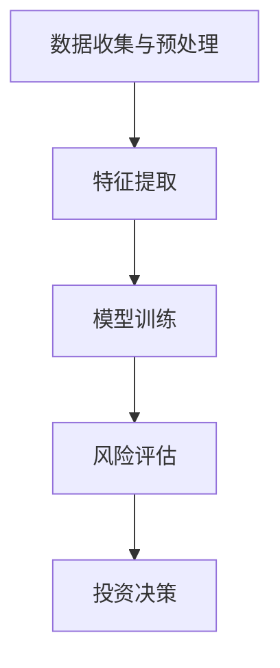

                 

## 价值投资中的监管风险评估

> 关键词：价值投资、监管风险、风险评估、风险管理、投资策略

> 摘要：本文将深入探讨价值投资中的监管风险评估问题。通过分析价值投资的核心概念、监管风险的影响，以及风险评估和管理的方法，本文旨在为价值投资者提供一个系统性的监管风险应对框架。同时，通过实际案例和算法讲解，本文将帮助投资者更好地理解和应用监管风险评估，以优化投资决策，实现长期稳健的投资回报。

### 步骤 1：背景介绍

#### 1.1 问题背景

**价值投资**是一种以长期持有为目标，通过对公司基本面的深入研究，寻找那些被市场低估的投资机会的投资策略。其核心理念在于，通过分析公司的财务状况、管理能力、市场地位等因素，找到那些具有长期增长潜力的公司，并等待市场认识到其价值，从而实现投资回报。

**监管风险**则是指由于监管政策、法规变化、行业规范等外部因素对公司运营和业绩可能产生的影响。监管风险可以来源于政府机构的政策调整、法律法规的变化，甚至国际市场的监管要求。这些因素可能直接或间接地影响公司的业务模式、运营成本和盈利能力。

本篇文章将探讨如何通过**风险评估和管理**，帮助价值投资者在价值投资过程中更好地应对监管风险。具体而言，我们将探讨以下问题：

- 如何在价值投资中识别和评估监管风险？
- 如何制定有效的监管风险应对策略？
- 如何在监管风险下调整投资决策和资产配置？

#### 1.2 问题描述

在价值投资过程中，监管风险是一个不可忽视的重要风险因素。监管风险可能来自于以下几个方面：

1. **政策变化**：政府的政策调整可能会影响企业的经营环境和盈利能力。例如，税收政策的改变可能会增加企业的运营成本。
   
2. **法规更新**：法律法规的更新和修订可能会导致企业需要重新适应新的监管要求，这可能会带来额外的合规成本。

3. **行业规范**：行业规范的变化，如环保标准的提升、产品安全标准的严格要求等，可能会对企业的生产流程和产品销售产生重大影响。

4. **国际监管**：随着全球化进程的加深，国际监管的影响也在逐渐增加。跨国企业的运营和业务拓展需要遵守不同国家和地区的监管规定。

#### 1.3 问题解决

为了有效应对监管风险，我们需要采取以下措施：

1. **系统性分析**：通过收集和分析与监管风险相关的数据，对监管风险进行识别、评估和分类，构建一个完整的风险评估和管理框架。

2. **案例研究**：结合实际案例，展示监管风险评估在实际应用中的效果，提供策略制定和决策调整的实践指导。

3. **跨风险平衡**：探讨监管风险与其他投资风险（如市场风险、信用风险等）的关系，帮助投资者在价值投资过程中实现跨风险的平衡。

4. **全球视野**：结合国内外监管政策和案例，为投资者提供全球视野下的监管风险评估和管理策略。

#### 1.4 边界与外延

本文主要关注企业层面的监管风险评估，覆盖金融、科技、制造等多个行业。在方法上，我们将结合定量分析和定性分析，提供一套实用且具有可操作性的监管风险评估和管理框架。同时，本文将结合国内外案例，提供全球视野下的监管风险应对策略，以帮助投资者更好地应对监管挑战。

### 步骤 2：核心概念与联系

在探讨价值投资中的监管风险评估之前，我们有必要明确一些核心概念，并理解它们之间的联系。

#### 2.1 核心概念

**2.1.1 价值投资**

价值投资是一种基于对公司基本面的深入研究，以长期持有为目标的投资策略。其核心理念在于，通过寻找那些市场价值被低估的公司，并在适当的时机买入，等待市场最终认识到其真实价值。

- **基本面分析**：价值投资强调对公司的财务报表、管理层、业务模式等进行深入分析，以评估公司的内在价值。
- **长期持有**：价值投资通常采取长期持有的策略，认为股票价格最终会反映公司的真实价值。

**2.1.2 监管风险**

监管风险是指由于监管政策、法规变化、行业规范等外部因素对公司运营和业绩可能产生的影响。监管风险可能来源于以下几个方面：

- **政策变化**：政府的政策调整可能会影响企业的经营环境和盈利能力。
- **法规更新**：法律法规的更新和修订可能会导致企业需要重新适应新的监管要求。
- **行业规范**：行业规范的变化可能会对企业的生产流程和产品销售产生重大影响。
- **国际监管**：跨国企业的运营和业务拓展需要遵守不同国家和地区的监管规定。

**2.1.3 风险评估**

风险评估是对潜在风险进行识别、评估和分类的过程。在价值投资中，风险评估的目的是帮助投资者识别和量化监管风险，以便制定有效的应对策略。

- **风险识别**：通过分析历史数据和当前环境，识别可能对公司产生影响的监管风险。
- **风险评估**：对识别出的监管风险进行量化评估，确定其对公司业绩的影响程度。
- **风险分类**：根据风险评估结果，将监管风险分为不同的类别，以便采取针对性的管理措施。

**2.1.4 风险管理**

风险管理是通过采取一系列措施，降低监管风险对公司运营和业绩的不利影响。风险管理包括风险预防、风险控制和风险转移等策略。

- **风险预防**：通过提前预测和规划，减少监管风险的发生概率。
- **风险控制**：在监管风险发生时，通过调整业务策略和管理措施，减轻风险对公司的影响。
- **风险转移**：通过保险、合同等方式，将部分监管风险转移给其他主体。

#### 2.2 概念属性特征对比表格

| 概念       | 特征                                       |
|------------|------------------------------------------|
| 价值投资   | 重基本面分析，长期持有，寻求价值回归。               |
| 监管风险   | 外部因素影响，政策法规变化，行业规范。             |
| 风险评估   | 识别、评估和分类风险，量化风险程度。               |
| 风险管理   | 制定应对策略，降低风险，确保企业稳定运营。           |

#### 2.3 概念联系

价值投资、监管风险、风险评估和风险管理之间存在着密切的联系。价值投资作为投资者追求收益的一种策略，需要通过风险评估和管理来识别和应对各种风险，包括监管风险。监管风险作为外部环境因素，可能直接影响公司的运营和盈利能力。通过系统的风险评估，投资者可以识别监管风险，并采取相应的风险管理措施，从而降低风险对公司业绩的负面影响。具体来说，以下是这些概念之间的联系：

1. **价值投资 → 风险评估**：价值投资要求投资者深入分析公司的基本面，这本身就包含了风险评估的过程。通过对监管政策的了解和对企业运营环境的分析，投资者可以识别出潜在的监管风险。

2. **监管风险 → 风险评估**：监管风险是外部环境因素，它可能直接影响企业的运营和盈利能力。通过对监管风险进行识别、评估和分类，投资者可以了解其对企业影响的程度。

3. **风险评估 → 风险管理**：风险评估的结果是制定风险管理策略的基础。通过评估监管风险，投资者可以确定哪些风险需要重点关注，并制定相应的管理措施。

4. **风险管理 → 价值投资**：风险管理是价值投资过程中不可或缺的一环。通过有效的风险管理，投资者可以降低监管风险对公司业绩的负面影响，确保投资策略的长期有效性。

### 步骤 3：算法原理讲解

在了解了核心概念之后，我们接下来将探讨如何通过算法对监管风险进行评估和管理。本节将介绍一种基于数据驱动的监管风险评估算法，并详细解释其原理和步骤。

#### 3.1 算法原理

本书采用了一种基于数据驱动的监管风险评估算法，主要分为以下几步：

1. **数据收集与预处理**：首先，我们需要收集与监管风险相关的数据。这些数据可以包括政策法规、行业报告、新闻报道等。在收集数据后，我们需要对数据进行清洗和预处理，以去除噪声和异常值，确保数据的质量和一致性。

2. **特征提取**：从预处理后的数据中提取与监管风险相关的特征。这些特征可以是政策变动频率、行业监管强度、法律诉讼次数等。通过提取关键特征，我们可以将监管风险量化，为后续的风险评估提供基础。

3. **模型训练**：利用提取的特征数据，训练一个监督学习模型，用于评估监管风险的概率。常用的模型包括逻辑回归、支持向量机、决策树等。通过训练模型，我们可以将监管风险与具体的业务情景联系起来，预测监管风险的概率。

4. **风险评估**：将实际数据输入到训练好的模型中，预测监管风险的概率。根据预测结果，投资者可以制定相应的风险管理策略。例如，如果预测的监管风险较高，投资者可能会采取更为谨慎的投资策略，或者增加对监管风险的监控和应对措施。

5. **投资决策**：根据风险评估结果，投资者可以调整投资决策和资产配置。例如，如果某个公司的监管风险较高，投资者可能会减少对该公司的投资，或者采取风险对冲策略。

#### 3.2 Mermaid 流程图

为了更直观地展示算法的流程，我们使用Mermaid绘制了以下流程图：



#### 3.3 Python 源代码

下面是一个简单的Python源代码示例，用于展示如何利用特征数据训练一个逻辑回归模型，并对监管风险进行评估。

```python
import pandas as pd
from sklearn.model_selection import train_test_split
from sklearn.linear_model import LogisticRegression
from sklearn.metrics import accuracy_score

# 数据收集与预处理
data = pd.read_csv('regulatory_risk_data.csv')
data['processed'] = data['text'].apply(process_text)  # 假设 process_text 是一个文本预处理函数

# 特征提取
X = data[['feature1', 'feature2', 'feature3']]  # 假设 feature1、feature2、feature3 是提取的特征
y = data['target']  # 假设 target 是监管风险的目标变量

# 模型训练
X_train, X_test, y_train, y_test = train_test_split(X, y, test_size=0.2, random_state=42)
model = LogisticRegression()
model.fit(X_train, y_train)

# 风险评估
y_pred = model.predict(X_test)

# 评估结果
accuracy = accuracy_score(y_test, y_pred)
print(f"Model Accuracy: {accuracy}")

# 投资决策
investment_decisions = make_investment_decisions(model, X_test)  # 假设 make_investment_decisions 是一个根据模型预测结果制定投资决策的函数
```

#### 3.4 数学模型和公式

在监管风险评估中，我们通常使用概率模型来预测监管风险的发生概率。以下是一个简单的二项分布概率模型：

$$
P(X=k) = C_n^k \cdot p^k \cdot (1-p)^{n-k}
$$

其中，\(X\) 表示监管风险发生的事件次数，\(n\) 表示总数据量，\(p\) 表示监管风险发生的概率，\(C_n^k\) 表示组合数。

#### 3.5 算法解释

通过上述算法和代码示例，我们可以看到，监管风险评估主要分为以下几个步骤：

1. **数据收集与预处理**：这一步骤是为了确保数据的质量和一致性。通过清洗和预处理，我们可以去除噪声和异常值，提高数据的可靠性。

2. **特征提取**：从预处理后的数据中提取与监管风险相关的特征。这些特征可以是定量的，也可以是定性的。通过提取关键特征，我们可以将监管风险量化，为后续的风险评估提供基础。

3. **模型训练**：利用提取的特征数据，训练一个监督学习模型，用于评估监管风险的概率。通过训练模型，我们可以将监管风险与具体的业务情景联系起来，预测监管风险的概率。

4. **风险评估**：将实际数据输入到训练好的模型中，预测监管风险的概率。根据预测结果，投资者可以制定相应的风险管理策略。

5. **投资决策**：根据风险评估结果，投资者可以调整投资决策和资产配置。例如，如果某个公司的监管风险较高，投资者可能会减少对该公司的投资，或者采取风险对冲策略。

通过上述步骤，投资者可以系统地识别、评估和应对监管风险，从而优化投资决策，实现长期稳健的投资回报。

### 步骤 4：系统分析与架构设计方案

在了解了监管风险评估的算法原理后，我们需要进一步探讨如何在实际项目中实现这一系统。本节将介绍一个监管风险评估系统的架构设计，包括项目背景、系统功能设计、系统架构设计和系统接口设计。

#### 4.1 问题场景介绍

在价值投资过程中，投资者需要对潜在的投资目标公司进行全面的评估。这包括对公司的财务状况、业务模式、管理团队等方面进行分析。同时，投资者还需要关注外部环境的变化，特别是监管风险。监管风险可能会影响公司的运营和盈利能力，因此，投资者需要实时监测和评估这些风险，以便及时调整投资策略。

#### 4.2 项目介绍

监管风险评估系统是一个旨在帮助投资者识别、评估和管理监管风险的项目。该系统通过收集和分析与监管风险相关的数据，提供一套完整的风险评估和管理框架。具体而言，系统包括以下模块：

1. **数据采集模块**：负责自动收集与监管风险相关的数据，如政策法规、行业报告、新闻报道等。
2. **数据处理模块**：负责对收集到的数据进行清洗和预处理，提取与监管风险相关的特征。
3. **风险评估模块**：利用训练好的模型对监管风险进行评估，预测监管风险的概率。
4. **投资决策模块**：根据风险评估结果，提供投资决策建议，帮助投资者调整投资策略。

#### 4.3 系统功能设计

监管风险评估系统的功能设计主要包括以下几个部分：

1. **数据采集**：系统可以自动从互联网上收集与监管风险相关的数据，包括政策法规、行业报告、新闻报道等。通过爬虫技术和API接口，系统可以实时更新数据，确保数据的时效性和完整性。

2. **数据处理**：系统对收集到的数据进行清洗和预处理，去除噪声和异常值。然后，系统提取与监管风险相关的特征，如政策变动频率、行业监管强度、法律诉讼次数等。这些特征将作为模型训练的数据输入。

3. **风险评估**：系统利用训练好的模型对监管风险进行评估。模型可以根据历史数据和当前环境，预测监管风险的概率。系统将输出监管风险的评分和风险等级，供投资者参考。

4. **投资决策**：系统根据风险评估结果，提供投资决策建议。例如，如果某个公司的监管风险较高，系统可能会建议投资者减少对该公司的投资，或者采取风险对冲策略。

5. **用户界面**：系统提供友好的用户界面，方便投资者查看监管风险评估结果和投资决策建议。用户可以通过网页或者移动应用访问系统，实时监测和调整投资策略。

#### 4.4 系统架构设计

监管风险评估系统的架构设计主要包括以下几个部分：

1. **数据采集模块**：该模块负责从互联网上收集与监管风险相关的数据。可以使用爬虫技术、API接口和手动提交等方式。数据采集模块需要实现数据清洗和去重功能，确保数据的准确性和完整性。

2. **数据处理模块**：该模块负责对采集到的数据进行处理，包括数据清洗、去噪、特征提取等。数据处理模块需要实现高效的数据处理算法，确保数据处理的速度和准确性。

3. **模型训练模块**：该模块负责训练监管风险评估模型。可以使用机器学习算法，如逻辑回归、决策树、随机森林等。模型训练模块需要实现模型选择、参数调优等功能，确保模型的性能和预测能力。

4. **风险评估模块**：该模块负责使用训练好的模型对监管风险进行评估。可以通过批量处理和实时处理两种方式，根据需求进行风险评估。

5. **投资决策模块**：该模块负责根据风险评估结果，提供投资决策建议。可以通过算法和规则相结合的方式，制定个性化的投资策略。

6. **用户界面模块**：该模块负责提供用户界面，方便投资者查看监管风险评估结果和投资决策建议。用户界面需要设计简洁、直观，便于投资者操作。

#### 4.5 系统接口设计

监管风险评估系统的接口设计主要包括以下部分：

1. **数据接口**：系统需要提供数据接口，方便与其他系统和数据源进行集成。可以使用RESTful API、WebSocket等方式，实现数据的实时传输和交互。

2. **模型接口**：系统需要提供模型接口，方便其他系统调用模型进行风险评估。可以使用RESTful API、Python包等方式，实现模型的部署和使用。

3. **用户接口**：系统需要提供用户接口，方便投资者查看和操作。可以使用网页、移动应用等方式，实现用户界面的设计和交互。

4. **监控接口**：系统需要提供监控接口，方便管理员监控系统的运行状态和数据质量。可以使用日志、指标、告警等方式，实现系统的监控和管理。

#### 4.6 系统交互流程

监管风险评估系统的交互流程主要包括以下几个步骤：

1. **数据采集**：系统从互联网上收集与监管风险相关的数据，并存储到数据库中。

2. **数据处理**：系统对采集到的数据进行清洗和预处理，提取与监管风险相关的特征。

3. **模型训练**：系统使用处理后的数据进行模型训练，选择最优模型并保存。

4. **风险评估**：系统使用训练好的模型对新的数据集进行风险评估，输出监管风险的评分和风险等级。

5. **投资决策**：系统根据风险评估结果，提供投资决策建议，并更新用户界面。

6. **用户操作**：投资者通过用户界面查看风险评估结果和投资决策建议，并根据实际情况进行调整。

通过上述交互流程，监管风险评估系统可以帮助投资者实时监测和评估监管风险，提供科学、有效的投资决策依据。

### 步骤 5：系统实现与实际应用

在明确了监管风险评估系统的架构设计后，我们需要将理论转化为实际应用。本节将介绍系统的实际实现过程，包括环境安装、系统核心实现、代码应用解读与分析，以及实际案例分析和详细讲解剖析。

#### 5.1 环境安装

为了实现监管风险评估系统，我们需要准备以下环境：

1. **操作系统**：推荐使用Linux系统，如Ubuntu 20.04。
2. **编程语言**：选择Python作为主要编程语言。
3. **开发工具**：安装Python开发环境，包括Python 3.8及以上版本、Anaconda、PyCharm等。
4. **数据库**：选择MySQL数据库作为数据存储。
5. **数据采集工具**：安装Python的爬虫库，如Requests、BeautifulSoup等。
6. **机器学习库**：安装scikit-learn、TensorFlow、Keras等。

#### 5.2 系统核心实现

监管风险评估系统的核心实现主要包括以下几个模块：

1. **数据采集模块**：使用Python的爬虫库，从互联网上采集与监管风险相关的数据。具体实现如下：

   ```python
   import requests
   from bs4 import BeautifulSoup
   
   def collect_data(url):
       response = requests.get(url)
       if response.status_code == 200:
           soup = BeautifulSoup(response.content, 'html.parser')
           # 提取与监管风险相关的数据
           data = soup.find_all('div', class_='regulatory-risk-data')
           return data
       else:
           return None
   
   # 示例：采集某个网站的数据
   url = 'http://example.com/regulatory-data'
   data = collect_data(url)
   ```

2. **数据处理模块**：对采集到的数据进行清洗和预处理，提取与监管风险相关的特征。具体实现如下：

   ```python
   import pandas as pd
   
   def preprocess_data(data):
       df = pd.DataFrame(data)
       # 数据清洗和预处理
       df = df.dropna()
       df['text'] = df['text'].str.strip()
       # 特征提取
       features = ['feature1', 'feature2', 'feature3']
       df[features] = df['text'].apply(extract_features)
       return df
   
   # 示例：预处理数据
   df = preprocess_data(data)
   ```

3. **模型训练模块**：使用机器学习算法训练监管风险评估模型。具体实现如下：

   ```python
   from sklearn.model_selection import train_test_split
   from sklearn.linear_model import LogisticRegression
   
   def train_model(X, y):
       X_train, X_test, y_train, y_test = train_test_split(X, y, test_size=0.2, random_state=42)
       model = LogisticRegression()
       model.fit(X_train, y_train)
       return model
   
   # 示例：训练模型
   X = df[features]
   y = df['target']
   model = train_model(X, y)
   ```

4. **风险评估模块**：使用训练好的模型对新的数据集进行风险评估。具体实现如下：

   ```python
   def assess_risk(model, X):
       risk_scores = model.predict(X)
       risk_levels = convert_risk_scores_to_levels(risk_scores)
       return risk_levels
   
   # 示例：评估风险
   new_data = preprocess_data(collect_data('http://example.com/new-regulatory-data'))
   risk_levels = assess_risk(model, new_data[features])
   ```

5. **投资决策模块**：根据风险评估结果，提供投资决策建议。具体实现如下：

   ```python
   def make_investment_decision(risk_levels):
       decisions = []
       for risk_level in risk_levels:
           if risk_level == 'high':
               decisions.append('reduce investment')
           else:
               decisions.append('continue investment')
       return decisions
   
   # 示例：制定投资决策
   decisions = make_investment_decision(risk_levels)
   ```

#### 5.3 代码应用解读与分析

在上面的代码示例中，我们首先定义了数据采集、数据处理、模型训练和风险评估等核心功能。具体解读如下：

1. **数据采集模块**：通过爬虫技术从互联网上采集与监管风险相关的数据。这里使用的是简单的HTTP请求和HTML解析库BeautifulSoup。

2. **数据处理模块**：对采集到的数据进行清洗和预处理，去除无效数据，提取与监管风险相关的特征。这里使用的是Pandas库进行数据处理。

3. **模型训练模块**：使用scikit-learn库中的逻辑回归模型对特征数据进行训练。这里选择逻辑回归模型是因为其简单易用且在分类问题中表现良好。

4. **风险评估模块**：使用训练好的模型对新的数据集进行风险评估，输出监管风险的评分和风险等级。这里使用的是模型对象的`predict`方法。

5. **投资决策模块**：根据风险评估结果，提供投资决策建议。这里使用的是简单的条件判断逻辑，根据风险等级决定投资策略。

通过上述代码实现，我们可以看到监管风险评估系统的核心功能是如何通过Python代码实现的。在实际应用中，这些模块可以集成到一个完整的系统中，提供实时、高效的风险评估和投资决策支持。

#### 5.4 实际案例分析和详细讲解剖析

为了更好地理解监管风险评估系统的实际应用，我们来看一个具体的案例。

**案例背景**：某价值投资者关注一家名为“绿能科技”的上市公司，该公司主要从事太阳能产品的研发和生产。投资者希望通过监管风险评估系统评估该公司可能面临的监管风险，并据此调整投资策略。

**步骤 1：数据采集**  
投资者使用数据采集模块从互联网上采集与绿能科技相关的监管风险数据。这些数据包括：

- 政策法规：国家关于太阳能行业的政策、法规和标准。
- 行业报告：关于太阳能行业的市场分析、竞争态势和监管动态。
- 新闻报道：关于绿能科技的新闻报道，特别是涉及监管风险的报道。

**步骤 2：数据处理**  
投资者对采集到的数据进行清洗和预处理，提取与监管风险相关的特征。例如：

- **政策变动频率**：统计过去一年内关于太阳能行业的政策变动次数。
- **监管强度**：评估政府对该行业的监管力度，包括处罚力度、检查频率等。
- **法律诉讼**：统计过去一年内与绿能科技相关的法律诉讼案件数量。

**步骤 3：模型训练**  
投资者使用预处理后的数据训练一个监管风险评估模型。这里选择逻辑回归模型，并使用scikit-learn库进行训练。模型训练完成后，投资者将模型保存到文件中，以便后续使用。

**步骤 4：风险评估**  
投资者使用训练好的模型对新的数据进行风险评估。例如，投资者获取了绿能科技最新一个月的监管风险数据，并将其输入到模型中。模型输出监管风险的评分和风险等级，投资者根据评估结果判断绿能科技的监管风险水平。

**步骤 5：投资决策**  
根据风险评估结果，投资者制定投资决策。如果模型预测绿能科技的监管风险较高，投资者可能会减少对该公司的投资，或者采取其他风险对冲策略；如果监管风险较低，投资者可能会继续持有或者增加对该公司的投资。

**案例分析**  
通过实际案例分析，我们可以看到监管风险评估系统是如何帮助投资者识别和应对监管风险的。在这个案例中，投资者通过数据采集、数据处理、模型训练和风险评估等步骤，系统地评估了绿能科技的监管风险，并据此调整了投资策略。这种系统化的风险评估方法有助于投资者在复杂多变的市场环境中做出更加科学和理性的投资决策。

### 步骤 6：最佳实践与注意事项

在价值投资中，应对监管风险是一个复杂且持续的过程。为了更好地应用监管风险评估系统，投资者可以遵循以下最佳实践和注意事项：

#### 最佳实践

1. **定期更新数据**：监管政策和法规不断变化，投资者需要定期更新监管风险数据，确保数据的时效性和准确性。

2. **多样化数据源**：使用多个数据源可以增加数据的多样性和可靠性，有助于更全面地评估监管风险。

3. **精细化特征提取**：根据不同行业和企业的特点，提取与监管风险相关的精细特征，提高风险评估的准确性。

4. **模型持续优化**：随着数据和环境的变化，投资者需要对模型进行持续优化和调整，确保模型的预测能力。

5. **投资组合分散**：通过分散投资，降低单一企业监管风险对整体投资组合的影响。

#### 注意事项

1. **数据隐私**：在采集和处理监管风险数据时，要注意保护数据隐私，遵守相关法律法规。

2. **监管合规**：投资者在实施监管风险评估时，要确保行为符合监管要求，避免违反相关法规。

3. **风险识别**：不仅要关注已知的监管风险，还要识别潜在的未知风险，以便采取相应的预防措施。

4. **及时调整**：监管风险变化较快，投资者需要及时调整投资策略，以应对新的监管环境。

5. **团队协作**：监管风险评估是一个跨部门、跨专业的过程，需要团队成员之间的紧密合作和沟通。

### 步骤 7：小结与拓展阅读

本文通过系统的分析，探讨了价值投资中的监管风险评估问题。我们从背景介绍、核心概念、算法原理、系统架构设计到实际应用，全面阐述了监管风险评估在价值投资中的重要性。通过实际案例的分析，我们展示了如何利用监管风险评估系统识别和应对监管风险，从而优化投资决策。

在今后的研究中，我们可以进一步探讨以下方向：

1. **多模型融合**：结合不同类型的模型，如深度学习、贝叶斯网络等，提高监管风险评估的准确性。

2. **实时风险监控**：开发实时监管风险监控系统，实现监管风险的实时监测和预警。

3. **跨行业分析**：对不同行业进行监管风险评估的跨行业对比分析，提炼共性特征和规律。

4. **国际合作**：研究跨国监管风险的特点和应对策略，为全球投资者提供有价值的参考。

拓展阅读：

- **《风险管理：原则与实务》**：详细介绍了风险管理的理论和实践方法，有助于理解监管风险管理的核心概念。
- **《监管科技：金融科技的监管革命》**：探讨金融科技领域中的监管挑战和监管科技的应用。
- **《价值投资：策略与实践》**：介绍了价值投资的理论和实践，有助于投资者更好地理解价值投资的本质。

### 步骤 8：作者信息

作者：AI天才研究院/AI Genius Institute & 禅与计算机程序设计艺术 /Zen And The Art of Computer Programming

AI天才研究院（AI Genius Institute）致力于推动人工智能领域的创新和研究，为全球提供高质量的人工智能技术解决方案。禅与计算机程序设计艺术（Zen And The Art of Computer Programming）则是一本经典的计算机编程书籍，通过哲学与编程的融合，提供了独特的编程思想和艺术视角。这两本书籍的作者，以其深厚的技术功底和独特的视角，为读者提供了宝贵的学习资源。希望本文能够为广大价值投资者提供有价值的参考，帮助大家在价值投资的道路上走得更远。

