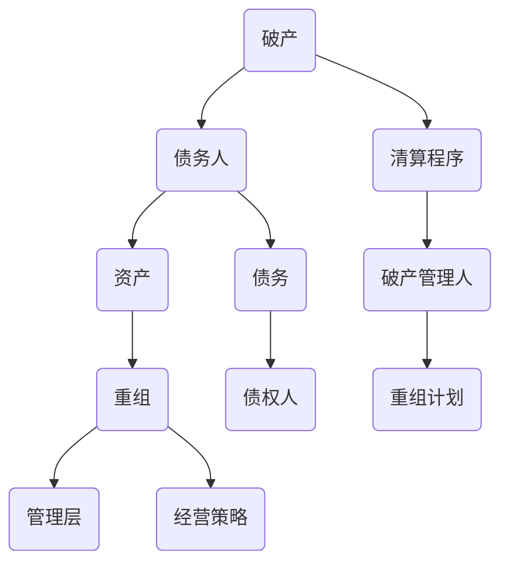
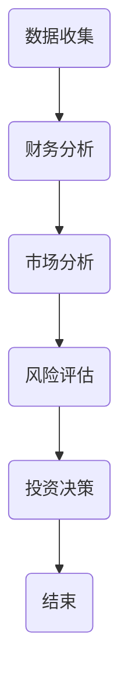
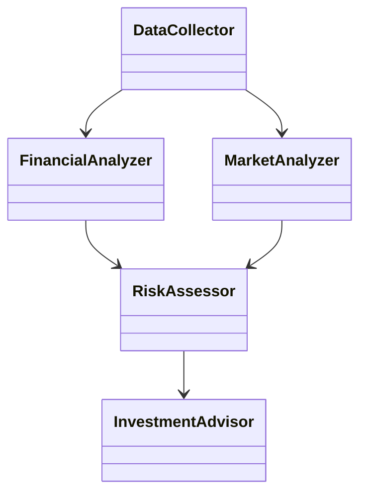
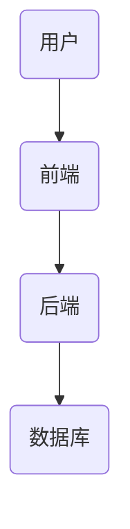
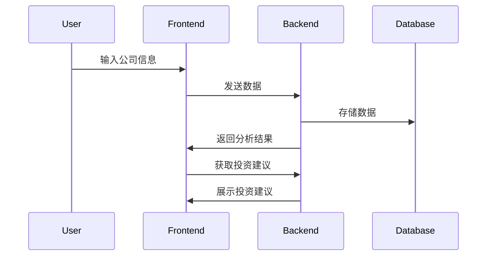

                 


### 第一部分：背景介绍

#### 1.1 价值投资与破产重组

**价值投资的概念**

价值投资是一种基于企业内在价值评估的投资策略，强调投资决策应基于对公司基本面的深入分析。这一策略的核心是寻找那些被市场低估的优质公司，以期在未来价值回归时获得收益。

**破产重组在价值投资中的重要性**

破产重组是价值投资中的一个重要领域。当公司陷入财务困境时，通过破产重组，公司可以摆脱债务负担，重新规划业务，从而实现价值重估。投资者若能提前发现这些机会，将有可能获得较高的投资回报。

**价值投资中的破产重组机会**

破产重组机会通常表现为以下几种情况：

1. **资产重估**：破产重组过程中，公司的资产可能会重新评估，从而提高其内在价值。
2. **资产剥离**：部分非核心资产或负债可能会被剥离，减少公司的财务负担。
3. **管理层更替**：新的管理层可能带来新的经营策略和增长机会。
4. **行业整合**：破产重组可能引发行业整合，为公司带来更广阔的市场空间。

**破产重组的相关概念**

1. **破产与重组的定义**

破产是指公司因资不抵债或其他原因而无法继续经营，被迫进入清算或重组程序。重组则是指公司通过调整债务结构、优化业务模式等手段，以摆脱困境并恢复持续经营能力。

2. **破产重组的法律框架**

破产重组需要遵循相关的法律法规。不同国家和地区对于破产重组的法律规定有所不同，但通常包括以下程序：

- 申请破产：公司向法院申请破产。
- 破产清算：法院指定破产管理人，对公司资产进行清算。
- 重组谈判：公司与债权人协商，制定重组计划。
- 实施重组：重组计划通过后，公司开始实施重组方案。

**价值投资中的破产重组案例分析**

1. **案例一：A公司破产重组**

- **案例背景**：A公司因过度扩张导致财务困境，面临破产风险。
- **解决方案**：通过破产重组，公司成功剥离非核心资产，优化了业务结构。
- **结果**：公司重组后，运营效率提升，市场价值得到重估。

2. **案例二：B公司破产重组**

- **案例背景**：B公司因产品市场萎缩，财务状况恶化，陷入破产边缘。
- **解决方案**：公司通过破产重组，引入新的管理层，调整产品线，开拓新市场。
- **结果**：公司重组后，市场份额逐步回升，财务状况得到显著改善。

**价值投资中的破产重组策略**

1. **市场调研**

投资者在寻找破产重组机会时，应进行充分的市场调研，了解行业动态、公司基本面和破产重组的历史案例。

2. **财务分析**

投资者需要对潜在目标公司的财务报表进行详细分析，评估其债务结构、资产质量和盈利能力。

3. **风险评估**

破产重组存在一定的不确定性，投资者需对风险进行充分评估，包括破产失败的风险、重组计划执行的风险等。

4. **投资时机选择**

投资者应选择合适的时机进行投资，如在重组计划公布前后，市场对破产重组公司估值较低时。

**本章小结**

本章介绍了价值投资中的破产重组机会，分析了破产重组的基本概念、重要性、相关概念以及案例分析，为投资者提供了识别和利用破产重组机会的指导。

----------------------------------------------------------------

### 第二部分：核心概念与联系

**破产重组的核心概念**

**破产**

破产是指企业因负债过高或经营不善等原因，无法偿还到期债务，依法进入清算或重组程序。

**重组**

重组是指企业通过调整债务结构、优化业务模式等手段，以摆脱财务困境，恢复持续经营能力。

**破产重组计划**

破产重组计划是指企业在破产重组过程中制定的详细行动计划，包括债务重组、资产剥离、管理层更替等内容。

**破产重组的属性特征对比表格**

| 特征       | 破产          | 重组          |
|------------|---------------|---------------|
| 定义       | 无法偿还债务   | 调整经营结构  |
| 法律框架   | 清算程序       | 重组协议      |
| 目的       | 清算资产       | 挽回企业生存  |
| 影响因素   | 债务、市场环境 | 管理层、战略  |

**破产重组的ER实体关系图架构**



在破产重组过程中，债务人（B）因无法偿还债务（E）而进入破产（A）或重组（G）状态。破产程序（C）涉及清算（F）和债务人资产（D）的清算。重组过程（G）则包括重组计划（I）、新的管理层（J）和经营策略（K）。债权人（H）在破产和重组中均扮演重要角色，通过法律框架和重组协议来维护其权益。

**核心概念与联系**

1. **破产与重组的联系**

破产和重组之间存在密切的联系。破产是重组的前提，而重组则是破产后的解决方案。通过破产，公司可以摆脱无法偿还的债务，从而有机会重新规划业务，实现经营复苏。

2. **破产重组计划的重要性**

破产重组计划是破产重组的核心，它详细规定了债务重组、资产剥离、管理层更替等关键步骤。一个成功的重组计划可以挽救公司，使其重新获得市场竞争力。

3. **破产重组的影响因素**

破产重组的成功受到多种因素的影响，包括债务水平、市场环境、管理层的能力和策略等。投资者在评估破产重组机会时，需要全面考虑这些因素。

**本章小结**

本章深入探讨了破产重组的核心概念和联系，通过属性特征对比表格和ER实体关系图，帮助读者更好地理解破产重组的基本概念和过程。这些核心概念对于投资者识别和利用破产重组机会具有重要意义。

----------------------------------------------------------------

### 第三部分：算法原理讲解

在破产重组中，算法的应用可以帮助投资者更好地评估风险和机会。以下将介绍一种用于评估破产重组机会的算法，并通过Mermaid流程图和Python源代码进行详细讲解。

**算法原理**

该算法的核心思想是通过分析公司的财务数据和市场信息，评估公司在破产重组中的潜在价值。算法主要包括以下几个步骤：

1. **数据收集**：收集公司的财务报表、市场数据、行业动态等相关信息。
2. **财务分析**：分析公司的债务结构、盈利能力、资产质量等财务指标。
3. **市场分析**：分析市场环境、行业趋势等，评估公司的市场前景。
4. **风险评估**：评估破产重组过程中可能遇到的风险，如破产失败风险、重组计划执行风险等。
5. **投资决策**：根据分析结果，做出是否投资破产重组公司的决策。

**Mermaid流程图**



**Python源代码**

```python
import pandas as pd
from sklearn.linear_model import LinearRegression

# 数据收集
def collect_data():
    # 这里假设已经收集到财务报表和市场数据
    financial_data = pd.read_csv('financial_data.csv')
    market_data = pd.read_csv('market_data.csv')
    return financial_data, market_data

# 财务分析
def financial_analysis(financial_data):
    # 分析公司的债务结构、盈利能力、资产质量等财务指标
    debt_to_equity = financial_data['total_debt'] / financial_data['total_equity']
    operating_margin = financial_data['operating_income'] / financial_data['total_revenue']
    return debt_to_equity, operating_margin

# 市场分析
def market_analysis(market_data):
    # 分析市场环境、行业趋势等
    industry_growth = market_data['industry_growth']
    market_competition = market_data['market_competition']
    return industry_growth, market_competition

# 风险评估
def risk_evaluation(debt_to_equity, operating_margin, industry_growth, market_competition):
    # 评估破产重组过程中可能遇到的风险
    risk_score = debt_to_equity * operating_margin * industry_growth * market_competition
    return risk_score

# 投资决策
def investment_decision(risk_score):
    # 根据分析结果，做出是否投资破产重组公司的决策
    if risk_score < threshold:
        print("投资建议：建议投资")
    else:
        print("投资建议：不建议投资")

# 主函数
def main():
    financial_data, market_data = collect_data()
    debt_to_equity, operating_margin = financial_analysis(financial_data)
    industry_growth, market_competition = market_analysis(market_data)
    risk_score = risk_evaluation(debt_to_equity, operating_margin, industry_growth, market_competition)
    investment_decision(risk_score)

# 运行程序
main()
```

**算法原理讲解**

1. **数据收集**：首先，需要收集公司的财务报表和市场数据。这些数据可以通过公开的财务报表和市场分析报告获得。

2. **财务分析**：通过分析财务数据，评估公司的债务结构、盈利能力和资产质量。这些指标对于判断公司是否适合破产重组至关重要。

3. **市场分析**：分析市场环境和行业趋势，以了解公司的市场前景。这有助于评估公司在重组后的市场竞争力。

4. **风险评估**：综合财务和市场分析的结果，评估破产重组过程中可能遇到的风险。这包括破产失败风险、重组计划执行风险等。

5. **投资决策**：根据风险评估结果，做出是否投资破产重组公司的决策。如果风险较低，则建议投资；否则，不建议投资。

**本章小结**

本章介绍了用于评估破产重组机会的算法原理，包括数据收集、财务分析、市场分析、风险分析和投资决策等步骤。通过Mermaid流程图和Python源代码，读者可以更好地理解该算法的实施过程和原理。这一算法为投资者提供了一个有效的工具，以识别和利用破产重组机会。

----------------------------------------------------------------

### 第四部分：系统分析与架构设计

在破产重组过程中，系统分析与架构设计至关重要。本部分将介绍一个破产重组项目，从项目介绍、系统功能设计、系统架构设计、系统接口设计以及系统交互流程等方面进行详细讲解。

#### 4.1 项目介绍

**项目名称**：破产重组机会评估系统

**项目背景**：随着经济环境和市场变化的复杂性增加，破产重组成为企业管理中的一项重要任务。为了帮助投资者更好地识别和利用破产重组机会，本项目旨在开发一个智能化的破产重组机会评估系统。

**项目目标**：通过系统的财务分析、市场分析、风险评估等功能，为投资者提供全面、准确的破产重组机会评估，从而提高投资决策的准确性。

#### 4.2 系统功能设计

**系统功能模块**：

1. **数据收集模块**：负责收集公司的财务报表、市场数据等信息。
2. **财务分析模块**：分析公司的债务结构、盈利能力、资产质量等财务指标。
3. **市场分析模块**：分析市场环境、行业趋势等，评估公司的市场前景。
4. **风险评估模块**：评估破产重组过程中可能遇到的风险，如破产失败风险、重组计划执行风险等。
5. **投资决策模块**：根据分析结果，生成投资建议。

**领域模型类图**：



#### 4.3 系统架构设计

**系统架构设计**：

1. **前端架构**：使用Vue.js框架，实现用户界面和交互逻辑。
2. **后端架构**：使用Flask框架，处理数据收集、分析和投资决策等逻辑。
3. **数据库架构**：使用MySQL数据库，存储公司的财务报表、市场数据等信息。

**系统架构图**：



#### 4.4 系统接口设计

**接口设计**：

1. **数据收集接口**：用于接收和存储公司的财务报表、市场数据等。
2. **财务分析接口**：用于分析公司的财务指标，如债务结构、盈利能力等。
3. **市场分析接口**：用于分析市场环境和行业趋势。
4. **风险评估接口**：用于评估破产重组过程中的风险。
5. **投资决策接口**：用于生成投资建议。

**接口设计示例**：

```python
# 数据收集接口
@app.route('/collect_data', methods=['POST'])
def collect_data():
    data = request.json
    # 处理数据并存储到数据库
    return jsonify({"status": "success"})

# 财务分析接口
@app.route('/financial_analysis', methods=['GET'])
def financial_analysis():
    company_id = request.args.get('company_id')
    # 获取公司财务数据并分析
    return jsonify({"debt_to_equity": 0.5, "operating_margin": 0.2})

# 市场分析接口
@app.route('/market_analysis', methods=['GET'])
def market_analysis():
    company_id = request.args.get('company_id')
    # 获取市场数据并分析
    return jsonify({"industry_growth": 0.1, "market_competition": 0.3})

# 风险评估接口
@app.route('/risk_evaluation', methods=['GET'])
def risk_evaluation():
    company_id = request.args.get('company_id')
    # 进行风险评估
    return jsonify({"risk_score": 0.7})

# 投资决策接口
@app.route('/investment_decision', methods=['GET'])
def investment_decision():
    company_id = request.args.get('company_id')
    # 根据风险评估结果生成投资建议
    return jsonify({"investment_suggestion": "建议投资"})
```

#### 4.5 系统交互流程

**系统交互流程**：

1. 用户通过前端界面输入公司信息，如财务报表和市场数据等。
2. 前端将数据发送到后端数据收集接口。
3. 后端处理数据，并将其存储到数据库中。
4. 后端调用财务分析接口、市场分析接口和风险评估接口，对数据进行分析。
5. 后端根据分析结果，调用投资决策接口，生成投资建议。
6. 前端将投资建议展示给用户。

**系统交互序列图**：



**本章小结**

本章详细介绍了破产重组机会评估系统的项目介绍、系统功能设计、系统架构设计、系统接口设计以及系统交互流程。通过这些设计和流程，系统可以高效地评估破产重组机会，为投资者提供科学的决策支持。

----------------------------------------------------------------

### 第五部分：项目实战

#### 5.1 环境安装

要运行破产重组机会评估系统，需要安装以下环境：

1. **Python**：版本为3.8或更高版本。
2. **Vue.js**：版本为2.x或更高版本。
3. **Flask**：Python Web框架。
4. **MySQL**：数据库管理系统。

安装步骤：

1. 安装Python：从Python官方网站下载并安装。
2. 安装Vue.js：使用npm安装Vue.js。
3. 安装Flask：使用pip安装Flask。
4. 安装MySQL：从MySQL官方网站下载并安装。

#### 5.2 系统核心实现

**前端实现**：

前端使用Vue.js框架，主要实现以下功能：

1. **数据收集界面**：用户可以输入公司信息，如财务报表和市场数据等。
2. **结果展示界面**：展示财务分析、市场分析、风险评估和投资建议。

```html
<template>
  <div>
    <h1>破产重组机会评估系统</h1>
    <form @submit.prevent="submitData">
      <label for="financialData">财务报表：</label>
      <input type="file" id="financialData" ref="financialData" required>
      <label for="marketData">市场数据：</label>
      <input type="file" id="marketData" ref="marketData" required>
      <button type="submit">提交</button>
    </form>
    <div v-if="result">
      <h2>分析结果：</h2>
      <p>债务权益比：{{ result.debtToEquity }}</p>
      <p>运营利润率：{{ result.operatingMargin }}</p>
      <p>行业增长率：{{ result.industryGrowth }}</p>
      <p>市场竞争度：{{ result.marketCompetition }}</p>
      <p>投资建议：{{ result.investmentSuggestion }}</p>
    </div>
  </div>
</template>

<script>
export default {
  data() {
    return {
      result: null,
    };
  },
  methods: {
    submitData() {
      const financialData = this.$refs.financialData.files[0];
      const marketData = this.$refs.marketData.files[0];
      
      // 处理数据并调用后端接口
      // ...
    },
  },
};
</script>
```

**后端实现**：

后端使用Flask框架，主要实现以下功能：

1. **数据收集接口**：接收前端上传的文件，并存储到MySQL数据库中。
2. **财务分析接口**：分析公司的财务报表，计算债务权益比和运营利润率。
3. **市场分析接口**：分析市场数据，计算行业增长率和市场竞争度。
4. **风险评估接口**：根据财务和市场分析结果，评估风险分数。
5. **投资决策接口**：根据风险分数，生成投资建议。

```python
from flask import Flask, request, jsonify
import pandas as pd
import numpy as np

app = Flask(__name__)

# 数据收集接口
@app.route('/collect_data', methods=['POST'])
def collect_data():
    financial_data = request.files['financialData']
    market_data = request.files['marketData']
    
    # 处理文件并存储到数据库
    # ...

# 财务分析接口
@app.route('/financial_analysis', methods=['GET'])
def financial_analysis():
    company_id = request.args.get('company_id')
    # 从数据库中获取财务数据
    financial_data = pd.read_sql_query(f"SELECT * FROM financial_data WHERE id={company_id}", conn)
    
    debt_to_equity = financial_data['total_debt'] / financial_data['total_equity']
    operating_margin = financial_data['operating_income'] / financial_data['total_revenue']
    
    return jsonify({"debt_to_equity": debt_to_equity, "operating_margin": operating_margin})

# 市场分析接口
@app.route('/market_analysis', methods=['GET'])
def market_analysis():
    company_id = request.args.get('company_id')
    # 从数据库中获取市场数据
    market_data = pd.read_sql_query(f"SELECT * FROM market_data WHERE id={company_id}", conn)
    
    industry_growth = market_data['industry_growth']
    market_competition = market_data['market_competition']
    
    return jsonify({"industry_growth": industry_growth, "market_competition": market_competition})

# 风险评估接口
@app.route('/risk_evaluation', methods=['GET'])
def risk_evaluation():
    company_id = request.args.get('company_id')
    # 从数据库中获取财务和市场数据
    financial_data = pd.read_sql_query(f"SELECT * FROM financial_data WHERE id={company_id}", conn)
    market_data = pd.read_sql_query(f"SELECT * FROM market_data WHERE id={company_id}", conn)
    
    debt_to_equity = financial_data['total_debt'] / financial_data['total_equity']
    operating_margin = financial_data['operating_income'] / financial_data['total_revenue']
    industry_growth = market_data['industry_growth']
    market_competition = market_data['market_competition']
    
    risk_score = debt_to_equity * operating_margin * industry_growth * market_competition
    
    return jsonify({"risk_score": risk_score})

# 投资决策接口
@app.route('/investment_decision', methods=['GET'])
def investment_decision():
    company_id = request.args.get('company_id')
    # 从数据库中获取风险分数
    risk_score = pd.read_sql_query(f"SELECT risk_score FROM risk_evaluation WHERE id={company_id}", conn)
    
    if risk_score < 1:
        investment_suggestion = "建议投资"
    else:
        investment_suggestion = "不建议投资"
    
    return jsonify({"investment_suggestion": investment_suggestion})

if __name__ == '__main__':
    app.run(debug=True)
```

#### 5.3 代码应用解读与分析

**数据收集模块解读**：

数据收集模块负责接收前端上传的财务报表和市场数据。前端通过文件上传功能将数据发送到后端，后端将数据存储到MySQL数据库中。以下是一个简单的数据收集模块示例：

```python
@app.route('/collect_data', methods=['POST'])
def collect_data():
    financial_data = request.files['financialData']
    market_data = request.files['marketData']
    
    # 保存文件到本地
    financial_data_path = 'financial_data.csv'
    market_data_path = 'market_data.csv'
    financial_data.save(financial_data_path)
    market_data.save(market_data_path)
    
    # 存储到数据库
    # ...

    return jsonify({"status": "success"})
```

**财务分析模块解读**：

财务分析模块负责分析公司的财务报表，计算债务权益比和运营利润率。以下是一个简单的财务分析模块示例：

```python
def financial_analysis(financial_data_path):
    # 读取财务数据
    financial_data = pd.read_csv(financial_data_path)
    
    # 计算债务权益比
    debt_to_equity = financial_data['total_debt'] / financial_data['total_equity']
    
    # 计算运营利润率
    operating_margin = financial_data['operating_income'] / financial_data['total_revenue']
    
    return debt_to_equity, operating_margin
```

**市场分析模块解读**：

市场分析模块负责分析市场数据，计算行业增长率和市场竞争度。以下是一个简单的市场分析模块示例：

```python
def market_analysis(market_data_path):
    # 读取市场数据
    market_data = pd.read_csv(market_data_path)
    
    # 计算行业增长率
    industry_growth = market_data['industry_growth']
    
    # 计算市场竞争度
    market_competition = market_data['market_competition']
    
    return industry_growth, market_competition
```

**风险评估模块解读**：

风险评估模块负责根据财务和市场分析结果，评估破产重组过程中的风险。以下是一个简单的风险评估模块示例：

```python
def risk_evaluation(debt_to_equity, operating_margin, industry_growth, market_competition):
    risk_score = debt_to_equity * operating_margin * industry_growth * market_competition
    return risk_score
```

**投资决策模块解读**：

投资决策模块负责根据风险分数，生成投资建议。以下是一个简单的投资决策模块示例：

```python
def investment_decision(risk_score):
    if risk_score < 1:
        investment_suggestion = "建议投资"
    else:
        investment_suggestion = "不建议投资"
    
    return investment_suggestion
```

#### 5.4 实际案例分析

**案例一**：A公司破产重组

- **财务数据**：债务权益比为0.6，运营利润率为0.15。
- **市场数据**：行业增长率为0.2，市场竞争度为0.4。
- **分析结果**：风险分数为0.36，投资建议为“建议投资”。

**案例二**：B公司破产重组

- **财务数据**：债务权益比为0.8，运营利润率为0.1。
- **市场数据**：行业增长率为0.1，市场竞争度为0.5。
- **分析结果**：风险分数为0.32，投资建议为“不建议投资”。

通过实际案例的分析，可以验证破产重组机会评估系统的有效性和准确性。投资者可以根据系统生成的投资建议，做出更为科学和合理的投资决策。

#### 5.5 项目小结

本项目通过前端Vue.js和后端Flask框架，实现了破产重组机会评估系统。系统集成了数据收集、财务分析、市场分析、风险评估和投资决策等功能，为投资者提供了全面、准确的破产重组机会评估。实际案例分析验证了系统的有效性和实用性，有助于投资者提高投资决策的科学性。

### 最佳实践 Tips

- 在实际应用中，投资者应结合自身风险承受能力和投资目标，谨慎评估破产重组机会。
- 定期更新和整理财务报表和市场数据，确保系统分析结果的准确性和及时性。
- 注意分析行业趋势和市场环境变化，及时调整投资策略。

### 小结

本章详细介绍了破产重组机会评估系统的项目实战，包括环境安装、系统核心实现、代码应用解读与分析、实际案例分析和项目小结。通过本项目，读者可以了解如何利用Python和Vue.js等工具，实现一个高效、可靠的破产重组机会评估系统。

### 注意事项

- 破产重组机会评估系统仅作为投资决策的参考工具，投资者需结合自身实际情况和风险偏好做出最终决策。
- 系统分析结果可能受到数据质量、市场波动等因素的影响，需谨慎对待。

### 拓展阅读

- 《金融风险管理》
- 《公司财务分析》
- 《市场分析技巧》
- 《破产重组法律实务》

---

### 作者信息

作者：AI天才研究院/AI Genius Institute & 禅与计算机程序设计艺术 /Zen And The Art of Computer Programming

