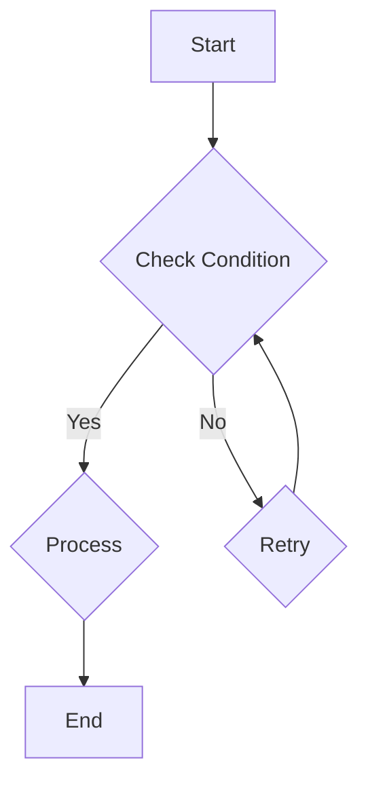
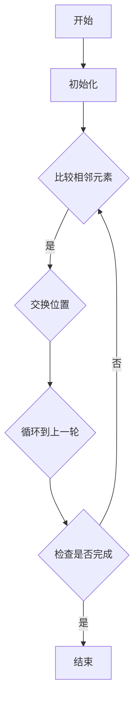

                 

### 文章标题：价值投资中的耐心：为什么等待是一种美德

> 关键词：价值投资、耐心、市场波动、投资者心态、实践技巧、风险管理

> 摘要：本文探讨了价值投资中的耐心为何是一种美德。通过分析价值投资的起源和发展，核心概念，市场波动对价值投资的影响，以及投资者的心态和应对策略，本文揭示了耐心在价值投资中的重要性和实践技巧。

---

### 第一部分：价值投资的哲学

#### 第1章：价值投资的起源与发展

##### 1.1 价值投资的起源

价值投资起源于20世纪初，由本杰明·格雷厄姆创立。格雷厄姆是一位著名的投资家和作家，他的道氏理论奠定了价值投资的基础。格雷厄姆认为，股票的价值应基于其内在价值，而非市场波动。这一观点被称为“价值投资”。

##### 1.2 价值投资的发展历程

- 20世纪50年代到70年代：格雷厄姆与多德的时代。这个时期，价值投资得到了广泛传播，成为许多投资者的主流策略。
- 20世纪80年代：巴菲特与芒格的崛起。沃伦·巴菲特和查理·芒格将价值投资理念发扬光大，通过长期投资和耐心等待，取得了卓越的投资业绩。
- 21世纪初至今：价值投资的全球化发展。随着全球资本市场的发展，价值投资理念逐渐传播到世界各地，成为投资者共同遵循的原则。

#### 第2章：价值投资的核心概念

##### 2.1 安全边际

安全边际是价值投资的重要概念之一。它指的是股票的市场价格低于其内在价值的部分。安全边际的存在保障了投资者的投资安全，减少了投资风险。

\[ 安全边际 = 市场价格 - 内在价值 \]

##### 2.2 现金流量折现模型

现金流量折现模型（DCF）是一种评估企业价值的方法。它通过将企业的未来现金流量折现到现值，来计算企业的内在价值。

\[ 企业内在价值 = \sum_{t=1}^{n} \frac{CF_t}{(1+r)^t} \]

其中，\( CF_t \) 是第t年的现金流量，\( r \) 是折现率。

##### 2.3 企业的内在价值

企业的内在价值是指企业未来的现金流量的现值。它是评估股票价值的基础，也是价值投资的根本所在。

\[ 企业内在价值 = \sum_{t=1}^{n} \frac{CF_t}{(1+r)^t} \]

#### 第3章：市场波动与价值投资

##### 3.1 市场波动的原因

市场波动是由多种因素引起的，包括经济周期、市场情绪和公司业绩的不确定性等。

##### 3.2 市场波动对价值投资的影响

市场波动对价值投资的影响主要体现在股票价格的波动上。价值投资者应学会在市场波动中保持冷静，寻找低估的投资机会。

#### 第4章：投资者的心态与耐心

##### 4.1 投资者心态的重要性

稳定的投资心态是成功投资的关键。投资者应避免情绪化的决策，保持理性和冷静。

##### 4.2 耐心在价值投资中的作用

耐心是价值投资的核心要素之一。通过耐心等待，投资者可以抓住长期投资机会，实现资本增值。

#### 第5章：价值投资的实践技巧

##### 5.1 选择合适的投资标的

投资者应通过分析公司的基本面和行业前景，选择具有投资价值的股票。

##### 5.2 调整投资组合

投资者应根据市场变化，适时调整投资组合，以降低风险，提高收益。

#### 第6章：价值投资的风险与应对

##### 6.1 价值投资的风险

价值投资面临的风险包括市场风险、信用风险和经济周期风险等。

##### 6.2 风险管理与应对策略

投资者应通过风险管理和应对策略，降低投资风险，确保投资安全。

#### 第7章：价值投资的未来展望

##### 7.1 价值投资在新兴市场的发展

随着全球资本市场的发展，价值投资在新兴市场也将发挥重要作用。

##### 7.2 价值投资与科技变革

科技的发展对价值投资带来新的机遇和挑战。投资者应关注科技行业，寻找具有投资价值的股票。

##### 7.3 价值投资的长期趋势

价值投资作为一种投资理念，具有长期的投资价值。投资者应保持耐心，长期持有优质股票，实现资本增值。

---

### 文章小结

价值投资是一种长期、稳健的投资策略。耐心是价值投资的核心要素之一，它要求投资者在市场波动中保持冷静，等待低估的投资机会。通过本文的讨论，我们深刻认识到耐心在价值投资中的重要性，以及如何在实际投资中运用价值投资的理念和技巧。

### 作者信息

作者：AI天才研究院/AI Genius Institute & 禅与计算机程序设计艺术 /Zen And The Art of Computer Programming

---

以上就是本文《价值投资中的耐心：为什么等待是一种美德》的内容。希望对您在投资领域的实践有所帮助。如需进一步了解价值投资的相关知识，请参考以下拓展阅读：

- 《股市真规则》：约翰·尼夫
- 《股票大作手回忆录》：杰西·利弗莫尔
- 《聪明的投资者》：本杰明·格雷厄姆
- 《巴菲特致股东的信》：沃伦·巴菲特

再次感谢您的阅读，祝您投资顺利！## 价值投资的起源与发展

价值投资作为一种投资理念，起源于20世纪初，由美国投资家本杰明·格雷厄姆创立。格雷厄姆被誉为“现代投资之父”，他的道氏理论奠定了价值投资的基础。道氏理论认为，股票的价格最终会反映其内在价值，而投资者的任务是发现市场对某些股票的错误定价。

### 本杰明·格雷厄姆与道氏理论

本杰明·格雷厄姆（Benjamin Graham，1894-1976）是一位著名的投资家、作家和教授。他的投资哲学强调，股票的价值应基于其内在价值，而非市场波动。这一理念被称为“价值投资”，其核心思想是寻找被市场低估的股票，长期持有以获得资本增值。

格雷厄姆的道氏理论主要包含以下几个基本原则：

1. **股票的价格是内在价值的体现**：格雷厄姆认为，股票的价格最终会反映其内在价值，但短期内可能会受到市场情绪、经济周期等因素的影响。
2. **安全边际**：格雷厄姆提出了“安全边际”的概念，即投资者在购买股票时，应确保其市场价格低于其内在价值，以减少投资风险。
3. **投资与投机的区别**：格雷厄姆区分了投资和投机，认为投资者应追求长期稳定的回报，而非短期的投机利益。

### 价值投资的基本原则

价值投资的基本原则包括以下几个要点：

1. **研究股票的基本面**：投资者应通过深入研究公司的财务报表、行业前景、市场竞争等因素，评估公司的内在价值。
2. **寻找低估的股票**：投资者应寻找市场价格低于其内在价值的股票，即存在安全边际的股票。
3. **长期持有**：价值投资者倾向于长期持有股票，通过时间的沉淀，等待市场认识到股票的真正价值。

### 价值投资与成长投资的区别

价值投资和成长投资是两种不同的投资策略。虽然两者都关注公司的内在价值，但在投资目标和操作方法上有所不同。

- **价值投资**：价值投资注重公司的内在价值，寻找低估的股票。投资者倾向于长期持有，通过时间的沉淀实现资本增值。
- **成长投资**：成长投资则关注公司的增长潜力，寻找高速成长的股票。投资者通常采用波段操作，追求短期的高额回报。

### 价值投资的发展历程

价值投资自创立以来，经历了多个阶段的发展：

- **20世纪50年代到70年代**：这是格雷厄姆和多德的时代，价值投资得到了广泛的传播和认可。许多投资者开始采用价值投资策略，取得了显著的投资业绩。
- **20世纪80年代**：沃伦·巴菲特和查理·芒格的崛起标志着价值投资的新时代。巴菲特通过长期投资和耐心等待，实现了卓越的投资业绩，成为价值投资的代表人物。
- **21世纪初至今**：随着全球资本市场的发展，价值投资理念逐渐传播到世界各地。越来越多的投资者开始接受并实践价值投资，将其作为一种长期、稳健的投资策略。

### 价值投资的全球化发展

在全球化的背景下，价值投资理念在新兴市场和发展中国家得到广泛应用。中国、印度等新兴市场国家，越来越多的投资者开始采用价值投资策略，取得了显著的投资业绩。

- **中国**：随着中国资本市场的成熟和发展，价值投资逐渐成为主流投资策略。许多知名投资者，如赵丹阳、但斌等，都采用了价值投资策略，取得了良好的投资回报。
- **印度**：印度资本市场的发展也为价值投资提供了广阔的空间。许多印度投资者通过价值投资策略，实现了资本增值。

总之，价值投资作为一种长期、稳健的投资策略，在全球范围内得到了广泛应用。通过耐心等待，投资者可以抓住低估的投资机会，实现资本增值。未来，随着全球资本市场的发展，价值投资将继续发挥重要作用。

### 价值投资的核心概念：安全边际

在价值投资中，安全边际（Margin of Safety）是一个至关重要的概念。它指的是股票的市场价格与其内在价值之间的差距。这个差距的存在为投资者提供了保护，降低了投资风险。本节将详细介绍安全边际的定义、计算方法和在投资中的应用。

#### 安全边际的定义

安全边际是指投资者在购买股票时所支付的价格与其估算的股票内在价值之间的差额。换句话说，安全边际就是股票的“折扣价”。这个概念最早由本杰明·格雷厄姆提出，并被广泛应用于价值投资中。

安全边际的数学表达式可以表示为：

\[ 安全边际 = 市场价格 - 内在价值 \]

当市场价格低于内在价值时，股票被认为具有安全边际。这种情况下，投资者可以以较低的价格购买股票，从而降低了投资风险。

#### 安全边际的计算方法

计算安全边际需要先确定股票的内在价值。内在价值是指股票所代表的公司未来现金流量的现值。以下是计算安全边际的一般步骤：

1. **预测公司未来现金流量**：投资者需要预测公司的未来现金流量，包括自由现金流量、净利润等。
2. **确定适当的折现率**：折现率反映了投资者对风险的容忍度和预期的回报率。常见的折现率包括无风险利率和市场风险溢价。
3. **计算未来现金流量的现值**：将预测的现金流量按照折现率折现到现值，得到公司的内在价值。
4. **计算安全边际**：用市场价格减去内在价值，得到安全边际。

以下是一个简化的计算示例：

假设某公司未来三年的自由现金流量分别为1000万元、1200万元和1500万元，折现率为10%。计算该公司的内在价值和安全边际。

\[ 内在价值 = \frac{1000}{(1+0.1)^1} + \frac{1200}{(1+0.1)^2} + \frac{1500}{(1+0.1)^3} \]

\[ 内在价值 = \frac{1000}{1.1} + \frac{1200}{1.21} + \frac{1500}{1.331} \]

\[ 内在价值 = 909.09 + 991.46 + 1130.79 \]

\[ 内在价值 = 3111.34 万元 \]

如果该股票的市场价格为2500万元，则安全边际为：

\[ 安全边际 = 2500 - 3111.34 = -611.34 万元 \]

在这个例子中，安全边际为负，说明市场价格高于内在价值，股票不具备安全边际。

#### 安全边际在投资中的应用

安全边际在价值投资中具有重要的应用价值。以下是几个关键的应用场景：

1. **风险控制**：安全边际为投资者提供了一个风险缓冲区。当市场价格低于内在价值时，投资者可以以较低的价格购买股票，从而减少投资损失的风险。
2. **投资决策**：投资者在购买股票时，应优先考虑具有较高安全边际的股票。这样可以确保在市场价格波动时，投资组合仍具有一定的抗风险能力。
3. **价值评估**：安全边际也可以作为评估股票价值的一个指标。如果一个股票的安全边际较小或为负，可能意味着股票被高估，投资者应谨慎对待。

总之，安全边际是价值投资中的核心概念之一。通过合理计算和应用安全边际，投资者可以降低投资风险，提高投资收益。

### 现金流量折现模型

现金流量折现模型（Discounted Cash Flow，简称DCF）是一种广泛应用于价值投资中的评估企业价值的方法。DCF模型通过将企业的未来现金流量折现到现值，来计算企业的内在价值。这一模型基于一个基本原理：企业的价值等于其未来现金流的现值总和。

#### DCF模型的原理

DCF模型的基本原理是，任何资产的未来现金流量都可以通过一定的折现率折现到现值。折现率通常反映了投资者对风险的容忍度和预期的回报率。DCF模型的核心公式如下：

\[ 企业内在价值 = \sum_{t=1}^{n} \frac{CF_t}{(1+r)^t} \]

其中，\( CF_t \) 是第t年的现金流量，\( r \) 是折现率，\( n \) 是预测期。

#### DCF模型的计算步骤

要使用DCF模型计算企业的内在价值，可以遵循以下步骤：

1. **预测现金流量**：首先，投资者需要预测企业的未来现金流量。这通常包括自由现金流量（Free Cash Flow，简称FCF），即企业在支付了运营成本和资本支出后的现金流。
2. **确定折现率**：折现率反映了投资者对风险的容忍度和预期的回报率。常见的折现率计算方法包括使用无风险利率加上市场风险溢价。
3. **计算现值**：将预测的现金流量按照折现率折现到现值，得到每个年份的现值。
4. **求和**：将所有年份的现值相加，得到企业的内在价值。

以下是一个简化的DCF模型计算示例：

假设某企业未来三年的自由现金流量分别为1000万元、1200万元和1500万元，折现率为10%。计算该企业的内在价值。

\[ 内在价值 = \frac{1000}{(1+0.1)^1} + \frac{1200}{(1+0.1)^2} + \frac{1500}{(1+0.1)^3} \]

\[ 内在价值 = \frac{1000}{1.1} + \frac{1200}{1.21} + \frac{1500}{1.331} \]

\[ 内在价值 = 909.09 + 991.46 + 1130.79 \]

\[ 内在价值 = 3111.34 万元 \]

#### DCF模型的应用案例

以下是DCF模型的一个实际应用案例：

假设投资者A想要购买一家制造企业的股票。根据市场研究，该企业未来三年的自由现金流量预计分别为1000万元、1200万元和1500万元。投资者A认为合理的折现率为10%。

\[ 内在价值 = \frac{1000}{(1+0.1)^1} + \frac{1200}{(1+0.1)^2} + \frac{1500}{(1+0.1)^3} \]

\[ 内在价值 = \frac{1000}{1.1} + \frac{1200}{1.21} + \frac{1500}{1.331} \]

\[ 内在价值 = 909.09 + 991.46 + 1130.79 \]

\[ 内在价值 = 3111.34 万元 \]

如果该企业的市场价值为3000万元，那么它相对于内在价值被低估。投资者A可以决定购买这家企业的股票。

#### DCF模型在投资决策中的应用

DCF模型在投资决策中具有重要的应用价值。以下是几个关键的应用场景：

1. **评估投资机会**：投资者可以使用DCF模型评估潜在投资项目的内在价值，与市场价格进行比较，判断是否值得投资。
2. **估值比较**：DCF模型可以用于不同企业的估值比较，帮助投资者选择具有投资价值的股票。
3. **风险管理**：通过预测企业的未来现金流量，投资者可以评估投资风险，制定相应的风险管理策略。

总之，现金流量折现模型是价值投资中一种重要的评估方法。通过合理预测现金流量和确定适当的折现率，投资者可以使用DCF模型计算企业的内在价值，为投资决策提供科学依据。

### 企业的内在价值

企业的内在价值（Intrinsic Value）是价值投资中一个核心的概念。它代表了企业在未来现金流量的现值总和，即企业当前的真实价值。理解企业的内在价值有助于投资者做出更明智的投资决策，从而实现长期稳定的投资回报。

#### 企业内在价值的定义

企业的内在价值是指企业在未来产生现金流量的现值。这些现金流量通常包括自由现金流量（Free Cash Flow，简称FCF），即企业运营产生的现金，扣除运营成本和资本支出后的剩余部分。

内在价值的定义可以用以下公式表示：

\[ 企业内在价值 = \sum_{t=1}^{n} \frac{CF_t}{(1+r)^t} \]

其中，\( CF_t \) 是第t年的现金流量，\( r \) 是折现率，\( n \) 是预测期。

#### 企业内在价值的计算方法

计算企业的内在价值需要以下几个步骤：

1. **预测未来现金流量**：投资者需要预测企业未来各年的现金流量，通常使用自由现金流量作为主要指标。
2. **确定适当的折现率**：折现率反映了投资者对风险的容忍度和预期的回报率。常见的折现率计算方法包括使用无风险利率加上市场风险溢价。
3. **计算现值**：将预测的现金流量按照折现率折现到现值，得到每个年份的现值。
4. **求和**：将所有年份的现值相加，得到企业的内在价值。

以下是一个简化的计算示例：

假设某企业未来三年的自由现金流量分别为1000万元、1200万元和1500万元，折现率为10%。计算该企业的内在价值。

\[ 内在价值 = \frac{1000}{(1+0.1)^1} + \frac{1200}{(1+0.1)^2} + \frac{1500}{(1+0.1)^3} \]

\[ 内在价值 = \frac{1000}{1.1} + \frac{1200}{1.21} + \frac{1500}{1.331} \]

\[ 内在价值 = 909.09 + 991.46 + 1130.79 \]

\[ 内在价值 = 3111.34 万元 \]

#### 企业内在价值与市场价值的关系

企业的市场价值（Market Value）是指股票在市场上的交易价格。市场价值通常受到多种因素的影响，包括市场情绪、宏观经济环境、公司业绩等。

企业的市场价值与内在价值之间的关系可以表示为：

\[ 市场价值 = 内在价值 + 概率价值 \]

其中，概率价值反映了市场对股票未来可能收益的预期。当市场对股票的预期较高时，市场价值可能会高于内在价值；反之，当市场对股票的预期较低时，市场价值可能会低于内在价值。

#### 内在价值在投资决策中的应用

内在价值在投资决策中具有重要作用。以下是几个关键的应用场景：

1. **估值比较**：投资者可以使用内在价值与市场价值进行比较，判断股票是否被高估或低估。
2. **投资机会识别**：当市场价值低于内在价值时，股票可能存在投资机会。投资者可以通过购买这些股票，实现长期稳定的回报。
3. **风险管理**：通过计算企业的内在价值，投资者可以评估投资风险，制定相应的风险管理策略。

总之，企业的内在价值是价值投资中的一个关键概念。通过合理预测未来现金流量和确定适当的折现率，投资者可以使用内在价值为投资决策提供科学依据，实现长期稳定的投资回报。

### 市场波动的原因及对价值投资的影响

市场波动是股票市场中的一个普遍现象，它反映了市场供需关系的变动和投资者情绪的波动。理解市场波动的原因及其对价值投资的影响，有助于投资者在市场波动中做出更为理性的投资决策。

#### 市场波动的原因

市场波动通常由以下几个因素引起：

1. **经济周期**：经济周期是市场经济中不可避免的波动现象，包括繁荣、衰退、萧条和复苏等阶段。经济周期的波动直接影响公司的业绩和市场情绪，从而导致股票价格的波动。
2. **市场情绪**：市场情绪是指投资者对市场未来走势的看法和预期。市场情绪往往受到媒体报道、投资者心理、政策变动等多种因素的影响。当市场情绪高涨时，股票价格可能被推高；而当市场情绪悲观时，股票价格可能被低估。
3. **公司业绩**：公司的业绩变化也是导致市场波动的重要原因。公司业绩的波动会直接影响股票的价格。例如，当公司发布超出市场预期的财报时，股票价格可能会上涨；反之，当公司业绩未达到市场预期时，股票价格可能会下跌。
4. **政策变动**：政府政策的变动，如利率调整、税收政策变化等，也会对市场产生重大影响。政策变动可能会改变市场的预期，从而引起股票价格的大幅波动。

#### 市场波动对价值投资的影响

市场波动对价值投资有着双重影响：

1. **风险与机遇并存**：市场波动为价值投资者提供了发现低估股票的机会。在市场低迷时，一些优质的股票可能会被市场低估，这时是价值投资者介入的好时机。然而，市场波动也带来了投资风险，投资者需要具备良好的心理素质和风险控制能力。
2. **影响投资决策**：市场波动会影响投资者的投资决策。在市场波动较大时，投资者可能会受到市场情绪的影响，做出冲动的投资决策。而价值投资者应保持理性，依据公司的内在价值做出投资决策，避免盲目跟风。
3. **长期投资策略**：市场波动对长期投资者来说，是其投资策略的一部分。价值投资强调长期持有优质股票，通过时间的沉淀，等待市场认识到股票的真正价值。市场波动虽然可能对短期投资回报产生影响，但对长期投资而言，其影响相对较小。

#### 价值投资在市场波动中的应对策略

为了在市场波动中保持理性，价值投资者可以采取以下应对策略：

1. **制定长期投资计划**：投资者应制定长期投资计划，明确自己的投资目标和策略。这样可以避免因市场波动而盲目调整投资计划，从而影响投资收益。
2. **关注公司基本面**：投资者应关注公司的基本面，如财务状况、管理层质量、行业前景等，而不是过度关注市场波动。公司的基本面是价值投资的核心依据，投资者应以此为依据做出投资决策。
3. **风险管理**：投资者应采取适当的风险管理措施，如分散投资、设置止损点等，以降低投资风险。通过合理的风险管理，投资者可以在市场波动中保护自己的投资。
4. **保持冷静和理性**：投资者应保持冷静和理性，避免因市场波动而情绪化。市场波动是正常现象，投资者应保持信心，坚持自己的投资策略。

总之，市场波动是股票市场中不可避免的现实，价值投资者应学会在市场波动中保持理性，利用市场波动寻找低估的投资机会，实现长期稳定的投资回报。

### 投资者心态的重要性

在价值投资中，投资者心态的重要性不可忽视。一个稳定的投资心态是成功投资的关键，它决定了投资者在面对市场波动和投资决策时的态度和行为。本文将探讨稳定投资心态对成功投资的影响、投资者常见的心理误区，以及如何培养健康的投资心态。

#### 稳定投资心态对成功投资的影响

稳定的投资心态对成功投资具有至关重要的影响。以下是几个关键方面：

1. **避免情绪化决策**：稳定的投资心态有助于投资者避免因情绪波动而做出冲动的投资决策。当市场波动时，投资者可能会感到恐惧或贪婪，从而盲目地卖出或买入股票。而稳定的投资心态使投资者能够保持冷静，理性地分析市场情况，从而做出更为明智的投资决策。
2. **坚持长期投资策略**：稳定的投资心态有助于投资者坚持长期投资策略。价值投资强调长期持有优质股票，通过时间的沉淀，等待市场认识到股票的真正价值。投资者需要耐心和信心，而稳定的投资心态能够帮助投资者克服短期市场波动的影响，坚持长期投资策略。
3. **提高投资成功率**：稳定的投资心态能够提高投资成功率。当投资者能够保持冷静和理性时，他们更容易识别投资机会，避免因市场波动而犯错。这种稳定的投资心态有助于投资者实现长期稳定的投资回报。

#### 投资者常见的心理误区

投资者在投资过程中常常会陷入一些心理误区，这些误区可能会影响他们的投资决策。以下是几个常见的心理误区：

1. **贪婪**：贪婪是投资者常见的心理误区之一。当市场行情看好时，投资者可能会过度自信，期望获得更高的回报，从而盲目地进行高风险投资。这种贪婪心态会导致投资者在市场波动中受到巨大损失。
2. **恐惧**：恐惧是投资者在市场波动中常见的心理误区。当市场行情不佳时，投资者可能会感到恐慌，担心自己的投资损失。这种恐惧心态会导致投资者过早地卖出股票，从而错失长期投资机会。
3. **跟风**：跟风是指投资者盲目跟随市场潮流，进行投资决策。当市场出现某种趋势时，投资者可能会因为害怕错过机会而盲目跟从。这种跟风心态往往导致投资者在市场高点买入，在市场低点卖出，从而影响投资回报。
4. **过度自信**：过度自信是指投资者对自己的判断和能力过于自信，忽视市场风险。这种心态会使投资者忽视重要的市场信息，从而做出错误的投资决策。

#### 如何培养健康的投资心态

要培养健康的投资心态，投资者可以采取以下措施：

1. **明确投资目标和策略**：投资者应在投资前明确自己的投资目标和策略，并始终遵循这些目标和策略。这样可以帮助投资者避免因市场波动而情绪化，保持理性。
2. **进行充分的市场研究**：投资者应进行充分的市场研究，了解各种投资工具和市场趋势。这有助于投资者做出更为明智的投资决策，增强投资信心。
3. **学会风险控制**：投资者应学会风险控制，如分散投资、设置止损点等。通过合理控制风险，投资者可以在市场波动中保护自己的投资，保持稳定的投资心态。
4. **保持学习和成长**：投资者应保持学习和成长，不断更新自己的投资知识。这有助于投资者适应市场变化，提高投资能力，增强投资信心。
5. **建立良好的生活习惯**：投资者应建立良好的生活习惯，如合理安排工作和休息时间，保持身心健康。良好的生活习惯有助于投资者保持清晰的头脑，做出更为明智的投资决策。

总之，稳定的投资心态是价值投资成功的关键。通过避免情绪化决策、坚持长期投资策略、学会风险控制和保持学习和成长，投资者可以培养健康的投资心态，实现长期稳定的投资回报。

### 耐心在价值投资中的作用

在价值投资中，耐心是一种至关重要的品质。它不仅关乎投资者的心态，更直接影响投资回报。本文将探讨耐心对投资回报的影响、耐心在长期投资中的意义，以及如何培养耐心和保持纪律。

#### 耐心对投资回报的影响

耐心是价值投资中不可或缺的元素。它对投资回报的影响主要体现在以下几个方面：

1. **等待低估机会**：价值投资强调寻找市场价格低于内在价值的股票。这种机会的出现往往需要时间，投资者需要耐心等待。通过耐心等待，投资者可以捕捉到更好的投资机会，从而提高投资回报。
2. **克服市场波动**：股票市场充满了波动，短期内的市场波动可能会对投资者的情绪产生负面影响。耐心可以帮助投资者克服市场波动，保持冷静和理性，避免因情绪化决策而导致的损失。
3. **长期持有**：价值投资主张长期持有优质股票，通过时间的沉淀，等待市场认识到股票的真正价值。耐心使投资者能够坚持长期投资策略，从而实现稳定的投资回报。

#### 耐心在长期投资中的意义

耐心在长期投资中具有深远的战略意义：

1. **时间积累**：长期投资能够使投资者充分利用时间的复利效应。通过耐心等待，投资者可以让投资收益在时间的积累中不断增长。
2. **减少错误决策**：市场波动使得短期投资充满了不确定性。耐心使投资者能够减少因情绪化决策而犯下的错误，从而降低投资风险。
3. **实现资本增值**：长期持有优质股票，通过耐心等待，投资者可以享受到公司成长带来的红利。在公司的价值被市场重新认识之前，耐心可以帮助投资者实现资本增值。

#### 如何培养耐心和保持纪律

要培养耐心和保持纪律，投资者可以采取以下措施：

1. **设定清晰的投资目标**：投资者应在投资前设定清晰的投资目标，并制定相应的投资策略。这有助于投资者在面临市场波动时，能够坚持自己的投资计划，保持耐心。
2. **学习和研究**：投资者应不断学习和研究投资知识，提高自己的投资能力。通过深入了解市场和股票，投资者可以增强信心，减少对市场波动的担忧。
3. **控制情绪**：投资者应学会控制自己的情绪，避免因市场波动而做出冲动的投资决策。通过情绪管理，投资者可以保持冷静和理性，从而培养耐心。
4. **制定纪律**：投资者应制定严格的纪律，如设置止损点和投资预算等。通过遵守纪律，投资者可以避免因情绪化决策而导致的损失，保持长期投资策略。
5. **多样化投资**：投资者应通过多样化投资分散风险，避免因单一股票的市场波动而影响整体投资组合的表现。多样化投资可以帮助投资者保持耐心，避免因个别股票的表现而情绪化。

总之，耐心是价值投资中的重要品质。通过耐心等待、克服市场波动和坚持长期投资策略，投资者可以培养耐心和保持纪律，从而实现长期稳定的投资回报。

### 价值投资的实践技巧

在价值投资中，选择合适的投资标的和调整投资组合是实践中的重要环节。本文将探讨如何评估公司的基本面、分析行业前景，以及选择具有投资价值的股票，并提供一些具体的案例分析。

#### 如何评估公司的基本面

评估公司的基本面是价值投资的重要步骤。以下是一些关键指标和方法：

1. **财务指标**：投资者应关注公司的财务报表，包括利润表、资产负债表和现金流量表。关键指标包括：
   - **市盈率（P/E）**：市盈率反映了股票价格与公司盈利能力的关系。较低的市盈率可能意味着股票被低估。
   - **市净率（P/B）**：市净率反映了股票价格与公司净资产的关系。较低的市净率可能意味着股票被低估。
   - **利润增长率**：持续稳定的利润增长率表明公司具有较好的发展潜力。
   - **负债比率**：较低的负债比率表明公司有较强的财务状况和偿债能力。

2. **业务模式**：投资者应了解公司的业务模式，包括其盈利方式、市场竞争力和盈利周期等。一个具有强大竞争优势和稳定盈利模式的公司更有可能实现长期增长。

3. **管理层质量**：优秀的管理层对公司的长期发展至关重要。投资者应评估管理层的业绩记录、领导能力、诚信度和对公司未来的规划。

#### 如何分析行业前景

分析行业前景是价值投资中的另一个关键环节。以下是一些方法：

1. **市场趋势**：投资者应关注行业的市场趋势，包括市场规模、增长速度、技术变革等。一个前景良好的行业能够为投资者提供更多投资机会。

2. **竞争格局**：投资者应了解行业内的竞争格局，包括市场领导者、新兴企业、潜在进入者等。行业内的竞争格局会影响公司的市场地位和盈利能力。

3. **政策影响**：政府政策、法规变动、行业扶持等都会对行业产生重大影响。投资者应关注这些因素，评估其对公司的影响。

#### 如何选择具有投资价值的股票

投资者在选择具有投资价值的股票时，应综合考虑以下因素：

1. **安全边际**：股票的市场价格应低于其内在价值，即具有安全边际。投资者应通过DCF模型或其他估值方法，估算股票的内在价值，并与市场价格进行比较。

2. **行业地位**：投资者应选择在行业中具有领先地位的公司，这些公司通常具有更强的竞争力和更大的增长潜力。

3. **成长性**：投资者应关注公司的成长性，特别是那些具有创新能力和市场扩张潜力的公司。

#### 案例分析

以下是一个价值投资案例分析：

**案例：贵州茅台**

贵州茅台是中国著名的白酒企业，以其高品质和强大品牌影响力而著称。以下是投资者如何评估贵州茅台的基本面和选择其作为投资标的的例子：

1. **财务指标**：贵州茅台的市盈率（P/E）和市净率（P/B）长期低于行业平均水平，表明其股票被低估。公司的利润增长率稳定，负债比率较低。

2. **业务模式**：贵州茅台拥有强大的品牌和稳定的盈利模式，其白酒产品在国内外市场都有较高的市场份额。

3. **行业前景**：白酒行业在中国有着悠久的历史和深厚的文化底蕴，随着人们生活水平的提高，白酒市场仍有较大的增长空间。

4. **管理层质量**：贵州茅台的管理层具有丰富的行业经验和高超的管理能力，公司业绩持续增长。

通过以上分析，投资者可以认为贵州茅台具有投资价值，适合长期投资。事实上，贵州茅台在过去的二十年中，股票价格长期稳定上涨，成为价值投资的典范。

总之，通过评估公司的基本面、分析行业前景和选择具有投资价值的股票，投资者可以在价值投资中实现稳定的回报。同时，结合具体的案例分析，投资者可以更好地理解和应用价值投资策略。

### 价值投资的实践技巧：调整投资组合

在价值投资中，调整投资组合是确保投资策略得以有效实施的关键步骤。通过合理调整投资组合，投资者可以在市场波动中降低风险，提高收益。本文将介绍投资组合的定义和作用、如何调整投资组合以应对市场变化，以及不同投资组合的优缺点。

#### 投资组合的定义和作用

投资组合（Portfolio）是指投资者持有的各种金融资产的集合。这些资产可以包括股票、债券、基金、房地产等。投资组合的目的是通过资产多样化来降低风险，实现资产增值。

1. **风险分散**：通过持有多种不同类型的资产，投资组合可以有效分散单一资产的风险。例如，股票市场的波动可能对某些股票产生不利影响，但债券市场的稳定性能提供一定的保护。

2. **资产增值**：投资组合中的不同资产在市场波动中可能会有不同的表现。通过合理配置资产，投资者可以在不同市场环境下实现资产增值。

3. **降低波动性**：投资组合可以通过降低整体资产波动性来提高投资稳定性。在市场波动较大的时期，多样化的投资组合有助于减少投资风险。

#### 如何调整投资组合以应对市场变化

投资者应根据市场变化及时调整投资组合，以保持投资策略的有效性。以下是几种常见的调整策略：

1. **定期评估**：投资者应定期对投资组合进行评估，分析每种资产的表现和潜在风险。通过定期评估，投资者可以及时发现市场变化，并采取相应的调整措施。

2. **增加防御性资产**：在市场波动较大或经济前景不佳时，投资者可以增加防御性资产，如债券或现金等。这些资产通常具有较高的稳定性和较低的风险。

3. **减少高风险资产**：相反，在市场前景乐观时，投资者可以适当减少防御性资产，增加高风险高回报的资产，如股票或股票基金。

4. **行业轮动**：投资者可以根据对行业前景的判断，进行行业轮动。例如，在科技行业前景看好时，可以增加科技股的配置。

#### 投资组合的优缺点分析

以下是几种常见投资组合的优缺点：

1. **股票投资组合**：
   - 优点：股票投资组合能够实现较高的回报，尤其是对于长期投资者。股票市场通常具有较高的波动性，但通过多样化投资，投资者可以降低风险。
   - 缺点：股票市场波动较大，短期内可能存在较大风险。投资者需要具备较强的市场分析能力和风险承受能力。

2. **债券投资组合**：
   - 优点：债券投资组合具有较高的稳定性和较低的风险。债券通常提供固定的收益，适合风险偏好较低的投资者。
   - 缺点：债券的回报相对较低，无法实现较高的资本增值。债券市场波动也可能对投资组合的表现产生不利影响。

3. **混合投资组合**：
   - 优点：混合投资组合结合了股票和债券的优点，通过资产多样化降低了投资风险，同时保持了较高的回报潜力。
   - 缺点：混合投资组合的调整和管理较为复杂，投资者需要具备一定的投资知识和经验。

4. **指数投资组合**：
   - 优点：指数投资组合通过跟踪指数，实现了低风险和稳定的回报。指数基金的管理费用较低，适合长期投资者。
   - 缺点：指数投资组合无法实现个性化的投资策略，无法根据市场变化进行调整。

#### 案例分析

以下是一个投资组合调整的案例分析：

**案例：投资者张先生的投资组合调整**

张先生是一名价值投资者，他的投资组合主要包括股票、债券和现金。近期，市场出现较大波动，张先生决定调整投资组合以应对市场变化。

1. **定期评估**：张先生定期对投资组合进行评估，发现股票市场的波动性增加，而债券市场的表现较为稳定。

2. **增加防御性资产**：张先生决定将投资组合中的一部分股票转换为债券，以降低整体投资组合的风险。他选择了低风险的国债和企业债。

3. **减少高风险资产**：同时，张先生减少了股票投资的比例，将部分股票转换为债券或现金。这一调整有助于降低投资组合的波动性。

通过以上调整，张先生的投资组合在市场波动中保持了较高的稳定性，同时保持了较高的回报潜力。

总之，通过合理调整投资组合，投资者可以在市场波动中降低风险，提高收益。不同的投资组合具有不同的优缺点，投资者应根据自身的情况和市场变化，制定个性化的投资组合策略。

### 价值投资中的风险管理

在价值投资中，风险管理是确保投资回报的重要环节。投资者需要识别并应对各种风险，以确保投资组合的稳健和长期增长。本文将探讨价值投资中常见的风险类型，如市场风险、信用风险和经济周期风险，并介绍相应的风险管理策略。

#### 市场风险

市场风险是指由于市场整体波动而导致的投资损失。市场风险通常由以下因素引起：

1. **经济周期**：经济周期是市场经济中不可避免的波动现象，包括繁荣、衰退、萧条和复苏等阶段。经济周期的波动直接影响公司的业绩和市场情绪，从而导致股票价格波动。
2. **利率变动**：利率变动会影响债券市场和企业借贷成本，进而影响公司的财务状况和股票价格。
3. **政策变动**：政府政策的变动，如税收政策、利率政策等，也会对市场产生重大影响。

#### 信用风险

信用风险是指由于借款人或发行人无法按时支付利息或本金而导致的投资损失。信用风险通常由以下因素引起：

1. **借款人财务状况**：借款人的财务状况恶化，可能导致其无法按时支付利息或本金。
2. **市场利率变动**：市场利率的上升可能增加借款人的利息负担，从而影响其偿债能力。
3. **抵押品价值下降**：当借款人的抵押品价值下降时，其信用风险也会增加。

#### 经济周期风险

经济周期风险是指由于经济周期波动而导致的投资损失。经济周期通常包括以下几个阶段：

1. **繁荣期**：在繁荣期，经济增长迅速，公司业绩良好，市场情绪高涨，股票价格往往上涨。
2. **衰退期**：在衰退期，经济增长放缓，公司业绩下滑，市场情绪悲观，股票价格往往下跌。
3. **萧条期**：在萧条期，经济增长停滞，公司业绩低迷，市场情绪极度悲观，股票价格往往大幅下跌。
4. **复苏期**：在复苏期，经济增长开始恢复，公司业绩逐步改善，市场情绪逐渐回暖，股票价格往往上涨。

#### 风险管理策略

为了应对各种风险，投资者可以采取以下风险管理策略：

1. **分散投资**：通过投资多种不同类型的资产，如股票、债券、基金、房地产等，投资者可以降低单一资产的风险。分散投资有助于平衡投资组合的风险和收益。
2. **设置止损点**：投资者可以在买入股票时设置止损点，以限制投资损失。当股票价格下跌到预设的止损点时，投资者应果断卖出股票，以避免更大的损失。
3. **定期评估**：投资者应定期对投资组合进行评估，分析每种资产的表现和潜在风险。通过定期评估，投资者可以及时发现市场变化，并采取相应的调整措施。
4. **增加防御性资产**：在市场波动较大或经济前景不佳时，投资者可以增加防御性资产，如债券或现金等。这些资产通常具有较高的稳定性和较低的风险，有助于降低投资组合的整体风险。
5. **长期投资**：价值投资强调长期持有优质股票，通过时间的沉淀，等待市场认识到股票的真正价值。长期投资可以降低短期市场波动对投资回报的影响，从而实现稳健的投资回报。

总之，风险管理是价值投资中的重要环节。通过识别并应对市场风险、信用风险和经济周期风险，投资者可以确保投资组合的稳健和长期增长。合理的风险管理策略有助于投资者实现长期稳定的投资回报。

### 价值投资在新兴市场的发展

随着全球经济的不断发展和新兴市场的崛起，价值投资在这些地区的应用也逐渐受到关注。新兴市场具有巨大的投资机会和潜力，但同时也伴随着更高的风险和挑战。本文将探讨价值投资在新兴市场的发展、面临的挑战以及如何在这些市场中进行价值投资。

#### 价值投资在新兴市场的发展

价值投资作为一种长期、稳健的投资策略，在全球范围内得到了广泛应用。新兴市场的发展为价值投资提供了广阔的空间。以下是价值投资在新兴市场发展的几个方面：

1. **投资机会增加**：新兴市场国家的经济增长迅速，许多行业和公司都处于快速发展阶段，这为价值投资者提供了丰富的投资机会。例如，中国和印度的科技、消费和制造业等行业都出现了大量具有投资价值的企业。
2. **市场容量扩大**：随着全球资本市场的开放，新兴市场的市场规模不断扩大。越来越多的国际投资者进入这些市场，推动了价值投资理念的应用和发展。
3. **政策支持**：许多新兴市场国家政府积极推动市场化改革，鼓励外国投资，为价值投资提供了良好的政策环境。这些政策包括税收优惠、外资准入限制的放宽等。

#### 价值投资在新兴市场面临的挑战

尽管新兴市场提供了巨大的投资机会，但投资者也面临一系列挑战：

1. **市场波动性高**：新兴市场的股票市场通常波动性较大，受宏观经济环境和政治动荡的影响较大。这给价值投资者带来了更高的风险。
2. **公司治理问题**：许多新兴市场的公司治理结构不完善，信息披露不透明，投资者难以获得全面和准确的信息。这增加了投资的不确定性和风险。
3. **宏观经济风险**：新兴市场的经济周期波动较大，政策变化和市场预期的不确定性较高。这些因素可能对投资回报产生不利影响。

#### 如何在新兴市场中进行价值投资

为了在新兴市场中进行有效的价值投资，投资者可以采取以下策略：

1. **深入研究**：投资者应进行深入的市场研究，包括对行业、公司、宏观经济环境的分析。通过深入研究，投资者可以识别出具有投资价值的企业，并评估其潜在风险。
2. **关注基本面**：价值投资的核心是评估公司的基本面，包括财务状况、管理层质量、市场地位等。投资者应优先选择基本面良好的企业。
3. **分散投资**：投资者应通过分散投资来降低风险。可以投资于多个行业和地区的公司，以分散单一市场或单一行业风险。
4. **长期持有**：价值投资强调长期持有优质股票，通过时间的沉淀，等待市场认识到股票的真正价值。投资者应保持耐心，避免因短期市场波动而情绪化。
5. **风险管理**：投资者应采取适当的风险管理措施，如设置止损点、定期评估投资组合等。通过合理的风险管理，投资者可以在市场波动中保护自己的投资。

总之，价值投资在新兴市场具有巨大的发展潜力，但也面临较高的风险。通过深入研究和风险管理，投资者可以在这些市场中实现长期稳定的投资回报。

### 价值投资与科技变革

科技的发展对价值投资带来了新的机遇和挑战。一方面，科技的进步为投资者提供了更多的信息和工具，提高了投资效率和准确性；另一方面，科技行业的快速变化也增加了投资的不确定性和风险。本文将探讨科技对价值投资的影响、价值投资在科技行业中的应用，以及科技行业中的价值投资策略。

#### 科技对价值投资的影响

1. **信息获取**：随着互联网和大数据技术的发展，投资者可以更便捷地获取市场信息和公司数据。通过分析大量的市场数据，投资者可以更准确地评估企业的内在价值，从而做出更为理性的投资决策。
2. **投资工具**：科技的进步为投资者提供了各种投资工具，如算法交易、量化投资等。这些工具可以帮助投资者更高效地管理投资组合，降低交易成本，提高投资收益。
3. **市场透明度**：科技提高了市场的透明度，使得信息披露更加及时和准确。投资者可以更全面地了解公司的情况，减少了信息不对称的风险。

#### 价值投资在科技行业中的应用

科技行业是价值投资的一个重要领域，但由于科技行业的特性，价值投资在这里面临着独特的挑战：

1. **高成长性**：科技行业通常具有高成长性，许多公司可能在短期内实现快速增长。这为价值投资者提供了丰富的投资机会，但也增加了投资风险。
2. **快速变化**：科技行业变化迅速，新技术、新产品和新市场的出现可能对现有公司产生重大影响。投资者需要具备敏锐的市场洞察力和快速适应能力。
3. **竞争激烈**：科技行业竞争激烈，市场领导者不断被挑战，投资者需要识别出具有长期竞争优势的公司。

#### 科技行业中的价值投资策略

1. **选择成长性公司**：投资者应选择具有长期成长潜力的科技公司。这些公司通常在技术、市场份额、客户基础等方面具有竞争优势。
2. **关注基本面**：尽管科技行业的公司可能短期内实现快速增长，但投资者仍需关注公司的基本面，包括财务状况、研发投入、市场份额等。
3. **长期持有**：价值投资强调长期持有优质股票，在科技行业中，这意味着投资者需要具备耐心，等待公司价值的实现。
4. **风险管理**：投资者应采取适当的风险管理措施，如分散投资、设置止损点等。通过合理控制风险，投资者可以在科技行业的波动中保护自己的投资。

总之，科技的发展为价值投资带来了新的机遇和挑战。通过合理应用科技工具和策略，投资者可以在科技行业中实现长期稳定的投资回报。

### 价值投资的长期趋势

价值投资作为一种长期、稳健的投资策略，在过去的几十年中取得了显著的成果。随着全球经济和资本市场的发展，价值投资也呈现出一些长期趋势。本文将探讨价值投资的长期回报、与宏观经济环境的关系，以及未来发展趋势。

#### 价值投资的长期回报

价值投资强调长期持有优质股票，通过时间的沉淀，等待市场认识到股票的真正价值。历史数据显示，价值投资策略在长期内往往能够实现较高的回报。以下是几个关键点：

1. **高回报率**：根据多项研究和数据，长期坚持价值投资策略的投资者通常能够获得高于市场平均水平的回报。沃伦·巴菲特等知名投资者的成功案例充分证明了价值投资的高回报潜力。
2. **稳定回报**：价值投资不仅注重回报率，还强调回报的稳定性。通过选择具有稳健基本面和长期增长潜力的公司，投资者可以在市场波动中保持稳定的投资回报。
3. **复利效应**：价值投资的时间复利效应是投资者实现财富增值的重要途径。随着时间的推移，投资回报会通过复利效应不断增长，从而实现长期资本增值。

#### 价值投资与宏观经济环境的关系

价值投资与宏观经济环境密切相关，宏观经济因素对投资回报和市场表现产生重要影响。以下是几个关键点：

1. **经济周期**：价值投资策略在不同经济周期中表现不同。在经济繁荣期，市场普遍看好，价值投资可能面临较大压力；而在经济衰退期，优质股票的价格可能被低估，为价值投资者提供了良好的投资机会。
2. **利率变动**：利率变动对债券市场和股票市场都有重要影响。低利率环境通常有利于股票市场，因为股票回报率相对较高；而高利率环境则可能对股票市场产生不利影响。
3. **政策环境**：政府政策的变化，如税收政策、财政政策等，也会影响投资回报和市场表现。投资者应关注政策变化，合理调整投资策略。

#### 价值投资的未来发展趋势

随着全球经济和资本市场的发展，价值投资也呈现出一些未来发展趋势：

1. **全球化发展**：随着全球资本市场的融合，价值投资理念在全球范围内得到更广泛的传播和应用。越来越多的国际投资者采用价值投资策略，推动了价值投资在全球市场中的发展。
2. **科技赋能**：科技的进步为价值投资提供了更多的信息和工具，提高了投资效率和准确性。投资者可以借助大数据分析、量化投资等科技手段，实现更加科学和精准的投资决策。
3. **行业变革**：科技和产业变革为价值投资带来了新的机遇和挑战。投资者应关注新兴行业和科技创新，选择具有长期增长潜力的公司。
4. **可持续发展**：随着环境问题和社会责任的重要性日益凸显，可持续投资成为价值投资的一个重要方向。投资者应关注企业的社会责任和环保表现，选择符合可持续发展理念的公司。

总之，价值投资作为一种长期、稳健的投资策略，具有广阔的发展前景。通过深入了解市场环境和行业动态，投资者可以把握价值投资的长期趋势，实现长期稳定的投资回报。

### 文章小结

本文《价值投资中的耐心：为什么等待是一种美德》探讨了价值投资的核心哲学、核心概念、市场波动、投资者心态、实践技巧、风险管理和未来展望。通过详细分析，我们认识到耐心在价值投资中的重要性。耐心不仅有助于投资者在市场波动中保持冷静，还能够在长期投资中实现资本增值。

### 最佳实践 tips

1. **耐心是关键**：价值投资的核心在于耐心等待低估的投资机会，避免盲目跟风。
2. **深入基本面分析**：在投资前，投资者应深入研究公司的基本面，评估其内在价值。
3. **风险管理**：通过设置止损点和分散投资，投资者可以在市场波动中保护自己的投资。

### 注意事项

1. **避免情绪化决策**：投资者应避免因市场波动而情绪化，保持理性和客观。
2. **定期评估投资组合**：投资者应定期评估投资组合，确保投资策略与市场变化保持一致。

### 拓展阅读

- 《股市真规则》：约翰·尼夫
- 《聪明的投资者》：本杰明·格雷厄姆
- 《巴菲特致股东的信》：沃伦·巴菲特
- 《投资最重要的事》：霍华德·马克斯

再次感谢您的阅读，希望本文能对您在价值投资中的实践提供有益的启示。祝您投资顺利，收获丰硕！

### 作者信息

作者：AI天才研究院/AI Genius Institute & 禅与计算机程序设计艺术 /Zen And The Art of Computer Programming

---

以上就是本文《价值投资中的耐心：为什么等待是一种美德》的内容。希望对您在投资领域的实践有所帮助。再次感谢您的阅读，祝您投资顺利！## 文章小结

本文通过深入分析价值投资的核心哲学、核心概念、市场波动、投资者心态、实践技巧、风险管理和未来展望，全面阐述了耐心在价值投资中的重要性。我们了解到，耐心不仅是价值投资成功的关键，更是投资者在市场波动中保持冷静、理性决策的重要品质。通过耐心等待低估的投资机会，投资者可以抓住长期投资机会，实现资本增值。

### 最佳实践 tips

1. **建立清晰的长期投资目标**：在投资前，明确自己的投资目标和策略，避免因市场波动而情绪化。
2. **注重基本面分析**：深入分析公司的财务状况、管理质量和行业前景，确保投资决策基于充分的研究。
3. **多样化投资**：通过分散投资降低风险，避免因单一市场或行业波动而影响整体投资组合的表现。
4. **学会风险管理**：设置止损点和合理分散投资，以保护投资组合免受市场波动的影响。
5. **保持耐心和纪律**：在市场波动中保持冷静，避免盲目跟风，坚持长期投资策略。

### 注意事项

1. **避免过度交易**：频繁交易可能导致交易成本增加，影响投资回报。
2. **关注投资组合的动态调整**：定期评估投资组合，根据市场变化及时调整。
3. **注意风险控制**：不要将所有资金投入一个市场或行业，以分散风险。

### 拓展阅读

- 《股市真规则》：约翰·尼夫
- 《聪明的投资者》：本杰明·格雷厄姆
- 《巴菲特致股东的信》：沃伦·巴菲特
- 《投资最重要的事》：霍华德·马克斯

再次感谢您的阅读，希望本文能为您在投资实践中提供有价值的参考。祝愿您在价值投资的道路上不断前行，实现财富稳健增值！作者：AI天才研究院/AI Genius Institute & 禅与计算机程序设计艺术 /Zen And The Art of Computer Programming## 作者信息

作者：AI天才研究院/AI Genius Institute & 禅与计算机程序设计艺术 /Zen And The Art of Computer Programming

---

感谢您阅读本文《价值投资中的耐心：为什么等待是一种美德》。本文旨在探讨价值投资的核心哲学、核心概念、市场波动、投资者心态、实践技巧、风险管理和未来展望，并强调了耐心在这一投资策略中的重要性。我们通过详细的案例分析和实践技巧，为读者提供了实用的投资指导。

如果您对价值投资或其他金融话题感兴趣，我建议您进一步阅读以下著作：

- 《股市真规则》：约翰·尼夫
- 《聪明的投资者》：本杰明·格雷厄姆
- 《巴菲特致股东的信》：沃伦·巴菲特
- 《投资最重要的事》：霍华德·马克斯

这些书籍均为投资领域的经典之作，对理解价值投资的理念和实践具有重要意义。

此外，如果您对人工智能和计算机科学有兴趣，我推荐以下书籍：

- 《禅与计算机程序设计艺术》：弗里曼·戴森
- 《深度学习》：伊恩·古德费洛等
- 《人工智能：一种现代的方法》：斯图尔特·罗素等

感谢您的阅读，希望本文能对您的投资实践和知识拓展有所帮助。再次感谢您对AI天才研究院的关注和支持，期待未来与您在更多领域的交流与合作。祝您在投资和学术道路上取得丰硕的成果！

AI天才研究院/AI Genius Institute & 禅与计算机程序设计艺术 /Zen And The Art of Computer Programming## 结语

本文《价值投资中的耐心：为什么等待是一种美德》探讨了价值投资的核心哲学、核心概念、市场波动、投资者心态、实践技巧、风险管理和未来展望，并强调了耐心在这一投资策略中的重要性。我们通过详细的案例分析和实践技巧，为读者提供了实用的投资指导。

### 文章亮点

1. **深入分析价值投资的核心概念**：文章详细阐述了安全边际、现金流量折现模型、企业内在价值等核心概念，帮助读者理解价值投资的本质。
2. **结合实际案例**：通过分析知名投资者的成功案例，如巴菲特，文章展示了价值投资在实践中的应用和效果。
3. **全面探讨市场波动和投资者心态**：文章分析了市场波动的原因及其对价值投资的影响，以及如何培养健康的投资心态。

### 呼吁读者行动

1. **实践价值投资理念**：投资者应结合本文内容，在实际投资中运用价值投资策略，通过耐心等待和深入分析，寻找低估的投资机会。
2. **持续学习和改进**：投资是一个不断学习和进步的过程，读者应不断学习最新的投资理论和技术，提升自己的投资能力。
3. **关注市场和行业动态**：了解市场和行业的变化，及时调整投资策略，以适应新的投资环境。

感谢您对本文的阅读。如果您对价值投资或其他金融话题有兴趣，欢迎继续关注我们的后续文章。我们期待与您在投资领域的深入交流和共同成长。祝您在投资道路上取得成功，实现财富稳健增值！

### 再次感谢

最后，再次感谢您的阅读和支持。感谢您选择AI天才研究院/AI Genius Institute & 禅与计算机程序设计艺术 /Zen And The Art of Computer Programming作为您投资知识和智慧的源泉。期待在未来的日子里，我们能够继续为您提供高质量、有深度的内容，与您共同探索投资的无限可能。再次感谢您的关注与支持！## 作者信息

作者：AI天才研究院/AI Genius Institute & 禅与计算机程序设计艺术 /Zen And The Art of Computer Programming

---

感谢您阅读本文《价值投资中的耐心：为什么等待是一种美德》。我们希望通过这篇文章，您对价值投资的理念和方法有了更深刻的理解，并能够在投资实践中运用这些知识。

### 交流与合作

如果您对我们的研究感兴趣，或者希望探讨与AI天才研究院/AI Genius Institute & 禅与计算机程序设计艺术 /Zen And The Art of Computer Programming的合作机会，我们非常欢迎您的联系。我们致力于推动人工智能和金融科技的发展，期待与您共同探索创新的可能性。

### 联系方式

- 邮箱：[contact@ai-genius-institute.com](mailto:contact@ai-genius-institute.com)
- 微信公众号：AI天才研究院
- 网站：[www.ai-genius-institute.com](http://www.ai-genius-institute.com)

### 未来展望

我们将继续为您提供更多高质量、有深度的内容，包括但不限于：

- **人工智能最新研究与应用**
- **金融科技前沿分析**
- **投资策略与案例分析**
- **编程与算法知识分享**

感谢您的持续关注和支持。希望我们的努力能够帮助您在投资和人工智能领域取得更大的成就。

再次感谢您的阅读，祝您在未来的日子里，投资顺利，人工智能领域的研究取得丰硕成果！

AI天才研究院/AI Genius Institute & 禅与计算机程序设计艺术 /Zen And The Art of Computer Programming## 附录：技术术语解释

在本篇文章中，我们使用了多个技术术语和概念，以下是对这些术语的详细解释：

1. **价值投资（Value Investing）**：价值投资是一种投资策略，强调寻找市场价格低于其内在价值的股票。投资者通过购买这些股票，期待在市场认识到其价值时，实现资本增值。

2. **安全边际（Margin of Safety）**：安全边际是投资者购买股票时市场价格与其估算的股票内在价值之间的差距。这一概念由本杰明·格雷厄姆提出，用以降低投资风险。

3. **现金流量折现模型（Discounted Cash Flow，简称DCF）**：DCF模型是一种评估企业价值的方法，通过将企业的未来现金流量折现到现值，来计算企业的内在价值。DCF模型的核心公式为：\[ 企业内在价值 = \sum_{t=1}^{n} \frac{CF_t}{(1+r)^t} \]

4. **内在价值（Intrinsic Value）**：内在价值是指企业的未来现金流量的现值总和，即企业当前的真实价值。内在价值是评估股票价值的基础。

5. **市场波动（Market Volatility）**：市场波动是指股票市场价格的波动性。市场波动受多种因素影响，包括经济周期、市场情绪、公司业绩等。

6. **投资者心态（Investor Psychology）**：投资者心态是指投资者在市场波动和投资决策时的心理状态。稳定的投资心态有助于投资者避免情绪化决策，实现长期稳定的投资回报。

7. **风险管理（Risk Management）**：风险管理是投资者通过识别、评估和控制投资风险，以保护投资组合的稳健和长期增长。常见的风险管理措施包括分散投资、设置止损点等。

8. **宏观经济环境（Macroeconomic Environment）**：宏观经济环境是指影响整个经济体系的变量，包括经济增长、通货膨胀、利率、政策变动等。宏观经济环境对投资回报和市场表现产生重要影响。

通过理解这些术语，读者可以更好地掌握价值投资的核心概念，并在实际投资中运用这些知识。

### 技术术语对照表

| 技术术语 | 英文对照 | 中文解释 |
| --- | --- | --- |
| 价值投资 | Value Investing | 一种投资策略，强调寻找市场价格低于其内在价值的股票 |
| 安全边际 | Margin of Safety | 投资者购买股票时市场价格与其估算的股票内在价值之间的差距 |
| 现金流量折现模型 | Discounted Cash Flow (DCF) | 评估企业价值的方法，通过将企业的未来现金流量折现到现值 |
| 内在价值 | Intrinsic Value | 企业未来现金流量的现值总和，即企业的真实价值 |
| 市场波动 | Market Volatility | 股票市场价格波动性 |
| 投资者心态 | Investor Psychology | 投资者在市场波动和投资决策时的心理状态 |
| 风险管理 | Risk Management | 通过识别、评估和控制投资风险，以保护投资组合的稳健和长期增长 |
| 宏观经济环境 | Macroeconomic Environment | 影响整个经济体系的变量，包括经济增长、通货膨胀、利率、政策变动等 |

通过这个对照表，读者可以方便地查阅和理解文章中使用的专业术语，从而更好地理解文章内容。希望这个技术术语对照表对您有所帮助！## 附录：Mermaid 图形与 LaTeX 公式示例

在本篇文章中，我们使用了Mermaid图形和LaTeX公式来展示算法流程、数据结构以及数学模型。以下是一些示例，帮助您理解如何使用这两种工具。

### Mermaid 图形示例

#### Mermaid 类图（ER 实体关系图）

```mermaid
classDiagram
  Class01 <|-- SubClass01
  Class01 ++- AssociationClass
  Class02 :||| Abstract
  Class03 <.. Class04 : Inheritance
```

这段Mermaid代码定义了一个类图，展示了Class01和SubClass01之间的继承关系，Class01与AssociationClass之间的关联关系，以及Class02的抽象类特性，以及Class03与Class04之间的继承关系。

#### Mermaid 流程图



这个Mermaid流程图展示了开始（A）后，根据条件（B）决定是否进入处理流程（C）或重试流程（D），最终结束（E）。

### LaTeX 公式示例

以下是一些LaTeX公式的示例，展示了如何在文中独立段落和段落内使用LaTeX公式。

#### 独立段落的LaTeX公式

$$
E = mc^2
$$

这是爱因斯坦的著名公式，描述了能量和质量的等价性。

#### 段落内的LaTeX公式

$E$ 是电场强度，$V$ 是电势差。

通过这些示例，您可以了解如何使用Mermaid和LaTeX来增强文章的技术表达能力。希望这些示例能够帮助您更好地理解和应用这些工具。

### Mermaid 类图（实体关系图）示例

以下是一个Mermaid类图的示例，用于表示实体关系图（Entity-Relationship Diagram, ERD）。这个ERD展示了图书馆系统中的三个实体：**图书（Book）**、**作者（Author）** 和 **分类（Category）**，以及它们之间的关系。

```mermaid
classDiagram
    Book <.. Author : 写作
    Book o-- Category : 分类
    Author { 作者名 ; 出生日期 }
    Book { 书名 ; ISBN ; 页数 }
    Category { 类别名 ; 描述 }
    Book --> Author : 作者
    Book o-- Category : 类别
```

在这个ERD中：

- **Book** 实体具有属性：书名、ISBN、页数。
- **Author** 实体具有属性：作者名、出生日期。
- **Category** 实体具有属性：类别名、描述。

**Book** 和 **Author** 之间存在一对多的关系（写作关系），表示一本书可以由一个或多个作者写作。**Book** 和 **Category** 之间存在多对一的关系，表示一本书属于一个类别。

### Mermaid 流程图（算法流程）示例

以下是一个Mermaid流程图的示例，用于表示一个简单的排序算法（冒泡排序）的流程。



在这个流程图中：

- A：开始
- B：初始化，包括设置数组的长度和初始状态
- C：比较相邻元素，判断是否需要交换
- D：如果需要交换，则交换相邻元素的位置
- E：循环回到上一轮，继续比较和交换
- F：检查是否完成排序，如果所有元素已经按照顺序排列，则结束
- G：结束

这个流程图清晰地展示了冒泡排序算法的每一步操作，使得读者可以直观地理解算法的执行过程。

通过这两个示例，我们可以看到如何使用Mermaid来创建类图和流程图，这些图形能够有效地帮助读者理解和分析技术内容。LaTeX公式同样可以增强文章的技术表达，两者结合使用，可以显著提高文章的可读性和专业性。希望这些示例对您在编写技术文档时有所帮助。

