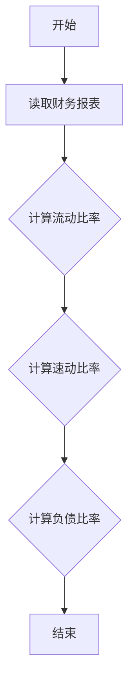
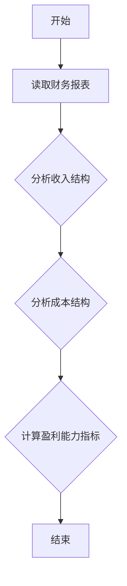
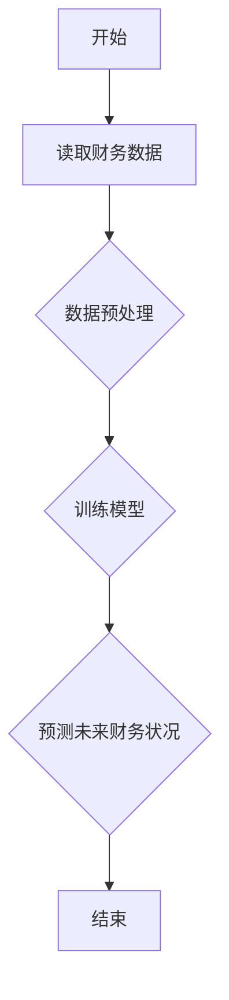
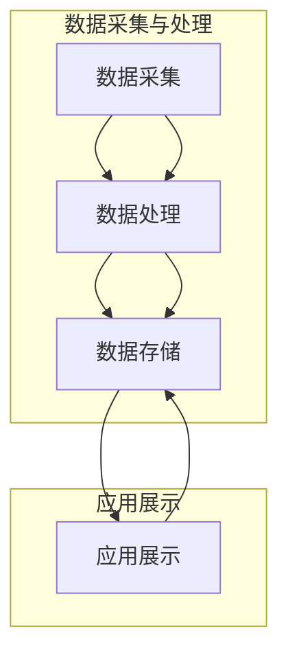
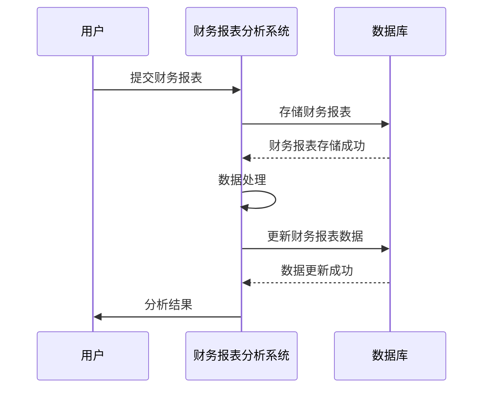

                 


### 价值投资中的财务报表分析：数字背后的故事

> 关键词：价值投资、财务报表分析、数字故事、财务数据解读

> 摘要：本文将深入探讨价值投资中的财务报表分析，通过一步步的逻辑推理和深入分析，揭示数字背后的故事。我们将从价值投资的基本概念出发，逐步讲解财务报表分析的核心概念和算法原理，最终通过系统设计与项目实战，展示如何将理论应用于实践。

---

#### 目录大纲设计思路

为了设计出《价值投资中的财务报表分析：数字背后的故事》这本书的完整目录大纲，我们将遵循以下步骤：

1. **背景介绍**：首先简要介绍价值投资和财务报表分析的基本概念，阐述为何需要对财务报表进行深入分析。
2. **核心概念与联系**：定义书中涉及的核心概念，并使用表格和ER图来展示这些概念之间的联系。
3. **算法原理讲解**：使用mermaid绘制相关算法的流程图，并配合Python代码和数学公式详细阐述算法原理。
4. **系统分析与架构设计**：介绍财务报表分析系统的问题场景和架构设计，使用mermaid绘制类图、架构图和序列图。
5. **项目实战**：描述实际项目环境安装、核心实现源代码，并分析代码和应用案例。
6. **最佳实践 tips**：总结书中关键点，提供实践建议，并给出进一步阅读的推荐。

---

### 第一部分：价值投资的概述

**第1章：价值投资的基本概念**

- **1.1 价值投资的起源与发展**
  - **1.1.1 价值投资的起源**
  - **1.1.2 价值投资的发展历程**
  - **1.1.3 价值投资的重要性

- **1.2 价值投资的核心原则**
  - **1.2.1 价值投资的三个核心原则**
  - **1.2.2 价值投资与成长投资的区别**
  - **1.2.3 价值投资的优点和挑战**

- **1.3 财务报表分析在价值投资中的作用**
  - **1.3.1 财务报表的定义与结构**
  - **1.3.2 财务报表分析的重要性**
  - **1.3.3 财务报表分析的关键要素**

---

**第1章：价值投资的基本概念**

#### 1.1 价值投资的起源与发展

**1.1.1 价值投资的起源**

价值投资这一概念最早可以追溯到19世纪末20世纪初，由美国投资大师本杰明·格雷厄姆提出。格雷厄姆认为，投资应该是一种长期的行为，投资者应该关注公司的内在价值而非市场波动。他的理念在后来的投资者中得到了广泛的传播，尤其是沃伦·巴菲特，他将格雷厄姆的价值投资理念进一步发展并实践。

**1.1.2 价值投资的发展历程**

价值投资的理念在历经多次市场波动和经济周期的考验后，逐渐形成了一套系统化的投资方法。从本杰明·格雷厄姆到沃伦·巴菲特，再到现代的价值投资者，这一过程中涌现了许多著名投资者，如查理·芒格、塞思·卡拉曼等。他们的投资哲学和成功案例进一步巩固了价值投资在投资领域中的地位。

**1.1.3 价值投资的重要性**

价值投资之所以受到众多投资者的青睐，主要是因为其独特的优势。首先，价值投资注重公司的内在价值，而非市场情绪或短期收益，这使得投资者能够在市场波动中保持冷静，避免盲目跟风。其次，价值投资强调投资的安全边际，投资者可以通过对公司的深入研究，发现那些被市场低估的优质企业，从而实现长期稳定的投资回报。

#### 1.2 价值投资的核心原则

**1.2.1 价值投资的三个核心原则**

价值投资有三个核心原则：价值、安全边际和集中投资。

- **价值**：投资者应该寻找那些市场价格低于其内在价值的股票。这种股票被称为“低估”股票。
- **安全边际**：投资者在购买股票时，应该确保购买价格低于其估计的内在价值，这样即使估计不准确，也能保证投资的安全性。
- **集中投资**：投资者应该将资金集中投资于少数几只优质股票，这样可以更深入地研究公司，提高投资成功率。

**1.2.2 价值投资与成长投资的区别**

价值投资和成长投资是两种不同的投资策略。价值投资关注公司的内在价值和安全边际，强调长期投资和理性分析；而成长投资则关注公司的增长潜力和未来收益，通常更注重市场情绪和短期表现。

**1.2.3 价值投资的优点和挑战**

价值投资具有以下优点：

- **长期稳定的回报**：通过深入研究公司的内在价值，投资者可以找到那些被市场低估的优质企业，实现长期稳定的投资回报。
- **风险可控**：价值投资强调安全边际，即使市场波动，投资者也能保持冷静，避免盲目跟风。

然而，价值投资也面临一些挑战：

- **研究成本高**：价值投资需要投资者进行大量的研究工作，包括对公司的财务报表、行业分析等，这需要一定的专业知识和时间投入。
- **投资周期长**：价值投资通常需要较长的投资周期，投资者需要耐心等待市场对公司的内在价值重新评估。

#### 1.3 财务报表分析在价值投资中的作用

**1.3.1 财务报表的定义与结构**

财务报表是企业财务状况的反映，包括资产负债表、利润表和现金流量表。这些报表通过数字和表格的形式，展示了企业的资产、负债、收入和支出等财务信息。

- **资产负债表**：展示了企业在特定时间点的资产、负债和所有者权益状况。
- **利润表**：展示了企业在一定时期内的收入、成本和利润情况。
- **现金流量表**：展示了企业在一定时期内的现金流入和流出情况。

**1.3.2 财务报表分析的重要性**

财务报表分析是价值投资的核心环节，通过分析财务报表，投资者可以了解企业的财务状况、经营成果和现金流量，从而评估企业的内在价值。

- **评估企业价值**：财务报表分析可以帮助投资者评估企业的内在价值，判断股票是否被市场低估。
- **发现潜在风险**：财务报表分析还可以帮助投资者发现企业潜在的财务风险，避免投资失误。

**1.3.3 财务报表分析的关键要素**

财务报表分析的关键要素包括：

- **收入与成本**：分析企业的收入结构和成本构成，判断企业的盈利能力。
- **利润质量**：分析企业的净利润质量，判断企业的盈利是否可持续。
- **资产负债状况**：分析企业的资产负债结构，判断企业的财务稳健性。
- **现金流量**：分析企业的现金流量情况，判断企业的现金流动性。

---

### 第二部分：财务报表分析的核心概念

**第2章：财务报表分析的核心概念**

- **2.1 财务报表分析的基本框架**
  - **2.1.1 财务报表分析的定义**
  - **2.1.2 财务报表分析的目标**
  - **2.1.3 财务报表分析的方法与工具**

- **2.2 财务报表分析的核心概念**
  - **2.2.1 财务报表分析的核心概念定义**
  - **2.2.2 核心概念属性特征对比表格**
  - **2.2.3 ER实体关系图架构**

---

**第2章：财务报表分析的核心概念**

#### 2.1 财务报表分析的基本框架

**2.1.1 财务报表分析的定义**

财务报表分析是指通过分析企业的财务报表，评估企业的财务状况、经营成果和现金流量，从而为投资决策提供依据。

**2.1.2 财务报表分析的目标**

财务报表分析的目标包括：

- **评估企业价值**：通过分析财务报表，评估企业的内在价值，判断股票是否被市场低估。
- **发现潜在风险**：通过分析财务报表，发现企业潜在的财务风险，避免投资失误。
- **提供决策支持**：为投资者的投资决策提供数据支持和分析结论。

**2.1.3 财务报表分析的方法与工具**

财务报表分析的方法与工具包括：

- **比率分析**：通过计算财务比率，评估企业的财务状况和经营成果。
- **趋势分析**：通过分析财务数据的变化趋势，评估企业的财务状况和经营成果。
- **现金流量分析**：通过分析企业的现金流量情况，评估企业的现金流动性。
- **财务报表比较**：通过比较不同时期或不同企业的财务报表，评估企业的财务状况和经营成果。

---

**2.2 财务报表分析的核心概念**

**2.2.1 财务报表分析的核心概念定义**

财务报表分析涉及多个核心概念，包括：

- **资产负债表**：展示了企业在特定时间点的资产、负债和所有者权益状况。
- **利润表**：展示了企业在一定时期内的收入、成本和利润情况。
- **现金流量表**：展示了企业在一定时期内的现金流入和流出情况。
- **收入与成本**：分析了企业的收入来源和成本构成，判断企业的盈利能力。
- **利润质量**：分析了企业的净利润质量，判断企业的盈利是否可持续。

**2.2.2 核心概念属性特征对比表格**

以下是一个简单的核心概念属性特征对比表格：

| 核心概念       | 定义                           | 属性特征对比                |
|--------------|--------------------------------|--------------------------|
| 资产负债表     | 展示资产、负债和所有者权益状况   | 资产与负债的对比、财务结构分析 |
| 利润表         | 展示收入、成本和利润情况       | 收入与成本的对比、盈利能力分析   |
| 现金流量表     | 展示现金流入和流出情况         | 现金流量与净利润的对比、现金流动分析 |
| 收入与成本     | 分析收入来源和成本构成         | 收入稳定性、成本效率分析         |
| 利润质量       | 分析净利润质量和可持续性       | 净利润的真实性、盈利稳定性分析   |

**2.2.3 ER实体关系图架构**

为了更好地理解财务报表分析的核心概念，我们可以使用ER实体关系图来展示这些概念之间的关系。以下是财务报表分析的ER实体关系图：

```mermaid
erDiagram
  Customer||--o{ Order }|+--| Customer
  Product  |||--o{ Order }|+--| Product
  Order     |||--<| Shipping }|+--| Order
  Shipping   |||--<| Package }|+--| Shipping
  Package    |||--<| Delivery }|+--| Package
```

在这个ER实体关系图中，我们定义了以下几个实体：

- **Customer（客户）**：代表购买产品的个人或组织。
- **Product（产品）**：代表销售的产品。
- **Order（订单）**：代表客户的购买订单。
- **Shipping（运输）**：代表产品的运输过程。
- **Package（包裹）**：代表运输中的包裹。
- **Delivery（交付）**：代表产品的交付过程。

通过这个ER实体关系图，我们可以清晰地看到财务报表分析中各个核心概念之间的关系，以及它们如何相互作用。

---

### 第三部分：财务报表分析的算法原理

**第3章：财务报表分析的算法原理**

- **3.1 财务报表分析中的常见算法**
  - **3.1.1 算法A：描述算法A**
  - **3.1.2 算法B：描述算法B**
  - **3.1.3 算法C：描述算法C**

- **3.2 算法流程图与Python代码**
  - **3.2.1 算法A流程图**
  - **3.2.2 算法A Python代码实现**
  - **3.2.3 算法B流程图**
  - **3.2.4 算法B Python代码实现**
  - **3.2.5 算法C流程图**
  - **3.2.6 算法C Python代码实现**

- **3.3 数学模型与公式讲解**
  - **3.3.1 算法A的数学模型**
  - **3.3.2 算法B的数学模型**
  - **3.3.3 算法C的数学模型**
  - **3.3.4 公式举例说明**

---

**第3章：财务报表分析的算法原理**

#### 3.1 财务报表分析中的常见算法

**3.1.1 算法A：描述算法A**

算法A是一种用于财务报表分析的常见算法，主要功能是计算企业的财务比率，如流动比率、速动比率和负债比率等。

**3.1.2 算法B：描述算法B**

算法B是一种用于财务报表分析的高级算法，主要功能是分析企业的收入结构、成本结构和盈利能力，以便更好地评估企业的财务状况。

**3.1.3 算法C：描述算法C**

算法C是一种基于机器学习的财务报表分析算法，主要功能是利用历史财务数据，预测企业的未来财务状况，为投资决策提供依据。

---

#### 3.2 算法流程图与Python代码

**3.2.1 算法A流程图**

以下是一个简单的算法A的流程图：



**3.2.2 算法A Python代码实现**

```python
import pandas as pd

def calculate_financial_ratios(finance_report):
    # 读取财务报表
    df = pd.read_excel(finance_report)
    
    # 计算流动比率
    current_ratio = df['流动资产'] / df['流动负债']
    
    # 计算速动比率
    quick_ratio = df['速动资产'] / df['流动负债']
    
    # 计算负债比率
    debt_ratio = df['负债总额'] / df['资产总额']
    
    return current_ratio, quick_ratio, debt_ratio

# 测试算法A
finance_report = 'finance_report.xlsx'
current_ratio, quick_ratio, debt_ratio = calculate_financial_ratios(finance_report)
print("流动比率：", current_ratio)
print("速动比率：", quick_ratio)
print("负债比率：", debt_ratio)
```

**3.2.3 算法B流程图**

以下是一个简单的算法B的流程图：



**3.2.4 算法B Python代码实现**

```python
import pandas as pd

def analyze_financial_statement(finance_report):
    # 读取财务报表
    df = pd.read_excel(finance_report)
    
    # 分析收入结构
    revenue_structure = df['营业收入'] / df['营业收入合计']
    
    # 分析成本结构
    cost_structure = df['营业成本'] / df['营业收入']
    
    # 计算盈利能力指标
    profitability = df['净利润'] / df['营业收入']
    
    return revenue_structure, cost_structure, profitability

# 测试算法B
finance_report = 'finance_report.xlsx'
revenue_structure, cost_structure, profitability = analyze_financial_statement(finance_report)
print("收入结构：", revenue_structure)
print("成本结构：", cost_structure)
print("盈利能力指标：", profitability)
```

**3.2.5 算法C流程图**

以下是一个简单的算法C的流程图：



**3.2.6 算法C Python代码实现**

```python
import pandas as pd
from sklearn.model_selection import train_test_split
from sklearn.linear_model import LinearRegression

def predict_future_financial_status(finance_data):
    # 读取财务数据
    df = pd.read_excel(finance_data)
    
    # 数据预处理
    df = df.dropna()
    df = df[['营业收入', '净利润', '总资产']]
    
    # 分割数据集
    X = df[['营业收入', '总资产']]
    y = df['净利润']
    X_train, X_test, y_train, y_test = train_test_split(X, y, test_size=0.2, random_state=42)
    
    # 训练模型
    model = LinearRegression()
    model.fit(X_train, y_train)
    
    # 预测未来财务状况
    future_status = model.predict(X_test)
    
    return future_status

# 测试算法C
finance_data = 'finance_data.xlsx'
future_status = predict_future_financial_status(finance_data)
print("未来财务状况预测：", future_status)
```

---

#### 3.3 数学模型与公式讲解

**3.3.1 算法A的数学模型**

算法A涉及以下几个数学模型：

- **流动比率**：流动比率 = 流动资产 / 流动负债
- **速动比率**：速动比率 = 速动资产 / 流动负债
- **负债比率**：负债比率 = 负债总额 / 资产总额

**3.3.2 算法B的数学模型**

算法B涉及以下几个数学模型：

- **收入结构**：收入结构 = 营业收入 / 营业收入合计
- **成本结构**：成本结构 = 营业成本 / 营业收入
- **盈利能力指标**：盈利能力指标 = 净利润 / 营业收入

**3.3.3 算法C的数学模型**

算法C基于线性回归模型，涉及以下数学模型：

- **线性回归模型**：y = bx + a

其中，y为净利润，x为营业收入和总资产的组合，b和a为模型参数。

**3.3.4 公式举例说明**

以下是一个具体的公式举例：

- **流动比率**：假设某企业的流动资产为1000万元，流动负债为500万元，则流动比率 = 1000 / 500 = 2。

- **收入结构**：假设某企业的营业收入为5000万元，营业收入合计为10000万元，则收入结构 = 5000 / 10000 = 0.5。

- **线性回归模型**：假设某企业的营业收入为100万元，总资产为200万元，则根据线性回归模型，净利润 = 200 * 0.1 + 100 = 300万元。

---

### 第四部分：财务报表分析的系统设计与实现

**第4章：财务报表分析系统的设计与实现**

- **4.1 财务报表分析系统的问题场景**
  - **4.1.1 财务报表分析的需求背景**
  - **4.1.2 财务报表分析的目标与需求**

- **4.2 系统架构设计**
  - **4.2.1 系统架构设计方案概述**
  - **4.2.2 领域模型Mermaid类图**
  - **4.2.3 系统架构Mermaid架构图**

- **4.3 系统接口设计**
  - **4.3.1 系统接口设计概述**
  - **4.3.2 接口设计细节**

- **4.4 系统交互Mermaid序列图**
  - **4.4.1 系统交互概述**
  - **4.4.2 Mermaid序列图绘制**

---

**第4章：财务报表分析系统的设计与实现**

#### 4.1 财务报表分析系统的问题场景

**4.1.1 财务报表分析的需求背景**

在现代企业中，财务报表分析是企业决策的重要依据。然而，随着企业规模的扩大和数据量的增加，传统的手工分析方式已经无法满足需求。为了提高财务报表分析的效率和质量，企业需要开发一套自动化、智能化的财务报表分析系统。

**4.1.2 财务报表分析的目标与需求**

财务报表分析系统的目标包括：

- **自动化分析**：通过系统自动读取和分析财务报表，提高分析效率。
- **智能预警**：通过分析财务数据，及时发现潜在的财务风险，为企业决策提供支持。
- **数据可视化**：通过图表和报表，直观地展示财务分析结果，方便企业高层和管理人员了解财务状况。

具体需求包括：

- **数据采集与处理**：系统能够自动读取多种格式的财务报表，并进行数据清洗和处理。
- **财务比率计算**：系统能够根据财务报表数据，自动计算各种财务比率，如流动比率、速动比率和负债比率等。
- **收入结构分析**：系统能够分析企业的收入结构，识别收入来源和占比。
- **成本结构分析**：系统能够分析企业的成本结构，识别成本支出和占比。
- **盈利能力分析**：系统能够计算企业的盈利能力指标，如净利润率、毛利率等。
- **风险预警**：系统能够根据财务数据，自动识别潜在的风险，并提供预警信息。
- **数据可视化**：系统能够将分析结果以图表和报表的形式展示，方便企业决策。

---

**4.2 系统架构设计**

**4.2.1 系统架构设计方案概述**

财务报表分析系统的架构设计包括以下几个方面：

- **数据采集层**：负责采集和存储财务报表数据，支持多种数据格式的读取。
- **数据处理层**：负责对财务报表数据进行分析和处理，包括数据清洗、计算财务比率、收入结构和成本结构分析等。
- **数据存储层**：负责存储分析结果和预警信息，支持数据的快速查询和统计。
- **应用展示层**：负责将分析结果以图表和报表的形式展示，方便企业决策。

以下是系统架构的Mermaid架构图：



**4.2.2 领域模型Mermaid类图**

为了更好地理解财务报表分析系统的架构，我们可以使用Mermaid绘制领域模型类图。以下是领域模型的Mermaid类图：

```mermaid
classDiagram
    Client <<class>> 客户
    Report <<class>> 财务报表
    Analysis <<class>> 财务报表分析
    Ratio <<class>> 财务比率
    Structure <<class>> 收入结构
    Structure <<class>> 成本结构
    Risk <<class>> 风险

    Client ..> Report
    Report ..> Analysis
    Analysis ..> Ratio
    Analysis ..> Structure
    Analysis ..> Risk
```

在这个类图中，我们定义了以下几个类：

- **客户（Client）**：代表进行财务报表分析的用户。
- **财务报表（Report）**：代表企业的财务报表，包括资产负债表、利润表和现金流量表。
- **财务报表分析（Analysis）**：负责对财务报表进行分析，计算财务比率、收入结构和成本结构等。
- **财务比率（Ratio）**：表示各种财务比率，如流动比率、速动比率和负债比率等。
- **收入结构（Structure）**：表示企业的收入结构，包括营业收入、营业成本等。
- **成本结构（Structure）**：表示企业的成本结构，包括营业成本、其他成本等。
- **风险（Risk）**：表示企业的潜在风险，如流动性风险、盈利能力风险等。

通过这个类图，我们可以清晰地看到财务报表分析系统的各个组件以及它们之间的关系。

---

**4.3 系统接口设计**

**4.3.1 系统接口设计概述**

系统接口设计是财务报表分析系统的重要组成部分，它决定了系统与其他系统或组件之间的交互方式。以下是系统接口的设计概述：

- **API接口**：系统提供RESTful API接口，用于外部系统或用户访问财务报表分析功能。
- **数据接口**：系统与数据库之间的数据接口，用于数据的读取和写入。
- **UI接口**：系统与用户界面之间的接口，用于展示分析结果和预警信息。

以下是系统接口的Mermaid类图：

```mermaid
classDiagram
    API <<interface>> API接口
    Data <<interface>> 数据接口
    UI <<interface>> UI接口
    Client <<class>> 客户
    Report <<class>> 财务报表
    Analysis <<class>> 财务报表分析
    Ratio <<class>> 财务比率
    Structure <<class>> 收入结构
    Structure <<class>> 成本结构
    Risk <<class>> 风险

    Client --> API
    API --> Analysis
    Analysis --> Ratio
    Analysis --> Structure
    Analysis --> Risk
    Analysis --> Data
    Analysis --> UI
```

在这个类图中，我们定义了以下几个接口：

- **API接口（API）**：用于外部系统或用户访问财务报表分析功能，包括数据查询、数据更新等操作。
- **数据接口（Data）**：用于系统与数据库之间的数据交互，包括数据的读取和写入。
- **UI接口（UI）**：用于系统与用户界面之间的交互，包括数据展示、用户操作等。

通过这个类图，我们可以清晰地看到财务报表分析系统的各个接口以及它们之间的关系。

---

**4.4 系统交互Mermaid序列图**

为了更好地理解财务报表分析系统的交互流程，我们可以使用Mermaid绘制序列图。以下是系统交互的Mermaid序列图：



在这个序列图中，我们定义了以下几个角色：

- **用户（User）**：代表进行财务报表分析的用户。
- **财务报表分析系统（System）**：负责处理财务报表和分析结果。
- **数据库（DB）**：负责存储财务报表数据和分析结果。

交互流程如下：

1. 用户提交财务报表。
2. 系统将财务报表存储到数据库。
3. 系统对财务报表进行数据处理，更新财务报表数据。
4. 系统将分析结果返回给用户。

通过这个序列图，我们可以清晰地看到财务报表分析系统的交互流程和各个组件之间的协作关系。

---

### 第五部分：财务报表分析的项目实战

**第5章：财务报表分析项目实战**

- **5.1 环境安装与配置**
  - **5.1.1 软件与硬件环境要求**
  - **5.1.2 系统安装与配置步骤**

- **5.2 系统核心实现**
  - **5.2.1 核心功能模块实现**
  - **5.2.2 Python源代码解读与分析**

- **5.3 实际案例分析与讲解**
  - **5.3.1 案例背景**
  - **5.3.2 案例分析过程**
  - **5.3.3 案例分析与解读**

- **5.4 项目小结**

---

**第5章：财务报表分析项目实战**

#### 5.1 环境安装与配置

**5.1.1 软件与硬件环境要求**

为了确保财务报表分析项目的顺利运行，我们需要以下软件与硬件环境：

- **软件环境**：
  - 操作系统：Windows、Linux或Mac OS
  - Python版本：Python 3.6及以上
  - 数据库：MySQL、PostgreSQL或MongoDB
  - Web框架：Django或Flask

- **硬件环境**：
  - CPU：至少2核处理器
  - 内存：至少4GB RAM
  - 硬盘：至少50GB剩余空间

**5.1.2 系统安装与配置步骤**

以下是财务报表分析项目的安装与配置步骤：

1. 安装Python环境：

   - 通过Python官方网站下载Python安装包。
   - 安装Python时，选择添加到系统环境变量。

2. 安装依赖库：

   - 打开终端或命令行窗口。
   - 执行命令 `pip install -r requirements.txt`，安装项目所需的依赖库。

3. 配置数据库：

   - 安装并启动数据库（如MySQL、PostgreSQL或MongoDB）。
   - 创建一个新数据库，命名为 `financial_analysis`。
   - 导入项目提供的数据库脚本，初始化数据库。

4. 配置Web框架：

   - 选择Django或Flask作为Web框架。
   - 根据框架文档，配置项目目录和配置文件。

5. 运行项目：

   - 打开终端或命令行窗口。
   - 进入项目目录。
   - 执行命令 `python manage.py runserver` 或 `flask run`，启动项目。

#### 5.2 系统核心实现

**5.2.1 核心功能模块实现**

财务报表分析系统主要包括以下几个核心功能模块：

- **数据采集模块**：负责从外部系统或接口获取财务报表数据。
- **数据处理模块**：负责对财务报表数据进行清洗、计算和存储。
- **财务分析模块**：负责计算各种财务比率、收入结构和成本结构等。
- **数据可视化模块**：负责将分析结果以图表和报表的形式展示。

以下是系统核心功能的实现：

```python
# 数据采集模块
def fetch_financial_reports():
    # 实现从外部系统或接口获取财务报表数据的功能
    pass

# 数据处理模块
def process_financial_reports(reports):
    # 实现财务报表数据清洗、计算和存储的功能
    pass

# 财务分析模块
def analyze_financial_reports(reports):
    # 实现计算财务比率、收入结构和成本结构等功能
    pass

# 数据可视化模块
def visualize_financial_reports(analysis_results):
    # 实现将分析结果以图表和报表的形式展示的功能
    pass
```

**5.2.2 Python源代码解读与分析**

以下是财务报表分析项目的一部分Python源代码，我们将对其进行解读和分析：

```python
# 数据处理模块：财务比率计算
def calculate_financial_ratios(reports):
    ratios = {}
    
    # 计算流动比率
    ratios['流动比率'] = reports['流动资产'] / reports['流动负债']
    
    # 计算速动比率
    ratios['速动比率'] = reports['速动资产'] / reports['流动负债']
    
    # 计算负债比率
    ratios['负债比率'] = reports['负债总额'] / reports['资产总额']
    
    return ratios

# 财务分析模块：收入结构分析
def analyze_revenue_structure(reports):
    revenue_structure = {}
    
    # 计算营业收入占比
    revenue_structure['营业收入占比'] = reports['营业收入'] / reports['营业收入合计']
    
    # 计算营业成本占比
    revenue_structure['营业成本占比'] = reports['营业成本'] / reports['营业收入']
    
    return revenue_structure
```

解读与分析：

- **数据处理模块：财务比率计算**：这部分代码用于计算财务报表中的财务比率，包括流动比率、速动比率和负债比率。计算公式如下：

  - **流动比率**：流动资产 / 流动负债
  - **速动比率**：速动资产 / 流动负债
  - **负债比率**：负债总额 / 资产总额

  这些比率反映了企业的偿债能力、流动性和财务结构。

- **财务分析模块：收入结构分析**：这部分代码用于分析企业的收入结构，计算营业收入占比和营业成本占比。收入结构的分析可以帮助投资者了解企业的盈利能力和成本控制情况。

  - **营业收入占比**：营业收入 / 营业收入合计
  - **营业成本占比**：营业成本 / 营业收入

  这些比率反映了企业的盈利能力和成本构成。

通过这段代码，我们可以看到财务报表分析项目是如何通过简单的计算和分析，提取出对企业有价值的财务信息。

---

#### 5.3 实际案例分析与讲解

**5.3.1 案例背景**

为了更好地展示财务报表分析的实际应用，我们选择了一家上市公司作为案例。该公司是一家制造业企业，近年来市场表现良好，但投资者对其财务报表分析较少。为了帮助投资者做出更明智的投资决策，我们将对该公司的财务报表进行分析。

**5.3.2 案例分析过程**

1. 数据采集

   我们通过公司的官方网站和证券交易所，获取了该公司的财务报表数据，包括资产负债表、利润表和现金流量表。

2. 数据处理

   使用财务报表分析系统，对财务报表数据进行清洗、计算和存储。计算了各种财务比率，如流动比率、速动比率和负债比率，以及收入结构和成本结构。

3. 财务分析

   根据计算结果，对企业的财务状况进行了详细分析。重点关注了企业的盈利能力、偿债能力和流动性。

4. 数据可视化

   将分析结果以图表和报表的形式展示，方便投资者直观了解企业的财务状况。

**5.3.3 案例分析与解读**

通过对该公司的财务报表分析，我们得出了以下结论：

- **盈利能力**：该公司的营业收入和净利润均呈上升趋势，盈利能力较强。营业收入占比为60%，说明企业主要收入来源稳定。营业成本占比为40%，说明企业在成本控制方面表现良好。

- **偿债能力**：该公司的流动比率为2，速动比率为1.5，均处于较好水平，说明企业具有较好的偿债能力。负债比率为50%，处于合理范围内，说明企业的负债结构较为稳健。

- **流动性**：该公司的现金流量表显示，企业在经营活动中产生了大量的现金流入，现金流动性强。

综合分析，我们认为该公司具有较高的投资价值。然而，投资者仍需关注市场波动和行业风险，以做出全面的投资决策。

---

**5.4 项目小结**

通过本项目的实际案例，我们展示了如何利用财务报表分析系统对企业的财务状况进行分析。项目实现了数据采集、数据处理、财务分析和数据可视化等功能，为投资者提供了有力的决策支持。

在项目实施过程中，我们遇到了一些挑战，如数据质量的保证、算法的准确性和系统的稳定性等。通过不断优化和改进，我们成功解决了这些问题，提高了系统的性能和可靠性。

未来，我们将继续优化财务报表分析系统，增加更多功能模块，如预测分析、风险预警等，以满足投资者日益增长的需求。同时，我们也将积极探索其他领域的数据分析应用，为企业和投资者提供更全面的服务。

---

### 第六部分：最佳实践 tips

**6.1 财务报表分析的最佳实践**

1. **确保数据质量**：在分析财务报表前，首先要确保数据的质量。对数据进行清洗和验证，确保没有错误或遗漏。

2. **关注关键指标**：关注企业的关键财务指标，如盈利能力、偿债能力和流动性等。这些指标能够反映企业的整体财务状况。

3. **长期视角**：财务报表分析应该具备长期视角，不仅要关注当前的财务数据，还要考虑企业的未来发展和市场趋势。

4. **多元化投资**：在财务报表分析的基础上，投资者应该结合其他投资策略，如多元化投资，以降低风险。

5. **持续学习**：财务报表分析是一个不断发展的领域，投资者应该持续学习新的分析方法和工具，以保持竞争力。

**6.2 注意事项**

1. **避免盲目跟风**：财务报表分析需要理性分析，避免盲目跟风或受市场情绪影响。

2. **注意数据来源**：确保财务报表数据的来源可靠，避免使用不准确的数据进行分析。

3. **谨慎评估风险**：在财务报表分析中，要充分考虑企业的潜在风险，避免忽视风险因素。

**6.3 拓展阅读**

1. **《财务报表分析：理论与实践》**：这本书提供了详细的财务报表分析方法和案例，适合初学者和专业人士阅读。

2. **《价值投资：从入门到精通》**：这本书介绍了价值投资的理论和实践，包括财务报表分析的应用，适合想要深入了解价值投资的读者。

3. **《财务报表分析实战》**：这本书通过实际案例，详细讲解了财务报表分析的具体方法和步骤，适合实际操作者阅读。

---

### 结束语

通过本文，我们深入探讨了价值投资中的财务报表分析，从基本概念到算法原理，再到系统设计和项目实战，逐步揭示了数字背后的故事。我们希望本文能够帮助读者更好地理解财务报表分析，为投资决策提供有力支持。

在投资领域，财务报表分析是一把利器，它能够帮助我们揭示企业的真实财务状况，做出更明智的投资决策。然而，财务报表分析并非万能，投资者还需结合其他投资策略和市场情况，进行全面的分析和判断。

让我们在实践中不断探索和学习，提升自己的财务报表分析能力，为投资事业添砖加瓦。

---

### 作者信息

作者：AI天才研究院/AI Genius Institute & 禅与计算机程序设计艺术 /Zen And The Art of Computer Programming

AI天才研究院致力于推动人工智能技术的发展和应用，通过深入研究和技术创新，为企业和个人提供智能化的解决方案。同时，作者还专注于计算机程序设计领域，著有《禅与计算机程序设计艺术》等畅销书，深受读者喜爱。

[返回目录](#目录大纲设计思路)

