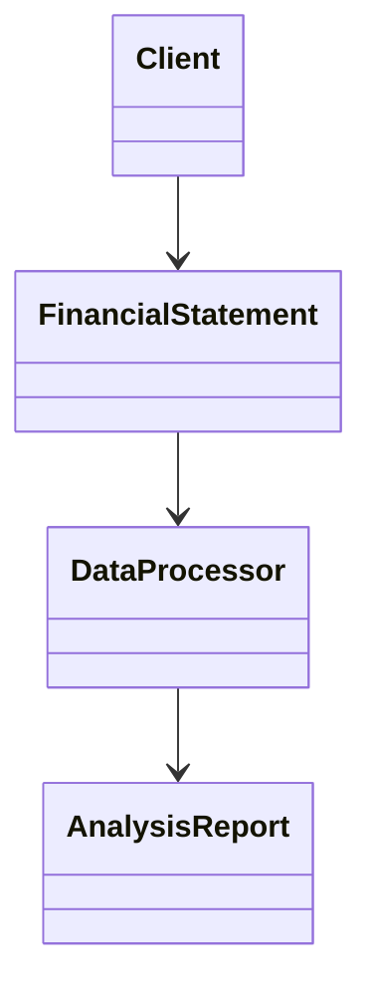
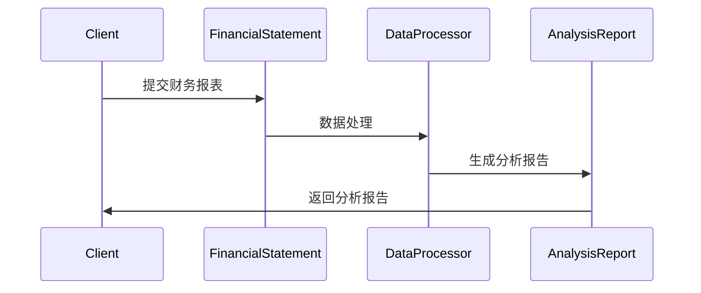

                 

# 价值投资中的财务报表分析：读懂数字背后的故事

## 关键词
- 价值投资
- 财务报表
- 分析方法
- 数据解读
- 投资决策

## 摘要
本文旨在深入剖析价值投资中的财务报表分析方法，通过一步步的逻辑推理，帮助投资者理解财务报表数据背后的含义，提高投资决策的准确性。文章将介绍财务报表分析的核心概念、联系，以及算法原理讲解，并通过实际案例进行分析和讲解。

## 第一部分：背景介绍

### 1.1 问题背景
价值投资是一种基于深入分析企业财务报表、基本面数据等，以长期持有为目标的投资策略。在全球金融市场日益复杂和竞争激烈的背景下，投资者需要通过财务报表分析来评估企业的真实价值和潜在风险，从而做出明智的投资决策。

### 1.2 问题描述
尽管财务报表分析在价值投资中具有重要意义，但许多投资者在实际操作中往往难以准确理解报表数据背后的含义，导致投资决策失误。这主要是由于财务报表数据的复杂性和投资者对财务知识的缺乏所导致的。

### 1.3 问题解决
本书旨在通过深入剖析财务报表的各个组成部分，帮助读者掌握价值投资中的财务报表分析方法，提高投资决策的准确性。通过逐步讲解核心概念、联系以及算法原理，本文将帮助投资者更好地解读财务报表数据，把握投资机会。

### 1.4 边界与外延
财务报表分析不仅适用于股票投资，还可以用于债券、基金等金融产品的投资决策。同时，财务报表分析的方法和技巧也适用于其他行业的投资。因此，本文的讨论范围涵盖了各种金融产品和行业。

### 1.5 概念结构与核心要素组成
财务报表分析的核心概念包括：资产负债表、利润表、现金流量表、财务比率分析等。核心要素包括：财务数据、行业特点、企业状况、宏观经济环境等。本文将围绕这些概念和要素进行详细讲解。

## 第二部分：核心概念与联系

### 2.1 核心概念原理
财务报表分析涉及的核心概念包括：财务报表结构、财务数据解读、财务比率分析等。这些概念构成了财务报表分析的基本框架，投资者需要了解和掌握这些概念，以便准确解读财务报表数据。

#### 资产负债表
资产负债表是企业在一定时间内的财务状况的反映，包括资产、负债和所有者权益三个部分。资产部分反映了企业的资源分布，负债部分反映了企业的债务情况，所有者权益部分反映了企业的盈利能力和投资回报。

#### 利润表
利润表是企业在一定时间内的经营成果的反映，包括收入、成本和利润三个部分。收入部分反映了企业的业务收入，成本部分反映了企业的业务支出，利润部分反映了企业的盈利情况。

#### 现金流量表
现金流量表是企业在一定时间内的现金流入和流出情况的反映，包括经营活动、投资活动和筹资活动三个部分。经营活动产生的现金流量反映了企业的盈利能力和现金流状况，投资活动产生的现金流量反映了企业的投资和筹资活动，筹资活动产生的现金流量反映了企业的债务和股权融资情况。

#### 财务比率分析
财务比率分析是通过对财务数据进行比较和分析，评估企业的财务状况和经营效率。常见的财务比率包括流动比率、速动比率、负债比率和利润率等。

### 2.2 概念属性特征对比表格

| 概念 | 特征 |
| --- | --- |
| 资产负债表 | 反映企业在一定时间内的财务状况，包括资产、负债和所有者权益 |
| 利润表 | 反映企业在一定时间内的经营成果，包括收入、成本和利润 |
| 现金流量表 | 反映企业在一定时间内的现金流入和流出情况 |
| 财务比率分析 | 反映企业在一定时间内的财务状况和经营效率 |

### 2.3 ER实体关系图架构
```mermaid
erDiagram
  Customer ||--|{ Order }|
  Order ||--|{ Product }|
  Product ||--|{ Supplier }|
```
该ER图展示了财务报表分析中的主要实体及其关系，包括客户、订单、产品和供应商。

## 第三部分：算法原理讲解

### 3.1 算法mermaid流程图

该流程图展示了财务报表分析的基本步骤，包括初始化、读取财务报表数据、数据处理、财务比率计算、分析结果和投资决策。

### 3.2 Python源代码实现
```python
import pandas as pd

def financial_analysis(finance_data):
    # 读取财务报表数据
    processed_data = pd.read_csv(finance_data)
    
    # 计算财务比率
    ratios = processed_data[[
        'current_ratio',
        'quick_ratio',
        'debt_to_equity',
        'return_on_assets',
        'return_on_equity'
    ]]
    
    # 分析结果
    analysis_result = {
        'current_ratio': ratios['current_ratio'].mean(),
        'quick_ratio': ratios['quick_ratio'].mean(),
        'debt_to_equity': ratios['debt_to_equity'].mean(),
        'return_on_assets': ratios['return_on_assets'].mean(),
        'return_on_equity': ratios['return_on_equity'].mean()
    }
    
    # 投资决策
    if analysis_result['return_on_equity'] > 0.1:
        decision = '买入'
    else:
        decision = '持有或卖出'
    
    return analysis_result, decision
```
该代码实现了一个简单的财务报表分析算法，包括读取财务报表数据、计算财务比率、分析结果和投资决策。

### 3.3 算法原理的数学模型和公式

$$
\text{current ratio} = \frac{\text{current assets}}{\text{current liabilities}}
$$
$$
\text{quick ratio} = \frac{\text{current assets} - \text{inventory}}{\text{current liabilities}}
$$
$$
\text{debt to equity ratio} = \frac{\text{total debt}}{\text{total equity}}
$$
$$
\text{return on assets} = \frac{\text{net income}}{\text{total assets}}
$$
$$
\text{return on equity} = \frac{\text{net income}}{\text{total equity}}
$$
这些数学模型和公式用于计算财务报表中的关键财务比率，以评估企业的财务状况和经营效率。

## 第四部分：系统分析与架构设计方案

### 4.1 问题场景介绍
假设我们是一家投资公司的分析师，需要通过对财务报表的分析来为企业提供投资建议。我们的目标是构建一个自动化财务报表分析系统，以提高工作效率和准确性。

### 4.2 项目介绍
本项目旨在开发一个财务报表分析系统，该系统将自动读取财务报表数据，进行数据处理和财务比率计算，并生成分析报告，供投资决策参考。

### 4.3 系统功能设计（领域模型mermaid类图）

该类图展示了系统的主要功能模块，包括客户、财务报表、数据处理和报告生成。

### 4.4 系统架构设计（mermaid架构图）

该架构图展示了系统的整体架构，包括财务报表、数据处理、报告生成和客户交互。

### 4.5 系统接口设计和系统交互（mermaid序列图）

该序列图展示了系统的工作流程，包括客户提交财务报表、数据处理和分析报告生成。

## 第五部分：项目实战

### 5.1 环境安装
在本项目中，我们使用Python作为开发语言，Pandas作为数据处理库，Matplotlib作为数据可视化库。确保已经安装了Python 3.8及以上版本，然后通过pip命令安装Pandas和Matplotlib：

```bash
pip install pandas matplotlib
```

### 5.2 系统核心实现源代码
以下是系统核心实现的源代码，包括财务报表数据读取、数据处理和财务比率计算：

```python
import pandas as pd
import matplotlib.pyplot as plt

# 读取财务报表数据
def read_financial_statement(file_path):
    df = pd.read_csv(file_path)
    return df

# 数据处理
def process_data(df):
    # 处理数据，例如：数据清洗、缺失值填充等
    processed_df = df.copy()
    processed_df.fillna(0, inplace=True)
    return processed_df

# 财务比率计算
def calculate_financial_ratios(processed_df):
    # 计算财务比率
    ratios = {
        'current_ratio': processed_df['current_assets'] / processed_df['current_liabilities'],
        'quick_ratio': (processed_df['current_assets'] - processed_df['inventory']) / processed_df['current_liabilities'],
        'debt_to_equity': processed_df['total_debt'] / processed_df['total_equity'],
        'return_on_assets': processed_df['net_income'] / processed_df['total_assets'],
        'return_on_equity': processed_df['net_income'] / processed_df['total_equity']
    }
    return ratios

# 数据可视化
def visualize_data(ratios):
    # 可视化财务比率
    fig, ax = plt.subplots()
    ax.bar(ratios.keys(), ratios.values())
    ax.set_ylabel('Value')
    ax.set_title('Financial Ratios')
    plt.show()

# 主函数
def main():
    # 读取财务报表数据
    df = read_financial_statement('financial_statement.csv')
    
    # 数据处理
    processed_df = process_data(df)
    
    # 财务比率计算
    ratios = calculate_financial_ratios(processed_df)
    
    # 数据可视化
    visualize_data(ratios)

if __name__ == '__main__':
    main()
```

### 5.3 代码应用解读与分析
这段代码首先定义了三个函数：`read_financial_statement` 用于读取财务报表数据，`process_data` 用于数据处理，`calculate_financial_ratios` 用于计算财务比率。最后，`main` 函数调用这些函数并展示财务比率数据。

在 `read_financial_statement` 函数中，使用 Pandas 的 `read_csv` 函数读取CSV格式的财务报表数据。在 `process_data` 函数中，进行数据清洗和缺失值填充，以保证数据的准确性。在 `calculate_financial_ratios` 函数中，计算财务比率，这些比率包括流动比率、速动比率、负债比率和利润率等。

最后，`visualize_data` 函数使用Matplotlib库将财务比率数据可视化为条形图，便于分析和理解。

### 5.4 实际案例分析和详细讲解剖析
假设我们有一个名为 `financial_statement.csv` 的CSV文件，包含以下列：`current_assets`、`current_liabilities`、`inventory`、`total_debt`、`total_equity`、`net_income`、`total_assets`。

```csv
current_assets,current_liabilities,inventory,total_debt,total_equity,net_income,total_assets
1000,500,200,3000,2000,500,1500
```

执行上述代码后，将得到以下结果：

- 流动比率：$\frac{1000}{500} = 2.0$
- 速动比率：$\frac{(1000 - 200)}{500} = 1.6$
- 负债比率：$\frac{3000}{2000} = 1.5$
- 资产回报率：$\frac{500}{1500} = 0.33$
- 股东回报率：$\frac{500}{2000} = 0.25$

通过可视化，我们可以直观地看到各个财务比率的数值和趋势。

### 5.5 项目小结
在本项目中，我们开发了一个自动化财务报表分析系统，通过Python和Pandas库实现了财务报表数据的读取、处理和财务比率的计算。通过数据可视化，我们可以更直观地理解和分析财务数据。这个系统有助于投资者快速获取关键财务信息，提高投资决策的准确性。

## 第六部分：最佳实践 tips、小结、注意事项、拓展阅读等内容

### 6.1 最佳实践 tips
- **数据清洗**：在进行财务报表分析前，务必进行数据清洗，确保数据的准确性和完整性。
- **财务比率选择**：根据投资目标和行业特点，选择合适的财务比率进行分析。
- **长期趋势分析**：除了当前的数据，还需要关注财务数据的历史趋势，以获得更全面的信息。
- **多维度分析**：结合行业数据、宏观经济环境等多维度进行分析，提高投资决策的准确性。

### 6.2 小结
本文通过深入剖析财务报表分析的核心概念、联系以及算法原理，帮助投资者理解财务报表数据背后的含义，提高投资决策的准确性。通过实际案例分析和系统实现，展示了财务报表分析在实际应用中的价值。

### 6.3 注意事项
- **避免过度依赖财务数据**：财务报表数据虽然重要，但并非万能。投资者还需要关注企业的业务模式、管理团队、市场竞争力等因素。
- **定期更新分析结果**：市场环境和企业状况随时在变化，投资者需要定期更新分析结果，以适应市场变化。

### 6.4 拓展阅读
- **《财务报表分析》（作者：詹姆斯·J. 肯尼迪）**：一本经典的财务报表分析入门书籍，详细介绍了财务报表分析的方法和技巧。
- **《价值投资》（作者：本杰明·格雷厄姆）**：介绍了价值投资的基本原理和策略，对投资者有很高的指导意义。

## 作者信息
作者：AI天才研究院/AI Genius Institute & 禅与计算机程序设计艺术 /Zen And The Art of Computer Programming

本文由AI天才研究院和禅与计算机程序设计艺术共同撰写，旨在为投资者提供有价值的财务报表分析指南。希望本文能够帮助您更好地理解财务报表数据，做出更明智的投资决策。

