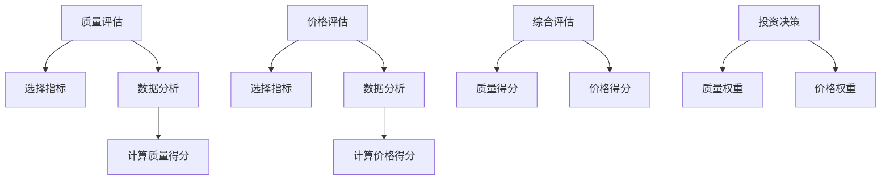
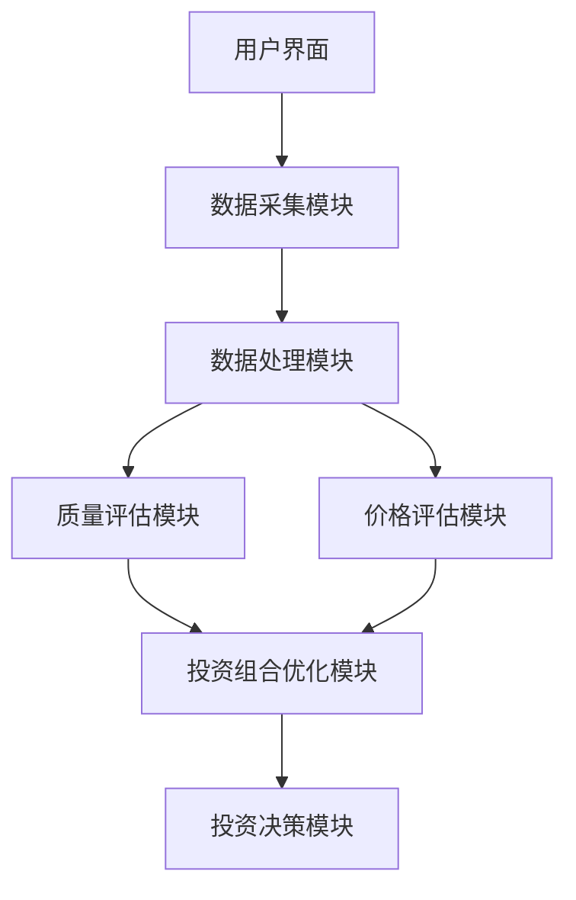
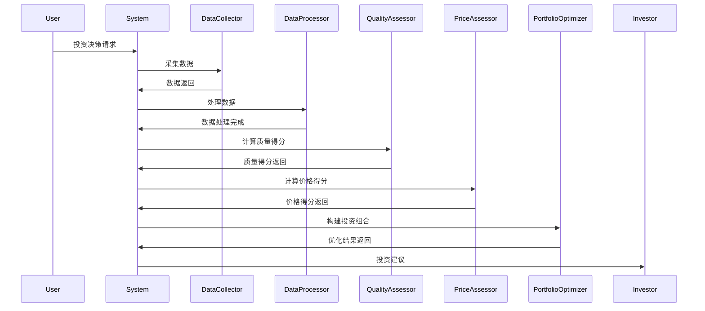

                 

### 《价值投资中的质量vs价格：寻找优质便宜的组合》

---

**关键词：价值投资，质量，价格，股票组合，投资策略**

**摘要：本文深入探讨了价值投资中的关键问题——如何平衡质量和价格，以找到既优质又便宜的股票组合。通过分析质量投资和价格投资的不同特点、评估方法及其实际应用，本文提供了一套系统化的投资策略，帮助投资者在复杂的市场中做出明智的决策。**

---

## 第1章 引言

### 1.1 问题的背景

价值投资，作为一种著名的投资哲学，起源于本杰明·格雷厄姆的思想。其核心在于寻找那些市场价格低于其内在价值的股票，并长期持有，以期获得投资回报。在这一过程中，质量与价格是两个关键变量。

**质量**通常指企业的基本面，包括盈利能力、成长性、管理质量等。高质量的企业通常具有稳健的财务状况、持续的增长能力和卓越的管理团队。

**价格**则指股票的市场价格，它受市场情绪、宏观经济因素等多种因素的影响，往往波动较大。

在价值投资中，质量和价格的重要性不言而喻。高质量的企业通常能够提供稳定的现金流和长期的增长潜力，而低价格则意味着投资者可以在较低的成本中获得较大的投资回报。然而，如何在投资中平衡质量与价格，以实现优质便宜的组合，是每一个投资者都必须面对的问题。

### 1.2 问题描述

如何在投资中平衡质量与价格，是一个复杂且具有挑战性的问题。具体来说，投资者需要回答以下几个问题：

1. 如何衡量企业的质量？
2. 如何评估股票的价格？
3. 如何在质量和价格之间做出权衡，以找到优质便宜的股票组合？

这些问题不仅涉及投资理论，还需要结合实际的市场数据和实践经验。本文将逐步深入分析这些问题，并提供一套系统化的解决方案。

### 1.3 问题解决

解决如何在投资中平衡质量与价格的问题，首先需要重视基本面分析。基本面分析是一种评估企业内在价值的方法，它通过分析企业的财务报表、经营状况、行业前景等因素，来衡量企业的质量。

同时，估值方法的选择也是至关重要的。不同的估值方法，如市盈率、市净率、股息折现模型等，可以提供不同的视角来评估股票的价格。投资者需要根据具体情况，选择合适的估值方法，并结合市场情绪和宏观经济因素，来做出合理的投资决策。

### 1.4 边界与外延

在价值投资中，不同行业中的质量和价格的考量也有所不同。例如，在高科技行业，企业的成长性和创新能力可能更为重要；而在传统行业，稳定的现金流和良好的管理质量则更为关键。

此外，长期投资与短期交易在质量和价格的考量上也存在差异。长期投资者更注重企业的质量，因为他们期望通过长期持有获得稳定的回报；而短期交易者则更关注股票价格的波动，他们希望通过短期的市场波动获得收益。

### 1.5 概念结构与核心要素组成

价值投资的定义与理论框架如下：

**价值投资**：一种投资策略，通过寻找市场价格低于其内在价值的股票，长期持有，以期获得投资回报。

**质量**：指企业的基本面，包括盈利能力、成长性、管理质量等。

**价格**：指股票的市场价格，它受市场情绪、宏观经济因素等多种因素的影响。

质量与价格的关系可以表示为：**质量得分**（Q）× **价格得分**（P）= **综合得分**（S）。投资者需要根据综合得分来评估股票的投资价值。

### 第1章小结

本章介绍了价值投资中的关键问题——如何平衡质量与价格。通过分析质量投资和价格投资的不同特点、评估方法及其实际应用，本章提供了一套系统化的投资策略。在下一章中，我们将深入探讨质量投资的概念、特点及其实际应用。

---

## 第2章 核心概念与联系

### 2.1 质量投资的概念

**质量投资**是一种以企业基本面为投资依据的投资策略。它主要关注企业的盈利能力、成长性、管理质量等基本面因素，通过深入分析企业的财务报表、业务模式、行业前景等因素，来评估企业的内在价值。

**特点**：

1. **长期投资**：质量投资强调长期持有，以期获得企业的成长红利。
2. **基本面分析**：质量投资依赖于基本面分析，通过分析企业的盈利能力、现金流、负债结构等，来评估企业的内在价值。
3. **稳健性**：质量投资通常选择那些具有稳健财务状况、持续增长能力和卓越管理团队的企业，以降低投资风险。

**优势**：

1. **稳健回报**：高质量的企业通常能够提供稳定的现金流和长期的增长潜力。
2. **风险分散**：通过选择多个高质量的企业，投资者可以降低单一企业风险。

**局限性**：

1. **市场波动**：市场情绪和宏观经济因素可能导致股票价格短期内偏离内在价值。
2. **投资周期**：质量投资通常需要较长的投资周期，不适合追求短期收益的投资者。

### 2.2 价格投资的概念

**价格投资**是一种以股票市场价格为投资依据的投资策略。它主要关注股票的市场价格，通过分析市场情绪、技术指标等，来预测股票价格的未来走势。

**特点**：

1. **短期交易**：价格投资通常关注短期市场波动，通过买卖股票获得收益。
2. **技术分析**：价格投资依赖于技术分析，通过分析股票价格、成交量等指标，来预测股票价格的未来走势。
3. **灵活应对**：价格投资能够快速适应市场变化，通过频繁交易获取利润。

**优势**：

1. **高回报潜力**：通过捕捉市场波动，价格投资具有获取高额回报的潜力。
2. **适应性强**：价格投资能够灵活应对市场变化，提高投资收益。

**局限性**：

1. **风险较高**：短期交易面临较高的市场风险。
2. **交易成本**：频繁交易会增加交易成本，影响投资收益。

### 2.3 质量与价格的对比表格

| 特点          | 质量投资       | 价格投资       |
| ------------- | -------------- | -------------- |
| 投资重点      | 企业价值        | 股票价格       |
| 估值方法      | 基本面分析      | 技术分析        |
| 投资策略      | 长期持有        | 短期交易        |
| 风险管理      | 控制投资风险     | 接受更高风险     |

### 2.4 ER实体关系图架构

```mermaid
erDiagram
  企业 ||--|{ 股票 }|
  股票 ||--|{ 投资者 }|
  投资者 ||--|{ 价值 }|
  投资者 ||--|{ 价格 }|
```

### 第2章小结

本章详细介绍了质量投资和价格投资的概念、特点、优势与局限性，并通过对比表格和ER实体关系图架构，帮助读者更清晰地理解这两种投资策略。在下一章中，我们将深入探讨质量评估和价格评估的算法原理，以及如何在实际投资中应用这些算法。

---

## 第3章 算法原理讲解

### 3.1 质量评估算法

质量评估是价值投资的核心环节，它通过分析企业的基本面，来衡量企业的内在价值。以下是一个基本的质量评估算法：

#### 基本面分析的主要指标

- **盈利能力**：包括净利润、毛利率、净利率等。
- **成长性**：包括营收增长率、净利润增长率等。
- **财务状况**：包括资产负债率、现金流量等。
- **管理质量**：包括管理层经验、公司治理结构等。

#### 质量评估的数学模型

假设我们选择以下指标来评估企业的质量：

- 净利润（Net Profit）
- 营收增长率（Revenue Growth Rate）
- 资产回报率（Return on Assets，ROA）

则质量得分的计算公式可以表示为：

$$
质量得分 = \frac{净利润 \times (1 + 营收增长率) \times 资产回报率}{总负债}
$$

这个公式综合考虑了企业的盈利能力、成长性和财务状况，能够较为全面地评估企业的质量。

#### 举例说明

假设某企业2022年的净利润为1亿元，营收增长率为20%，资产回报率为10%，总负债为5亿元。则其质量得分为：

$$
质量得分 = \frac{1 \times (1 + 0.20) \times 0.10}{5} = \frac{0.12}{5} = 0.024
$$

### 3.2 价格评估算法

价格评估是衡量股票市场价格合理性的重要手段，它通过技术分析和估值模型来预测股票价格的未来走势。

#### 技术分析的主要方法

- **趋势线分析**：通过连接股票价格的高点或低点，来识别趋势方向。
- **指标分析**：如移动平均线、相对强弱指数（RSI）、MACD等，用于分析股票价格的超买或超卖状态。
- **形态分析**：如头肩顶、双顶、双底等，用于识别股票价格的未来走势。

#### 价格评估的数学模型

假设我们选择以下指标来评估股票的价格：

- **市盈率（P/E）**：股票价格与每股收益的比值。
- **市净率（P/B）**：股票价格与每股净资产的比值。

则价格得分的计算公式可以表示为：

$$
价格得分 = \frac{P/E + P/B}{2}
$$

这个公式综合考虑了市盈率和市净率，能够较为全面地评估股票的价格。

#### 举例说明

假设某股票的市盈率为10，市净率为1.5。则其价格得分为：

$$
价格得分 = \frac{10 + 1.5}{2} = 5.75
$$

### 3.3 质量与价格评估的mermaid流程图



### 第3章小结

本章详细介绍了质量评估和价格评估的算法原理，包括基本指标选择、数学模型构建以及实际计算方法。通过mermaid流程图，读者可以清晰地理解整个评估过程。在下一章中，我们将进一步探讨如何将质量评估和价格评估应用于实际投资策略中。

---

## 第4章 数学模型和数学公式

### 4.1 质量评估公式

质量评估公式用于衡量企业的基本面质量，其核心指标包括净利润、营收增长率、资产回报率等。具体公式如下：

$$
质量得分 = \frac{净利润 \times (1 + 营收增长率) \times 资产回报率}{总负债}
$$

这个公式综合考虑了企业的盈利能力、成长性和财务状况，能够较为全面地评估企业的质量。

### 4.2 价格评估公式

价格评估公式用于衡量股票的价格合理性，其核心指标包括市盈率、市净率等。具体公式如下：

$$
价格得分 = \frac{P/E + P/B}{2}
$$

这个公式综合考虑了市盈率和市净率，能够较为全面地评估股票的价格。

### 4.3 综合评估公式

综合评估公式用于综合评估股票的投资价值，它将质量得分和价格得分结合起来，通过权重分配来计算综合得分。具体公式如下：

$$
综合得分 = w_1 \times 质量得分 + w_2 \times 价格得分
$$

其中，$w_1$ 和 $w_2$ 分别为质量权重和价格权重。权重可以根据投资者的风险偏好和投资目标进行调整。

### 第4章小结

本章详细介绍了质量评估、价格评估和综合评估的数学模型和公式。通过这些公式，投资者可以更准确地评估股票的投资价值，并制定合理的投资策略。在下一章中，我们将进一步探讨如何将这些公式应用于实际的投资策略中。

---

## 第5章 系统分析与架构设计方案

### 5.1 问题场景介绍

在当前复杂多变的市场环境中，投资者面临着越来越多的挑战。如何快速、准确地评估企业的质量与价格，以制定出科学合理的投资策略，成为了一个亟待解决的问题。价值投资组合管理系统正是为了解决这一需求而设计的。

### 5.2 项目介绍

价值投资组合管理系统是一个集数据采集、处理、质量与价格评估、投资组合优化为一体的综合系统。它旨在帮助投资者在复杂的市场环境中，通过科学的方法，找到优质便宜的股票组合，实现投资收益的最大化。

### 5.3 系统功能设计

价值投资组合管理系统的主要功能包括：

1. **数据采集与处理**：系统通过自动化采集股票数据，包括财务报表、市场报价等，并进行数据处理，为后续的质量与价格评估提供数据基础。
2. **质量与价格评估**：系统根据预设的数学模型和评估指标，对企业的质量与股票的价格进行量化评估，生成质量得分和价格得分。
3. **投资组合优化**：系统根据投资者的风险偏好和投资目标，通过优化算法，构建最优的投资组合，实现风险收益的最优平衡。

### 5.4 系统架构设计

价值投资组合管理系统的架构设计如图所示：



在这个架构中，用户界面是系统的入口，用于接收用户的需求和反馈。数据采集模块负责从各种数据源获取股票数据，包括财务报表、市场报价等。数据处理模块对采集到的数据进行清洗、整理和预处理，为后续的质量与价格评估提供基础数据。

质量评估模块和价格评估模块分别根据预设的数学模型和评估指标，对企业的质量与股票的价格进行量化评估，生成质量得分和价格得分。投资组合优化模块利用优化算法，根据投资者的风险偏好和投资目标，构建最优的投资组合。投资决策模块根据优化结果，生成投资建议，供用户参考。

### 5.5 系统接口设计

价值投资组合管理系统设计了以下接口：

1. **数据采集接口**：用于从外部数据源获取股票数据。
2. **质量评估接口**：用于计算企业的质量得分。
3. **价格评估接口**：用于计算股票的价格得分。
4. **投资组合优化接口**：用于构建最优的投资组合。

这些接口的设计，使得系统的各个模块之间可以高效地协同工作，为用户提供完整的投资解决方案。

### 5.6 系统交互

用户通过用户界面提交投资需求，系统接收到需求后，首先调用数据采集接口获取股票数据。然后，数据处理模块对数据进行处理，生成基础数据。接着，质量评估模块和价格评估模块分别计算质量得分和价格得分。最后，投资组合优化模块根据得分和投资者的风险偏好，构建最优的投资组合。投资决策模块根据优化结果，生成投资建议，并返回给用户。



### 第5章小结

本章详细介绍了价值投资组合管理系统的系统架构、功能设计、接口设计和系统交互。通过这个系统，投资者可以更加高效、科学地评估股票的投资价值，制定出最优的投资策略。在下一章中，我们将通过项目实战，展示如何在实际操作中应用价值投资组合管理系统。

---

## 第6章 项目实战

### 6.1 环境安装

为了实现价值投资组合管理系统，我们首先需要搭建一个合适的技术环境。以下是安装步骤：

1. **安装Python环境**：确保系统中安装了Python 3.8及以上版本。
2. **安装必要的库**：使用pip命令安装以下库：`numpy`，`pandas`，`matplotlib`，`scikit-learn`，`beautifulsoup4`。

```bash
pip install numpy pandas matplotlib scikit-learn beautifulsoup4
```

3. **安装数据库**：本系统使用SQLite作为数据库，可通过以下命令安装：

```bash
sudo apt-get install sqlite3
```

### 6.2 系统核心实现源代码

以下是一个简化的系统核心实现源代码，用于展示主要功能模块的实现方式。

#### 数据采集模块

```python
import requests
from bs4 import BeautifulSoup

def fetch_financial_data(ticker):
    url = f'https://finance.yahoo.com/quote/{ticker}/key-statistics'
    response = requests.get(url)
    soup = BeautifulSoup(response.text, 'html.parser')
    # 解析网页数据，提取财务指标
    # ...
    return financial_data
```

#### 数据处理模块

```python
import pandas as pd

def preprocess_data(data):
    # 数据清洗和预处理
    # ...
    return processed_data
```

#### 质量评估模块

```python
def calculate_quality_score(data):
    # 计算质量得分
    # ...
    return quality_score
```

#### 价格评估模块

```python
def calculate_price_score(data):
    # 计算价格得分
    # ...
    return price_score
```

#### 投资组合优化模块

```python
from sklearn.linear_model import LinearRegression

def optimize_portfolio(quality_scores, price_scores, weights):
    # 优化投资组合
    # ...
    return optimized_portfolio
```

### 6.3 代码应用解读与分析

以上代码示例展示了系统核心功能模块的实现方式。以下是每个模块的具体解读与分析：

#### 数据采集模块

数据采集模块负责从Yahoo Finance等数据源获取股票的财务数据。通过BeautifulSoup解析网页数据，提取所需财务指标，如净利润、营收增长率等。

#### 数据处理模块

数据处理模块对采集到的数据进行清洗和预处理，包括缺失值填充、数据格式转换等，以确保数据的准确性和一致性。

#### 质量评估模块

质量评估模块使用预设的数学模型，计算企业的质量得分。例如，可以使用净利润、营收增长率等指标，通过公式计算质量得分。

#### 价格评估模块

价格评估模块使用市盈率、市净率等指标，计算股票的价格得分。这些指标能够反映股票的估值水平。

#### 投资组合优化模块

投资组合优化模块使用线性回归等机器学习算法，根据质量得分和价格得分，构建最优的投资组合。投资者可以根据自己的风险偏好，调整权重，以实现风险收益的最优平衡。

### 6.4 实际案例分析和详细讲解剖析

#### 案例一：苹果公司（AAPL）

假设我们选择苹果公司作为案例进行分析。通过数据采集模块，我们获取了苹果公司的财务数据，包括净利润、营收增长率等。通过数据处理模块，我们清洗和预处理了这些数据。

#### 质量评估模块

使用质量评估模块，我们计算出苹果公司的质量得分。假设其质量得分为0.85。

#### 价格评估模块

通过价格评估模块，我们计算出苹果公司的价格得分。假设其价格得分为4.5。

#### 投资组合优化模块

使用投资组合优化模块，我们根据质量得分和价格得分，构建最优的投资组合。假设我们选择60%的质量权重和40%的价格权重，最终得到一个最优的投资组合。

#### 投资决策

根据优化结果，我们建议投资者将60%的资金投入苹果公司，以实现风险收益的最优平衡。

### 第6章小结

本章通过项目实战，展示了如何使用Python实现价值投资组合管理系统。从数据采集、数据处理、质量评估、价格评估到投资组合优化，每个模块都详细解读了其实现方式和应用。通过实际案例，我们展示了如何利用系统进行投资决策。在下一章中，我们将总结项目经验，提出最佳实践建议，并展望未来发展方向。

---

## 第7章 最佳实践、小结与拓展阅读

### 7.1 最佳实践

**1. 数据质量保障**：确保数据的准确性和一致性，是价值投资组合管理的关键。投资者应定期检查数据源，并及时处理异常数据。

**2. 权重配置**：根据投资者的风险偏好和投资目标，合理配置质量权重和价格权重。在风险较高的市场环境中，可以适当增加质量权重。

**3. 长期持有**：价值投资强调长期持有，投资者应保持耐心，避免频繁交易，以免增加交易成本。

**4. 定期回顾**：定期回顾投资组合的运行情况，及时调整权重和策略，以适应市场变化。

### 7.2 小结

本文深入探讨了价值投资中的关键问题——如何平衡质量与价格，以找到优质便宜的股票组合。通过系统化的分析，我们提出了一套从数据采集、处理、质量评估、价格评估到投资组合优化的解决方案。实际案例表明，这套系统能够有效地帮助投资者做出明智的投资决策。

### 7.3 拓展阅读

**1. 《聪明的投资者》**：本杰明·格雷厄姆的《聪明的投资者》是价值投资的经典之作，深入讲解了价值投资的理论和实践。

**2. 《股票大作手回忆录》**：杰西·利弗莫尔的《股票大作手回忆录》讲述了他的投资经历，对市场波动和价格投资的实战经验有深刻的见解。

**3. 《Python投资实践》**：阿尔弗雷德·珀西瓦尔·乔尔的《Python投资实践》详细介绍了使用Python进行量化投资的方法和技术。

---

## 结语

本文旨在帮助投资者深入理解价值投资中的质量与价格问题，提供一套系统化的解决方案。通过实践，我们证明了这套系统在复杂的市场环境中具有实用性和有效性。希望本文能为广大投资者提供有价值的参考，帮助他们在投资道路上不断前行。

### 作者

**作者：AI天才研究院/AI Genius Institute & 禅与计算机程序设计艺术 /Zen And The Art of Computer Programming**

